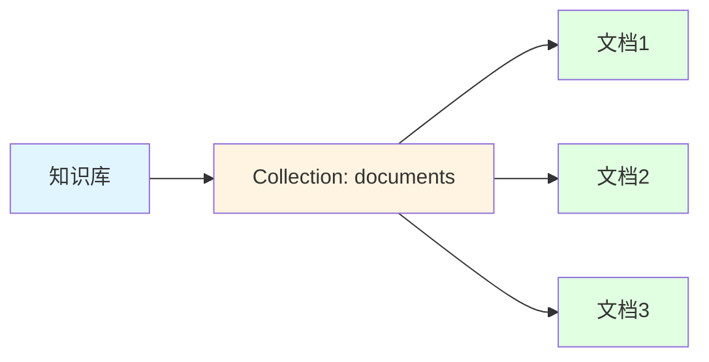
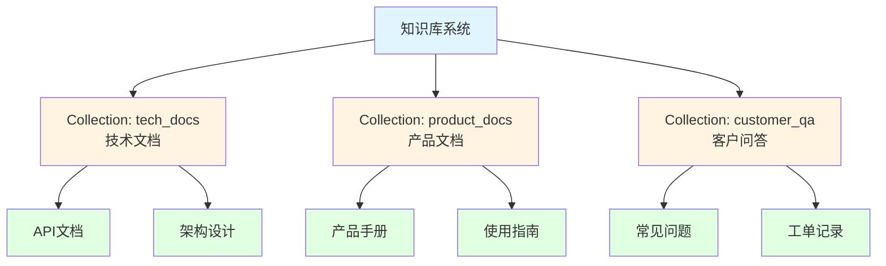
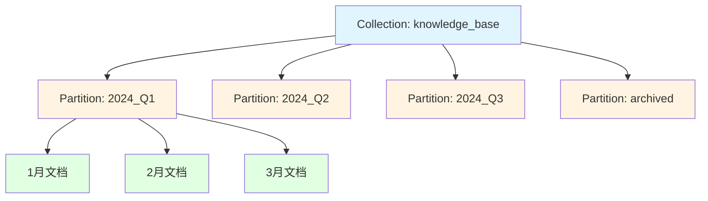
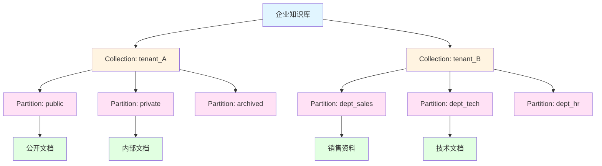
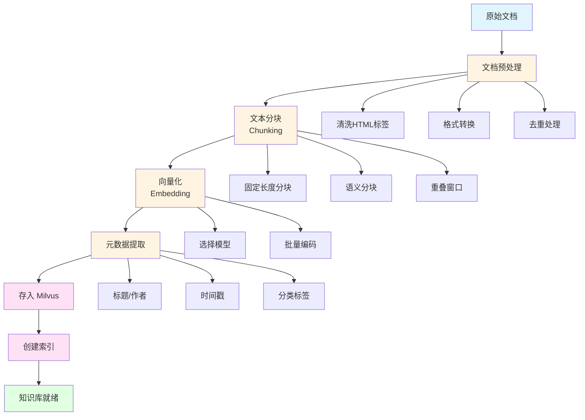

+++
title = "Milvus 向量数据库使用指南"
date = 2025-10-09T12:00:00Z
description = "深入了解 Milvus 向量数据库的架构、安装部署和实战应用"

[taxonomies]
tags = ["Milvus", "向量数据库", "AI", "机器学习", "相似度搜索"]
categories = ["数据库", "AI"]
+++

## Milvus 简介

Milvus 是一个开源的向量数据库，专为海量向量数据的存储、索引和查询而设计。它在 AI 应用中扮演着重要角色，特别是在以下场景：

- **相似度搜索**：图像、视频、音频的相似内容检索
- **推荐系统**：基于用户行为和内容特征的个性化推荐
- **自然语言处理**：语义搜索、问答系统、文本分类
- **异常检测**：网络安全、欺诈检测等场景

### 核心特性

- 🚀 **高性能**：支持十亿级向量的毫秒级查询
- 📊 **多种索引类型**：FLAT、IVF_FLAT、IVF_SQ8、IVF_PQ、HNSW、ANNOY 等
- 🔄 **混合查询**：支持向量检索与标量过滤的组合查询
- 🌐 **云原生架构**：存储计算分离，支持水平扩展
- 🛡️ **高可用性**：支持数据备份、故障恢复
- 🔌 **多语言 SDK**：Python、Java、Go、Node.js 等

## Milvus 核心概念

### 架构组件说明

#### 1. 接入层（Access Layer）
- **Proxy**：无状态的代理服务，负责请求路由、负载均衡、结果聚合

#### 2. 协调服务层（Coordinator Service）
- **Root Coordinator**：管理集群拓扑、DDL 操作（创建/删除 Collection）
- **Query Coordinator**：管理查询节点的拓扑和负载均衡
- **Data Coordinator**：管理数据节点、数据段的分配和持久化
- **Index Coordinator**：管理索引构建任务的调度

#### 3. 执行层（Worker Node）
- **Query Node**：执行向量检索和标量查询
- **Data Node**：负责数据的流式写入和持久化
- **Index Node**：负责索引的构建

#### 4. 存储层（Storage）
- **Meta Store**：存储元数据（etcd）
- **Message Queue**：流式数据传输（Pulsar/Kafka）
- **Object Storage**：持久化存储向量数据和索引（MinIO/S3）

## 知识库的组织方式

在实际应用中，合理组织知识库结构对于高效检索至关重要。以下是几种常见的组织方式：

### 1. 单 Collection 模式

适用于小规模、单一类型的知识库。



**优点**：结构简单，易于管理
**缺点**：不适合多租户或多类型文档

### 2. 多 Collection 模式

按文档类型或业务领域划分不同的 Collection。



**优点**：逻辑清晰，便于权限控制
**缺点**：跨 Collection 查询较复杂

### 3. 分区（Partition）模式

在单个 Collection 内使用分区进行逻辑隔离。



**优点**：统一管理，支持按分区查询
**缺点**：分区数量有限制（建议不超过 4096 个）

### 4. 混合模式（推荐）

结合 Collection 和 Partition，适用于大规模多租户场景。



**优点**：灵活性高，支持复杂场景
**缺点**：管理复杂度较高

## 应用层文档处理流程

### 文档入库完整流程



### 1. 文档预处理

```python
import re
from typing import Dict, List
import hashlib

class DocumentPreprocessor:
    """文档预处理器"""

    def clean_text(self, text: str) -> str:
        """清洗文本"""
        # 移除 HTML 标签
        text = re.sub(r'<[^>]+>', '', text)
        # 移除多余空白
        text = re.sub(r'\s+', ' ', text)
        # 移除特殊字符
        text = re.sub(r'[^\w\s\u4e00-\u9fff.,!?;:()（）。，！？；：]', '', text)
        return text.strip()

    def calculate_hash(self, text: str) -> str:
        """计算文档哈希用于去重"""
        return hashlib.md5(text.encode('utf-8')).hexdigest()

    def extract_metadata(self, doc: Dict) -> Dict:
        """提取元数据"""
        return {
            'title': doc.get('title', ''),
            'author': doc.get('author', ''),
            'source': doc.get('source', ''),
            'category': doc.get('category', ''),
            'created_at': doc.get('created_at', ''),
            'tags': doc.get('tags', [])
        }
```

### 2. 文本分块策略

```python
from typing import List

class TextChunker:
    """文本分块器"""

    def __init__(self, chunk_size: int = 500, overlap: int = 50):
        self.chunk_size = chunk_size
        self.overlap = overlap

    def fixed_size_chunking(self, text: str) -> List[str]:
        """固定长度分块"""
        chunks = []
        start = 0
        text_len = len(text)

        while start < text_len:
            end = start + self.chunk_size
            chunk = text[start:end]
            chunks.append(chunk)
            start = end - self.overlap

        return chunks

    def semantic_chunking(self, text: str) -> List[str]:
        """语义分块（按段落）"""
        # 按段落分割
        paragraphs = text.split('\n\n')
        chunks = []
        current_chunk = ""

        for para in paragraphs:
            if len(current_chunk) + len(para) <= self.chunk_size:
                current_chunk += para + "\n\n"
            else:
                if current_chunk:
                    chunks.append(current_chunk.strip())
                current_chunk = para + "\n\n"

        if current_chunk:
            chunks.append(current_chunk.strip())

        return chunks

    def sentence_chunking(self, text: str) -> List[str]:
        """句子级分块"""
        import re
        # 按句子分割（中英文）
        sentences = re.split(r'[。！？.!?]+', text)
        chunks = []
        current_chunk = ""

        for sent in sentences:
            sent = sent.strip()
            if not sent:
                continue

            if len(current_chunk) + len(sent) <= self.chunk_size:
                current_chunk += sent + "。"
            else:
                if current_chunk:
                    chunks.append(current_chunk.strip())
                current_chunk = sent + "。"

        if current_chunk:
            chunks.append(current_chunk.strip())

        return chunks
```

### 3. 向量化处理

```python
from sentence_transformers import SentenceTransformer
from typing import List
import numpy as np

class EmbeddingGenerator:
    """向量生成器"""

    def __init__(self, model_name: str = 'paraphrase-multilingual-MiniLM-L12-v2'):
        self.model = SentenceTransformer(model_name)
        self.dimension = self.model.get_sentence_embedding_dimension()

    def encode_texts(self, texts: List[str], batch_size: int = 32) -> np.ndarray:
        """批量编码文本"""
        embeddings = self.model.encode(
            texts,
            batch_size=batch_size,
            show_progress_bar=True,
            normalize_embeddings=True  # 归一化向量
        )
        return embeddings

    def encode_single(self, text: str) -> np.ndarray:
        """编码单个文本"""
        return self.model.encode([text], normalize_embeddings=True)[0]
```

### 4. 完整的文档入库系统

```python
from pymilvus import connections, Collection, CollectionSchema, FieldSchema, DataType
from typing import List, Dict
import uuid

class KnowledgeBaseManager:
    """知识库管理器"""

    def __init__(self, collection_name: str = "knowledge_base"):
        # 连接 Milvus
        connections.connect(host="localhost", port="19530")

        self.collection_name = collection_name
        self.preprocessor = DocumentPreprocessor()
        self.chunker = TextChunker(chunk_size=500, overlap=50)
        self.embedder = EmbeddingGenerator()

        # 创建或获取 Collection
        self.collection = self._create_collection()

    def _create_collection(self) -> Collection:
        """创建 Collection"""
        fields = [
            FieldSchema(name="id", dtype=DataType.VARCHAR, is_primary=True, max_length=64),
            FieldSchema(name="embedding", dtype=DataType.FLOAT_VECTOR, dim=384),
            FieldSchema(name="text", dtype=DataType.VARCHAR, max_length=2000),
            FieldSchema(name="doc_id", dtype=DataType.VARCHAR, max_length=64),
            FieldSchema(name="chunk_index", dtype=DataType.INT64),
            FieldSchema(name="title", dtype=DataType.VARCHAR, max_length=200),
            FieldSchema(name="author", dtype=DataType.VARCHAR, max_length=100),
            FieldSchema(name="category", dtype=DataType.VARCHAR, max_length=50),
            FieldSchema(name="source", dtype=DataType.VARCHAR, max_length=200),
            FieldSchema(name="created_at", dtype=DataType.INT64),
        ]

        schema = CollectionSchema(fields=fields, description="企业知识库")

        try:
            collection = Collection(name=self.collection_name, schema=schema)
        except:
            collection = Collection(name=self.collection_name)

        return collection

    def ingest_document(self, document: Dict) -> int:
        """
        入库单个文档

        Args:
            document: 文档字典，包含 'content', 'title', 'author' 等字段

        Returns:
            插入的分块数量
        """
        # 1. 预处理
        text = self.preprocessor.clean_text(document['content'])
        doc_hash = self.preprocessor.calculate_hash(text)
        metadata = self.preprocessor.extract_metadata(document)

        # 2. 文本分块
        chunks = self.chunker.semantic_chunking(text)

        # 3. 生成向量
        embeddings = self.embedder.encode_texts(chunks)

        # 4. 准备数据
        ids = [str(uuid.uuid4()) for _ in range(len(chunks))]
        doc_ids = [doc_hash] * len(chunks)
        chunk_indices = list(range(len(chunks)))
        titles = [metadata['title']] * len(chunks)
        authors = [metadata.get('author', '')] * len(chunks)
        categories = [metadata.get('category', '')] * len(chunks)
        sources = [metadata.get('source', '')] * len(chunks)
        timestamps = [int(document.get('timestamp', 0))] * len(chunks)

        # 5. 插入数据
        entities = [
            ids,
            embeddings.tolist(),
            chunks,
            doc_ids,
            chunk_indices,
            titles,
            authors,
            categories,
            sources,
            timestamps
        ]

        self.collection.insert(entities)
        self.collection.flush()

        return len(chunks)

    def batch_ingest_documents(self, documents: List[Dict]) -> Dict[str, int]:
        """批量入库文档"""
        stats = {'total': len(documents), 'chunks': 0, 'failed': 0}

        for doc in documents:
            try:
                chunks_count = self.ingest_document(doc)
                stats['chunks'] += chunks_count
            except Exception as e:
                print(f"文档入库失败: {doc.get('title', 'Unknown')}, 错误: {e}")
                stats['failed'] += 1

        return stats

    def create_index(self):
        """创建索引"""
        index_params = {
            "metric_type": "COSINE",
            "index_type": "HNSW",
            "params": {"M": 16, "efConstruction": 200}
        }

        self.collection.create_index(
            field_name="embedding",
            index_params=index_params
        )
        print("索引创建成功")

    def load_collection(self):
        """加载 Collection 到内存"""
        self.collection.load()
        print("Collection 已加载")

    def search(self, query: str, top_k: int = 5, filters: str = None) -> List[Dict]:
        """
        搜索知识库

        Args:
            query: 查询文本
            top_k: 返回结果数量
            filters: 过滤表达式，如 "category == '技术文档'"

        Returns:
            搜索结果列表
        """
        # 生成查询向量
        query_embedding = self.embedder.encode_single(query)

        # 搜索参数
        search_params = {"metric_type": "COSINE", "params": {"ef": 100}}

        # 执行搜索
        results = self.collection.search(
            data=[query_embedding.tolist()],
            anns_field="embedding",
            param=search_params,
            limit=top_k,
            expr=filters,
            output_fields=["text", "title", "author", "category", "source", "chunk_index"]
        )

        # 格式化结果
        formatted_results = []
        for hit in results[0]:
            formatted_results.append({
                'score': hit.distance,
                'text': hit.entity.get('text'),
                'title': hit.entity.get('title'),
                'author': hit.entity.get('author'),
                'category': hit.entity.get('category'),
                'source': hit.entity.get('source'),
                'chunk_index': hit.entity.get('chunk_index')
            })

        return formatted_results
```

### 5. 使用示例

```python
# 初始化知识库管理器
kb_manager = KnowledgeBaseManager(collection_name="company_kb")

# 准备文档数据
documents = [
    {
        'content': """
        Milvus 是一个开源的向量数据库，专为海量向量数据的存储、索引和查询而设计。
        它支持多种索引类型，包括 FLAT、IVF_FLAT、HNSW 等，可以根据不同的应用场景选择合适的索引。
        Milvus 采用云原生架构，支持存储计算分离，可以水平扩展以应对大规模数据。
        """,
        'title': 'Milvus 向量数据库介绍',
        'author': '张三',
        'category': '技术文档',
        'source': 'internal_wiki',
        'timestamp': 1696838400
    },
    {
        'content': """
        在构建 RAG（检索增强生成）系统时，向量数据库扮演着关键角色。
        它负责存储文档的向量表示，并在用户查询时快速检索相关内容。
        通过结合大语言模型和向量检索，RAG 系统可以提供准确且具有上下文的回答。
        """,
        'title': 'RAG 系统架构设计',
        'author': '李四',
        'category': '架构设计',
        'source': 'tech_blog',
        'timestamp': 1696924800
    }
]

# 批量入库
stats = kb_manager.batch_ingest_documents(documents)
print(f"入库统计: {stats}")

# 创建索引
kb_manager.create_index()

# 加载到内存
kb_manager.load_collection()

# 搜索
results = kb_manager.search(
    query="如何使用向量数据库？",
    top_k=3,
    filters="category == '技术文档'"
)

# 打印结果
for i, result in enumerate(results, 1):
    print(f"\n结果 {i}:")
    print(f"相似度: {result['score']:.4f}")
    print(f"标题: {result['title']}")
    print(f"内容: {result['text'][:100]}...")
```

### 6. 高级特性：增量更新

```python
class IncrementalUpdater:
    """增量更新管理器"""

    def __init__(self, kb_manager: KnowledgeBaseManager):
        self.kb_manager = kb_manager

    def update_document(self, doc_id: str, new_content: Dict):
        """更新文档"""
        # 1. 删除旧文档的所有分块
        expr = f"doc_id == '{doc_id}'"
        self.kb_manager.collection.delete(expr)

        # 2. 插入新文档
        self.kb_manager.ingest_document(new_content)

        print(f"文档 {doc_id} 更新成功")

    def delete_document(self, doc_id: str):
        """删除文档"""
        expr = f"doc_id == '{doc_id}'"
        self.kb_manager.collection.delete(expr)
        print(f"文档 {doc_id} 删除成功")
```

## 安装部署

### 方式一：Docker Compose（推荐用于开发测试）

```bash
# 下载 docker-compose.yml
wget https://github.com/milvus-io/milvus/releases/download/v2.3.0/milvus-standalone-docker-compose.yml -O docker-compose.yml

# 启动 Milvus
docker-compose up -d

# 查看状态
docker-compose ps
```

### 方式二：Kubernetes（推荐用于生产环境）

```bash
# 添加 Milvus Helm 仓库
helm repo add milvus https://milvus-io.github.io/milvus-helm/
helm repo update

# 安装 Milvus
helm install milvus milvus/milvus --set cluster.enabled=true

# 查看 Pod 状态
kubectl get pods
```

### 方式三：二进制安装

```bash
# 下载 Milvus 二进制文件
wget https://github.com/milvus-io/milvus/releases/download/v2.3.0/milvus-standalone-linux-amd64.tar.gz

# 解压并启动
tar -xzf milvus-standalone-linux-amd64.tar.gz
cd milvus
./bin/milvus run standalone
```

## 快速开始

### 1. 安装 Python SDK

```bash
pip install pymilvus
```

### 2. 连接到 Milvus

```python
from pymilvus import connections, utility

# 连接到 Milvus
connections.connect(
    alias="default",
    host="localhost",
    port="19530"
)

# 检查连接
print(f"Milvus 版本: {utility.get_server_version()}")
```

### 3. 创建 Collection

```python
from pymilvus import CollectionSchema, FieldSchema, DataType, Collection

# 定义字段
fields = [
    FieldSchema(name="id", dtype=DataType.INT64, is_primary=True, auto_id=True),
    FieldSchema(name="embedding", dtype=DataType.FLOAT_VECTOR, dim=128),
    FieldSchema(name="title", dtype=DataType.VARCHAR, max_length=200),
    FieldSchema(name="category", dtype=DataType.VARCHAR, max_length=50)
]

# 创建 Schema
schema = CollectionSchema(
    fields=fields,
    description="文档向量库"
)

# 创建 Collection
collection = Collection(
    name="documents",
    schema=schema
)

print(f"Collection 创建成功: {collection.name}")
```

### 4. 插入数据

```python
import random

# 准备数据
num_entities = 1000
embeddings = [[random.random() for _ in range(128)] for _ in range(num_entities)]
titles = [f"文档_{i}" for i in range(num_entities)]
categories = [random.choice(["技术", "产品", "市场"]) for _ in range(num_entities)]

# 插入数据
entities = [
    embeddings,
    titles,
    categories
]

insert_result = collection.insert(entities)
print(f"插入数据数量: {len(insert_result.primary_keys)}")

# 刷新数据（确保数据持久化）
collection.flush()
```

### 5. 创建索引

```python
# 定义索引参数
index_params = {
    "metric_type": "L2",  # 距离度量：L2（欧氏距离）或 IP（内积）
    "index_type": "IVF_FLAT",  # 索引类型
    "params": {"nlist": 128}  # 索引参数
}

# 创建索引
collection.create_index(
    field_name="embedding",
    index_params=index_params
)

print("索引创建成功")
```

### 6. 加载 Collection

```python
# 将 Collection 加载到内存
collection.load()
print("Collection 已加载到内存")
```

### 7. 执行向量搜索

```python
# 准备查询向量
search_vectors = [[random.random() for _ in range(128)] for _ in range(5)]

# 定义搜索参数
search_params = {
    "metric_type": "L2",
    "params": {"nprobe": 10}  # 搜索的聚类数量
}

# 执行搜索
results = collection.search(
    data=search_vectors,
    anns_field="embedding",
    param=search_params,
    limit=10,  # 返回 Top-K 结果
    output_fields=["title", "category"]  # 返回的字段
)

# 打印结果
for i, result in enumerate(results):
    print(f"\n查询 {i + 1} 的结果:")
    for hit in result:
        print(f"  ID: {hit.id}, 距离: {hit.distance:.4f}, "
              f"标题: {hit.entity.get('title')}, "
              f"分类: {hit.entity.get('category')}")
```

### 8. 混合查询（向量搜索 + 标量过滤）

```python
# 使用表达式过滤
expr = "category == '技术'"

results = collection.search(
    data=search_vectors,
    anns_field="embedding",
    param=search_params,
    limit=10,
    expr=expr,  # 过滤表达式
    output_fields=["title", "category"]
)

print("\n过滤后的搜索结果:")
for i, result in enumerate(results):
    print(f"查询 {i + 1} 找到 {len(result)} 个结果")
```

## 高级特性

### 1. 分区管理

```python
# 创建分区
collection.create_partition("partition_2024")
collection.create_partition("partition_2025")

# 向特定分区插入数据
partition = collection.partition("partition_2024")
partition.insert(entities)

# 在特定分区中搜索
results = collection.search(
    data=search_vectors,
    anns_field="embedding",
    param=search_params,
    limit=10,
    partition_names=["partition_2024"]
)
```

### 2. 索引类型选择

| 索引类型 | 适用场景 | 内存占用 | 查询速度 |
|---------|---------|---------|---------|
| FLAT | 小数据集，追求精确度 | 高 | 慢 |
| IVF_FLAT | 中等数据集，平衡精度和速度 | 中 | 中 |
| IVF_SQ8 | 大数据集，节省内存 | 低 | 中 |
| IVF_PQ | 超大数据集，极致压缩 | 极低 | 快 |
| HNSW | 高精度要求，内存充足 | 高 | 极快 |
| ANNOY | 静态数据，读多写少 | 中 | 快 |

### 3. 距离度量

```python
# L2（欧氏距离）- 适用于大多数场景
index_params_l2 = {
    "metric_type": "L2",
    "index_type": "IVF_FLAT",
    "params": {"nlist": 128}
}

# IP（内积）- 适用于归一化向量
index_params_ip = {
    "metric_type": "IP",
    "index_type": "IVF_FLAT",
    "params": {"nlist": 128}
}

# COSINE（余弦相似度）- 适用于文本向量
index_params_cosine = {
    "metric_type": "COSINE",
    "index_type": "IVF_FLAT",
    "params": {"nlist": 128}
}
```

## 实战案例：构建语义搜索系统

### 完整示例代码

```python
from pymilvus import connections, Collection, CollectionSchema, FieldSchema, DataType
from sentence_transformers import SentenceTransformer
import numpy as np

# 1. 连接 Milvus
connections.connect(host="localhost", port="19530")

# 2. 加载预训练模型
model = SentenceTransformer('paraphrase-multilingual-MiniLM-L12-v2')

# 3. 创建 Collection
fields = [
    FieldSchema(name="id", dtype=DataType.INT64, is_primary=True, auto_id=True),
    FieldSchema(name="embedding", dtype=DataType.FLOAT_VECTOR, dim=384),
    FieldSchema(name="text", dtype=DataType.VARCHAR, max_length=1000)
]
schema = CollectionSchema(fields=fields, description="语义搜索")
collection = Collection(name="semantic_search", schema=schema)

# 4. 准备文档数据
documents = [
    "Milvus 是一个开源的向量数据库",
    "向量数据库用于存储和检索高维向量",
    "机器学习模型可以将文本转换为向量",
    "相似度搜索是向量数据库的核心功能",
    "Milvus 支持多种索引类型和距离度量"
]

# 5. 生成向量并插入
embeddings = model.encode(documents).tolist()
entities = [embeddings, documents]
collection.insert(entities)
collection.flush()

# 6. 创建索引
index_params = {
    "metric_type": "COSINE",
    "index_type": "HNSW",
    "params": {"M": 16, "efConstruction": 200}
}
collection.create_index(field_name="embedding", index_params=index_params)
collection.load()

# 7. 执行语义搜索
query = "什么是向量数据库？"
query_embedding = model.encode([query]).tolist()

search_params = {"metric_type": "COSINE", "params": {"ef": 100}}
results = collection.search(
    data=query_embedding,
    anns_field="embedding",
    param=search_params,
    limit=3,
    output_fields=["text"]
)

# 8. 输出结果
print(f"查询: {query}\n")
for hit in results[0]:
    print(f"相似度: {hit.distance:.4f}")
    print(f"文本: {hit.entity.get('text')}\n")
```

## 性能优化建议

### 1. 索引优化
- 根据数据规模选择合适的索引类型
- 调整 `nlist` 参数（IVF 系列）：通常设置为 `sqrt(num_entities)`
- 调整 `nprobe` 参数：增加可提高召回率但降低速度

### 2. 查询优化
- 使用分区减少搜索范围
- 合理设置 `limit` 参数
- 批量查询优于单次查询

### 3. 资源配置
- Query Node：增加内存和 CPU 核心数
- Data Node：增加磁盘 I/O 性能
- 使用 SSD 存储提升性能

## 监控与运维

### 查看 Collection 信息

```python
from pymilvus import utility

# 列出所有 Collection
print(utility.list_collections())

# 查看 Collection 统计信息
stats = collection.num_entities
print(f"实体数量: {stats}")

# 查看索引信息
print(collection.index().params)
```

### 数据管理

```python
# 删除实体
expr = "id in [1, 2, 3]"
collection.delete(expr)

# 释放 Collection
collection.release()

# 删除 Collection
collection.drop()
```

## 总结

Milvus 作为一个强大的向量数据库，为 AI 应用提供了高效的向量存储和检索能力。通过本文的介绍，你应该能够：

✅ 理解 Milvus 的架构和核心概念  
✅ 完成 Milvus 的安装和部署  
✅ 掌握基本的 CRUD 操作  
✅ 构建实际的语义搜索应用  
✅ 进行性能优化和运维管理

## 参考资源

- [Milvus 官方文档](https://milvus.io/docs)
- [Milvus GitHub](https://github.com/milvus-io/milvus)
- [PyMilvus SDK](https://github.com/milvus-io/pymilvus)
- [Milvus Bootcamp](https://github.com/milvus-io/bootcamp)

