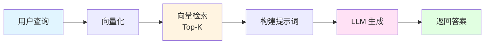
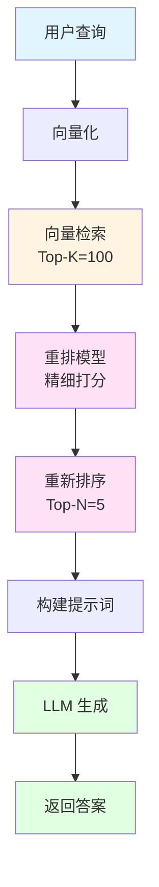
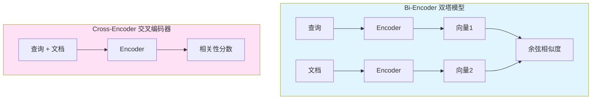
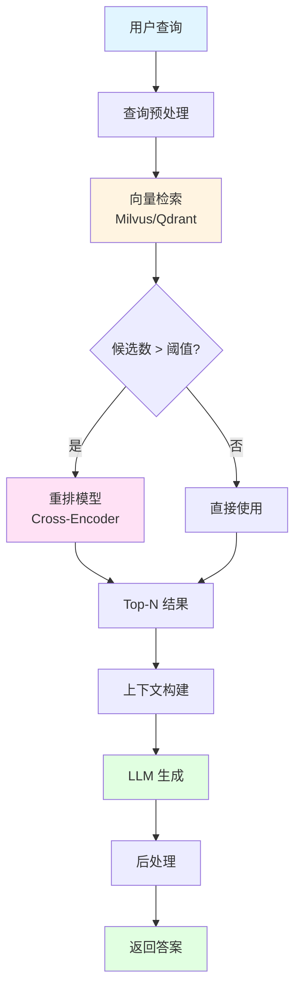

+++
title = "RAG 系统中为什么需要重排(Reranking)?"
date = 2025-10-18T12:00:00Z
description = "深入探讨 RAG 系统中重排机制的必要性、原理和实践方案"

[taxonomies]
tags = ["RAG", "AI", "LLM", "向量检索", "重排序", "信息检索"]
categories = ["AI", "架构设计"]
+++

## 引言

在构建 RAG (Retrieval-Augmented Generation) 系统时,我们经常会遇到这样的问题:向量检索返回的 Top-K 结果中,最相关的文档并不总是排在最前面。这就是为什么我们需要引入**重排(Reranking)**机制。

本文将深入探讨:
- 为什么向量检索的结果不够准确?
- 重排如何解决这个问题?
- 如何在实际项目中实现重排?

## RAG 系统的基本流程

首先,让我们回顾一下标准 RAG 系统的工作流程:



在这个流程中,**向量检索**是关键环节,但它存在一些固有的局限性。

## 向量检索的局限性

### 1. 语义相似 ≠ 相关性

向量检索基于**语义相似度**,但语义相似并不等同于**查询相关性**。

**示例:**

```
查询: "如何提高 Python 代码性能?"

检索结果:
1. "Python 是一种高级编程语言" (相似度: 0.85)
2. "使用 Cython 可以显著提升 Python 性能" (相似度: 0.82)
3. "Python 的性能优化技巧包括..." (相似度: 0.80)
```

虽然第 1 条结果相似度最高,但第 2、3 条才是真正回答问题的内容。

### 2. 向量空间的维度诅咒

在高维向量空间中,距离度量会失去区分度:

```python
# 向量维度越高,距离分布越集中
import numpy as np

def calculate_distance_variance(dim):
    """计算不同维度下距离的方差"""
    vectors = np.random.randn(1000, dim)
    query = np.random.randn(1, dim)
    distances = np.linalg.norm(vectors - query, axis=1)
    return np.var(distances)

# 维度越高,方差越小(区分度越低)
print(f"128维: {calculate_distance_variance(128):.4f}")
print(f"768维: {calculate_distance_variance(768):.4f}")
print(f"1536维: {calculate_distance_variance(1536):.4f}")
```

### 3. 单一向量无法捕获多方面信息

一个文档可能包含多个主题,但只能用一个向量表示:

```
文档: "Python 性能优化指南:包括代码优化、内存管理、并发编程等内容"
向量: [0.12, -0.34, 0.56, ...] (单一表示)

查询1: "Python 内存管理" → 可能匹配度不高
查询2: "Python 并发编程" → 可能匹配度不高
```

### 4. 缺乏精确匹配能力

向量检索难以处理精确匹配需求:

```
查询: "Python 3.11 新特性"
文档1: "Python 3.11 引入了异常组和 TaskGroup"
文档2: "Python 3.10 和 3.12 的新特性对比"

向量检索可能认为两者相似度接近,但文档1才是精确答案
```

## 重排的工作原理

重排(Reranking)是在向量检索之后,使用更精细的模型对候选结果重新排序。

### 完整的 RAG + Reranking 流程



### 两阶段检索策略

| 阶段 | 方法 | 候选数量 | 速度 | 精度 |
|------|------|---------|------|------|
| **第一阶段** | 向量检索 | 100-1000 | 快 | 中 |
| **第二阶段** | 重排模型 | 5-20 | 慢 | 高 |

这种策略平衡了**召回率**和**精确度**:
- 向量检索:快速召回大量候选(高召回率)
- 重排模型:精细筛选最相关结果(高精确度)

## 重排模型的类型

### 1. Cross-Encoder 模型

Cross-Encoder 将查询和文档**同时输入**模型,进行深度交互:

```python
from sentence_transformers import CrossEncoder

# 加载 Cross-Encoder 模型
model = CrossEncoder('cross-encoder/ms-marco-MiniLM-L-6-v2')

query = "如何优化 Python 性能?"
documents = [
    "Python 是一种编程语言",
    "使用 Cython 可以提升 Python 性能",
    "Python 性能优化的十大技巧"
]

# 计算相关性分数
scores = model.predict([(query, doc) for doc in documents])

# 重新排序
ranked_results = sorted(
    zip(documents, scores), 
    key=lambda x: x[1], 
    reverse=True
)

for doc, score in ranked_results:
    print(f"分数: {score:.4f} | 文档: {doc}")
```

**输出:**
```
分数: 0.9234 | 文档: Python 性能优化的十大技巧
分数: 0.8567 | 文档: 使用 Cython 可以提升 Python 性能
分数: 0.3421 | 文档: Python 是一种编程语言
```

### 2. Bi-Encoder vs Cross-Encoder



**对比:**

| 特性 | Bi-Encoder | Cross-Encoder |
|------|-----------|---------------|
| **编码方式** | 分别编码 | 联合编码 |
| **交互深度** | 浅层(向量点积) | 深层(注意力机制) |
| **速度** | 快(可预计算) | 慢(实时计算) |
| **精度** | 中 | 高 |
| **适用场景** | 第一阶段检索 | 第二阶段重排 |

### 3. 常用重排模型

```python
# 1. MS MARCO 系列(英文)
cross_encoder = CrossEncoder('cross-encoder/ms-marco-MiniLM-L-6-v2')

# 2. BGE Reranker(中英文)
from FlagEmbedding import FlagReranker
reranker = FlagReranker('BAAI/bge-reranker-large', use_fp16=True)

# 3. Cohere Rerank API(商业)
import cohere
co = cohere.Client('your-api-key')
results = co.rerank(
    query=query,
    documents=documents,
    top_n=5,
    model='rerank-multilingual-v2.0'
)
```

## 实战:完整的 RAG + Reranking 系统

### 系统架构



### 完整代码实现

```python
from typing import List, Dict
from sentence_transformers import SentenceTransformer, CrossEncoder
from pymilvus import Collection
import numpy as np

class RAGWithReranking:
    """带重排的 RAG 系统"""
    
    def __init__(
        self,
        collection: Collection,
        embedding_model: str = 'paraphrase-multilingual-MiniLM-L12-v2',
        rerank_model: str = 'cross-encoder/ms-marco-MiniLM-L-6-v2'
    ):
        self.collection = collection
        self.embedder = SentenceTransformer(embedding_model)
        self.reranker = CrossEncoder(rerank_model)
        
    def retrieve(
        self,
        query: str,
        top_k: int = 100,
        rerank_top_n: int = 5
    ) -> List[Dict]:
        """
        检索并重排
        
        Args:
            query: 查询文本
            top_k: 向量检索返回数量
            rerank_top_n: 重排后保留数量
        """
        # 1. 向量检索
        query_vector = self.embedder.encode([query])[0]
        
        search_params = {"metric_type": "COSINE", "params": {"ef": 100}}
        results = self.collection.search(
            data=[query_vector.tolist()],
            anns_field="embedding",
            param=search_params,
            limit=top_k,
            output_fields=["text", "title", "source"]
        )
        
        # 2. 提取候选文档
        candidates = []
        for hit in results[0]:
            candidates.append({
                'text': hit.entity.get('text'),
                'title': hit.entity.get('title'),
                'source': hit.entity.get('source'),
                'vector_score': hit.distance
            })
        
        # 3. 重排
        if len(candidates) > rerank_top_n:
            rerank_scores = self.reranker.predict([
                (query, doc['text']) for doc in candidates
            ])
            
            # 添加重排分数
            for doc, score in zip(candidates, rerank_scores):
                doc['rerank_score'] = float(score)
            
            # 按重排分数排序
            candidates.sort(key=lambda x: x['rerank_score'], reverse=True)
            candidates = candidates[:rerank_top_n]
        
        return candidates
    
    def generate_answer(
        self,
        query: str,
        llm_client,
        top_k: int = 100,
        rerank_top_n: int = 5
    ) -> Dict:
        """生成答案"""
        # 1. 检索并重排
        relevant_docs = self.retrieve(query, top_k, rerank_top_n)
        
        # 2. 构建上下文
        context = "\n\n".join([
            f"文档 {i+1} (来源: {doc['source']}):\n{doc['text']}"
            for i, doc in enumerate(relevant_docs)
        ])
        
        # 3. 构建提示词
        prompt = f"""基于以下上下文回答问题:

上下文:
{context}

问题: {query}

请提供准确、详细的答案:"""
        
        # 4. 调用 LLM
        response = llm_client.chat.completions.create(
            model="gpt-4",
            messages=[{"role": "user", "content": prompt}]
        )
        
        return {
            'answer': response.choices[0].message.content,
            'sources': relevant_docs,
            'context': context
        }
```

### 使用示例

```python
from pymilvus import connections, Collection
from openai import OpenAI

# 连接向量数据库
connections.connect(host="localhost", port="19530")
collection = Collection("knowledge_base")
collection.load()

# 初始化 RAG 系统
rag = RAGWithReranking(collection)

# 初始化 LLM 客户端
llm_client = OpenAI(api_key="your-api-key")

# 查询
query = "如何优化 Python 代码的性能?"
result = rag.generate_answer(query, llm_client, top_k=50, rerank_top_n=3)

# 输出结果
print("答案:", result['answer'])
print("\n参考来源:")
for i, doc in enumerate(result['sources'], 1):
    print(f"{i}. {doc['title']} (重排分数: {doc['rerank_score']:.4f})")
```

## 重排的性能优化

### 1. 批量重排

```python
def batch_rerank(self, queries: List[str], documents: List[str]) -> np.ndarray:
    """批量重排,提高吞吐量"""
    pairs = [(q, d) for q in queries for d in documents]
    scores = self.reranker.predict(pairs, batch_size=32)
    return scores.reshape(len(queries), len(documents))
```

### 2. 缓存机制

```python
from functools import lru_cache
import hashlib

class CachedReranker:
    def __init__(self, reranker):
        self.reranker = reranker
        self.cache = {}
    
    def predict(self, query: str, document: str) -> float:
        # 生成缓存键
        cache_key = hashlib.md5(
            f"{query}||{document}".encode()
        ).hexdigest()
        
        if cache_key not in self.cache:
            self.cache[cache_key] = self.reranker.predict([(query, document)])[0]
        
        return self.cache[cache_key]
```

### 3. 混合评分策略

```python
def hybrid_score(
    vector_score: float,
    rerank_score: float,
    alpha: float = 0.7
) -> float:
    """
    混合向量检索分数和重排分数
    
    Args:
        vector_score: 向量相似度分数
        rerank_score: 重排模型分数
        alpha: 重排分数权重
    """
    return alpha * rerank_score + (1 - alpha) * vector_score
```

## 重排的效果评估

### 评估指标

```python
def evaluate_reranking(
    queries: List[str],
    ground_truth: List[List[str]],
    retrieved_docs: List[List[str]],
    reranked_docs: List[List[str]],
    k: int = 5
):
    """评估重排效果"""
    from sklearn.metrics import ndcg_score
    
    # 计算 NDCG@K
    ndcg_before = ndcg_score(ground_truth, retrieved_docs, k=k)
    ndcg_after = ndcg_score(ground_truth, reranked_docs, k=k)
    
    print(f"NDCG@{k} (重排前): {ndcg_before:.4f}")
    print(f"NDCG@{k} (重排后): {ndcg_after:.4f}")
    print(f"提升: {(ndcg_after - ndcg_before) / ndcg_before * 100:.2f}%")
```

## 总结

### 为什么需要重排?

1. **提高精确度**: 向量检索召回,重排精选
2. **语义理解更深**: Cross-Encoder 能捕获查询和文档的深层交互
3. **平衡性能**: 两阶段策略兼顾速度和准确性
4. **提升用户体验**: 更相关的结果排在前面

### 最佳实践

✅ **第一阶段**: 向量检索 Top-100  
✅ **第二阶段**: 重排 Top-5  
✅ **模型选择**: 根据语言选择合适的重排模型  
✅ **性能优化**: 使用批量处理和缓存  
✅ **效果评估**: 定期评估 NDCG 等指标

### 何时使用重排?

| 场景 | 是否需要重排 |
|------|------------|
| 简单问答 | 可选 |
| 复杂查询 | **必须** |
| 多跳推理 | **必须** |
| 精确匹配 | **必须** |
| 实时性要求高 | 可选 |

## 参考资源

- [Sentence Transformers - Cross-Encoders](https://www.sbert.net/examples/applications/cross-encoder/README.html)
- [BGE Reranker](https://github.com/FlagOpen/FlagEmbedding)
- [Cohere Rerank API](https://docs.cohere.com/docs/reranking)
- [MS MARCO Dataset](https://microsoft.github.io/msmarco/)

