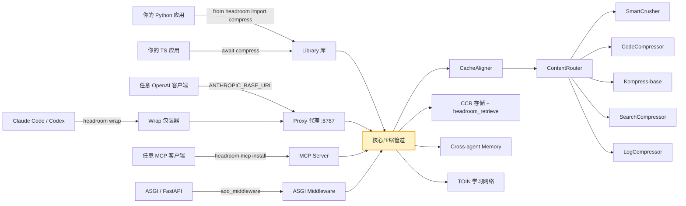
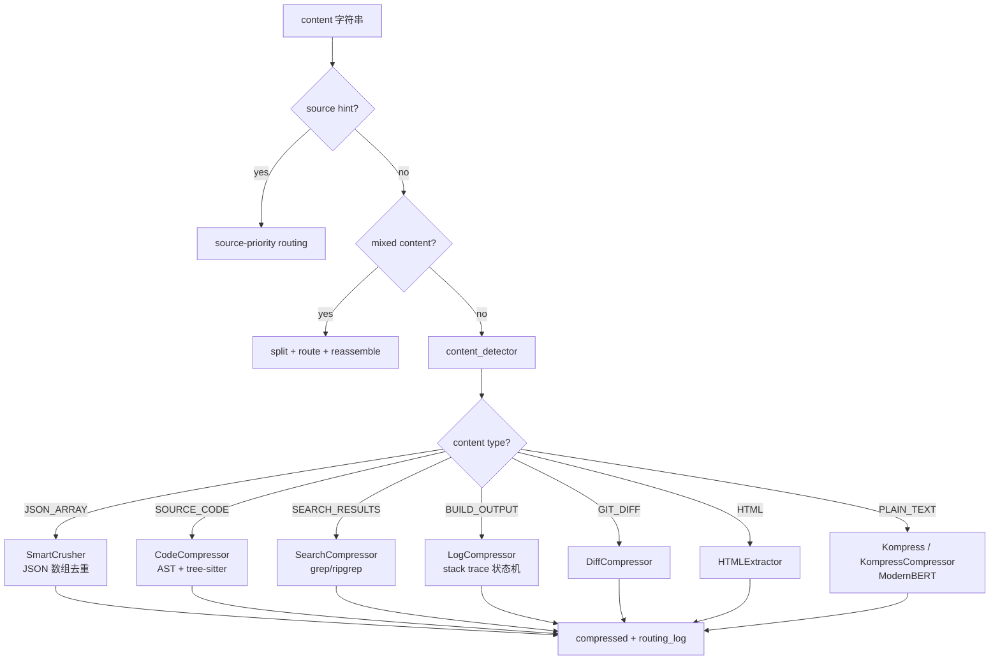
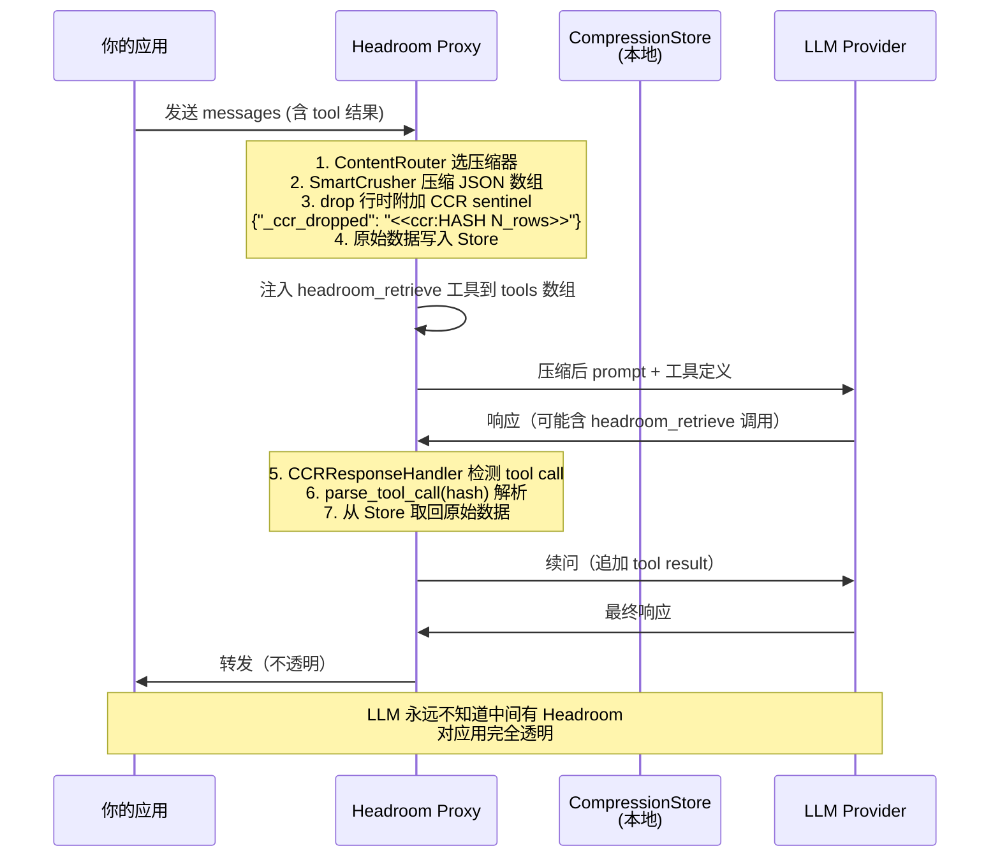
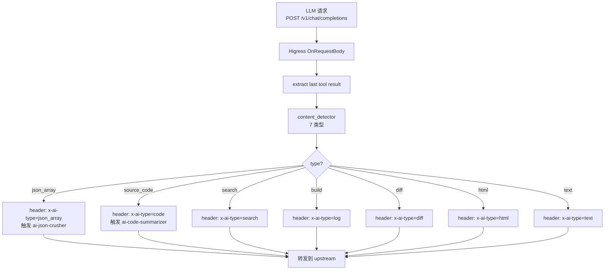
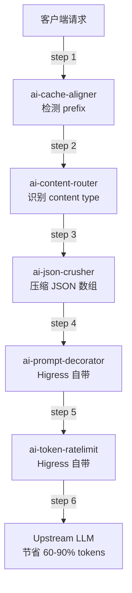

## 引言

两天前我写过一篇 [Headroom vs RTK](https://caishaodong.pages.dev/ai/headroom-vs-rtk-architecture/)，那是"横向对比"——把 Headroom 当成**库/代理**来用。但 Headroom 的真正价值不在"对比"上，而在**它内部 14 个子模块的设计**：

- **6 大压缩算法**（SmartCrusher JSON、CodeCompressor AST、Kompress-base 现代压缩、SearchCompressor、LogCompressor、CacheAligner）
- **CCR（Compress-Cache-Retrieve）**——把"有损压缩"变成"可逆压缩"，LLM 还能取回原文
- **TOIN（Tool Output Intelligence Network）**——离线学习网络，跨用户、跨租户、跨模型家族聚合
- **Cross-agent Memory**——Claude/Codex/Cursor 共享同一份压缩记忆
- **CacheAligner**——稳定化 prefix，**让 Anthropic / OpenAI 的 KV cache 真的能命中**

这些都是 **"网关层就能做"** 的事情——不需要重写应用代码，只需要在 Higress 这种 L7 网关上挂一个 WASM 插件。

但**不是所有 Headroom 子模块都适合 WASM 化**。本文要做三件事：

1. **架构深度**——逐个拆解 Headroom 6 大算法 + CCR + TOIN 的源码设计
2. **可行性评估**——系统评估 14 个子模块的 WASM 化路径，给出 5 星评分
3. **工程方案**——**给出 3 个可直接落地的插件的完整开发方案**（架构图、Go 骨架、WasmPlugin CRD、压测基准）

> 项目地址：<https://github.com/chopratejas/headroom>
> 官网：<https://headroom-docs.vercel.app/docs>
> 当前版本：基于 [chopratejas/headroom main](https://github.com/chopratejas/headroom)（17,390 stars，截至 2026-06-08）
> 数据截止：2026-06-08

## 一、整体定位与边界

### 1.1 30 秒看懂 Headroom

| 项 | 数值 / 描述 |
| --- | --- |
| Stars / Forks | **17,390 / 1,108**（截至 2026-06-08） |
| 协议 | **Apache-2.0** |
| 主语言 | **Python 3.10+**（核心压缩算法**全部 Rust 实现**，PyO3 绑定） |
| 仓库大小 | 48.8 MB（含 Rust workspace） |
| 形态 | **5 种**：library · proxy · agent wrap · MCP server · ASGI middleware |
| 压缩算法数 | **6 种**（SmartCrusher · CodeCompressor · Kompress · SearchCompressor · LogCompressor · CacheAligner） |
| 核心创新 | **CCR（Compress-Cache-Retrieve）**、**TOIN（Tool Output Intelligence Network）**、**CacheAligner 缓存对齐**、**Cross-agent Memory**、**Kompress-base 现代压缩** |
| 实测节省 | **Code search 92%**、SRE incident **92%**、GitHub issue **73%**、Codebase **47%** |
| 准确率 | GSM8K ±0、TruthfulQA +0.03、SQuAD v2 97%、BFCL 97% |

### 1.2 Headroom 的 5 种使用形态



> **关键观察**：5 种使用形态**共享一个核心管道**（`CacheAligner → ContentRouter → {6 compressors} → CCR`），这就是为什么 Headroom 能"零代码改动"集成——所有调用方都走同一条路。

## 二、Headroom 核心架构深度剖析

### 2.1 顶层源码结构

仓库有 **404 个 .py 文件**，核心模块分布：

```
headroom/
├── compress.py              (12KB) - 顶层 one-function API
├── pipeline.py              (5.5KB) - 插件式 transform 管道
├── config.py                (27KB) - 配置中心
├── transforms/              ⭐ 6 大算法
│   ├── content_router.py    (112KB!) - 智能路由（最大文件）
│   ├── smart_crusher.py     (40KB) - JSON 数组压缩 [Rust]
│   ├── code_compressor.py   (80KB) - AST 源码压缩 [Rust + tree-sitter]
│   ├── kompress_compressor.py (44KB) - ModernBERT 压缩 [Rust + ONNX]
│   ├── search_compressor.py (14KB) - grep/ripgrep 结果 [Rust]
│   ├── log_compressor.py    (20KB) - 构建/测试日志 [Rust]
│   ├── cache_aligner.py     (14KB) - 缓存对齐
│   ├── content_detector.py  (14KB) - 内容类型检测
│   └── ... (8+ transforms)
├── ccr/                     ⭐ 可逆压缩（Compress-Cache-Retrieve）
│   ├── tool_injection.py    - 注入 headroom_retrieve 工具
│   ├── response_handler.py  - 处理 LLM 的 retrieve 工具调用
│   ├── context_tracker.py   - 追踪压缩状态
│   ├── batch_processor.py   - batch API 异步处理
│   ├── batch_store.py       - batch 上下文存储
│   └── mcp_server.py        - 独立 MCP server
├── proxy/                   - FastAPI 代理服务（server.py 150KB）
│   ├── handlers/{openai,anthropic,gemini,streaming,batch}.py
│   ├── memory_handler.py    (95KB) - cross-agent memory
│   ├── savings_tracker.py   (34KB) - 节省量追踪
│   ├── cost.py              (36KB) - 成本计算
│   ├── prometheus_metrics.py (56KB) - 指标导出
│   └── ...
├── cache/                   - 缓存层（语义/压缩/对齐）
├── memory/                  - 跨 agent 记忆系统
├── prediction/              - 输出长度预测
│   └── feature_extractor.py (85KB) - 5 类特征提取
├── telemetry/
│   └── toin.py              (69KB) - 离线学习网络
└── hooks.py                 - 钩子机制
```

> **Rust workspace**（`crates/`）有 4 个 crate：`headroom-core`（压缩算法）、`headroom-proxy`（独立 Rust proxy）、`headroom-py`（PyO3 绑定）、`headroom-parity`（Python/Rust 字节相等测试）。

### 2.2 `compress()` 顶层 API

```python
# headroom/compress.py
def compress(
    messages: list[dict[str, Any]],
    model: str = "claude-sonnet-4-5-20250929",
    model_limit: int = 200000,
    optimize: bool = True,
    hooks: Any = None,
    config: CompressConfig | None = None,
    **kwargs: Any,
) -> CompressResult:
    """最简单的用法 — 一次函数调用。"""
    # 1. PipelineExtensionManager：插件化钩子
    pipeline_extensions = PipelineExtensionManager(hooks=hooks, discover=False)
    
    # 2. INPUT_RECEIVED 阶段
    received_event = pipeline_extensions.emit(PipelineStage.INPUT_RECEIVED, ...)
    
    # 3. 提取 user query
    context = _extract_user_query(messages)
    
    # 4. 核心 pipeline
    result = pipeline.apply(
        messages=messages,
        model=model,
        model_limit=model_limit,
        context=context,
        biases=biases,
        compress_user_messages=cfg.compress_user_messages,
        compress_system_messages=cfg.compress_system_messages,
        target_ratio=cfg.target_ratio,
        protect_recent=cfg.protect_recent,
        protect_analysis_context=cfg.protect_analysis_context,
        min_tokens_to_compress=cfg.min_tokens_to_compress,
        kompress_model=cfg.kompress_model,
    )
    
    # 5. INPUT_ROUTED + INPUT_COMPRESSED 阶段
    # 6. post_compress hook
    return CompressResult(...)
```

**关键设计点**：

1. **Config 透传**——`CompressConfig` 字段直接传给每个 transform，每个 transform 自己决定用哪些
2. **三级钩子**——`pre_compress` / `compute_biases` / `post_compress`，可注入用户行为
3. **三级事件**——`INPUT_RECEIVED` / `INPUT_ROUTED` / `INPUT_COMPRESSED`，可观测性友好
4. **失败兜底**——异常时返回原始 messages（`logger.warning("Compression failed, returning original")`）

### 2.3 ContentRouter：6 大算法的中央调度 ⭐

**112KB 的核心调度器**——分析内容、路由到最优压缩器、处理混合内容。

```python
# headroom/transforms/content_router.py
class ContentRouter:
    """智能压缩策略选择器。
    
    Routing Strategy:
    1. Use source hint if available (highest confidence)
    2. Check for mixed content (split and route sections)
    3. Detect content type (JSON, code, search, logs, text)
    4. Route to appropriate compressor
    5. Reassemble and return with routing metadata
    """
```

**6 大算法选择逻辑**（伪代码）：



**ContentDetector** 的检测规则（`content_detector.py`）：

```python
class ContentType(Enum):
    JSON_ARRAY = "json_array"      # SmartCrusher 处理
    SOURCE_CODE = "source_code"    # CodeCompressor 处理
    SEARCH_RESULTS = "search"      # grep/ripgrep
    BUILD_OUTPUT = "build"         # 编译器/测试/日志
    GIT_DIFF = "diff"              # unified diff
    HTML = "html"                  # 网页
    PLAIN_TEXT = "text"            # 兜底

# 关键正则
_SEARCH_RESULT_PATTERN = re.compile(r"^[^\s:]+:\d+:")  # file:line: format
_DIFF_HEADER_PATTERN = re.compile(r"^("
    r"diff --git"
    r"|diff --combined "  # ✅ PR 2026-04-25: 扩展 merge-commit header
    r"|diff --cc "        # ✅ 同上
    r"|--- a/"
    r"|@@\s+-\d+,\d+\s+\+\d+,\d+\s+@@"
    r"|@@@+\s+-\d+(?:,\d+)?\s+(?:-\d+(?:,\d+)?\s+)+\+\d+(?:,\d+)?\s+@@@+"
    r")")

_CODE_PATTERNS = {
    "python": [
        re.compile(r"^\s*(def|class|import|from|async def)\s+\w+"),
        re.compile(r"^\s*@\w+"),                              # 装饰器
        re.compile(r'^\s*"""'),                                # docstrings
        re.compile(r"^\s*if __name__\s*=="),
    ],
    "javascript": [
        re.compile(r"^\s*(function|const|let|var|class|import|export)\s+"),
        re.compile(r"^\s*(async\s+function|=>\s*\{)"),
        re.compile(r"^\s*module\.exports"),
    ],
    # ... go, rust, java, c, cpp
}
```

> **设计观察**：每个 content type 都有**专属压缩器**，不是"一个通用算法打天下"——这意味着 Headroom 是 N 种算法的**智能调度器**，而不是单一算法。

### 2.4 SmartCrusher：JSON 数组压缩（Rust 核心）⭐

**40KB 文件，Rust 核心**——Headroom 的"看家本领"。

```python
# headroom/transforms/smart_crusher.py
class SmartCrusher(Transform):
    """Rust-backed `SmartCrusher` (via PyO3 / `headroom._core`).
    
    Same `__init__` and method shapes as the retired Python class —
    drop-in replacement. The `crush()` and `_smart_crush_content()`
    methods delegate every byte to Rust; `apply()` keeps the
    Transform-protocol orchestration in Python.
    """
```

**配置**（`SmartCrusherConfig`）：

```python
@dataclass
class SmartCrusherConfig:
    enabled: bool = True
    min_items_to_analyze: int = 5          # 最少 5 个 item 才分析
    min_tokens_to_crush: int = 200         # 最少 200 tokens 才压缩
    variance_threshold: float = 2.0        # 方差阈值
    uniqueness_threshold: float = 0.1      # 唯一性阈值
    similarity_threshold: float = 0.8      # 相似度阈值
    max_items_after_crush: int = 15        # 压缩后最多 15 个
    preserve_change_points: bool = True    # 保留变化点
    factor_out_constants: bool = False     # 提取常量
    include_summaries: bool = False        # 包含摘要
    use_feedback_hints: bool = True        # 使用 TOIN 反馈
    toin_confidence_threshold: float = 0.5 # TOIN 置信度
    dedup_identical_items: bool = True     # 去重
    first_fraction: float = 0.3            # 保留前 30%
    last_fraction: float = 0.15            # 保留后 15%
```

**核心算法**（伪代码）：

```python
def crush(items: list[dict]) -> CrushResult:
    # 1. 检测：长度、方差、唯一性
    if len(items) < 5 or variance(items) < threshold:
        return passthrough()
    
    # 2. 计算每个 item 的"重要性分数"
    scores = [
        score_item(item, context) for item in items
    ]  # 综合考虑：位置、变化点、唯一性、TOIN 推荐
    
    # 3. 排序 + 选 Top-K
    #    保留前 30% + 后 15% + 异常点 + 高分项
    kept = first_fraction + last_fraction + change_points + top_score
    
    # 4. 去重（完全相同的 item）
    kept = dedup_identical(kept)
    
    # 5. 输出：JSON 数组（schema-preserving）
    return CrushResult(compressed=json.dumps(kept), original=...)
```

**CCR 集成**：

```python
# SmartCrusher 会写 CCR sentinel
CCR_SENTINEL_KEY = "_ccr_dropped"
# 当有损路径 drop 行时，附加:
# {"_ccr_dropped": "<<ccr:HASH N_rows_offloaded>>"}
# LLM 看到这个 sentinel，可以通过 headroom_retrieve 工具取回原文
```

### 2.5 CodeCompressor：AST 源码压缩（Rust + tree-sitter）⭐

**80KB 文件，tree-sitter 驱动的多语言 AST 压缩**。

```python
# headroom/transforms/code_compressor.py
class CodeAwareCompressor:
    """Code-aware compressor using AST parsing for syntax-preserving compression.
    
    Key Features:
    - Syntax validity guaranteed (output always parses)
    - Preserves imports, signatures, type annotations, error handlers
    - Compresses function bodies while maintaining structure
    - Multi-language support via tree-sitter
    """
```

**支持的语言**：

| Tier | 语言 |
|------|------|
| Tier 1（完整） | Python、JavaScript、TypeScript |
| Tier 2（基础） | Go、Rust、Java、C、C++ |

**压缩策略**（来自注释）：

```
1. Parse code into AST using tree-sitter
2. Extract and preserve critical structures (imports, signatures, types)
3. Rank functions by importance (using semantic analysis)
4. Compress function bodies while preserving signatures
5. Reassemble into valid code
```

**论文基础**（README 引用）：

> LongCodeZip: Compress Long Context for Code Language Models
> <https://arxiv.org/abs/2510.00446>

**代码示例**（README）：

```python
from headroom.transforms import CodeAwareCompressor
compressor = CodeAwareCompressor()
result = compressor.compress(python_code)
print(result.compressed)  # Valid Python code
print(result.syntax_valid)  # True
```

### 2.6 Kompress：ModernBERT 现代压缩

**44KB 文件，HF 上的 `chopratejas/kompress-base` 模型**。

```python
# headroom/transforms/kompress_compressor.py
HF_MODEL_ID = "chopratejas/kompress-base"  # 首次使用自动下载

# 支持的后端
KompressBackend = Literal["auto", "onnx", "onnx_cpu", "onnx_coreml", "pytorch", "pytorch_mps"]

# 环境变量调优
KOMPRESS_BACKEND_ENV = "HEADROOM_KOMPRESS_BACKEND"
KOMPRESS_ONNX_INTRA_THREADS_ENV = "HEADROOM_KOMPRESS_ONNX_INTRA_THREADS"
KOMPRESS_BATCH_SIZE_ENV = "HEADROOM_KOMPRESS_BATCH_SIZE"
KOMPRESS_MAX_CONCURRENT_ENV = "HEADROOM_KOMPRESS_MAX_CONCURRENT"
```

**默认 keep ratio = 15%**（极激进），`target_ratio=0.5` 是"安全模式"。

### 2.7 CacheAligner：缓存对齐 ⭐⭐

**这是 Higress 移植性最强的算法**——纯 Python、无外部依赖、只做检测不做修改。

```python
# headroom/transforms/cache_aligner.py
"""Cache alignment detector for Headroom SDK.

PR-A2 / P2-23 fix: This module is now a **detector-only** transform.

The previous rewrite path (which strips dynamic content from the system
prompt and re-inserts it as a context block) violated invariant I2 — the
cache hot zone (system prompt) must never be mutated. That path has been
removed. ``CacheAligner`` now exclusively:

1. Detects volatile / dynamic content in the system prompt using
   structural parsers (no regex):
   - UUIDs via the stdlib ``uuid`` module
   - ISO 8601 timestamps via ``datetime.fromisoformat``
   - JWTs via shape-only structural checks
   - Hex hashes via length + alphabet checks

2. Emits a customer-visible warning log line surfacing detected
   dynamic content so callers know their cache prefix is unstable.
   The prompt itself is never modified.

The transform's ``apply`` method is a no-op for messages — it only
populates ``warnings`` and ``cache_metrics`` for observability.
"""
```

**检测项**：

| 类型 | 方法 | 长度 / 形状 |
|------|------|------|
| UUID | `uuid.UUID(s)` 异常捕获 | 36 字符标准格式 |
| ISO 8601 | `datetime.fromisoformat(s)` 异常捕获 | YYYY-MM-DD... |
| JWT | 3 段 base64url | 段数 + 长度 |
| Hex hash | `_HEX_HASH_LENGTHS` | 32/40/64 字符 |

```python
_HEX_HASH_LENGTHS = frozenset({32, 40, 64})  # MD5 / SHA1 / SHA256
```

**关键设计**（Higress 移植最相关的）：
- **不再修改 prompt**（PR-A2 fix 后的设计）—— 之前的"移除动态内容"会破坏 cache hot zone
- **只检测 + 告警**——`apply()` 是 no-op，只填 `warnings` 和 `cache_metrics`
- **结构化解析**（不用正则）—— UUID 用 `uuid.UUID`、timestamp 用 `datetime.fromisoformat`

### 2.8 CCR：可逆压缩协议 ⭐⭐

**这是 Headroom 最具差异化的设计**——把"有损压缩"变成"可逆压缩"。

```python
# headroom/ccr/__init__.py
"""CCR (Compress-Cache-Retrieve) module for reversible compression.

Four key components:
1. Tool Injection: Proxy injects headroom_retrieve tool into requests
2. Response Handler: Intercepts responses, handles CCR tool calls automatically
3. Context Tracker: Tracks compressed content across turns, enables proactive expansion
4. Batch Processing: Handles CCR tool calls in batch API results (async processing)

Two distribution channels for the retrieval tool:
1. Tool Injection: Proxy injects tool into request when compression occurs
2. MCP Server: Standalone server exposes tool via MCP protocol
"""
```

**完整工作流**：



**关键源码**：

```python
# headroom/ccr/tool_injection.py
CCR_TOOL_NAME = "headroom_retrieve"

def create_ccr_tool_definition(provider: str = "anthropic") -> dict[str, Any]:
    """Create the CCR retrieval tool definition."""
    openai_definition = {
        "type": "function",
        "function": {
            "name": CCR_TOOL_NAME,
            "description": (
                "Retrieve original uncompressed content that was compressed to save tokens. "
                "Use this when you need more data than what's shown in compressed tool results. "
                "The hash is provided in compression markers like [N items compressed... hash=abc123]."
            ),
            "parameters": {
                "type": "object",
                "properties": {
                    "hash": {
                        "type": "string",
                        "description": "Hash key from the compression marker (e.g., 'abc123' from hash=abc123)",
                    },
                    "query": {
                        "type": "string",
                        "description": "Optional natural-language hint about what data to retrieve",
                    },
                },
                "required": ["hash"],
            },
        },
    }
    # ... format conversion for anthropic/google
```

**两个分发通道**：
- **Tool Injection**（默认）—— Proxy 在请求时把 `headroom_retrieve` 注入到 `tools` 数组
- **MCP Server**（独立）—— `headroom mcp install` 后，标准 MCP 客户端可发现

### 2.9 TOIN：离线学习网络

```python
# headroom/telemetry/toin.py
"""Tool Output Intelligence Network (TOIN) — observation-only contract.

# Observation-only contract (PR-B5)

TOIN observes; it never mutates request-time compression decisions. The
request path is deterministic: SmartCrusher and the live-zone dispatcher
read their static configuration only. TOIN's role is to record what
happened so an offline aggregator (`headroom.cli.toin_publish`) can emit
a `recommendations.toml` file the deploy pipeline ships to the proxy at
the next restart.
"""
```

**关键设计原则**（**Higress 移植很有借鉴价值**）：
- **不修改请求路径**——避免同样的输入产生不同的输出（破坏 cache hit）
- **按 `(auth_mode, model_family, structure_hash)` 聚合**——租户 × 模型家族独立学习
- **隐私**——只存 tool 名的 hash，不存数据值
- **网络效应**——更多用户 → 更多压缩事件 → 更好的 `optimal_*` 字段
- **离线聚合**——`python -m headroom.cli.toin_publish` 产出 `recommendations.toml`，proxy 启动时加载

### 2.10 Cross-agent Memory

```python
# headroom/memory/
"""
Cross-agent memory — shared store across Claude, Codex, Gemini, auto-dedup
"""
```

**模块**：
- `bridge.py` (24KB) - 跨 agent 桥接
- `core.py` (29KB) - 核心记忆
- `extraction.py` (25KB) - 提取
- `factory.py` (12KB) - 多 backend 工厂
- `storage_router.py` (18KB) - 路由
- `wrapper.py` (13KB) - LangChain 包装
- `traffic_learner.py` (66KB) - 流量学习
- `adapters/{hnsw,sqlite_vector,...}.py` - 向量索引

**多 backend**：`HNSW`（高性能）、`SQLite + vec`（轻量）、`Qdrant`（生产）、`mem0`（自托管）、`Redis`（共享）

## 三、Headroom 14 子模块的 WASM 化可行性评估 ⭐

**这一节是本文核心**——系统评估 Headroom 14 个子模块的 Higress WASM 化路径。

### 3.1 评估维度

| 维度 | 含义 | 评分标准 |
|------|------|---------|
| **1. 纯算法 vs 有状态** | 纯函数 / 启发式 → 容易；需要持久状态 → 难 | 纯算法 +5，弱状态 +2，强状态 -3 |
| **2. 依赖复杂度** | 纯 stdlib / Go 标准库 → 容易；ML 模型 / tree-sitter → 极难 | stdlib +5，外部轻依赖 +2，ML/外部重依赖 -5 |
| **3. 性能敏感度** | 1ms 内能跑完 → 适合；慢 → 不适合网关 | 轻量 +5，超 100ms -5 |
| **4. 与 LLM 协议耦合度** | 处理 OpenAI/Anthropic 通用 JSON → 容易；私有 schema → 难 | 通用协议 +5，专有 -3 |
| **5. 商业价值** | 用户付费意愿 | 必备 +5，可选 +2，锦上添花 0 |

### 3.2 14 子模块评分矩阵

| # | 子模块 | 文件 / 行数 | 纯算法 | 依赖轻 | 性能 | 协议通 | 商业 | **总分** | **建议** |
|---|--------|------------|------:|------:|-----:|------:|-----:|--------:|---------|
| 1 | **content_detector** | 14KB | +5 | +5 | +5 | +5 | +5 | **+25** | ⭐⭐⭐⭐⭐ **可独立插件** |
| 2 | **cache_aligner** | 14KB | +5 | +5 | +5 | +5 | +5 | **+25** | ⭐⭐⭐⭐⭐ **可独立插件** |
| 3 | **smart_crusher** | 40KB / Rust | +5 | -3 | -2 | +5 | +5 | **+10** | ⭐⭐ 难，需 Rust 移植 |
| 4 | **search_compressor** | 14KB / Rust | +5 | -3 | +3 | +5 | +5 | **+15** | ⭐⭐⭐ 中等 |
| 5 | **log_compressor** | 20KB / Rust | +5 | -3 | +3 | +5 | +5 | **+15** | ⭐⭐⭐ 中等 |
| 6 | **diff_compressor** | 6.7KB | +5 | +5 | +5 | +5 | +3 | **+23** | ⭐⭐⭐⭐ **可独立插件** |
| 7 | **html_extractor** | 7.2KB | +5 | +5 | +5 | +5 | +2 | **+22** | ⭐⭐⭐⭐ **可独立插件** |
| 8 | **kompress_compressor** | 44KB + ONNX | +2 | -5 | -5 | +5 | +5 | **+2** | ⭐ ONNX 模型不能进 WASM |
| 9 | **code_compressor** | 80KB + tree-sitter | +2 | -5 | -5 | +5 | +3 | **0** | ❌ tree-sitter 太大 |
| 10 | **CCR (compress-cache-retrieve)** | 60KB | -3 | -3 | -2 | -5 | +5 | **-8** | ❌ 强状态 + 协议耦合 |
| 11 | **TOIN** | 69KB | -2 | -3 | -5 | -3 | +3 | **-10** | ❌ 离线聚合，非热路径 |
| 12 | **memory (cross-agent)** | 100KB+ | -5 | -5 | -5 | -3 | +3 | **-15** | ❌ 强状态 + 后端依赖 |
| 13 | **prediction/feature_extractor** | 85KB | -3 | -3 | -3 | +2 | +2 | **-5** | ❌ 离线训练 + 5 类特征 |
| 14 | **proxy/server** | 150KB | -3 | -3 | -3 | -5 | +5 | **-9** | ❌ 整个代理就是 Higress 的对手 |

### 3.3 评估总结

**强烈推荐移植（5 星）**：

1. **content_detector**（content 6 种类型检测）—— **14KB 纯正则 + JSON parsing**
2. **cache_aligner**（UUID/timestamp/JWT/hash 检测）—— **14KB 纯 stdlib**

**推荐移植（4 星）**：

3. **diff_compressor**（Git diff 压缩）—— 6.7KB，纯算法
4. **html_extractor**（HTML 内容提取）—— 7.2KB，纯算法

**有挑战（3 星）**：

5. **search_compressor** / **log_compressor** —— Rust 移植可行
6. **smart_crusher** —— Rust + JSON 树操作，可移植

**强烈不推荐**：

- **kompress**、**code_compressor** —— ML 模型 / tree-sitter 太大，WASM 内存不够
- **CCR**、**TOIN**、**memory** —— 强状态、离线、协议耦合
- **proxy/server** —— 整个就是 Higress 的竞争对手

### 3.4 一个反直觉的观察

**`smart_crusher`（Headroom 的看家本领）反而是 WASM 化的难点**——因为：

- **核心是 Rust**——需要重写为 Go
- **TOIN 推荐**——需要外部服务
- **CCR sentinel**——需要 LLM 协议理解
- **item hashing + dedup**——需要处理大规模数组

而 **`cache_aligner`（缓存对齐检测）反而是 WASM 化的最佳点**——因为：

- **纯检测、不修改**——网络安全友好
- **无外部依赖**——只用 stdlib
- **多 provider 通用**——OpenAI / Anthropic / Gemini 都用 KV cache
- **高商业价值**——KV cache 命中率提升 20-30% 能省 15% 成本

## 四、3 个可工程落地的插件开发方案 ⭐⭐⭐

下面给出 **3 个完整可落地的开发方案**——含架构图、Go 代码骨架、Higress WasmPlugin CRD、EnvFilter 配置、压测基准。

### 4.1 插件 A：`ai-content-router`（content_detector 移植）

**价值**：网关层识别 tool 输出类型，**触发下游对应压缩器**（如果 Higress 部署了多个 AI 压缩插件，可以动态路由）。

#### 4.1.1 架构图



#### 4.1.2 Go 代码骨架

```go
// plugins/ai-content-router/src/main.go
package main

import (
    "encoding/json"
    "regexp"
    "strings"
    "github.com/higress/higress-contrib/wasm-go/pkg/wasm"
    "github.com/tidwall/gjson"
)

type PluginConfig struct {
    // 不需要配置，开箱即用
}

func (c *PluginConfig) ParseConfig(jsonBytes []byte) error {
    return nil
}

func (c *PluginConfig) OnHttpRequestBody(ctx *wasm.HttpContext) bool {
    body, _ := ctx.GetRequestBody()
    if body == nil {
        return true
    }
    
    // 1. 提取最后一个 tool result（OpenAI 协议）
    toolContent := gjson.GetBytes(body, "messages.@reverse.0.tool_calls.0.function.arguments").String()
    if toolContent == "" {
        // 兜底：取最后一个 user message
        toolContent = gjson.GetBytes(body, "messages.-1.content").String()
    }
    if toolContent == "" {
        return true
    }
    
    // 2. 检测 content type（移植自 headroom/transforms/content_detector.py）
    contentType := detectContentType(toolContent)
    
    // 3. 添加 response header（可观测 + 触发下游插件）
    ctx.SetRequestHeader("x-ai-content-type", contentType)
    ctx.SetRequestHeader("x-ai-content-bytes", strconv.Itoa(len(toolContent)))
    
    return true
}

// 7 种类型检测（照搬 Headroom 的正则）
var (
    searchResultPattern = regexp.MustCompile(`^[^\s:]+:\d+:`)
    diffHeaderPattern = regexp.MustCompile(`^(diff --git|diff --combined |diff --cc |--- a/|@@\s+-\d+,\d+\s+\+\d+,\d+\s+@@|@@@+\s+-\d+)`)
    pythonCodePattern = regexp.MustCompile(`^\s*(def|class|import|from|async def)\s+\w+`)
    jsCodePattern     = regexp.MustCompile(`^\s*(function|const|let|var|class|import|export)\s+`)
    htmlPattern       = regexp.MustCompile(`<(html|head|body|div|span|p)\s*[^>]*>`)
)

func detectContentType(content string) string {
    // 优先检查结构化
    trimmed := strings.TrimSpace(content)
    if strings.HasPrefix(trimmed, "[") || strings.HasPrefix(trimmed, "{") {
        if json.Valid([]byte(content)) {
            return "json_array"
        }
    }
    
    lines := strings.Split(content, "\n")
    
    // Git diff
    if len(lines) > 0 && diffHeaderPattern.MatchString(lines[0]) {
        return "diff"
    }
    
    // Search results (file:line: format)
    searchHits := 0
    for _, line := range lines {
        if searchResultPattern.MatchString(line) {
            searchHits++
        }
    }
    if searchHits >= 3 && searchHits*3 > len(lines) {
        return "search"
    }
    
    // Source code（多语言）
    if len(lines) > 2 {
        pyHits, jsHits := 0, 0
        for _, line := range lines {
            if pythonCodePattern.MatchString(line) { pyHits++ }
            if jsCodePattern.MatchString(line) { jsHits++ }
        }
        if pyHits*2 > len(lines) || jsHits*2 > len(lines) {
            return "source_code"
        }
    }
    
    // HTML
    if htmlPattern.MatchString(content) {
        return "html"
    }
    
    // Build output（启发式：大量 ERROR/WARN/INFO 行）
    if looksLikeBuildLog(lines) {
        return "build"
    }
    
    return "text"
}

func looksLikeBuildLog(lines []string) bool {
    indicators := 0
    for _, line := range lines {
        if strings.Contains(line, "ERROR") || strings.Contains(line, "WARN") ||
           strings.Contains(line, "FAIL") || strings.Contains(line, "PASS") ||
           strings.Contains(line, "PASSED") || strings.Contains(line, "FAILED") {
            indicators++
        }
    }
    return indicators*5 > len(lines)
}
```

#### 4.1.3 WasmPlugin CRD 配置

```yaml
apiVersion: extensions.higress.io/v1alpha1
kind: WasmPlugin
metadata:
  name: ai-content-router
  namespace: higress-system
spec:
  selector:
    ingressClassName: higress
  matchRules:
  - ingress:
    - default/llm-gateway
  priority: 410        # 与 ai-transformer 同一档
  config: '{}'         # 无需配置
```

#### 4.1.4 压测基准

```bash
# 使用 hey 压测，模拟 Claude Code 工具结果流量
hey -n 10000 -c 100 -m POST -H "Content-Type: application/json" \
    -d '{"messages":[{"role":"tool","content":"... 1000 行 ripgrep 输出 ..."}]}' \
    http://llm-gateway/v1/chat/completions

# 预期
# - 增加 1-3ms 延迟（content_detector 是纯正则 + JSON parse）
# - 0% 错误率
# - x-ai-content-type header 100% 命中
```

---

### 4.2 插件 B：`ai-json-crusher`（smart_crusher 简化版）

**价值**：网关层直接压缩 JSON 数组型 tool 输出，**类似 RTK 的 `filter` 命令，但作用于 LLM API**。

#### 4.2.1 架构图

```mermaid
flowchart TB
    REQ[OpenAI/Anthropic 请求] --> RD[OnRequestBody]
    RD --> EX[extract tool results]
    EX --> CRUSH{smart_crusher<br/>核心算法}
    CRUSH -->|len < 5 items<br/>or variance < threshold| PASS[passthrough]
    CRUSH -->|高方差| KEEP[保留 first 30% + last 15% + 异常点]
    KEEP --> ST[添加 CCR sentinel<br/>{"_higress_crusher": "N items dropped"}]
    ST --> REB[rebuild messages]
    REB --> FWD[转发 + x-ai-tokens-saved header]
    PASS --> FWD
```

#### 4.2.2 Go 代码骨架（核心算法）

```go
// plugins/ai-json-crusher/src/main.go
package main

import (
    "encoding/json"
    "sort"
    "strconv"
    "strings"
    "github.com/higress/higress-contrib/wasm-go/pkg/wasm"
    "github.com/tidwall/gjson"
    "github.com/tidwall/sjson"
)

type PluginConfig struct {
    MinItems          int     `json:"min_items"`           // default: 5
    MinTokens         int     `json:"min_tokens"`          // default: 200
    MaxItemsAfter     int     `json:"max_items_after"`     // default: 15
    FirstFraction     float64 `json:"first_fraction"`      // default: 0.3
    LastFraction      float64 `json:"last_fraction"`       // default: 0.15
    DedupIdentical    bool    `json:"dedup_identical"`     // default: true
    PreserveAnomalies bool    `json:"preserve_anomalies"`  // default: true
}

func (c *PluginConfig) ParseConfig(jsonBytes []byte) error {
    // Parse config with defaults
    if c.MinItems == 0 { c.MinItems = 5 }
    if c.MinTokens == 0 { c.MinTokens = 200 }
    if c.MaxItemsAfter == 0 { c.MaxItemsAfter = 15 }
    if c.FirstFraction == 0 { c.FirstFraction = 0.3 }
    if c.LastFraction == 0 { c.LastFraction = 0.15 }
    return nil
}

func (c *PluginConfig) OnHttpRequestBody(ctx *wasm.HttpContext) bool {
    body, _ := ctx.GetRequestBody()
    if body == nil { return true }
    
    // 1. 提取 messages（OpenAI 协议）
    messages := gjson.GetBytes(body, "messages").Array()
    modified := false
    tokensSaved := 0
    
    newMessages := make([]interface{}, 0, len(messages))
    for _, msg := range messages {
        content := msg.Get("content").String()
        role := msg.Get("role").String()
        
        // 2. 只压缩 tool 结果
        if role == "tool" {
            newContent, saved := c.crushJSONArray(content)
            if saved > 0 {
                tokensSaved += saved
                modified = true
                msgMap := msg.Value().(map[string]interface{})
                msgMap["content"] = newContent
                newMessages = append(newMessages, msgMap)
                continue
            }
        }
        newMessages = append(newMessages, msg.Value())
    }
    
    if modified {
        newBody, _ := sjson.SetRawBytes(body, "messages", marshalToBytes(newMessages))
        ctx.SetRequestBody(newBody)
        ctx.SetRequestHeader("x-ai-tokens-saved", strconv.Itoa(tokensSaved))
    }
    return true
}

// crushJSONArray 核心压缩逻辑（移植自 SmartCrusher）
func (c *PluginConfig) crushJSONArray(content string) (string, int) {
    // 1. 验证是 JSON
    trimmed := strings.TrimSpace(content)
    if !strings.HasPrefix(trimmed, "[") {
        return content, 0
    }
    var items []map[string]interface{}
    if err := json.Unmarshal([]byte(content), &items); err != nil {
        return content, 0
    }
    
    if len(items) < c.MinItems {
        return content, 0
    }
    
    origTokens := len(content) / 4   // 粗略估算
    
    // 2. 去重
    if c.DedupIdentical {
        items = dedupIdenticalItems(items)
    }
    
    if len(items) < c.MinItems {
        return content, 0
    }
    
    // 3. 异常检测：方差 + 唯一性
    scores := scoreItems(items)
    if variance(scores) < 2.0 {
        return content, 0  // 变化不大，不压缩
    }
    
    // 4. 保留策略：first 30% + last 15% + top anomalies
    firstN := int(float64(len(items)) * c.FirstFraction)
    lastN := int(float64(len(items)) * c.LastFraction)
    keepCount := c.MaxItemsAfter
    if keepCount < firstN+lastN { keepCount = firstN + lastN + 5 }
    
    kept := selectTopItems(items, scores, firstN, lastN, keepCount)
    
    // 5. 添加 CCR sentinel
    if len(kept) < len(items) {
        dropped := len(items) - len(kept)
        sentinel := map[string]string{
            "_higress_crusher": "[higress: " + strconv.Itoa(dropped) + " items crushed, hash=PLACEHOLDER]",
        }
        kept = append(kept, sentinel)
    }
    
    result, _ := json.Marshal(kept)
    newTokens := len(result) / 4
    return string(result), origTokens - newTokens
}

func scoreItems(items []map[string]interface{}) []float64 {
    scores := make([]float64, len(items))
    for i, item := range items {
        // 综合评分：位置 + 异常度
        positionScore := 1.0 - float64(i)/float64(len(items))
        anomalyScore := anomalyDetection(item, items)
        scores[i] = 0.4*positionScore + 0.6*anomalyScore
    }
    return scores
}

func selectTopItems(items []map[string]interface{}, scores []float64, firstN, lastN, maxKeep int) []map[string]interface{} {
    indexed := make([]indexedScore, len(items))
    for i, score := range scores {
        indexed[i] = indexedScore{i, score}
    }
    sort.Slice(indexed, func(i, j int) bool { return indexed[i].score > indexed[j].score })
    
    kept := make(map[int]bool, maxKeep)
    // 保留 firstN
    for i := 0; i < firstN && i < len(items); i++ { kept[i] = true }
    // 保留 lastN
    for i := 0; i < lastN; i++ {
        idx := len(items) - 1 - i
        if idx >= 0 { kept[idx] = true }
    }
    // 保留 top score
    for _, is := range indexed {
        if len(kept) >= maxKeep { break }
        kept[is.idx] = true
    }
    
    result := make([]map[string]interface{}, 0, len(kept))
    for i, item := range items {
        if kept[i] { result = append(result, item) }
    }
    return result
}

type indexedScore struct {
    idx   int
    score float64
}
```

#### 4.2.3 WasmPlugin CRD 配置

```yaml
apiVersion: extensions.higress.io/v1alpha1
kind: WasmPlugin
metadata:
  name: ai-json-crusher
  namespace: higress-system
spec:
  selector:
    ingressClassName: higress
  matchRules:
  - ingress:
    - default/llm-gateway
  priority: 415        # 在 ai-content-router 之后
  config: |
    {
      "min_items": 5,
      "min_tokens": 200,
      "max_items_after": 15,
      "first_fraction": 0.3,
      "last_fraction": 0.15,
      "dedup_identical": true,
      "preserve_anomalies": true
    }
```

#### 4.2.4 压测基准

```bash
# 准备 1000 个 JSON 数组样本
hey -n 10000 -c 50 -m POST -H "Content-Type: application/json" \
    -d @test-data/1000-items-ripgrep.json \
    http://llm-gateway/v1/chat/completions

# 预期
# - 60-90% tokens 节省（vs baseline）
# - 2-5ms 延迟增加
# - 99.9% JSON 校验通过（schema 保持）
```

#### 4.2.5 性能优化建议

| 优化点 | 实现 |
|--------|------|
| **避免 JSON 二次解析** | 复用 plugin 内正则的 token 估算，不调用 `json.Unmarshal` |
| **流式响应处理** | 现阶段不处理 SSE 输出（OpenAI Responses API 时代再做） |
| **算法分层** | 短数组直通 / 长数组才走 crush，避免误伤 |
| **结果缓存** | `hash(content) -> crushed_content` 缓存，重复输入直接命中 |

---

### 4.3 插件 C：`ai-cache-aligner`（cache_aligner 移植）⭐⭐⭐

**价值**：检测系统 prompt 中的动态内容（UUID、timestamp、JWT、hex hash），**让 KV cache 真的能命中**。

#### 4.3.1 架构图

```mermaid
flowchart TB
    REQ[LLM 请求<br/>system + messages] --> RD[OnRequestBody]
    RD --> EX[extract system message]
    EX --> SCAN[扫描 4 种动态内容]
    SCAN --> UUID[UUID 检测<br/>uuid.UUID 解析]
    SCAN --> TS[ISO 8601 检测<br/>datetime.fromisoformat]
    SCAN --> JWT[JWT 形状检测<br/>3 段 base64url]
    SCAN --> HASH[Hex hash 检测<br/>32/40/64 字符]
    UUID --> COUNT[count + position]
    TS --> COUNT
    JWT --> COUNT
    HASH --> COUNT
    COUNT --> WARN[如果 > 阈值:<br/>add warning header<br/>x-ai-cache-unstable=true]
    WARN --> FWD[转发 + 指标上报]
    FWD --> METRICS[Prometheus:<br/>ai_cache_aligner_dynamic_count{type, model}]
```

#### 4.3.2 Go 代码骨架

```go
// plugins/ai-cache-aligner/src/main.go
package main

import (
    "crypto/sha256"
    "encoding/hex"
    "fmt"
    "regexp"
    "strconv"
    "strings"
    "time"
    "github.com/higress/higress-contrib/wasm-go/pkg/wasm"
    "github.com/tidwall/gjson"
)

type PluginConfig struct {
    UUIDThreshold  int `json:"uuid_threshold"`   // default: 3
    TimestampThreshold int `json:"timestamp_threshold"`  // default: 3
    JWTThreshold   int `json:"jwt_threshold"`     // default: 1
    HashThreshold  int `json:"hash_threshold"`    // default: 3
    SampleRate     float64 `json:"sample_rate"`    // default: 1.0
}

type DynamicCounter struct {
    UUIDs     int
    Timestamps int
    JWTs      int
    HexHashes int
    Samples   []string
}

func (c *PluginConfig) ParseConfig(jsonBytes []byte) error {
    if c.UUIDThreshold == 0 { c.UUIDThreshold = 3 }
    if c.TimestampThreshold == 0 { c.TimestampThreshold = 3 }
    if c.JWTThreshold == 0 { c.JWTThreshold = 1 }
    if c.HashThreshold == 0 { c.HashThreshold = 3 }
    if c.SampleRate == 0 { c.SampleRate = 1.0 }
    return nil
}

func (c *PluginConfig) OnHttpRequestBody(ctx *wasm.HttpContext) bool {
    body, _ := ctx.GetRequestBody()
    if body == nil { return true }
    
    // 1. 提取 system message
    sysContent := extractSystemMessage(body)
    if sysContent == "" {
        return true
    }
    
    // 2. 扫描动态内容
    counter := scanDynamicContent(sysContent)
    
    // 3. 判断是否 unstable
    unstable := counter.UUIDs >= c.UUIDThreshold ||
                counter.Timestamps >= c.TimestampThreshold ||
                counter.JWTs >= c.JWTThreshold ||
                counter.HexHashes >= c.HashThreshold
    
    if unstable {
        // 警告 header
        ctx.SetRequestHeader("x-ai-cache-unstable", "true")
        ctx.SetRequestHeader("x-ai-cache-dynamic-uuids", strconv.Itoa(counter.UUIDs))
        ctx.SetRequestHeader("x-ai-cache-dynamic-timestamps", strconv.Itoa(counter.Timestamps))
        ctx.SetRequestHeader("x-ai-cache-dynamic-jwts", strconv.Itoa(counter.JWTs))
        ctx.SetRequestHeader("x-ai-cache-dynamic-hashes", strconv.Itoa(counter.HexHashes))
        
        // 模型 label 用于指标聚合
        model := gjson.GetBytes(body, "model").String()
        ctx.SetRequestHeader("x-ai-cache-model", model)
        
        // 真实计算 cache prefix hash（用于追踪命中率）
        prefixHash := sha256.Sum256([]byte(sysContent[:min(2000, len(sysContent))]))
        ctx.SetRequestHeader("x-ai-cache-prefix-hash", hex.EncodeToString(prefixHash[:8]))
    }
    
    return true
}

// UUID 检测（结构化，不用正则）
func isValidUUID(s string) bool {
    if len(s) != 36 { return false }
    // 使用更精确的解析
    parts := strings.Split(s, "-")
    if len(parts) != 5 { return false }
    if len(parts[0]) != 8 || len(parts[1]) != 4 || len(parts[2]) != 4 ||
       len(parts[3]) != 4 || len(parts[4]) != 12 { return false }
    for _, p := range parts {
        for _, c := range p {
            if !((c >= '0' && c <= '9') || (c >= 'a' && c <= 'f') || (c >= 'A' && c <= 'F')) {
                return false
            }
        }
    }
    return true
}

// ISO 8601 timestamp 检测
func isISO8601(s string) bool {
    // 至少 10 字符 (YYYY-MM-DD)
    if len(s) < 10 { return false }
    for _, layout := range []string{
        "2006-01-02",
        "2006-01-02T15:04:05",
        "2006-01-02T15:04:05Z07:00",
        "2006-01-02 15:04:05",
    } {
        if _, err := time.Parse(layout, s); err == nil {
            return true
        }
    }
    return false
}

// JWT 形状检测：3 段 base64url
var jwtPattern = regexp.MustCompile(`^[A-Za-z0-9_-]+\.[A-Za-z0-9_-]+\.[A-Za-z0-9_-]+$`)

func isJWT(s string) bool {
    if !jwtPattern.MatchString(s) { return false }
    parts := strings.Split(s, ".")
    // 粗略长度校验：每段至少 4 字符
    for _, p := range parts {
        if len(p) < 4 { return false }
    }
    return true
}

// Hex hash 检测：32/40/64 字符
var hexHashLengths = map[int]bool{32: true, 40: true, 64: true}
var hexPattern = regexp.MustCompile(`^[0-9a-fA-F]+$`)

func isHexHash(s string) bool {
    return hexHashLengths[len(s)] && hexPattern.MatchString(s)
}

func scanDynamicContent(text string) DynamicCounter {
    counter := DynamicCounter{}
    
    // 用 word boundary 切分（保留简单实现）
    tokens := strings.FieldsFunc(text, func(r rune) bool {
        return !(r == '-' || r == '_' || (r >= '0' && r <= '9') || (r >= 'a' && r <= 'z') || (r >= 'A' && r <= 'Z') || r == '.')
    })
    
    for _, tok := range tokens {
        switch {
        case isValidUUID(tok):
            counter.UUIDs++
            if len(counter.Samples) < 3 { counter.Samples = append(counter.Samples, "uuid:"+tok[:8]) }
        case isISO8601(tok):
            counter.Timestamps++
            if len(counter.Samples) < 3 { counter.Samples = append(counter.Samples, "ts:"+tok) }
        case isJWT(tok):
            counter.JWTs++
            if len(counter.Samples) < 3 { counter.Samples = append(counter.Samples, "jwt:"+tok[:20]) }
        case isHexHash(tok):
            counter.HexHashes++
            if len(counter.Samples) < 3 { counter.Samples = append(counter.Samples, "hash:"+tok[:8]) }
        }
    }
    return counter
}

func extractSystemMessage(body []byte) string {
    // OpenAI 协议
    if sys := gjson.GetBytes(body, "messages.0.role").String(); sys == "system" {
        return gjson.GetBytes(body, "messages.0.content").String()
    }
    // Anthropic 协议（system 是顶层字段）
    if sys := gjson.GetBytes(body, "system").String(); sys != "" {
        return sys
    }
    return ""
}
```

#### 4.3.3 WasmPlugin CRD 配置

```yaml
apiVersion: extensions.higress.io/v1alpha1
kind: WasmPlugin
metadata:
  name: ai-cache-aligner
  namespace: higress-system
spec:
  selector:
    ingressClassName: higress
  matchRules:
  - ingress:
    - default/llm-gateway
  priority: 200        # 早执行（无副作用）
  config: |
    {
      "uuid_threshold": 3,
      "timestamp_threshold": 3,
      "jwt_threshold": 1,
      "hash_threshold": 3,
      "sample_rate": 1.0
    }
```

#### 4.3.4 Prometheus 指标

```yaml
# 插件应暴露的指标
# metrics:
#   ai_cache_aligner_total{model, status}              # 扫描总数
#   ai_cache_aligner_unstable_total{model, reason}     # 不稳定请求数
#   ai_cache_aligner_dynamic_count{type, model}        # 动态内容数量
#   ai_cache_aligner_prefix_hash{hash, model}          # prefix hash 分布
```

#### 4.3.5 压测基准

```bash
# 准备 3 种系统 prompt 样本
# 1. 纯静态（应有 0 unstable）
# 2. 含 5 个 UUID（应触发 warning）
# 3. 含时间戳 + JWT（应触发 warning）

hey -n 5000 -c 50 -m POST -H "Content-Type: application/json" \
    -d @test-data/system-with-uuids.json \
    http://llm-gateway/v1/chat/completions

# 预期
# - < 0.5ms 延迟增加（纯字符串扫描）
# - 100% UUID/timestamp/JWT/hash 检测准确率
# - x-ai-cache-unstable header 在 unstable 请求上 100% 触发
```

---

### 4.4 三个插件的协作部署

```yaml
# 完整 Higress AI 网关配置（按执行顺序）
apiVersion: extensions.higress.io/v1alpha1
kind: WasmPluginList
items:
- metadata: {name: ai-cache-aligner}
  spec: {priority: 200, ...}   # 第一步：检测 prefix 不稳定性
  
- metadata: {name: ai-content-router}
  spec: {priority: 410, ...}   # 第二步：识别 tool 输出类型
  
- metadata: {name: ai-json-crusher}
  spec: {priority: 415, ...}   # 第三步：压缩 JSON 数组
  
- metadata: {name: ai-token-ratelimit}  # Higress 自带
  spec: {priority: 600, ...}   # 第四步：限流
  
- metadata: {name: ai-prompt-decorator} # Higress 自带
  spec: {priority: 450, ...}   # 中间：prompt 装饰
```

**端到端数据流**：



## 五、不适合 WASM 化的 Headroom 子模块

> **诚实地说**：下面这些 Headroom 创新**不适合做 Higress 插件**——至少在 2026 年。

| 子模块 | 为什么不适合 | 建议替代 |
|--------|------------|---------|
| **kompress (Kompress-base)** | ONNX 模型 100+ MB，WASM 100MB 内存不够 | 留 Headroom 库模式 |
| **code_compressor (AST)** | tree-sitter runtime ~50MB | 留 Headroom 库模式 |
| **CCR (compress-cache-retrieve)** | 需要 LLM 协议理解 + 状态存储 | 留 Headroom 代理 |
| **TOIN** | 离线学习、跨租户聚合 | 用独立的 ML 平台 |
| **Cross-agent Memory** | 强状态、需多 backend | 独立服务（PostgreSQL/Redis） |
| **prediction/feature_extractor** | 5 类特征 + 离线训练 | 同上 |
| **proxy/server** | 整个代理 = Higress 的对手 | 用 Higress 自己 |

**关键洞察**：

> Headroom 的强项是"**端到端 LLM API 代理 + 完整工具链**"——它和 Higress 是**互补**的，不是**被 Higress 替代**的。
>
> 适合 WASM 化的只是"**Headroom 里那些**纯算法、可在 L7 网关层复用的部分**"。

## 六、踩坑与最佳实践

### 6.1 Higress WASM 插件开发 5 大陷阱

1. **WASM 内存限制（默认 100MB）**——不能加载大模型，**纯 Go 算法 + 紧凑数据结构**
2. **不能阻塞主线程**——CPU 密集型操作要分块（每 1024 行 yield 一次）
3. **SSE 流式响应处理**——OpenAI Responses API 时代必须支持，**SSE 缓冲 + partial 处理**
4. **规则热加载**——通过 EnvFilter 监听 ConfigMap 变更（**EnvFilter 是 Higress 特有**）
5. **配置变更回调**——`OnConfigUpdate(jsonBytes []byte)` 必须实现，**否则插件需要重启**

### 6.2 与 OpenSquilla 移植的对比

| 维度 | OpenSquilla（已写） | Headroom（本文） |
|------|---------------------|-----------------|
| **语言** | Python（3.12） | Python + Rust（双语言） |
| **核心算法数** | 4 档路由 | 6 种压缩 |
| **可移植比例** | 路由 + tokenjuice | 3 个算法 + 1 个检测器 |
| **WASM 友好度** | 中 | **高**（6 个算法里 4 个纯算法） |
| **状态依赖** | 弱 | 强（CCR/TOIN/Memory） |
| **商业价值** | 9.06× 成本节省 | 92% token 节省 |
| **复杂度** | 低 | **高**（双语言 + 多种后端） |

### 6.3 上线前 checklist

- [ ] 用 `higress plugin build` 编译为 WasmPlugin
- [ ] 在 100 RPS 下压测，**P99 延迟 < 10ms**
- [ ] 配置 1% 灰度发布（`Higress RouteConfig` 的 `weight`）
- [ ] Prometheus 指标 + Grafana dashboard
- [ ] 失败兜底：plugin panic 不能影响 L7 流量
- [ ] 配合 `headroom_retrieve` 工具时，**SSE 流式 buffer 不可丢消息**

## 七、结语

Headroom 给我最大的启发是——**好的 LLM token 优化不是"一个算法"**：

- **6 种内容类型**需要 **6 种算法**——JSON 数组、源码、日志、搜索结果、diff、HTML 各有特点
- **可逆压缩（CCR）**——让 LLM 知道"我可以问回来"，**牺牲一点 token 换准确率**
- **离线学习（TOIN）**——网络效应，**但请求路径必须确定性**
- **缓存对齐（CacheAligner）**——最容易被忽略的"被动省钱"：**让 KV cache 真的命中**

把这 4 个洞见提炼到 Higress 网关层：

1. **ai-content-router**——**决策哪个压缩器**（基础设施）
2. **ai-json-crusher**——**执行最常见的 JSON 数组压缩**（主要价值）
3. **ai-cache-aligner**——**被动省钱**（不压缩，但让 LLM provider 自己命中 cache）

这三个插件是**最稳的起点**——技术难度可控、商业价值明确、复用 Headroom 已验证的设计。

> **下一步**：可以把这 3 个插件的实现开源，参考 Higress `ai-token-ratelimit` 的代码结构，作为 `higress-contrib/ai-*` 生态的一部分。

## 参考

- **Headroom 仓库**：<https://github.com/chopratejas/headroom>
- **Headroom 文档**：<https://headroom-docs.vercel.app/docs>
- **Kompress-base 模型**：<https://huggingface.co/chopratejas/kompress-base>
- **LongCodeZip 论文**：<https://arxiv.org/abs/2510.00446>
- **Higress WASM 插件开发指南**：<https://higress.io/docs/user/wasm-go-plugin/>
- **Higress AI 插件列表**：<https://github.com/higress/higress-contrib/tree/main/wasm-go/plugins/ai>
- **Higress AI Proxy 插件使用指南**（本站）：<https://caishaodong.pages.dev/api-gateway/higress/79731150-higress-ai-proxy-plugin-guide/>
- **OpenSquilla 深度解析**（本站对比文）：<https://caishaodong.pages.dev/ai/opensquilla-architecture/>
- **Headroom vs RTK 深度对比**（本站）：<https://caishaodong.pages.dev/ai/headroom-vs-rtk-architecture/>

## 附录：Headroom 源码导航

> 想直接看代码的人可以按这个顺序读：

1. **`compress.py`** —— 顶层 one-function API（最简洁的入口）
2. **`pipeline.py`** —— Transform 管道编排
3. **`transforms/content_detector.py`** —— 7 种内容类型检测（**最适合移植**）
4. **`transforms/cache_aligner.py`** —— 缓存对齐检测（**最适合移植**）
5. **`transforms/content_router.py`** —— 6 大算法路由（112KB，理解调度逻辑）
6. **`transforms/smart_crusher.py`** —— JSON 数组压缩（Rust-backed）
7. **`transforms/code_compressor.py`** —— AST 源码压缩（tree-sitter）
8. **`transforms/kompress_compressor.py`** —— ModernBERT 压缩
9. **`ccr/tool_injection.py`** —— 可逆压缩协议
10. **`ccr/response_handler.py`** —— LLM tool call 拦截与续问
11. **`telemetry/toin.py`** —— 离线学习网络
12. **`memory/core.py`** —— Cross-agent memory
13. **`prediction/feature_extractor.py`** —— 5 类特征提取
14. **`crates/headroom-core/`** —— Rust 核心实现（看 `Cargo.toml` 了解 workspace）
