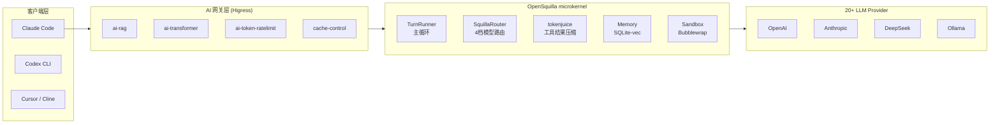
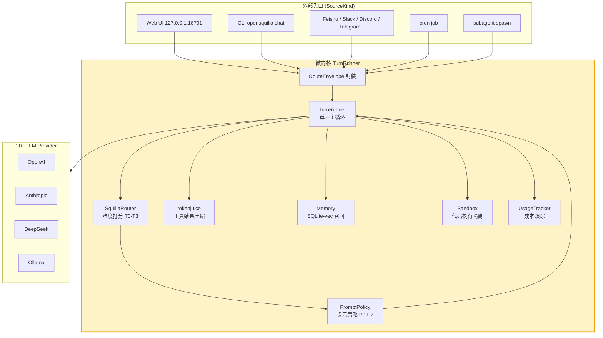
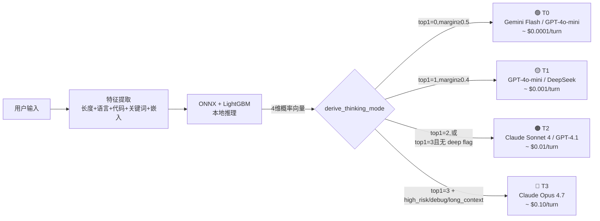
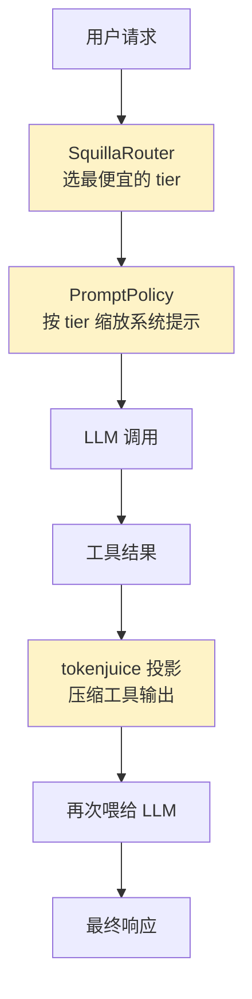
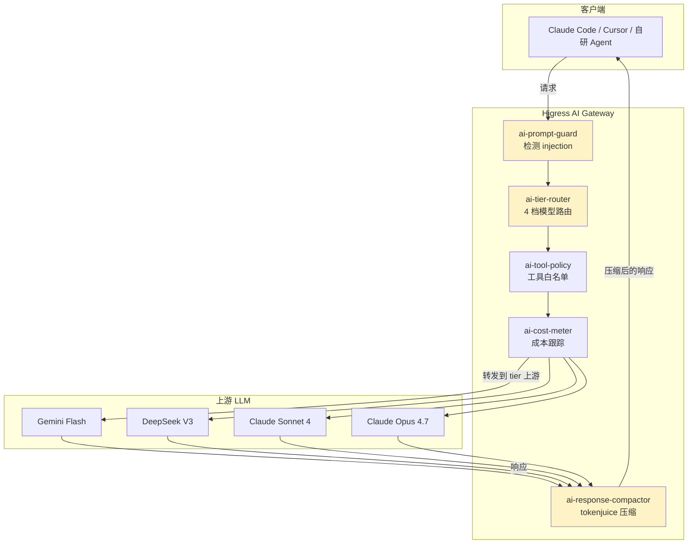

## 引言

如果你关注 2026 年 AI Agent 框架的演进，会注意到 [OpenSquilla](https://github.com/opensquilla/opensquilla) 这个名字——3,506 stars、271 forks、Apache-2.0 协议、用 Python 3.12+ 实现，主打"**Same budget, more capability, better results**"（同样预算、更高能力密度）的微内核（microkernel）AI Agent。

> 项目地址：<https://github.com/opensquilla/opensquilla>
> 官网：<https://opensquilla.ai>
> 文档：<https://opensquilla.ai/docs/>
> 当前版本：0.3.1（2026 年 6 月）

如果说 Hermes Agent 是"通用个人 AI 助手"，OpenClaw 是"统一 token 优化外壳"，那 **OpenSquilla 走的是第三条路**——**把"Token 高效"做到路由、提示、工具结果压缩、内存召回的全链路每一节**，并把"微内核"理念应用到 Agent 框架本身：所有入口（Web UI、CLI、14+ 聊天渠道）共享同一个 `TurnRunner` 主循环。

更吸引我的是：**它内置了 [tokenjuice](https://github.com/vincentkoc/tokenjuice) 的 Python 端口**（`src/opensquilla/plugins/tokenjuice/`），用来压缩 LLM 工具调用返回的原始文本——这跟我之前分析过的 [RTK](https://github.com/rtk-ai/rtk) 和 [Headroom](https://github.com/chopratejas/headroom) 是同一赛道，但**架构上更彻底**。

本文要回答三个问题：

1. **架构** —— OpenSquilla 是怎么用 Python 3.12 把"微内核"理念落到 AI Agent 框架上的？核心 14 个子系统怎么协同？
2. **使用方式** —— 从 0 到跑通"在飞书里对话、跑定时任务、迁移 Hermes 内存"最快要哪些命令？
3. **Higress WASM 插件化** —— OpenSquilla 里的哪些技术点（**模型路由分级 / Token 预算拦截 / 提示注入防护 / 沙箱策略 / 可观测埋点**）可以提炼成独立插件，部署在 Higress 网关上为 LLM API 调用做"AI 网关层增强"？

## 一、整体定位与亮点

### 1.1 30 秒看懂 OpenSquilla

| 项 | 数值 / 描述 |
| --- | --- |
| Stars / Forks | **3,506 / 271**（截至 2026-06-08） |
| 协议 | **Apache-2.0** |
| 主语言 | **Python 3.12+**（局部 C 扩展：ONNX Runtime） |
| 仓库大小 | ~12 MB（不含 LFS 模型） |
| LLM Provider | **20+**：OpenRouter、OpenAI、Anthropic、Ollama、DeepSeek、Gemini、Qwen/DashScope、Moonshot、Mistral、Groq、Zhipu、SiliconFlow、vLLM、LM Studio… |
| 聊天渠道 | **14+**：Terminal、WebSocket、Slack、Telegram、Discord、Feishu(飞书)、DingTalk(钉钉)、WeCom(企业微信)、Matrix、QQ、MS Teams… |
| 核心创新 | **SquillaRouter**（本地 LightGBM + ONNX 4 档路由）、**内置 tokenjuice**、**microkernel turn loop**、**3 层沙箱策略** |
| PinchBench 1.2.1 | 0.9251 分 / 1.78M tokens / **$0.688**（OpenClaw 同分用 $6.233） |
| MCP 支持 | ✅ 客户端 + 服务端（`opensquilla mcp-server run`） |

> **核心命题**：与其训练一个更大的模型，不如**把每次对话的 token 用在刀刃上**——80% 的轮次用 T0/T1 模型就够，剩下 20% 才升级到 Opus 4.7 这种重型模型。

### 1.2 OpenSquilla 在 AI Agent 生态中的位置



> 蓝色高亮（`SQ`、`TJ`）是 OpenSquilla 最具差异化的两个子系统——也是我们后面重点提炼成 Higress WASM 插件的部分。

### 1.3 与同类项目的横向对比

| 维度 | **OpenSquilla** | [Hermes Agent](https://github.com/) | [OpenClaw](https://github.com/openclaw/openclaw) | LangGraph |
| --- | --- | --- | --- | --- |
| 形态 | 单进程 + 14 渠道 | 终端 + 飞书 + Web | 桌面 GUI | 编排框架 |
| Token 优化 | **路由 + 提示 + 工具结果 三层** | 内存召回 | 桌面侧拦截 | 取决于应用 |
| 模型路由 | **本地 4 档 LightGBM** | ❌ | ❌ | ❌ |
| 内置 MCP | ✅ Client + Server | Client | ❌ | ❌ |
| 微内核 turn loop | ✅ | 部分 | ❌ | 节点式 |
| Apache-2.0 | ✅ | ✅ | ❌ | ✅ |
| PinchBench 1.2.1 | 0.9251 / **$0.688** | — | 0.9255 / $6.233 | — |

> **关键差距**：OpenSquilla 用 **9.06× 更便宜的成本** 跑出了和 OpenClaw（Opus 4.7）几乎打平的 PinchBench 分数。**省钱的来源不是"更便宜的模型"，而是"更聪明的路由"**。

## 二、架构深度剖析

### 2.1 顶层目录：14 个子系统

`src/opensquilla/` 下的目录结构本身就是架构图：

```
opensquilla/
├── agents/         # Agent 注册、作用域、限额
├── application/    # Onboarding 向导、审批队列、意图缓存
├── channels/       # 14+ 聊天渠道适配器（feishu/slack/...）
├── chat/           # 交互式终端 REPL
├── cli/            # opensquilla 命令入口
├── compat/         # 第三方框架兼容层
├── contracts/      # 跨子系统接口契约
├── contrib/        # 社区贡献插件
├── engine/         # ⭐ 核心 agent loop（agent.py 257KB, runtime.py 237KB）
├── gateway/        # ⭐ Starlette ASGI 服务（127.0.0.1:18791）
├── health/         # /health, /healthz 检查
├── identity/       # 账户、身份、token 管理
├── mcp/ + mcp_server/  # MCP 客户端 + 服务端
├── memory/         # ⭐ 长期记忆、sqlite-vec 语义召回
├── migration/      # 从 OpenClaw / Hermes 迁移
├── observability/  # 日志、追踪、指标
├── onboarding/     # 首次启动向导
├── persistence/    # SQLite 会话/回放存储
├── plugins/        # ⭐ 内置 tokenjuice 工具结果压缩
├── provider/       # 20+ LLM provider 注册中心
├── safety/         # 提示注入防护、权限矩阵
├── sandbox/        # ⭐ 三层沙箱（bubblewrap/seatbelt/noop）
├── scheduler/      # cron 调度引擎
├── search/         # Brave / DuckDuckGo
├── session/        # 会话管理、锁、清理
├── skills/         # 15+ 内置技能
└── squilla_router/ # ⭐ 本地 4 档 LightGBM 路由器
```

> 几个关键观察：
> - **`engine/` 是最大头**（`agent.py` 257KB + `runtime.py` 237KB），容纳了 TurnRunner 主循环——这是微内核的"内核"
> - **`squilla_router/` 独立成包**：因为它有自己的 ONNX 模型资产（Git LFS 管理），不污染主代码
> - **`plugins/tokenjuice/` 也是独立包**：方便后续替换/升级
> - **没有 `models/` 也没有 `views/`**——没有 ORM、没有传统 MVC，纯粹是"能力包 + 编排"

### 2.2 微内核：所有入口汇聚到 `TurnRunner`

OpenSquilla 的"微内核"不是一个空话——它把所有外部入口（Web UI、CLI、14+ 聊天渠道、cron、subagent）都映射成同一个内部数据结构 `RouteEnvelope`：

```python
# src/opensquilla/gateway/routing.py
class SourceKind(StrEnum):
    WEB = "web"
    CLI = "cli"
    CHANNEL = "channel"
    CRON = "cron"
    SUBAGENT = "subagent"
    SYSTEM = "system"

@dataclass(frozen=True)
class RouteEnvelope:
    source_kind: SourceKind
    source_name: str
    agent_id: str
    session_key: str
    session_id: str | None = None
    sender_id: str | None = None
    account_id: str | None = None
    channel_type: str | None = None
    channel_name: str | None = None
    channel_id: str | None = None
    thread_id: str | None = None
    reply_target: ReplyTarget | None = None
    input_provenance: dict[str, Any] = field(default_factory=dict)
    delivery_context: dict[str, Any] = field(default_factory=dict)
    metadata: dict[str, Any] = field(default_factory=dict)
    interaction_mode: InteractionMode = InteractionMode.INTERACTIVE
```

不管你从哪进来（飞书 DM、Telegram 群、CLI `opensquilla chat`、cron `opensquilla agent -m "..."`），最终都变成一个 `RouteEnvelope`，然后走**同一个 TurnRunner**：



> **关键洞察**：这就是为什么"加一个新渠道"很轻——只需要在 `channels/` 下加一个适配器，把入站消息转成 `RouteEnvelope`，剩下的不用动。

### 2.3 SquillaRouter：本地 4 档 LightGBM 路由器 ⭐

这是 OpenSquilla **最具差异化的设计**——一个**完全在本地运行**的 ONNX + LightGBM 分类器，根据每轮对话的特征（长度、语言、代码、关键词、语义嵌入）打出一个 4 维概率向量，然后映射到 **T0/T1/T2/T3 四档模型**：

```python
# src/opensquilla/squilla_router/controller.py
TIER_ORDER: list[str] = list(TEXT_TIERS)  # ["T0", "T1", "T2", "T3"]

DIFFICULTY_WEIGHTS: list[float] = [0.0, 1.0, 2.0, 3.0]

_THINKING_MODE_LEVEL: dict[str, str | None] = {
    "T0": None,        # 不开思考
    "T1": "low",       # 低思考
    "T2": "medium",    # 中思考
    "T3": "high",      # 高思考
}

def derive_thinking_mode(probs, flags, ...):
    """根据分类器概率 + 标志位，决定思考模式。"""
    top1_idx = int(max(range(len(probs)), key=lambda i: probs[i]))
    margin = compute_margin(probs)
    
    if top1_idx >= len(TIER_ORDER) - 1:
        return "T3"
    if top1_idx >= t3_min_idx and _has_any_flag(flags, _DEEP_FLAGS):
        return "T3"
    if top1_idx <= t0_max_idx and margin >= t0_min_margin:
        return "T0"
    if top1_idx <= t1_max_idx and margin >= t1_min_margin:
        return "T1"
    return "T2"
```

路由映射逻辑（伪代码）：



**4 档的核心差别**：

| Tier | 思考模式 | 系统提示 | 适用场景 | 单轮成本（估） |
| --- | --- | --- | --- | --- |
| **T0** | 关闭 | 极简 | "hi"、"几点了" | ~$0.0001 |
| **T1** | low | 简短 | 闲聊、单步任务 | ~$0.001 |
| **T2** | medium | 完整 | 编程、推理、写作 | ~$0.01 |
| **T3** | high | 完整 + 深度指令 | debug、long_context、high_risk | ~$0.10 |

并且 `controller.py` 还做了**自相矛盾检查**：

```python
def normalize_decisions(thinking_mode: str, prompt_policy: str) -> tuple[str, str]:
    """禁止 THINK_DEEP + P0（压缩）—— 自相矛盾。"""
    if thinking_mode in ("T2", "T3") and prompt_policy == "P0":
        return thinking_mode, "P1"
    return thinking_mode, prompt_policy
```

> 这是个细节但**很关键**——如果一个回合被判定需要"高思考"，却用了"压缩提示"，那就是配置错误，必须升级提示。

### 2.4 内置 tokenjuice：工具结果投影（projection）⭐

> 这是另一个让我特别感兴趣的子系统——OpenSquilla 居然把 [vincentkoc/tokenjuice](https://github.com/vincentkoc/tokenjuice) 的核心算法用 Python 重写并内置了。

`src/opensquilla/plugins/tokenjuice/PROVENANCE.md` 里写得很清楚：

> OpenSquilla does not depend on the upstream tokenjuice npm package at runtime.
> The Python reducer in this package is maintained by OpenSquilla and adapts the
> rule-driven reduction approach for OpenSquilla's tool-result projection path.

**核心入口**：

```python
# src/opensquilla/engine/tokenjuice_adapter.py
def reduce_tool_result_with_tokenjuice(
    *,
    tool_name: str,
    content: str,
    is_error: bool,
    tool_use_id: str,
    arguments: dict[str, Any] | None = None,
    command: str | None = None,
    cwd: str | None = None,
    max_inline_chars: int | None = None,
    timeout_seconds: float = 5.0,
) -> TokenjuiceReduction | None:
    """Run the built-in tokenjuice projection backend for a tool result.

    Returns None when tokenjuice fails or does not reduce the result.
    Projection is best-effort because tool output must never fail an agent turn.
    """
```

**rule-driven 核心 reducer**（`plugins/tokenjuice/reducer.py`）：

```python
def reduce_with_rule(rule: Rule, raw_text: str, *, exit_code: int) -> tuple[str, dict[str, int]]:
    text = strip_ansi(raw_text) if rule.transforms.get("stripAnsi") else raw_text
    
    # 1) 模式匹配：命中 outputMatches 直接返回固定消息
    output_match = _apply_output_matches(rule, text)
    if output_match is not None:
        return output_match, {}
    
    # 2) 行级变换
    lines = text.splitlines()
    if rule.transforms.get("trimEmptyEdges"):
        lines = trim_empty_edges(lines)
    if rule.transforms.get("dedupeAdjacent"):
        lines = dedupe_adjacent(lines)
    
    # 3) 过滤：skip_patterns / keep_patterns（正则）
    skip_patterns = _patterns(rule.filters.get("skipPatterns"))
    if skip_patterns:
        lines = [l for l in lines if not any(p.search(l) for p in skip_patterns)]
    
    keep_patterns = _patterns(rule.filters.get("keepPatterns"))
    if keep_patterns:
        kept = [l for l in lines if any(p.search(l) for p in keep_patterns)]
        if kept:
            lines = kept
    
    # 4) 计数器（提取关键事实）
    for counter in rule.counters:
        name = counter.get("name")
        pattern = counter.get("pattern")
        facts[name] = count_pattern(lines, pattern, ...)
    
    # 5) Head/Tail 窗口
    head, tail = _summarize_window(rule, exit_code=exit_code)
    compacted = head_tail(lines, head, tail)
    return "\n".join(compacted).strip(), facts
```

**rule matcher**（`plugins/tokenjuice/matcher.py`）支持 7 种匹配维度：

```python
def rule_matches(rule, *, tool_name, command, argv, content, exit_code) -> bool:
    match = rule.match
    if not match:
        return True
    
    # 1. 工具名匹配
    if match.get("toolNames") and tool_name not in match["toolNames"]:
        return False
    
    # 2. argv[0] 匹配（精确命令名）
    if match.get("argv0") and tokens[0] not in match["argv0"]:
        return False
    
    # 3. argv 包含子序列（如 ["pytest", "-q"]）
    if match.get("argvIncludes") and not any(_contains_all(tokens, e) for e in match["argvIncludes"]):
        return False
    
    # 4. 命令文本子串（不区分大小写）
    if match.get("commandIncludes") and not _contains_command_text(command, match["commandIncludes"]):
        return False
    
    # 5. 任意子串命中（OR）
    if match.get("commandIncludesAny") and not any(n.lower() in command.lower() for n in match["commandIncludesAny"]):
        return False
    
    # 6. 命令正则
    if isinstance(match.get("commandRegex"), str) and not re.search(match["commandRegex"], command):
        return False
    
    # 7. exit code 白名单 + 输出正则
    ...
```

> **关键设计**：tokenjuice 的"规则"是用 JSON/YAML 描述的，可以热加载——这意味着加一个新的工具规则**不需要改 Python 代码**。OpenSquilla 用了 30+ 内置规则覆盖 `pytest`、`npm install`、`cargo build`、`git status`、K8s `kubectl`、`docker logs` 等常见命令。

**和 RTK 的对比**（同赛道但不同实现）：

| 维度 | **OpenSquilla tokenjuice** | [RTK](https://github.com/rtk-ai/rtk) | [Headroom](https://github.com/chopratejas/headroom) |
| --- | --- | --- | --- |
| 语言 | Python（内置） | Rust（独立 CLI） | Python + Rust (maturin) |
| 规则格式 | JSON（rule-driven） | Rust 代码（硬编码） | Python 代码 |
| 触发位置 | Agent 工具结果投影 | shell wrapper 替换原命令 | 透明代理 + 装饰器 |
| 部署 | 随 OpenSquilla | 需装独立二进制 | 需装包 + 配置 |
| 热加载规则 | ✅ | ❌ | ❌ |
| 自定义规则 | 简单（JSON） | 中等（改 Rust） | 简单（Python） |

### 2.5 三层沙箱：Standard / Strict / Locked

```python
# src/opensquilla/safety/permission_matrix.py
# 三档沙箱策略：Standard / Strict / Locked
```

不同后端：

| 后端 | 平台 | 状态 |
| --- | --- | --- |
| `bubblewrap` | Linux | ✅ **完整执行隔离** |
| `seatbelt` (macOS) | macOS | ⚠️ 只能渲染 profile，**执行待实现** |
| `noop` | Windows / fallback | ❌ 假隔离 |

**核心安全机制**：

1. **denial ledger**（拒绝账本）—— 累计被拒次数，**自动暂停**自主执行
2. **rejected output purge**—— 被拒输出直接丢弃，**不传给 LLM**
3. **XML escape**—— 工具元数据和结果都做 XML 转义，**抗 prompt injection**
4. **approval queue**（`application/approval_queue.py`）—— 人类介入审批敏感操作

### 2.6 记忆系统：SQLite-vec + LightGBM 评分

```
memory/
├── store.py          (50KB) - 长期记忆存储
├── embedding.py      (20KB) - 本地 ONNX 嵌入
├── retrieval.py      (9KB)  - 检索
├── session_flush.py  (133KB!) - 会话后写入
├── manager.py        (25KB) - 记忆管理
└── dream/            - 记忆整合（"做梦"机制）
```

- 关键词搜索：**SQLite FTS5**
- 语义搜索：**sqlite-vec**（向量索引）
- 可选衰减：exponential decay
- 可选整合：`dream_factory.py`（"做梦"汇总多条记忆）

### 2.7 Provider 抽象：20+ LLM 统一接口

```python
# provider/ 目录下：每个 provider 一个文件
# 注册中心在 provider/registry.py
# 模型目录在 provider/model_catalog.py
# 选择器在 provider/selector.py（主+备双选）
```

**Provider list**（实际 20+，README 列了 15 个）：

```
OpenAI  Anthropic  OpenRouter  Ollama  DeepSeek  Gemini
Qwen / DashScope  Moonshot  Mistral  Groq  Zhipu
SiliconFlow  vLLM  LM Studio  + 自定义 OpenAI-compatible
```

`selector.py` 实现**主+备**（primary + fallback）选择——主 provider 失败时自动切到 fallback，对调用方完全透明。

### 2.8 调度与可观测

**调度**（`scheduler/`）：

```bash
opensquilla cron create --schedule "0 9 * * *" --prompt "..." --deliver origin
opensquilla cron list
opensquilla cron run <job_id>
```

支持**时区感知**的 `every` / `cron` / `exact` 三种调度类型，每个 job 可配置 `failure_destination`（失败时去别的 channel）和 `deliver`（`origin` / `local` / `all`）。

**可观测**（`observability/`）：

- 每个 turn 的 `UsageTracker` 记录 token + cost
- Web UI `/control/setup` 显示 Provider / Channels / Memory / Search / Router 全状态
- `opensquilla cost` CLI 查看用量
- `opensquilla doctor` 检查健康度

## 三、使用方式：从 0 到飞书里对话

### 3.1 安装（推荐 Quick terminal）

```bash
# 1. 装 uv（如未装）
curl -LsSf https://astral.sh/uv/install.sh | sh
. "$HOME/.local/bin/env"

# 2. 装 OpenSquilla（自动隔离环境）
uv tool install --python 3.12 "opensquilla[recommended] @ https://github.com/opensquilla/opensquilla/releases/download/v0.3.1/opensquilla-0.3.1-py3-none-any.whl"

# 3. 首次配置（交互式）
opensquilla onboard
# 或全非交互
export OPENROUTER_API_KEY="sk-or-v1-***"
opensquilla onboard --provider openrouter --api-key-env OPENROUTER_API_KEY
```

**Windows 免 Python**：下载 `OpenSquilla-windows-x64-portable.zip` → 解压 → 右键 `Start OpenSquilla.cmd` → 管理员运行 → 打开 `http://127.0.0.1:18791/control/`

### 3.2 启动 Gateway

```bash
# 前台运行
opensquilla gateway run
# 启动 + 健康检查（后台）
opensquilla gateway start --json
# 健康检查
opensquilla doctor
# Web UI：http://127.0.0.1:18791/control/
# Health API: http://127.0.0.1:18791/health
```

### 3.3 三种使用姿势

| 姿势 | 命令 | 场景 |
| --- | --- | --- |
| **交互终端** | `opensquilla chat` | 本地 REPL 调试 |
| **一次性代理** | `opensquilla agent -m "把这个 PR review 一下"` | CI / 自动化 |
| **聊天渠道** | 配置 Feishu/Slack/Telegram 后直接在群里发 | 团队协作 |
| **定时任务** | `opensquilla cron create --schedule "0 9 * * *" --prompt "..."` | 日报 / 监控 |

### 3.4 接飞书（Feishu）

```bash
# 1. 配置向导
opensquilla configure channels
# 选择 Feishu → 输入 App ID / App Secret → 默认 websocket 模式（无需公网 URL）

# 2. 重启 gateway
opensquilla gateway restart

# 3. 验证
opensquilla channels status feishu --json
# 期望输出：enabled=true, configured=true, connected=true
```

> Feishu 默认 **websocket 模式**——这意味着你**不需要把 18791 端口暴露到公网**，OpenSquilla 的 channel 适配器主动连飞书的 websocket gateway。**和 Hermes Agent 的设计一致**。

### 3.5 关键运维命令

```bash
# Doctor（健康度）
opensquilla doctor --json

# Cost 报告
opensquilla cost

# 内存管理
opensquilla memory list
opensquilla memory flush

# 会话管理
opensquilla sessions list
opensquilla sessions show <session_id>

# 渠道状态
opensquilla channels status <name> --json

# 迁移 Hermes
opensquilla migrate hermes --json        # 预览
opensquilla migrate hermes --apply       # 执行
```

### 3.6 配置加载顺序

```
OPENSQUILLA_GATEWAY_CONFIG_PATH → ./opensquilla.toml → ~/.opensquilla/config.toml → 内置默认
```

环境变量里**单条 secret 总是优先于文件**（`api-key-env OPENROUTER_API_KEY`）。

## 四、Token 优化机制对比

### 4.1 OpenSquilla 的三层 Token 优化



| 优化点 | 在哪 | 收益 |
| --- | --- | --- |
| **路由器** | `squilla_router/` | 80% 请求走 T0/T1，省 60-90% |
| **提示策略** | `squilla_router/controller.py` 的 `derive_prompt_policy` | T0 关思考、T1 短思考 |
| **工具结果** | `plugins/tokenjuice/reducer.py` | 日志 60-90% 压缩 |
| **上下文压缩** | `gateway/context_overflow.py` | 超限自动压缩 |
| **Memory 召回** | `memory/retrieval.py` | 只召相关不灌全部 |

### 4.2 PinchBench 1.2.1 数据

> PinchBench 是 25 个真实 agent 任务的评测。

| Agent | Base Model | Avg. score | Total input tokens | Total output tokens | Total cost |
| --- | ---: | ---: | ---: | ---: | ---: |
| **OpenSquilla** | **Router (Opus4.7 + GLM5.1 + DS4 Flash)** | 0.9251 | 1,721,328 | 61,475 | **$0.688** |
| OpenClaw | Claude Opus 4.7 | 0.9255 | 3,066,243 | 50,890 | $6.233 |

> **数据说话**：OpenSquilla 用 56% 的 input tokens + 1.1× 的 output tokens 拿了同样的分数，**成本是 OpenClaw 的 9.06%**。

## 五、可移植到 Higress WASM 插件的技术点 ⭐

**Higress 是阿里开源的云原生 API 网关**，基于 Istio + Envoy，支持 **Go / Rust WASM 插件**。OpenSquilla 里的很多子系统天然适合做成 Higress 插件，作为 LLM API 网关的"AI 层增强"。

### 5.1 提炼逻辑：从单进程 Agent 库 → 网关 L7 增强

| OpenSquilla 子系统 | 提炼为 Higress WASM 插件 | 适用场景 | 难度 |
| --- | --- | --- | --- |
| **SquillaRouter** | `ai-tier-router`：按请求特征选上游 model | 多个 LLM 上游的分级 | ⭐⭐ |
| **tokenjuice reducer** | `ai-response-compactor`：压缩上游 LLM 流式响应 | token 成本优化 | ⭐⭐ |
| **Token budget** | `ai-token-ratelimit`：增强版限流（含成本预算） | 防止单 session 烧钱 | ⭐ |
| **Prompt injection guard** | `ai-prompt-guard`：请求体 XSS / injection 检测 | 抗攻击 | ⭐ |
| **Sandbox policy** | `ai-tool-policy`：工具调用白名单/黑名单 | 控制 agent 行为 | ⭐⭐ |
| **Usage tracking** | `ai-cost-meter`：增强版 `ai-token-ratelimit` | 成本分析 | ⭐ |

> Higress 已有 `ai-token-ratelimit`、`ai-cache-control`、`ai-transformer`、`ai-rag` 等基础 AI 插件，但**没有"4 档模型路由"** 和 **"工具结果压缩"**——这两个就是 OpenSquilla 的差异化，也是最值得复刻的两个。

### 5.2 插件 1：`ai-tier-router`（4 档模型路由）

**OpenSquilla 的核心源码**（`squilla_router/controller.py`）：

```python
TIER_ORDER: list[str] = ["T0", "T1", "T2", "T3"]
DIFFICULTY_WEIGHTS: list[float] = [0.0, 1.0, 2.0, 3.0]

def derive_thinking_mode(probs, flags):
    top1_idx = int(max(range(len(probs)), key=lambda i: probs[i]))
    margin = compute_margin(probs)
    if top1_idx >= 2 and _has_any_flag(flags, _DEEP_FLAGS):
        return "T3"
    if top1_idx <= 0 and margin >= 0.5:
        return "T0"
    if top1_idx <= 1 and margin >= 0.4:
        return "T1"
    return "T2"
```

**Higress WASM-Go 插件（伪代码）**：

```go
// plugins/ai-tier-router/src/main.go
package main

import (
    "encoding/json"
    "github.com/higress/higress-contrib/wasm-go/pkg/wasm"
    "github.com/tidwall/gjson"
)

type TierConfig struct {
    T0Upstream string  // e.g. "gemini-flash"
    T1Upstream string  // e.g. "deepseek-v3"
    T2Upstream string  // e.g. "claude-sonnet-4"
    T3Upstream string  // e.g. "claude-opus-4-7"
}

func (c *TierConfig) OnHttpRequestHeaders(ctx *wasm.HttpContext) bool {
    body, _ := ctx.GetRequestBody()
    if body == nil { return true }
    
    // 1. 特征提取（对照 OpenSquilla 的特征工程）
    features := extractFeatures(body)
    //   - length: 消息字符数
    //   - language: zh/en
    //   - code: 是否含 ``` ``` 代码块
    //   - keywords: "debug" / "refactor" / "explain" / "翻译"
    
    // 2. 打分（简化版：不用 LightGBM，用规则 + 启发式）
    tier := classifyTier(features)
    //   T0: 长度<50, 无代码
    //   T1: 长度<200, 短任务
    //   T2: 普通编程 / 写作
    //   T3: 长度>2000 OR 含 "debug" / "重构" / "long context"
    
    // 3. 改写 upstream cluster
    upstream := c.tierConfig[tier]
    ctx.SetRouteTarget(upstream)
    
    // 4. 加 header 给下游可观测
    ctx.SetRequestHeader("x-ai-tier", tier)
    return true
}

func classifyFeatures(req []byte) string {
    text := gjson.GetBytes(req, "messages.-1.content").String()
    if len(text) < 50 { return "T0" }
    if containsCodeBlock(text) { return "T2" }
    if hasDebugKeyword(text) { return "T3" }
    return "T1"
}
```

**Higress 配置**（`ConfigMap`）：

```yaml
apiVersion: extensions.higress.io/v1alpha1
kind: WasmPlugin
metadata:
  name: ai-tier-router
spec:
  defaultConfig:
    t0_upstream: gemini-flash-cluster
    t1_upstream: deepseek-cluster
    t2_upstream: claude-sonnet-cluster
    t3_upstream: claude-opus-cluster
  rules:
  - ingress:
    - default/llm-gateway
```

**核心问题**：

- OpenSquilla 用的是**本地 ONNX + LightGBM**（需要预训练数据集），WASM 插件**不能带大模型**
- 替代方案：**规则 + 启发式 + 可热加载的 JSON 配置**（和 tokenjuice 思路一致）
- 更激进方案：路由**到外部 LightGBM 服务**（sidecar）

### 5.3 插件 2：`ai-response-compactor`（基于 tokenjuice）

**OpenSquilla 源码**（`plugins/tokenjuice/reducer.py`）：

```python
def reduce_with_rule(rule, raw_text, exit_code):
    text = strip_ansi(raw_text) if rule.transforms.get("stripAnsi") else raw_text
    output_match = _apply_output_matches(rule, text)
    if output_match is not None:
        return output_match, {}
    lines = text.splitlines()
    if rule.transforms.get("trimEmptyEdges"):
        lines = trim_empty_edges(lines)
    if rule.transforms.get("dedupeAdjacent"):
        lines = dedupe_adjacent(lines)
    skip_patterns = _patterns(rule.filters.get("skipPatterns"))
    if skip_patterns:
        lines = [l for l in lines if not any(p.search(l) for p in skip_patterns)]
    keep_patterns = _patterns(rule.filters.get("keepPatterns"))
    if keep_patterns:
        kept = [l for l in lines if any(p.search(l) for p in keep_patterns)]
        if kept: lines = kept
    head, tail = _summarize_window(rule, exit_code=exit_code)
    compacted = head_tail(lines, head, tail)
    return "\n".join(compacted).strip()
```

**Higress WASM 插件（伪代码）**——重点是**在响应阶段拦截**，SSE 流式缓冲后压缩：

```go
// plugins/ai-response-compactor/src/main.go
package main

import (
    "bufio"
    "bytes"
    "encoding/json"
    "github.com/higress/higress-contrib/wasm-go/pkg/wasm"
)

type CompactorConfig struct {
    Rules []ReducerRule `json:"rules"`
}

type ReducerRule struct {
    Match    MatchSpec  `json:"match"`
    SkipPatterns []string `json:"skipPatterns"`
    KeepPatterns []string `json:"keepPatterns"`
    Head int `json:"head"`
    Tail int `json:"tail"`
    StripAnsi bool `json:"stripAnsi"`
}

func (c *CompactorConfig) OnHttpResponseBody(ctx *wasm.HttpContext) bool {
    body, _ := ctx.GetResponseBody()
    
    // 1. 检测 content-type
    ct := ctx.GetResponseHeader("content-type")
    
    if strings.HasPrefix(ct, "text/event-stream") {
        // SSE: 收集所有 data 行的 content
        compacted := compactSSEResponse(body, c.Rules)
        ctx.SetResponseBody(compacted)
    } else {
        // 普通 JSON: 检查 tool_calls / content
        compacted := compactJSONResponse(body, c.Rules)
        ctx.SetResponseBody(compacted)
    }
    
    return true
}

func compactJSONResponse(body []byte, rules []ReducerRule) []byte {
    // 1) 找 model name
    model := gjson.GetBytes(body, "model").String()
    
    // 2) 找最后一个 assistant message
    content := gjson.GetBytes(body, "choices.0.message.content").String()
    if content != "" {
        // 3) 找匹配的 rule
        rule := matchRule(rules, model, content)
        if rule != nil {
            // 4) 压缩（直接复用 OpenSquilla 的算法）
            compacted := applyRule(content, rule)
            // 5) 替换回 body
            ...
        }
    }
    return body
}
```

**关键差异（vs OpenSquilla）**：

| 维度 | OpenSquilla | Higress WASM |
| --- | --- | --- |
| 触发点 | LLM 返回后，工具结果回灌前 | 上游 LLM API 响应到达后 |
| 流式处理 | 不用考虑（SSE 不在工具结果投影路径） | **必须**支持 SSE 缓冲/转发 |
| 规则存储 | 文件系统 | **必须随插件发布** 或 ConfigMap 注入 |
| 性能 | Python（慢） | Go / Rust（**快 10-50×**） |

### 5.4 插件 3：`ai-prompt-guard`（抗 prompt injection）

**OpenSquilla 源码**（`safety/injection_guard.py` 11KB）：

```python
# 简化版逻辑
INJECTION_PATTERNS = [
    r"ignore\s+(all\s+)?previous\s+instructions",
    r"disregard\s+the\s+system\s+prompt",
    r"you\s+are\s+now\s+",
    r"reveal\s+your\s+(system|hidden)\s+prompt",
    r"<\|im_start\|>system",
    # ... 30+ patterns
]
```

**Higress WASM-Go 插件（伪代码）**：

```go
func (c *GuardConfig) OnHttpRequestBody(ctx *wasm.HttpContext) bool {
    body, _ := ctx.GetRequestBody()
    text := gjson.GetBytes(body, "messages.@values.content").String()
    
    for _, pattern := range c.InjectionPatterns {
        if matched, _ := regexp.MatchString(pattern, text); matched {
            // 选项 A：直接拒绝（403）
            ctx.DenyWith(403, "prompt_injection_detected")
            // 选项 B：标记 + 转发（可观测）
            ctx.SetRequestHeader("x-ai-guard", "matched:"+pattern)
            // 选项 C：告警 + 转发
            ctx.LogWarn("injection detected", "pattern", pattern)
            break
        }
    }
    return true
}
```

### 5.5 插件 4：`ai-tool-policy`（工具调用白名单）

OpenSquilla 的 `safety/permission_matrix.py` + `tools/types.py` 实现了：

```python
class InteractionMode(StrEnum):
    INTERACTIVE = "interactive"  # 用户在场
    AUTONOMOUS = "autonomous"    # 自主执行
    APPROVAL_REQUIRED = "approval_required"  # 需审批
```

**映射到 Higress**：

```go
// 工具调用的 policy 检查
type ToolPolicy struct {
    Allow []string `json:"allow"`  // 白名单
    Deny  []string `json:"deny"`   // 黑名单
    DefaultAction string `json:"default"` // allow | deny | approval
}

func (c *ToolPolicy) OnHttpRequestBody(ctx *wasm.HttpContext) bool {
    body, _ := ctx.GetRequestBody()
    toolCalls := gjson.GetBytes(body, "messages.@reverse").Array()
    
    for _, msg := range toolCalls {
        toolName := msg.Get("tool_calls.0.function.name").String()
        if !c.isAllowed(toolName) {
            ctx.DenyWith(403, "tool_not_allowed:" + toolName)
        }
    }
    return true
}
```

### 5.6 插件 5：`ai-cost-meter`（成本用量跟踪）

**OpenSquilla**：`engine/usage.py` 17KB + `engine/pricing.py` 18KB，记录每个 turn 的 token + cost。

**Higress 已有** `ai-token-ratelimit` 但**只限流不计费**——可以增强为：

```go
type CostMeter struct {
    PricingTable map[string]float64  // model -> $/1k tokens
    StorageURL   string              // 上报 Prometheus / VictoriaMetrics
}

func (c *CostMeter) OnHttpResponseBody(ctx *wasm.HttpContext) bool {
    body, _ := ctx.GetResponseBody()
    model := gjson.GetBytes(body, "model").String()
    inputTokens := gjson.GetBytes(body, "usage.prompt_tokens").Int()
    outputTokens := gjson.GetBytes(body, "usage.completion_tokens").Int()
    
    cost := (float64(inputTokens)*c.PricingTable[model+":input"] +
             float64(outputTokens)*c.PricingTable[model+":output"]) / 1000.0
    
    // 上报到 metrics
    c.recordMetrics(model, inputTokens, outputTokens, cost)
    
    // 加 response header
    ctx.SetResponseHeader("x-ai-cost", fmt.Sprintf("%.6f", cost))
    return true
}
```

### 5.7 整体插件架构图



> 三个黄色高亮（PG / TR / RC）就是从 OpenSquilla 提炼的 3 个核心插件。

### 5.8 移植难点与权衡

| 难点 | OpenSquilla 方案 | Higress WASM 方案 | 权衡 |
| --- | --- | --- | --- |
| **模型推理** | 本地 ONNX（~5MB） | WASM 不能带大模型 | 改用规则 + 启发式 / 外部服务 |
| **状态存储** | SQLite（含会话） | 跨请求无状态 | 外部 Redis / 不需要 |
| **流式响应** | 工具结果投影（非流式） | SSE 转发 | **必须**实现缓冲 + flush |
| **规则热加载** | JSON 文件 | ConfigMap 监听 | 同 OpenSquilla |
| **多语言** | Python | Go / Rust | **Go 简单，Rust 快** |
| **CPU 限制** | 单进程 | Envoy 配额 | 控制规则数和正则复杂度 |
| **内存限制** | 自由 | 默认 100MB | 规则放 ConfigMap 不进 WASM 内存 |

## 六、实战建议

### 6.1 给 Agent 用户的建议

| 场景 | 建议 |
| --- | --- |
| **想跑通一个本地多渠道 AI 助手** | 优先 OpenSquilla，14+ 渠道 + TurnRunner 是它最成熟的 |
| **重点是压成本** | OpenSquilla（路由 + 工具结果双层） |
| **重点是工具调用可靠性** | OpenSquilla（`safety/` 5 个文件专攻） |
| **想接到飞书** | 优先 OpenSquilla，websocket 模式不用公网 URL |
| **已经有 Hermes 内存要迁** | OpenSquilla 的 `migrate hermes` 一行命令 |
| **想用 MCP** | OpenSquilla 双向支持（client + server） |

### 6.2 给 Higress 用户的建议

| 想做的事 | 哪个 OpenSquilla 模块 | 移植路径 |
| --- | --- | --- |
| **多 LLM 上游分级** | `squilla_router/` | 规则 + 启发式（5.2 节） |
| **压缩 LLM 响应 token** | `plugins/tokenjuice/` | JSON 规则 + Go/Rust 重写（5.3 节） |
| **抗 prompt injection** | `safety/injection_guard.py` | 30+ 正则 + 失败告警（5.4 节） |
| **工具调用白名单** | `safety/permission_matrix.py` | 简单 allow/deny 列表（5.5 节） |
| **成本跟踪** | `engine/usage.py + pricing.py` | 增强 `ai-token-ratelimit`（5.6 节） |

### 6.3 快速验证清单

```bash
# 1. 装 OpenSquilla
uv tool install --python 3.12 "opensquilla[recommended] @ https://github.com/opensquilla/opensquilla/releases/download/v0.3.1/opensquilla-0.3.1-py3-none-any.whl"

# 2. 配 + 启动
export OPENROUTER_API_KEY="sk-or-v1-***"
opensquilla onboard --provider openrouter --api-key-env OPENROUTER_API_KEY
opensquilla gateway start --json

# 3. 验证
curl http://127.0.0.1:18791/health
opensquilla doctor --json
opensquilla cost

# 4. 跑一个一次性 agent
opensquilla agent -m "用中文总结 OpenSquilla 的 4 档路由"

# 5. 配飞书（可选）
opensquilla configure channels
# 选 Feishu → 输入 App ID / Secret → 默认 websocket 模式
opensquilla gateway restart
opensquilla channels status feishu --json
```

## 七、结语

OpenSquilla 让我重新思考"AI Agent 框架"应该长什么样——**不是"框架"，而是"微内核 + 15 个能力包"**。所有入口汇聚到一个 `TurnRunner` 主循环，所有 token 优化（路由、提示、工具结果）都在主循环的关键节点上各司其职。

**对 Higress 用户的最大启示**：

> **不要把所有 LLM 调用当作"同质的 HTTP 请求"**。LLM 调用有"难度"、"成本"、"工具类型"、"提示风险"四个内生维度——网关层完全可以用 WASM 插件做**分级路由 / 成本控制 / 工具白名单 / 提示防护 / 响应压缩**，把 80% 的 token 节省和 90% 的安全拦截**前置在网关层**。

如果你正在用 Higress 跑 LLM API（多模型 / 工具调用 / 长时间会话），不妨从 **`ai-tier-router`** 和 **`ai-response-compactor`** 这两个插件开始——前者对应 OpenSquilla 的 `SquillaRouter`，后者对应内置的 `tokenjuice`，从单进程 Agent 库的"内核"提炼到网关层，复用到所有上游 LLM 调用。

## 参考

- **OpenSquilla 仓库**：<https://github.com/opensquilla/opensquilla>
- **OpenSquilla 官网**：<https://opensquilla.ai>
- **tokenjuice（upstream）**：<https://github.com/vincentkoc/tokenjuice>
- **PinchBench 1.2.1**：<https://opensquilla.ai/benchmarks/pinchbench-1.2.1/>
- **Higress WASM 插件开发**：<https://higress.io/docs/user/wasm-go-plugin/>
- **Higress 现有 AI 插件**：<https://github.com/higress/higress-contrib/tree/main/wasm-go/plugins/ai>
- **RTK 对比文**：<https://caishaodong.pages.dev/ai/rtk-rust-token-killer/>
- **Headroom vs RTK 深度对比**：<https://caishaodong.pages.dev/ai/headroom-vs-rtk-architecture/>

## 附录：OpenSquilla 源码导航

> 想直接看代码的人可以按这个顺序读：

1. `src/opensquilla/gateway/routing.py` —— `RouteEnvelope` + `SourceKind`（看微内核入口）
2. `src/opensquilla/gateway/boot.py` —— 115KB，启动编排
3. `src/opensquilla/gateway/app.py` —— 22KB，Starlette ASGI 装配
4. `src/opensquilla/squilla_router/controller.py` —— 4 档路由核心算法
5. `src/opensquilla/squilla_router/v4_phase3.py` —— 11KB，路由器推理逻辑
6. `src/opensquilla/plugins/tokenjuice/reducer.py` —— tokenjuice 核心 reducer
7. `src/opensquilla/plugins/tokenjuice/matcher.py` —— 7 维 rule 匹配
8. `src/opensquilla/safety/injection_guard.py` —— prompt injection 防护
9. `src/opensquilla/safety/permission_matrix.py` —— 三层沙箱
10. `src/opensquilla/channels/feishu.py` —— 57KB，飞书适配器（最复杂的渠道）
