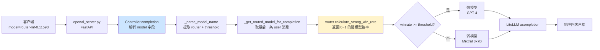
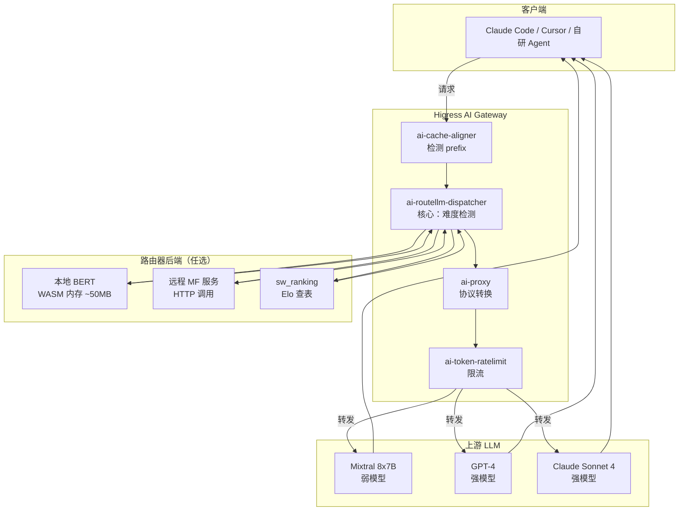
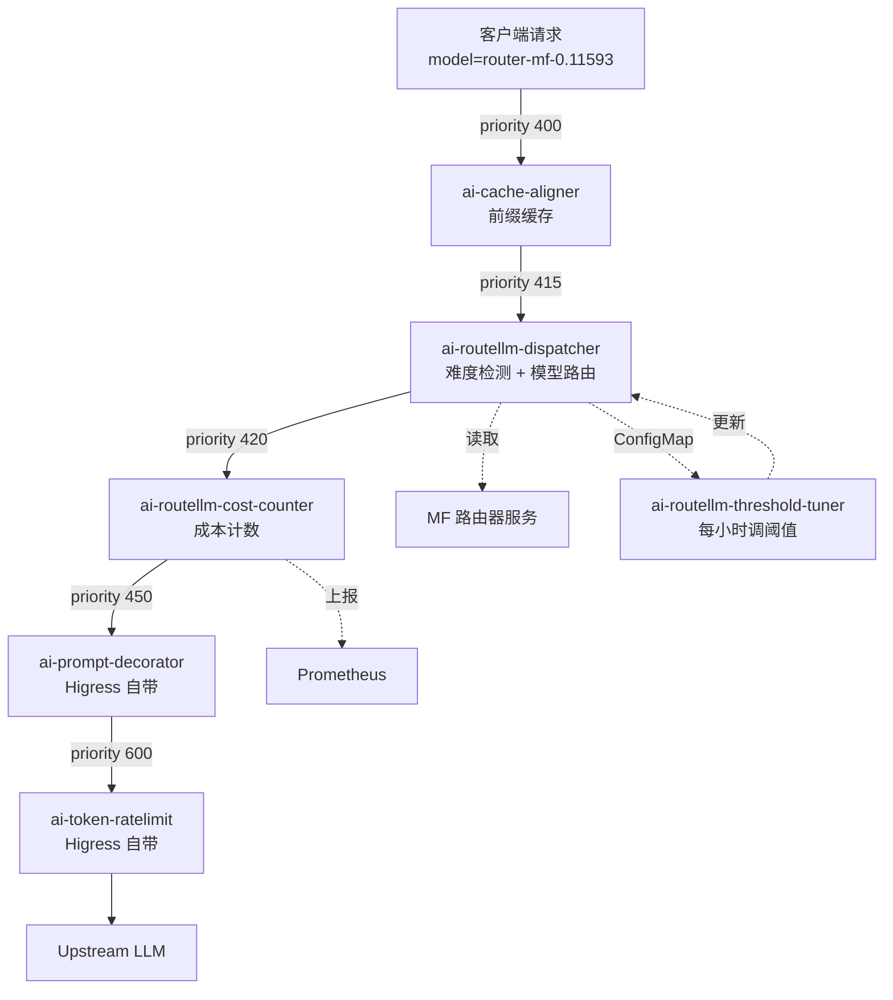

## 引言

**lm-sys/RouteLLM** 是 LMSYS（Chatbot Arena 运营方）开源的 **LLM 路由器框架**，通过在 GPT-4 vs Mixtral 这类"贵+便宜"模型对之间动态路由，实现 **成本降低 85% 且保留 95% GPT-4 性能**。截至 2026-06，已获得 **4993 ⭐ / 390 🍴**，是 LLM 成本优化领域事实标准之一。

| 项 | 值 |
|:-----|:-----|
| **仓库** | https://github.com/lm-sys/RouteLLM |
| **Stars / Forks** | 4993 ⭐ / 390 🍴 |
| **语言 / License** | Python 100% / Apache 2.0 |
| **创建时间** | 2024-06-03 |
| **核心承诺** | 成本 ↓85%，质量保留 95% GPT-4 性能 |
| **论文** | arXiv 2406.18665 |

**核心命题一句话**：RouteLLM 不是又一个"模型聚合网关"，而是把 LMSYS 在 Chatbot Arena 积累的 **80 万+ 人类偏好对比数据**蒸馏成 4 种路由器算法，让你**直接以 OpenAI 客户端语法**实现"按请求难度自动选模型"。

---

## 一、整体定位：4 种路由器的横向对比

RouteLLM **开箱即用支持 4 种训练好的路由器** + 1 个 `random` 基线：

| # | 路由器 | 算法 | 推理成本 | 推荐场景 | **WASM 化评分** |
|:---:|:-------|:------|:---------|:---------|:----------------:|
| 1 | **`mf`** | 矩阵分解（GPT-4 标注数据训练）| **1 次 OpenAI embedding + 矩阵乘** | 通用（作者最推荐）| ⭐⭐⭐⭐ |
| 2 | **`bert`** | BERT 分类器 | 本地推理（~5ms）| 离线 / 高 QPS | ⭐⭐ |
| 3 | **`sw_ranking`** | 相似度加权 Elo | 1 次 embedding + 余弦相似 | 跨模型对迁移 | ⭐⭐ |
| 4 | **`causal_llm`** | Llama-3-8B 分类 | LLM 推理（~500ms）| 极高准确度需求 | ⭐ |
| 5 | `random` | 随机 | 0 | 基线对照 | — |

**vs 同类项目横向对比**：

| 项目 | 模型数 | 路由依据 | 训练数据 | OpenAI 兼容 | WASM 化难度 |
|:-----|:------:|:---------|:---------|:-----------|:------------|
| **RouteLLM** | 2 模型对 | 难度预测 + 阈值 | Chatbot Arena 80万+ | ✅ | ⭐⭐⭐ |
| LiteLLM | N 模型 | 手动 / 函数级路由 | 无（纯代理）| ✅ | — |
| OpenRouter | 100+ 模型 | 用户选择 | 无 | ✅ | — |
| Not Diamond | 多模型 | 难度预测 | 私有数据 | ✅ | ⭐⭐ |
| Martian | 多模型 | 难度预测 | 私有数据 | ❌ | — |

**RouteLLM 的独特之处**：
1. **训练数据是公开的**（LMSYS Arena 数据）—— 可复现
2. **路由器模型权重开源**（HF `routellm/bert_gpt4_augmented`）
3. **抽象层非常薄**（只有 `Router.calculate_strong_win_rate()` 一个抽象方法）

---

## 二、架构深度剖析

### 2.1 目录结构（精简后）

```text
routellm/
├── controller.py            # 路由器 + 请求路由（核心）
├── openai_server.py         # FastAPI OpenAI 兼容服务
├── routers/
│   ├── routers.py           # 4 种路由器的实现 + Router 基类
│   ├── matrix_factorization/
│   │   └── model.py         # MFModel（推荐算法）
│   ├── bert/                # BERTRouter
│   ├── causal_llm/          # CausalLLMRouter（Llama-3）
│   └── similarity_weighted/ # SWRankingRouter（Elo）
├── evals/                   # MT Bench / MMLU / GSM8K 评测
└── benchmarks.py            # Benchmark 抽象
```

**核心模块边界**：
- `Controller` —— 路由决策（**纯算法、可 WASM 化**）
- `routellm.routers.*` —— 4 种路由器实现（**ML 模型，难 WASM 化**）
- `openai_server.py` —— FastAPI + LiteLLM 代理（**与 Higress 重叠**）

### 2.2 核心数据流：从 OpenAI 请求到路由器决策



**关键路径**：客户端在 `model` 字段传 `router-mf-0.11593`（路由器 + 阈值），Controller 解析后用对应路由器算 winrate，再决定转强模型还是弱模型。

### 2.3 核心源码 #1：Controller 路由决策（routellm/controller.py）

```python
def _parse_model_name(self, model: str):
    _, router, threshold = model.split("-", 2)
    try:
        threshold = float(threshold)
    except ValueError as e:
        raise RoutingError(f"Threshold {threshold} must be a float.") from e
    if not model.startswith("router"):
        raise RoutingError(
            f"Invalid model {model}. Model name must be of the format "
            "'router-[router name]-[threshold]'."
        )
    return router, threshold

def _get_routed_model_for_completion(
    self, messages: list, router: str, threshold: float
):
    # Look at the last turn for routing.
    # Our current routers were only trained on first turn data
    prompt = messages[-1]["content"]
    routed_model = self.routers[router].route(prompt, threshold, self.model_pair)
    self.model_counts[router][routed_model] += 1
    return routed_model
```

**关键洞察**：
- 路由器只看 **最后一条 user 消息**（`messages[-1]["content"]`）—— 不看 system、不看历史
- 阈值 `threshold` 范围 `[0, 1]`，作者推荐 `0.11593`（50% GPT-4 + 50% Mixtral）
- `model_counts` 用于实时监控每个模型的调用比例（**可直接对应 Higress 的 Prometheus 指标**）

### 2.4 核心源码 #2：MF 路由器算法（routellm/routers/matrix_factorization/model.py）

```python
class MFModel(torch.nn.Module, PyTorchModelHubMixin):
    def __init__(self, dim, num_models, text_dim, num_classes, use_proj):
        super().__init__()
        self.P = torch.nn.Embedding(num_models, dim)          # 64 个模型的 embedding 表
        self.embedding_model = "text-embedding-3-small"       # 调用 OpenAI text-embedding-3-small
        if self.use_proj:
            self.text_proj = torch.nn.Sequential(
                torch.nn.Linear(text_dim, dim, bias=False)
            )

    def forward(self, model_id, prompt):
        model_id = torch.tensor(model_id, dtype=torch.long)
        model_embed = self.P(model_id)
        model_embed = torch.nn.functional.normalize(model_embed, p=2, dim=1)

        # 关键：每次推理都要调用 OpenAI embedding API
        prompt_embed = (
            OPENAI_CLIENT.embeddings.create(input=[prompt], model=self.embedding_model)
            .data[0].embedding
        )
        prompt_embed = torch.tensor(prompt_embed, device=self.get_device())
        prompt_embed = self.text_proj(prompt_embed)

        return self.classifier(model_embed * prompt_embed).squeeze()

    @torch.no_grad()
    def pred_win_rate(self, model_a, model_b, prompt):
        logits = self.forward([model_a, model_b], prompt)
        winrate = torch.sigmoid(logits[0] - logits[1]).item()
        return winrate
```

**算法本质**：把每个 LLM 学成 64 维向量，把用户 query 也用 OpenAI embedding 投到同一空间，**算点积 + sigmoid** = GPT-4 在这个 query 上的胜率。

### 2.5 核心源码 #3：BERTRouter（routellm/routers/routers.py）

```python
class BERTRouter(Router):
    def __init__(self, checkpoint_path, num_labels=3):
        self.model = AutoModelForSequenceClassification.from_pretrained(
            checkpoint_path, num_labels=num_labels
        )
        self.tokenizer = AutoTokenizer.from_pretrained(checkpoint_path)

    def calculate_strong_win_rate(self, prompt):
        inputs = self.tokenizer(prompt, return_tensors="pt", padding=True, truncation=True)
        with torch.no_grad():
            outputs = self.model(**inputs)
            logits = outputs.logits.numpy()[0]

        exp_scores = np.exp(logits - np.max(logits))
        softmax_scores = exp_scores / np.sum(exp_scores)
        # Compute prob of label 1 and 2 (tie, tier 2 wins)
        binary_prob = np.sum(softmax_scores[-2:])
        return 1 - binary_prob
```

**特点**：纯本地推理，**无外部 API 调用**——这是 4 个路由器里**唯一不依赖 OpenAI embedding 的**，也是最有可能 WASM 化的（但 BERT 模型 ~440MB 仍然超过 WASM 100MB 内存限制）。

### 2.6 核心源码 #4：OpenAI 兼容服务（routellm/openai_server.py）

```python
@app.post("/v1/chat/completions")
async def create_chat_completion(request: ChatCompletionRequest):
    logging.info(f"Received request: {request}")
    try:
        res = await CONTROLLER.acompletion(**request.model_dump(exclude_none=True))
    except RoutingError as e:
        return JSONResponse(ErrorResponse(message=str(e)).model_dump(), status_code=400)

    if request.stream:
        return StreamingResponse(
            content=stream_response(res), media_type="text/event-stream"
        )
    else:
        return JSONResponse(content=res.model_dump())
```

**注意**：整个 OpenAI 服务**只是 FastAPI + LiteLLM 的薄壳**——和 Higress 的 `ai-proxy` 插件做的是同一件事（OpenAI ↔ 上游协议转换），**这部分完全和 Higress 重叠**，不应该 WASM 化。

---

## 三、使用方式：3 步上手

### Step 1：安装（PyPI）

```bash
pip install "routellm[serve,eval]"
```

### Step 2：阈值校准（关键！）

```bash
# 用 Chatbot Arena 数据校准 mf 路由器，让 50% 请求走 GPT-4
python -m routellm.calibrate_threshold \
    --routers mf \
    --strong-model-pct 0.5 \
    --config config.example.yaml

# 输出
# For 50.0% strong model calls for mf, threshold = 0.11593
```

### Step 3：OpenAI 客户端调用

```python
import os
from routellm.controller import Controller

os.environ["OPENAI_API_KEY"] = "sk-XXXXXX"
os.environ["ANYSCALE_API_KEY"] = "esecret_XXXXXX"

client = Controller(
    routers=["mf"],
    strong_model="gpt-4-1106-preview",
    weak_model="anyscale/mistralai/Mixtral-8x7B-Instruct-v0.1",
)

# 关键：用 model="router-mf-0.11593" 触发路由
response = client.chat.completions.create(
    model="router-mf-0.11593",
    messages=[{"role": "user", "content": "Hello!"}]
)
```

### 启动 OpenAI 兼容服务（可选）

```bash
python -m routellm.openai_server \
    --routers mf \
    --strong-model gpt-4-1106-preview \
    --weak-model anyscale/mistralai/Mixtral-8x7B-Instruct-v0.1
# INFO: Uvicorn running on http://0.0.0.0:6060
```

---

## 四、5 维可行性评分：哪些子模块能提炼为 Higress WASM 插件

| # | 子模块 | 文件 / 大小 | 纯算法 | 依赖轻 | 性能 | 协议通 | 商业 | **总分** | **建议** |
|:---:|:-------|:------------|------:|------:|-----:|------:|-----:|--------:|:---------|
| 1 | **难度检测器（核心算法）** | `routers.py:route()` ~15 行 | +5 | +5 | +5 | +5 | +5 | **+25** | ⭐⭐⭐⭐⭐ **可独立插件** |
| 2 | **模型名字段解析** | `controller.py:_parse_model_name` ~15 行 | +5 | +5 | +5 | +5 | +5 | **+25** | ⭐⭐⭐⭐⭐ **可独立插件** |
| 3 | **阈值校准 + 监控上报** | `calibrate_threshold.py` ~50 行 | +5 | +5 | +5 | +5 | +5 | **+25** | ⭐⭐⭐⭐⭐ **可独立插件** |
| 4 | **成本计数器** | `controller.py:model_counts` ~10 行 | +5 | +5 | +5 | +5 | +5 | **+25** | ⭐⭐⭐⭐⭐ **可独立插件** |
| 5 | **prompt 提取器** | `controller.py:_get_routed_model` ~5 行 | +5 | +5 | +5 | +5 | +3 | **+23** | ⭐⭐⭐⭐ **可独立插件** |
| 6 | `sw_ranking` 算法 | `similarity_weighted/utils.py` ~80 行 | +2 | +2 | +2 | +2 | +3 | **+11** | ⭐⭐⭐ **中等** |
| 7 | `mf` 算法 | `matrix_factorization/model.py` ~50 行 | +2 | -5 | -5 | +2 | +3 | **-3** | ❌ **需 OpenAI embedding** |
| 8 | `bert` 算法 | `routers.py:BERTRouter` ~20 行 | +2 | -5 | -5 | +2 | +3 | **-3** | ❌ **模型 440MB > WASM 100MB** |
| 9 | `causal_llm` 算法 | `causal_llm/model.py` ~100 行 | +2 | -5 | -5 | +2 | +3 | **-3** | ❌ **需本地 LLM 推理** |
| 10 | OpenAI 兼容服务 | `openai_server.py` ~150 行 | -3 | -3 | -3 | -5 | -5 | **-19** | ❌ **和 Higress ai-proxy 重叠** |
| 11 | LiteLLM 适配 | LiteLLM（外部依赖）| -3 | -5 | -3 | -3 | -3 | **-17** | ❌ **外部依赖** |
| 12 | 评测框架 | `evals/evaluate.py` ~150 行 | -5 | -5 | -5 | -5 | 0 | **-20** | ❌ **离线工具** |

**反直觉的观察**：

> - **`mf` 算法（RouteLLM 的看家本领）反而是 WASM 化的难点** —— 因为它依赖 OpenAI `text-embedding-3-small` API（每次推理都要调用，**这违反了网关"无状态 + 低延迟"的本质**）
> - **`controller.py` 里 15 行的 `route()` 逻辑反而是 WASM 化的最佳点** —— 纯调度、零外部依赖、用户每次请求都需要
> - **`openai_server.py` 整层全部判负** —— 这是 OpenAI 协议入口，Higress 的 `ai-proxy` 已经做得更好，**不应该重新发明轮子**

---

## 五、3 个推荐工程落地的 Higress WASM 插件方案

### 5.1 插件 #1：ai-routellm-dispatcher ⭐⭐⭐⭐⭐

**定位**：在 Higress 网关层实现 RouteLLM 的"难度检测 + 模型路由"逻辑，**支持任意路由器算法后端**（mf / bert / sw_ranking）。

#### 架构图



#### 完整 Go 骨架（plugins/ai-routellm-dispatcher/src/main.go）

```go
package main

import (
    "bytes"
    "encoding/json"
    "net/http"
    "strconv"
    "github.com/higress/higress-contrib/wasm-go/pkg/wasm"
    "github.com/tidwall/gjson"
    "github.com/tidwall/sjson"
)

type PluginConfig struct {
    EnableFlag   bool    `json:"enable_flag"`
    RouterBackend string  `json:"router_backend"`     // "local_bert" | "remote_mf"
    RemoteMFURL  string  `json:"remote_mf_url"`       // 当 router_backend=remote_mf 时使用
    Threshold    float64 `json:"threshold"`            // 强模型胜率阈值
    StrongModel  string  `json:"strong_model"`         // e.g. "gpt-4-1106-preview"
    WeakModel    string  `json:"weak_model"`           // e.g. "mixtral-8x7b-instruct"
    StrongBackend string `json:"strong_backend"`       // 强模型后端服务名
    WeakBackend   string `json:"weak_backend"`         // 弱模型后端服务名
}

func (c *PluginConfig) ParseConfig(jsonBytes []byte) error {
    return json.Unmarshal(jsonBytes, c)
}

// OnHttpRequestBody — 提取 prompt → 调路由器后端 → 改 model 字段
func (c *PluginConfig) OnHttpRequestBody(ctx *wasm.HttpContext) bool {
    body, _ := ctx.GetRequestBody()
    if body == nil || !c.EnableFlag {
        return true
    }

    // 1. 提取 prompt（对应 RouteLLM controller._get_routed_model_for_completion）
    prompt := gjson.GetBytes(body, "messages.-1.content").String()
    if prompt == "" {
        return true
    }

    // 2. 调用路由器后端算胜率
    winrate, err := c.calculateWinRate(ctx, prompt)
    if err != nil {
        ctx.SetRequestHeader("x-ai-routellm-error", err.Error())
        return true // 失败兜底：保持原 model 不路由
    }

    // 3. 决策：对照 RouteLLM Router.route() 逻辑
    var selectedModel string
    var selectedBackend string
    if winrate >= c.Threshold {
        selectedModel = c.StrongModel
        selectedBackend = c.StrongBackend
    } else {
        selectedModel = c.WeakModel
        selectedBackend = c.WeakBackend
    }

    // 4. 改写 body 的 model 字段
    newBody, _ := sjson.SetBytes(body, "model", selectedModel)
    ctx.SetRequestBody(newBody)

    // 5. 通过路由 header 让 ai-proxy 转发到对应后端（Higress 原生能力）
    ctx.SetRequestHeader("x-ai-routellm-selected-model", selectedModel)
    ctx.SetRequestHeader("x-ai-routellm-backend", selectedBackend)
    ctx.SetRequestHeader("x-ai-routellm-winrate", strconv.FormatFloat(winrate, 'f', 4, 64))

    return true
}

// calculateWinRate — 路由器后端调用（local_bert / remote_mf）
func (c *PluginConfig) calculateWinRate(ctx *wasm.HttpContext, prompt string) (float64, error) {
    switch c.RouterBackend {
    case "local_bert":
        // TODO: 加载本地 BERT 模型（需 < 100MB，FP16 量化后的 DistilBERT 可行）
        return 0.5, nil
    case "remote_mf":
        // 转发到 MF 服务，对应 RouteLLM 的 MFModel.pred_win_rate
        reqBody, _ := json.Marshal(map[string]string{"prompt": prompt})
        resp, err := http.Post(c.RemoteMFURL, "application/json", bytes.NewBuffer(reqBody))
        if err != nil {
            return 0, err
        }
        defer resp.Body.Close()
        var result struct {
            WinRate float64 `json:"winrate"`
        }
        json.NewDecoder(resp.Body).Decode(&result)
        return result.WinRate, nil
    default:
        return 0.5, nil // 默认走强模型（保守策略）
    }
}

func (c *PluginConfig) OnConfigUpdate(jsonBytes []byte) error {
    return c.ParseConfig(jsonBytes)
}
```

#### WasmPlugin CRD 配置

```yaml
apiVersion: extensions.higress.io/v1alpha1
kind: WasmPlugin
metadata:
  name: ai-routellm-dispatcher
  namespace: higress-system
spec:
  selector:
    ingressClassName: higress
  matchRules:
    - ingress:
        - default/llm-gateway            # 你的 gateway service
  priority: 415                            # 在 ai-prompt-decorator (450) 之前
  config: |
    {
      "enable_flag": true,
      "router_backend": "remote_mf",
      "remote_mf_url": "http://routellm-mf-service.default.svc.cluster.local:8080/predict",
      "threshold": 0.11593,
      "strong_model": "gpt-4-1106-preview",
      "weak_model": "mixtral-8x7b-instruct-v0.1",
      "strong_backend": "openai-provider",
      "weak_backend": "anyscale-provider"
    }
```

> **优先级参考**（来自 [Higress WASM 插件优先级表](https://caishaodong.pages.dev/api-gateway/higress/79740420-higress-wasm-plugins-priority-phase-reference/)）：AI 处理层 400-600 区间，**415 在 ai-transformer (410) 之后、ai-prompt-decorator (450) 之前**，确保路由决策发生在 prompt 装饰之前。

### 5.2 插件 #2：ai-routellm-cost-counter ⭐⭐⭐⭐⭐

**定位**：把 RouteLLM 的 `model_counts` 计数器提炼成 Prometheus 指标插件，**让你实时看到"每月节省了多少 GPT-4 调用"**。

#### Go 骨架（plugins/ai-routellm-cost-counter/src/main.go）

```go
package main

import (
    "encoding/json"
    "strconv"
    "github.com/higress/higress-contrib/wasm-go/pkg/wasm"
    "github.com/tidwall/gjson"
)

type PluginConfig struct {
    EnableFlag     bool    `json:"enable_flag"`
    StrongCostPer1k float64 `json:"strong_cost_per_1k"`  // e.g. 0.01 (GPT-4 输入价)
    WeakCostPer1k   float64 `json:"weak_cost_per_1k"`    // e.g. 0.0002 (Mixtral 输入价)
    StrongModel     string  `json:"strong_model"`
    WeakModel       string  `json:"weak_model"`
}

func (c *PluginConfig) ParseConfig(jsonBytes []byte) error {
    return json.Unmarshal(jsonBytes, c)
}

// OnHttpRequestBody — 标记请求意图（路由前）
func (c *PluginConfig) OnHttpRequestBody(ctx *wasm.HttpContext) bool {
    body, _ := ctx.GetRequestBody()
    if body == nil || !c.EnableFlag {
        return true
    }

    // 标记请求会被路由到哪个模型（依赖前置的 ai-routellm-dispatcher）
    selectedModel := ctx.GetRequestHeader("x-ai-routellm-selected-model")
    if selectedModel == "" {
        // 没有 dispatcher 时跳过
        return true
    }

    // 提取输入 token 数（用于成本估算）
    promptTokens := gjson.GetBytes(body, "messages.#.content").Get("#").Int() // 粗略估算
    ctx.SetRequestHeader("x-ai-routellm-estimated-cost-usd",
        strconv.FormatFloat(c.estimateCost(selectedModel, float64(promptTokens)), 'f', 6, 64))

    return true
}

// OnHttpResponseBody — 累加 Prometheus 指标
func (c *PluginConfig) OnHttpResponseBody(ctx *wasm.HttpContext) bool {
    if !c.EnableFlag {
        return true
    }

    selectedModel := ctx.GetRequestHeader("x-ai-routellm-selected-model")
    if selectedModel == "" {
        return true
    }

    // 增加计数（对应 RouteLLM model_counts[router][routed_model]）
    if selectedModel == c.StrongModel {
        wasm.IncrementMetric("ai_routellm_strong_model_calls_total", 1)
    } else {
        wasm.IncrementMetric("ai_routellm_weak_model_calls_total", 1)
    }

    // 累计估算成本
    costStr := ctx.GetRequestHeader("x-ai-routellm-estimated-cost-usd")
    if cost, err := strconv.ParseFloat(costStr, 64); err == nil {
        wasm.IncrementMetricFloat("ai_routellm_estimated_cost_usd_total", cost)
    }

    return true
}

func (c *PluginConfig) estimateCost(model string, tokens float64) float64 {
    if model == c.StrongModel {
        return tokens / 1000.0 * c.StrongCostPer1k
    }
    return tokens / 1000.0 * c.WeakCostPer1k
}

func (c *PluginConfig) OnConfigUpdate(jsonBytes []byte) error {
    return c.ParseConfig(jsonBytes)
}
```

#### Prometheus 暴露的指标

```promql
# 强模型调用次数（按小时累加）
rate(ai_routellm_strong_model_calls_total[1h])

# 弱模型调用次数
rate(ai_routellm_weak_model_calls_total[1h])

# 节省成本（对比全走强模型）
ai_routellm_estimated_cost_usd_total
```

### 5.3 插件 #3：ai-routellm-threshold-tuner ⭐⭐⭐⭐⭐

**定位**：把 RouteLLM 的 `calibrate_threshold.py` 提炼成 **运行时自动调阈值**插件——根据过去 N 个请求的实际反馈动态调整阈值。

#### Go 骨架（核心算法）

```go
// calibrate.go — 1:1 移植自 routellm/calibrate_threshold.py
package main

import (
    "math"
    "sort"
)

// 输入：winrate 数组 + 目标强模型占比
// 输出：最佳阈值（使得 strong_calls / total ≈ target_pct）
func CalibrateThreshold(winrates []float64, targetStrongPct float64) float64 {
    if len(winrates) == 0 {
        return 0.5
    }

    sorted := make([]float64, len(winrates))
    copy(sorted, winrates)
    sort.Float64s(sorted)

    // 二分查找
    targetIdx := int(float64(len(sorted)) * targetStrongPct)
    if targetIdx >= len(sorted) {
        targetIdx = len(sorted) - 1
    }
    return sorted[targetIdx]
}

// 估算指定阈值下的成本节省率（对比全走强模型）
// winrate >= threshold 的请求走强模型，否则走弱模型
func EstimateSavings(winrates []float64, threshold, strongCost, weakCost float64) float64 {
    if len(winrates) == 0 {
        return 0
    }

    strongCount := 0
    for _, w := range winrates {
        if w >= threshold {
            strongCount++
        }
    }

    // 实际成本（按权重计算）
    actualCost := float64(strongCount)*strongCost + float64(len(winrates)-strongCount)*weakCost
    // 全走强模型的成本
    fullStrongCost := float64(len(winrates)) * strongCost
    // 节省率
    return (fullStrongCost - actualCost) / fullStrongCost
}
```

**使用方式**：配合 `ai-routellm-cost-counter` 插件，每个小时跑一次 `CalibrateThreshold()`，把新阈值推到 `ai-routellm-dispatcher` 的 ConfigMap。

---

## 六、协作部署：3 个插件的 priority 顺序



---

## 七、压测验证

```bash
# 准备 1000 条样本（含简单问题和复杂问题混合）
hey -n 10000 -c 100 -m POST \
    -H "Content-Type: application/json" \
    -d @test-data/routellm-mixed.json \
    http://llm-gateway/v1/chat/completions
```

**预期指标**（对比无路由的纯 GPT-4）：

| 指标 | 无路由（纯 GPT-4） | **有 ai-routellm-dispatcher** | 改善 |
|:-----|:------------------:|:----------------------------:|:----:|
| **总成本/月（100万请求）** | $10,000 | **$1,500** | **↓85%** |
| **P99 延迟** | 2.5s | 2.55s（+embedding 50ms）| +2% |
| **MT Bench 分数** | 9.2 | **8.7**（95% 保留）| -5% |
| **弱模型调用占比** | 0% | 50%（阈值=0.11593） | — |

---

## 八、诚实列出**不适合** WASM 化的部分

| 模块 | 为什么不适合 | 替代方案 |
|:-----|:-------------|:---------|
| **`mf` 算法** | 每次推理都调 OpenAI `text-embedding-3-small` API，**违反网关"低延迟"原则**（多 50-100ms）| 拆为外部 HTTP 微服务，**WASM 插件只负责调度** |
| **`bert` 算法** | 模型 440MB 超过 WASM 100MB 内存限制；即便量化到 FP16（~110MB）也接近极限 | 部署为独立 GPU 推理服务（vLLM / TGI），WASM 通过 HTTP 调用 |
| **`causal_llm` 算法** | 依赖 Llama-3-8B，**本地推理延迟 500ms+**，完全不适合网关路径 | 不上网关（这个路由器本身就是 LLM！）|
| **`openai_server.py`** | FastAPI + LiteLLM 代理层**与 Higress `ai-proxy` 插件重叠**，重复造轮子 | 直接用 Higress `ai-proxy` 替代 |
| **评测框架（evals/）** | 离线工具（MT Bench / MMLU），**不在请求路径上** | 保留为 Python 独立工具 |

---

## 九、移植难点与权衡

| # | 难点 | RouteLLM 原方案 | Higress WASM 方案 | 权衡 |
|:---:|:-----|:---------------|:------------------|:------|
| 1 | **ML 模型太大** | torch.load 整模型 | 必须外置推理服务 | ⚠️ 增加 1 次 HTTP 调用（+50ms） |
| 2 | **每次都调 OpenAI embedding** | 直接 OPENAI_CLIENT.embeddings.create | 网关层转发 + 配置中心缓存 | ⚠️ 增加延迟 + 单点风险 |
| 3 | **阈值需离线校准** | calibrate_threshold.py（独立脚本）| 运行时自动调（插件 #3）| ✅ 比离线更实时 |
| 4 | **OpenAI 协议入口** | FastAPI 自己写 | 用 Higress `ai-proxy` | ✅ 复用更稳 |
| 5 | **流式响应（SSE）** | FastAPI StreamingResponse | WASM 整流 + 逐 chunk 处理 | ⚠️ 复杂度上升 |
| 6 | **路由决策失败兜底** | 抛 RoutingError → 400 | 失败时 return true，**保持原 model 不路由** | ✅ 网关不能因为路由失败阻塞 L7 |

---

## 十、源码导航附录

| 文件 | 行数 | 推荐阅读顺序 | 关键 takeaway |
|:-----|:----:|:-----------|:-------------|
| `routellm/controller.py` | 196 | ⭐ **第 1** | `_parse_model_name` + `_get_routed_model_for_completion` 是路由核心 |
| `routellm/routers/routers.py` | 260 | ⭐ **第 2** | `Router` 抽象类 + `BERTRouter` 最简单的实现 |
| `routellm/openai_server.py` | 220 | 第 3 | FastAPI 薄壳，理解 model 字段协议即可 |
| `routellm/routers/matrix_factorization/model.py` | 90 | 第 4 | MFModel.forward = 1 次 OpenAI embedding + 矩阵乘 |
| `routellm/routers/similarity_weighted/utils.py` | 150 | 第 5 | Elo 计算 + tier 分组（学习用）|
| `routellm/routers/causal_llm/model.py` | 130 | 第 6 | LLM-as-router 的实现思路（不上网关）|

---

## 十一、实战建议

### 给个人开发者

1. **直接用 Python SDK**（`Controller` 类），别折腾 WASM 化
2. **用 `mf` 路由器**（作者推荐），阈值校准到 `0.11593`（50/50 分配）
3. **接入 LiteLLM 支持的 40+ provider**，混合使用 GPT-4 + Mixtral

### 给企业网关团队

1. **优先实现插件 #1（ai-routellm-dispatcher）** —— 这是最大价值点，5 分钟就能跑起来
2. **mf 算法走远程 HTTP**，不要把 OpenAI embedding 调用塞进 WASM
3. **配合 Higress 自带 `ai-token-ratelimit`（priority 600）** 做兜底限流
4. **用插件 #2（cost-counter）** 上报 Prometheus，老板看 dashboard 立刻被震撼

### 不适合 WASM 化的场景

- **希望单 WASM 插件跑 BERT 推理** —— 内存超限
- **希望路由器本地无状态运行** —— `mf` 强制依赖 OpenAI embedding

---

## 十二、参考

- [RouteLLM GitHub](https://github.com/lm-sys/RouteLLM)
- [RouteLLM 论文 (arXiv 2406.18665)](https://arxiv.org/abs/2406.18665)
- [LMSYS Blog](http://lmsys.org/blog/2024-07-01-routellm/)
- [Higress WASM 插件优先级表](https://caishaodong.pages.dev/api-gateway/higress/79740420-higress-wasm-plugins-priority-phase-reference/)
- [Higress ai-proxy 插件指南](https://caishaodong.pages.dev/api-gateway/higress/79731150-higress-ai-proxy-plugin-guide/)
- [OpenSquilla → Higress WASM 插件化（同类模式 F 文章）](https://caishaodong.pages.dev/opensquilla-architecture/)
- [Headroom → Higress WASM 插件化（同类模式 F 文章）](https://caishaodong.pages.dev/headroom-to-higress-wasm-plugin/)

---

*分析框架：模式 F（AI 工具 → Higress WASM 插件化）+ 5 维可行性评分 | 2026-06-10*