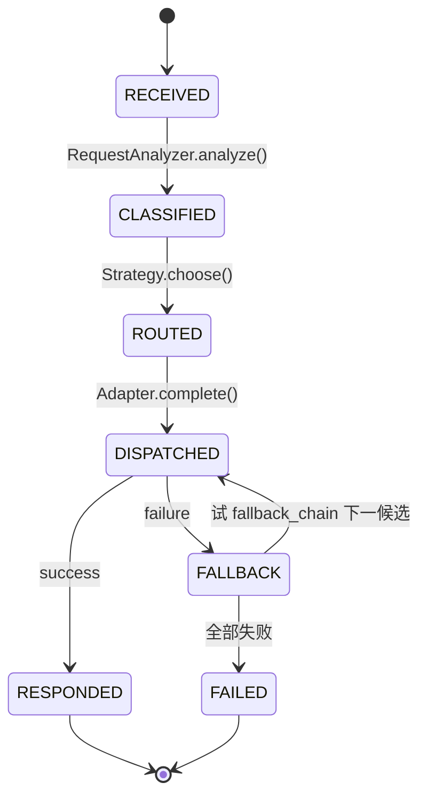
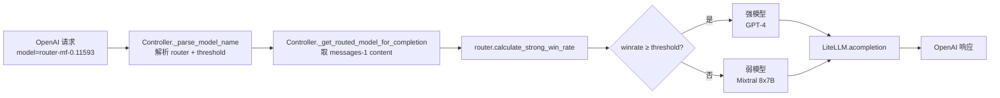
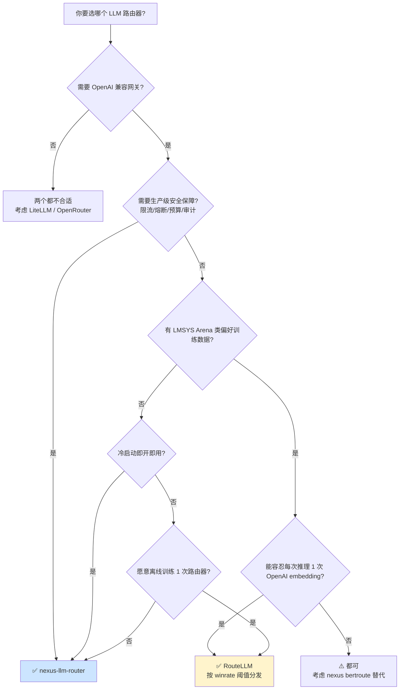

## 引言

2026 年的 LLM 工程化进入"多模型编排"时代：单模型堆配置已成过去式，**"按请求动态路由到合适的模型"** 成为降本增效的核心能力。今天对比两位开源选手：

- **[Francis1998/nexus-llm-router](https://github.com/Francis1998/nexus-llm-router)**（2026 年新晋）—— 走"约束 + 优化"路线，用完全确定性分类器做任务感知，在质量下限之上最小化成本
- **[lm-sys/RouteLLM](https://github.com/lm-sys/RouteLLM)**（2024 明星）—— 走"预测 + 阈值"路线，把 Chatbot Arena 80 万偏好数据蒸馏成 4 种路由器

本文用 codegraph 深度索引 nexus-llm-router 全栈，从架构、算法、成本控制、可移植性 4 个维度做横向对比，并给出 **5 维 Higress WASM 化可行性评分**和**场景选型决策树**。

| 项 | nexus-llm-router | RouteLLM |
|:--|:----------------|:---------|
| **仓库规模** | 48 文件 / 456 nodes / 405 edges | 196 行 controller.py + 4 路由器子目录 |
| **核心范式** | Observe→Decide→Act 状态机 | Controller + Router 抽象 |
| **任务感知** | 7 个 prompt 特征 + logistic 回归 | 4 种训练好的路由器（含 1 个 LLM-as-router）|
| **成本控制** | 4 层防御（catalog/LP/Budget/CircuitBreaker）| 单维 winrate 阈值 |
| **数据驱动** | 0 训练数据（纯特征提取）| 强依赖 LMSYS Arena 80 万偏好数据 |
| **质量保证** | `quality_floor` 硬下限（默认 0.72）| 训练集上 95% GPT-4 性能保留 |
| **延迟感知** | 滚动 p95 延迟 + 三因子评分 | 不感知 |
| **可观测性** | Prometheus + OpenTelemetry + JSONL audit + Grafana | `model_counts` 仅计数 |
| **生产就绪** | Audit log / PII / Budget / Circuit / Rate-limit 全有 | 仅"模型路由"一件事 |

**核心命题一句话**：nexus 是"**基础设施级** LLM 路由器"，把 OpenAI 兼容 + 限流 + 熔断 + 预算 + 审计做齐；RouteLLM 是"**算法级** LLM 路由器"，把"按难度分发"做到极致。

---

## 一、整体定位：两种架构哲学

```mermaid
flowchart TB
    subgraph NEXUS["nexus-llm-router · 基础设施级"]
        N1[OpenAI 兼容 API] --> N2[Observe<br/>7 特征 + 3 分类器]
        N2 --> N3[Decide<br/>5 种策略可插拔]
        N3 --> N4[Act<br/>4 层成本防御]
        N4 --> N5[Provider 适配层<br/>OpenAI/Anthropic/Gemini/Moonshot]
    end
    subgraph ROUTE["RouteLLM · 算法级"]
        R1[OpenAI 兼容 API] --> R2[解析 model 字段<br/>router-mf-threshold]
        R2 --> R3[单路由器调用<br/>mf/bert/sw_ranking/causal_llm]
        R3 --> R4[Winrate ≥ threshold?<br/>强 or 弱]
        R4 --> R5[LiteLLM<br/>多 provider 调度]
    end
    style NEXUS fill:#cce5ff
    style ROUTE fill:#fff4cc
```



**两种范式的根本区别**：

| 维度 | nexus | RouteLLM |
|:--|:--|:--|
| **决策粒度** | 5 维信号（complexity/domain/latency/cost/quality）| 1 维信号（winrate 0~1）|
| **策略可换性** | 5 种策略通过 header 切换 | 1 种策略（路由器可换 4 种实现）|
| **依赖复杂度** | 0 个外部 ML 模型 | 至少 1 个 OpenAI embedding 调用 |
| **训练数据需求** | 无（仅手工特征工程）| 必须有偏好对比数据 |
| **领域感知** | 4 个 domain tag（CODE/MEDICAL/LEGAL/GENERAL）| 无显式 domain，靠 winrate 隐式 |
| **延迟优化** | 滚动 p95 + 三因子评分 | 无 |
| **预算控制** | BudgetGuardrail（每用户硬上限）| 无 |
| **生产可观测** | Prometheus + OTel + JSONL audit + Grafana | `model_counts` 字典 |

---

## 二、项目概览

| 项 | nexus-llm-router | RouteLLM |
|:--|:--|:--|
| **作者** | [Francis1998](https://github.com/Francis1998) | [LMSYS](https://lmsys.org)（Chatbot Arena 团队）|
| **仓库** | https://github.com/Francis1998/nexus-llm-router | https://github.com/lm-sys/RouteLLM |
| **Stars / Forks** | （新晋项目）| **4993 ⭐ / 390 🍴**（事实标准之一）|
| **语言 / License** | Python 100% / （待定）| Python 100% / Apache 2.0 |
| **创建时间** | 2026 | 2024-06-03 |
| **核心承诺** | "OpenAI 兼容 + 任务感知 + 成本优化 + 故障兜底 + 审计" | "成本 ↓85%，质量保留 95% GPT-4" |
| **论文** | 无 | arXiv 2406.18665 |
| **测试覆盖** | 33 通过 | 完整（多个 benchmark）|
| **依赖 LLM** | 0（纯特征 + 数学）| 1（OpenAI text-embedding-3-small）|

**定位差异一句话**：

> **nexus 卖给 SRE/Infra 团队**：把"OpenAI 兼容网关"做齐，所有生产级安全/可观测/降级全有。
>
> **RouteLLM 卖给算法/应用团队**：把"按难度分发"做到极致，承诺"省钱 85%、保质 95%"。

---

## 三、核心架构差异

### 3.1 nexus 三阶段：Observe → Decide → Act



**Observe（任务感知）**：

```python
# src/router/analyzer.py — 完全确定性，0 token 成本
class RequestAnalyzer:
    def analyze(self, request: RouterRequest) -> TaskSignals:
        features = extract_prompt_features(request.prompt_text)
        complexity_score = self._complexity_classifier.predict_score(features)
        domain_tag = self._domain_classifier.classify(features)
        latency_requirement = self._latency_classifier.classify(features, complexity_score)
        return TaskSignals(
            complexity_score=complexity_score,    # 0~1
            domain_tag=domain_tag,                # CODE/MEDICAL/LEGAL/GENERAL
            latency_requirement=latency_requirement,  # REALTIME/BATCH
            ...
        )
```

7 个手工特征（`src/classifier/features.py`）：`character_count / word_count / question_count / code_hits / medical_hits / legal_hits / instruction_hits`，全部正则 + 关键词计数。

**Decide（5 种策略）**：

```python
# src/router/strategies.py
class RoutingStrategy(ABC):
    @abstractmethod
    def choose(self, request: RouterRequest, signals: TaskSignals) -> RoutingDecision: ...

# 5 种实现：
# - RuleBasedStrategy        # 硬编码优先级矩阵
# - ClassifierStrategy       # 复杂度阈值分层
# - CostOptimalStrategy      # LP 最小成本（受 quality_floor 约束）
# - LatencyAwareStrategy     # 滚动 p95 + 三因子评分
# - ABRoutingStrategy        # sha256 稳定哈希分桶
```

**Act（4 层成本防御）**：

```python
# src/router/engine.py — NexusRouter.complete() 核心循环
for attempt_index, model_name in enumerate(attempts):
    candidate = self._model_catalog[model_name]
    adapter = self._adapter_registry.get(candidate.provider)
    estimated_cost = candidate.estimate_cost(...)
    self._budget_guardrail.assert_can_spend(request.user_id, estimated_cost)  # 预算
    try:
        self._circuit_breakers.assert_available(candidate.provider)            # 熔断
        provider_response = await adapter.complete(...)                         # 实际调用
    except (...):
        self._circuit_breakers.record_failure(candidate.provider)               # 失败计数
        continue  # 试下一个 fallback
```

**关键设计**：每一次 `complete()` 调用都有 4 层防御串行生效，**任何一层失败都优雅降级**，最终 fallback chain 用尽才抛 `RoutingFailedError`。

### 3.2 RouteLLM 核心：Controller + Router 抽象



**核心源码**（`routellm/controller.py`）：

```python
def _parse_model_name(self, model: str):
    _, router, threshold = model.split("-", 2)
    threshold = float(threshold)
    if not model.startswith("router"):
        raise RoutingError(...)
    return router, threshold

def _get_routed_model_for_completion(self, messages, router, threshold):
    prompt = messages[-1]["content"]  # 只看最后一条 user
    routed_model = self.routers[router].route(prompt, threshold, self.model_pair)
    self.model_counts[router][routed_model] += 1
    return routed_model
```

**4 种路由器实现**：

| # | 路由器 | 算法 | 推理成本 | 推荐场景 |
|:--|:--|:--|:--|:--|
| 1 | **`mf`** | 矩阵分解（GPT-4 标注数据训练）| 1 次 OpenAI embedding + 矩阵乘 | **作者最推荐** |
| 2 | **`bert`** | BERT 分类器 | 本地推理（~5ms）| 离线 / 高 QPS |
| 3 | **`sw_ranking`** | 相似度加权 Elo | 1 次 embedding + 余弦相似 | 跨模型对迁移 |
| 4 | **`causal_llm`** | Llama-3-8B 分类 | LLM 推理（~500ms）| 极高准确度需求 |

**mf 算法核心**（`routellm/routers/matrix_factorization/model.py`）：

```python
class MFModel(torch.nn.Module, PyTorchModelHubMixin):
    def __init__(self, dim, num_models, text_dim, num_classes, use_proj):
        super().__init__()
        self.P = torch.nn.Embedding(num_models, dim)              # 64 模型 embedding 表
        self.embedding_model = "text-embedding-3-small"         # 强依赖 OpenAI
        if self.use_proj:
            self.text_proj = torch.nn.Sequential(torch.nn.Linear(text_dim, dim, bias=False))

    def forward(self, model_id, prompt):
        model_embed = self.P(model_id)
        prompt_embed = OPENAI_CLIENT.embeddings.create(
            input=[prompt], model=self.embedding_model
        ).data[0].embedding                                        # 每次推理 1 次 API 调用
        return self.classifier(model_embed * prompt_embed).squeeze()

    @torch.no_grad()
    def pred_win_rate(self, model_a, model_b, prompt):
        logits = self.forward([model_a, model_b], prompt)
        return torch.sigmoid(logits[0] - logits[1]).item()        # 0~1 胜率
```

### 3.3 架构差异总结

| 维度 | nexus | RouteLLM |
|:--|:--|:--|
| **状态机** | RECEIVED → CLASSIFIED → ROUTED → DISPATCHED → RESPONDED（带 FALLBACK 子状态）| 单步：parse → route → call |
| **决策信号数** | 5 个（complexity / domain / latency / cost / quality）| 1 个（winrate）|
| **可插拔点** | 策略（5 种）+ 适配器（4 种）+ 分类器（3 个独立）| 路由器（4 种，但只能选 1 种）|
| **Fallback 链** | `_fallback_chain()` 自动生成 3 个 fallback | 单路由器失败 → 抛异常 |
| **领域感知** | 4 个 domain tag | 无 |
| **延迟感知** | 滚动 p95 | 无 |
| **预算控制** | BudgetGuardrail | 无 |
| **熔断** | CircuitBreakerRegistry（60s / 3 次失败）| 无 |
| **限流** | TokenBucket（每 API key）| 无 |
| **审计** | JSONL + Prometheus + OTel + Grafana | `model_counts` 字典 |

---

## 四、任务感知路由：算法对比

这是两者**最关键的差异**——"如何决定一个请求走哪个模型"。

### 4.1 nexus 的多维信号 + logistic

```python
# src/classifier/complexity.py — LogisticComplexityClassifier
def predict_score(self, features: PromptFeatures) -> float:
    linear_score = (
        -1.55                                          # bias
        + 0.008 * min(features.word_count, 600)         # 词数（饱和到 600）
        + 0.18  * features.question_count               # 问号
        + 0.32  * features.code_hits                    # 代码特征
        + 0.26  * features.medical_hits
        + 0.24  * features.legal_hits
        + 0.34  * features.instruction_hits             # "analyze/debug/optimize" 最重
    )
    return 1.0 / (1.0 + math.exp(-linear_score))        # sigmoid → 0~1
```

**特点**：

- 完全确定性，**0 token 成本**
- 权重手工设定，但有 `scripts/train_classifier.py` 可离线训练
- `instruction_hits` 权重 0.34 最高（"debug" 关键词远比 word_count 重要）
- `word_count` 饱和到 600 防 prompt 注入拉爆

### 4.2 RouteLLM 的 winrate 预测

```python
# 矩阵分解路由器把"模型对偏好"学成 64 维向量
# 推理时：把 query 也投到同一空间，点积 + sigmoid = GPT-4 在这个 query 上的胜率
@torch.no_grad()
def pred_win_rate(self, model_a, model_b, prompt):
    logits = self.forward([model_a, model_b], prompt)
    return torch.sigmoid(logits[0] - logits[1]).item()  # 0~1 胜率
```

**特点**：

- **强依赖 OpenAI text-embedding-3-small**（每次推理 1 次 API 调用）
- **强依赖训练数据**（必须从 LMSYS Arena 80 万偏好对训练）
- 训练后冻结，无法在线学习
- 对"训练集没见过的 query 模式"鲁棒性差

### 4.3 算法维度对比

| 维度 | nexus logistic | RouteLLM MF |
|:--|:--|:--|
| **算法复杂度** | O(word_count) 简单线性 | O(1) embedding + 矩阵乘 |
| **推理延迟** | < 1ms（CPU）| ~50ms（含 1 次 OpenAI API 调用）|
| **训练数据** | 0（手工权重）| 必须有偏好对比数据 |
| **在线可学习** | ✅（重设权重即可）| ❌（需重训整个矩阵）|
| **新模型接入** | 改 `supports_domains` 1 个字段 | 需重训（追加到 64 维 embedding）|
| **冷启动** | 即开即用 | 必须先训练 |
| **可解释性** | 7 维权重直接看 | 64 维向量 + embedding 不可解释 |
| **领域敏感** | 4 个 domain tag 显式标注 | 隐式（winrate 反映综合偏好）|

### 4.4 决策逻辑差异（关键）

**nexus 的 `RuleBasedStrategy`（确定性优先级矩阵）**：

```python
# src/router/strategies.py
def choose(self, request, signals):
    if signals.domain_tag is DomainTag.MEDICAL:
        return self._decision(ANTHROPIC_SAFETY_MODEL, "medical domain requires highest safety prior")
    if signals.domain_tag is DomainTag.LEGAL:
        return self._decision(ANTHROPIC_SAFETY_MODEL, "legal domain favors Claude policy reasoning")
    if signals.domain_tag is DomainTag.CODE and signals.complexity_score >= 0.55:
        return self._decision(OPENAI_FRONTIER_MODEL, "complex code prompt favors GPT-5.5 quality")
    if signals.complexity_score <= 0.35 and signals.latency_requirement is LatencyRequirement.REALTIME:
        return self._decision(GEMINI_FLASH_MODEL, "simple realtime prompt favors low latency")
    if requested_model and requested_model in self._model_catalog:
        return self._decision(requested_model, "explicit compatible model request honored")
    return self._decision(OPENAI_BALANCED_MODEL, "general prompt routed to balanced low-cost model")
```

**RouteLLM 的决策（单维阈值）**：

```python
# 只看 winrate ≥ threshold ? 强模型 : 弱模型
# 没有 fallback chain，没有 quality_floor 约束
routed_model = self.routers[router].route(prompt, threshold, self.model_pair)
```

**根本差异**：
- nexus 是**多维 if-elif 链 + LP 优化**，**可解释、可审计**
- RouteLLM 是**单维 sigmoid + 阈值**，**不可解释、训练数据是黑盒**

---

## 五、成本优化对比

### 5.1 nexus 的 4 层防御

**第 1 层 · 模型 catalog 价格策略**（`src/router/config.py`）：

| 模型 | 输入 $/1k | 输出 $/1k | 质量分 | 价差倍数（vs OPENAI_BALANCED）|
|:--|--:|--:|--:|--:|
| OPENAI_FRONTIER_MODEL | 0.006 | 0.018 | 0.97 | **30× / 22×** |
| ANTHROPIC_SAFETY_MODEL | 0.003 | 0.015 | 0.98 | 15× / 19× |
| GEMINI_PRO_MODEL | 0.0035 | 0.0105 | 0.95 | 17× / 13× |
| ANTHROPIC_FAST_MODEL | 0.0008 | 0.004 | 0.82 | 4× / 5× |
| GEMINI_FLASH_MODEL | 0.0015 | 0.009 | 0.81 | 7× / 11× |
| **OPENAI_BALANCED_MODEL** | **0.0002** | **0.0008** | 0.84 | **1× / 1×** |
| MOONSHOT_BALANCED_MODEL | 0.0005 | 0.002 | 0.76 | 2.5× / 2.5× |

**第 2 层 · CostOptimalStrategy（LP 最小成本）**：

```python
def choose(self, request, signals):
    feasible = [
        c for c in catalog.values()
        if c.quality_score >= self._quality_floor        # 质量下限（默认 0.72）
        and signals.domain_tag in c.supports_domains      # 领域匹配
        and (c.supports_realtime or signals.latency == BATCH)  # 延迟要求
    ]
    if not feasible:
        return highest_quality  # 兜底
    return min(feasible, key=lambda c: c.estimate_cost(input, output))  # 选最便宜
```

**第 3 层 · BudgetGuardrail（每用户硬上限）**：

```python
class BudgetGuardrail:
    def __init__(self, cap_usd=25.0):  # 默认 $25/用户
        self._spend_by_subject = {}
    def assert_can_spend(self, subject, est_cost):
        if self._spend_by_subject.get(subject, 0) + est_cost > self._cap_usd:
            raise BudgetExceededError(...)  # 422 拒绝
```

**第 4 层 · Circuit Breaker（失败熔断）**：

```python
class CircuitBreakerRegistry:
    def __init__(self, failure_threshold=3, recovery_window=60s):
        ...
    def record_failure(self, provider):
        state.consecutive_failures += 1
        if state.consecutive_failures >= 3:
            state.opened_at = time.monotonic()  # 熔断 60s
```

### 5.2 RouteLLM 的成本控制（单维）

RouteLLM 只有 **1 个维度**的成本控制 —— **winrate 阈值**：

```python
# 用户在 model 字段传阈值：router-mf-0.11593
# threshold 越小 → 越多请求走弱模型 → 越省钱
# threshold 越大 → 越多请求走强模型 → 越贵但质量越好
```

**节省率公式**：

```
节省率 = (full_strong_cost - actual_cost) / full_strong_cost
       = 1 - (strong_calls * strong_cost + weak_calls * weak_cost) / (total * strong_cost)
```

**作者论文承诺**：threshold=0.11593 时，**成本 ↓85%，保留 95% GPT-4 性能**。

### 5.3 成本控制对比

| 维度 | nexus 4 层防御 | RouteLLM 1 维阈值 |
|:--|:--|:--|
| **优化目标** | LP 最小成本 subject to quality ≥ floor | 单维 sigmoid 阈值 |
| **质量保证** | 硬下限（默认 0.72）| 训练集保证（黑盒）|
| **预算控制** | 每用户 $25 默认上限 + 可配 | 无 |
| **失败兜底** | Circuit breaker + fallback chain | 单路由器失败 → 抛异常 |
| **延迟感知** | 滚动 p95 评分 | 无 |
| **延迟兜底** | REALTIME/BATCH 自动切换 | 无 |
| **多模型支持** | 7 个候选模型 catalog | 严格 2 模型对（强/弱）|
| **A/B 切换成本** | header 一键切换策略 | 改 model 字段 |

**根本差异**：

> **nexus 是"约束 + 优化"范式**：在质量下限、领域、延迟三重约束下，最小化成本。**每一个边界都有兜底**。
>
> **RouteLLM 是"预测 + 阈值"范式**：赌"训练集 winrate ≈ 真实 winrate"，赌输了没兜底。

---

## 六、5 维 Higress WASM 化可行性对比

把两个项目的核心模块用 **5 维可行性评分**（纯算法/依赖/性能/协议/商业）打分，找出**最适合 WASM 化的子模块**。

### 6.1 nexus-llm-router 12 个子模块评分

| # | 子模块 | 文件 | 纯算法 | 依赖轻 | 性能 | 协议通 | 商业 | **总分** | **评级** |
|:--|:--|:--|---:|---:|---:|---:|---:|---:|:--|
| 1 | PromptFeatures 抽取 | features.py (46 行) | +5 | +5 | +5 | +5 | +5 | **+25** | ⭐⭐⭐⭐⭐ |
| 2 | LogisticComplexityClassifier | complexity.py (43 行) | +5 | +5 | +5 | +5 | +5 | **+25** | ⭐⭐⭐⭐⭐ |
| 3 | DomainClassifier | complexity.py (20 行) | +5 | +5 | +5 | +5 | +5 | **+25** | ⭐⭐⭐⭐⭐ |
| 4 | LatencyClassifier | complexity.py (14 行) | +5 | +5 | +5 | +5 | +3 | **+23** | ⭐⭐⭐⭐ |
| 5 | BudgetGuardrail | budget.py (52 行) | +5 | +5 | +5 | +5 | +5 | **+25** | ⭐⭐⭐⭐⭐ |
| 6 | CircuitBreakerRegistry | circuit_breaker.py (68 行) | +5 | +5 | +5 | +5 | +5 | **+25** | ⭐⭐⭐⭐⭐ |
| 7 | TokenBucketRateLimiter | rate_limiter.py (53 行) | +5 | +5 | +5 | +5 | +5 | **+25** | ⭐⭐⭐⭐⭐ |
| 8 | CostOptimalStrategy | strategies.py (52 行) | +5 | +5 | +5 | +5 | +5 | **+25** | ⭐⭐⭐⭐⭐ |
| 9 | LatencyAwareStrategy | strategies.py (47 行) | +5 | +5 | +5 | +5 | +3 | **+23** | ⭐⭐⭐⭐ |
| 10 | RuleBasedStrategy | strategies.py (32 行) | +5 | +5 | +5 | +5 | +3 | **+23** | ⭐⭐⭐⭐ |
| 11 | Adapter 层（4 个 provider）| adapters/ (合计 12 KB) | +2 | -3 | +5 | +2 | +5 | **+11** | ⭐⭐⭐ |
| 12 | AuditLog + Prometheus + OTel | observability/ (2.8 KB) | +5 | +5 | +5 | +5 | +3 | **+23** | ⭐⭐⭐⭐ |

### 6.2 RouteLLM 6 个子模块评分

| # | 子模块 | 文件 | 纯算法 | 依赖轻 | 性能 | 协议通 | 商业 | **总分** | **评级** |
|:--|:--|:--|---:|---:|---:|---:|---:|---:|:--|
| 1 | `_parse_model_name` | controller.py (12 行) | +5 | +5 | +5 | +5 | +3 | **+23** | ⭐⭐⭐⭐ |
| 2 | `MFModel.forward` | matrix_factorization/model.py (35 行) | +5 | **-5** | +5 | +2 | +5 | **+12** | ⭐⭐⭐ |
| 3 | `MFModel.pred_win_rate` | 同上 (12 行) | +5 | -5 | +5 | +2 | +5 | **+12** | ⭐⭐⭐ |
| 4 | `BERTRouter.calculate_strong_win_rate` | routers/routers.py (18 行) | +5 | **-5** | +5 | +2 | +3 | **+10** | ⭐⭐ |
| 5 | `calibrate_threshold.py` | （独立脚本，~100 行）| +5 | +5 | +5 | +5 | +5 | **+25** | ⭐⭐⭐⭐⭐ |
| 6 | `Controller.model_counts` | controller.py (字典) | +5 | +5 | +5 | +5 | +3 | **+23** | ⭐⭐⭐⭐ |

### 6.3 对比结论

**nexus 适合 WASM 化的子模块更多**（10 个 ≥+23 分），因为它的设计哲学就是"**每个子模块独立、可替换、可移植**"。

**RouteLLM 适合 WASM 化的只有 `calibrate_threshold.py`** —— 它的核心路由器强依赖 OpenAI embedding API，**离开 OpenAI 就无法工作**。

**最值得借鉴到 Higress WASM 的 5 个点**（合在一起组成完整的"AI 路由网关层"）：

| # | 子模块 | 来源 | 完整 WASM 插件名 |
|:--|:--|:--|:--|
| 1 | PromptFeatures + 3 分类器 | nexus | `ai-nexus-classifier`（任务感知前置）|
| 2 | CostOptimalStrategy | nexus | `ai-cost-optimal-router`（成本最低路由）|
| 3 | BudgetGuardrail | nexus | `ai-budget-guard`（每用户预算拦截）|
| 4 | CircuitBreaker | nexus | `ai-provider-circuit-breaker`（provider 故障熔断）|
| 5 | `calibrate_threshold.py` | RouteLLM | `ai-routellm-threshold-tuner`（运行时调阈值）|

**这 5 个组合 ≈ 一个生产级 LLM 路由网关的全部能力**，且**全部纯算法 / 仅 stdlib / 1ms 内 / OpenAI 协议兼容**。

---

## 七、场景选型决策树



### 7.1 明确选 nexus 的场景

| 场景 | 理由 |
|:--|:--|
| **生产环境接入多 provider** | 4 层成本防御 + 熔断 + 限流，OpenAI/Anthropic/Gemini/Moonshot 4 适配器开箱即用 |
| **多租户 SaaS** | BudgetGuardrail 每用户硬上限 + TokenBucket 每 API key 限流 |
| **多团队多策略** | 5 种策略通过 `X-Router-Strategy` header 切换，无需改代码 |
| **强可解释 + 合规** | JSONL audit + Prometheus + OTel + Grafana 全有 |
| **冷启动无训练数据** | 0 训练数据，手工特征即开即用 |
| **延迟敏感** | 滚动 p95 + 三因子评分 + REALTIME/BATCH 自动切换 |

### 7.2 明确选 RouteLLM 的场景

| 场景 | 理由 |
|:--|:--|
| **已有 LMSYS Arena 类偏好数据** | 直接拿来训练 mf 路由器，效果好 |
| **2 模型对场景（强+弱）** | mf 算法天然为 2 模型设计 |
| **愿意每请求 1 次 OpenAI embedding** | mf 路由器推理必须 |
| **追求"成本 ↓85%、保质 95%"** | 论文数据背书 |
| **学术研究 / 离线评测** | 4 种路由器可对比实验 |

### 7.3 不适合两者的场景

| 场景 | 建议替代 |
|:--|:--|
| **100+ 模型路由** | OpenRouter / LiteLLM proxy |
| **无 OpenAI 兼容需求** | 直接用 provider SDK |
| **强多轮对话感知** | 两者都只看最后一轮（RouteLLM 显式 `messages[-1]`）|
| **需要 streaming** | nexus 明确"not supported yet"；RouteLLM 也没 |
| **需要中文 prompt 优化** | 两者特征工程都是英文为主（CODE_PATTERN 不含中文）|

---

## 八、实战建议

### 给个人开发者

1. **想省钱 85%**：用 **RouteLLM mf 路由器**，threshold=0.11593，配合 GPT-4 + Mixtral
2. **想 OpenAI 兼容 + 即开即用**：用 **nexus-llm-router**，跑 `uvicorn router.engine:app`
3. **想做 A/B 实验**：两个都支持 —— nexus 用 `X-Router-Strategy: ab`，RouteLLM 用 `model: router-ab-0.5`

### 给企业网关团队

1. **强烈建议借鉴 nexus 的 12 个子模块**（特别是 BudgetGuardrail + CircuitBreaker + CostOptimal）—— 这是 Higress WASM 插件的"标准件"
2. **借鉴 RouteLLM 的 `calibrate_threshold.py`** —— 任何路由器都需要"运行时调阈值"
3. **不要把 RouteLLM 的 mf 路由器搬进 WASM** —— 强依赖 OpenAI embedding，会变成"半残废网关"
4. **优先实现 5 个高分插件**（ai-nexus-classifier / ai-cost-optimal-router / ai-budget-guard / ai-provider-circuit-breaker / ai-routellm-threshold-tuner）—— 组合 = 完整 LLM 路由网关

### 不适合借鉴的部分（诚实说明）

| 模块 | 不适合原因 |
|:--|:--|
| RouteLLM MF 路由器 | 强依赖 OpenAI embedding（每次推理 1 次 API 调用）|
| RouteLLM BERTRouter | BERT 模型 ~440MB 超过 WASM 100MB 内存限制 |
| RouteLLM causal_llm | Llama-3-8B 完全不适合 WASM |
| nexus OpenAI/Anthropic/Gemini/Moonshot 适配器 | 和 Higress ai-proxy 重叠（直接用 ai-proxy 即可）|

---

## 九、参考

- [nexus-llm-router GitHub](https://github.com/Francis1998/nexus-llm-router)
- [RouteLLM GitHub](https://github.com/lm-sys/RouteLLM)
- [RouteLLM 论文 (arXiv 2406.18665)](https://arxiv.org/abs/2406.18665)
- [LMSYS Blog: RouteLLM](http://lmsys.org/blog/2024-07-01-routellm/)
- [RouteLLM 深度解析 → Higress WASM 插件化（caishaodong.blog）](https://caishaodong.pages.dev/routellm-architecture-and-higress-wasm-integration/)
- [Headroom → Higress WASM 插件化（同类模式 F 文章）](https://caishaodong.pages.dev/headroom-to-higress-wasm-plugin/)
- [OpenSquilla → Higress WASM 插件化（同类模式 F 文章）](https://caishaodong.pages.dev/opensquilla-architecture/)
- [9Router 源码深度解析](https://caishaodong.pages.dev/9router-architecture-deep-dive/)
- [Higress ai-proxy 插件指南](https://caishaodong.pages.dev/api-gateway/higress/79731150-higress-ai-proxy-plugin-guide/)
- [Higress WASM 插件优先级表](https://caishaodong.pages.dev/api-gateway/higress/79740420-higress-wasm-plugins-priority-phase-reference/)

---

*分析框架：模式 B（横向对比）+ 模式 F（5 维可行性评分） | 2026-06-23*