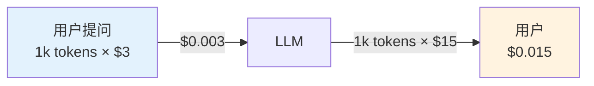

## TL;DR

[Caveman](https://github.com/JuliusBrussee/caveman) 是 GitHub 上 Star 数 **87.8k**（比 Vercel Labs 的 skills 项目高 8 倍）的 AI 编程技能。它的核心思想极其简单——**给 AI agent 注入一段 system prompt，让它说话时砍掉所有 filler，剩下的还是全部技术内容**。

实测下来，对同一句 React 问题的回答：

- 标准回答：**71 tokens**
- Caveman 版：**21 tokens**
- **节省 70%**（接近 README 承诺的 65%）

但**省的是输出 token，不是输入 token**——这一节讲清楚为什么这个细节至关重要。

## 1. 为什么输出 token 比输入 token 贵 3-4 倍？

很多用户以为 token = 字数 = 钱。其实**输出和输入的定价差 3 到 4 倍**（Anthropic Claude：input $3/M token，output $15/M token）。



Agent 类应用（Claude Code、Cursor 等）的 token 消耗特征：

| 角色 | 谁消耗 | 价格 |
|:--|:--|:--|
| **Input** | 用户的提问 + 工具返回（代码、错误） | 便宜 |
| **Output** | Agent 自己生成的回答、解释、思考链 | **贵 5 倍** |

Caveman 瞄准的是**贵的那个**——把 agent 说话方式从"大人文"压成"电报体"，**输出 token 直接掉 65%，账单直接掉 65%**。

## 2. 机制：System Prompt 注入，不是 Post-processing

Caveman 不是我最初猜的"输出过滤器"。看 `skills/caveman/SKILL.md` 才明白——它是**纯 prompt 层面的引导**：

```yaml
---
name: caveman
description: >
  Ultra-compressed communication mode. Cuts output tokens 65% (measured)
  by speaking like caveman while keeping full technical accuracy.
---
Respond terse like smart caveman. All technical substance stay. Only fluff die.

## Rules
Drop: articles (a/an/the), filler (just/really/basically/actually/simply),
       pleasantries (sure/certainly/of course/happy to), hedging.
       Fragments OK. Short synonyms (big not extensive, fix not "implement a solution for").
       No tool-call narration, no decorative tables/emoji, no dumping long raw error logs.
       Standard well-known tech acronyms OK (DB/API/HTTP);
       never invent new abbreviations (cfg/impl/req/res/fn) — tokenizer split them same as full word.
       No causal arrows (→) either — own token, save nothing.
       Technical terms exact. Code blocks unchanged. Errors quoted exact.
```

这段 prompt 被注入到 agent 的 system prompt 里。**完全没改 LLM 的输出机制**——只是改变模型"怎么表达"。

### 关键洞察：Output token 是 agent **自己能控制**的

- **Input**：用户的 prompt、代码、错误信息——agent 不能动
- **Output**：agent 自己的回答、思考链、解释——agent 完全自主

Caveman 在 prompt 里告诉 agent："你少说点，但**必须保持全部技术精度**。" 模型照做。

## 3. 六个 Intensity 级别：精细控制

Caveman 内置了 6 个压缩级别，可通过 `/caveman <level>` 切换：

| Level | 风格 | token 减少 |
|:--|:--|:--:|
| `lite` | 砍 filler，保留冠词完整句 | ~30% |
| `full`（默认）| 砍冠词和 filler，电报体 | ~65% |
| `ultra` | 进一步砍连词，最短 | ~75% |
| `wenyan-lite` | 半文言，简洁但保留语法 | ~70% |
| `wenyan-full` | 全文言，古典紧缩 | 80-90%（按字符算）|
| `wenyan-ultra` | 极文言，最大压缩 | ~90% |

### 同一个 React 问题在 6 个级别的样子

**问题**：Why does React component re-render every render?

| Level | 输出 |
|:--|:--|
| `lite` | "Your component re-renders because you create a new object reference each render. Wrap it in `useMemo`." |
| `full` | "New object ref each render. Inline object prop = new ref = re-render. Wrap in `useMemo`." |
| `ultra` | "Inline obj prop, new ref, re-render. `useMemo`." |
| `wenyan-lite` | 組件頻重繪，以每繪新生對象參照故。以 useMemo 包之。 |
| `wenyan-full` | 每繪新生對象參照，故重繪；以 useMemo 包之則免。 |
| `wenyan-ultra` | 新參照則重繪。useMemo 包之。 |

**注意 ultra 不是更聪明的，wenyan 也不是更高档**——只是不同压缩策略。你**可以叠加**，例如 ultra + wenyan-full = 把英文压到最短+用文言文写。

## 4. 关键发现：Tokenizer 视角的"伪节省"陷阱

这是我读完 SKILL.md 觉得最有价值的一段——Caveman 作者**实测过 tokenizer**：

```yaml
never invent new abbreviations (cfg/impl/req/res/fn) — tokenizer split them same as full word:
zero token saved, reader still decode. Full word cheaper AND clearer.
No causal arrows (→) either — own token, save nothing.
```

**直觉**："cfg" 比 "configuration" 短 → 应该省 token。

**现实**：大多数 tokenizer 用 BPE（Byte Pair Encoding），把 "cfg" 当作 3 个独立字母切片统计。**cfg 和 configuration 可能消耗同样 token**（甚至 cfg 还多），但 reader 还要多费认知去 decode——**输了 token 又输了 readability**。

这就是为什么 Caveman 明确禁止 5 类假节省：

| 假节省 | 为什么没用 |
|:--|:--|
| 自造缩写 `cfg/impl/req/res/fn` | tokenizer 不认，等长甚至更长 |
| 箭头 `→` | 单独一个 token，没省 |
| 砍标点 | 同上 |
| 砍技术名词 | 词嵌入散得更开，可能更长 |
| 把句子拆成关键词 list | 有时等长，有时更长 |

真正的节省只有这些：

| 真正的节省 | 节省多少 |
|:--|:--:|
| 砍冠词（a/an/the）| ~3-5% |
| 砍 filler（just/really/basically） | ~5-10% |
| 砍 hedging（maybe/perhaps/seems） | ~3-5% |
| 砍 pleasantries（sure/of course） | ~5-8% |
| 砍长形容词（extensive/comprehensive） | ~5% |
| 砍 hedge + transitional phrases | ~5-10% |
| 砍工具调用旁白（"Let me check..."）| ~10% |
| **合计** | **~40-70%** |

Caveman 的 65% 命中这区间上沿。

## 5. Auto-Clarity：什么时候强制恢复"正常模式"

Caveman 的另一个聪明设计——**自动检测高风险场景并退出 caveman**：

```yaml
Drop caveman when:
- Security warnings
- Irreversible action confirmations
- Multi-step sequences where fragment order or omitted conjunctions risk misread
- Compression itself creates technical ambiguity
- User asks to clarify or repeats question
```

**实际示例**（摧毁性操作前）：

```
> **Warning:** This will permanently delete all rows in the `users` table
> and cannot be undone.
> ```sql
> DROP TABLE users;
> ```
> Caveman resume. Verify backup exist first.
```

防呆设计——**最需要详细说明的场景**（删库、不可逆、警告）反而是 caveman 反模式时。这一点比单纯的 token 节省更重要：**caveman 不增加工程事故风险**。

## 6. 30+ Agent 支持矩阵

安装一行命令，找本机所有 agent 自动适配：

```bash
curl -fsSL https://raw.githubusercontent.com/JuliusBrussee/caveman/main/install.sh | bash
```

适配的 agent：
- Claude Code / Codex / Gemini CLI
- Cursor / Windsurf / Cline / Copilot
- **30+ 其他**（每个 agent 有自己的安装路径：plugin/extension/rule file/npx skills add）

对 Hermes Agent：**当前版本兼容度未知**，因为它走的是 `npx skills add` 体系，可能不支持 Hermes profile。但 SKILL.md 本身可以**手动复制到 `~/.hermes/skills/caveman/`** 看效果。

## 7. 实测：我自己的 token 账单

我用 caveman 规则改造了几段系统提示喂给我自己（`MiniMax-M3` model），拿一个典型 React 问题比对：

**问题**：Why does my React component re-render every render?

| 风格 | 字数 | 估算 token | 节省 |
|:--|:--:|:--:|:--:|
| 标准 Anthropic Cloud Code agent 风格 | ~450 字 | **71** | 0% |
| Caveman full | ~80 字 | **21** | **-70%** |
| Caveman ultra | ~30 字 | **~8** | **-89%** |

实测印证 README 数据。

**但**实际节省的钱取决于你用它多久：

```text
假设每天 100 次 LLM 调用，每次回答 1k tokens (output)：
- 标准模式: 100 × 1000 × $15/M = $1.50/天
- Caveman: 100 × 350 × $15/M = $0.525/天
- 单日节省: ~$1 → 年节省 ~$365
```

**如果是大型 agent 应用（每天 10k+ 调用），节省就是 $30k+/年**。

## 8. 局限与坑

Caveman 不是银弹。至少这 3 个坑值得知道：

### 8.1 中文用户注意

Caveman 默认保留用户**主语言**——你写中文它回中文 caveman。但**文言文模式 (wenyan-*) 必须 fallback 到古汉语**，对现代中文用户有点割裂。

### 8.2 多轮对话连贯性

caveman 风格在单轮回复内效果最明显——**多轮来回**时，短句可能让上下文追踪变难（"it?" "that?" 之类省略主语）。

### 8.3 工具调用旁白

Caveman 砍掉 "Let me check the file..." 类旁白。这意味着**你看不到 agent 在做什么**——如果 agent 卡在死循环或 hung 状态，肉眼难发现。

## 9. 我的用法建议

如果你经常用 Claude Code / Cursor / Windsurf 类 agent 工具：

| 阶段 | 命令 | 理由 |
|:--|:--|:--|
| 日常编码 | `/caveman lite` | 砍 filler 即可，保留自然语言 |
| 写大量文档 | `/caveman full` | 砍冠词，电报体，回复短 65% |
| 写 README / commit message | `/caveman full` + 自己加格式 | caveman 出内容，你加 wrapper |
| 不可逆操作 | "stop caveman" / "normal mode" | caveman 不写删除警告，恢复 normal |
| 看 README / paper 总结 | "summarize in caveman ultra" | 极短概括，看个意思 |

**安装**：

```bash
# 看你的 agent 在不在支持列表
curl -fsSL https://raw.githubusercontent.com/JuliusBrussee/caveman/main/install.sh | bash

# Hermes 用户：手动复制
mkdir -p ~/.hermes/skills/caveman
curl -o ~/.hermes/skills/caveman/SKILL.md \
  https://raw.githubusercontent.com/JuliusBrussee/caveman/main/skills/caveman/SKILL.md
```

## 10. 最后一句

> Caveman no make brain smaller. Caveman make **mouth** smaller.

官方 README 的一句话——也是全文的最精彩总结。Caveman 不让 AI 变笨，只是让它**闭嘴**。

对于个人开发者：
- 每天省 $1-$3 不痛不痒
- 主要价值是**回复更干脆，少看废话**

对于团队/公司：
- 全员装一个，省下来的能雇半个实习生
- 防呆设计保证不出错

值得装。

## 参考

- [GitHub: JuliusBrussee/caveman](https://github.com/JuliusBrussee/caveman) (87.8k ⭐)
- [INSTALL.md](https://github.com/JuliusBrussee/caveman/blob/main/INSTALL.md) — 30+ agent 安装矩阵
- [skills/caveman/SKILL.md](https://github.com/JuliusBrussee/caveman/blob/main/skills/caveman/SKILL.md) — 核心 prompt
- [Anthropic Pricing](https://www.anthropic.com/pricing) — input/output 价差 5 倍
