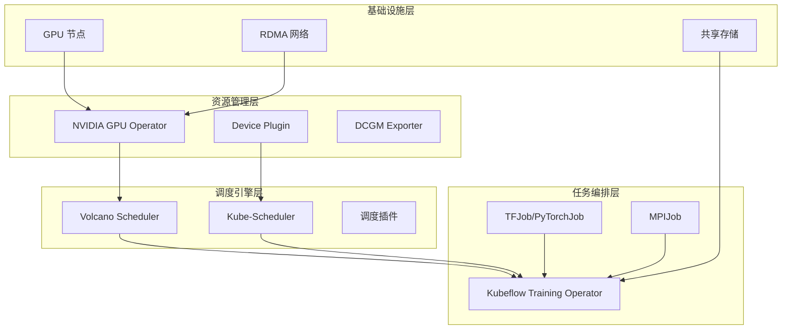
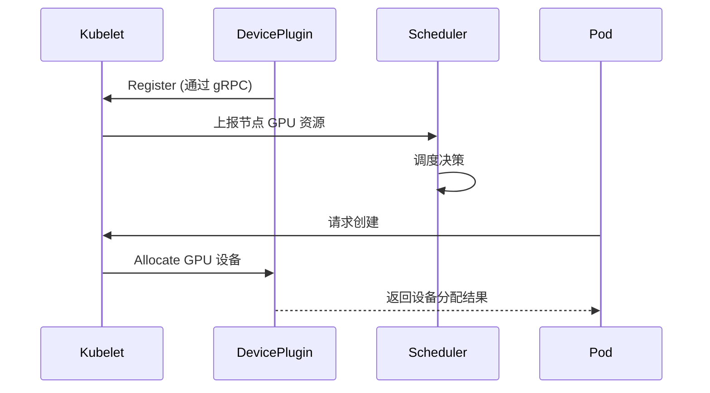
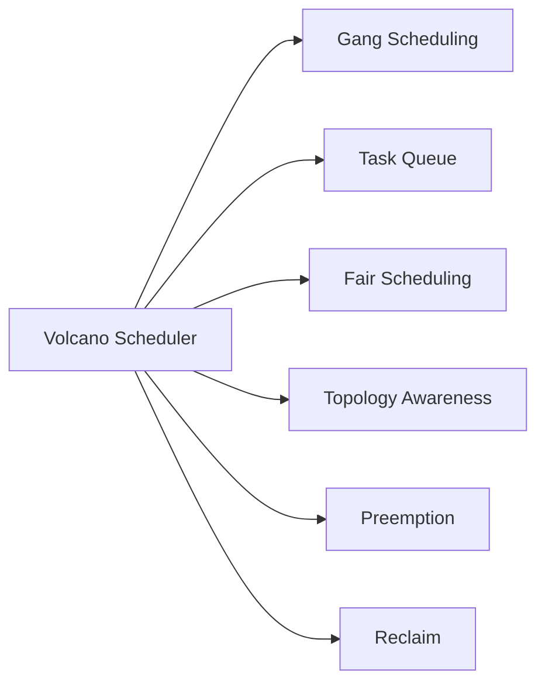
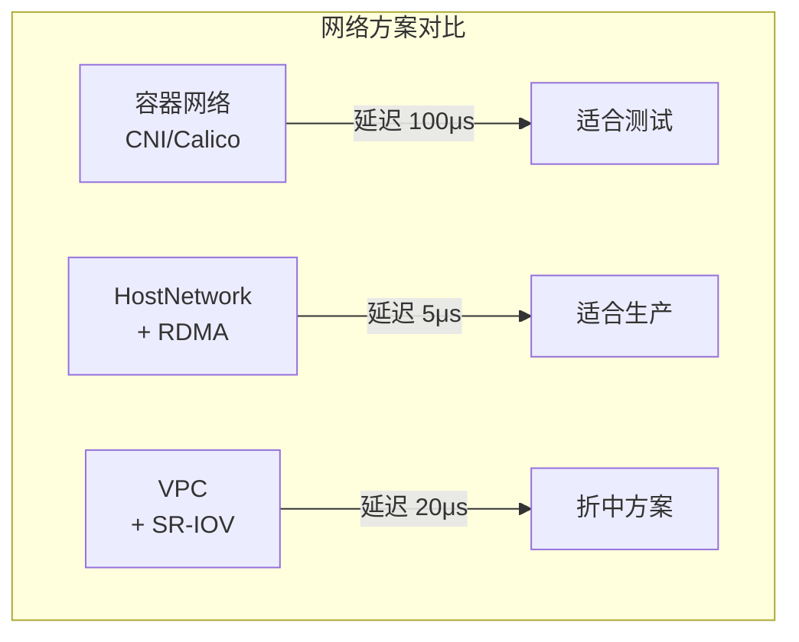
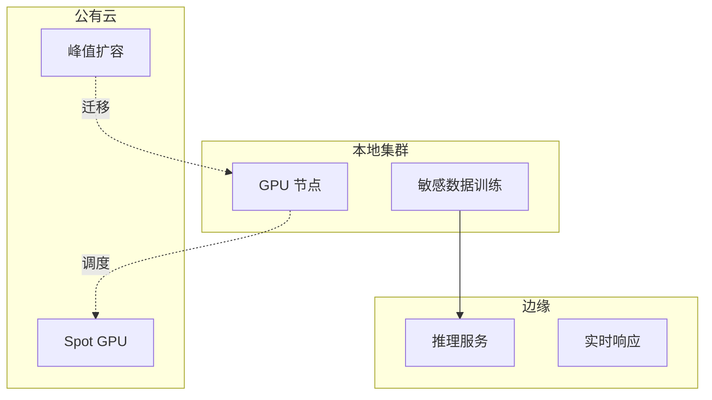
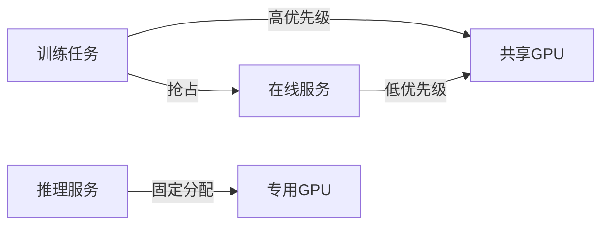

## 概述

随着人工智能技术的快速发展，AI 训练和推理工作负载对计算资源的需求呈现爆发式增长。Kubernetes 作为云原生事实上的容器编排标准，已成为企业构建 AI 基础设施的首选平台。

然而，AI 工作负载与传统的在线服务有显著差异：**资源需求大、运行时间长、任务间有依赖关系、需要 Gang 调度**等。这些特点使得 Kubernetes 原生的调度器无法完全满足 AI 场景的需求。

本文将详细介绍如何基于 Kubernetes 构建一套完整的 AI 算力调度系统，包括底层 GPU 资源管理、调度层设计、以及上层训练任务编排等核心技术栈。

## 整体架构

AI 算力调度系统自下而上可分为四层架构：



## 一、GPU 资源管理层

### 1.1 Device Plugin 机制

Kubernetes 通过 **Device Plugin** 机制实现对异构硬件（如 GPU、FPGA、RDMA 网卡）的统一管理。Device Plugin 是一个运行在节点上的 gRPC 服务，负责：

- 发现节点上的硬件设备
- 向 Kubelet 注册可调度资源
- 监控设备健康状态
- 在 Pod 启动时完成设备分配



### 1.2 NVIDIA GPU Operator

NVIDIA GPU Operator 是自动化管理 Kubernetes 集群中 GPU 资源的 Operator，它封装了以下组件：

| 组件 | 功能 | 部署方式 |
|------|------|----------|
| **NVIDIA Driver Installer** | 容器化安装 GPU 驱动 | DaemonSet |
| **NVIDIA Container Toolkit** | 提供容器运行时 GPU 支持 | DaemonSet |
| **NVIDIA Device Plugin** | 向 K8s 注册 GPU 资源 | DaemonSet |
| **DCGM Exporter** | GPU 监控指标采集 | DaemonSet |
| **GPU Feature Discovery (GFD)** | 收集 GPU 特性并打标签 | DaemonSet |
| **MIG Manager** | 多实例 GPU 管理 (A100/H100) | DaemonSet |

**安装 GPU Operator：**

```bash
# 添加 NVIDIA Helm 仓库
helm repo add nvidia https://helm.ngc.nvidia.com/nvidia
helm repo update

# 安装 GPU Operator
helm install --wait --generate-name \
  -n gpu-operator --create-namespace \
  nvidia/gpu-operator \
  --set driver.enabled=true \
  --set driver.version=535.104.05 \
  --set devicePlugin.enabled=true \
  --set dcgmExporter.enabled=true \
  --set gfd.enabled=true
```

安装完成后，GPU 资源会以扩展资源的形式暴露给 Kubernetes：

```bash
# 查看节点 GPU 资源
kubectl describe node <gpu-node> | grep nvidia.com

# 输出示例：
# nvidia.com/gpu:     8
# nvidia.com/gpu.product: NVIDIA-H100-80GB
# nvidia.com/mig:     0
```

### 1.3 GPU 资源申请方式

#### 完卡分配（原生支持）

最简单的 GPU 使用方式，每个 Pod 独占完整的 GPU 卡：

```yaml
apiVersion: v1
kind: Pod
metadata:
  name: gpu-pod
spec:
  containers:
  - name: training-container
    image: pytorch/pytorch:2.0.1-cuda11.7-cudnn8-runtime
    resources:
      limits:
        nvidia.com/gpu: 4  # 申请 4 张 GPU 卡
    command: ["python", "train.py"]
```

#### GPU 共享（第三方方案）

针对推理场景或小模型训练，可使用 GPU 共享技术实现单卡多容器：

| 方案 | 隔离级别 | 限制 |
|------|----------|------|
| **NVIDIA MPS** | 服务级隔离 | 需要应用适配 MPS |
| **阿里云 cGPU** | 显存隔离 | 内核态隔离，性能好 |
| **腾讯云 qGPU** | 显存+算力隔离 | 支持算力切分 |
| **NVIDIA MIG** | 物理隔离 | 仅支持 A100/H100 |

以 cGPU 为例的共享 GPU 配置：

```yaml
apiVersion: v1
kind: Pod
metadata:
  name: gpu-shared-pod
spec:
  containers:
  - name: inference-container
    image: pytorch/pytorch:2.0.1-cuda11.7-cudnn8-runtime
    resources:
      limits:
        aliyun.com/gpu-mem: 10  # 申请 10GB 显存
        # aliyun.com/gpu-core: 30  # 可选：申请 30% 算力
```

## 二、调度引擎层

### 2.1 原生调度器的局限性

Kubernetes 原生的 Kube-Scheduler 主要面向在线服务设计，在 AI 场景下存在以下问题：

| 问题 | 描述 | 影响 |
|------|------|------|
| **逐个调度** | Pod 一个一个独立调度 | Gang 调度场景下资源死锁 |
| **无任务队列** | 无法实现任务排队 | 高峰期资源争抢严重 |
| **缺少公平调度** | 不支持多租户配额 | 某些任务可能长期饥饿 |
| **无拓扑感知** | 不考虑 NUMA/PCIe 拓扑 | 跨 Socket 通信性能差 |

### 2.2 Volcano 调度器

**Volcano** 是华为云开源的批处理调度器，专为 AI、大数据等场景设计，源自 Kubeflow 的 Kube-Batch 项目。

#### 核心特性



#### 安装 Volcano

```bash
# 使用 Helm 安装 Volcano
helm repo add volcano-sh https://volcano-sh.github.io/charts
helm install volcano volcano-sh/volcano -n volcano-system --create-namespace

# 验证安装
kubectl get pods -n volcano-system
```

#### 核心概念

Volcano 引入了以下自定义资源：

```yaml
# Queue：任务队列，用于多租户隔离和公平调度
apiVersion: scheduling.volcano.sh/v1beta1
kind: Queue
metadata:
  name: default-queue
spec:
  weight: 1  # 队列权重
  capability:
    cpu: "100"
    memory: "500G"
    nvidia.com/gpu: "50"
  guaranteed:
    cpu: "20"
    memory: "100G"
    nvidia.com/gpu: "10"
```

```yaml
# PodGroup：一组需要协同调度的 Pod
apiVersion: scheduling.volcano.sh/v1beta1
kind: PodGroup
metadata:
  name: training-job-group
spec:
  minMember: 8        # 最小满足成员数（Gang 调度）
  minTaskMember:      # 各 Task 最小成员数
    master: 1
    worker: 4
  queue: default-queue
  priorityClassName: high-priority
```

```yaml
# Volcano Job：批处理任务定义
apiVersion: batch.volcano.sh/v1beta1
kind: Job
metadata:
  name: distributed-training
spec:
  minAvailable: 5
  schedulerName: volcano
  queue: default-queue
  tasks:
  - name: master
    replicas: 1
    template:
      spec:
        containers:
        - name: master
          image: pytorch/pytorch:2.0.1-cuda11.7-cudnn8-runtime
          resources:
            limits:
              nvidia.com/gpu: 1
  - name: worker
    replicas: 4
    template:
      spec:
        containers:
        - name: worker
          image: pytorch/pytorch:2.0.1-cuda11.7-cudnn8-runtime
          resources:
            limits:
              nvidia.com/gpu: 4
```

#### Gang Scheduling 原理

Gang 调度是 AI 分布式训练的核心需求，确保一个任务的所有 Pod 同时满足资源时才启动：

```mermaid
stateDiagram-v2
    [*] --> Pending: 任务提交
    Pending --> Inqueue: 进入队列
    Inqueue --> Allocating: 资源检查
    Allocating --> Pending: 资源不足
    Allocating --> Running: 资源满足
    Running --> [*] --> Completed: 任务完成
    Running --> Failed: Pod 异常
```

### 2.3 调度策略配置

Volcano 支持丰富的调度策略，可通过 ConfigMap 配置：

```yaml
apiVersion: v1
kind: ConfigMap
metadata:
  name: volcano-scheduler-config
  namespace: volcano-system
data:
  volcano-scheduler.conf: |
    actions: "enqueue, allocate, backfill"
    tiers:
    - plugins:
      - name: priority
      - name: gang
      - name: conformance
    - plugins:
      - name: drf
      - name: predicates
      - name: nodeorder
      - name: binpack
```

**常用调度插件说明：**

| 插件 | 功能 | 配置参数 |
|------|------|----------|
| **priority** | 基于优先级调度 | priorityClassName |
| **gang** | Gang 调度支持 | minAvailable |
| **predicates** | 节点预选过滤 | GPU、CPU、内存等 |
| **nodeorder** | 节点优选打分 | binpack / spread |
| **drf** | 主资源公平调度 | dominantResource |
| **overcommit** | 资源超卖 | overcommit-factor |

## 三、任务编排层

### 3.1 Kubeflow Training Operator

Training Operator（原 Kubeflow Training）是 Kubeflow 社区维护的训练任务 Operator，支持多种分布式训练框架。

#### 支持的作业类型

| 作业类型 | 框架 | 分布式后端 |
|----------|------|-----------|
| **TFJob** | TensorFlow | Parameter Server / AllReduce |
| **PyTorchJob** | PyTorch | DistributedDataParallel |
| **MPIJob** | MPI (Horovod) | NCCL |
| **PaddleJob** | PaddlePaddle | Fleet |
| **XGBoostJob** | XGBoost | Rabit |

#### 安装 Training Operator

```bash
kubectl apply -k "github.com/kubeflow/training-operator/manifests/overlays/standalone?ref=v1.7.0"

# 验证安装
kubectl get pods -n kubeflow
```

### 3.2 PyTorchJob 示例

```yaml
apiVersion: kubeflow.org/v1
kind: PyTorchJob
metadata:
  name: pytorch-distributed
  namespace: ai-workloads
spec:
  elasticPolicy:
    rdzvBackend: c10d
    minReplicas: 4
    maxReplicas: 8
    maxRestarts: 10
  pytorchReplicaSpecs:
    Master:
      replicas: 1
      restartPolicy: OnFailure
      template:
        spec:
          containers:
          - name: pytorch
            image: pytorch/pytorch:2.0.1-cuda11.7-cudnn8-runtime
            args:
            - torchrun
            - --nnodes=4
            - --nproc_per_node=8
            - --master_addr=${MASTER_ADDR}
            - --master_port=${MASTER_PORT}
            - --node_rank=${NODE_RANK}
            - train.py
            resources:
              limits:
                nvidia.com/gpu: 1
            volumeMounts:
            - name: data
              mountPath: /data
    Worker:
      replicas: 4
      restartPolicy: OnFailure
      template:
        spec:
          schedulerName: volcano  # 使用 Volcano 调度器
          containers:
          - name: pytorch
            image: pytorch/pytorch:2.0.1-cuda11.7-cudnn8-runtime
            args:
            - torchrun
            - --nnodes=4
            - --nproc_per_node=8
            - --master_addr=pytorch-distributed-master-0
            - --master_port=29500
            - --node_rank=${RANK}
            - train.py
            resources:
              limits:
                nvidia.com/gpu: 8
                memory: "200Gi"
              requests:
                cpu: "32"
                memory: "200Gi"
            volumeMounts:
            - name: data
              mountPath: /data
          volumes:
          - name: data
            persistentVolumeClaim:
              claimName: training-data-pvc
```

### 3.3 通信优化

AI 分布式训练对网络通信极其敏感，需要特别优化：

#### RDMA 网络

```yaml
# SR-IOV 网络设备插件配置
apiVersion: v1
kind: Pod
metadata:
  name: rdma-pod
  annotations:
    k8s.v1.cni.cncf.io/networks: rdma-network
spec:
  containers:
  - name: training
    image: pytorch/pytorch:2.0.1-cuda11.7-cudnn8-runtime
    resources:
      limits:
        rdma/roce_v2: "1"  # 申请 RDMA 设备
        nvidia.com/gpu: 8
```

#### 拓扑感知调度

使用 Node Affinity 确保 Pod 调度到网络拓扑相近的节点：

```yaml
spec:
  affinity:
    podAntiAffinity:
      requiredDuringSchedulingIgnoredDuringExecution:
      - labelSelector:
          matchLabels:
            app: training-job
        topologyKey: kubernetes.io/hostname
    nodeAffinity:
      requiredDuringSchedulingIgnoredDuringExecution:
        nodeSelectorTerms:
        - matchExpressions:
          - key: nvidia.com/gpu.product
            operator: In
            values:
            - NVIDIA-H100-80GB
          - key: topology.kubernetes.io/zone
            operator: In
            values:
            - zone-a
```

## 四、监控与可观测性

### 4.1 GPU 监控

基于 DCGM (Data Center GPU Manager) 采集 GPU 指标：

```yaml
apiVersion: v1
kind: ConfigMap
metadata:
  name: dcgm-exporter-config
data:
  dcgm-exporter.yaml: |
    metrics:
      - name: DCGM_FI_DEV_GPU_TEMP
        type: gauge
      - name: DCGM_FI_DEV_GPU_UTIL
        type: gauge
      - name: DCGM_FI_DEV_FB_USED
        type: gauge
      - name: DCGM_FI_DEV_POWER_USAGE
        type: gauge
      - name: DCGM_FI_DEV_SM_CLOCK
        type: gauge
```

### 4.2 Prometheus + Grafana 监控

```yaml
# Prometheus 配置
apiVersion: v1
kind: ConfigMap
metadata:
  name: prometheus-config
data:
  prometheus.yml: |
    scrape_configs:
    - job_name: 'dcgm-exporter'
      kubernetes_sd_configs:
      - role: pod
        namespaces:
          names:
          - gpu-operator
      relabel_configs:
      - source_labels: [__meta_kubernetes_pod_label_app]
        action: keep
        regex: dcgm-exporter
      - source_labels: [__meta_kubernetes_pod_ip]
        action: replace
        target_label: __address__
        regex: (.*)
        replacement: ${1}:9400
```

**关键监控指标：**

| 指标 | 说明 | 告警阈值 |
|------|------|----------|
| `DCGM_FI_DEV_GPU_UTIL` | GPU 利用率 | < 30% 持续 10 分钟 |
| `DCGM_FI_DEV_GPU_TEMP` | GPU 温度 | > 85°C |
| `DCGM_FI_DEV_FB_USED` | 显存使用 | > 90% |
| `DCGM_FI_DEV_POWER_USAGE` | 功耗 | > 额定功率 95% |
| `DCGM_FI_DEV_ECC_SBE_AGG_TOTAL` | 单比特错误 | 累计增长过快 |

## 五、生产实践建议

### 5.1 资源配额管理

```yaml
# Namespace 级别的资源配额
apiVersion: v1
kind: ResourceQuota
metadata:
  name: gpu-quota
  namespace: ai-team-a
spec:
  hard:
    requests.cpu: "500"
    requests.memory: "2000Gi"
    requests.nvidia.com/gpu: "50"
    limits.cpu: "1000"
    limits.memory: "4000Gi"
    limits.nvidia.com/gpu: "100"
    persistentvolumeclaims: "50"
```

### 5.2 优先级与抢占

```yaml
# 优先级类定义
apiVersion: scheduling.k8s.io/v1
kind: PriorityClass
metadata:
  name: production-training
value: 1000
globalDefault: false
description: "生产环境训练任务优先级"

---
apiVersion: scheduling.k8s.io/v1
kind: PriorityClass
metadata:
  name: development-training
value: 500
globalDefault: false
description: "开发环境训练任务优先级"

---
apiVersion: scheduling.k8s.io/v1
kind: PriorityClass
metadata:
  name: low-priority-training
value: 100
globalDefault: true
description: "低优先级训练任务"
```

### 5.3 节点污点管理

```yaml
# 为 GPU 节点添加污点
kubectl taint nodes gpu-node-01 gpu-node=true:NoSchedule
kubectl taint nodes gpu-node-01 gpu-type=A100:NoSchedule

# Pod 容忍污点
spec:
  tolerations:
  - key: gpu-node
    operator: Equal
    value: "true"
    effect: NoSchedule
  - key: gpu-type
    operator: Equal
    value: A100
    effect: NoSchedule
  nodeSelector:
    gpu-type: A100
```

## 六、架构决策记录

在构建 K8S AI 算力调度系统时，需要做出一系列关键架构决策。以下记录主要决策点及其权衡。

### ADR-001: 调度器选择

**决策**：使用 Volcano 替代原生 Kube-Scheduler

| 方案 | 优势 | 劣势 | 适用场景 |
|------|------|------|----------|
| **Kube-Scheduler** | 原生支持、稳定可靠 | 缺少 Gang 调度、无任务队列 | 在线服务、简单批处理 |
| **Volcano** | Gang 调度、任务队列、公平调度 | 额外组件维护成本 | AI 训练、大数据处理 |
| **YuniKorn** | Apache 顶级项目、资源模型灵活 | 社区相对较小 | 混合负载、多租户 |

**决策理由**：
1. AI 分布式训练必须支持 Gang 调度
2. 任务队列机制能有效管理训练作业排队
3. 华为云生产环境验证，社区活跃度高

### ADR-002: GPU 资源管理方式

**决策**：采用 GPU Operator + Device Plugin 架构

| 方案 | 优势 | 劣势 | 推荐指数 |
|------|------|------|----------|
| **手动安装驱动** | 灵活可控 | 维护成本高、版本管理困难 | ⭐⭐ |
| **GPU Operator** | 自动化运维、版本统一 | 依赖 Helm | ⭐⭐⭐⭐⭐ |
| **云厂商托管** | 零运维 | 供应商锁定 | ⭐⭐⭐⭐ |

### ADR-003: 网络架构选择

**决策**：RDMA (RoCE) + HostNetwork



### ADR-004: 存储方案选择

| 方案 | 性能 | 成本 | 推荐场景 |
|------|------|------|----------|
| **NFS/CPFS** | 中 | 低 | 开发测试、小模型 |
| **SAN/块存储** | 高 | 高 | 生产训练、大模型 |
| **对象存储 + 缓存** | 中 | 低 | 数据湖、长期存储 |

### ADR-005: 多租户隔离策略

**决策**：Namespace + ResourceQuota + Queue 三层隔离

```yaml
# 层级结构
Namespace (团队隔离)
  ├── ResourceQuota (资源配额)
  ├── LimitRange (默认限制)
  └── Volcano Queue (任务队列)
      ├── PriorityClass (优先级)
      └── PodGroup (Gang 调度)
```

## 七、2025 技术趋势

### 7.1 K8S 原生 DRA 支持

Kubernetes 1.26+ 引入的 **Dynamic Resource Allocation (DRA)** 正在改变 GPU 管理方式：

```yaml
# 传统方式
resources:
  limits:
    nvidia.com/gpu: 2

# DRA 方式（未来）
resources:
  claims:
  - name: gpu-claim
    deviceClassName: nvidia.com/gpu
```

**DRA 优势**：
- 支持细粒度资源分配（显存、算力切分）
- 统一的资源申请 API
- 更好的可扩展性

### 7.2 AI 加速器多元化

| 厂商 | 产品 | K8s 支持状态 | 特点 |
|------|------|-------------|------|
| **NVIDIA** | H100/B200 | GPU Operator | 生态最成熟 |
| **AMD** | MI300X | AMD GPU Operator | 性价比高 |
| **Intel** | Gaudi3 | Habana Device Plugin | 推理优化 |
| **国产** | 昇腾910B | Ascend Device Plugin | 本土化支持 |
| **云原生** | AWS Trainium/Inferentia | EKS 自研 | 云端一体 |

### 7.3 Serverless AI 调度

```yaml
# Knative + GPU 示例
apiVersion: serving.knative.dev/v1
kind: Service
metadata:
  name: ai-inference
spec:
  template:
    metadata:
      annotations:
        autoscaling.knative.dev/target: "10"
        autoscaling.knative.dev/class: "hpa.autoscaling.knative.dev"
    spec:
      containers:
      - image: llm-inference:latest
        resources:
          limits:
            nvidia.com/gpu: 1
```

### 7.4 混合云 AI 调度



## 八、完整技术栈总结

| 层级 | 组件 | 开源/商业 |
|------|------|-----------|
| **基础设施** | GPU 节点 (NVIDIA/AMD)、RDMA 网络、分布式存储 | 硬件 |
| **资源管理** | GPU Operator、Device Plugin、DCGM | NVIDIA (开源) |
| **调度引擎** | Volcano Scheduler、YuniKorn | CNCF / Apache |
| **任务编排** | Kubeflow Training Operator、Arena | Kubeflow / 阿里云 |
| **分布式训练** | PyTorch DDP、TensorFlow、DeepSpeed | 开源框架 |
| **网络通信** | RDMA (RoCE)、NCCL、Gloo | 开源 |
| **监控告警** | Prometheus、Grafana、DCGM Exporter | 开源 |
| **日志管理** | Loki、ELK | 开源 |
| **成本优化** | Spot GPU、混合部署、弹性伸缩 | 云厂商 |

## 参考资源

- [NVIDIA GPU Operator Documentation](https://docs.nvidia.com/datacenter/cloud-native/gpu-operator/latest/)
- [Volcano Scheduler GitHub](https://github.com/volcano-sh/volcano)
- [Kubeflow Training Operator](https://github.com/kubeflow/training-operator)
- [Kubernetes Device Plugins](https://kubernetes.io/docs/concepts/extend-kubernetes/compute-storage-net/device-plugins/)

## 九、异构 GPU 调度

在实际生产环境中，往往会同时存在多种型号、不同代际的 GPU。如何高效调度异构 GPU 资源是一个重要课题。

### 7.1 GPU 特性标签

通过 GPU Feature Discovery (GFD) 自动为节点打标签：

```bash
# 查看节点的 GPU 特性标签
kubectl get node -o json | jq '.items[].metadata.labels | select(.["nvidia.com/gpu.count"] != null)'
```

**常用标签：**

| 标签 | 示例值 | 说明 |
|------|--------|------|
| `nvidia.com/gpu.count` | `8` | GPU 数量 |
| `nvidia.com/gpu.product` | `NVIDIA-H100-80GB` | GPU 型号 |
| `nvidia.com/gpu.memory` | `80` | 显存大小 (GB) |
| `nvidia.com/gpu.compute.major` | `9` | 计算能力主版本号 |
| `nvidia.com/mig.enabled` | `true` | 是否启用 MIG |
| `nvidia.com/gpu.driver.version` | `535.104.05` | 驱动版本 |

### 7.2 分层调度策略

针对不同训练任务对 GPU 的需求，实现分层调度：

```yaml
# 大模型训练 - 使用 H100 高性能节点
apiVersion: v1
kind: Pod
metadata:
  name: llm-training
spec:
  nodeSelector:
    gpu-tier: high-performance  # H100/A100 节点
  tolerations:
  - key: nvidia.com/gpu.product
    operator: Equal
    value: "NVIDIA-H100-80GB"
    effect: NoSchedule
  containers:
  - name: trainer
    resources:
      limits:
        nvidia.com/gpu: 8

---
# 小模型微调 - 使用 A40/V100 节点
apiVersion: v1
kind: Pod
metadata:
  name: finetuning
spec:
  nodeSelector:
    gpu-tier: standard  # A40/V100 节点
  containers:
  - name: trainer
    resources:
      limits:
        nvidia.com/gpu: 4

---
# 推理服务 - 使用 T4/L4 节点
apiVersion: v1
kind: Pod
metadata:
  name: inference
spec:
  nodeSelector:
    gpu-tier: inference  # T4/L4 节点
  containers:
  - name: server
    resources:
      limits:
        nvidia.com/gpu: 1
```

### 7.3 优先级调度配置

使用 Volcano 的节点排序插件实现智能节点选择：

```yaml
apiVersion: v1
kind: ConfigMap
metadata:
  name: volcano-scheduler-config
  namespace: volcano-system
data:
  volcano-scheduler.conf: |
    tiers:
    - plugins:
      - name: predicates
      - name: nodeorder
      - name: binpack
    nodeorder:
      - name: gpu-aware
        args: |
          {
            "gpuMemoryWeight": 1.0,
            "gpuComputeWeight": 0.8,
            "interGPUCommsWeight": 0.5
          }
```

## 八、故障排查与调优

### 8.1 常见问题诊断

#### 问题 1：Pod 一直处于 Pending 状态

```bash
# 查看 Pod 事件
kubectl describe pod <pod-name>

# 常见原因及解决方案
kubectl get events --sort-by=.metadata.creationTimestamp
```

| 现象 | 原因 | 解决方案 |
|------|------|----------|
| `Insufficient nvidia.com/gpu` | GPU 资源不足 | 等待资源释放或增加节点 |
| `MatchNodeSelector` | 节点选择器不匹配 | 检查 nodeSelector 和污点配置 |
| `PodGroup not ready` | Gang 调度未满足 | 检查 minAvailable 配置 |

#### 问题 2：GPU 利用率低

```bash
# 进入容器检查 GPU 状态
kubectl exec -it <pod-name> -- nvidia-smi

# 检查数据加载是否成为瓶颈
kubectl exec -it <pod-name> -- nvidia-smi dmon -s u -c 10

# 检查训练脚本是否正确检测到 GPU
kubectl logs <pod-name> | grep -i cuda
```

**常见原因：**
- 数据加载过慢，GPU 等待数据
- Batch Size 过小，无法充分利用 GPU
- CPU 亲和性配置不当，跨 NUMA 访问

#### 问题 3：分布式训练通信慢

```bash
# 检查 NCCL 环境变量
kubectl exec -it <pod-name> -- env | grep NCCL

# 检查网络带宽
kubectl exec -it <pod-name> -- ibstat  # RDMA 网卡状态
kubectl exec -it <pod-name> -- perf_query  # RoCE 状态
```

**优化建议：**

| 配置项 | 推荐值 | 说明 |
|--------|--------|------|
| `NCCL_IB_DISABLE` | `0` | 启用 InfiniBand/RoCE |
| `NCCL_SOCKET_IFNAME` | `ib0` | RDMA 网卡接口 |
| `NCCL_DEBUG` | `INFO` | 调试信息级别 |
| `NCCL_ALGO` | `Ring/Tree` | 通信算法选择 |

### 8.2 性能调优参数

#### 调度器调优

```yaml
# Volcano 调度器性能优化
apiVersion: v1
kind: ConfigMap
metadata:
  name: volcano-scheduler-config
data:
  volcano-scheduler.conf: |
    --enable-queue-schedule=true
    --cache-pod-group-interval=30s
    --scheduler-worker-threads=16
    --bind-worker-threads=8
    --min-resync-interval=12h
```

#### 节点调优

```yaml
# Kubelet 调优参数
# /etc/kubernetes/kubelet
--pod-max-pids=1000000          # 大模型训练可能需要大量进程
--max-pods=500                  # 根据节点资源调整
--cpu-manager-policy=static     # CPU 静态绑核
--topology-manager-policy=best-effort  # NUMA 拓扑管理
--kube-reserved=cpu=4,memory=8Gi  # 为系统预留资源
--system-reserved=cpu=2,memory=4Gi
```

## 九、典型场景实战

### 9.1 大语言模型分布式训练

```yaml
apiVersion: kubeflow.org/v1
kind: PyTorchJob
metadata:
  name: llm-training-70b
spec:
  elasticPolicy:
    rdzvBackend: c10d
    minReplicas: 8
    maxReplicas: 16
  pytorchReplicaSpecs:
    Master:
      replicas: 1
      restartPolicy: OnFailure
      template:
        spec:
          schedulerName: volcano
          containers:
          - name: master
            image: pytorch/pytorch:2.1.0-cuda12.1-cudnn8-runtime
            command:
            - torchrun
            - --nnodes=8
            - --nproc_per_node=8
            - --master_addr=${MASTER_ADDR}
            - --master_port=29500
            - --node_rank=${NODE_RANK}
            - train_llm.py
            - --model=llama-70b
            - --batch_size=4
            - --gradient_accumulation_steps=16
            env:
            - name: NCCL_IB_DISABLE
              value: "0"
            - name: NCCL_SOCKET_IFNAME
              value: "ib0"
            - name: CUDA_VISIBLE_DEVICES
              value: "0,1,2,3,4,5,6,7"
            resources:
              limits:
                nvidia.com/gpu: 8
                memory: "500Gi"
              requests:
                cpu: "96"
                memory: "500Gi"
            volumeMounts:
            - name: shm
              mountPath: /dev/shm
            - name: data
              mountPath: /data
          volumes:
          - name: shm
            emptyDir:
              medium: Memory
              sizeLimit: "16Gi"  # NCCL 需要大共享内存
          - name: data
            persistentVolumeClaim:
              claimName: llm-data-pvc
          nodeSelector:
            gpu-tier: high-performance
    Worker:
      replicas: 8
      restartPolicy: OnFailure
      template:
        spec:
          schedulerName: volcano
          hostNetwork: true  # RDMA 场景使用主机网络
          containers:
          - name: worker
            image: pytorch/pytorch:2.1.0-cuda12.1-cudnn8-runtime
            command:
            - torchrun
            - --nnodes=8
            - --nproc_per_node=8
            - --master_addr=llm-training-70b-master-0
            - --master_port=29500
            - --node_rank=${RANK}
            - train_llm.py
            env:
            - name: NCCL_IB_DISABLE
              value: "0"
            - name: NCCL_SOCKET_IFNAME
              value: "ib0"
            resources:
              limits:
                nvidia.com/gpu: 8
                memory: "500Gi"
            volumeMounts:
            - name: shm
              mountPath: /dev/shm
          volumes:
          - name: shm
            emptyDir:
              medium: Memory
              sizeLimit: "16Gi"
          nodeSelector:
            gpu-tier: high-performance
```

### 9.2 推理服务弹性伸缩

```yaml
# 使用 KEDA 基于请求数量自动扩缩容
apiVersion: keda.sh/v1alpha1
kind: ScaledObject
metadata:
  name: llm-inference-scaler
spec:
  scaleTargetRef:
    name: llm-inference-deployment
  minReplicaCount: 2
  maxReplicaCount: 20
  cooldownPeriod: 300
  triggers:
  - type: prometheus
    metadata:
      serverAddress: http://prometheus:9090
      metricName: http_requests_total
      threshold: '1000'
      query: rate(http_requests_total[1m])
```

## 十、成本优化策略

### 10.1 Spot GPU 利用

利用云厂商的 Spot 实例大幅降低 GPU 成本：

```yaml
apiVersion: v1
kind: Pod
metadata:
  name: spot-training
spec:
  schedulerName: volcano
  containers:
  - name: trainer
    resources:
      limits:
        nvidia.com/gpu: 4
  nodeSelector:
    cloud.google.com/gke-spot: "true"
  tolerations:
  - key: cloud.google.com/gke-spot
    operator: Equal
    value: "true"
    effect: NoSchedule
```

### 10.2 混合部署策略



## 总结

基于 Kubernetes 的 AI 算力调度系统是一个复杂的工程，需要从底层硬件管理到上层任务编排进行系统化设计。本文介绍了从 GPU Operator 管理硬件资源、Volcano 实现批处理调度、Kubeflow Training Operator 编排训练任务的完整技术栈。

这套架构已在多家互联网公司和云厂商的生产环境中验证，能够支撑数千 GPU 卡规模的 AI 训练集群。对于正在构建 AI 基础设施的企业，这套技术栈提供了一个经过验证的起点。

**关键要点回顾：**

1. **资源管理层**：使用 GPU Operator 自动化 GPU 驱动、设备插件、监控组件的部署和维护
2. **调度引擎层**：使用 Volcano 替代原生调度器，实现 Gang 调度、任务队列、公平调度
3. **任务编排层**：使用 Kubeflow Training Operator 简化分布式训练任务的部署和管理
4. **监控可观测**：建立完整的 GPU 监控体系，及时发现和解决问题
5. **生产实践**：做好资源配额、优先级管理、节点污点等生产环境必备配置
