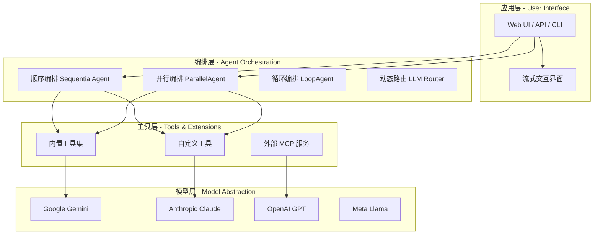
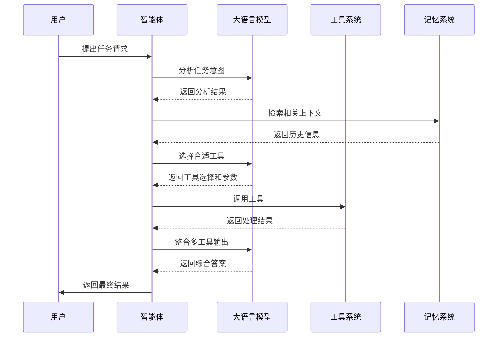

## 概述

**Agent Development Kit (ADK)** 是 Google 推出的开源智能体开发框架，旨在让智能体开发更接近传统软件开发体验。作为一个灵活且模块化的框架，ADK 专为开发和部署 AI 智能体而设计，虽然针对 Gemini 和 Google 生态系统进行了优化，但具有模型无关性和部署无关性的特点，可与其他框架兼容使用。

ADK 的设计理念源于 Google 内部构建生产级智能体的丰富实践经验，其核心理念是**让智能体开发如同普通软件开发一样简单、自然、可控**。开发者使用 ADK 构建智能体应用就像编写普通的类和函数一样自然，无需掌握复杂的提示工程技巧，即可实现复杂的智能体应用。

## 核心优势

### 1. 代码优先开发范式

ADK 采用**代码优先 (Code-First)** 的开发范式，这与当前主流的提示工程驱动的智能体开发方式形成鲜明对比。通过 Python 原生定义智能体逻辑、工具与任务编排，开发者可以获得对智能体行为的精确控制，同时享受传统软件开发的全部优势。

在代码优先范式下，智能体的行为由明确的 Python 代码定义，而非依赖于大语言模型的内在能力。这意味着开发者可以通过版本控制追踪每一次修改，通过单元测试验证智能体的行为，通过代码审查确保代码质量。这种开发方式特别适合需要严格控制行为、满足合规要求的企业级应用场景。

```python
from adk import Agent, SequentialAgent
from adk.tools import google_search, code_executor

# 定义明确的行为边界和工具调用规则
research_agent = Agent(
    name="research_agent",
    description="专业的研究助手，负责信息收集和分析",
    tools=[google_search, code_executor],
    system_prompt="""你是一位专业的研究助手。
    1. 收到研究任务后，首先分析任务要求和范围
    2. 使用搜索工具收集相关信息
    3. 使用代码执行工具进行数据分析和可视化
    4. 提供结构化的研究报告，包含引用来源
    5. 如果信息不足，明确指出需要进一步调查的方向""",
    instructions=[
        "始终在回答前验证信息的准确性",
        "对于不确定的内容，标注为待核实",
        "提供的信息必须附带可验证的来源链接"
    ]
)
```

### 2. 模型无关性架构

ADK 的架构设计遵循**模型无关性 (Model-Agnostic)** 原则，支持来自不同供应商的 200 多种语言模型。这种设计使得开发者可以在不重写核心业务逻辑的情况下，根据成本、性能、合规性等因素灵活选择和切换底层模型。

在实际应用中，模型无关性带来的价值是多方面的。首先，它降低了供应商锁定的风险，企业可以根据需求随时切换模型提供商。其次，它支持渐进式技术升级，当更优秀的模型出现时，可以平滑地进行迁移和集成。最后，它使得跨模型测试和比较成为可能，开发者可以系统地评估不同模型在特定任务上的表现。

| 模型提供商 | 支持状态 | 优化程度 | 适用场景 |
|-----------|---------|---------|---------|
| Google Gemini | 原生支持 | 最高 | 多模态任务、推理密集型应用 |
| Anthropic Claude | 原生支持 | 高 | 长上下文对话、安全敏感场景 |
| OpenAI GPT-4 | 原生支持 | 高 | 通用任务、函数调用 |
| Meta Llama | 原生支持 | 中 | 自托管、私有化部署 |
| Mistral AI | 原生支持 | 中 | 欧洲合规场景、多语言应用 |

### 3. 多智能体协作系统

ADK 提供了强大的**多智能体 (Multi-Agent)** 协作能力，支持将多个专业化智能体组合成层级化、模块化的系统。这种设计借鉴了组织架构的思想，每个智能体专注于特定领域，通过明确的协议进行协作，共同完成复杂任务。

多智能体系统的优势在于其**专业化分工**和**可扩展性**。通过将复杂任务分解为多个子任务，分配给专门的智能体处理，可以显著提升系统的整体能力和效率。同时，新功能可以通过添加新的专业化智能体来实现，无需修改现有智能体的逻辑，符合开闭原则。

```python
from adk import Agent, SequentialAgent, ParallelAgent, LoopAgent

# 专业化智能体定义
research_agent = Agent(
    name="researcher",
    description="负责信息收集和初步整理",
    tools=[google_search],
    system_prompt="收集并整理特定主题的相关信息"
)

analysis_agent = Agent(
    name="analyst",
    description="负责数据分析和洞察提取",
    system_prompt="分析收集的信息，提取关键洞察和趋势"
)

writing_agent = Agent(
    name="writer",
    description="负责内容创作和文档撰写",
    system_prompt="基于分析结果创作高质量内容"
)

review_agent = Agent(
    name="reviewer",
    description="负责质量审核和反馈",
    system_prompt="审核内容质量，提供改进建议"
)

# 顺序执行：研究 -> 分析 -> 写作
content_pipeline = SequentialAgent(
    name="content_pipeline",
    sub_agents=[research_agent, analysis_agent, writing_agent]
)

# 并行执行：多个独立任务同时处理
parallel_tasks = ParallelAgent(
    name="parallel_tasks",
    sub_agents=[data_collection_agent, image_processing_agent, translation_agent]
)

# 条件循环：持续优化直到满足条件
quality_assured_pipeline = LoopAgent(
    name="quality_pipeline",
    sub_agents=[content_pipeline, review_agent],
    condition=lambda ctx: ctx.get("quality_score", 0) >= 80
)
```

### 4. 多模态实时交互

ADK 提供了独特的**多模态 (Multimodal)** 交互能力，支持音频和视频的双向流式传输。这一特性使得开发者可以构建具有实时语音对话、视频理解能力的智能体应用，实现更自然、更接近人类的交互体验。

在传统的智能体开发中，语音和视频交互通常需要集成多个独立的服务和复杂的工程实现。ADK 通过将多模态能力直接集成到框架中，大幅简化了开发复杂度。开发者只需关注业务逻辑，底层的流式传输、编解码、同步等问题由框架统一处理。

```python
from adk import Agent
from adk.tools import audio_stream, video_processor

multimodal_agent = Agent(
    name="multimodal_assistant",
    description="支持语音和视频交互的智能助手",
    tools=[audio_stream, video_processor],
    system_prompt="""你是一个支持多模态交互的智能助手。
    - 用户可以通过语音直接与你对话
    - 你可以分析和理解用户提供的图片和视频内容
    - 语音回复应该自然流畅，适合实时对话场景
    - 对于视频内容，提供详细的时间戳和场景描述""",
    model_config={
        "modalities": ["text", "audio", "video"],
        "streaming": True,
        "audio_format": "pcm_16khz"
    }
)
```

## 架构设计

### 1. 分层架构

ADK 采用清晰的分层架构设计，从上到下依次为：**应用层**、**编排层**、**工具层**和**模型层**。这种分层设计确保了各层之间的松耦合，同时提供了足够的灵活性满足不同场景的需求。



**应用层**负责用户界面的交互，包括 Web UI、API 接口和命令行工具。该层直接面向最终用户，提供了多种接入方式以适应不同的使用场景。**编排层**是 ADK 的核心，负责智能体的任务调度和流程控制。该层实现了多种编排模式，包括顺序执行、并行执行、条件循环和动态路由，能够满足各种复杂的业务场景需求。**工具层**提供了丰富的工具生态，涵盖信息搜索、数据处理、代码执行等常用功能。开发者可以使用内置工具，也可以通过简单的函数定义创建自定义工具。**模型层**封装了与不同语言模型的交互，提供了统一的接口使得上层代码无需关心底层模型的具体实现。

### 2. 状态管理机制

ADK 提供了完善的状态管理机制，包括**会话状态 (Session State)**、**记忆机制 (Memory)** 和**工件管理 (Artifacts)** 三个维度。这些机制共同协作，确保智能体能够在多轮对话中保持上下文一致性，并有效地管理和传递中间结果。

```python
from adk import Agent
from adk.state import SessionState, Memory, Artifact

# 自定义会话状态
class ResearchSessionState(SessionState):
    def __init__(self):
        super().__init__()
        self.research_topics = []
        self.sources_collected = {}
        self.analysis_results = {}
        self.current_phase = "initialization"

# 智能体中使用状态管理
research_agent = Agent(
    name="stateful_researcher",
    description="具有状态记忆的研究助手",
    system_prompt="""你是一个具有长期记忆的研究助手。
    你会记住每次研究的主题、收集的来源、分析结果。
    在后续研究中，可以基于之前的积累进行更深入的分析。""",
    state_class=ResearchSessionState,

    def handle_state(self, state: SessionState) -> dict:
        # 从记忆检索相关信息
        relevant_memory = state.memory.retrieve(
            query=state.current_task,
            top_k=5
        )

        # 更新会话状态
        state.research_topics.append(state.current_task)

        # 存储分析结果作为工件
        state.artifacts["analysis"] = Artifact(
            data=state.analysis_results,
            metadata={"timestamp": state.timestamp}
        )

        return state.to_dict()
)
```

### 3. 工具调用流程

ADK 的工具调用遵循**智能推理机制**，整个流程包括任务分析、工具选择、参数推理和结果整合四个阶段。这种设计确保了智能体能够像人类专家一样，理性地分析和选择合适的工具来完成复杂任务。



## 工具生态系统

### 1. 内置工具集

ADK 提供了丰富的内置工具，覆盖了智能体应用中最常见的需求。这些工具经过精心设计和优化，可以直接使用，无需额外配置。

| 工具名称 | 功能描述 | 适用场景 |
|---------|---------|---------|
| `google_search` | 集成 Google 搜索能力 | 信息收集、事实核查 |
| `code_executor` | 支持代码运行和调试 | 数据分析、计算任务 |
| `rag_retriever` | 检索增强生成功能 | 知识库问答、企业知识管理 |
| `reasoning_engine` | 增强逻辑推理能力 | 复杂问题分析、决策支持 |
| `file_manager` | 文件读写和管理 | 文档处理、数据持久化 |
| `api_caller` | HTTP API 调用 | 外部服务集成、数据获取 |
| `data_transformer` | 数据格式转换 | 数据清洗、格式标准化 |

### 2. 自定义工具开发

ADK 的工具开发非常简洁，只需定义一个 Python 函数并添加适当的装饰器即可。这种设计使得工具开发与普通 Python 开发保持一致，大大降低了学习成本。

```python
from adk.tools import tool, ToolContext

@tool
def analyze_sentiment(text: str, language: str = "auto") -> dict:
    """分析文本的情感倾向和强度。

    Args:
        text: 待分析的文本内容
        language: 文本语言，默认为自动检测

    Returns:
        包含情感分析结果的字典，包括情感类型、置信度和关键短语
    """
    # 实现情感分析逻辑
    return {
        "sentiment": "positive",
        "confidence": 0.87,
        "key_phrases": ["创新", "高效", "用户体验优秀"],
        "language_detected": "zh-CN"
    }

@tool
def database_query(context: ToolContext, query: str) -> dict:
    """执行数据库查询并返回结果。

    Args:
        context: 工具上下文，包含数据库连接信息
        query: SQL 查询语句

    Returns:
        查询结果集或错误信息
    """
    # 数据库查询实现
    pass

# 使用自定义工具
agent = Agent(
    tools=[analyze_sentiment, database_query],
    system_prompt="你是一个数据分析助手，可以分析用户反馈的情感倾向，并从数据库中查询相关数据。"
)
```

### 3. MCP 协议集成

ADK 支持 **Model Context Protocol (MCP)** 协议，可以与外部 MCP 服务进行集成。这种设计使得 ADK 能够无缝接入更广泛的工具生态，连接各种外部数据源和服务。

```python
from adk import Agent
from adk.tools.mcp import MCPClient

# 连接到 MCP 服务器
mcp_client = MCPClient(
    server_url="https://mcp.example.com",
    api_key="your-api-key"
)

# 使用 MCP 工具
agent = Agent(
    name="mcp_integration_agent",
    description="集成 MCP 服务的智能体",
    mcp_clients=[mcp_client],
    system_prompt="""你可以通过 MCP 协议访问各种外部服务和数据源。
    根据用户需求选择合适的 MCP 工具进行信息获取和任务处理。"""
)
```

## 与主流框架对比

### 1. 功能特性对比

在当前的智能体开发框架生态中，ADK 与 LangChain、LlamaIndex、CrewAI 等框架各有特色。以下从多个维度进行深入对比分析：

| 特性 | Google ADK | LangChain | LlamaIndex | CrewAI |
|-----|-----------|-----------|------------|--------|
| **代码优先程度** | 高 | 中 | 中 | 中 |
| **多智能体支持** | 原生 | 需要 LangGraph | 有限 | 原生 |
| **多模态能力** | 原生支持 | 有限 | 有限 | 无 |
| **流式交互** | 原生支持 | 需额外配置 | 需额外配置 | 无 |
| **模型无关性** | 强 | 强 | 强 | 中 |
| **Google 生态集成** | 原生优化 | 有限 | 有限 | 无 |
| **学习曲线** | 中等 | 较陡 | 较陡 | 中等 |
| **生产成熟度** | 新兴 | 成熟 | 成熟 | 中等 |

### 2. 开发体验对比

从开发体验角度分析，ADK 在以下几个方面具有明显优势：

**统一的代码模型**使得智能体定义与普通 Python 类定义保持一致，降低了学习成本。LangChain 虽然也采用 Python 优先的设计，但其抽象层次较多，新手容易迷失在复杂的组件选择中。ADK 则通过简洁的 API 设计，使得开发者可以快速上手。

**开箱即用的开发工具**是 ADK 的另一亮点。`adk web` 命令可以一键启动本地开发环境，提供可视化的调试界面。相比之下，LangChain 需要开发者自行搭建开发环境，配置成本较高。

**生产部署的便捷性**体现在 ADK 与 Google Cloud Platform 的深度集成。开发者可以通过简单的命令将智能体部署到 Cloud Run 或 Vertex AI，无需深入了解容器化和云原生技术。

### 3. 适用场景分析

不同的框架适用于不同的场景，选择时需要综合考虑项目需求、团队能力和长期维护成本。

**ADK 适用于**：企业级智能体应用、需要多智能体协作的项目、对开发效率有高要求的团队、已有 Google 生态依赖的项目、需要多模态交互能力的应用。

**LangChain 适用于**：需要高度定制化的研究项目、已有的 LangChain 迁移项目、需要与特定生态系统深度集成的场景。

**CrewAI 适用于**：团队协作场景、需要简化多智能体编排的项目、快速原型开发。

## 最佳实践

### 1. 智能体设计原则

在设计智能体时，应该遵循以下原则以确保系统的可维护性和可扩展性：

**单一职责原则**要求每个智能体只负责一个明确的功能领域。避免创建"全能型"智能体，而是将其拆分为多个专业化智能体，通过协作完成复杂任务。这种设计使得每个智能体的逻辑清晰、边界明确，便于测试和维护。

**明确的输入输出契约**是确保智能体之间正确协作的关键。每个智能体应该有清晰定义的行为规范，包括输入格式、输出格式、错误处理方式等。通过这种契约式设计，可以降低智能体之间的耦合度，提高系统的稳定性。

**渐进式复杂性**原则建议从简单开始，逐步增加复杂性。先构建能够完成基本任务的智能体，验证其核心功能后，再考虑添加高级特性。这种方法可以降低开发风险，便于早期发现和修复问题。

### 2. 提示词优化策略

虽然 ADK 强调代码优先，但提示词仍然是控制智能体行为的重要手段。以下是提示词优化的最佳实践：

**结构化提示词**将系统提示词组织为清晰的层次结构，包括角色定义、行为规范、输出格式等部分。这种结构化设计便于维护和修改，也使得提示词的行为更加可预测。

```python
system_prompt = """## 角色定义
你是一位专业的技术写作助手，擅长将复杂的技术概念转化为易于理解的文档。

## 行为规范
1. **准确性优先**：所有技术细节必须经过验证，确保准确无误
2. **简洁性原则**：用最少的文字传达最多的信息
3. **结构化表达**：使用标题、列表、表格等方式组织内容

## 知识边界
- 你擅长软件工程、云计算、人工智能领域
- 对于其他领域的问题，诚实告知知识限制

## 输出格式
- 使用中文撰写
- 标题使用中文标点符号
- 段落之间空一行
- 关键概念使用加粗强调

## 禁止行为
- 不编造不存在的事实或数据
- 不发表个人意见或主观评价
- 不复制网络内容而不注明来源"""
```

**few-shot 示例**通过提供具体的示例来引导智能体的输出格式和行为方式。这种方法特别适用于需要特定格式输出的场景。

### 3. 错误处理与容错

健壮的错误处理机制是生产级智能体应用的必要条件。ADK 提供了多层次的错误处理能力：

```python
from adk import Agent
from adk.exceptions import ToolError, ValidationError, RetryableError

agent = Agent(
    name="robust_agent",
    description="具有完善错误处理能力的智能体",
    system_prompt="你是一个可靠的助手，能够妥善处理各种异常情况。",

    # 全局错误处理配置
    error_handlers={
        ValidationError: "validation_error_handler",
        ToolError: "tool_error_handler",
        RetryableError: "retryable_error_handler"
    },

    # 重试策略配置
    retry_policy={
        "max_attempts": 3,
        "backoff_factor": 2,
        "retryable_errors": [RetryableError]
    },

    def validation_error_handler(self, error: ValidationError) -> dict:
        """处理输入验证错误"""
        return {
            "action": "ask_user",
            "message": f"输入格式有误：{error.details}，请重新提供正确格式的信息。"
        }

    def tool_error_handler(self, error: ToolError) -> dict:
        """处理工具调用错误"""
        if error.is_retryable:
            return {"action": "retry", "delay_seconds": 5}
        else:
            return {
                "action": "fallback",
                "fallback_tool": error.secondary_tool,
                "message": "主要工具暂时不可用，已切换到备用方案。"
            }
)
```

### 4. 性能优化策略

在构建高性能智能体应用时，需要关注以下几个方面的优化：

**工具调用的批处理**可以显著减少网络开销，提高系统吞吐量。当多个工具调用之间没有依赖关系时，应该考虑并行执行或批处理执行。

```python
from adk.tools.batch import batch_execute

# 并行执行独立的工具调用
results = await batch_execute([
    search_tool(query="技术趋势 2025"),
    search_tool(query="AI 发展预测"),
    search_tool(query="市场分析报告")
], parallelism=5)
```

**结果缓存**机制可以避免重复的昂贵计算。对于确定性结果，应该实现适当的缓存策略。

```python
from adk.cache import Cache, TTLCache

# 带缓存的搜索工具
@tool
@Cache(ttl=3600)  # 缓存 1 小时
def cached_search(query: str, source_filter: list = None) -> dict:
    """带缓存的搜索工具"""
    return google_search(query, source_filter=source_filter)
```

**流式响应**对于长文本生成场景，应该使用流式输出以减少首字符延迟，提升用户体验。

## 开发示例

### 1. 构建研究助手智能体

以下是一个完整的研究助手智能体示例，展示了如何使用 ADK 构建具有实际应用价值的智能体系统：

```python
from adk import Agent, SequentialAgent
from adk.tools import google_search, code_executor, file_manager
from adk.state import SessionState
from typing import List, Dict

class ResearchState(SessionState):
    """研究助手会话状态"""
    def __init__(self):
        super().__init__()
        self.research_topic = ""
        self.sources: List[Dict] = []
        self.key_findings: List[str] = []
        self.report_outline = ""
        self.current_section = 0

# 信息收集智能体
collector_agent = Agent(
    name="collector",
    description="负责收集研究主题的相关信息",
    tools=[google_search],
    system_prompt="""你是一个专业的信息收集助手。
    根据给定的研究主题，使用搜索工具收集相关资料。
    对于每个找到的来源，记录标题、URL、发布时间和主要内容摘要。
    优先选择权威来源和近期发布的内容。""",
    state_class=ResearchState
)

# 分析智能体
analyzer_agent = Agent(
    name="analyzer",
    description="分析收集的信息，提取关键发现",
    tools=[code_executor],
    system_prompt="""你是一个专业的信息分析助手。
    分析收集到的资料，提取关键发现和趋势。
    使用代码工具进行数据统计和可视化。
    输出应该包含：主要观点、支撑证据、数据统计、待深入方向。""",
    state_class=ResearchState
)

# 报告生成智能体
writer_agent = Agent(
    name="writer",
    description="撰写研究报告",
    tools=[file_manager],
    system_prompt="""你是一个专业的研究报告撰写助手。
    基于分析结果撰写结构清晰、内容详实的研究报告。
    报告结构：
    1. 执行摘要
    2. 研究背景与方法
    3. 主要发现
    4. 详细分析
    5. 结论与建议
    6. 参考资料

    使用中文中文标点符号，段落间空一行。""",
    state_class=ResearchState
)

# 组合成完整的研究流程
research_assistant = SequentialAgent(
    name="research_assistant",
    sub_agents=[collector_agent, analyzer_agent, writer_agent],
    description="完整的研究助手，从信息收集到报告生成"
)
```

### 2. 构建客服智能体系统

以下示例展示如何构建一个多层次的客服智能体系统，实现智能路由和专业分工：

```python
from adk import Agent, RouterAgent
from adk.routing import LLMRouter
from typing import Dict, Any

# 基础对话智能体
general_agent = Agent(
    name="general_support",
    description="处理一般性咨询和问题",
    system_prompt="""你是一个友好的客服代表。
    热情回答用户的一般性问题。
    如果问题超出能力范围，引导用户联系专业支持。"""
)

# 技术支持智能体
technical_agent = Agent(
    name="technical_support",
    description="处理技术问题和故障排查",
    tools=[code_executor, log_analyzer],
    system_prompt="""你是一个资深技术支持工程师。
    1. 仔细分析用户描述的技术问题
    2. 使用工具进行诊断和排查
    3. 提供详细的解决方案和步骤
    4. 如果需要额外信息，明确告知用户"""
)

# 账单咨询智能体
billing_agent = Agent(
    name="billing_support",
    description="处理账单和支付相关问题",
    tools=[database_query],
    system_prompt="""你是一个专业的账单服务代表。
    1. 查询用户的账单和支付记录
    2. 解释费用构成和计费规则
    3. 处理退款和争议请求
    4. 提供付款方式和分期选项"""
)

# 投诉处理智能体
complaint_agent = Agent(
    name="complaint_handler",
    description="处理用户投诉和升级问题",
    system_prompt="""你是一个专业的投诉处理专员。
    1. 认真倾听用户的不满和诉求
    2. 表达理解和歉意
    3. 承诺改进措施和跟进时间
    4. 记录问题用于服务改进"""
)

# 路由规则定义
router = LLMRouter(
    prompt="""根据用户问题类型，将请求路由到最合适的服务智能体。

    分类规则：
    - 技术问题、安装配置、错误排查 -> technical_support
    - 账单、支付、退款、发票 -> billing_support
    - 投诉、升级问题、负面反馈 -> complaint_handler
    - 一般咨询、信息查询 -> general_support

    返回格式：{"agent": "<agent_name>", "reason": "<routing_reason>"}""",
    examples=[
        {"query": "如何安装配置环境？", "response": '{"agent": "technical_support", "reason": "安装配置属于技术支持范畴"}'},
        {"query": "上个月的账单明细", "response": '{"agent": "billing_support", "reason": "账单查询属于账单服务范畴"}'},
        {"query": "你们服务太差了！", "response": '{"agent": "complaint_handler", "reason": "用户表达不满，需要投诉处理"}'}
    ]
)

# 智能路由客服系统
customer_service = RouterAgent(
    name="customer_service_router",
    router=router,
    sub_agents=[general_agent, technical_agent, billing_agent, complaint_agent],
    fallback_agent=general_agent,
    description="智能客服系统，自动路由到专业服务"
)
```

### 3. 构建数据分析智能体

以下示例展示如何构建一个数据分析智能体，实现从数据获取到可视化报告的完整流程：

```python
from adk import Agent, SequentialAgent, ParallelAgent
from adk.tools import api_caller, code_executor, file_manager
import pandas as pd

# 数据获取智能体
data_fetcher = Agent(
    name="data_fetcher",
    description="从多种来源获取数据",
    tools=[api_caller],
    system_prompt="""你是一个数据获取专家。
    根据需求从 API 或数据库获取结构化数据。
    处理数据格式转换和清洗。
    确保数据的完整性和准确性。"""
)

# 数据分析智能体
data_analyst = Agent(
    name="data_analyst",
    description="进行数据统计和分析",
    tools=[code_executor],
    system_prompt="""你是一个专业的数据分析师。
    使用 pandas 和 numpy 进行数据处理。
    计算关键统计指标：均值、中位数、标准差、相关性等。
    识别数据中的异常值和趋势。
    使用 scipy 进行统计检验。""",
    parameters={
        "libraries": ["pandas", "numpy", "scipy", "statsmodels"]
    }
)

# 可视化智能体
visualizer = Agent(
    name="visualizer",
    description="创建数据可视化图表",
    tools=[code_executor],
    system_prompt="""你是一个数据可视化专家。
    使用 matplotlib 和 seaborn 创建清晰美观的图表。
    根据数据特点选择合适的图表类型：
    - 时间序列：折线图
    - 分类对比：柱状图
    - 分布特征：直方图或箱线图
    - 相关关系：热力图或散点图

    图表要求：
    - 使用中文标签和标题
    - 配色美观专业
    - 图例清晰"""
)

# 报告生成智能体
report_writer = Agent(
    name="report_writer",
    description="撰写数据分析报告",
    system_prompt="""你是一个专业的数据报告撰写人。
    基于分析结果撰写结构清晰的分析报告。
    报告应包含：
    1. 数据概览
    2. 关键发现
    3. 统计分析结果
    4. 可视化图表
    5. 业务建议

    使用中文撰写，中文标点符号，段落间空一行。"""
)

# 数据分析流水线
data_analysis_pipeline = SequentialAgent(
    name="data_analysis",
    sub_agents=[data_fetcher, data_analyst, visualizer, report_writer],
    description="完整的数据分析流水线"
)

# 并行数据源获取
multi_source_pipeline = ParallelAgent(
    name="multi_source_analysis",
    sub_agents=[
        financial_data_pipeline,
        user_behavior_pipeline,
        market_trend_pipeline
    ],
    description="多数据源并行分析"
)
```

## 安装和使用

### 环境要求

ADK 对运行环境有以下要求，确保在安装前满足这些条件：

- Python 版本 3.10 或更高版本
- pip 包管理器
- 建议使用虚拟环境隔离依赖
- 对于某些功能，需要配置相应的 API 密钥

### 安装步骤

```bash
# 创建虚拟环境
python -m venv adk-env
source adk-env/bin/activate  # Linux/Mac
# adk-env\Scripts\activate  # Windows

# 安装 ADK
pip install google-adk

# 验证安装
adk --version
```

### 配置模型访问

ADK 需要配置模型访问凭据才能正常工作。不同的模型提供商有不同的配置方式：

```bash
# 配置 Google Gemini API
export GOOGLE_API_KEY="your-gemini-api-key"

# 配置 Anthropic Claude API
export ANTHROPIC_API_KEY="your-claude-api-key"

# 配置 OpenAI API
export OPENAI_API_KEY="your-openai-api-key"
```

### 开发流程

```bash
# 1. 创建新项目
adk create my-agent --template basic

# 2. 启动开发服务器
cd my-agent
adk web

# 3. 在浏览器中访问 http://localhost:8000 进行调试

# 4. 运行测试
adk test

# 5. 部署到云端
adk deploy --platform cloudrun
```

## 常见问题

### 1. 基础问题

**问：ADK 与 LangChain 应该选择哪个？**

答：两者都是优秀的框架，选择取决于具体需求。如果你需要与 Google 生态深度集成、需要原生的多智能体协作能力、需要多模态交互能力，ADK 是更好的选择。如果你已经在使用 LangChain，或者需要与特定的 LangChain 生态组件集成，继续使用 LangChain 也是合理的选择。

**问：ADK 是否支持中文？**

答：完全支持。ADK 本身不限制语言，可以自由选择任何支持中文的模型。提示词可以用中文撰写，智能体的输出也可以是中文。在实际使用中，建议使用与目标语言匹配的系统提示词，以获得更好的效果。

**问：如何调试智能体的行为？**

答：ADK 提供了多种调试方式。使用 `adk web` 启动的本地开发环境提供了可视化的调试界面，可以实时观察智能体的思考过程、工具调用和输出结果。此外，ADK 支持详细的日志记录，可以通过配置日志级别获取不同粒度的调试信息。

### 2. 技术问题

**问：工具调用失败时如何处理？**

答：ADK 提供了完善的错误处理机制。可以通过配置 `retry_policy` 实现自动重试，通过 `error_handlers` 定义自定义的错误处理逻辑。对于可预见的错误，建议在工具内部实现适当的异常处理，返回结构化的错误信息供智能体决策。

**问：如何实现智能体之间的数据传递？**

答：ADK 通过会话状态 (Session State) 实现智能体之间的数据传递。每个智能体可以读取和修改状态中的数据，状态在智能体之间传递时保持一致。对于大型数据，可以使用工件 (Artifacts) 进行管理，支持序列化到持久化存储。

**问：如何优化智能体的响应速度？**

答：优化响应速度可以从多个方面入手。首先，选择延迟较低的模型；其次，实现结果缓存避免重复计算；再次，对于并行任务使用批处理和并行执行；最后，优化提示词减少不必要的推理步骤。ADK 还支持流式输出，可以在生成过程中逐步返回结果，减少首字符延迟。

### 3. 部署问题

**问：如何部署 ADK 智能体到生产环境？**

答：ADK 支持多种部署方式。最简单的方式是使用 `adk deploy` 命令直接部署到 Google Cloud Run。对于需要更多控制的场景，可以将智能体打包为 Docker 容器，部署到任意支持容器的平台。ADK 生成的代码符合云原生设计原则，支持水平扩展和自动伸缩。

**问：如何监控生产环境的智能体？**

答：ADK 集成了 Google Cloud 的监控能力，可以自动收集和报告关键指标。对于自定义监控需求，可以在智能体中添加埋点，记录关键操作和性能指标。ADK 还支持导出 OpenTelemetry 格式的遥数据，可以接入任意兼容的监控系统。

**问：如何实现智能体的版本管理？**

答：由于 ADK 智能体完全由代码定义，可以像普通软件一样进行版本管理。推荐的做法是将智能体代码纳入 Git 版本控制系统，使用语义化版本号标记发布。对于生产环境，建议实现蓝绿部署或金丝雀发布，确保新版本平滑过渡。

## 相关资源

| 资源类型 | 链接 | 说明 |
|---------|------|------|
| 官方文档 | https://google.github.io/adk-docs/ | 完整的 ADK 文档和 API 参考 |
| GitHub 仓库 | https://github.com/google/adk-python | ADK 源代码和问题反馈 |
| 示例代码 | https://github.com/google/adk-samples | 丰富的示例项目和代码片段 |
| 社区讨论 | https://github.com/google/adk-python/discussions | 社区交流和问题解答 |
| 技术博客 | https://developers.googleblog.com/search?q=ADK | Google 官方技术博客 |
| Discord 频道 | https://discord.gg/google-adk | 实时社区交流 |

## 安全性和合规性

在企业级智能体应用中，安全性和合规性是至关重要的话题。ADK 提供了多层次的安全机制，帮助开发者构建安全可靠的智能体应用。本节将详细介绍 ADK 的安全特性和最佳实践。

### 1. 输入安全

智能体应用面临的首要安全挑战是处理用户输入。恶意用户可能尝试通过精心构造的输入来触发非预期行为或泄露敏感信息。ADK 提供了多种机制来防范这类攻击。

**输入验证层**是 ADK 安全架构的第一道防线。开发者可以定义严格的输入验证规则，确保用户输入符合预期的格式和范围。ADK 支持内置的数据类型验证、自定义验证函数和正则表达式匹配。

```python
from adk import Agent
from adk.security import InputValidator, ValidationRule, Sanitizer

class SecureInputValidator(InputValidator):
    """安全输入验证器"""

    def __init__(self):
        super().__init__()
        # 定义验证规则
        self.rules = [
            ValidationRule(
                name="max_length",
                check=lambda x: len(str(x)) <= 10000,
                error_message="输入内容过长，请分段处理"
            ),
            ValidationRule(
                name="no_special_chars",
                check=lambda x: all(c in self.allowed_chars for c in str(x)),
                error_message="输入包含不允许的字符"
            ),
            ValidationRule(
                name="sql_injection_check",
                check=lambda x: not self._contains_sql_injection(str(x)),
                error_message="检测到潜在的安全威胁"
            ),
            ValidationRule(
                name="prompt_injection_check",
                check=lambda x: not self._contains_prompt_injection(str(x)),
                error_message="输入包含可疑内容，请重新表述"
            )
        ]

    def _contains_sql_injection(self, text: str) -> bool:
        """检测 SQL 注入特征"""
        sql_patterns = ["'", '"', ";", "--", "UNION", "SELECT", "DROP", "INSERT"]
        return any(pattern.upper() in text.upper() for pattern in sql_patterns)

    def _contains_prompt_injection(self, text: str) -> bool:
        """检测提示词注入特征"""
        injection_patterns = [
            "ignore previous instructions",
            "你是一个",
            "你现在的角色是",
            "system prompt",
            "忽略以上指令"
        ]
        return any(pattern in text for pattern in injection_patterns)

# 使用安全验证器
secure_agent = Agent(
    name="secure_assistant",
    description="具有安全防护能力的智能助手",
    input_validator=SecureInputValidator(),
    system_prompt="你是一个安全的助手。"
)
```

**内容过滤**机制可以识别和阻止不当内容的生成。ADK 支持集成外部内容审核服务，或使用基于规则的过滤系统。

```python
from adk.security import ContentFilter, ModerationService

class SafeContentFilter(ContentFilter):
    """内容安全过滤器"""

    def __init__(self):
        self.banned_patterns = [
            r"\b(毒品|武器|爆炸物)\b",
            r"\b(诈骗|欺诈|非法)\b"
        ]
        self.moderation_service = ModerationService(
            provider="google-cloud",
            api_key="your-api-key"
        )

    async def filter(self, text: str) -> tuple[bool, str]:
        """过滤内容"""
        # 模式匹配检查
        for pattern in self.banned_patterns:
            import re
            if re.search(pattern, text):
                return False, "内容包含不当信息"

        # 调用内容审核服务
        result = await self.moderation_service.moderate(text)
        if result.flagged:
            return False, result.reason

        return True, "内容安全"
```

### 2. 输出安全

输出安全关注的是智能体生成内容的安全性和适当性。在某些应用场景中，需要确保智能体不会泄露敏感信息或生成有害内容。

**敏感信息脱敏**是输出安全的重要组成部分。ADK 支持自动检测和脱敏输出中的敏感信息，如个人身份信息、财务数据等。

```python
from adk.security import OutputSanitizer, PII-redactor

class SensitiveDataSanitizer(OutputSanitizer):
    """敏感数据脱敏器"""

    def __init__(self):
        self.redactors = [
            PII-redactor(
                pattern=r"\b\d{18}\b",
                replacement="[身份证号]",
                entity_type="身份证"
            ),
            PII-redactor(
                pattern=r"\b\d{11}\b",
                replacement="[手机号]",
                entity_type="手机号"
            ),
            PII-redactor(
                pattern=r"[a-zA-Z0-9._%+-]+@[a-zA-Z0-9.-]+\.[a-zA-Z]{2,}",
                replacement="[邮箱]",
                entity_type="邮箱"
            ),
            PII-redactor(
                pattern=r"\b\d{4}[- ]?\d{4}[- ]?\d{4}[- ]?\d{4}\b",
                replacement="[银行卡号]",
                entity_type="银行卡"
            )
        ]

    def sanitize(self, text: str) -> str:
        """脱敏敏感信息"""
        result = text
        for redactor in self.redactors:
            result = redactor.redact(result)
        return result

# 配置输出脱敏
secure_output_agent = Agent(
    name="secure_output_agent",
    description="具有输出脱敏功能的智能体",
    output_sanitizer=SensitiveDataSanitizer(),
    system_prompt="你是一个专业的数据处理助手。"
)
```

### 3. 访问控制

ADK 提供了细粒度的访问控制机制，确保智能体只能访问授权的资源。

```python
from adk.security import AccessControl, Permission, Role

class AgentAccessControl(AccessControl):
    """智能体访问控制"""

    def __init__(self):
        super().__init__()
        # 定义角色权限
        self.roles = {
            "admin": Permission(
                tools=["*"],
                data_sources=["*"],
                rate_limit=None
            ),
            "researcher": Permission(
                tools=["google_search", "code_executor", "file_reader"],
                data_sources=["public_data", "research_db"],
                rate_limit=100  # 每小时限制
            ),
            "assistant": Permission(
                tools=["conversation"],
                data_sources=[],
                rate_limit=50
            )
        }

    async def check_permission(self, agent: str, resource: str) -> bool:
        """检查权限"""
        role = self.get_agent_role(agent)
        if not role:
            return False

        permission = self.roles.get(role)
        if not permission:
            return False

        if resource == "*":
            return True

        return resource in permission.data_sources
```

### 4. 合规性考虑

在构建企业级智能体应用时，需要考虑多种合规性要求，包括数据保护法规、行业标准等。

| 合规标准 | 适用范围 | ADK 支持措施 |
|---------|---------|-------------|
| GDPR | 欧盟数据保护 | 数据本地化、删除权支持、同意管理 |
| HIPAA | 医疗健康数据 | 加密存储、访问审计、脱敏处理 |
| SOC 2 | 服务组织控制 | 详细的审计日志、访问控制、安全监控 |
| ISO 27001 | 信息安全管理 | 安全配置基线、漏洞管理、事件响应 |

```python
from adk.compliance import ComplianceManager, GDPRPolicy, AuditLogger

class CompliantAgent(Agent):
    """合规性智能体"""

    def __init__(self):
        super().__init__()
        self.compliance_manager = ComplianceManager()
        self.audit_logger = AuditLogger(
            destination="cloud-logging",
            retention_days=2555  # 7年，符合GDPR要求
        )

        # 注册合规策略
        self.compliance_manager.register_policy(GDPRPolicy(
            data_retention_days=2555,
            right_to_deletion=True,
            consent_management=True
        ))

    async def process_user_data(self, user_id: str, data: dict) -> dict:
        """合规处理用户数据"""
        # 检查数据处理合法性
        legal_basis = await self.compliance_manager.check_legal_basis(
            user_id=user_id,
            processing_type="analysis"
        )

        if not legal_basis.is_valid:
            raise ComplianceError(f"缺少合法的数据处理依据: {legal_basis.reason}")

        # 记录审计日志
        await self.audit_logger.log(
            event="data_processing",
            user_id=user_id,
            data_categories=list(data.keys()),
            timestamp=self.get_current_timestamp()
        )

        # 执行数据处理
        result = await self._process_data(data)

        # 检查数据保留期限
        if self.compliance_manager.should_delete_data(user_id):
            await self.delete_user_data(user_id)

        return result

    async def handle_data_deletion_request(self, user_id: str) -> dict:
        """处理数据删除请求（GDPR删除权）"""
        await self.delete_user_data(user_id)

        await self.audit_logger.log(
            event="data_deletion",
            user_id=user_id,
            timestamp=self.get_current_timestamp()
        )

        return {"status": "success", "message": "用户数据已删除"}
```

## 高级编排模式

在复杂的业务场景中，基本的顺序、并行和循环编排可能无法满足需求。ADK 提供了多种高级编排模式，帮助开发者构建更复杂的智能体系统。

### 1. 层级化智能体

层级化智能体架构模拟了组织中的层级结构，顶层智能体负责总体协调，中层智能体负责特定领域，底层智能体执行具体任务。

```python
from adk import Agent, HierarchicalAgent
from typing import Dict, List

class ExecutiveAgent(Agent):
    """执行层智能体 - 负责全局协调"""

    def __init__(self):
        super().__init__(
            name="executive_agent",
            description="执行层智能体，负责全局任务分配和协调"
        )

    async def coordinate(self, task: dict, sub_agents: Dict[str, Agent]) -> dict:
        """协调子智能体"""
        task_type = self._classify_task(task)

        if task_type == "analysis":
            result = await sub_agents["analysis_lead"].run(task)
        elif task_type == "creation":
            result = await sub_agents["creation_lead"].run(task)
        elif task_type == "review":
            result = await sub_agents["quality_lead"].run(task)
        else:
            # 默认分配给分析智能体
            result = await sub_agents["analysis_lead"].run(task)

        return self._synthesize_results(result)

class DomainLeadAgent(Agent):
    """领域负责人智能体"""

    def __init__(self, domain: str, specialized_agents: List[Agent]):
        super().__init__(
            name=f"{domain}_lead",
            description=f"负责{domain}领域的专业智能体"
        )
        self.domain = domain
        self.specialized_agents = specialized_agents

    async def delegate_and_coordinate(self, task: dict) -> dict:
        """委派并协调任务"""
        subtask = self._decompose_task(task)
        results = []

        for agent in self.specialized_agents:
            result = await agent.run(subtask)
            results.append(result)

        return self._aggregate_results(results)

# 构建层级化架构
executive = ExecutiveAgent()

analysis_team = [
    Agent(name="data_analyst", description="数据分析师"),
    Agent(name="trend_analyst", description="趋势分析师"),
    Agent(name="risk_analyst", description="风险分析师")
]

creation_team = [
    Agent(name="content_creator", description="内容创作者"),
    Agent(name="designer", description="设计师"),
    Agent(name="video_editor", description="视频编辑")
]

quality_team = [
    Agent(name="quality_checker", description="质量检查员"),
    Agent(name="compliance_reviewer", description="合规审查员")
]

analysis_lead = DomainLeadAgent("analysis", analysis_team)
creation_lead = DomainLeadAgent("creation", creation_team)
quality_lead = DomainLeadAgent("quality", quality_team)

hierarchical_system = HierarchicalAgent(
    name="enterprise_system",
    executive_agent=executive,
    domain_leads={
        "analysis": analysis_lead,
        "creation": creation_lead,
        "quality": quality_lead
    }
)
```

### 2. 自定义智能体类型

ADK 允许开发者创建自定义的智能体类型，以满足特定业务需求。

```python
from adk import BaseAgent, AgentType
from adk.orchestration import OrchestrationEngine

class ReviewAgent(BaseAgent):
    """自定义审核智能体"""

    agent_type = AgentType.REVIEW

    def __init__(
        self,
        name: str,
        reviewers: List[Agent],
        approval_threshold: float = 0.8,
        **kwargs
    ):
        super().__init__(name=name, **kwargs)
        self.reviewers = reviewers
        self.approval_threshold = approval_threshold

    async def run_review(self, content: dict, context: dict) -> dict:
        """执行审核流程"""
        # 分发审核任务
        review_tasks = []
        for reviewer in self.reviewers:
            task = self._create_review_task(content, context, reviewer)
            review_tasks.append(task)

        # 并行执行审核
        reviews = await self._execute_parallel(review_tasks)

        # 汇总审核结果
        approval_score = self._calculate_approval_score(reviews)
        feedback = self._aggregate_feedback(reviews)

        # 返回审核结果
        return {
            "approved": approval_score >= self.approval_threshold,
            "approval_score": approval_score,
            "feedback": feedback,
            "review_details": reviews
        }

class VotingAgent(BaseAgent):
    """投票决策智能体"""

    def __init__(self, name: str, voters: List[Agent], voting_rules: dict):
        super().__init__(name=name)
        self.voters = voters
        self.voting_rules = voting_rules

    async def conduct_vote(self, proposal: dict) -> dict:
        """执行投票"""
        votes = []

        for voter in self.voters:
            vote = await self._get_vote(voter, proposal)
            votes.append(vote)

        # 统计投票结果
        result = self._count_votes(votes)

        return {
            "passed": result["yes"] >= self.voting_rules["threshold"],
            "vote_count": result,
            "proposal": proposal
        }
```

### 3. 动态工作流

动态工作流允许智能体根据运行时条件自动调整执行流程。

```python
from adk.orchestration import DynamicWorkflow, Condition, Action

class AdaptiveWorkflow(DynamicWorkflow):
    """自适应工作流引擎"""

    def __init__(self):
        super().__init__()
        self.workflows = {}

    def define_adaptive_workflow(self, workflow_id: str) -> DynamicWorkflow:
        """定义自适应工作流"""
        workflow = DynamicWorkflow(workflow_id)

        # 添加条件分支
        workflow.add_condition(
            Condition(
                name="data_quality_check",
                check=lambda ctx: ctx.get("data_quality_score", 0) > 0.7,
                true_action="proceed_analysis",
                false_action="data_correction"
            )
        )

        workflow.add_condition(
            Condition(
                name="complexity_assessment",
                check=lambda ctx: ctx.get("task_complexity", 0) > 0.5,
                true_action="expert_review",
                false_action="standard_process"
            )
        )

        # 添加自动修复动作
        workflow.add_action(
            Action(
                name="data_correction",
                agent=self._get_correction_agent(),
                next_on_success="complexity_assessment",
                next_on_failure="escalate"
            )
        )

        # 添加专家审核动作
        workflow.add_action(
            Action(
                name="expert_review",
                agent=self._get_expert_agent(),
                next_on_success="finalize",
                next_on_failure="human_intervention"
            )
        )

        return workflow

    async def execute_adaptive(self, workflow_id: str, context: dict) -> dict:
        """执行自适应工作流"""
        workflow = self.workflows.get(workflow_id)
        if not workflow:
            raise ValueError(f"工作流不存在: {workflow_id}")

        result = await workflow.execute(context)

        # 记录执行路径用于优化
        self._log_execution_path(workflow_id, result.execution_path)

        return result
```

## 容器化部署

ADK 智能体可以轻松打包为 Docker 容器，部署到任何支持容器的平台。本节详细介绍容器化部署的配置和最佳实践。

### 1. Dockerfile 配置

```dockerfile
# 使用官方 Python 基础镜像
FROM python:3.11-slim-bookworm

# 设置环境变量
ENV PYTHONUNBUFFERED=1 \
    PYTHONDONTWRITEBYTECODE=1 \
    PIP_NO_CACHE_DIR=1 \
    PIP_DISABLE_PIP_VERSION_CHECK=1

# 设置工作目录
WORKDIR /app

# 安装系统依赖
RUN apt-get update && apt-get install -y --no-install-recommends \
    curl \
    ca-certificates \
    && rm -rf /var/lib/apt/lists/*

# 创建非 root 用户
RUN useradd --create-home --shell /bin/bash appuser

# 复制依赖文件
COPY requirements.txt .

# 安装 Python 依赖
RUN pip install -r requirements.txt

# 复制应用代码
COPY --chown=appuser:appuser . .

# 切换到非 root 用户
USER appuser

# 暴露端口
EXPOSE 8080

# 健康检查
HEALTHCHECK --interval=30s --timeout=10s --start-period=5s --retries=3 \
    CMD curl -f http://localhost:8080/health || exit 1

# 启动命令
CMD ["adk", "serve", "--host", "0.0.0.0", "--port", "8080"]
```

### 2. docker-compose 配置

```yaml
version: '3.8'

services:
  adk-agent:
    build:
      context: .
      dockerfile: Dockerfile
    container_name: adk-agent
    ports:
      - "8080:8080"
    environment:
      - GOOGLE_API_KEY=${GOOGLE_API_KEY}
      - ANTHROPIC_API_KEY=${ANTHROPIC_API_KEY}
      - LOG_LEVEL=INFO
      - OTEL_EXPORTER_OTLP_ENDPOINT=${OTEL_ENDPOINT}
    volumes:
      - ./config:/app/config:ro
      - ./data:/app/data
    restart: unless-stopped
    healthcheck:
      test: ["CMD", "curl", "-f", "http://localhost:8080/health"]
      interval: 30s
      timeout: 10s
      retries: 3
      start_period: 10s
    deploy:
      resources:
        limits:
          cpus: '2'
          memory: 4G
        reservations:
          cpus: '0.5'
          memory: 1G

  redis:
    image: redis:7-alpine
    container_name: redis-cache
    ports:
      - "6379:6379"
    volumes:
      - redis-data:/data
    restart: unless-stopped
    command: redis-server --maxmemory 256mb --maxmemory-policy allkeys-lru

volumes:
  redis-data:
```

### 3. Kubernetes 部署

```yaml
# adk-agent-deployment.yaml
apiVersion: apps/v1
kind: Deployment
metadata:
  name: adk-agent
  namespace: ai-services
spec:
  replicas: 3
  selector:
    matchLabels:
      app: adk-agent
  template:
    metadata:
      labels:
        app: adk-agent
      annotations:
        prometheus.io/scrape: "true"
        prometheus.io/port: "8080"
    spec:
      serviceAccountName: adk-agent-sa
      containers:
      - name: adk-agent
        image: gcr.io/project-id/adk-agent:latest
        ports:
        - containerPort: 8080
        env:
        - name: GOOGLE_API_KEY
          valueFrom:
            secretKeyRef:
              name: api-keys
              key: google-api-key
        - name: LOG_LEVEL
          value: "INFO"
        resources:
          requests:
            cpu: 500m
            memory: 1Gi
          limits:
            cpu: 2000m
            memory: 4Gi
        livenessProbe:
          httpGet:
            path: /health
            port: 8080
          initialDelaySeconds: 30
          periodSeconds: 10
        readinessProbe:
          httpGet:
            path: /ready
            port: 8080
          initialDelaySeconds: 5
          periodSeconds: 5

---
apiVersion: v1
kind: Service
metadata:
  name: adk-agent-service
  namespace: ai-services
spec:
  selector:
    app: adk-agent
  ports:
  - protocol: TCP
    port: 80
    targetPort: 8080
  type: ClusterIP

---
apiVersion: autoscaling/v2
kind: HorizontalPodAutoscaler
metadata:
  name: adk-agent-hpa
  namespace: ai-services
spec:
  scaleTargetRef:
    apiVersion: apps/v1
    kind: Deployment
    name: adk-agent
  minReplicas: 3
  maxReplicas: 10
  metrics:
  - type: Resource
    resource:
      name: cpu
      target:
        type: Utilization
        averageUtilization: 70
  - type: Resource
    resource:
      name: memory
      target:
        type: Utilization
        averageUtilization: 80
```

### 4. 云原生配置

```python
# config/cloud_native.py
from adk.deployment import CloudConfig, ScalingPolicy, ResourceQuota

# 云原生部署配置
cloud_config = CloudConfig(
    platform="gcp",
    region="asia-northeast1",
    project_id="your-project-id",

    # 服务配置
    service_name="adk-agent",
    service_version="v1",

    # 资源配额
    resource_quota=ResourceQuota(
        cpu_request="500m",
        cpu_limit="2000m",
        memory_request="1Gi",
        memory_limit="4Gi",
        storage_request="10Gi"
    ),

    # 自动扩缩容
    scaling_policy=ScalingPolicy(
        min_replicas=2,
        max_replicas=10,
        target_cpu_utilization=70,
        target_memory_utilization=80,
        scale_down_delay=300,
        scale_up_delay=0
    ),

    # 负载均衡
    load_balancer={
        "type": "internal",
        "subnet": "ai-subnet",
        "ports": [8080]
    },

    # 安全配置
    security={
        "enable_mtls": True,
        "enable_workload_identity": True,
        "secret_rotation_days": 30
    },

    # 监控配置
    monitoring={
        "enable_cloud_monitoring": True,
        "enable_cloud_logging": True,
        "custom_metrics": ["request_count", "latency", "error_rate"]
    }
)

# 部署到 Cloud Run
from adk.deployment import CloudRunDeployer

deployer = CloudRunDeployer(config=cloud_config)
await deployer.deploy(
    agent=my_agent,
    image="gcr.io/project-id/adk-agent:latest",
    traffic_percentages={"v1": 100}
)
```

## 监控和可观测性

构建生产级的智能体应用需要完善的可观测性基础设施。ADK 提供了与主流监控系统集成的支持。

### 1. OpenTelemetry 集成

```python
from adk.observability import OpenTelemetryConfig, MetricsExporter, Tracer

# OpenTelemetry 配置
otel_config = OpenTelemetryConfig(
    service_name="adk-agent",
    service_version="1.0.0",
    deployment_environment="production",

    # 追踪配置
    tracing={
        "enabled": True,
        "sampler_type": "trace_id_ratio",
        "sampler_ratio": 0.1,
        "max_export_batch_size": 512
    },

    # 指标配置
    metrics={
        "enabled": True,
        "export_interval_ms": 60000,
        "exporters": ["prometheus", "otlp"]
    },

    # 日志配置
    logging={
        "enabled": True,
        "format": "json",
        "include_trace_context": True
    }
)

# 自定义指标
from adk.observability.metrics import Counter, Histogram, Gauge

agent_metrics = {
    "requests_total": Counter(
        name="agent_requests_total",
        description="智能体请求总数",
        labels=["agent_name", "status"]
    ),
    "request_duration_seconds": Histogram(
        name="agent_request_duration_seconds",
        description="请求持续时间",
        labels=["agent_name", "operation"],
        buckets=[0.01, 0.05, 0.1, 0.5, 1.0, 5.0]
    ),
    "tool_calls_total": Counter(
        name="agent_tool_calls_total",
        description="工具调用总数",
        labels=["agent_name", "tool_name", "status"]
    ),
    "active_sessions": Gauge(
        name="agent_active_sessions",
        description="当前活跃会话数",
        labels=["agent_name"]
    )
}

# 使用指标
@agent.metrics_decorator
async def tracked_run(self, input_data: dict) -> dict:
    start_time = time.time()

    try:
        result = await self._run_internal(input_data)
        agent_metrics["requests_total"].labels(
            agent_name=self.name, status="success"
        ).inc()
        return result
    except Exception as e:
        agent_metrics["requests_total"].labels(
            agent_name=self.name, status="error"
        ).inc()
        raise
    finally:
        duration = time.time() - start_time
        agent_metrics["request_duration_seconds"].labels(
            agent_name=self.name, operation="run"
        ).observe(duration)
```

### 2. 分布式追踪

```python
from adk.observability.tracing import tracer, span, event

class TracedAgent(Agent):
    """带追踪功能的智能体"""

    @tracer.span(name="agent_run")
    async def run(self, input_data: dict) -> dict:
        with self._create_span("process_input") as span:
            span.set_attribute("input.size", len(str(input_data)))
            processed = self._preprocess(input_data)

        with self._create_span("tool_execution") as span:
            tool_results = []
            for tool in self.tools:
                with self._create_span(f"tool_{tool.name}") as tool_span:
                    result = await self._execute_tool(tool, processed)
                    tool_span.set_attribute("tool.name", tool.name)
                    tool_span.set_attribute("tool.success", result.success)
                    tool_results.append(result)

        with self._create_span("response_generation") as span:
            response = self._generate_response(tool_results)

        return response

    @event(name="agent_decision")
    def record_decision(self, decision: dict):
        """记录智能体决策事件"""
        self.current_span.add_event(
            name="agent_decision",
            attributes={
                "decision.type": decision.get("type"),
                "decision.confidence": decision.get("confidence"),
                "decision.reasoning": decision.get("reasoning")
            }
        )
```

### 3. 日志管理

```python
from adk.observability.logging import AgentLogger, LogFormatter

# 结构化日志配置
logger = AgentLogger(
    name="adk-agent",
    level="INFO",
    format=LogFormatter(
        include_timestamp=True,
        include_trace_id=True,
        include_span_id=True,
        include_level=True,
        json_format=True
    ),

    # 日志路由
    handlers={
        "console": {
            "level": "DEBUG",
            "formatter": "console"
        },
        "file": {
            "level": "INFO",
            "path": "/var/log/adk-agent/app.log",
            "max_size": "100MB",
            "backup_count": 5
        },
        "cloud": {
            "level": "WARNING",
            "destination": "cloud-logging",
            "batch_size": 100,
            "flush_interval": 5
        }
    }
)

# 记录结构化日志
logger.info("Agent request received", extra={
    "agent_name": "research_agent",
    "request_id": "req_12345",
    "user_id": "user_abc",
    "input_length": 1024
})

logger.error("Tool execution failed", extra={
    "agent_name": "research_agent",
    "tool_name": "google_search",
    "error_code": "RATE_LIMIT",
    "retry_after": 60
})
```

### 4. 性能仪表板

```python
from adk.observability.dashboard import PerformanceDashboard

# 创建性能仪表板
dashboard = PerformanceDashboard(
    title="ADK Agent Performance",
    refresh_interval=30,

    # 关键指标面板
    panels=[
        {
            "type": "graph",
            "title": "请求延迟分布",
            "metrics": ["agent_request_duration_seconds"],
            "aggregation": "histogram_quantile",
            "quantiles": [0.5, 0.95, 0.99]
        },
        {
            "type": "stat",
            "title": "请求成功率",
            "metrics": ["agent_requests_total"],
            "calculation": "rate",
            "filters": {"status": "success"}
        },
        {
            "type": "table",
            "title": "工具调用统计",
            "metrics": ["agent_tool_calls_total"],
            "group_by": ["tool_name", "status"],
            "sort_by": "count"
        },
        {
            "type": "heatmap",
            "title": "请求流量热力图",
            "metrics": ["agent_requests_total"],
            "time_granularity": "minute"
        }
    ],

    # 告警规则
    alerts=[
        {
            "name": "high_error_rate",
            "condition": "error_rate > 5%",
            "severity": "critical",
            "notification": ["pagerduty", "slack"]
        },
        {
            "name": "high_latency",
            "condition": "p99_latency > 10s",
            "severity": "warning",
            "notification": ["slack"]
        },
        {
            "name": "low_throughput",
            "condition": "requests_per_minute < 10",
            "severity": "info",
            "notification": ["slack"]
        }
    ]
)

# 导出仪表板配置
dashboard_config = dashboard.to_grafana_config()
```

## 总结

Google ADK 作为新一代智能体开发框架，以其代码优先的设计理念、强大的多智能体协作能力、丰富的工具生态和优秀的开发体验，为 AI 智能体开发带来了革命性的变化。其模型无关性和部署无关性的特点，使得开发者可以专注于业务逻辑的实现，而不必担心底层技术细节的选择和迁移。

ADK 的设计哲学强调**可控制性**和**可预测性**，这对于企业级应用尤为重要。通过将智能体行为明确定义为代码，开发者可以像开发传统软件一样开发和维护智能体应用，实现严格的测试覆盖和版本管理。

无论是构建简单的任务型智能体，还是开发复杂的多智能体协作系统，ADK 都提供了强大而灵活的支持。随着 AI 技术的不断发展，ADK 必将成为智能体开发的重要基石，推动 AI 应用的大规模落地。企业应该密切关注 ADK 的发展，评估其在自身业务场景中的应用价值，为未来的智能体时代做好准备。
