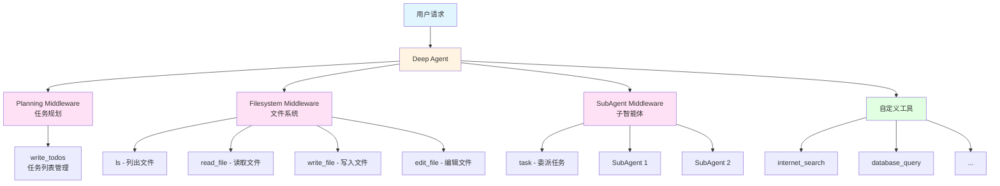
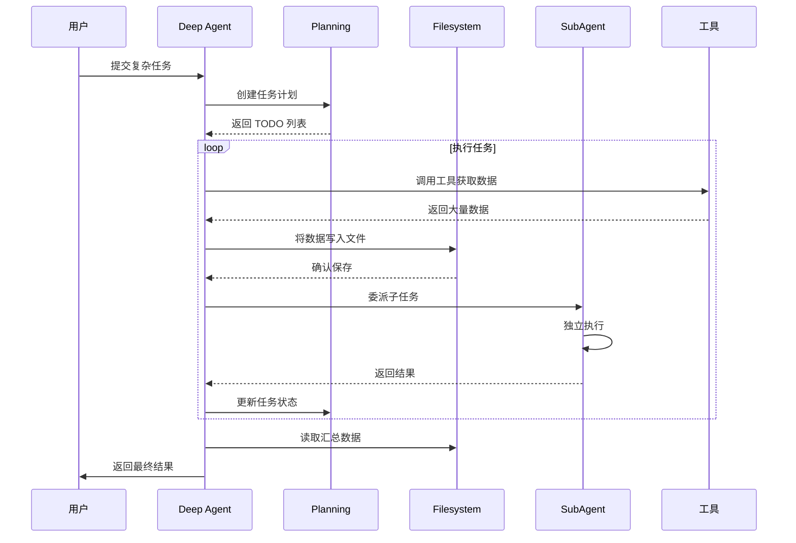

## DeepAgents 简介

DeepAgents 是 LangChain 推出的一个 Python 框架，用于构建"深度"AI 智能体。传统的 Agent 通过简单的工具调用循环来工作，但在处理复杂、多步骤任务时往往表现不佳。DeepAgents 通过引入四个核心能力来解决这个问题：

- 🎯 **规划工具（Planning Tool）**：帮助 Agent 分解任务并跟踪进度
- 📁 **文件系统（File System）**：提供短期和长期记忆能力
- 🤖 **子智能体（Sub Agents）**：支持任务委派和上下文隔离
- 📝 **详细提示词（Detailed Prompt）**：优化的系统提示词指导 Agent 行为

### 核心特性

- ✨ **高级任务规划**：通过 TodoList 中间件管理复杂任务
- 💾 **上下文管理**：文件系统工具避免上下文窗口溢出
- 🔄 **模块化架构**：基于中间件的可组合设计
- 🌐 **多模型支持**：支持 Claude、GPT-4 等主流 LLM
- 🔌 **MCP 集成**：支持 Model Context Protocol 工具

## 架构设计

### DeepAgents 核心架构



### 工作流程



## 安装配置

### 安装 DeepAgents

```bash
# 使用 pip
pip install deepagents

# 使用 uv
uv add deepagents

# 使用 poetry
poetry add deepagents
```

### 环境配置

```bash
# 设置 API Keys
export ANTHROPIC_API_KEY="your-api-key"
export OPENAI_API_KEY="your-api-key"
export TAVILY_API_KEY="your-tavily-key"  # 用于网络搜索
```

## 快速开始

### 基础示例：创建研究助手

```python
import os
from typing import Literal
from tavily import TavilyClient
from deepagents import create_deep_agent

# 初始化 Tavily 客户端
tavily_client = TavilyClient(api_key=os.environ["TAVILY_API_KEY"])

# 定义网络搜索工具
def internet_search(
    query: str,
    max_results: int = 5,
    topic: Literal["general", "news", "finance"] = "general",
    include_raw_content: bool = False,
):
    """执行网络搜索"""
    return tavily_client.search(
        query,
        max_results=max_results,
        include_raw_content=include_raw_content,
        topic=topic,
    )

# 系统提示词
research_instructions = """你是一位专业的研究助手。你的任务是进行深入研究，然后撰写精美的报告。

你可以使用 internet_search 工具作为主要的信息收集手段。

## 工作流程
1. 使用 write_todos 工具规划研究步骤
2. 使用 internet_search 收集信息
3. 将重要信息写入文件系统
4. 分析整理后撰写最终报告
"""

# 创建 Deep Agent
agent = create_deep_agent(
    tools=[internet_search],
    system_prompt=research_instructions,
)

# 调用 Agent
result = agent.invoke({
    "messages": [{"role": "user", "content": "什么是 LangGraph？"}]
})

print(result["messages"][-1].content)
```

### 流式输出示例

```python
# 流式输出 Agent 的思考过程
for chunk in agent.stream(
    {"messages": [{"role": "user", "content": "研究 DeepAgents 的核心特性"}]},
    stream_mode="values"
):
    if "messages" in chunk:
        chunk["messages"][-1].pretty_print()
```

## 核心中间件详解

### 1. TodoListMiddleware - 任务规划

TodoListMiddleware 为 Agent 提供了 `write_todos` 工具，用于管理任务列表。

```python
from langchain.agents import create_agent
from langchain.agents.middleware import TodoListMiddleware

agent = create_agent(
    model="anthropic:claude-sonnet-4-20250514",
    middleware=[
        TodoListMiddleware(
            system_prompt="使用 write_todos 工具来规划和跟踪任务进度"
        ),
    ],
)
```

**使用场景**：
- 复杂的多步骤任务
- 需要动态调整计划的场景
- 长时间运行的任务跟踪

### 2. FilesystemMiddleware - 文件系统

FilesystemMiddleware 提供四个核心工具：

```python
from deepagents.middleware.filesystem import FilesystemMiddleware

agent = create_agent(
    model="anthropic:claude-sonnet-4-20250514",
    middleware=[
        FilesystemMiddleware(
            system_prompt="将大量数据写入文件系统以节省上下文空间",
            custom_tool_descriptions={
                "ls": "列出当前目录的文件",
                "read_file": "读取文件内容，可指定行数范围",
                "write_file": "创建新文件并写入内容",
                "edit_file": "编辑现有文件"
            }
        ),
    ],
)
```

**工具说明**：
- `ls`：列出文件系统中的文件
- `read_file`：读取整个文件或指定行数
- `write_file`：创建新文件
- `edit_file`：编辑现有文件

**使用场景**：
- 处理大量搜索结果
- 需要保存中间结果
- 构建知识库

### 3. SubAgentMiddleware - 子智能体

SubAgentMiddleware 允许主 Agent 委派任务给专门的子 Agent。

```python
from langchain_core.tools import tool
from deepagents.middleware.subagents import SubAgentMiddleware

@tool
def get_weather(city: str) -> str:
    """获取城市天气"""
    return f"{city} 的天气是晴天"

# 定义子智能体
weather_subagent = {
    "name": "weather-agent",
    "description": "专门处理天气查询的子智能体",
    "system_prompt": "使用 get_weather 工具获取天气信息",
    "tools": [get_weather],
    "model": "openai:gpt-4o",  # 可选：使用不同的模型
}

agent = create_agent(
    model="anthropic:claude-sonnet-4-20250514",
    middleware=[
        SubAgentMiddleware(
            default_model="anthropic:claude-sonnet-4-20250514",
            default_tools=[],
            subagents=[weather_subagent],
        )
    ],
)
```

**优势**：
- 上下文隔离：子任务不污染主 Agent 上下文
- 专业化：不同子 Agent 可以有不同的工具和提示词
- 并行处理：可以同时运行多个子任务

## 高级用法

### 自定义模型

```python
from langchain.chat_models import init_chat_model
from deepagents import create_deep_agent

# 使用 GPT-4
model = init_chat_model("openai:gpt-4o")
agent = create_deep_agent(
    model=model,
    tools=[internet_search],
)

# 使用 Claude
model = init_chat_model("anthropic:claude-sonnet-4-20250514")
agent = create_deep_agent(
    model=model,
    tools=[internet_search],
)
```

### 人机协作（Human-in-the-Loop）

```python
from langchain_core.tools import tool
from deepagents import create_deep_agent

@tool
def delete_file(filename: str) -> str:
    """删除文件（需要人工确认）"""
    return f"文件 {filename} 已删除"

agent = create_deep_agent(
    model="anthropic:claude-sonnet-4-20250514",
    tools=[delete_file],
    interrupt_on={
        "delete_file": {
            "allowed_decisions": ["approve", "edit", "reject"]
        },
    }
)
```

### 使用预构建的子智能体

```python
from langgraph import StateGraph

# 创建自定义 LangGraph 图
def create_data_analyzer():
    workflow = StateGraph(...)
    # 构建自定义图
    return workflow.compile()

analyzer_graph = create_data_analyzer()

# 作为子智能体使用
custom_subagent = {
    "name": "data-analyzer",
    "description": "专门用于复杂数据分析的子智能体",
    "runnable": analyzer_graph
}

agent = create_deep_agent(
    model="anthropic:claude-sonnet-4-20250514",
    subagents=[custom_subagent]
)
```

### MCP 工具集成

DeepAgents 支持 Model Context Protocol (MCP) 工具：

```python
import asyncio
from langchain_mcp_adapters.client import MultiServerMCPClient
from deepagents import create_deep_agent

async def main():
    # 收集 MCP 工具
    mcp_client = MultiServerMCPClient(...)
    mcp_tools = await mcp_client.get_tools()

    # 创建 Agent
    agent = create_deep_agent(
        tools=mcp_tools,
        model="anthropic:claude-sonnet-4-20250514"
    )

    # 流式调用
    async for chunk in agent.astream(
        {"messages": [{"role": "user", "content": "分析最新的技术趋势"}]},
        stream_mode="values"
    ):
        if "messages" in chunk:
            chunk["messages"][-1].pretty_print()

asyncio.run(main())
```

## 实战案例

### 案例 1：智能研究助手

构建一个能够进行深度研究并生成报告的 Agent：

```python
import os
from typing import Literal
from tavily import TavilyClient
from deepagents import create_deep_agent

tavily_client = TavilyClient(api_key=os.environ["TAVILY_API_KEY"])

def internet_search(
    query: str,
    max_results: int = 5,
    topic: Literal["general", "news", "finance"] = "general",
):
    """网络搜索工具"""
    return tavily_client.search(
        query,
        max_results=max_results,
        topic=topic,
    )

research_prompt = """你是一位专业的研究分析师。

## 工作流程
1. **规划阶段**：使用 write_todos 创建研究计划
2. **信息收集**：使用 internet_search 收集相关信息
3. **数据管理**：将搜索结果写入文件系统，避免上下文溢出
4. **分析整理**：从文件中读取信息，进行深度分析
5. **报告撰写**：生成结构化的研究报告

## 注意事项
- 每次搜索后将结果保存到文件
- 使用描述性的文件名（如：search_results_topic.txt）
- 定期更新 TODO 列表以跟踪进度
- 最终报告应包含：摘要、详细分析、结论和参考来源
"""

research_agent = create_deep_agent(
    tools=[internet_search],
    system_prompt=research_prompt,
    model="anthropic:claude-sonnet-4-20250514"
)

# 执行研究任务
result = research_agent.invoke({
    "messages": [{
        "role": "user",
        "content": "研究 2024 年 AI Agent 技术的最新发展趋势，并生成详细报告"
    }]
})

print(result["messages"][-1].content)
```

### 案例 2：多领域专家系统

使用子智能体构建多领域专家系统：

```python
from langchain_core.tools import tool
from deepagents import create_deep_agent

# 技术工具
@tool
def search_technical_docs(query: str) -> str:
    """搜索技术文档"""
    # 实现技术文档搜索
    return f"技术文档搜索结果：{query}"

@tool
def analyze_code(code: str) -> str:
    """分析代码质量"""
    # 实现代码分析
    return f"代码分析结果"

# 市场工具
@tool
def get_market_data(product: str) -> str:
    """获取市场数据"""
    # 实现市场数据获取
    return f"{product} 的市场数据"

@tool
def competitor_analysis(company: str) -> str:
    """竞争对手分析"""
    # 实现竞争分析
    return f"{company} 的竞争分析"

# 定义子智能体
tech_expert = {
    "name": "tech-expert",
    "description": "技术专家，负责技术评估和代码审查",
    "system_prompt": "你是技术专家，擅长代码审查和技术架构分析",
    "tools": [search_technical_docs, analyze_code],
}

market_expert = {
    "name": "market-expert",
    "description": "市场专家，负责市场调研和竞争分析",
    "system_prompt": "你是市场分析专家，擅长市场趋势和竞争分析",
    "tools": [get_market_data, competitor_analysis],
}

# 创建主 Agent
supervisor_agent = create_deep_agent(
    model="anthropic:claude-sonnet-4-20250514",
    system_prompt="""你是项目总监，负责协调技术和市场团队。

当收到任务时：
1. 分析任务需求
2. 将技术相关任务委派给 tech-expert
3. 将市场相关任务委派给 market-expert
4. 整合两个团队的结果
5. 生成综合报告
""",
    subagents=[tech_expert, market_expert]
)

# 执行任务
result = supervisor_agent.invoke({
    "messages": [{
        "role": "user",
        "content": "评估开发一个 AI 驱动的客户服务平台的可行性"
    }]
})
```

### 案例 3：文档处理助手

处理大量文档并提取关键信息：

```python
from langchain_core.tools import tool
from deepagents import create_deep_agent
import os

@tool
def read_pdf(filepath: str) -> str:
    """读取 PDF 文件内容"""
    # 实现 PDF 读取逻辑
    return f"PDF 内容：{filepath}"

@tool
def extract_tables(filepath: str) -> str:
    """从文档中提取表格"""
    # 实现表格提取
    return "提取的表格数据"

@tool
def summarize_section(text: str, section: str) -> str:
    """总结文档特定章节"""
    # 实现章节总结
    return f"{section} 的总结"

doc_processor_prompt = """你是文档处理专家。

## 处理流程
1. 使用 read_pdf 读取文档
2. 将文档内容写入文件系统（按章节分割）
3. 使用 extract_tables 提取表格数据
4. 对每个章节使用 summarize_section 生成摘要
5. 将所有摘要整合成最终报告

## 文件组织
- raw_content/：原始文档内容
- sections/：按章节分割的内容
- tables/：提取的表格
- summaries/：各章节摘要
- final_report.md：最终报告
"""

doc_agent = create_deep_agent(
    tools=[read_pdf, extract_tables, summarize_section],
    system_prompt=doc_processor_prompt,
    model="anthropic:claude-sonnet-4-20250514"
)

# 处理文档
result = doc_agent.invoke({
    "messages": [{
        "role": "user",
        "content": "处理 annual_report_2024.pdf 并生成执行摘要"
    }]
})
```

## 最佳实践

### 1. 提示词工程

```python
# ✅ 好的提示词
good_prompt = """你是专业的数据分析师。

## 工作流程
1. 使用 write_todos 规划分析步骤
2. 收集数据并保存到文件系统
3. 逐步分析数据
4. 生成可视化报告

## 文件管理
- data/：原始数据
- analysis/：分析结果
- reports/：最终报告

## 输出格式
使用 Markdown 格式，包含：
- 执行摘要
- 详细分析
- 可视化图表
- 结论和建议
"""

# ❌ 不好的提示词
bad_prompt = "你是数据分析师，帮我分析数据"
```

### 2. 工具设计原则

```python
from langchain_core.tools import tool

# ✅ 好的工具设计
@tool
def search_database(
    query: str,
    table: str,
    limit: int = 10,
    filters: dict = None
) -> str:
    """
    搜索数据库

    Args:
        query: SQL 查询语句
        table: 表名
        limit: 返回结果数量限制
        filters: 额外的过滤条件

    Returns:
        查询结果的 JSON 字符串
    """
    # 实现逻辑
    pass

# ❌ 不好的工具设计
@tool
def search(q: str) -> str:
    """搜索"""  # 描述不清晰
    pass
```

### 3. 错误处理

```python
from deepagents import create_deep_agent
import logging

logging.basicConfig(level=logging.INFO)

try:
    agent = create_deep_agent(
        tools=[internet_search],
        system_prompt=research_prompt,
    )

    result = agent.invoke({
        "messages": [{"role": "user", "content": "研究主题"}]
    })

except Exception as e:
    logging.error(f"Agent 执行失败: {e}")
    # 实现重试逻辑或降级方案
```

### 4. 性能优化

```python
# 使用检查点实现状态持久化
from langgraph.checkpoint.memory import MemorySaver

checkpointer = MemorySaver()

agent = create_deep_agent(
    tools=[internet_search],
    system_prompt=research_prompt,
    checkpointer=checkpointer  # 启用检查点
)

# 使用线程 ID 恢复会话
config = {"configurable": {"thread_id": "session-123"}}
result = agent.invoke(
    {"messages": [{"role": "user", "content": "继续之前的研究"}]},
    config=config
)
```

## 与传统 Agent 的对比

| 特性 | 传统 Agent | Deep Agent |
|------|-----------|------------|
| 任务规划 | ❌ 无内置规划 | ✅ TodoList 中间件 |
| 上下文管理 | ❌ 容易溢出 | ✅ 文件系统工具 |
| 任务委派 | ❌ 单一 Agent | ✅ 子智能体支持 |
| 复杂任务 | ⚠️ 表现一般 | ✅ 专为复杂任务设计 |
| 可扩展性 | ⚠️ 有限 | ✅ 中间件架构 |
| 学习曲线 | ✅ 简单 | ⚠️ 需要理解中间件 |

## 常见问题

### Q1: DeepAgents 适合什么场景？

**适合**：
- 需要多步骤规划的复杂任务
- 处理大量数据的场景
- 需要专业化子任务的应用
- 长时间运行的研究或分析任务

**不适合**：
- 简单的单次工具调用
- 实时性要求极高的场景
- 资源受限的环境

### Q2: 如何选择合适的模型？

```python
# 复杂推理任务：使用 Claude Sonnet
agent = create_deep_agent(
    model="anthropic:claude-sonnet-4-20250514",
    tools=[...]
)

# 成本敏感场景：使用 GPT-4o-mini
agent = create_deep_agent(
    model="openai:gpt-4o-mini",
    tools=[...]
)

# 不同子任务使用不同模型
subagent = {
    "name": "simple-task",
    "model": "openai:gpt-4o-mini",  # 简单任务用小模型
    "tools": [...]
}
```

### Q3: 如何调试 DeepAgents？

```python
# 启用详细日志
import logging
logging.basicConfig(level=logging.DEBUG)

# 使用流式输出观察思考过程
for chunk in agent.stream(
    {"messages": [{"role": "user", "content": "任务"}]},
    stream_mode="values"
):
    if "messages" in chunk:
        print(chunk["messages"][-1])

# 检查文件系统状态
# Agent 会将中间结果保存到文件，可以查看这些文件
```

## 总结

DeepAgents 通过引入规划、文件系统和子智能体等机制，显著提升了 AI Agent 处理复杂任务的能力。主要优势包括：

✅ **更好的任务规划**：通过 TodoList 管理复杂流程
✅ **高效的上下文管理**：文件系统避免上下文溢出
✅ **模块化设计**：中间件架构易于扩展
✅ **专业化处理**：子智能体实现任务隔离

## 参考资源

- [DeepAgents GitHub](https://github.com/langchain-ai/deepagents)
- [LangChain 官方文档](https://docs.langchain.com/)
- [LangGraph 文档](https://langchain-ai.github.io/langgraph/)
- [Deep Agents 博客](https://blog.langchain.com/deep-agents/)
- [DataCamp 教程](https://www.datacamp.com/tutorial/deep-agents)
