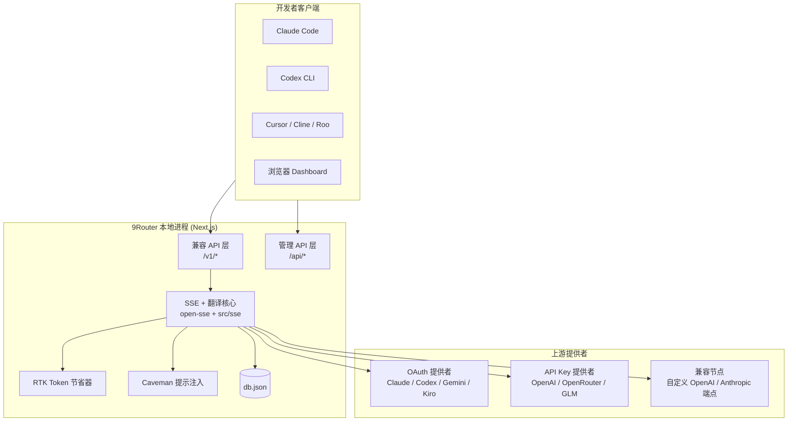
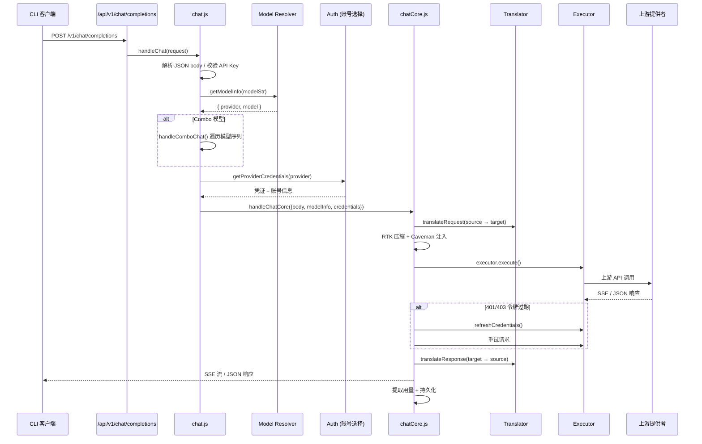

## 引言

[9Router](https://github.com/decolua/9router) 是一个开源的本地 AI 路由网关，它为开发者提供统一的 OpenAI 兼容 API 端点（`/v1/*`），将请求智能路由到 40+ 上游 AI 提供商（Claude、OpenAI、Gemini、Codex、Kiro、Cursor 等），并支持请求格式翻译、多账号降级、模型组合回退、OAuth 令牌管理、Token 用量追踪等能力。

本文从源码层面深度分析其架构设计，探讨它是如何将一个 Next.js 应用打造成一个功能完备的 AI 网关的。

## 整体架构



9Router 的技术栈选型值得关注：

| 组件 | 技术选型 | 说明 |
|------|---------|------|
| Web 框架 | Next.js 16 (App Router) | 同时承载 API 路由和 Dashboard UI |
| 状态管理 | Zustand | 前端状态 |
| 数据持久化 | lowdb (JSON 文件) | 本地轻量数据库，文件锁保护并发 |
| 流式处理 | 原生 SSE + TransformStream | 支持 SSE 流式响应和流间翻译 |
| 加密 | jose + bcryptjs | JWT 会话 + 密码哈希 |
| 代码编辑器 | Monaco Editor | Dashboard 中的配置编辑 |
| 流程图 | @xyflow/react | 可视化编排 |

## 核心模块划分

### 模块目录结构

```
src/
├── app/api/           # Next.js App Router API 路由
│   ├── v1/            # OpenAI 兼容 API（核心入口）
│   ├── providers*     # 提供者 CRUD
│   ├── oauth/         # OAuth 流程
│   └── ...
├── sse/               # SSE 处理层（项目入口调度）
│   ├── handlers/      # chat / embeddings / tts / image / stt
│   └── services/      # auth / model / tokenRefresh
├── lib/               # 持久化 & 基础设施
│   ├── localDb.js     # 主状态数据库
│   └── usageDb.js     # 用量统计数据库
└── shared/            # 共享工具

open-sse/              # 独立的 SSE 核心模块（可被 Cloudflare Worker 复用）
├── handlers/
│   └── chatCore.js    # 核心调度器
├── executors/         # 提供者执行器（20+ 个）
├── translator/        # 格式翻译注册表
│   ├── request/       # 请求翻译器
│   └── response/      # 响应翻译器
├── services/          # 账号降级、提供者配置
├── rtk/               # Token 节省引擎
└── config/            # 错误分类、运行时配置
```

值得注意的是 `open-sse/` 目录作为独立模块存在，源码注释表明它被设计为可被 Cloudflare Worker 复用的核心——这是架构上的一个重要设计决策，将 SSE 核心逻辑与 Next.js 解耦。

## 请求生命周期

以 `/v1/chat/completions` 为例，一次完整的请求经过以下阶段：



## 格式翻译引擎

这是 9Router 最精巧的设计之一。由于上游提供者的 API 格式各异（OpenAI Chat、Claude Messages、Gemini GenerateContent、OpenAI Responses 等），9Router 实现了一个以 OpenAI 格式为中间层的两阶段翻译架构。

### 翻译注册表机制

```javascript
// open-sse/translator/index.js
const requestRegistry = new Map();
const responseRegistry = new Map();

export function register(from, to, requestFn, responseFn) {
  const key = `${from}:${to}`;
  if (requestFn) requestRegistry.set(key, requestFn);
  if (responseFn) responseRegistry.set(key, responseFn);
}
```

翻译器通过 `register()` 注册到 Map 中，使用 `${source}:${target}` 作为键。翻译流程始终以 OpenAI 格式为中间层：

```
请求翻译：source → openai → target
响应翻译：target → openai → source
```

### 格式自动检测

源码中 `detectFormat(body)` 函数通过分析请求体结构自动判断来源格式：

| 检测条件 | 判定格式 |
|---------|---------|
| 有 `input` 数组/字符串，无 `messages` | `openai-responses` |
| `body.request.contents` + `userAgent=antigravity` | `antigravity` |
| 有 `contents` 数组 | `gemini` |
| 有 `stream_options` / `response_format` / `logprobs` 等 | `openai` |
| `content` 为数组且含 `tool_use` / `tool_result` 类型 | `claude` |
| 默认 | `openai` |

### 翻译器覆盖矩阵

| 方向 | 翻译器 |
|------|--------|
| Claude → OpenAI | `claude-to-openai.js` |
| OpenAI → Claude | `openai-to-claude.js` |
| Gemini → OpenAI | `gemini-to-openai.js` |
| OpenAI → Gemini | `openai-to-gemini.js` |
| Antigravity → OpenAI | `antigravity-to-openai.js` |
| OpenAI → Kiro | `openai-to-kiro.js` |
| OpenAI → Cursor | `openai-to-cursor.js` |
| OpenAI → Ollama | `openai-to-ollama.js` |
| OpenAI Responses | `openai-responses.js` (双向) |

这种设计使得新增提供者只需实现两个方向的翻译函数并注册即可，无需修改核心调度逻辑。

## 多级降级机制

9Router 的降级策略分为两个层级：**账号级降级** 和 **模型组合级降级**。

### 账号级降级（Account Fallback）

每个提供者可以配置多个账号（如多个 OAuth 令牌或 API Key）。当一个账号请求失败时：

1. `markAccountUnavailable()` 标记该账号进入冷却期
2. 冷却时长由**错误分类规则**决定（`errorConfig.js`）
3. 调度器自动选择下一个可用账号重试

错误分类采用优先级匹配：

```javascript
// open-sse/config/errorConfig.js
export const ERROR_RULES = [
  // 文本规则（优先匹配）
  { text: "rate limit",        backoff: true },     // 指数退避
  { text: "quota exceeded",    backoff: true },
  { text: "capacity",          backoff: true },
  // 状态码规则（兜底）
  { status: 429,               backoff: true },     // 指数退避
  { status: 401,               cooldownMs: 120000 }, // 固定冷却 2 分钟
  { status: 403,               cooldownMs: 120000 },
];
```

指数退避参数：基础 2 秒，每级翻倍，上限 5 分钟，最多 15 级。这意味着最极端的情况下冷却时间为 2^14 = 16384 秒（约 4.5 小时），但被 `max: 5 * 60 * 1000` 封顶在 5 分钟。

### 模型级锁定（Model Lock）

更精细的设计是**模型级锁定**：同一个账号上，不同模型可以独立进入冷却。字段以 `modelLock_${modelName}` 平铺存储在 Connection 记录上：

```javascript
// 账号 A 上 claude-sonnet 可能被锁定，但 claude-opus 仍可用
connection = {
  id: "xxx",
  modelLock_claude-sonnet-4-5: "2026-05-09T10:30:00Z",  // 冷却中
  modelLock_claude-opus-4-5: null,                       // 正常
}
```

### 模型组合降级（Combo Fallback）

Combo 是一个命名的模型序列（如 `["claude/claude-sonnet-4-5", "kiro/claude-sonnet-4-5", "glm/glm-4"]`），支持两种策略：

- **fallback**（默认）：按顺序尝试，第一个成功即返回
- **round-robin**：带粘性的轮询，每个模型使用 N 次后切换到下一个

```javascript
// open-sse/services/combo.js
export async function handleComboChat({ body, models, handleSingleModel, comboStrategy, comboStickyLimit }) {
  const rotatedModels = getRotatedModels(models, comboName, comboStrategy, comboStickyLimit);

  for (const modelStr of rotatedModels) {
    const result = await handleSingleModel(body, modelStr);
    if (result.ok) return result;

    const { shouldFallback } = checkFallbackError(result.status, errorText);
    if (!shouldFallback) return result; // 不可降级的错误，直接返回

    // 瞬态错误（502/503/504）短暂等待后降级
    if (cooldownMs <= 5000 && [502, 503, 504].includes(result.status)) {
      await new Promise(r => setTimeout(r, cooldownMs));
    }
  }
  // 所有模型失败
}
```

### 账号选择策略

提供者级别的账号选择也支持两种模式：

- **fill-first**（默认）：按优先级排序，始终选第一个可用的
- **round-robin**：带粘性的轮询，通过 `stickyRoundRobinLimit` 控制每个账号连续使用次数

选择逻辑通过互斥锁（Mutex）保护，防止并发请求导致竞态条件。

## RTK Token 节省引擎

RTK (Reduce Token Kilo) 是 9Router 的 Token 压缩引擎，通过自动识别和压缩 `tool_result` 中的冗余内容，节省 20-40% 的 Token 消耗。

### 压缩流程

```javascript
// open-sse/rtk/index.js
export function compressMessages(body, enabled) {
  // 支持 OpenAI messages[]、Claude content blocks、Responses input[] 三种消息格式
  for (const msg of items) {
    // 识别 tool_result / tool 消息
    // 跳过 error 消息（保留完整错误栈）
    // 对文本内容调用 autoDetectFilter → safeApply 压缩
  }
}
```

压缩器会自动检测文本类型（如 git diff、ls 输出、grep 结果等），应用对应的过滤器。安全机制保证：

- 文本过小（< MIN_COMPRESS_SIZE）或过大（> RAW_CAP）不压缩
- 压缩结果为空或比原文更长时不替换
- `is_error=true` 的 tool_result 不压缩（保留完整错误信息）

### Caveman 模式

Caveman 是一个可选的提示注入器，向系统消息追加简洁风格指令，引导模型用更短的格式回复，进一步节省 Token：

```javascript
// open-sse/rtk/caveman.js
export function injectCaveman(body, format, level) {
  // 根据 format 选择注入方式：
  // - Claude: body.system (string | array)
  // - Gemini: body.system_instruction.parts
  // - OpenAI: messages[] 中的 system role 或 instructions 字段
}
```

## 提供者执行器体系

9Router 为不同提供者实现了 20+ 个专用执行器，每个执行器封装了该提供者特有的认证方式、URL 构建和网络行为：

| 执行器 | 特殊行为 |
|--------|---------|
| `AntigravityExecutor` | Gemini 内部格式包装，多 Base URL 轮询 |
| `GithubExecutor` | 模拟 VSCode Copilot 请求头，copilotToken 认证 |
| `KiroExecutor` | Kiro 特定的社交登录令牌交换 |
| `CodexExecutor` | OpenAI Codex API 格式适配 |
| `CursorExecutor` | Cursor 内部 API 格式适配 |
| `VertexExecutor` | Google Vertex AI 异步令牌铸造（服务账号 JSON） |
| `QwenExecutor` | 阿里云 Qwen 自定义 resource URL |
| `DefaultExecutor` | 通用 OpenAI 兼容提供者的默认路径 |

所有执行器继承自 `BaseExecutor`，对于没有专用执行器的提供者（包括所有自定义兼容节点），自动使用 `DefaultExecutor`，这是一个优雅的降级设计。

### Native Passthrough 优化

当客户端工具和目标提供者属于同一生态时（如 Claude Code → Claude API），系统跳过所有格式翻译，仅替换模型名和 Bearer 令牌，实现无损直通：

```javascript
const clientTool = detectClientTool(headers, body);
const passthrough = isNativePassthrough(clientTool, provider);
if (passthrough) {
  translatedBody = { ...body, model };
  // 跳过翻译，直接发送
}
```

## 持久化层设计

### 数据库方案

9Router 选择 lowdb（基于 JSON 文件）而非 SQLite 作为主存储，这个选型反映了"本地优先"的设计理念——零依赖、人类可读、易于备份和迁移。

```javascript
// src/lib/localDb.js
const DB_FILE = path.join(DATA_DIR, "db.json");
// 数据实体：providerConnections, providerNodes, modelAliases, combos, apiKeys, settings, pricing
```

### 并发安全

为了保护 JSON 文件的并发安全，实现了双层锁机制：

1. **进程内互斥锁**（LocalMutex）：基于 Promise 队列的异步锁
2. **文件锁**（proper-lockfile）：跨进程的文件级锁

```javascript
async function withFileLock(db, operation) {
  const releaseLocal = await localMutex.acquire();  // 进程内锁
  const release = await lockfile.lock(DB_FILE, { retries: 15 });  // 文件锁
  try { await operation(); }
  finally { release(); releaseLocal(); }
}
```

### 数据修复

`ensureDbShape()` 函数在每次读取时检查数据完整性，自动补充缺失字段、迁移旧格式（如为 API Key 添加 `isActive` 字段），并对损坏的 JSON 文件自动重置为默认值。

## OAuth 令牌管理

OAuth 令牌的生命周期管理是 9Router 的核心能力之一，支持 Claude、Codex、Gemini、GitHub、Kiro、Cursor 等提供者的 OAuth 流程。

### 令牌刷新

在请求处理过程中，如果上游返回 401/403，系统自动触发令牌刷新：

```javascript
// open-sse/handlers/chatCore.js
if (providerResponse.status === 401 || providerResponse.status === 403) {
  const newCredentials = await refreshWithRetry(() => executor.refreshCredentials(credentials), 3);
  if (newCredentials?.accessToken) {
    Object.assign(credentials, newCredentials);
    await onCredentialsRefreshed(newCredentials);  // 持久化新令牌
    // 重试请求
  }
}
```

`refreshWithRetry` 支持最多 3 次重试，确保临时的网络问题不会导致令牌丢失。刷新成功后通过回调 `onCredentialsRefreshed` 将新令牌持久化到本地数据库。

## SSE 流式处理

流式响应处理是 AI 网关的核心挑战。9Router 的实现包含几个关键设计：

### StreamController

封装了客户端断连检测、错误处理和完成通知：

```javascript
const streamController = createStreamController({
  onDisconnect: (reason) => { trackPendingRequest(model, provider, connectionId, false); },
  onError: () => trackPendingRequest(model, provider, connectionId, false),
});
```

### 强制 SSE → JSON 转换

某些提供者（如 OpenAI）只支持流式响应，但客户端可能请求非流式。9Router 实现了 SSE → JSON 的缓冲转换：

```javascript
if (!clientRequestedStreaming && providerRequiresStreaming) {
  return handleForcedSSEToJson({ providerResponse, ... });
}
```

### Accept 头协商

系统还会检查客户端的 `Accept` 头偏好，当客户端发送 `Accept: application/json` 且未明确要求流式时，自动降级为非流式响应——这解决了 AI SDK 兼容性问题。

## URL 路由设计

Next.js 的 rewrites 配置将 `/v1/*` 映射到 `/api/v1/*`，使得 CLI 工具只需配置 `http://localhost:20128/v1` 作为 Base URL：

```javascript
// next.config.mjs
async rewrites() {
  return [
    { source: "/v1/v1/:path*",  destination: "/api/v1/:path*" },  // 容错：双重 /v1
    { source: "/codex/:path*",  destination: "/api/v1/responses" }, // Codex 专用
    { source: "/v1/:path*",     destination: "/api/v1/:path*" },
  ]
}
```

注意 `/v1/v1/` 的容错映射——这处理了某些客户端在 Base URL 已包含 `/v1` 时又拼接 `/v1/` 的情况，体现了实战中积累的兼容性经验。

## Claude 工具伪装（Cloaking）

当使用 Claude OAuth 令牌（`sk-ant-oat-*`）时，9Router 会自动将客户端发送的工具名称添加 `_cc` 后缀：

```javascript
// open-sse/translator/index.js
if (provider === "claude" && apiKey?.includes("sk-ant-oat")) {
  const { body: cloakedBody, toolNameMap } = cloakClaudeTools(result);
  result = cloakedBody;
  result._toolNameMap = toolNameMap;  // 保存映射表，响应时还原
}
```

响应翻译器会根据 `_toolNameMap` 将工具名还原为客户端原始名称，整个过程对客户端完全透明。

## 架构亮点与思考

### 设计亮点

1. **以 OpenAI 格式为通用中间层**的翻译架构，使得 N×M 的格式转换简化为 N+M 个翻译器

2. **双级降级**（账号级 + 模型组合级）配合指数退避，实现了高可用的请求路由

3. **`open-sse/` 模块的独立性**设计，使得核心逻辑可在 Next.js 和 Cloudflare Worker 之间复用

4. **模型级锁定**而非账号级锁定，同一个账号的不同模型可以独立降级，最大化利用率

5. **Native Passthrough** 优化，同生态的直通避免了翻译损失

### 值得关注的设计决策

- **lowdb vs SQLite**：选择 JSON 文件虽然牺牲了查询能力，但换来了零配置和人类可读性，符合本地工具的定位
- **两层锁机制**：进程内 Mutex + 文件锁，保证了多实例并发场景的数据安全
- **错误分类规则引擎**：文本优先 + 状态码兜底的匹配策略，在灵活性和可靠性之间取得了好的平衡
- **RTK 压缩的安全阀设计**：多层保护确保压缩不会破坏数据（空值检查、长度检查、错误消息跳过）

### 潜在的改进方向

- `usageDb` 当前硬编码在 `~/.9router/`，不遵循 `DATA_DIR` 环境变量
- 翻译器使用 `require()` 懒加载，在 ESM 环境中可能带来兼容性挑战
- 令牌等敏感信息以明文存储在 JSON 文件中，依赖文件系统权限保护

## 总结

9Router 用约 2 万行代码构建了一个功能完备的本地 AI 网关，其核心价值在于：通过格式翻译抹平了 40+ AI 提供者的 API 差异，通过多级降级实现了高可用的请求路由，通过 RTK 引擎节省了 20-40% 的 Token 消耗。

从架构上看，它展示了一个有趣的模式：**将 Next.js 的 App Router 作为 API Gateway 的运行时**，利用 Next.js 的路由系统、中间件能力和 SSR 支持，同时承载 API 网关和管理 Dashboard 两个角色。这种"全栈网关"的模式对于本地开发工具来说是一个务实的选择。

---

> 源码版本：9router v0.4.20，分析时间 2026-05-09。项目地址：[github.com/decolua/9router](https://github.com/decolua/9router)
