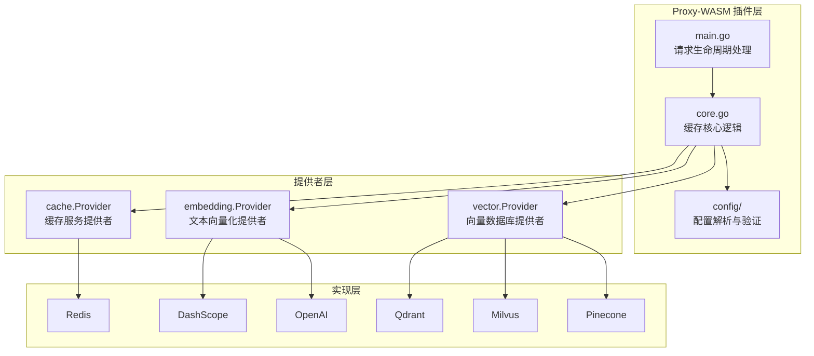
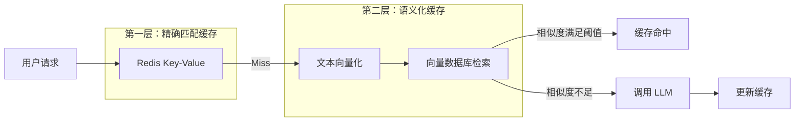
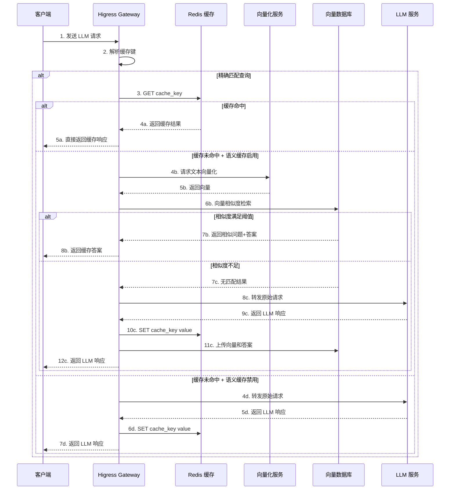

## 引言

随着大语言模型（LLM）在企业应用中的广泛落地，API 调用成本和响应延迟成为制约其规模化应用的关键瓶颈。**AI 缓存插件**应运而生，通过智能缓存机制显著降低 LLM 调用开销。

Higress 基于 **Proxy-WASM** 技术实现的 AI 缓存插件，是一个生产级的智能缓存解决方案。它不仅支持传统的字符串精确匹配缓存，更创新性地引入了**语义化缓存**机制，通过向量相似度检索实现"相似问题命中缓存"的能力。

本文将从源码层面深入剖析 Higress AI 缓存插件的设计思想与实现细节。

---

## 插件架构概览

### 整体架构

AI 缓存插件采用**分层模块化设计**，核心包含三大提供者（Provider）体系：



### 双层缓存机制

插件采用**精确匹配 + 语义检索**的双层缓存策略：



---

## 核心源码分析

### 1. 插件入口与请求处理流程

#### main.go：请求生命周期处理

插件通过 Proxy-WASM SDK 的生命周期钩子实现请求拦截与处理：

```go
// main.go:32-42
func init() {
    wrapper.SetCtx(
        PLUGIN_NAME,
        wrapper.ParseConfigBy(parseConfig),
        wrapper.ProcessRequestHeadersBy(onHttpRequestHeaders),
        wrapper.ProcessRequestBodyBy(onHttpRequestBody),
        wrapper.ProcessResponseHeadersBy(onHttpResponseHeaders),
        wrapper.ProcessStreamingResponseBodyBy(onHttpResponseBody),
    )
}
```

**关键常量定义**：

```go
// main.go:16-27
const (
    PLUGIN_NAME                 = "ai-cache"
    CACHE_KEY_CONTEXT_KEY       = "cacheKey"           // 缓存键
    CACHE_KEY_EMBEDDING_KEY     = "cacheKeyEmbedding"  // 向量缓存
    CACHE_CONTENT_CONTEXT_KEY   = "cacheContent"       // 缓存内容
    PARTIAL_MESSAGE_CONTEXT_KEY = "partialMessage"     // SSE 分片消息
    TOOL_CALLS_CONTEXT_KEY      = "toolCalls"          // 工具调用
    STREAM_CONTEXT_KEY          = "stream"             // 流式响应标识
    SKIP_CACHE_HEADER           = "x-higress-skip-ai-cache"
)
```

#### 请求头处理：onHttpRequestHeaders

```go
// main.go:60-83
func onHttpRequestHeaders(ctx wrapper.HttpContext, c config.PluginConfig, log log.Log) types.Action {
    ctx.DisableReroute()

    // 支持通过请求头跳过缓存
    skipCache, _ := proxywasm.GetHttpRequestHeader(SKIP_CACHE_HEADER)
    if skipCache == "on" {
        ctx.SetContext(SKIP_CACHE_HEADER, struct{}{})
        ctx.DontReadRequestBody()
        return types.ActionContinue
    }

    contentType, _ := proxywasm.GetHttpRequestHeader("content-type")
    if contentType == "" {
        return types.ActionContinue
    }

    // 仅处理 JSON 请求体
    if !strings.Contains(contentType, "application/json") {
        ctx.DontReadRequestBody()
        return types.ActionContinue
    }

    ctx.SetRequestBodyBufferLimit(DEFAULT_MAX_BODY_BYTES)
    _ = proxywasm.RemoveHttpRequestHeader("Accept-Encoding")

    // 停止迭代，等待请求体处理
    return types.HeaderStopIteration
}
```

**设计要点**：
- 通过 `x-higress-skip-ai-cache` 请求头支持强制跳过缓存
- 移除 `Accept-Encoding` 头以确保响应体可读
- 使用 `HeaderStopIteration` 延迟头转发，实现缓存命中时直接响应

#### 请求体处理：onHttpRequestBody

这是缓存查询的核心入口：

```go
// main.go:85-132
func onHttpRequestBody(ctx wrapper.HttpContext, c config.PluginConfig, body []byte, log log.Log) types.Action {
    bodyJson := gjson.ParseBytes(body)

    // 检测流式模式
    stream := false
    if bodyJson.Get("stream").Bool() {
        stream = true
        ctx.SetContext(STREAM_CONTEXT_KEY, struct{}{})
    }

    // 根据缓存键策略提取问题
    var key string
    if c.CacheKeyStrategy == config.CACHE_KEY_STRATEGY_LAST_QUESTION {
        key = bodyJson.Get(c.CacheKeyFrom).String()
    } else if c.CacheKeyStrategy == config.CACHE_KEY_STRATEGY_ALL_QUESTIONS {
        messages := bodyJson.Get("messages").Array()
        var userMessages []string
        for _, msg := range messages {
            if msg.Get("role").String() == "user" {
                userMessages = append(userMessages, msg.Get("content").String())
            }
        }
        key = strings.Join(userMessages, "\n")
    } else if c.CacheKeyStrategy == config.CACHE_KEY_STRATEGY_DISABLED {
        ctx.DontReadResponseBody()
        return types.ActionContinue
    }

    ctx.SetContext(CACHE_KEY_CONTEXT_KEY, key)

    // 执行缓存查询
    if err := CheckCacheForKey(key, ctx, c, log, stream, true); err != nil {
        return types.ActionContinue
    }

    return types.ActionPause
}
```

**缓存键策略**：

| 策略值 | 说明 | 配置路径示例 |
|--------|------|--------------|
| `lastQuestion` | 仅使用最后一条用户问题 | `messages.@reverse.0.content` |
| `allQuestions` | 拼接所有用户问题 | 从 `messages` 数组提取 |
| `disabled` | 禁用缓存 | - |

---

### 2. 核心缓存逻辑：core.go

#### 缓存查询入口：CheckCacheForKey

```go
// core.go:18-37
func CheckCacheForKey(key string, ctx wrapper.HttpContext, c config.PluginConfig, log logs.Log, stream bool, useSimilaritySearch bool) error {
    activeCacheProvider := c.GetCacheProvider()

    // 如果未配置缓存提供者，直接执行语义搜索
    if activeCacheProvider == nil {
        return performSimilaritySearch(key, ctx, c, log, key, stream)
    }

    queryKey := activeCacheProvider.GetCacheKeyPrefix() + key

    err := activeCacheProvider.Get(queryKey, func(response resp.Value) {
        handleCacheResponse(key, response, ctx, log, stream, c, useSimilaritySearch)
    })

    return err
}
```

#### 缓存响应处理：handleCacheResponse

```go
// core.go:40-60
func handleCacheResponse(key string, response resp.Value, ctx wrapper.HttpContext, log logs.Log, stream bool, c config.PluginConfig, useSimilaritySearch bool) {
    // 缓存命中
    if err := response.Error(); err == nil && !response.IsNull() {
        log.Infof("[%s] cache hit for key: %s", PLUGIN_NAME, key)
        processCacheHit(key, response.String(), stream, ctx, c, log)
        return
    }

    // 缓存未命中，执行语义搜索
    log.Infof("[%s] cache miss for key: %s", PLUGIN_NAME, key)
    if useSimilaritySearch && c.EnableSemanticCache {
        performSimilaritySearch(key, ctx, c, log, key, stream)
    } else {
        proxywasm.ResumeHttpRequest()
    }
}
```

#### 缓存命中处理：processCacheHit

```go
// core.go:63-85
func processCacheHit(key string, response string, stream bool, ctx wrapper.HttpContext, c config.PluginConfig, log logs.Log) {
    if strings.TrimSpace(response) == "" {
        proxywasm.ResumeHttpRequest()
        return
    }

    // JSON 转义确保格式一致性
    escapedResponse := strings.Trim(strconv.Quote(response), "\"")

    ctx.SetContext(CACHE_KEY_CONTEXT_KEY, nil)
    ctx.SetUserAttribute("cache_status", "hit")
    ctx.WriteUserAttributeToLogWithKey(wrapper.AILogKey)

    if stream {
        proxywasm.SendHttpResponseWithDetail(200, "ai-cache.hit",
            [][2]string{{"content-type", "text/event-stream; charset=utf-8"}},
            []byte(fmt.Sprintf(c.StreamResponseTemplate, escapedResponse)), -1)
    } else {
        proxywasm.SendHttpResponseWithDetail(200, "ai-cache.hit",
            [][2]string{{"content-type", "application/json; charset=utf-8"}},
            []byte(fmt.Sprintf(c.ResponseTemplate, escapedResponse)), -1)
    }
}
```

---

### 3. 语义化缓存实现

#### 语义搜索分发：performSimilaritySearch

插件根据向量数据库的能力自动选择查询方式：

```go
// core.go:88-107
func performSimilaritySearch(key string, ctx wrapper.HttpContext, c config.PluginConfig, log logs.Log, queryString string, stream bool) error {
    activeVectorProvider := c.GetVectorProvider()
    if activeVectorProvider == nil {
        return logAndReturnError(log, "no vector provider configured")
    }

    // 方式一：字符串查询（向量数据库内置向量化）
    if _, ok := activeVectorProvider.(vector.StringQuerier); ok {
        return performStringQuery(key, queryString, ctx, c, log, stream)
    }

    // 方式二：向量查询（需外部向量化服务）
    if _, ok := activeVectorProvider.(vector.EmbeddingQuerier); ok {
        return performEmbeddingQuery(key, ctx, c, log, stream)
    }

    return logAndReturnError(log, "no suitable querier available")
}
```

**两种查询方式的区别**：

| 方式 | 实现接口 | 适用场景 | 流程 |
|------|----------|----------|------|
| **字符串查询** | `StringQuerier` | 向量数据库内置向量化能力 | 直接发送原始文本 → 向量数据库向量化并检索 |
| **向量查询** | `EmbeddingQuerier` | 需要独立向量化服务 | 调用向量化 API → 获取向量 → 检索向量数据库 |

#### 向量查询实现：performEmbeddingQuery

```go
// core.go:122-148
func performEmbeddingQuery(key string, ctx wrapper.HttpContext, c config.PluginConfig, log logs.Log, stream bool) error {
    embeddingQuerier := c.GetVectorProvider().(vector.EmbeddingQuerier)
    activeEmbeddingProvider := c.GetEmbeddingProvider()

    // 调用向量化服务
    return activeEmbeddingProvider.GetEmbedding(key, ctx, func(textEmbedding []float64, err error) {
        if err != nil {
            handleInternalError(err, "error getting embedding", log)
            return
        }

        // 缓存向量用于后续上传
        ctx.SetContext(CACHE_KEY_EMBEDDING_KEY, textEmbedding)

        // 执行向量检索
        err = embeddingQuerier.QueryEmbedding(textEmbedding, ctx, log, func(results []vector.QueryResult, ctx wrapper.HttpContext, log logs.Log, err error) {
            handleQueryResults(key, results, ctx, log, stream, c, err)
        })
    })
}
```

#### 查询结果处理：handleQueryResults

```go
// core.go:151-186
func handleQueryResults(key string, results []vector.QueryResult, ctx wrapper.HttpContext, log logs.Log, stream bool, c config.PluginConfig, err error) {
    if err != nil || len(results) == 0 {
        proxywasm.ResumeHttpRequest()
        return
    }

    mostSimilarData := results[0]
    simThreshold := c.GetVectorProviderConfig().Threshold
    simThresholdRelation := c.GetVectorProviderConfig().ThresholdRelation

    // 相似度阈值比较
    if compare(simThresholdRelation, mostSimilarData.Score, simThreshold) {
        // 如果向量数据库包含答案，直接返回
        if mostSimilarData.Answer != "" {
            cacheResponse(ctx, c, key, mostSimilarData.Answer, log)
            processCacheHit(key, mostSimilarData.Answer, stream, ctx, c, log)
        } else {
            // 否则使用相似问题的键查询缓存
            if c.GetCacheProvider() != nil {
                CheckCacheForKey(mostSimilarData.Text, ctx, c, log, stream, false)
            }
        }
    } else {
        proxywasm.ResumeHttpRequest()
    }
}
```

**相似度比较函数**：

```go
// core.go:265-278
func compare(operator string, value1 float64, value2 float64) bool {
    switch operator {
    case "gt":   // 大于（适用于余弦相似度、点积）
        return value1 > value2
    case "gte":  // 大于等于
        return value1 >= value2
    case "lt":   // 小于（适用于欧氏距离）
        return value1 < value2
    case "lte":  // 小于等于
        return value1 <= value2
    default:
        return false
    }
}
```

---

### 4. 响应处理与缓存更新

#### 响应体处理：onHttpResponseBody

```go
// main.go:156-200
func onHttpResponseBody(ctx wrapper.HttpContext, c config.PluginConfig, chunk []byte, isLastChunk bool, log log.Log) []byte {
    if ctx.GetContext(TOOL_CALLS_CONTEXT_KEY) != nil {
        return chunk
    }

    key := ctx.GetContext(CACHE_KEY_CONTEXT_KEY)
    if key == nil {
        return chunk
    }

    stream := ctx.GetContext(STREAM_CONTEXT_KEY)

    if !isLastChunk {
        // 处理中间分片
        if stream == nil {
            handleNonStreamChunk(ctx, c, chunk, log)
        } else {
            handleStreamChunk(ctx, c, unifySSEChunk(chunk), log)
        }
        return chunk
    }

    // 处理最后一个分片
    var value string
    if stream == nil {
        value, _ = processNonStreamLastChunk(ctx, c, chunk, log)
    } else {
        value, _ = processStreamLastChunk(ctx, c, unifySSEChunk(chunk), log)
    }

    // 更新缓存和向量数据库
    cacheResponse(ctx, c, key.(string), value, log)
    uploadEmbeddingAndAnswer(ctx, c, key.(string), value, log)

    return chunk
}
```

#### SSE 流式消息处理

对于 Server-Sent Events (SSE) 响应，插件实现了复杂的分片处理逻辑：

```go
// util.go:100-151
func processSSEMessage(ctx wrapper.HttpContext, c config.PluginConfig, sseMessage string, log log.Log) (string, error) {
    content := ""

    for _, chunk := range strings.Split(sseMessage, "\n\n") {
        subMessages := strings.Split(chunk, "\n")
        var message string

        for _, msg := range subMessages {
            if strings.HasPrefix(msg, "data:") {
                message = msg
                break
            }
        }

        if len(message) < 6 {
            return content, fmt.Errorf("invalid message: %s", message)
        }

        bodyJson := message[5:] // 去掉 "data:" 前缀

        if strings.TrimSpace(bodyJson) == "[DONE]" {
            return content, nil
        }

        // 提取内容和工具调用
        responseBody := gjson.Get(bodyJson, c.CacheStreamValueFrom)
        toolCalls := gjson.Get(bodyJson, c.CacheToolCallsFrom)

        if toolCalls.Exists() {
            ctx.SetContext(TOOL_CALLS_CONTEXT_KEY, toolCalls.String())
        }

        if responseBody.Exists() {
            content += responseBody.String()
        }
    }

    // 累加内容
    tempContentI := ctx.GetContext(CACHE_CONTENT_CONTEXT_KEY)
    if tempContentI == nil {
        ctx.SetContext(CACHE_CONTENT_CONTEXT_KEY, content)
    } else {
        ctx.SetContext(CACHE_CONTENT_CONTEXT_KEY, tempContentI.(string)+content)
    }

    return content, nil
}
```

#### 向量与答案上传：uploadEmbeddingAndAnswer

```go
// core.go:222-259
func uploadEmbeddingAndAnswer(ctx wrapper.HttpContext, c config.PluginConfig, key string, value string, log logs.Log) {
    embedding := ctx.GetContext(CACHE_KEY_EMBEDDING_KEY)
    if embedding == nil {
        return
    }

    emb, ok := embedding.([]float64)
    if !ok {
        return
    }

    activeVectorProvider := c.GetVectorProvider()
    if activeVectorProvider == nil {
        return
    }

    // 优先上传答案和向量
    if ansEmbUploader, ok := activeVectorProvider.(vector.AnswerAndEmbeddingUploader); ok {
        err := ansEmbUploader.UploadAnswerAndEmbedding(key, emb, value, ctx, log, nil)
        if err == nil {
            return
        }
    }

    // 降级为仅上传向量
    if embUploader, ok := activeVectorProvider.(vector.EmbeddingUploader); ok {
        embUploader.UploadEmbedding(key, emb, ctx, log, nil)
    }
}
```

---

## 提供者体系实现

### 1. 向量数据库提供者

#### 接口定义

vector/provider.go 定义了向量数据库的核心接口：

```go
// vector/provider.go:46-83
type Provider interface {
    GetProviderType() string
}

// 向量查询接口
type EmbeddingQuerier interface {
    QueryEmbedding(
        emb []float64,
        ctx wrapper.HttpContext,
        log log.Log,
        callback func(results []QueryResult, ctx wrapper.HttpContext, log log.Log, err error)) error
}

// 字符串查询接口（数据库内置向量化）
type StringQuerier interface {
    QueryString(
        queryString string,
        ctx wrapper.HttpContext,
        log log.Log,
        callback func(results []QueryResult, ctx wrapper.HttpContext, log log.Log, err error)) error
}

// 向量上传接口
type EmbeddingUploader interface {
    UploadEmbedding(
        queryString string,
        queryEmb []float64,
        ctx wrapper.HttpContext,
        log log.Log,
        callback func(ctx wrapper.HttpContext, log log.Log, err error)) error
}

// 答案和向量上传接口
type AnswerAndEmbeddingUploader interface {
    UploadAnswerAndEmbedding(
        queryString string,
        queryEmb []float64,
        answer string,
        ctx wrapper.HttpContext,
        log log.Log,
        callback func(ctx wrapper.HttpContext, log log.Log, err error)) error
}
```

#### Qdrant 实现示例

Qdrant 是一个高性能向量搜索引擎，其实现展示了完整的交互流程：

**上传答案和向量**：

```go
// vector/qdrant.go:62-115
func (d *qdrantProvider) UploadAnswerAndEmbedding(
    queryString string,
    queryEmb []float64,
    queryAnswer string,
    ctx wrapper.HttpContext,
    log log.Log,
    callback func(ctx wrapper.HttpContext, log log.Log, err error)) error {

    requestBody, _ := json.Marshal(qdrantInsertRequest{
        Points: []qdrantPoint{
            {
                ID:      uuid.New().String(),
                Vector:  queryEmb,
                Payload: qdrantPayload{Question: queryString, Answer: queryAnswer},
            },
        },
    })

    return d.client.Put(
        fmt.Sprintf("/collections/%s/points", d.config.collectionID),
        [][2]string{
            {"Content-Type", "application/json"},
            {"api-key", d.config.apiKey},
        },
        requestBody,
        func(statusCode int, responseHeaders http.Header, responseBody []byte) {
            callback(ctx, log, err)
        },
        d.config.timeout,
    )
}
```

**向量检索**：

```go
// vector/qdrant.go:123-166
func (d *qdrantProvider) QueryEmbedding(
    emb []float64,
    ctx wrapper.HttpContext,
    log log.Log,
    callback func(results []QueryResult, ctx wrapper.HttpContext, log log.Log, err error)) error {

    requestBody, _ := json.Marshal(qdrantQueryRequest{
        Vector:      emb,
        Limit:       d.config.topK,
        WithPayload: true,
    })

    return d.client.Post(
        fmt.Sprintf("/collections/%s/points/search", d.config.collectionID),
        [][2]string{
            {"Content-Type", "application/json"},
            {"api-key", d.config.apiKey},
        },
        requestBody,
        func(statusCode int, responseHeaders http.Header, responseBody []byte) {
            results, err := d.parseQueryResponse(responseBody, log)
            callback(results, ctx, log, err)
        },
        d.config.timeout,
    )
}
```

#### 支持的向量数据库

| 数据库 | 接口实现 | 特点 |
|--------|----------|------|
| Qdrant | EmbeddingQuerier, AnswerAndEmbeddingUploader | 高性能，支持过滤 |
| Milvus | EmbeddingQuerier, AnswerAndEmbeddingUploader | 可扩展性强 |
| Pinecone | EmbeddingQuerier, AnswerAndEmbeddingUploader | 托管服务 |
| Weaviate | StringQuerier | 内置向量化 |
| Elasticsearch | StringQuerier | 常用栈集成 |
| Chroma | EmbeddingQuerier | 轻量级 |
| DashVector | EmbeddingQuerier | 阿里云托管 |

### 2. 向量化服务提供者

#### 接口定义

```go
// embedding/provider.go:108-114
type Provider interface {
    GetProviderType() string
    GetEmbedding(
        queryString string,
        ctx wrapper.HttpContext,
        callback func(emb []float64, err error)) error
}
```

#### 支持的向量化服务

| 服务 | 模型示例 | 特点 |
|------|----------|------|
| DashScope | text-embedding-v1 | 阿里云，国内访问快 |
| OpenAI | text-embedding-ada-002 | 通用性强 |
| Azure OpenAI | - | 企业级 |
| Cohere | embed-english-v2.0 | 多语言支持 |
| HuggingFace | 多种模型 | 开源模型丰富 |
| Ollama | nomic-embed-text | 本地部署 |
| 讯飞星火 | - | 国内服务 |
| TextIn | - | 国内服务 |

### 3. 缓存服务提供者

#### 接口定义

```go
// cache/provider.go:140-146
type Provider interface {
    GetProviderType() string
    Init(username string, password string, timeout uint32) error
    Get(key string, cb wrapper.RedisResponseCallback) error
    Set(key string, value string, cb wrapper.RedisResponseCallback) error
    GetCacheKeyPrefix() string
}
```

#### 配置参数

```go
// cache/provider.go:28-59
type ProviderConfig struct {
    typ            string  // 服务类型（目前仅支持 redis）
    serviceName     string  // 服务名称
    servicePort     int     // 服务端口（默认 6379）
    serviceHost     string  // 服务地址
    username        string  // 用户名
    password        string  // 密码
    timeout         uint32  // 超时时间（毫秒）
    cacheTTL        int     // 缓存过期时间（秒，0 表示永不过期）
    cacheKeyPrefix  string  // 缓存键前缀（默认 "higress-ai-cache:"）
    database        int     // Redis database（默认 0）
}
```

---

## 配置解析与验证

### PluginConfig 结构

```go
// config/config.go:19-47
type PluginConfig struct {
    // 响应模板
    ResponseTemplate         string
    StreamResponseTemplate   string

    // 提供者实例
    cacheProvider           cache.Provider
    embeddingProvider       embedding.Provider
    vectorProvider          vector.Provider

    // 提供者配置
    cacheProviderConfig     *cache.ProviderConfig
    embeddingProviderConfig *embedding.ProviderConfig
    vectorProviderConfig    *vector.ProviderConfig

    // 缓存键配置
    CacheKeyFrom            string  // 默认: "messages.@reverse.0.content"
    CacheValueFrom          string  // 默认: "choices.0.message.content"
    CacheStreamValueFrom    string  // 默认: "choices.0.delta.content"
    CacheToolCallsFrom      string  // 默认: "choices.0.delta.content.tool_calls"

    // 语义化缓存控制
    EnableSemanticCache     bool    // 是否启用语义化缓存
    CacheKeyStrategy        string  // 缓存键策略
}
```

### 配置验证

```go
// config/config.go:103-143
func (c *PluginConfig) Validate() error {
    // 验证各提供者配置
    if c.cacheProviderConfig.GetProviderType() != "" {
        if err := c.cacheProviderConfig.Validate(); err != nil {
            return err
        }
    }

    // 缓存、向量化、向量数据库不能全部为空
    if c.vectorProviderConfig.GetProviderType() == "" &&
        c.embeddingProviderConfig.GetProviderType() == "" &&
        c.cacheProviderConfig.GetProviderType() == "" {
        return fmt.Errorf("vector, embedding and cache provider cannot be all empty")
    }

    // 验证缓存键策略
    if c.CacheKeyStrategy != CACHE_KEY_STRATEGY_LAST_QUESTION &&
        c.CacheKeyStrategy != CACHE_KEY_STRATEGY_ALL_QUESTIONS &&
        c.CacheKeyStrategy != CACHE_KEY_STRATEGY_DISABLED {
        return fmt.Errorf("invalid CacheKeyStrategy: %s", c.CacheKeyStrategy)
    }

    return nil
}
```

---

## 缓存工作流程完整时序



---

## 生产部署最佳实践

### 1. 插件配置示例

```yaml
apiVersion: extensions.higress.io/v1alpha1
kind: WasmPlugin
metadata:
  name: ai-cache
  namespace: higress-system
spec:
  url: file:///opt/plugins/ai-cache.wasm
  phase: AUTHN
  priority: 10
  config:
    # Redis 缓存配置
    cache:
      type: redis
      serviceName: redis.default.svc.cluster.local
      servicePort: 6379
      password: your_password
      cacheTTL: 3600
      cacheKeyPrefix: "ai-cache:"

    # 向量化服务配置
    embedding:
      type: dashscope
      serviceName: dashscope.aliyuncs.com
      model: text-embedding-v1
      timeout: 10000

    # 向量数据库配置
    vector:
      type: qdrant
      serviceName: qdrant.default.svc.cluster.local
      collectionID: llm-cache
      apiKey: your_api_key
      topK: 1
      threshold: 0.85
      thresholdRelation: gte

    # 缓存策略
    cacheKeyStrategy: lastQuestion
    enableSemanticCache: true
```

### 2. 性能调优建议

| 配置项 | 建议值 | 说明 |
|--------|--------|------|
| `cacheTTL` | 3600-86400 秒 | 根据内容时效性调整 |
| `threshold` | 0.80-0.90 | 相似度阈值，越高越严格 |
| `topK` | 1-3 | 检索返回的候选数量 |
| `timeout` | 10000 毫秒 | 外部服务超时时间 |

### 3. 监控指标

插件内置可观测性支持，通过 `UserAttribute` 输出关键指标：

```go
ctx.SetUserAttribute("cache_status", "hit")   // 或 "miss"
ctx.WriteUserAttributeToLogWithKey(wrapper.AILogKey)
```

**关键指标**：
- `cache_status`：缓存状态（hit/miss/skip）
- `ai-cache.hit`：响应码标识缓存命中
- 向量检索耗时
- 向量化耗时

---

## 技术亮点总结

### 1. 双层缓存架构

**精确匹配 + 语义检索**的组合策略，既保证完全相同问题的快速响应，又能利用语义相似性提升缓存命中率。

### 2. 灵活的提供者抽象

通过接口抽象实现：
- **7 种向量数据库**支持
- **8 种向量化服务**集成
- **可扩展的缓存服务**

### 3. 完整的流式响应支持

针对 SSE 流式响应设计了：
- 分片缓冲机制
- 消息边界处理
- 内容累加逻辑

### 4. 智能阈值比较

支持多种相似度/距离度量：
- `gt/gte`：适用于余弦相似度、点积
- `lt/lte`：适用于欧氏距离

### 5. 生产级特性

- 请求头控制跳过缓存
- 可观测性指标输出
- 工具调用场景处理
- 错误降级处理

---

## 结语

Higress AI 缓存插件通过 Proxy-WASM 技术实现了一个**高性能、可扩展、生产就绪**的 LLM 缓存解决方案。其核心创新在于：

1. **语义化缓存**：突破传统精确匹配限制，利用向量相似度实现智能缓存
2. **分层架构**：提供者模式实现模块化与可扩展性
3. **流式支持**：完整支持 LLM 流式响应场景

该插件已广泛应用于生产环境，显著降低了 LLM API 调用成本和响应延迟，是企业级 AI 应用基础设施的理想选择。
