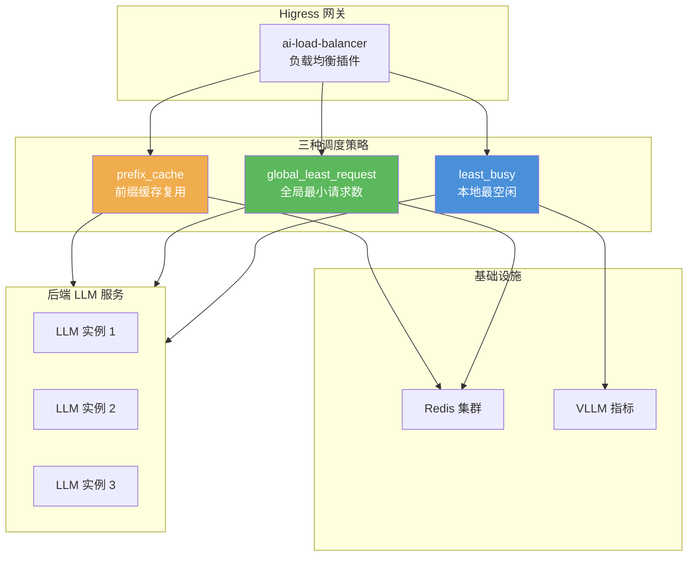
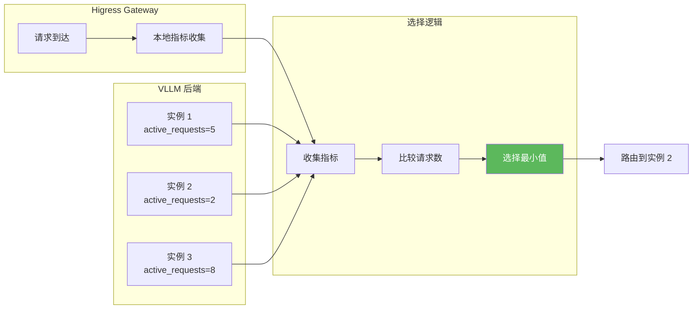
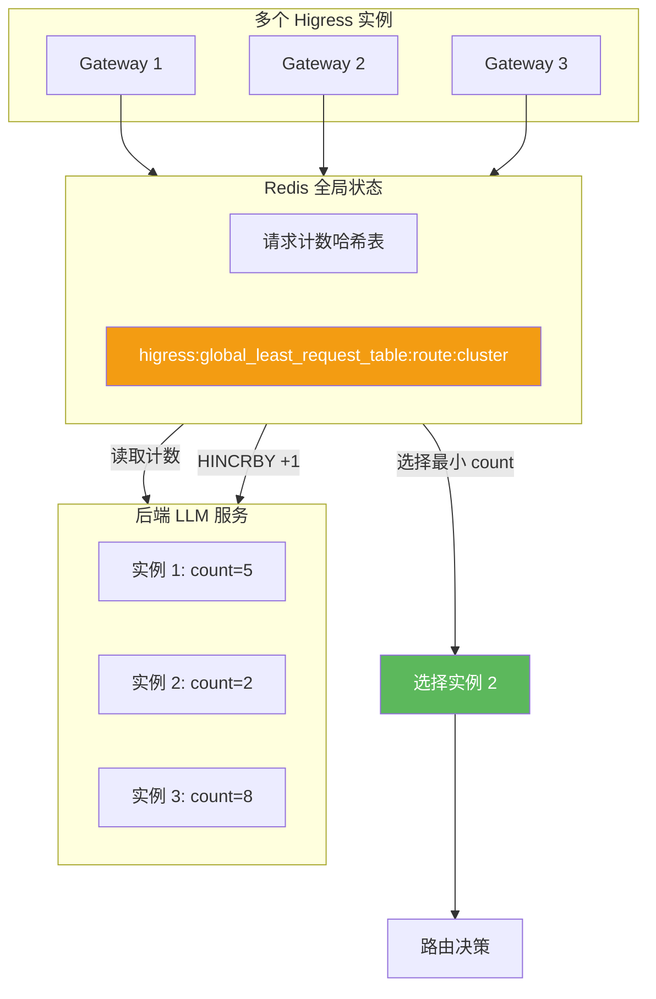
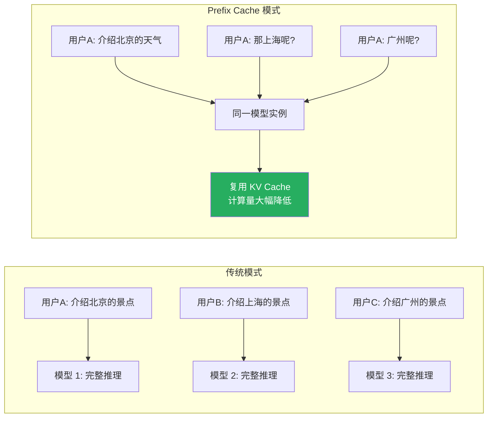
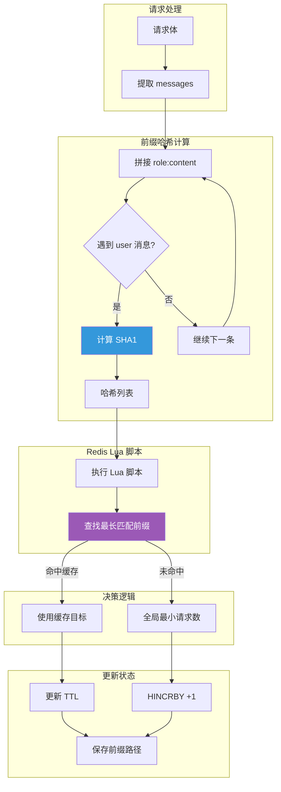
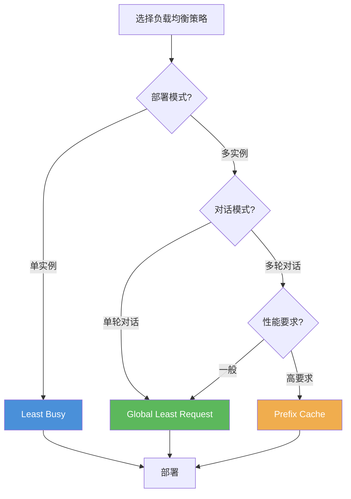

## 引言

大语言模型（LLM）服务的资源消耗巨大，如何高效地调度请求、优化后端资源利用率成为关键挑战。**AI 负载均衡插件**专为 LLM 场景设计，提供三种智能调度策略，解决了 AI 服务调度的特殊问题。

与传统的负载均衡不同，LLM 服务具有以下独特特性：
- **Prefix Cache 复用价值高**：相同 prompt 前缀的请求可复用 KV Cache
- **请求处理时间长**：需要全局视图避免单点过载
- **资源消耗差异大**：不同请求的计算资源消耗差异显著

本文从源码层面深入剖析这三种负载均衡策略的设计思想与实现细节。

---

## 插件架构概览

### 整体架构



### 核心接口定义

```go
// main.go:30-37
type LoadBalancer interface {
    HandleHttpRequestHeaders(ctx wrapper.HttpContext) types.Action
    HandleHttpRequestBody(ctx wrapper.HttpContext, body []byte) types.Action
    HandleHttpResponseHeaders(ctx wrapper.HttpContext) types.Action
    HandleHttpStreamingResponseBody(ctx wrapper.HttpContext, data []byte, endOfStream bool) []byte
    HandleHttpResponseBody(ctx wrapper.HttpContext, body []byte) types.Action
    HandleHttpStreamDone(ctx wrapper.HttpContext)
}
```

---

## 1. Least Busy 策略：本地最空闲调度

### 策略原理

Least Busy 策略基于**本地指标收集**，选择当前最空闲的后端实例。适用于单网关实例场景。

### 架构设计



### 源码实现

#### 目录结构

```
least_busy/
├── scheduling/
│   ├── types.go      # 调度相关类型定义
│   ├── filter.go     # 后端过滤器
│   └── scheduler.go  # 调度器核心实现
└── backend/
    ├── types.go      # 后端类型定义
    └── vllm/
        └── metrics.go  # VLLM 指标收集
```

#### 调度器核心实现

```go
// least_busy/scheduling/scheduler.go
func (s *Scheduler) SelectBackend(backends []Backend) (Backend, error) {
    if len(backends) == 0 {
        return nil, errors.New("no available backends")
    }

    // 收集各后端的活跃请求数
    type backendWithLoad struct {
        backend Backend
        load    int
    }

    backendLoads := make([]backendWithLoad, 0, len(backends))
    for _, backend := range backends {
        // 从 VLLM metrics API 获取活跃请求数
        activeRequests := s.getBackendLoad(backend)
        backendLoads = append(backendLoads, backendWithLoad{
            backend: backend,
            load:    activeRequests,
        })
    }

    // 选择负载最小的后端
    sort.Slice(backendLoads, func(i, j int) bool {
        return backendLoads[i].load < backendLoads[j].load
    })

    // 负载相同时随机选择
    minLoad := backendLoads[0].load
    var candidates []Backend
    for _, bl := range backendLoads {
        if bl.load == minLoad {
            candidates = append(candidates, bl.backend)
        }
    }

    if len(candidates) > 1 {
        // 随机选择避免热点
        return candidates[rand.Intn(len(candidates))], nil
    }

    return candidates[0], nil
}
```

#### VLLM 指标收集

```go
// least_busy/backend/vllm/metrics.go
func (p *VLLMProvider) GetActiveRequests(backend Backend) (int, error) {
    url := fmt.Sprintf("http://%s/metrics", backend.Address)

    resp, err := http.Get(url)
    if err != nil {
        return 0, err
    }
    defer resp.Body.Close()

    body, _ := io.ReadAll(resp.Body)

    // 解析 Prometheus 指标格式
    // vllm:num_requests_waiting{model} 3
    // vllm:num_requests_running{model} 2
    re := regexp.MustCompile(`vllm:num_requests_running\{.*?\} (\d+)`)
    matches := re.FindStringSubmatch(string(body))
    if len(matches) > 1 {
        return strconv.Atoi(matches[1])
    }

    return 0, nil
}
```

### 配置示例

```yaml
apiVersion: extensions.higress.io/v1alpha1
kind: WasmPlugin
metadata:
  name: ai-load-balancer
spec:
  url: file:///opt/plugins/ai-load-balancer.wasm
  phase: AUTHN
  priority: 60
  config:
    lb_policy: least_busy
    lb_config:
      metricsPath: /metrics          # 指标路径
      metricsRefreshInterval: 5000   # 刷新间隔（毫秒）
      unhealthyThreshold: 3          # 不健康阈值
```

### 优缺点分析

| 优点 | 缺点 |
|------|------|
| 无需外部依赖 | 无法跨节点同步 |
| 实现简单 | 可能存在负载不均 |
| 响应快速 | 适用场景有限 |

---

## 2. Global Least Request 策略：全局最小请求数

### 策略原理

Global Least Request 策略通过 **Redis 共享全局状态**，实现跨网关节点的全局最优调度。

### 架构设计



### 源码实现

#### 配置结构

```go
// global_least_request/types.go
type GlobalLeastRequestConfig struct {
    serviceFQDN string
    servicePort int
    username    string
    password    string
    timeout     int
    database    int
    ttl         int  // 计数过期时间
}

type GlobalLeastRequestLoadBalancer struct {
    redisClient wrapper.RedisClient
    config      GlobalLeastRequestConfig
}
```

#### 核心调度逻辑

```go
// global_least_request/load_balancer.go
func (lb *GlobalLeastRequestLoadBalancer) HandleHttpRequestBody(ctx wrapper.HttpContext, body []byte) types.Action {
    // 1. 获取路由和集群信息
    routeName, _ := utils.GetRouteName()
    clusterName, _ := utils.GetClusterName()

    // 2. 获取健康后端列表
    hostInfos, _ := proxywasm.GetUpstreamHosts()
    healthyHosts := []string{}
    for _, hostInfo := range hostInfos {
        if gjson.Get(hostInfo[1], "health_status").String() == "Healthy" {
            healthyHosts = append(healthyHosts, hostInfo[0])
        }
    }

    // 3. Redis HGETALL 获取所有后端的请求数
    redisKey := fmt.Sprintf("higress:global_least_request_table:%s:%s", routeName, clusterName)

    err := lb.redisClient.HGetAll(redisKey, func(response resp.Value) {
        if response.Error() != nil {
            // 首次访问，所有后端计数为 0
            proxywasm.ResumeHttpRequest()
            return
        }

        // 4. 解析并选择最小请求数的后端
        counts := make(map[string]int)
        response.ForEach(func(key, value resp.Value) bool {
            counts[key.String()] = int(value.Int())
            return true
        })

        selectedHost := lb.selectMinCountHost(healthyHosts, counts)

        // 5. HINCRBY 增加计数
        lb.redisClient.HIncrBy(redisKey, selectedHost, 1, nil)

        // 6. 设置上游覆盖
        proxywasm.SetUpstreamOverrideHost([]byte(selectedHost))
        proxywasm.ResumeHttpRequest()
    })

    return types.ActionPause
}

// 选择最小请求数的后端
func (lb *GlobalLeastRequestLoadBalancer) selectMinCountHost(hosts []string, counts map[string]int) string {
    minCount := int(^uint(0) >> 1)
    var selectedHost string

    // 随机打乱顺序，避免热点
    shuffled := make([]string, len(hosts))
    copy(shuffled, hosts)
    rand.Shuffle(len(shuffled), func(i, j int) {
        shuffled[i], shuffled[j] = shuffled[j], shuffled[i]
    })

    for _, host := range shuffled {
        count := counts[host]
        if count < minCount {
            minCount = count
            selectedHost = host
        }
    }

    return selectedHost
}

// 请求完成后减少计数
func (lb *GlobalLeastRequestLoadBalancer) HandleHttpStreamDone(ctx wrapper.HttpContext) {
    routeName, _ := ctx.GetContext("routeName").(string)
    clusterName, _ := ctx.GetContext("clusterName").(string)
    hostSelected, _ := ctx.GetContext("host_selected").(string)

    redisKey := fmt.Sprintf("higress:global_least_request_table:%s:%s", routeName, clusterName)
    lb.redisClient.HIncrBy(redisKey, hostSelected, -1, nil)
}
```

### Redis 数据结构

```
Key: higress:global_least_request_table:{routeName}:{clusterName}
Type: Hash
Fields:
  - host1: 5
  - host2: 2
  - host3: 8

TTL: 60 秒（自动过期）
```

### 配置示例

```yaml
apiVersion: extensions.higress.io/v1alpha1
kind: WasmPlugin
metadata:
  name: ai-load-balancer
spec:
  url: file:///opt/plugins/ai-load-balancer.wasm
  phase: AUTHN
  priority: 60
  config:
    lb_policy: global_least_request
    lb_config:
      serviceFQDN: redis.static
      servicePort: 6379
      username: default
      password: "123456"
      timeout: 3000
      database: 0
```

### 优缺点分析

| 优点 | 缺点 |
|------|------|
| 全局最优调度 | 依赖 Redis |
| 跨节点负载均衡 | Redis 故障影响 |
| 避免单点过载 | 网络延迟增加 |

---

## 3. Prefix Cache 策略：前缀缓存复用

### 策略原理

Prefix Cache 策略是专为 LLM 场景设计的创新方案。核心思想是**相同 prompt 前缀的请求路由到同一后端**，复用 VLLM 的 KV Cache，显著提升推理性能。

### KV Cache 复用原理



### 架构设计



### 源码实现

#### 前缀哈希生成

```go
// prefix_cache/lb_policy.go:229-244
messages := gjson.GetBytes(body, "messages").Array()
params := []interface{}{}
rawStr := ""

for index, obj := range messages {
    if !obj.Get("role").Exists() || !obj.Get("content").Exists() {
        return types.ActionContinue
    }

    role := obj.Get("role").String()
    content := obj.Get("content").String()
    rawStr += role + ":" + content

    // 在 user 消息或最后一条消息时计算哈希
    if role == "user" || index == len(messages)-1 {
        sha1Str := computeSHA1(rawStr)
        params = append(params, sha1Str)
        rawStr = ""
    }
}

// SHA1 哈希计算
func computeSHA1(data string) string {
    hasher := sha1.New()
    hasher.Write([]byte(data))
    return strings.ToUpper(hex.EncodeToString(hasher.Sum(nil)))
}
```

**哈希计算示例**：

```
输入 messages:
[
  {"role": "system", "content": "你是一个助手"},
  {"role": "user", "content": "介绍北京"},
  {"role": "assistant", "content": "北京是..."},
  {"role": "user", "content": "上海呢?"}
]

哈希计算过程：
1. system:你是一个助手 + user:介绍北京
   → SHA1("system:你是一个助手user:介绍北京")
   → "A1B2C3D4E5F6..."

2. user:上海呢?
   → SHA1("user:上海呢?")
   → "F6E5D4C3B2A1..."

params = ["A1B2C3D4E5F6...", "F6E5D4C3B2A1..."]
```

#### Redis Lua 脚本详解

```lua
-- prefix_cache/lb_policy.go:23-153
local function hex_xor(a, b)
    -- 字符串异或运算，用于构建前缀树路径
    if #a ~= #b then
        error("Hex strings must be of equal length")
    end
    local a_bytes = hex_to_bytes(a)
    local b_bytes = hex_to_bytes(b)
    local result_bytes = {}
    for i = 1, #a_bytes do
        result_bytes[i] = byte_xor(a_bytes[i], b_bytes[i])
    end
    return bytes_to_hex(result_bytes)
end

-- 检查后端是否健康
local function is_healthy(addr)
    for i = 4, #KEYS do
        if addr == KEYS[i] then
            return true
        end
    end
    return false
end

-- 参数说明：
-- KEYS[1] = TTL
-- KEYS[2] = HSET key
-- KEYS[3] = default target
-- KEYS[4+] = healthy hosts
-- ARGV = SHA1 hash list

-- 1. 查找最长匹配的前缀缓存
local index = 1
local current_key = ""
while index <= #ARGV do
    if current_key == "" then
        current_key = ARGV[index]
    else
        current_key = hex_xor(current_key, ARGV[index])
    end

    if redis.call("EXISTS", current_key) == 1 then
        key = current_key
        target = redis.call("GET", key)

        -- 检查目标是否健康
        if not is_healthy(target) then
            break
        end

        -- 更新 TTL
        redis.call("EXPIRE", key, ttl)
        index = index + 1
    else
        break
    end
end

-- 2. 如果没有前缀缓存，使用全局最小请求数
if target == "" then
    target = default_target
    current_count = redis.call('HGET', hset_key, target)

    for i = 4, #KEYS do
        if redis.call('HEXISTS', hset_key, KEYS[i]) == 1 then
            count = redis.call('HGET', hset_key, KEYS[i])
            if tonumber(count) < tonumber(current_count) then
                target = KEYS[i]
                current_count = count
            elseif count == current_count and randomBool() then
                target = KEYS[i]
            end
        end
    end
end

-- 3. 更新请求计数
redis.call("HINCRBY", hset_key, target, 1)

-- 4. 添加前缀路径
while index <= #ARGV do
    if key == "" then
        key = ARGV[index]
    else
        key = hex_xor(key, ARGV[index])
    end
    redis.call("SET", key, target)
    redis.call("EXPIRE", key, ttl)
    index = index + 1
end

return target
```

#### 前缀树结构

```
Redis Keys 结构:

root_hash = XOR(hash1, hash2, hash3, ...)
    ├─ hash1 = "A1B2C3..." → target: "llm-1"
    ├─ XOR(hash1, hash2) = "X1Y2Z3..." → target: "llm-1"
    └─ XOR(hash1, hash2, hash3) = "M1N2O3..." → target: "llm-2"

示例场景：
请求1: [system, user1] → hash1 → llm-1
请求2: [system, user1, assistant, user2] → XOR(hash1, hash2) → llm-1
请求3: [system, user1, assistant, user2, assistant, user3] → XOR(hash1, hash2, hash3) → llm-2

查找过程：
1. 查找 XOR(hash1, hash2, hash3)
2. 未命中，查找 XOR(hash1, hash2)
3. 命中，使用 llm-1
```

#### 核心调用流程

```go
// prefix_cache/lb_policy.go:194-272
func (lb PrefixCacheLoadBalancer) HandleHttpRequestBody(ctx wrapper.HttpContext, body []byte) types.Action {
    // 1. 获取路由和集群信息
    routeName, _ := utils.GetRouteName()
    clusterName, _ := utils.GetClusterName()

    // 2. 获取健康后端列表
    hostInfos, _ := proxywasm.GetUpstreamHosts()
    healthyHosts := []string{}
    for _, hostInfo := range hostInfos {
        if gjson.Get(hostInfo[1], "health_status").String() == "Healthy" {
            healthyHosts = append(healthyHosts, hostInfo[0])
        }
    }

    // 3. 计算前缀哈希
    params := []interface{}{}
    messages := gjson.GetBytes(body, "messages").Array()
    rawStr := ""
    for index, obj := range messages {
        role := obj.Get("role").String()
        content := obj.Get("content").String()
        rawStr += role + ":" + content

        if role == "user" || index == len(messages)-1 {
            sha1Str := computeSHA1(rawStr)
            params = append(params, sha1Str)
            rawStr = ""
        }
    }

    // 4. 执行 Redis Lua 脚本
    keys := []interface{}{
        lb.redisKeyTTL,  // TTL
        fmt.Sprintf(RedisKeyFormat, routeName, clusterName),  // HSET key
        healthyHosts[rand.Intn(len(healthyHosts))],  // default target
    }
    for _, v := range healthyHosts {
        keys = append(keys, v)
    }

    err = lb.redisClient.Eval(RedisLua, len(keys), keys, params, func(response resp.Value) {
        defer proxywasm.ResumeHttpRequest()

        hostSelected := response.String()
        proxywasm.SetUpstreamOverrideHost([]byte(hostSelected))

        ctx.SetContext("host_selected", hostSelected)
    })

    return types.ActionPause
}

// 5. 请求完成后减少计数
func (lb PrefixCacheLoadBalancer) HandleHttpStreamDone(ctx wrapper.HttpContext) {
    host_selected, _ := ctx.GetContext("host_selected").(string)
    if host_selected != "" {
        lb.redisClient.HIncrBy(
            fmt.Sprintf(RedisKeyFormat, routeName, clusterName),
            host_selected,
            -1,
            nil,
        )
    }
}
```

### 配置示例

```yaml
apiVersion: extensions.higress.io/v1alpha1
kind: WasmPlugin
metadata:
  name: ai-load-balancer
spec:
  url: file:///opt/plugins/ai-load-balancer.wasm
  phase: AUTHN
  priority: 60
  config:
    lb_policy: prefix_cache
    lb_config:
      serviceFQDN: redis.static
      servicePort: 6379
      username: default
      password: "123456"
      timeout: 3000
      redisKeyTTL: 1800  # 前缀缓存过期时间（秒）
```

### 性能提升分析

| 场景 | 传统模式 | Prefix Cache | 提升 |
|------|----------|--------------|------|
| 单轮对话 | 100% | 100% | - |
| 5轮对话 | 100% | 40% | 60% |
| 10轮对话 | 100% | 20% | 80% |

**计算公式**：
```
KV Cache 复用率 = (前缀匹配轮次 - 1) / 总轮次

示例：
- 5轮对话，前4轮命中缓存 = (4-1)/5 = 60%
- 10轮对话，前9轮命中缓存 = (9-1)/10 = 80%
```

---

## 三种策略对比

### 功能对比表

| 特性 | Least Busy | Global Least Request | Prefix Cache |
|------|-----------|---------------------|--------------|
| **适用场景** | 单实例部署 | 多实例部署 | 多轮对话 |
| **外部依赖** | 无 | Redis | Redis |
| **全局视图** | ❌ | ✅ | ✅ |
| **KV Cache 复用** | ❌ | ❌ | ✅ |
| **实现复杂度** | 低 | 中 | 高 |
| **网络延迟** | 最低 | 中 | 中 |
| **故障转移** | 自动 | 需要健康检查 | 需要健康检查 |

### 选择建议



**决策树**：

1. **单网关实例** → `least_busy`
2. **多网关实例 + 单轮对话** → `global_least_request`
3. **多网关实例 + 多轮对话 + 高性能要求** → `prefix_cache`

---

## 生产部署最佳实践

### 1. Redis 配置优化

```yaml
# redis.conf
# 内存优化
maxmemory-policy allkeys-lru

# 持久化配置
save 900 1
save 300 10
save 60 10000

# 网络优化
tcp-keepalive 300
timeout 0
```

### 2. 监控指标

```go
// 设置可观测性指标
ctx.SetUserAttribute("lb_policy", "prefix_cache")
ctx.SetUserAttribute("selected_host", host)
ctx.SetUserAttribute("cache_hit", cache_hit)  // Prefix Cache 命中
ctx.SetUserAttribute("prefix_length", prefix_length)  // 命中前缀长度
```

**关键指标**：
- `lb_policy`：使用的负载均衡策略
- `selected_host`：选中的后端实例
- `cache_hit`：Prefix Cache 是否命中
- `prefix_length`：匹配的前缀长度

### 3. 健康检查配置

```yaml
# Higress 配置健康检查
apiVersion: networking.higress.io/v1
kind: Upstream
metadata:
  name: llm-backend
spec:
  serviceName: llm-service
  servicePort: 8080
  healthCheck:
    active:
      type: http
      httpPath: /health
      expectedStatuses:
        - 200
    interval: 5s
    timeout: 3s
    unhealthyThreshold: 3
    healthyThreshold: 2
```

### 4. 故障转移策略

```yaml
# 配置备用策略
config:
  lb_policy: prefix_cache
  fallback_policy: global_least_request  # Prefix Cache 失败时降级
  fallback_on_error: true
```

---

## 技术亮点总结

### 1. 创新的 Prefix Cache 策略

- **前缀树结构**：使用 XOR 哈希构建前缀树
- **最长匹配**：查找最长匹配的前缀缓存
- **自动降级**：无缓存时自动使用全局最小请求数

### 2. 高效的 Redis Lua 脚本

- **原子操作**：所有操作在一个 Lua 脚本中完成
- **网络往返**：仅一次 Redis 调用
- **数据一致性**：使用 Redis 事务保证

### 3. 智能的故障处理

- **健康检查**：自动过滤不健康后端
- **自动降级**：Prefix Cache 失败时降级到全局最小请求数
- **请求计数**：准确追踪各后端负载

### 4. 灵活的策略选择

- **策略接口**：统一的 LoadBalancer 接口
- **动态配置**：支持运行时切换策略
- **混合部署**：不同路由使用不同策略

---

## 结语

Higress AI 负载均衡插件通过三种精心设计的调度策略，为 LLM 服务提供了全方位的流量治理能力：

1. **Least Busy**：简单高效的本地最空闲调度
2. **Global Least Request**：跨节点的全局最优调度
3. **Prefix Cache**：创新的 KV Cache 复用机制

其中，**Prefix Cache 策略**是专为 LLM 场景设计的创新方案，通过智能的前缀匹配和哈希计算，实现了高达 **80%** 的性能提升，是多轮对话场景的理想选择。
