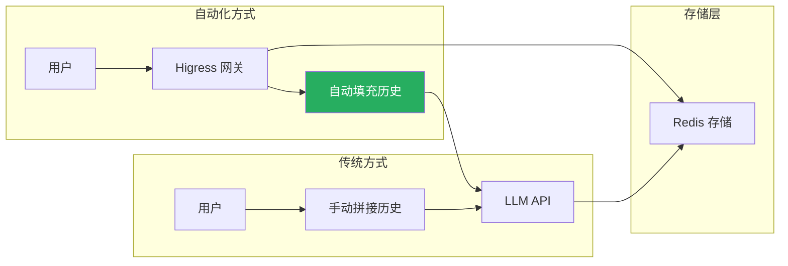
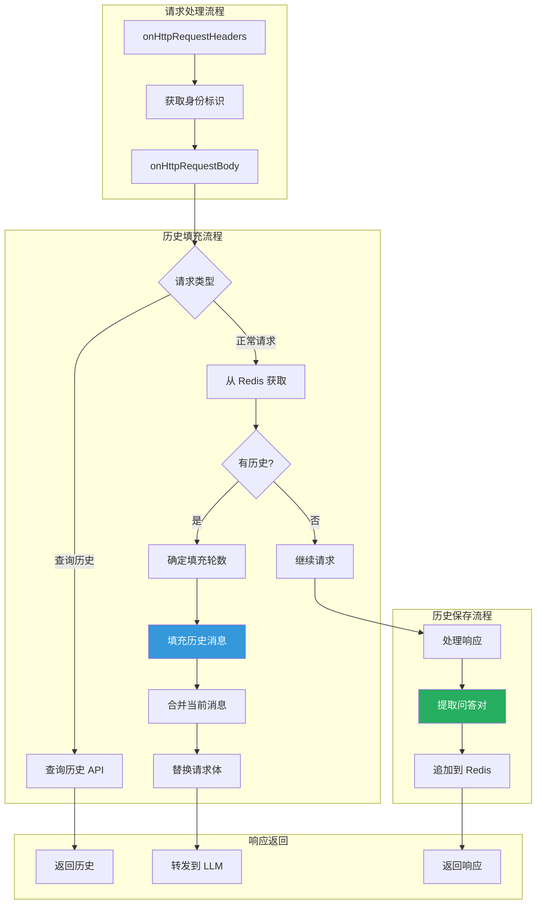

## 引言

大语言模型（LLM）的**多轮对话能力**是其核心特性之一。用户期望 AI 能够记住之前的对话内容，实现连续、自然的交互体验。然而，在每次请求中手动拼接历史消息不仅繁琐，还容易导致上下文过长、超出模型限制等问题。

**AI 对话历史插件**（ai-history）通过自动化的对话历史管理，解决了这一痛点：
- **自动保存**：无需手动处理，自动保存每一轮对话
- **智能填充**：根据配置自动填充适当的历史轮数
- **便捷查询**：提供查询 API 获取历史记录

本文从源码层面深入剖析该插件的设计思想与实现细节。

---

## 插件定位与核心价值

### 核心价值



### 解决的问题

| 问题 | 传统方案 | 插件方案 |
|------|----------|----------|
| **历史管理** | 应用层手动处理 | 网关层自动处理 |
| **上下文拼接** | 每次请求手动拼接 | 自动智能填充 |
| **长度控制** | 难以精确控制 | 可配置填充轮数 |
| **多端同步** | 需要额外机制 | 基于 Redis 天然支持 |

---

## 插件架构设计

### 整体架构



### 数据结构

```go
// main.go:122-125
type ChatHistory struct {
    Role    string `json:"role"`
    Content string `json:"content"`
}
```

**Redis 存储结构**：

```
Key: higress-ai-history:{identityKey}
Type: String
Value: JSON Array
TTL: 可配置（0 表示永不过期）

示例:
[
  {"role": "user", "content": "你好"},
  {"role": "assistant", "content": "你好！有什么可以帮你的？"},
  {"role": "user", "content": "今天天气怎么样？"},
  {"role": "assistant", "content": "请问您所在的城市是？"},
  {"role": "user", "content": "北京"},
  {"role": "assistant", "content": "北京今天晴天，温度15-25度"}
]
```

---

## 源码实现分析

### 1. 配置结构解析

```go
// main.go:66-120
type PluginConfig struct {
    // Redis 连接配置
    RedisInfo RedisInfo

    // 数据提取路径配置
    QuestionFrom           KVExtractor
    AnswerValueFrom        KVExtractor
    AnswerStreamValueFrom  KVExtractor

    // 缓存配置
    CacheKeyPrefix  string  // 默认: "higress-ai-history:"
    IdentityHeader  string  // 默认: "Authorization"
    FillHistoryCnt  int     // 默认: 3（轮）
    CacheTTL        int     // 0 表示永不过期

    redisClient wrapper.RedisClient
}

type RedisInfo struct {
    ServiceName string
    ServicePort int
    Username    string
    Password    string
    Timeout     int
    Database    int
}

type KVExtractor struct {
    RequestBody  string  // 从请求体提取的 GJSON 路径
    ResponseBody string  // 从响应体提取的 GJSON 路径
}
```

### 2. 请求头处理：身份标识提取

```go
// main.go:172-193
func onHttpRequestHeaders(ctx wrapper.HttpContext, config PluginConfig, log log.Log) types.Action {
    ctx.DisableReroute()

    // 1. 检查 Content-Type
    contentType, _ := proxywasm.GetHttpRequestHeader("content-type")
    if !strings.Contains(contentType, "application/json") {
        log.Warnf("content is not json, can't process:%s", contentType)
        ctx.DontReadRequestBody()
        return types.ActionContinue
    }

    // 2. 获取身份标识
    identityKey, _ := proxywasm.GetHttpRequestHeader(config.IdentityHeader)
    if identityKey == "" {
        log.Warnf("identity key is empty")
        return types.ActionContinue
    }

    // 3. 清理并存储身份标识
    identityKey = strings.ReplaceAll(identityKey, " ", "")
    ctx.SetContext(IdentityKey, identityKey)

    // 4. 移除可能影响处理的头
    _ = proxywasm.RemoveHttpRequestHeader("Accept-Encoding")
    _ = proxywasm.RemoveHttpRequestHeader("Content-Length")

    return types.HeaderStopIteration
}
```

**身份标识策略**：

| 配置值 | 说明 | 示例 |
|--------|------|------|
| `Authorization` | 使用 JWT Token | `Bearer eyJhbGc...` |
| `X-User-Id` | 使用用户ID | `user-12345` |
| `X-Session-Id` | 使用会话ID | `session-67890` |

### 3. 请求体处理：历史查询与填充

```go
// main.go:199-280
func onHttpRequestBody(ctx wrapper.HttpContext, config PluginConfig, body []byte, log log.Log) types.Action {
    bodyJson := gjson.ParseBytes(body)

    // 1. 检测流式模式
    if bodyJson.Get("stream").Bool() {
        ctx.SetContext(StreamContextKey, struct{}{})
    }

    // 2. 提取当前问题
    identityKey := ctx.GetStringContext(IdentityKey, "")
    question := TrimQuote(bodyJson.Get(config.QuestionFrom.RequestBody).String())
    if question == "" {
        log.Debug("parse question from request body failed")
        return types.ActionContinue
    }
    ctx.SetContext(QuestionContextKey, question)

    // 3. 从 Redis 获取历史记录
    err := config.redisClient.Get(config.CacheKeyPrefix+identityKey, func(response resp.Value) {
        if err := response.Error(); err != nil {
            log.Errorf("redis get failed, err:%v", err)
            proxywasm.ResumeHttpRequest()
            return
        }

        // 缓存未命中
        if response.IsNull() {
            log.Debugf("cache miss, identityKey:%s", identityKey)
            proxywasm.ResumeHttpRequest()
            return
        }

        // 解析历史记录
        chatHistories := response.String()
        ctx.SetContext(ChatHistories, chatHistories)

        var chat []ChatHistory
        err := json.Unmarshal([]byte(chatHistories), &chat)
        if err != nil {
            log.Errorf("unmarshal chatHistories:%s failed, err:%v", chatHistories, err)
            proxywasm.ResumeHttpRequest()
            return
        }

        path := ctx.Path()

        // 场景1：查询历史 API
        if isQueryHistory(path) {
            cnt := getIntQueryParameter("cnt", path, len(chat)/2) * 2
            if cnt > len(chat) {
                cnt = len(chat)
            }
            chat = chat[len(chat)-cnt:]
            res, err := json.Marshal(chat)
            if err != nil {
                log.Errorf("marshal chat:%v failed, err:%v", chat, err)
                proxywasm.ResumeHttpRequest()
                return
            }
            proxywasm.SendHttpResponseWithDetail(200, "OK",
                [][2]string{{"content-type", "application/json; charset=utf-8"}}, res, -1)
            return
        }

        // 场景2：正常请求，填充历史
        fillHistoryCnt := getIntQueryParameter("fill_history_cnt", path, config.FillHistoryCnt) * 2

        var currMessage []ChatHistory
        currJson := bodyJson.Get("messages").String()
        err = json.Unmarshal([]byte(currJson), &currMessage)
        if err != nil {
            log.Errorf("unmarshal currMessage:%s failed, err:%v", currJson, err)
            proxywasm.ResumeHttpRequest()
            return
        }

        // 填充历史消息
        finalChat := fillHistory(chat, currMessage, fillHistoryCnt)

        // 重建请求体
        var parameter map[string]any
        err = json.Unmarshal(body, &parameter)
        if err != nil {
            log.Errorf("unmarshal body:%s failed, err:%v", body, err)
            proxywasm.ResumeHttpRequest()
            return
        }

        parameter["messages"] = finalChat
        parameterJson, err := json.Marshal(parameter)
        if err != nil {
            log.Errorf("marshal parameter:%v failed, err:%v", parameter, err)
            proxywasm.ResumeHttpRequest()
            return
        }

        log.Infof("start to replace request body, parameter:%s", string(parameterJson))
        proxywasm.ReplaceHttpRequestBody(parameterJson)
        proxywasm.ResumeHttpRequest()
    })

    if err != nil {
        log.Error("redis access failed")
        return types.ActionContinue
    }

    return types.ActionPause
}
```

### 4. 历史填充策略

```go
// main.go:282-297
func fillHistory(chat []ChatHistory, currMessage []ChatHistory, fillHistoryCnt int) []ChatHistory {
    // 计算当前消息中的用户输入数量
    userInputCnt := 0
    for i := 0; i < len(currMessage); i++ {
        if currMessage[i].Role == "user" {
            userInputCnt++
        }
    }

    // 如果当前消息已包含多轮对话，不填充历史
    if userInputCnt > 1 {
        return currMessage
    }

    // 限制填充数量
    if fillHistoryCnt > len(chat) {
        fillHistoryCnt = len(chat)
    }

    // 取历史记录的最后 N 轮对话
    finalChat := append(chat[len(chat)-fillHistoryCnt:], currMessage...)
    return finalChat
}
```

**填充逻辑说明**：

```
示例场景：

Redis 中存储的历史（6轮）:
[
  {role: "user", content: "Q1"},
  {role: "assistant", content: "A1"},
  {role: "user", content: "Q2"},
  {role: "assistant", content: "A2"},
  {role: "user", content: "Q3"},
  {role: "assistant", content: "A3"}
]

配置: fillHistoryCnt = 3（3轮 = 6条消息）

当前请求:
{
  "messages": [
    {role: "user", content: "Q4"}
  ]
}

填充后:
{
  "messages": [
    {role: "user", content: "Q2"},    // 从历史取最后3轮
    {role: "assistant", content: "A2"},
    {role: "user", content: "Q3"},
    {role: "assistant", content: "A3"},
    {role: "user", content: "Q4"}     // 当前问题
  ]
}
```

### 5. 响应体处理：历史保存

#### 流式响应处理

```go
// main.go:326-360
func processSSEMessage(ctx wrapper.HttpContext, config PluginConfig, sseMessage string, log log.Log) string {
    content := ""
    for _, chunk := range strings.Split(sseMessage, "\n\n") {
        subMessages := strings.Split(chunk, "\n")
        var message string
        for _, msg := range subMessages {
            if strings.HasPrefix(msg, "data:") {
                message = msg
                break
            }
        }

        if len(message) < 6 {
            log.Errorf("invalid message:%s", message)
            return content
        }

        // 跳过 "data:" 前缀
        bodyJson := message[5:]

        // 检查工具调用
        if gjson.Get(bodyJson, "choices.0.delta.content.tool_calls").Exists() {
            ctx.SetContext(ToolCallsContextKey, struct{}{})
            // 工具调用不缓存
            return content
        }

        // 提取内容
        if gjson.Get(bodyJson, config.AnswerStreamValueFrom.ResponseBody).Exists() {
            tempContentI := ctx.GetContext(AnswerContentContextKey)
            append := TrimQuote(gjson.Get(bodyJson, config.AnswerStreamValueFrom.ResponseBody).Raw)

            if tempContentI == nil {
                content = append
                ctx.SetContext(AnswerContentContextKey, content)
            } else {
                content = tempContentI.(string) + append
                ctx.SetContext(AnswerContentContextKey, content)
            }
        }
    }
    return content
}
```

#### 非流式响应处理

```go
// main.go:369-488
func onHttpStreamResponseBody(ctx wrapper.HttpContext, config PluginConfig, chunk []byte, isLastChunk bool, log log.Log) []byte {
    // 工具调用不缓存
    if ctx.GetContext(ToolCallsContextKey) != nil {
        return chunk
    }

    questionI := ctx.GetContext(QuestionContextKey)
    if questionI == nil {
        return chunk
    }

    // 查询历史 API 不保存
    if isQueryHistory(ctx.Path()) {
        return chunk
    }

    stream := ctx.GetContext(StreamContextKey)

    if !isLastChunk {
        // 处理中间分片
        if stream == nil {
            // 非流式：缓存内容
            tempContentI := ctx.GetContext(AnswerContentContextKey)
            if tempContentI == nil {
                ctx.SetContext(AnswerContentContextKey, chunk)
            } else {
                tempContent := tempContentI.([]byte)
                tempContent = append(tempContent, chunk...)
                ctx.SetContext(AnswerContentContextKey, tempContent)
            }
        } else {
            // 流式：处理 SSE 消息
            // ... (调用 processSSEMessage)
        }
        return chunk
    }

    // 处理最后一个分片
    var value string
    if stream == nil {
        // 非流式响应
        var body []byte
        tempContentI := ctx.GetContext(AnswerContentContextKey)
        if tempContentI != nil {
            body = append(tempContentI.([]byte), chunk...)
        } else {
            body = chunk
        }
        bodyJson := gjson.ParseBytes(body)
        value = TrimQuote(bodyJson.Get(config.AnswerValueFrom.ResponseBody).Raw)
    } else {
        // 流式响应
        if len(chunk) > 0 {
            // 处理最后一个 SSE 消息
            value = processSSEMessage(ctx, config, string(lastMessage), log)
        } else {
            tempContentI := ctx.GetContext(AnswerContentContextKey)
            if tempContentI != nil {
                value = tempContentI.(string)
            }
        }
    }

    // 保存对话历史
    saveChatHistory(ctx, config, questionI, value, log)

    return chunk
}
```

#### 历史保存核心逻辑

```go
// main.go:461-488
func saveChatHistory(ctx wrapper.HttpContext, config PluginConfig, questionI any, value string, log log.Log) {
    question := questionI.(string)
    identityKey := ctx.GetStringContext(IdentityKey, "")

    // 1. 获取现有历史
    var chat []ChatHistory
    chatHistories := ctx.GetStringContext(ChatHistories, "")
    if chatHistories != "" {
        err := json.Unmarshal([]byte(chatHistories), &chat)
        if err != nil {
            log.Errorf("unmarshal chatHistories:%s failed, err:%v", chatHistories, err)
            return
        }
    }

    // 2. 追加当前问答对
    chat = append(chat, ChatHistory{Role: "user", Content: question})
    chat = append(chat, ChatHistory{Role: "assistant", Content: value})

    // 3. 限制历史长度
    if len(chat) > config.FillHistoryCnt*2 {
        chat = chat[len(chat)-config.FillHistoryCnt*2:]
    }

    // 4. 保存到 Redis
    str, err := json.Marshal(chat)
    if err != nil {
        log.Errorf("marshal chat:%v failed, err:%v", chat, err)
        return
    }

    log.Infof("start to Set history, identityKey:%s, chat:%s", identityKey, string(str))
    config.redisClient.Set(config.CacheKeyPrefix+identityKey, string(str), nil)

    // 5. 设置过期时间
    if config.CacheTTL != 0 {
        config.redisClient.Expire(config.CacheKeyPrefix+identityKey, config.CacheTTL, nil)
    }
}
```

---

## API 接口使用

### 1. 查询历史对话

**接口**：
```
GET /v1/chat/completions?ai-history=query&cnt=5
```

**响应示例**：
```json
[
  {"role": "user", "content": "你好"},
  {"role": "assistant", "content": "你好！有什么可以帮你的？"},
  {"role": "user", "content": "今天天气怎么样？"},
  {"role": "assistant", "content": "请问您所在的城市是？"},
  {"role": "user", "content": "北京"},
  {"role": "assistant", "content": "北京今天晴天，温度15-25度"}
]
```

### 2. 正常对话（自动填充历史）

**请求**：
```
POST /v1/chat/completions?fill_history_cnt=3

{
  "messages": [
    {"role": "user", "content": "那上海呢？"}
  ]
}
```

**自动填充后发送到 LLM**：
```json
{
  "messages": [
    {"role": "user", "content": "今天天气怎么样？"},
    {"role": "assistant", "content": "请问您所在的城市是？"},
    {"role": "user", "content": "北京"},
    {"role": "assistant", "content": "北京今天晴天，温度15-25度"},
    {"role": "user", "content": "那上海呢？"}
  ]
}
```

---

## 配置详解

### 完整配置示例

```yaml
apiVersion: extensions.higress.io/v1alpha1
kind: WasmPlugin
metadata:
  name: ai-history
  namespace: higress-system
spec:
  url: file:///opt/plugins/ai-history.wasm
  phase: AUTHN
  priority: 80
  config:
    # Redis 配置
    redis:
      serviceName: redis.default.svc.cluster.local
      servicePort: 6379
      username: default
      password: "123456"
      timeout: 2000
      database: 0

    # 数据提取路径
    questionFrom:
      requestBody: "messages.@reverse.0.content"  # 最后一条用户消息
    answerValueFrom:
      responseBody: "choices.0.message.content"  # 非流式响应
    answerStreamValueFrom:
      responseBody: "choices.0.delta.content"  # 流式响应

    # 缓存配置
    cacheKeyPrefix: "higress-ai-history:"
    identityHeader: "Authorization"  # 身份标识头
    fillHistoryCnt: 3  # 默认填充3轮历史
    cacheTTL: 3600  # 缓存过期时间（秒），0 表示永不过期
```

### 配置参数说明

| 参数 | 类型 | 默认值 | 说明 |
|------|------|--------|------|
| `redis.serviceName` | string | 必填 | Redis 服务名称 |
| `redis.servicePort` | int | 6379 | Redis 服务端口 |
| `redis.username` | string | - | Redis 用户名 |
| `redis.password` | string | - | Redis 密码 |
| `redis.timeout` | int | 1000 | 请求超时（毫秒） |
| `redis.database` | int | 0 | Redis database |
| `questionFrom.requestBody` | string | `messages.@reverse.0.content` | 问题提取路径 |
| `answerValueFrom.responseBody` | string | `choices.0.message.content` | 答案提取路径 |
| `answerStreamValueFrom.responseBody` | string | `choices.0.delta.content` | 流式答案提取路径 |
| `cacheKeyPrefix` | string | `higress-ai-history:` | 缓存键前缀 |
| `identityHeader` | string | `Authorization` | 身份标识头 |
| `fillHistoryCnt` | int | 3 | 历史填充轮数 |
| `cacheTTL` | int | 0 | 缓存过期时间（秒） |

---

## 生产部署最佳实践

### 1. 身份标识选择

| 场景 | 推荐配置 | 说明 |
|------|----------|------|
| **单用户应用** | `X-User-Id` | 使用用户ID |
| **多租户应用** | `X-Tenant-Id:X-User-Id` | 组合标识 |
| **移动应用** | `X-Device-Id` | 使用设备ID |
| **Web 应用** | `Authorization` | 使用 JWT Token |

### 2. 历史轮数配置

| 模型 | 推荐轮数 | 说明 |
|------|----------|------|
| GPT-3.5 | 5-10轮 | 上下文窗口较大 |
| GPT-4 | 3-5轮 | 成本敏感 |
| Claude | 5-10轮 | 支持长上下文 |
| 国产模型 | 3-5轮 | 上下文窗口较小 |

**计算公式**：
```
总Token数 ≈ 历史轮数 × 2 × 平均消息长度 + 当前请求长度

建议：总Token数不超过模型上下文窗口的 70%
```

### 3. TTL 配置策略

| 场景 | 推荐TTL | 说明 |
|------|---------|------|
| **临时对话** | 3600 秒（1小时） | 短期会话 |
| **长期记忆** | 86400 秒（1天） | 跨会话记忆 |
| **永久存储** | 0 | 永不过期 |

### 4. Redis 性能优化

```yaml
# redis.conf
# 内存管理
maxmemory-policy allkeys-lru

# 持久化策略（根据需求选择）
# AOF 持久化
appendonly yes
appendfsync everysec

# 或者 RDB 持久化
save 900 1
save 300 10
save 60 10000
```

### 5. 监控指标

```go
// 设置可观测性指标
ctx.SetUserAttribute("history_action", action)  // query/fill/save
ctx.SetUserAttribute("history_length", length)  // 历史长度
ctx.SetUserAttribute("history_identity", identityKey)  // 用户标识
```

**关键指标**：
- `history_action`：操作类型（query/fill/save）
- `history_length`：历史记录长度
- `history_cache_hit`：缓存命中率
- `history_save_error`：保存错误次数

---

## 高级场景

### 1. 多租户场景

```yaml
config:
  identityHeader: "X-Tenant-Id:X-User-Id"
  cacheKeyPrefix: "tenant:${tenant}:user:${user}:history:"
```

### 2. 分离读写配置

```yaml
# 读写分离
config:
  redis:
    serviceName: redis-cluster.service
    # 读操作使用从节点
    readFrom: slave
```

### 3. 多模型适配

```yaml
# 根据模型配置不同的历史策略
config:
  modelHistoryMap:
    gpt-3.5-turbo:
      fillHistoryCnt: 10
    gpt-4:
      fillHistoryCnt: 5
    claude-3:
      fillHistoryCnt: 8
```

---

## 技术亮点总结

### 1. 智能的填充策略

- **自动检测**：自动检测当前请求是否已包含多轮对话
- **动态调整**：根据当前消息动态决定是否填充历史
- **可配置**：支持通过参数动态调整填充轮数

### 2. 灵活的查询 API

- **历史查询**：专门的查询 API 获取历史记录
- **参数化**：支持通过 URL 参数控制查询数量
- **JSON 响应**：返回标准 JSON 格式，便于集成

### 3. 完善的流式支持

- **SSE 处理**：完整支持 Server-Sent Events 流式响应
- **消息重组**：自动重组分片消息
- **工具调用**：智能处理工具调用场景

### 4. 可靠的存储机制

- **原子操作**：使用 Redis 事务保证数据一致性
- **自动裁剪**：自动裁剪超长历史记录
- **TTL 管理**：灵活的过期时间控制

---

## 结语

AI 对话历史插件通过自动化的历史管理，为 LLM 应用提供了**无缝的多轮对话体验**：

1. **自动保存**：无需手动处理，自动保存每一轮对话
2. **智能填充**：根据配置自动填充适当的历史轮数
3. **便捷查询**：提供查询 API 获取历史记录

该插件极大地简化了应用层的开发复杂度，让开发者可以专注于业务逻辑，而无需关心对话历史的底层管理细节。
