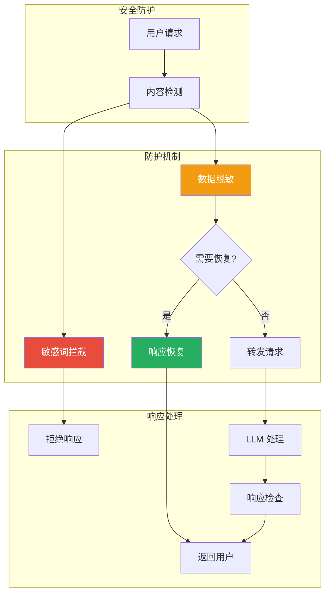
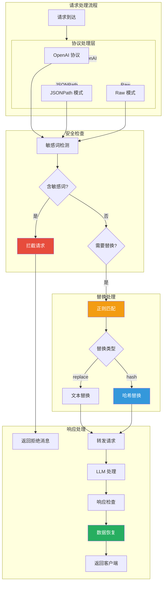

## 引言

在企业级 AI 应用中，**数据安全与内容合规**是不可忽视的关键问题。用户输入可能包含敏感信息（手机号、身份证、银行卡等），AI 生成的内容可能存在违规风险。

**AI 数据脱敏插件**（ai-data-masking）作为 Rust 实现的安全插件，提供了：
- **敏感词拦截**：内置+自定义敏感词库
- **数据脱敏**：支持替换和哈希两种模式
- **内容审核**：集成 Grok 模式进行模式匹配

本文从源码层面深入剖析该插件的设计思想与实现细节。

---

## 插件定位与核心价值

### 核心价值



### 解决的问题

| 问题 | 传统方案 | 插件方案 |
|------|----------|----------|
| **敏感信息泄露** | 应用层手动处理 | 网关层自动脱敏 |
| **违规内容** | 依赖 LLM 自我约束 | 主动拦截和替换 |
| **性能开销** | 每次请求额外处理 | WASM 近原生性能 |
| **配置复杂** | 硬编码规则 | 灵活的配置模式 |

---

## 插件架构设计

### 整体架构



### 目录结构

```
ai-data-masking/
├── src/
│   ├── lib.rs              # 主入口文件
│   ├── ai_data_masking.rs # 主要逻辑
│   ├── deny_word.rs        # 敏感词处理
│   ├── msg_win_openai.rs   # OpenAI 消息处理
│   ├── msg_window.rs       # 消息窗口管理
│   └── number_merge.rs     # 数字合并
├── README.md               # 中文文档
└── README_EN.md            # 英文文档
```

---

## 源码实现分析

### 1. 配置结构定义

```rust
// ai_data_masking.rs:173-195
#[derive(Default, Debug, Deserialize, Clone)]
pub struct AiDataMaskingConfig {
    // 协议拦截配置
    #[serde(default = "default_deny_openai")]
    deny_openai: bool,              // 拦截 OpenAI 协议

    #[serde(default = "default_deny_raw")]
    deny_raw: bool,                 // 拦截原始数据

    #[serde(default, deserialize_with = "deserialize_jsonpath")]
    deny_jsonpath: Vec<JsonPath>,   // JSONPath 拦截规则

    // 敏感词配置
    #[serde(default = "default_system_deny")]
    system_deny: bool,              // 使用系统内置规则

    #[serde(default, deserialize_with = "deserialize_denyword")]
    deny_words: DenyWord,           // 自定义敏感词列表

    // 拦截响应配置
    #[serde(default = "default_deny_code")]
    deny_code: u16,                 // 拦截状态码（默认 200）

    #[serde(default = "default_deny_message")]
    deny_message: String,           // 拦截消息（JSON 格式）

    #[serde(default = "default_deny_raw_message")]
    deny_raw_message: String,      // 拦截消息（Raw 格式）

    #[serde(default = "default_deny_content_type")]
    deny_content_type: String,     // 响应 Content-Type

    // 替换规则
    #[serde(default)]
    replace_roles: Vec<Rule>,       // 替换规则列表
}
```

### 2. 替换规则定义

```rust
// ai_data_masking.rs:141-151
#[derive(Debug, Deserialize, Clone)]
struct Rule {
    #[serde(deserialize_with = "deserialize_regexp")]
    regex: Regex,                   // 正则表达式（支持 Grok 模式）

    #[serde(deserialize_with = "deserialize_type")]
    type_: Type,                    // 替换类型：replace 或 hash

    #[serde(default)]
    restore: bool,                 // 是否在响应中恢复原数据

    #[serde(default)]
    value: String,                 // 替换值（replace 类型使用）
}

#[derive(Debug, Clone, PartialEq, Eq)]
enum Type {
    Replace,  // 直接替换为指定值
    Hash,     // 哈希替换（可恢复）
}
```

### 3. Grok 模式支持

#### Grok 模式解析

```rust
// ai_data_masking.rs:45
const GROK_PATTERN: &str = r"%\{(?<name>(?<pattern>[A-z0-9]+)(?::(?<alias>[A-z0-9_:;\/\s\.]+))?)\}";
```

**内置 Grok 模式示例**：

| Grok 模式 | 说明 | 示例匹配 |
|-----------|------|----------|
| `%{EMAIL:email}` | 邮箱地址 | `user@example.com` |
| `%{PHONE:phone}` | 电话号码 | `13812345678` |
| `%{IP:ip}` | IP 地址 | `192.168.1.1` |
| `%{CREDIT_CARD:cc}` | 信用卡号 | `1234567890123456` |
| `%{IDCARD:idcard}` | 身份证号 | `110101199001011234` |

#### 正则表达式反序列化

```rust
// ai_data_masking.rs:72-89
fn deserialize_regexp<'de, D>(deserializer: D) -> Result<Regex, D::Error>
where
    D: Deserializer<'de>,
{
    let value: Value = Deserialize::deserialize(deserializer)?;
    if let Some(pattern) = value.as_str() {
        // 尝试 Grok 模式转换
        let (p, _) = SYSTEM.grok_to_pattern(pattern);
        if let Ok(reg) = Regex::new(&p) {
            return Ok(reg);
        }
        // 降级为普通正则
        if let Ok(reg) = Regex::new(pattern) {
            return Ok(reg);
        }
        return Err(Error::custom(format!("regexp error field {}", pattern)));
    }
    Err(Error::custom("regexp error not string".to_string()))
}
```

### 4. 敏感词检测

```rust
// ai_data_masking.rs:197-200
impl AiDataMaskingConfig {
    fn check_message(&self, message: &str, log: &Log) -> bool {
        if let Some(word) = self.deny_words.check(message) {
            log.warn(&format!(
                "Message: '{}', contains deny_word: '{}', deny",
                message, word
            ));
            return true;  // 检测到敏感词
        }
        false  // 未检测到敏感词
    }
}
```

**敏感词数据结构**：

```rust
// deny_word.rs
pub struct DenyWord {
    exact_words: HashSet<String>,     // 精确匹配词
    regex_words: Vec<Regex>,          // 正则匹配词
}

impl DenyWord {
    pub fn check(&self, message: &str) -> Option<String> {
        // 1. 精确匹配检查
        for word in &self.exact_words {
            if message.contains(word) {
                return Some(word.clone());
            }
        }

        // 2. 正则匹配检查
        for regex in &self.regex_words {
            if regex.is_match(message) {
                return regex.as_str().to_string();
            }
        }

        None  // 未匹配
    }
}
```

### 5. 数据替换流程

```rust
fn replace_content(
    content: &str,
    rules: &[Rule],
    mask_map: &mut HashMap<String, Option<String>>,
) -> String {
    let mut result = content.to_string();

    for rule in rules {
        result = rule.regex.replace_all(&result, |caps: &regex::Captures| {
            let matched = caps.get(0).map(|m| m.as_str()).unwrap_or("");

            match rule.type_ {
                Type::Replace => {
                    // 直接替换为指定值
                    rule.value.clone()
                }
                Type::Hash => {
                    // 哈希替换，存储映射关系用于恢复
                    let hash = format!("{:x}", md5::compute(matched.as_bytes()));
                    mask_map.insert(hash.clone(), Some(matched.to_string()));
                    format!("{{{{MASK_{}}}}}", &hash[..8].to_uppercase())
                }
            }
        }).to_string();
    }

    result
}
```

**替换示例**：

```rust
// 配置
rules: [
  {
    regex: "%{EMAIL:email}",
    type: "replace",
    value: "***@***.***"
  },
  {
    regex: "\\d{11}",  // 手机号
    type: "hash",
    restore: true
  }
]

// 处理流程
输入: "联系我 13812345678 或 user@example.com"

1. 匹配邮箱: user@example.com
   → 替换为: ***@***.***

2. 匹配手机号: 13812345678
   → 计算哈希: a1b2c3d4...
   → 替换为: {{MASK_A1B2C3D4}}
   → 保存映射: a1b2c3d4... → "13812345678"

输出: "联系我 {{MASK_A1B2C3D4}} 或 ***@***.***"
```

### 6. 响应数据恢复

```rust
fn restore_content(
    content: &str,
    mask_map: &HashMap<String, Option<String>>,
) -> String {
    let mut result = content.to_string();

    for (hash, original) in mask_map {
        if let Some(value) = original {
            // 恢复原始数据
            let mask_pattern = format!("{{{{MASK_{}}}}}", &hash[..8].to_uppercase());
            result = result.replace(&mask_pattern, value);
        }
    }

    result
}
```

**恢复示例**：

```
发送到 LLM:
"联系我 {{MASK_A1B2C3D4}} 或 ***@***.***"

LLM 响应:
"好的，我会联系 {{MASK_A1B2C3D4}} 并抄送 ***@***.***"

恢复后返回给用户:
"好的，我会联系 13812345678 并抄送 user@example.com"
```

### 7. 消息窗口处理（OpenAI 协议）

```rust
// msg_win_openai.rs
pub struct MsgWindow {
    messages: VecDeque<Value>,  // 消息窗口
    max_count: usize,            // 最大消息数量
}

impl MsgWindow {
    pub fn add_message(&mut self, message: Value) {
        self.messages.push_back(message);

        // 限制窗口大小
        while self.messages.len() > self.max_count {
            self.messages.pop_front();
        }
    }

    pub fn check_and_mask(&mut self, config: &AiDataMaskingConfig) -> Option<String> {
        for message in &self.messages {
            if let Some(content) = message.get("content") {
                if let Some(content_str) = content.as_str() {
                    // 检测敏感词
                    if config.check_message(content_str, &self.log) {
                        return Some(content_str.clone());
                    }
                }
            }
        }
        None
    }
}
```

---

## 配置详解

### 完整配置示例

```yaml
apiVersion: extensions.higress.io/v1alpha1
kind: WasmPlugin
metadata:
  name: ai-data-masking
  namespace: higress-system
spec:
  url: file:///opt/plugins/ai-data-masking.wasm
  phase: AUTHN
  priority: 90
  config:
    # 协议拦截配置
    deny_openai: true          # 拦截 OpenAI 协议
    deny_raw: false           # 不拦截原始数据
    system_deny: false         # 不使用系统内置规则

    # JSONPath 拦截规则
    deny_jsonpath:
      - "$.messages[*].content"     # 检查所有消息内容
      - "$.user.prompt"             # 检查用户提示词

    # 拦截响应配置
    deny_code: 200                       # HTTP 状态码
    deny_message: "提问中包含敏感词，已被屏蔽"  # JSON 响应
    deny_raw_message: "提问或回答中包含敏感词，已被屏蔽"  # Raw 响应
    deny_content_type: "application/json"

    # 自定义敏感词列表
    deny_words:
      - "暴力"
      - "色情"
      - "赌博"
      - "毒品"
      - "\\d{17}"  # 身份证号（正则）
      - "1[3-9]\\d{9}"  # 手机号（正则）

    # 替换规则
    replace_roles:
      # 邮箱地址替换
      - regex: "%{EMAIL:email}"
        type: "replace"
        value: "***@***.***"

      # 手机号哈希替换（可恢复）
      - regex: "1[3-9]\\d{9}"
        type: "hash"
        restore: true

      # 信用卡号替换
      - regex: "\\d{16}"
        type: "replace"
        value: "****-****-****-****"
```

### 配置参数详解

#### 协议拦截配置

| 参数 | 类型 | 默认值 | 说明 |
|------|------|--------|------|
| `deny_openai` | bool | true | 是否拦截 OpenAI 协议格式的请求 |
| `deny_raw` | bool | false | 是否拦截原始非结构化数据 |
| `deny_jsonpath` | array | [] | JSONPath 拦截规则列表 |

#### 敏感词配置

| 参数 | 类型 | 说明 |
|------|------|------|
| `system_deny` | bool | 是否使用系统内置敏感词库 |
| `deny_words` | array | 自定义敏感词列表，支持字符串和正则 |

**敏感词格式**：
- 精确匹配：`"暴力"` → 完全匹配该词
- 正则匹配：`"\\d{17}"` → 匹配17位数字

#### 替换规则配置

| 参数 | 类型 | 说明 |
|------|------|------|
| `regex` | string | 正则表达式（支持 Grok 模式） |
| `type` | string | 替换类型：`replace` 或 `hash` |
| `value` | string | 替换值（replace 类型使用） |
| `restore` | bool | 是否在响应中恢复原数据（hash 类型） |

---

## 高级场景

### 1. 多层替换规则

```yaml
replace_roles:
  # 第一层：邮箱替换
  - regex: "%{EMAIL:email}"
    type: "replace"
    value: "[EMAIL_REMOVED]"

  # 第二层：IP 地址替换
  - regex: "%{IP:ip}"
    type: "hash"
    restore: true

  # 第三层：自定义标识替换
  - regex: "\\b[A-Z]{2}-\\d{4}\\b"  # 如 AB-1234
    type: "replace"
    value: "[ID_REMOVED]"
```

### 2. 条件替换

```yaml
# 不同角色使用不同规则
replace_roles:
  - regex: "(?m)^role: user\\s*content: (.+)"
    type: "hash"
    restore: true
    condition: "user"  # 仅替换用户消息

  - regex: "(?m)^role: system\\s*content: (.+)"
    type: "replace"
    value: "[SYSTEM_CONFIG]"
    condition: "system"  # 替换系统消息
```

### 3. 组合模式

```yaml
# 组合多个模式
replace_roles:
  - regex: "(?:%{PHONE:phone}|%{MOBILE:mobile})"
    type: "replace"
    value: "[PHONE_REMOVED]"

  # 银行卡号（支持多种格式）
  - regex: "\\d{4}[-\\s]?\\d{4}[-\\s]?\\d{4}[-\\s]?\\d{4}"
    type: "replace"
    value: "****-****-****-****"
```

---

## 生产部署最佳实践

### 1. 性能优化

| 优化项 | 说明 | 建议 |
|--------|------|------|
| **正则优化** | 使用非贪婪匹配 | `.*?` 代替 `.*` |
| **模式简化** | 避免复杂回溯 | 使用原子组 `(?>...)` |
| **预编译** | 正则表达式预编译 | 启动时编译，避免运行时编译 |

### 2. 敏感词管理

```yaml
# 分级管理
deny_words:
  # 一级敏感词（严格拦截）
  - "非法内容"

  # 二级敏感词（记录但不拦截）
  - "边缘词汇"

  # 三级敏感词（仅监控）
  - "争议话题"
```

### 3. 监控指标

```rust
// 设置可观测性指标
ctx.set_property("masking_deny_count", deny_count.to_string());
ctx.set_property("masking_replace_count", replace_count.to_string());
ctx.set_property("masking_restore_count", restore_count.to_string());
```

**关键指标**：
- `masking_deny_count`：拦截次数
- `masking_replace_count`：替换次数
- `masking_restore_count`：恢复次数
- `masking_processing_time`：处理耗时

### 4. 日志记录

```rust
log.warn(&format!(
    "Denied message containing sensitive word: '{}', from IP: '{}', User: '{}'",
    word, ip, user_id
));
```

### 5. 故障处理

```yaml
# 降级配置
fallback:
  on_error: "allow"  # 出错时放行（生产环境）
  # on_error: "deny"   # 出错时拦截（高安全场景）

  log_level: "warn"  # 记录错误日志
```

---

## 技术亮点总结

### 1. Rust 性能优势

- **零成本抽象**：编译优化后无性能损耗
- **内存安全**：编译时保证内存安全
- **并发安全**：无畏并发（Fearless Concurrency）

### 2. Grok 模式集成

- **丰富模式库**：内置 200+ Grok 模式
- **灵活扩展**：支持自定义模式
- **易读易写**：比纯正则更易维护

### 3. 可恢复脱敏

- **哈希替换**：使用 MD5 哈希生成掩码
- **映射保存**：保存原数据映射关系
- **自动恢复**：响应时自动恢复原数据

### 4. 多协议支持

- **OpenAI 协议**：完整支持 OpenAI 消息格式
- **JSONPath**：灵活的 JSON 路径匹配
- **Raw 模式**：处理非结构化数据

---

## 结语

AI 数据脱敏插件通过 Rust 的性能优势和灵活的配置机制，为企业级 AI 应用提供了**完善的数据安全保护**：

1. **敏感词拦截**：内置+自定义敏感词库
2. **数据脱敏**：支持替换和哈希两种模式
3. **内容审核**：集成 Grok 模式进行模式匹配
4. **可恢复机制**：哈希替换支持响应恢复

该插件在数据安全和用户体验之间取得了良好的平衡，是企业级 AI 应用不可或缺的安全防护组件。
