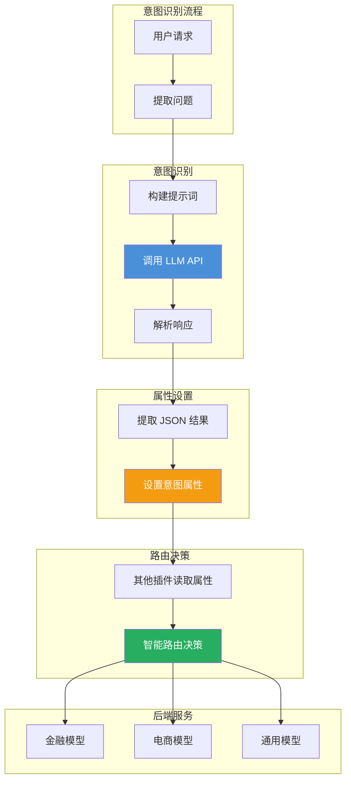
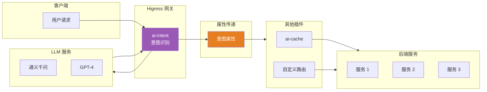
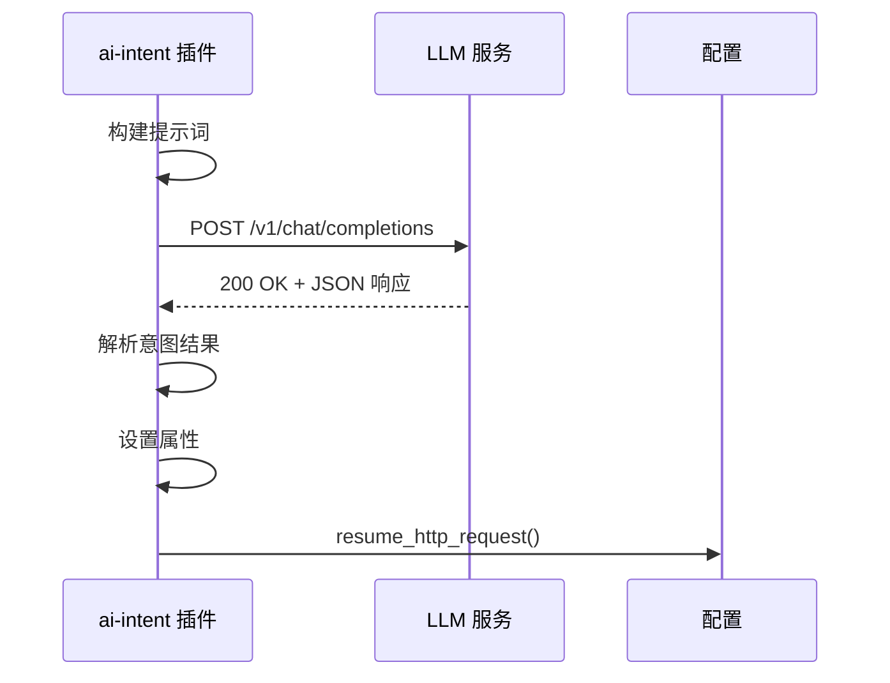
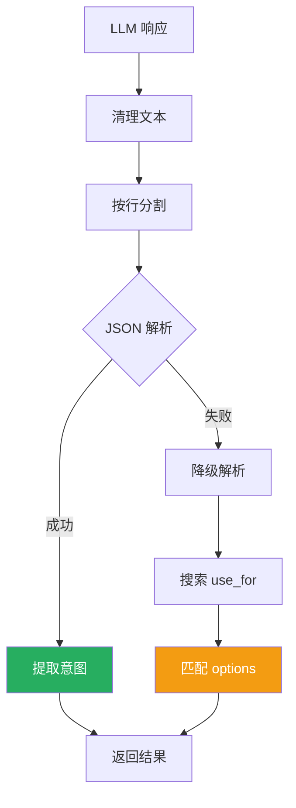

## 引言

在企业级 AI 应用中，不同类型的用户请求往往需要**不同的处理策略**：
- 咨询类请求 → 路由到专业领域模型
- 时效敏感类请求 → 跳过缓存，获取最新信息
- 创意类请求 → 需要模型发挥创造力

**AI 意图识别插件**（ai-intent）通过调用大模型实现**用户意图的智能识别**，为后续路由决策提供依据，实现个性化的服务策略。

本文从源码层面深入剖析该插件的设计思想与实现细节。

---

## 插件定位与核心价值

### 核心价值



### 解决的问题

| 问题 | 传统方案 | 插件方案 |
|------|----------|----------|
| **意图识别** | 应用层规则匹配 | LLM 智能识别 |
| **路由决策** | 硬编码路由 | 动态属性驱动 |
| **扩展性** | 需要修改代码 | 配置即可扩展 |
| **准确性** | 规则匹配不准确 | LLM 理解能力强 |

---

## 插件架构设计

### 整体架构



### 核心数据结构

```rust
// lib.rs:42-61
#[derive(Default, Debug, Deserialize, Clone)]
struct AiIntentConfig {
    #[serde(default = "prompt_default")]
    prompt: String,                  // 提示词模板

    categories: Vec<Category>,       // 意图类别定义

    llm: LLMInfo,                    // LLM 服务配置

    key_from: KVExtractor,           // 数据提取路径
}

#[derive(Default, Debug, Deserialize, Serialize, Clone)]
struct Category {
    use_for: String,                 // 使用场景标识
    options: Vec<String>,            // 可选意图列表
}

#[derive(Default, Debug, Deserialize, Clone)]
struct LLMInfo {
    proxy_service_name: String,      // 服务名称
    proxy_url: String,               // 请求路径
    proxy_model: String,             // 模型名称
    proxy_port: u16,                 // 服务端口
    proxy_domain: String,            // 服务域名
    proxy_timeout: u64,              // 超时时间
    proxy_api_key: String,           // API 密钥
}
```

---

## 源码实现分析

### 1. 提示词构建

```rust
// lib.rs:84-93
impl AiIntentConfig {
    fn get_prompt(&self, message: &str) -> String {
        let prompt = self.prompt.clone();

        // 替换类别变量
        if let Ok(c) = serde_yaml::to_string(&self.categories) {
            prompt.replace("${categories}", &c)
        } else {
            prompt
        }
        // 替换问题变量
        .replace("${question}", message)
    }
}
```

**默认提示词模板**：

```rust
// lib.rs:118-134
fn prompt_default() -> String {
    r#"
You are an intelligent category recognition assistant, responsible for determining which preset category a question belongs to based on the user's query and predefined categories, and providing the corresponding category.
The user's question is: '${question}'
The preset categories are:
${categories}

Please respond directly with the category in the following manner:
```
[
{"use_for":"scene1","result":"result1"},
{"use_for":"scene2","result":"result2"}
]
```
Ensure that different `use_for` are on different lines, and that `use_for` and `result` appear on the same line.
"#.to_string()
}
```

**提示词示例**：

```
输入问题: "今天北京的天气怎么样？"

类别定义:
- use_for: intent-route, options: [Finance, E-commerce, Law, Others]
- use_for: disable-cache, options: [Time-sensitive, An innovative response, Others]

构建后的提示词:
"""
你是一个智能分类助手，请判断用户问题属于哪个类别：

用户问题：'今天北京的天气怎么样？'

预设类别：
- intent-route: [Finance, E-commerce, Law, Others]
- disable-cache: [Time-sensitive, An innovative response, Others]

请直接返回 JSON 格式结果...
"""
```

### 2. LLM 调用实现

```rust
// lib.rs:349-390
fn http_call_intent(&mut self, config: &AiIntentConfig, message: &str) -> bool {
    let prompt = config.get_prompt(message);

    // 构建请求体
    let proxy_request_body = json!({
        "model": config.llm.proxy_model,
        "messages": [
            {"role": "user", "content": prompt}
        ]
    }).to_string();

    // 构建请求头
    let mut headers = MultiMap::new();
    headers.insert("Content-Type".to_string(), "application/json".to_string());
    headers.insert(
        "Authorization".to_string(),
        format!("Bearer {}", config.llm.proxy_api_key),
    );

    // 发起 HTTP 调用
    self.http_call(
        &config.llm.cluster(),
        &Method::POST,
        &config.llm.proxy_url,
        headers,
        Some(proxy_request_body.as_bytes()),
        Box::new(move |status_code, headers, body| {
            // 处理 LLM 响应
            if let Some(this) = self_rc.borrow_mut().downcast_mut::<AiIntent>() {
                this.parse_intent(status_code, headers, body);
            }
            self_rc.borrow().resume_http_request();
        }),
        Duration::from_millis(config.llm.proxy_timeout),
    ).is_ok()
}
```

**HTTP 调用流程**：



### 3. 意图解析算法

```rust
// lib.rs:265-315
fn message_to_intent_res(message: &str, categories: &Vec<Category>) -> Vec<IntentRes> {
    let mut ret = Vec::new();

    // 清理响应文本，移除 ```json 等标记
    let skips = ["```json", "```", "`", "'", " ", "\t"];
    for line in message.split('\n') {
        let mut start = 0;
        let mut end = 0;

        // 去除前缀和后缀
        for s in skips {
            if line[start..].starts_with(s) {
                start += s.len();
            }
            if line[..(line.len() - end)].ends_with(s) {
                end += s.len();
            }
        }

        let json_line = &line[start..(line.len() - end)];

        // 尝试 JSON 解析
        if let Ok(r) = serde_json::from_str::<IntentRes>(json_line) {
            ret.push(r);
        }
    }

    // 降级解析：在原始消息中查找匹配
    if ret.is_empty() {
        for item in message.split("use_for") {
            for category in categories {
                if let Some(index) = item.find(&category.use_for) {
                    for option in &category.options {
                        if item[index..].contains(option) {
                            ret.push(IntentRes::new(
                                category.use_for.clone(),
                                option.clone()
                            ));
                        }
                    }
                }
            }
        }
    }

    ret
}
```

**解析流程**：



### 4. 属性设置与路由

```rust
// lib.rs:318-347
fn parse_intent(
    &self,
    status_code: u16,
    _headers: &MultiMap<String, String>,
    body: Option<Vec<u8>>,
) {
    if status_code != 200 {
        return;
    }

    if let Some(b) = body {
        if let Some(message) = get_message(&b, &config.key_from.response_body) {
            // 解析意图结果
            for intent_res in message_to_intent_res(&message, &config.categories) {
                // 设置属性供其他插件使用
                self.set_property(
                    vec![&format!("intent_category:{}", intent_res.use_for)],
                    Some(intent_res.result.as_bytes()),
                );
            }
        }
    }
}
```

**属性设置示例**：

```rust
// 设置属性
self.set_property(
    vec!["intent_category:intent-route"],
    Some("Finance".as_bytes()),
);
self.set_property(
    vec!["intent_category:disable-cache"],
    Some("Time-sensitive".as_bytes()),
);

// 其他插件读取属性
let intent_route = ctx.get_property("intent_category:intent-route");
let disable_cache = ctx.get_property("intent_category:disable-cache");
```

### 5. 请求处理完整流程

```rust
// lib.rs:413-429
fn on_http_request_complete_body(&mut self, req_body: &Bytes) -> DataAction {
    let config = match &self.config {
        Some(c) => c.clone(),
        None => return DataAction::Continue,
    };

    // 提取用户问题
    if let Some(message) = get_message(req_body, &config.key_from.request_body) {
        // 调用意图识别
        if self.http_call_intent(&config, &message) {
            DataAction::StopIterationAndBuffer  // 停止并缓冲等待 LLM 响应
        } else {
            DataAction::Continue  // 意图识别失败，继续处理
        }
    } else {
        DataAction::Continue  // 无法提取问题，继续处理
    }
}
```

---

## 配置详解

### 完整配置示例

```yaml
apiVersion: extensions.higress.io/v1alpha1
kind: WasmPlugin
metadata:
  name: ai-intent
  namespace: higress-system
spec:
  url: file:///opt/plugins/ai-intent.wasm
  phase: AUTHN
  priority: 100
  config:
    # 提示词模板
    prompt: |
      你是一个智能分类助手，请判断用户问题属于哪个类别：
      用户问题：'${question}'
      预设类别：
      ${categories}

      请直接返回 JSON 格式结果：
      ```
      [
        {"use_for":"scene1","result":"result1"},
        {"use_for":"scene2","result":"result2"}
      ]
      ```

    # 意图类别定义
    categories:
      - use_for: "intent-route"
        options:
          - "Finance"      # 金融
          - "E-commerce"   # 电商
          - "Law"          # 法律
          - "Technology"   # 科技
          - "Others"       # 其他

      - use_for: "disable-cache"
        options:
          - "Time-sensitive"              # 时效敏感
          - "An innovative response"     # 需要创新回答
          - "Requires-reasoning"         # 需要推理
          - "Others"                     # 其他

      - use_for: "model-select"
        options:
          - "gpt-4"        # 使用 GPT-4
          - "gpt-3.5"      # 使用 GPT-3.5
          - "qwen"         # 使用通义千问
          - "default"      # 使用默认模型

    # LLM 服务配置
    llm:
      proxy_service_name: "qwen-service.static"
      proxy_url: "/v1/chat/completions"
      proxy_model: "qwen-long"
      proxy_port: 80
      proxy_timeout: 10000
      proxy_api_key: "sk-xxxxxxxxxxxx"

    # 数据提取路径
    key_from:
      request_body: "$.messages[0].content"          # 从请求体提取问题
      response_body: "$.choices[0].message.content"  # 从响应体提取结果
```

### 配置参数说明

#### 意图类别配置

| 参数 | 类型 | 说明 |
|------|------|------|
| `use_for` | string | 使用场景标识，作为属性名的后缀 |
| `options` | array | 可选意图列表 |

**属性生成规则**：
```rust
// 配置
use_for: "intent-route"
options: ["Finance", "E-commerce"]

// 生成的属性
intent_category:intent-route = "Finance"  // 或 "E-commerce"
```

#### LLM 服务配置

| 参数 | 类型 | 默认值 | 说明 |
|------|------|--------|------|
| `proxy_service_name` | string | - | LLM 服务名称 |
| `proxy_url` | string | - | 请求路径 |
| `proxy_model` | string | `qwen-long` | 模型名称 |
| `proxy_port` | int | 80 | 服务端口 |
| `proxy_timeout` | int | 10000 | 超时时间（毫秒） |
| `proxy_api_key` | string | - | API 密钥 |

---

## 属性使用与路由决策

### 1. 在其他插件中读取属性

```go
// 在自定义路由插件中
func routeByIntent(ctx wrapper.HttpContext) {
    // 读取意图属性
    intentRoute := ctx.GetUserProperty("intent_category:intent-route")
    modelSelect := ctx.GetUserProperty("intent_category:model-select")

    switch intentRoute {
    case "Finance":
        // 路由到金融专用模型
        proxywasm.SetProperty(["backend_service"], []byte("finance-model"))
    case "E-commerce":
        // 路由到电商专用模型
        proxywasm.SetProperty(["backend_service"], []byte("ecommerce-model"))
    default:
        // 使用默认模型
        proxywasm.SetProperty(["backend_service"], []byte("general-model"))
    }
}
```

### 2. 与 ai-cache 插件协同

```go
// 在 ai-cache 插件中
func onHttpRequestBody(ctx wrapper.HttpContext, body []byte) {
    // 检查是否需要禁用缓存
    disableCache := ctx.GetUserProperty("intent_category:disable-cache")

    if disableCache == "Time-sensitive" || disableCache == "An innovative response" {
        // 跳过缓存，直接转发请求
        ctx.SetContext("skip_cache", true)
        proxywasm.ResumeHttpRequest()
        return
    }

    // 正常缓存流程
    CheckCacheForKey(key, ctx, config, log, stream, true)
}
```

### 3. 与自定义路由插件协同

```yaml
# 自定义路由插件配置
config:
  routes:
    - intent: "Finance"
      backend: "finance-model.cluster"

    - intent: "E-commerce"
      backend: "ecommerce-model.cluster"

    - intent: "Law"
      backend: "law-model.cluster"

    - intent: "Technology"
      backend: "tech-model.cluster"
```

---

## 生产部署最佳实践

### 1. 多意图类别设计

```yaml
categories:
  # 主意图：路由决策
  - use_for: "intent-route"
    options: ["Finance", "E-commerce", "Law", "Technology", "Others"]

  # 副意图：缓存控制
  - use_for: "cache-control"
    options: ["enable", "disable", "force-refresh"]

  # 副意图：模型选择
  - use_for: "model-select"
    options: ["gpt-4", "gpt-3.5", "claude-3", "qwen"]

  # 副意图：优先级控制
  - use_for: "priority"
    options: ["high", "medium", "low"]
```

### 2. 提示词优化技巧

```yaml
prompt: |
  你是一个专业的客服分类助手。

  ## 分类原则
  1. 金融问题 → Finance
  2. 购物问题 → E-commerce
  3. 法律问题 → Law
  4. 技术问题 → Technology
  5. 其他 → Others

  ## 用户问题
  ${question}

  ## 输出要求
  请严格按照以下 JSON 格式输出：
  ```json
  [
    {"use_for":"intent-route","result":"类别"},
    {"use_for":"cache-control","result":"enable|disable"}
  ]
  ```

  ## 注意事项
  - 只输出 JSON，不要其他内容
  - 确保输出格式正确
```

### 3. 错误处理与降级

```rust
// LLM 调用失败时的处理
if let Err(err) = http_call_intent(&config, &message) {
    log::error(&format!("Intent recognition failed: {}", err));

    // 降级策略：使用默认配置
    ctx.set_property("intent_category:intent-route", Some("Others".as_bytes()));
    ctx.set_property("intent_category:cache-control", Some("enable".as_bytes()));

    proxywasm.ResumeHttpRequest();
}
```

### 4. 监控指标

```rust
// 设置可观测性指标
ctx.set_property("intent_recognition_time", elapsed_ms.to_string());
ctx.set_property("intent_llm_provider", config.llm.proxy_service_name);
ctx.set_property("intent_llm_model", config.llm.proxy_model);
```

**关键指标**：
- `intent_recognition_time`：意图识别耗时
- `intent_llm_provider`：LLM 服务提供商
- `intent_llm_model`：使用的模型名称
- `intent_category:*`：各个意图类别的值

### 5. 性能优化

```yaml
# 使用流式响应加速
llm:
  proxy_url: "/v1/chat/completions"
  proxy_model: "gpt-3.5-turbo"  # 使用更快的模型

# 减少提示词长度
prompt: |
  简化的提示词，快速识别意图...
```

---

## 高级场景

### 1. 多级意图分类

```yaml
categories:
  # 一级分类
  - use_for: "level-1"
    options: ["Finance", "E-commerce", "Technology"]

  # 二级分类（金融细分）
  - use_for: "finance-subtype"
    options: ["Banking", "Insurance", "Investment"]

  # 三级分类（银行业务细分）
  - use_for: "banking-service"
    options: ["Loans", "CreditCards", "Accounts"]
```

### 2. 条件路由

```yaml
# 基于意图和用户等级的组合路由
config:
  routing_rules:
    - if:
        intent: "Finance"
        user_level: "VIP"
      then:
        backend: "finance-premium-model"

    - if:
        intent: "Finance"
        user_level: "Regular"
      then:
        backend: "finance-regular-model"
```

### 3. A/B 测试支持

```yaml
categories:
  - use_for: "ab-test-group"
    options: ["group-a", "group-b", "group-c"]

  - use_for: "model-select"
    options:
      - "gpt-4-for-a"
      - "gpt-3.5-for-b"
      - "claude-for-c"
```

---

## 技术亮点总结

### 1. 智能的意图解析算法

- **主解析**：JSON 解析优先
- **降级解析**：文本搜索备用
- **鲁棒性**：处理各种 LLM 输出格式

### 2. 灵活的属性机制

- **属性命名**：`intent_category:{use_for}`
- **多维度**：支持多类别同时识别
- **传递性**：属性在插件间传递

### 3. 非阻塞式设计

- **异步调用**：HTTP 调用不阻塞其他插件
- **缓冲等待**：StopIterationAndBuffer 等待响应
- **错误降级**：调用失败时使用默认值

### 4. 配置驱动架构

- **声明式配置**：类别定义清晰直观
- **热更新**：支持运行时配置更新
- **可扩展**：添加新类别无需修改代码

---

## 结语

AI 意图识别插件通过调用 LLM 实现了**智能的意图识别与路由决策**：

1. **意图识别**：基于 LLM 的准确意图分类
2. **属性设置**：通过属性机制传递意图信息
3. **智能路由**：支持基于意图的动态路由
4. **插件协同**：与其他插件无缝集成

该插件为企业级 AI 应用提供了**智能化的流量治理**能力，是实现个性化服务的重要基础设施。
