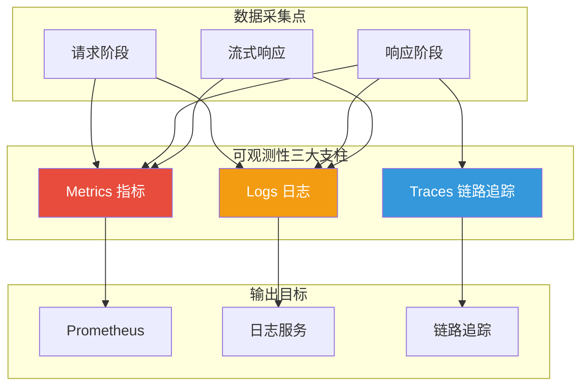
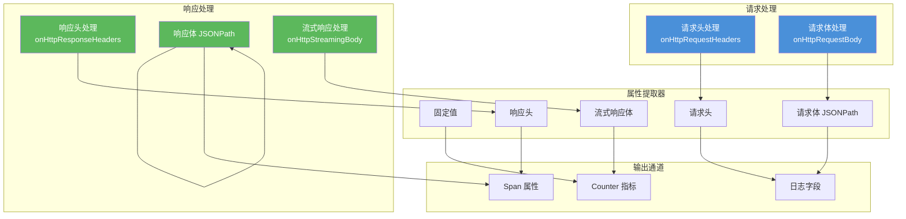

## 引言

在企业级 AI 应用中，**可观测性（Observability）**是保障服务稳定性和优化性能的关键基础设施。只有全面了解 AI 服务的运行状态，才能进行有效的容量规划、成本控制和性能优化。

**AI 统计插件**（ai-statistics）作为 Higress 的官方可观测性插件，提供了：
- **Metrics（指标）**：Token 使用量、延迟、QPS 等量化指标
- **Logs（日志）**：结构化的请求/响应日志记录
- **Traces（链路追踪）**：分布式追踪的 span 属性

本文从源码层面深入剖析该插件的设计思想与实现细节。

---

## 插件定位与核心价值

### 核心价值



### 解决的问题

| 问题 | 传统方案 | 插件方案 |
|------|----------|----------|
| **Token 成本模糊** | 仅依赖 LLM 提供商账单 | 实时精确统计每个请求 |
| **性能瓶颈定位** | 端到端监控，无法区分阶段 | 细粒度的首字延迟、总耗时 |
| **协议兼容性** | 需针对每种协议单独开发 | 统一抽象，支持多协议 |
| **自定义需求** | 修改代码重新部署 | 灵活的配置化属性提取 |

---

## 插件架构设计

### 整体架构



### 目录结构

```
ai-statistics/
├── main.go          # 主入口文件（740 行）
├── README.md        # 中文文档
└── README_EN.md     # 英文文档
```

---

## 源码实现分析

### 1. 配置结构定义

```go
// main.go:118-133
type AIStatisticsConfig struct {
    // 指标收集器
    counterMetrics map[string]proxywasm.MetricCounter

    // 自定义属性配置
    attributes []Attribute

    // 是否需要缓冲流式响应体
    shouldBufferStreamingBody bool

    // 是否禁用 OpenAI Usage 统计
    disableOpenaiUsage bool

    // 单个值的长度限制
    valueLengthLimit int

    // 路径后缀白名单
    enablePathSuffixes []string

    // 内容类型白名单
    enableContentTypes []string
}
```

### 2. 属性配置结构

```go
// main.go:106-116
type Attribute struct {
    Key                string `json:"key"`                 // 属性名
    ValueSource        string `json:"value_source"`        // 取值来源
    Value              string `json:"value"`               // 取值路径/key
    TraceSpanKey       string `json:"trace_span_key"`      // Span 中的 key
    DefaultValue       string `json:"default_value"`       // 默认值
    Rule               string `json:"rule"`                // 流式提取规则
    ApplyToLog         bool   `json:"apply_to_log"`        // 是否记录到日志
    ApplyToSpan        bool   `json:"apply_to_span"`       // 是否记录到 span
    AsSeparateLogField bool   `json:"as_separate_log_field"` // 是否作为独立日志字段
}
```

**取值来源类型**：

```go
// main.go:57-63
const (
    FixedValue            = "fixed_value"             // 固定值
    RequestHeader         = "request_header"          // 请求头
    RequestBody           = "request_body"            // 请求体（JSONPath）
    ResponseHeader        = "response_header"         // 响应头
    ResponseStreamingBody = "response_streaming_body" // 流式响应体
    ResponseBody          = "response_body"           // 响应体（JSONPath）
)
```

**流式提取规则**：

```go
// main.go:82-85
const (
    RuleFirst   = "first"   // 取第一个有效值
    RuleReplace = "replace" // 取最后一个有效值
    RuleAppend  = "append"  // 拼接所有有效值
)
```

### 3. 请求头处理

```go
// main.go:276-316
func onHttpRequestHeaders(ctx wrapper.HttpContext, config AIStatisticsConfig) types.Action {
    // 1. 检查路径是否在白名单中
    requestPath, _ := proxywasm.GetHttpRequestHeader(":path")
    if !isPathEnabled(requestPath, config.enablePathSuffixes) {
        ctx.SetContext(SkipProcessing, true)
        ctx.DontReadRequestBody()
        ctx.DontReadResponseBody()
        return types.ActionContinue
    }

    // 2. 记录请求开始时间
    ctx.SetContext(StatisticsRequestStartTime, time.Now().UnixMilli())

    // 3. 提取路由、集群、消费者信息
    route, _ := getRouteName()
    cluster, _ := getClusterName()
    api, apiError := getAPIName()
    if apiError == nil {
        route = api
    }
    ctx.SetContext(RouteName, route)
    ctx.SetContext(ClusterName, cluster)

    // 4. 提取消费者信息（用于多租户统计）
    if consumer, _ := proxywasm.GetHttpRequestHeader(ConsumerKey); consumer != "" {
        ctx.SetContext(ConsumerKey, consumer)
    }

    // 5. 设置 ARMS span 属性
    setSpanAttribute(ArmsSpanKind, "LLM")

    // 6. 处理固定值和请求头类型的属性
    setAttributeBySource(ctx, config, FixedValue, nil)
    setAttributeBySource(ctx, config, RequestHeader, nil)

    return types.ActionContinue
}
```

**路径过滤逻辑**：

```go
// main.go:180-199
func isPathEnabled(requestPath string, enabledSuffixes []string) bool {
    if len(enabledSuffixes) == 0 {
        return true // 未配置则对所有路径生效
    }

    // 移除查询参数
    pathWithoutQuery := requestPath
    if queryPos := strings.Index(requestPath, "?"); queryPos != -1 {
        pathWithoutQuery = requestPath[:queryPos]
    }

    // 检查是否匹配任何后缀
    for _, suffix := range enabledSuffixes {
        if strings.HasSuffix(pathWithoutQuery, suffix) {
            return true
        }
    }
    return false
}
```

### 4. 请求体处理

```go
// main.go:318-364
func onHttpRequestBody(ctx wrapper.HttpContext, config AIStatisticsConfig, body []byte) types.Action {
    // 1. 处理请求体类型的属性
    setAttributeBySource(ctx, config, RequestBody, body)

    // 2. 提取请求模型名称（用于 ARMS）
    requestModel := "UNKNOWN"
    if model := gjson.GetBytes(body, "model"); model.Exists() {
        requestModel = model.String()
    } else {
        // Gemini 协议特殊处理
        requestPath := ctx.GetStringContext(RequestPath, "")
        if strings.Contains(requestPath, "generateContent") {
            reg := regexp.MustCompile(`^.*/(?P<api_version>[^/]+)/models/(?P<model>[^:]+):\w+Content$`)
            matches := reg.FindStringSubmatch(requestPath)
            if len(matches) == 3 {
                requestModel = matches[2]
            }
        }
    }
    setSpanAttribute(ArmsRequestModel, requestModel)

    // 3. 计算对话轮次（user 消息数量）
    userPromptCount := 0
    if messages := gjson.GetBytes(body, "messages"); messages.Exists() && messages.IsArray() {
        // OpenAI/Claude 格式
        for _, msg := range messages.Array() {
            if msg.Get("role").String() == "user" {
                userPromptCount += 1
            }
        }
    } else if contents := gjson.GetBytes(body, "contents"); contents.Exists() && contents.IsArray() {
        // Gemini 格式
        for _, content := range contents.Array() {
            if !content.Get("role").Exists() || content.Get("role").String() == "user" {
                userPromptCount += 1
            }
        }
    }
    ctx.SetUserAttribute(ChatRound, userPromptCount)

    // 4. 写入日志
    _ = ctx.WriteUserAttributeToLogWithKey(wrapper.AILogKey)

    return types.ActionContinue
}
```

### 5. 响应头处理

```go
// main.go:366-385
func onHttpResponseHeaders(ctx wrapper.HttpContext, config AIStatisticsConfig) types.Action {
    contentType, _ := proxywasm.GetHttpResponseHeader("content-type")

    // 1. 检查内容类型是否在白名单中
    if !isContentTypeEnabled(contentType, config.enableContentTypes) {
        ctx.SetContext(SkipProcessing, true)
        ctx.DontReadResponseBody()
        return types.ActionContinue
    }

    // 2. 非流式响应需要缓冲响应体
    if !strings.Contains(contentType, "text/event-stream") {
        ctx.BufferResponseBody()
    }

    // 3. 处理响应头类型的属性
    setAttributeBySource(ctx, config, ResponseHeader, nil)

    return types.ActionContinue
}
```

### 6. 流式响应处理

```go
// main.go:387-459
func onHttpStreamingBody(ctx wrapper.HttpContext, config AIStatisticsConfig, data []byte, endOfStream bool) []byte {
    // 1. 缓冲流式响应体（用于属性提取）
    if config.shouldBufferStreamingBody {
        streamingBodyBuffer, ok := ctx.GetContext(CtxStreamingBodyBuffer).([]byte)
        if !ok {
            streamingBodyBuffer = data
        } else {
            streamingBodyBuffer = append(streamingBodyBuffer, data...)
        }
        ctx.SetContext(CtxStreamingBodyBuffer, streamingBodyBuffer)
    }

    // 2. 标记响应类型为流式
    ctx.SetUserAttribute(ResponseType, "stream")

    // 3. 提取 chat_id（用于关联追踪）
    if chatID := wrapper.GetValueFromBody(data, []string{
        "id",              // OpenAI
        "response.id",     // OpenAI
        "responseId",      // Gemini
        "message.id",      // Claude
    }); chatID != nil {
        ctx.SetUserAttribute(ChatID, chatID.String())
    }

    // 4. 记录首个 token 时间戳
    requestStartTime, ok := ctx.GetContext(StatisticsRequestStartTime).(int64)
    if !ok {
        return data
    }

    if ctx.GetContext(StatisticsFirstTokenTime) == nil {
        firstTokenTime := time.Now().UnixMilli()
        ctx.SetContext(StatisticsFirstTokenTime, firstTokenTime)
        ctx.SetUserAttribute(LLMFirstTokenDuration, firstTokenTime-requestStartTime)
    }

    // 5. 提取 Token 使用信息
    if !config.disableOpenaiUsage {
        if usage := tokenusage.GetTokenUsage(ctx, data); usage.TotalToken > 0 {
            setSpanAttribute(ArmsTotalToken, usage.TotalToken)
            setSpanAttribute(ArmsModelName, usage.Model)
            setSpanAttribute(ArmsInputToken, usage.InputToken)
            setSpanAttribute(ArmsOutputToken, usage.OutputToken)
        }
    }

    // 6. 流结束时处理
    if endOfStream {
        responseEndTime := time.Now().UnixMilli()
        ctx.SetUserAttribute(LLMServiceDuration, responseEndTime-requestStartTime)

        // 处理流式响应体属性
        if config.shouldBufferStreamingBody {
            streamingBodyBuffer, ok := ctx.GetContext(CtxStreamingBodyBuffer).([]byte)
            if ok {
                setAttributeBySource(ctx, config, ResponseStreamingBody, streamingBodyBuffer)
            }
        }

        // 写入日志和指标
        _ = ctx.WriteUserAttributeToLogWithKey(wrapper.AILogKey)
        writeMetric(ctx, config)
    }

    return data
}
```

### 7. 非流式响应处理

```go
// main.go:461-504
func onHttpResponseBody(ctx wrapper.HttpContext, config AIStatisticsConfig, body []byte) types.Action {
    // 1. 计算总服务时长
    requestStartTime, _ := ctx.GetContext(StatisticsRequestStartTime).(int64)
    responseEndTime := time.Now().UnixMilli()
    ctx.SetUserAttribute(LLMServiceDuration, responseEndTime-requestStartTime)

    // 2. 标记响应类型为非流式
    ctx.SetUserAttribute(ResponseType, "normal")

    // 3. 提取 chat_id
    if chatID := wrapper.GetValueFromBody(body, []string{
        "id", "response.id", "responseId", "message.id",
    }); chatID != nil {
        ctx.SetUserAttribute(ChatID, chatID.String())
    }

    // 4. 提取 Token 使用信息
    if !config.disableOpenaiUsage {
        if usage := tokenusage.GetTokenUsage(ctx, body); usage.TotalToken > 0 {
            setSpanAttribute(ArmsModelName, usage.Model)
            setSpanAttribute(ArmsInputToken, usage.InputToken)
            setSpanAttribute(ArmsOutputToken, usage.OutputToken)
            setSpanAttribute(ArmsTotalToken, usage.TotalToken)
        }
    }

    // 5. 处理响应体类型的属性
    setAttributeBySource(ctx, config, ResponseBody, body)

    // 6. 写入日志和指标
    _ = ctx.WriteUserAttributeToLogWithKey(wrapper.AILogKey)
    writeMetric(ctx, config)

    return types.ActionContinue
}
```

### 8. 属性提取核心逻辑

```go
// main.go:508-567
func setAttributeBySource(ctx wrapper.HttpContext, config AIStatisticsConfig, source string, body []byte) {
    for _, attribute := range config.attributes {
        var key string
        var value interface{}

        if source == attribute.ValueSource {
            key = attribute.Key
            switch source {
            case FixedValue:
                value = attribute.Value
            case RequestHeader:
                value, _ = proxywasm.GetHttpRequestHeader(attribute.Value)
            case RequestBody:
                value = gjson.GetBytes(body, attribute.Value).Value()
            case ResponseHeader:
                value, _ = proxywasm.GetHttpResponseHeader(attribute.Value)
            case ResponseStreamingBody:
                value = extractStreamingBodyByJsonPath(body, attribute.Value, attribute.Rule)
            case ResponseBody:
                value = gjson.GetBytes(body, attribute.Value).Value()
            }

            // 内置属性的协议回退逻辑
            if (value == nil || value == "") && isBuiltinAttribute(key) {
                value = getBuiltinAttributeFallback(ctx, config, key, source, body, attribute.Rule)
            }

            // 应用默认值
            if (value == nil || value == "") && attribute.DefaultValue != "" {
                value = attribute.DefaultValue
            }

            // 长度限制
            if len(fmt.Sprint(value)) > config.valueLengthLimit {
                value = truncateValue(value, config.valueLengthLimit)
            }

            // 记录到日志
            if attribute.ApplyToLog {
                if attribute.AsSeparateLogField {
                    marshalledJsonStr := wrapper.MarshalStr(fmt.Sprint(value))
                    proxywasm.SetProperty([]string{key}, []byte(marshalledJsonStr))
                } else {
                    ctx.SetUserAttribute(key, value)
                }
            }

            // 记录到 span
            if attribute.ApplyToSpan {
                spanKey := key
                if attribute.TraceSpanKey != "" {
                    spanKey = attribute.TraceSpanKey
                }
                setSpanAttribute(spanKey, value)
            }
        }
    }
}
```

### 9. 流式响应体提取

```go
// main.go:608-640
func extractStreamingBodyByJsonPath(data []byte, jsonPath string, rule string) interface{} {
    // 1. 统一 SSE chunk 格式并分割
    chunks := bytes.Split(bytes.TrimSpace(wrapper.UnifySSEChunk(data)), []byte("\n\n"))
    var value interface{}

    // 2. 根据规则提取值
    if rule == RuleFirst {
        // 取第一个有效值
        for _, chunk := range chunks {
            jsonObj := gjson.GetBytes(chunk, jsonPath)
            if jsonObj.Exists() {
                value = jsonObj.Value()
                break
            }
        }
    } else if rule == RuleReplace {
        // 取最后一个有效值
        for _, chunk := range chunks {
            jsonObj := gjson.GetBytes(chunk, jsonPath)
            if jsonObj.Exists() {
                value = jsonObj.Value()
            }
        }
    } else if rule == RuleAppend {
        // 拼接所有有效值
        var strValue string
        for _, chunk := range chunks {
            jsonObj := gjson.GetBytes(chunk, jsonPath)
            if jsonObj.Exists() {
                strValue += jsonObj.String()
            }
        }
        value = strValue
    }

    return value
}
```

### 10. 指标写入

```go
// main.go:654-720
func writeMetric(ctx wrapper.HttpContext, config AIStatisticsConfig) {
    var route, cluster, model string
    consumer := ctx.GetStringContext(ConsumerKey, "none")

    route, _ = ctx.GetContext(RouteName).(string)
    cluster, _ = ctx.GetContext(ClusterName).(string)

    // 禁用 OpenAI Usage 时跳过
    if config.disableOpenaiUsage {
        return
    }

    // 获取模型和 token 信息
    model, _ = ctx.GetUserAttribute(tokenusage.CtxKeyModel).(string)

    // 写入 Token 指标
    if inputToken, ok := convertToUInt(ctx.GetUserAttribute(tokenusage.CtxKeyInputToken)); ok {
        config.incrementCounter(
            generateMetricName(route, cluster, model, consumer, tokenusage.CtxKeyInputToken),
            inputToken,
        )
    }
    if outputToken, ok := convertToUInt(ctx.GetUserAttribute(tokenusage.CtxKeyOutputToken)); ok {
        config.incrementCounter(
            generateMetricName(route, cluster, model, consumer, tokenusage.CtxKeyOutputToken),
            outputToken,
        )
    }
    if totalToken, ok := convertToUInt(ctx.GetUserAttribute(tokenusage.CtxKeyTotalToken)); ok {
        config.incrementCounter(
            generateMetricName(route, cluster, model, consumer, tokenusage.CtxKeyTotalToken),
            totalToken,
        )
    }

    // 写入时长指标（流式）
    if ctx.GetUserAttribute(LLMFirstTokenDuration) != nil {
        if llmFirstTokenDuration, ok := convertToUInt(ctx.GetUserAttribute(LLMFirstTokenDuration)); ok {
            config.incrementCounter(
                generateMetricName(route, cluster, model, consumer, LLMFirstTokenDuration),
                llmFirstTokenDuration,
            )
            config.incrementCounter(
                generateMetricName(route, cluster, model, consumer, LLMStreamDurationCount),
                1,
            )
        }
    }

    // 写入总时长指标
    if ctx.GetUserAttribute(LLMServiceDuration) != nil {
        if llmServiceDuration, ok := convertToUInt(ctx.GetUserAttribute(LLMServiceDuration)); ok {
            config.incrementCounter(
                generateMetricName(route, cluster, model, consumer, LLMServiceDuration),
                llmServiceDuration,
            )
            config.incrementCounter(
                generateMetricName(route, cluster, model, consumer, LLMDurationCount),
                1,
            )
        }
    }
}
```

**指标命名格式**：

```go
// main.go:135-137
func generateMetricName(route, cluster, model, consumer, metricName string) string {
    return fmt.Sprintf("route.%s.upstream.%s.model.%s.consumer.%s.metric.%s",
        route, cluster, model, consumer, metricName)
}
```

---

## 多协议支持

### 支持的协议

| 协议 | 请求路径 | 特殊处理 |
|------|----------|----------|
| **OpenAI** | `/v1/chat/completions`, `/v1/completions`, `/v1/embeddings` | 标准 messages 格式 |
| **Claude** | OpenAI 兼容路径 | 使用 messages 格式，响应体结构不同 |
| **Gemini** | `/generateContent`, `/streamGenerateContent` | 使用 contents 格式，模型从路径提取 |

### 内置属性的协议回退

```go
// main.go:574-606
func getBuiltinAttributeFallback(ctx wrapper.HttpContext, config AIStatisticsConfig, key, source string, body []byte, rule string) interface{} {
    switch key {
    case BuiltinQuestionKey:  // "question"
        if source == RequestBody {
            // OpenAI 和 Claude 使用相同的 messages 结构
            if value := gjson.GetBytes(body, QuestionPathOpenAI).Value(); value != nil && value != "" {
                return value
            }
        }
    case BuiltinAnswerKey:  // "answer"
        if source == ResponseStreamingBody {
            // 先尝试 OpenAI 格式
            if value := extractStreamingBodyByJsonPath(body, AnswerPathOpenAIStreaming, rule); value != nil {
                return value
            }
            // 回退到 Claude 格式
            if value := extractStreamingBodyByJsonPath(body, AnswerPathClaudeStreaming, rule); value != nil {
                return value
            }
        } else if source == ResponseBody {
            // 先尝试 OpenAI 格式
            if value := gjson.GetBytes(body, AnswerPathOpenAINonStreaming).Value(); value != nil {
                return value
            }
            // 回退到 Claude 格式
            if value := gjson.GetBytes(body, AnswerPathClaudeNonStreaming).Value(); value != nil {
                return value
            }
        }
    }
    return nil
}
```

**内置属性路径**：

```go
// main.go:92-102
const (
    // 问题路径（从请求体）
    QuestionPathOpenAI = "messages.@reverse.0.content"
    QuestionPathClaude = "messages.@reverse.0.content"

    // 回答路径（非流式）
    AnswerPathOpenAINonStreaming = "choices.0.message.content"
    AnswerPathClaudeNonStreaming = "content.0.text"

    // 回答路径（流式）
    AnswerPathOpenAIStreaming = "choices.0.delta.content"
    AnswerPathClaudeStreaming = "delta.text"
)
```

---

## 配置详解

### 空配置（默认行为）

```yaml
apiVersion: extensions.higress.io/v1alpha1
kind: WasmPlugin
metadata:
  name: ai-statistics
  namespace: higress-system
spec:
  url: file:///opt/plugins/ai-statistics.wasm
  # 无需配置，自动收集 OpenAI 协议的基础指标
```

**自动收集的指标**：
```
# Counter 指标
route.{route}.upstream.{cluster}.model.{model}.consumer.{consumer}.metric.input_token
route.{route}.upstream.{cluster}.model.{model}.consumer.{consumer}.metric.output_token
route.{route}.upstream.{cluster}.model.{model}.consumer.{consumer}.metric.total_token
route.{route}.upstream.{cluster}.model.{model}.consumer.{consumer}.metric.llm_service_duration
route.{route}.upstream.{cluster}.model.{model}.consumer.{consumer}.metric.llm_duration_count
route.{route}.upstream.{cluster}.model.{model}.consumer.{consumer}.metric.llm_first_token_duration
route.{route}.upstream.{cluster}.model.{model}.consumer.{consumer}.metric.llm_stream_duration_count
```

**自动记录的日志**：
```json
{
  "ai_log": "{\"model\":\"qwen-turbo\",\"input_token\":\"10\",\"output_token\":\"69\",\"llm_first_token_duration\":\"309\",\"llm_service_duration\":\"1955\"}"
}
```

### 完整配置示例

```yaml
apiVersion: extensions.higress.io/v1alpha1
kind: WasmPlugin
metadata:
  name: ai-statistics
  namespace: higress-system
spec:
  url: file:///opt/plugins/ai-statistics.wasm
  phase: AUTHN
  priority: 200
  config:
    # 禁用 OpenAI Usage（用于非标准协议）
    disable_openai_usage: false

    # 单个值长度限制
    value_length_limit: 4000

    # 路径后缀白名单
    enable_path_suffixes:
      - "/v1/chat/completions"
      - "/v1/embeddings"
      - "/generateContent"

    # 内容类型白名单
    enable_content_types:
      - "text/event-stream"
      - "application/json"

    # 自定义属性
    attributes:
      # 提取消费者信息
      - key: consumer
        value_source: request_header
        value: x-mse-consumer
        apply_to_log: true
        as_separate_log_field: true

      # 提取问题（内置属性，自动协议回退）
      - key: question
        value_source: request_body
        value: messages.@reverse.0.content
        apply_to_log: true

      # 提取回答（流式）
      - key: answer
        value_source: response_streaming_body
        value: choices.0.delta.content
        rule: append  # 拼接所有 chunk
        apply_to_log: true

      # 提取回答（非流式）
      - key: answer
        value_source: response_body
        value: choices.0.message.content
        apply_to_log: true

      # 提取用户 ID
      - key: user_id
        value_source: request_body
        value: user.id
        default_value: "anonymous"
        apply_to_log: true
        apply_to_span: true
        trace_span_key: user.id

      # 固定值属性
      - key: service_name
        value_source: fixed_value
        value: "ai-gateway"
        apply_to_span: true
```

### 非标准协议配置

对于非 OpenAI 兼容协议（如阿里云百炼），需要手动指定 token 提取路径：

```yaml
attributes:
  # 从响应体提取模型名称
  - key: model
    value_source: response_body
    value: usage.models.0.model_id
    apply_to_log: true

  # 从响应体提取输入 token
  - key: input_token
    value_source: response_body
    value: usage.models.0.input_tokens
    apply_to_log: true

  # 从响应体提取输出 token
  - key: output_token
    value_source: response_body
    value: usage.models.0.output_tokens
    apply_to_log: true

  # 从响应体提取总 token
  - key: total_token
    value_source: response_body
    value: usage.models.0.total_tokens
    apply_to_log: true
```

---

## 生产部署最佳实践

### 1. 日志格式配置

在 Higress 网关配置中添加 `log_format`：

```yaml
apiVersion: networking.higress.io/v1alpha1
kind: EnvoyConfig
metadata:
  name: ai-log-format
  namespace: higress-system
spec:
  configPatches:
    - applyTo: CLUSTER
      match:
        context: GATEWAY
      patch:
        operation: MERGE
        value:
          access_log_config:
          - name: envoy.file_access_log
            typed_config:
              "@type": type.googleapis.com/envoy.extensions.access_loggers.file.v3.FileAccessLog
              path: /dev/stdout
              log_format:
                text_format_source:
                  inline_string: |
                    {
                      "ai_log": "%FILTER_STATE(wasm.ai_log:PLAIN)%",
                      "consumer": "%FILTER_STATE(wasm.consumer:PLAIN)%",
                      "question": "%FILTER_STATE(wasm.question:PLAIN)%",
                      "answer": "%FILTER_STATE(wasm.answer:PLAIN)%"
                    }
```

### 2. Prometheus 监控

**PromQL 查询示例**：

```promql
# 流式请求首个 token 平均延迟
irate(
  route_upstream_model_consumer_metric_llm_first_token_duration[2m]
) /
irate(
  route_upstream_model_consumer_metric_llm_stream_duration_count[2m]
)

# 平均总服务时长
irate(
  route_upstream_model_consumer_metric_llm_service_duration[2m]
) /
irate(
  route_upstream_model_consumer_metric_llm_duration_count[2m]
)

# Token 使用速率（按模型）
sum by (ai_model) (
  rate(route_upstream_model_consumer_metric_total_token[5m])
)

# 成本估算（假设每 1K token = $0.002）
sum(
  rate(route_upstream_model_consumer_metric_total_token[5m])
) * 0.000002
```

### 3. SLS 日志加工

使用阿里云 SLS 数据加工提取字段：

```
# 解析 JSON 日志
e_regex("ai_log", grok("%{EXTRACTJSON}"))

# 提取 question 和 answer
e_set("question", json_select(v("json"), "question", default="-"))
e_set("answer", json_select(v("json"), "answer", default="-"))
```

### 4. ARMS 链路追踪

插件自动设置以下 span 属性：

```go
// main.go:74-80
const (
    ArmsSpanKind     = "gen_ai.span.kind"           // "LLM"
    ArmsModelName    = "gen_ai.model_name"          // 模型名称
    ArmsRequestModel = "gen_ai.request.model"       // 请求模型
    ArmsInputToken   = "gen_ai.usage.input_tokens"  // 输入 token
    ArmsOutputToken  = "gen_ai.usage.output_tokens" // 输出 token
    ArmsTotalToken   = "gen_ai.usage.total_tokens"  // 总 token
)
```

### 5. 性能优化

| 优化项 | 说明 | 建议 |
|--------|------|------|
| **路径过滤** | 使用 `enable_path_suffixes` 限制处理范围 | 仅配置 AI 相关路径 |
| **内容类型过滤** | 使用 `enable_content_types` 避免处理二进制 | 仅配置 JSON/SSE |
| **值长度限制** | 使用 `value_length_limit` 避免大值 | 默认 4000，根据需求调整 |
| **属性选择性** | 只配置必要的 `apply_to_log`/`apply_to_span` | 减少不必要的输出 |

### 6. 监控告警规则

```yaml
# Prometheus 告警规则
groups:
  - name: ai_statistics
    interval: 30s
    rules:
      # 高延迟告警
      - alert: HighLLMLatency
        expr: |
         irate(
            route_upstream_model_consumer_metric_llm_service_duration[5m]
          ) /
          irate(
            route_upstream_model_consumer_metric_llm_duration_count[5m]
          ) > 3000
        for: 5m
        labels:
          severity: warning
        annotations:
          summary: "LLM 服务延迟过高"
          description: "{{ $labels.ai_model }} 平均延迟超过 3 秒"

      # 高错误率告警（基于流式/非流式比例）
      - alert: HighStreamFailureRate
        expr: |
          (
            rate(route_upstream_model_consumer_metric_llm_stream_duration_count[5m])
            /
            rate(route_upstream_model_consumer_metric_llm_duration_count[5m])
          ) < 0.5
        for: 5m
        labels:
          severity: warning
        annotations:
          summary: "流式响应比例异常"
          description: "{{ $labels.ai_model }} 流式响应比例低于 50%"
```

---

## 技术亮点总结

### 1. 三位一体可观测性

- **Metrics**：Counter 类型指标，支持多维度聚合
- **Logs**：结构化 JSON 日志，支持自定义字段
- **Traces**：OpenTelemetry 兼容的 span 属性

### 2. 灵活的属性提取系统

| 来源 | 支持的提取方式 |
|------|----------------|
| **固定值** | 直接配置 |
| **请求头** | Header Key |
| **请求体** | JSONPath |
| **响应头** | Header Key |
| **响应体** | JSONPath |
| **流式响应** | JSONPath + Rule（first/replace/append） |

### 3. 多协议兼容

- **OpenAI**：完整支持
- **Claude**：自动回退
- **Gemini**：特殊处理
- **其他**：可配置自定义路径

### 4. 内置属性智能回退

对于 `question` 和 `answer` 内置属性，自动尝试多种协议格式，无需手动配置。

### 5. 性能优化设计

- **路径过滤**：避免处理无关请求
- **内容类型过滤**：避免处理二进制数据
- **按需缓冲**：仅在需要时缓冲流式响应体
- **延迟初始化**：Counter 指标按需创建

---

## 结语

AI 统计插件通过 **Metrics、Logs、Traces 三位一体**的可观测性架构，为企业级 AI 应用提供了全面的运行时洞察能力：

1. **精确的成本追踪**：实时统计每个请求的 Token 使用量
2. **细粒度的性能分析**：首个 token 延迟、总服务时长、流式/非流式区分
3. **灵活的扩展能力**：支持自定义属性提取，适配各种非标准协议
4. **生产级集成**：无缝对接 Prometheus、SLS、ARMS 等可观测性平台

该插件是 AI 网关可观测性基础设施的核心组件，为 AI 服务的稳定运行和持续优化提供了数据支撑。
