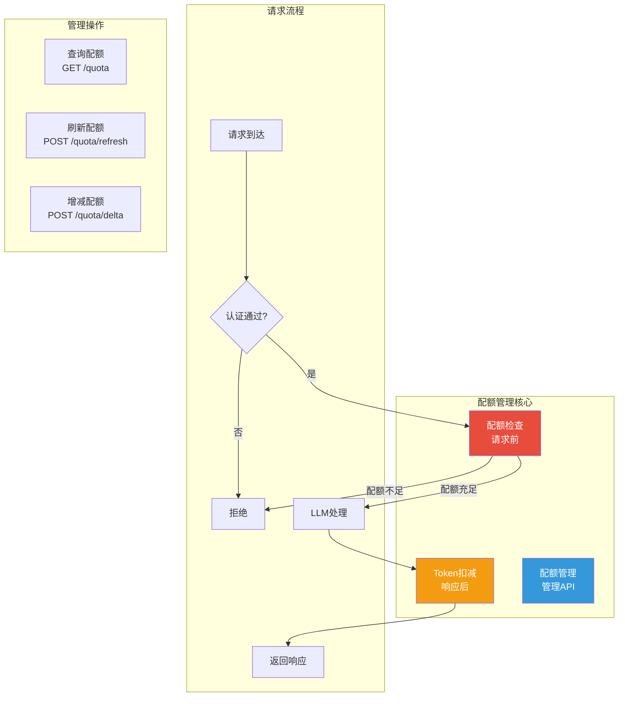
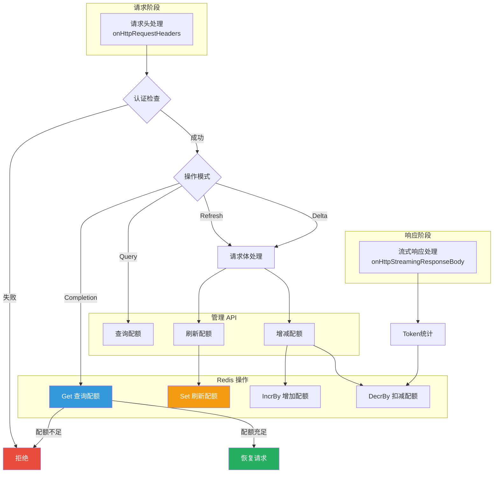

## 引言

在企业级 AI 应用中，**配额管理（Quota Management）**是实现精细化成本控制和资源分配的关键机制。不同于简单的请求限流，AI 场景需要根据实际 Token 消耗进行计费和限制。

**AI 配额管理插件**（ai-quota）提供了：
- **Token 级配额控制**：基于实际 Token 消耗进行扣减
- **动态配额管理**：支持查询、刷新、增减配额
- **多租户隔离**：基于 Consumer 的配额隔离
- **管理 API**：提供 RESTful 接口进行配额管理

本文从源码层面深入剖析该插件的设计思想与实现细节。

---

## 插件定位与核心价值

### 核心价值



### 解决的问题

| 问题 | 传统方案 | 插件方案 |
|------|----------|----------|
| **成本控制模糊** | 按请求数计费，忽略 Token 差异 | 按实际 Token 消耗扣减配额 |
| **配额调整困难** | 需要重启服务 | 动态 REST API 管理 |
| **多租户隔离** | 全局限流，无法区分用户 | 基于 Consumer 的配额隔离 |
| **配额查询** | 无法查询剩余配额 | 提供查询接口 |

---

## 插件架构设计

### 整体架构



### 操作模式

```go
// main.go:27-43
type ChatMode string

const (
    ChatModeCompletion ChatMode = "completion"  // 正常对话模式
    ChatModeAdmin      ChatMode = "admin"       // 管理模式
    ChatModeNone       ChatMode = "none"        // 非处理模式
)

type AdminMode string

const (
    AdminModeRefresh AdminMode = "refresh"  // 刷新配额
    AdminModeQuery   AdminMode = "query"    // 查询配额
    AdminModeDelta   AdminMode = "delta"    // 增减配额
    AdminModeNone    AdminMode = "none"     // 非管理操作
)
```

**URL 路径规则**：

```go
// main.go:260-275
func getOperationMode(path string, adminPath string) (ChatMode, AdminMode) {
    fullAdminPath := "/v1/chat/completions" + adminPath

    // 管理操作
    if strings.HasSuffix(path, fullAdminPath+"/refresh") {
        return ChatModeAdmin, AdminModeRefresh
    }
    if strings.HasSuffix(path, fullAdminPath+"/delta") {
        return ChatModeAdmin, AdminModeDelta
    }
    if strings.HasSuffix(path, fullAdminPath) {
        return ChatModeAdmin, AdminModeQuery
    }

    // 对话操作
    if strings.HasSuffix(path, "/v1/chat/completions") {
        return ChatModeCompletion, AdminModeNone
    }

    return ChatModeNone, AdminModeNone
}
```

---

## 源码实现分析

### 1. 配置结构定义

```go
// main.go:56-77
type QuotaConfig struct {
    redisInfo       RedisInfo         // Redis 配置
    RedisKeyPrefix  string            // Redis key 前缀，默认 "chat_quota:"
    AdminConsumer   string            // 管理员 consumer 名称
    AdminPath       string            // 管理路径，默认 "/quota"
    credential2Name map[string]string // 凭证到名称的映射
    redisClient     wrapper.RedisClient
}

type RedisInfo struct {
    ServiceName string `required:"true"`  // Redis 服务名
    ServicePort int    `default:"6379"`     // Redis 端口
    Username    string                    // Redis 用户名
    Password    string                    // Redis 密码
    Timeout     int    `default:"1000"`   // 超时时间（毫秒）
    Database    int    `default:"0"`      // 数据库 ID
}
```

### 2. 配置解析

```go
// main.go:79-131
func parseConfig(json gjson.Result, config *QuotaConfig) error {
    // 解析管理路径
    config.AdminPath = json.Get("admin_path").String()
    if config.AdminPath == "" {
        config.AdminPath = "/quota"
    }

    // 解析管理员 consumer
    config.AdminConsumer = json.Get("admin_consumer").String()
    if config.AdminConsumer == "" {
        return errors.New("missing admin_consumer in config")
    }

    // 解析 Redis key 前缀
    config.RedisKeyPrefix = json.Get("redis_key_prefix").String()
    if config.RedisKeyPrefix == "" {
        config.RedisKeyPrefix = "chat_quota:"
    }

    // 解析 Redis 配置
    redisConfig := json.Get("redis")
    serviceName := redisConfig.Get("service_name").String()
    servicePort := int(redisConfig.Get("service_port").Int())

    // 设置默认端口
    if servicePort == 0 {
        if strings.HasSuffix(serviceName, ".static") {
            servicePort = 80  // 静态服务默认 80
        } else {
            servicePort = 6379
        }
    }

    // 创建 Redis 客户端
    config.redisClient = wrapper.NewRedisClusterClient(wrapper.FQDNCluster{
        FQDN: serviceName,
        Port: int64(servicePort),
    })

    return config.redisClient.Init(username, password, int64(timeout),
        wrapper.WithDataBase(database))
}
```

### 3. 请求头处理

```go
// main.go:133-189
func onHttpRequestHeaders(context wrapper.HttpContext, config QuotaConfig) types.Action {
    context.DisableReroute()

    // 1. 获取 consumer 信息（从认证插件传递）
    consumer, err := proxywasm.GetHttpRequestHeader("x-mse-consumer")
    if err != nil {
        return deniedNoKeyAuthData()
    }
    if consumer == "" {
        return deniedUnauthorizedConsumer()
    }

    // 2. 确定操作模式
    rawPath := context.Path()
    path, _ := url.Parse(rawPath)
    chatMode, adminMode := getOperationMode(path.Path, config.AdminPath)

    context.SetContext("chatMode", chatMode)
    context.SetContext("adminMode", adminMode)
    context.SetContext("consumer", consumer)

    // 3. 根据模式执行不同逻辑
    if chatMode == ChatModeNone {
        return types.ActionContinue
    }

    if chatMode == ChatModeAdmin {
        // 管理模式
        if adminMode == AdminModeQuery {
            return queryQuota(context, config, consumer, path)
        }
        if adminMode == AdminModeRefresh || adminMode == AdminModeDelta {
            context.BufferRequestBody()  // 需要读取请求体
            return types.HeaderStopIteration
        }
        return types.ActionContinue
    }

    // 4. 对话模式：检查配额
    context.DontReadRequestBody()  // 不需要读取请求体

    config.redisClient.Get(config.RedisKeyPrefix+consumer, func(response resp.Value) {
        isDenied := false

        if err := response.Error(); err != nil {
            isDenied = true
        }
        if response.IsNull() {
            isDenied = true
        }
        if response.Integer() <= 0 {
            isDenied = true
        }

        if isDenied {
            util.SendResponse(http.StatusForbidden, "ai-quota.noquota",
                "text/plain", "Request denied by ai quota check, No quota left")
            return
        }

        proxywasm.ResumeHttpRequest()
    })

    return types.HeaderStopAllIterationAndWatermark
}
```

### 4. 配额查询

```go
// main.go:312-354
func queryQuota(ctx wrapper.HttpContext, config QuotaConfig, adminConsumer string, url *url.URL) types.Action {
    // 1. 验证管理员权限
    if adminConsumer != config.AdminConsumer {
        util.SendResponse(http.StatusForbidden, "ai-quota.unauthorized",
            "text/plain", "Request denied by ai quota check. Unauthorized admin consumer.")
        return types.ActionContinue
    }

    // 2. 解析查询参数
    queryValues := url.Query()
    values := make(map[string]string, len(queryValues))
    for k, v := range queryValues {
        values[k] = v[0]
    }

    if values["consumer"] == "" {
        util.SendResponse(http.StatusForbidden, "ai-quota.unauthorized",
            "text/plain", "Request denied by ai quota check. consumer can't be empty.")
        return types.ActionContinue
    }

    queryConsumer := values["consumer"]

    // 3. 查询 Redis
    err := config.redisClient.Get(config.RedisKeyPrefix+queryConsumer, func(response resp.Value) {
        quota := 0

        if err := response.Error(); err != nil {
            util.SendResponse(http.StatusServiceUnavailable, "ai-quota.error",
                "text/plain", fmt.Sprintf("redis error:%v", err))
            return
        } else if response.IsNull() {
            quota = 0
        } else {
            quota = response.Integer()
        }

        // 4. 返回查询结果
        result := struct {
            Consumer string `json:"consumer"`
            Quota    int    `json:"quota"`
        }{
            Consumer: queryConsumer,
            Quota:    quota,
        }

        body, _ := json.Marshal(result)
        util.SendResponse(http.StatusOK, "ai-quota.queryquota",
            "application/json", string(body))
    })

    if err != nil {
        util.SendResponse(http.StatusServiceUnavailable, "ai-quota.error",
            "text/plain", fmt.Sprintf("redis error:%v", err))
        return types.ActionContinue
    }

    return types.ActionPause
}
```

### 5. 配额刷新

```go
// main.go:277-310
func refreshQuota(ctx wrapper.HttpContext, config QuotaConfig, adminConsumer string, body string) types.Action {
    // 1. 验证管理员权限
    if adminConsumer != config.AdminConsumer {
        util.SendResponse(http.StatusForbidden, "ai-quota.unauthorized",
            "text/plain", "Request denied by ai quota check. Unauthorized admin consumer.")
        return types.ActionContinue
    }

    // 2. 解析请求体
    queryValues, _ := url.ParseQuery(body)
    values := make(map[string]string, len(queryValues))
    for k, v := range queryValues {
        values[k] = v[0]
    }

    queryConsumer := values["consumer"]
    quota, err := strconv.Atoi(values["quota"])

    if queryConsumer == "" || err != nil {
        util.SendResponse(http.StatusForbidden, "ai-quota.unauthorized",
            "text/plain", "Request denied by ai quota check. consumer can't be empty and quota must be integer.")
        return types.ActionContinue
    }

    // 3. 设置配额
    err2 := config.redisClient.Set(config.RedisKeyPrefix+queryConsumer, quota, func(response resp.Value) {
        if err := response.Error(); err != nil {
            util.SendResponse(http.StatusServiceUnavailable, "ai-quota.error",
                "text/plain", fmt.Sprintf("redis error:%v", err))
            return
        }
        util.SendResponse(http.StatusOK, "ai-quota.refreshquota",
            "text/plain", "refresh quota successful")
    })

    if err2 != nil {
        util.SendResponse(http.StatusServiceUnavailable, "ai-quota.error",
            "text/plain", fmt.Sprintf("redis error:%v", err))
        return types.ActionContinue
    }

    return types.ActionPause
}
```

### 6. 配额增减

```go
// main.go:356-404
func deltaQuota(ctx wrapper.HttpContext, config QuotaConfig, adminConsumer string, body string) types.Action {
    // 1. 验证管理员权限
    if adminConsumer != config.AdminConsumer {
        util.SendResponse(http.StatusForbidden, "ai-quota.unauthorized",
            "text/plain", "Request denied by ai quota check. Unauthorized admin consumer.")
        return types.ActionContinue
    }

    // 2. 解析请求体
    queryValues, _ := url.ParseQuery(body)
    values := make(map[string]string, len(queryValues))
    for k, v := range queryValues {
        values[k] = v[0]
    }

    queryConsumer := values["consumer"]
    value, err := strconv.Atoi(values["value"])

    if queryConsumer == "" || err != nil {
        util.SendResponse(http.StatusForbidden, "ai-quota.unauthorized",
            "text/plain", "Request denied by ai quota check. consumer can't be empty and value must be integer.")
        return types.ActionContinue
    }

    // 3. 执行增减操作
    if value >= 0 {
        // 增加配额
        err := config.redisClient.IncrBy(config.RedisKeyPrefix+queryConsumer, value, func(response resp.Value) {
            if err := response.Error(); err != nil {
                util.SendResponse(http.StatusServiceUnavailable, "ai-quota.error",
                    "text/plain", fmt.Sprintf("redis error:%v", err))
                return
            }
            util.SendResponse(http.StatusOK, "ai-quota.deltaquota",
                "text/plain", "delta quota successful")
        })
        if err != nil {
            util.SendResponse(http.StatusServiceUnavailable, "ai-quota.error",
                "text/plain", fmt.Sprintf("redis error:%v", err))
            return types.ActionContinue
        }
    } else {
        // 减少配额
        err := config.redisClient.DecrBy(config.RedisKeyPrefix+queryConsumer, 0-value, func(response resp.Value) {
            if err := response.Error(); err != nil {
                util.SendResponse(http.StatusServiceUnavailable, "ai-quota.error",
                    "text/plain", fmt.Sprintf("redis error:%v", err))
                return
            }
            util.SendResponse(http.StatusOK, "ai-quota.deltaquota",
                "text/plain", "delta quota successful")
        })
        if err != nil {
            util.SendResponse(http.StatusServiceUnavailable, "ai-quota.error",
                "text/plain", fmt.Sprintf("redis error:%v", err))
            return types.ActionContinue
        }
    }

    return types.ActionPause
}
```

### 7. Token 扣减

```go
// main.go:219-248
func onHttpStreamingResponseBody(ctx wrapper.HttpContext, config QuotaConfig, data []byte, endOfStream bool) []byte {
    chatMode, ok := ctx.GetContext("chatMode").(ChatMode)
    if !ok {
        return data
    }

    // 仅处理对话模式
    if chatMode == ChatModeNone || chatMode == ChatModeAdmin {
        return data
    }

    // 提取 Token 使用信息
    if usage := tokenusage.GetTokenUsage(ctx, data); usage.TotalToken > 0 {
        ctx.SetContext(tokenusage.CtxKeyInputToken, usage.InputToken)
        ctx.SetContext(tokenusage.CtxKeyOutputToken, usage.OutputToken)
    }

    // 仅在流结束时处理
    if !endOfStream {
        return data
    }

    // 检查必要的上下文
    if ctx.GetContext(tokenusage.CtxKeyInputToken) == nil ||
       ctx.GetContext(tokenusage.CtxKeyOutputToken) == nil ||
       ctx.GetContext("consumer") == nil {
        return data
    }

    // 扣减配额
    inputToken := ctx.GetContext(tokenusage.CtxKeyInputToken).(int64)
    outputToken := ctx.GetContext(tokenusage.CtxKeyOutputToken).(int64)
    consumer := ctx.GetContext("consumer").(string)
    totalToken := int(inputToken + outputToken)

    config.redisClient.DecrBy(config.RedisKeyPrefix+consumer, totalToken, nil)

    return data
}
```

---

## 配置详解

### 完整配置示例

```yaml
apiVersion: extensions.higress.io/v1alpha1
kind: WasmPlugin
metadata:
  name: ai-quota
  namespace: higress-system
spec:
  url: file:///opt/plugins/ai-quota.wasm
  phase: AUTHN
  priority: 750
  config:
    # Redis key 前缀
    redis_key_prefix: "chat_quota:"

    # 管理员 consumer
    admin_consumer: admin

    # 管理路径
    admin_path: /quota

    # Redis 配置
    redis:
      service_name: redis-service.default.svc.cluster.local
      service_port: 6379
      username: ""
      password: ""
      timeout: 2000
      database: 0
```

### 配置参数说明

| 参数 | 类型 | 默认值 | 说明 |
|------|------|--------|------|
| `redis_key_prefix` | string | `chat_quota:` | Redis key 前缀，最终 key 为 `{prefix}:{consumer}` |
| `admin_consumer` | string | - | 管理员 consumer 名称，只有该 consumer 可以执行管理操作 |
| `admin_path` | string | `/quota` | 管理 API 路径前缀 |
| `redis.service_name` | string | - | Redis 服务名 |
| `redis.service_port` | int | 6379 | Redis 端口 |
| `redis.username` | string | - | Redis 用户名 |
| `redis.password` | string | - | Redis 密码 |
| `redis.timeout` | int | 1000 | 连接超时（毫秒） |
| `redis.database` | int | 0 | Redis 数据库 ID |

---

## 管理 API 使用

### 1. 查询配额

**请求**：
```bash
curl https://example.com/v1/chat/completions/quota?consumer=consumer1 \
  -H "Authorization: Bearer admin_credential"
```

**响应**：
```json
{
  "quota": 10000,
  "consumer": "consumer1"
}
```

### 2. 刷新配额

**请求**：
```bash
curl https://example.com/v1/chat/completions/quota/refresh \
  -H "Authorization: Bearer admin_credential" \
  -d "consumer=consumer1&quota=20000"
```

**响应**：
```
refresh quota successful
```

### 3. 增减配额

**增加配额**：
```bash
curl https://example.com/v1/chat/completions/quota/delta \
  -H "Authorization: Bearer admin_credential" \
  -d "consumer=consumer1&value=5000"
```

**减少配额**：
```bash
curl https://example.com/v1/chat/completions/quota/delta \
  -H "Authorization: Bearer admin_credential" \
  -d "consumer=consumer1&value=-5000"
```

**响应**：
```
delta quota successful
```

---

## 生产部署最佳实践

### 1. 配额初始化

```bash
# 初始化用户配额
redis-cli SET chat_quota:consumer1 100000
redis-cli SET chat_quota:consumer2 50000
redis-cli SET chat_quota:consumer3 200000
```

### 2. 监控告警

**Prometheus 监控指标**：

```promql
# 配额不足告警
rate(ai_quota_denied_total[5m]) > 0.1

# Redis 连接失败告警
rate(ai_quota_redis_error_total[5m]) > 0.01
```

### 3. 配额规划建议

| 用户类型 | 初始配额 | 增长策略 | 监控指标 |
|----------|----------|----------|----------|
| **试用用户** | 10,000 Tokens | 手动审核 | 配额使用率 |
| **标准用户** | 100,000 Tokens | 按月自动续费 | 日均消耗 |
| **企业用户** | 1,000,000 Tokens | 按需弹性扩容 | 成本趋势 |

### 4. 故障处理

```yaml
# 降级配置
fallback:
  on_redis_error: "allow"  # Redis 故障时放行（测试环境）
  # on_redis_error: "deny"   # Redis 故障时拦截（生产环境）

  # 备用配额
  default_quota: 1000
```

### 5. 安全建议

| 安全措施 | 说明 |
|----------|------|
| **管理员隔离** | 使用专用的 `admin_consumer`，避免混用 |
| **HTTPS** | 所有管理 API 必须使用 HTTPS |
| **审计日志** | 记录所有配额变更操作 |
| **权限最小化** | 管理员仅授予配额管理权限 |

---

## 技术亮点总结

### 1. Token 级精细控制

- **实时扣减**：基于实际 Token 消耗进行配额扣减
- **流式支持**：正确处理流式响应的 Token 统计
- **配额检查**：请求前检查，响应后扣减

### 2. RESTful 管理 API

- **查询**：`GET /quota?consumer=xxx`
- **刷新**：`POST /quota/refresh`
- **增减**：`POST /quota/delta`

### 3. 多租户隔离

- **Consumer 隔离**：每个 consumer 独立配额
- **灵活认证**：配合 key-auth、jwt-auth 等认证插件

### 4. Redis 高可用

- **集群支持**：支持 Redis Cluster 模式
- **连接池**：复用连接，减少开销
- **超时控制**：可配置的连接超时

---

## 结语

AI 配额管理插件通过 **Token 级配额控制**和**动态管理 API**，为企业级 AI 应用提供了完善的成本控制和资源管理能力：

1. **精细计费**：基于实际 Token 消耗进行配额扣减
2. **动态管理**：提供 RESTful API 进行配额查询和管理
3. **多租户隔离**：基于 Consumer 的配额隔离
4. **生产就绪**：支持 Redis Cluster，完善的错误处理

该插件是实现 AI 服务商业化运营的核心组件，能够有效控制成本、保障服务稳定性。
