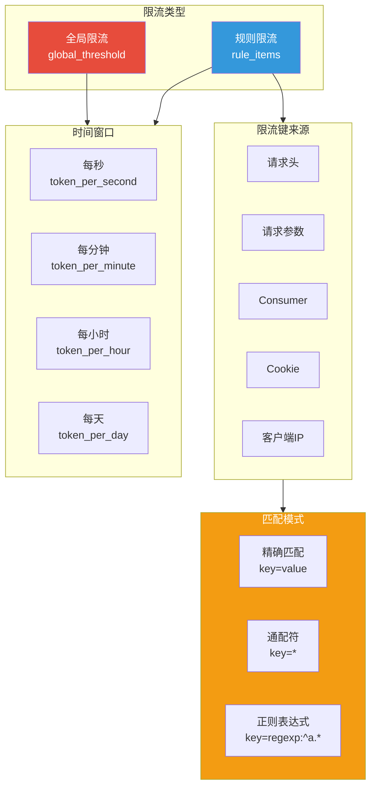
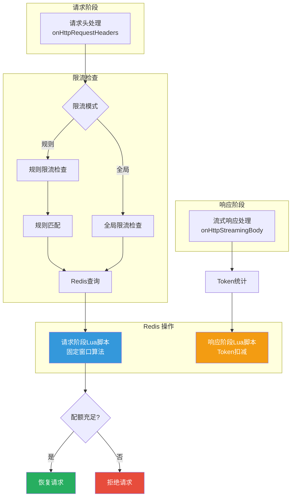

## 引言

在企业级 AI 应用中，**限流（Rate Limiting）**是保障服务稳定性和控制成本的关键机制。不同于传统的请求数限流，AI 场景需要根据实际 Token 消耗进行限流。

**AI Token 限流插件**（ai-token-ratelimit）提供了：
- **Token 级限流**：基于实际 Token 消耗进行限流
- **全局限流**：对整个规则组进行全局 Token 限流
- **规则限流**：根据动态 Key（请求参数、请求头、Cookie、IP、Consumer）进行分组限流
- **灵活匹配**：支持精确匹配、通配符、正则表达式

本文从源码层面深入剖析该插件的设计思想与实现细节。

---

## 插件定位与核心价值

### 核心价值



### 解决的问题

| 问题 | 传统方案 | 插件方案 |
|------|----------|----------|
| **请求数限流** | 按请求数限流，无法控制 Token 成本 | 按 Token 消耗限流，精确控制成本 |
| **单一维度** | 仅支持全局或单用户限流 | 支持多维度、多规则限流 |
| **配置复杂** | 需要编写代码规则 | 声明式配置，支持通配符和正则 |
| **统计不精确** | 估算请求数，误差大 | 依赖 ai-statistics 插件精确统计 |

---

## 插件架构设计

### 整体架构



### 固定窗口算法

**请求阶段 Lua 脚本**：

```lua
-- main.go:52-59
local ttl = redis.call('ttl', KEYS[1])
if ttl < 0 then
    redis.call('set', KEYS[1], ARGV[1], 'EX', ARGV[2])
    return {ARGV[1], ARGV[1], ARGV[2]}
end
return {ARGV[1], redis.call('get', KEYS[1]), ttl}
```

**响应阶段 Lua 脚本**：

```lua
-- main.go:60-67
local ttl = redis.call('ttl', KEYS[1])
if ttl < 0 then
    redis.call('set', KEYS[1], ARGV[1]-ARGV[3], 'EX', ARGV[2])
    return {ARGV[1], ARGV[1]-ARGV[3], ARGV[2]}
end
return {ARGV[1], redis.call('decrby', KEYS[1], ARGV[3]), ttl}
```

**Redis Key 格式**：

```go
// main.go:48-51
const (
    // 全局限流: higress-token-ratelimit:{rule_name}:global_threshold:{time_window}:{count}
    AiTokenGlobalRateLimitFormat = RedisKeyPrefix + ":%s:global_threshold:%d:%d"

    // 规则限流: higress-token-ratelimit:{rule_name}:{limit_type}:{time_window}:{count}:{key_name}:{key_value}
    AiTokenRateLimitFormat = RedisKeyPrefix + ":%s:%s:%d:%d:%s:%s"
)
```

---

## 源码实现分析

### 1. 配置结构定义

```go
// config/config.go (简化版)
type AiTokenRateLimitConfig struct {
    RuleName        string
    GlobalThreshold *ThresholdConfig
    RuleItems       []LimitRuleItem
    RejectedCode    int
    RejectedMsg     string
    RedisClient     wrapper.RedisClient
    CounterMetrics  map[string]proxywasm.MetricCounter
}

type ThresholdConfig struct {
    TimeWindow int64  // 时间窗口（秒）
    Count      int64  // 窗口内允许的 Token 数
}

type LimitRuleItem struct {
    LimitType   LimitRuleItemType
    Key         string
    ConfigItems []LimitConfigItem
    LimitByPerIp *LimitByPerIpConfig
}

type LimitConfigItem struct {
    Key        string
    ConfigType ConfigType
    Regexp     *regexp.Regexp
    IpNet      *util.IpNetList
    TimeWindow int64
    Count      int64
}

type ConfigType int

const (
    ExactType ConfigType = iota
    AllType
    RegexpType
)

type LimitRuleItemType int

const (
    LimitByHeaderType   LimitRuleItemType = iota
    LimitByParamType
    LimitByConsumerType
    LimitByCookieType
    LimitByPerHeaderType
    LimitByPerParamType
    LimitByPerConsumerType
    LimitByPerCookieType
    LimitByPerIpType
)
```

### 2. 请求头处理

```go
// main.go:104-161
func onHttpRequestHeaders(ctx wrapper.HttpContext, cfg config.AiTokenRateLimitConfig) types.Action {
    ctx.DisableReroute()
    limitKey, count, timeWindow := "", int64(0), int64(0)

    if cfg.GlobalThreshold != nil {
        // 全局限流模式
        limitKey = fmt.Sprintf(AiTokenGlobalRateLimitFormat,
            cfg.RuleName, cfg.GlobalThreshold.TimeWindow, cfg.GlobalThreshold.Count)
        count = cfg.GlobalThreshold.Count
        timeWindow = cfg.GlobalThreshold.TimeWindow
    } else {
        // 规则限流模式
        val, ruleItem, configItem := checkRequestAgainstLimitRule(ctx, cfg.RuleItems)
        if ruleItem == nil || configItem == nil {
            // 没有匹配到限流规则直接返回
            return types.ActionContinue
        }

        limitKey = fmt.Sprintf(AiTokenRateLimitFormat,
            cfg.RuleName, ruleItem.LimitType, configItem.TimeWindow, configItem.Count, ruleItem.Key, val)
        count = configItem.Count
        timeWindow = configItem.TimeWindow
    }

    // 保存上下文供响应阶段使用
    ctx.SetContext(LimitRedisContextKey, LimitRedisContext{
        key:    limitKey,
        count:  count,
        window: timeWindow,
    })

    // 执行限流检查
    keys := []interface{}{limitKey}
    args := []interface{}{count, timeWindow}

    err := cfg.RedisClient.Eval(RequestPhaseFixedWindowScript, 1, keys, args, func(response resp.Value) {
        resultArray := response.Array()
        if len(resultArray) != 3 {
            log.Errorf("redis response parse error, response: %v", response)
            proxywasm.ResumeHttpRequest()
            return
        }

        context := LimitContext{
            count:     resultArray[0].Integer(),
            remaining: resultArray[1].Integer(),
            reset:     resultArray[2].Integer(),
        }

        if context.remaining < 0 {
            // 触发限流
            ctx.SetUserAttribute("token_ratelimit_status", "limited")
            ctx.WriteUserAttributeToLogWithKey(wrapper.AILogKey)
            rejected(cfg, context)
        } else {
            proxywasm.ResumeHttpRequest()
        }
    })

    if err != nil {
        log.Errorf("redis call failed: %v", err)
        return types.ActionContinue
    }

    return types.HeaderStopAllIterationAndWatermark
}
```

### 3. 规则匹配

```go
// main.go:188-257
func hitRateRuleItem(ctx wrapper.HttpContext, rule config.LimitRuleItem) (string, *config.LimitRuleItem, *config.LimitConfigItem) {
    switch rule.LimitType {
    // 根据 HTTP 请求头限流
    case config.LimitByHeaderType, config.LimitByPerHeaderType:
        val, err := proxywasm.GetHttpRequestHeader(rule.Key)
        if err != nil {
            return logDebugAndReturnEmpty("failed to get request header %s: %v", rule.Key, err)
        }
        return val, &rule, findMatchingItem(rule.LimitType, rule.ConfigItems, val)

    // 根据 HTTP 请求参数限流
    case config.LimitByParamType, config.LimitByPerParamType:
        parse, err := url.Parse(ctx.Path())
        if err != nil {
            return logDebugAndReturnEmpty("failed to parse request path: %v", err)
        }
        query, err := url.ParseQuery(parse.RawQuery)
        if err != nil {
            return logDebugAndReturnEmpty("failed to parse query params: %v", err)
        }
        val, ok := query[rule.Key]
        if !ok {
            return logDebugAndReturnEmpty("request param %s is empty", rule.Key)
        }
        return val[0], &rule, findMatchingItem(rule.LimitType, rule.ConfigItems, val[0])

    // 根据 consumer 限流
    case config.LimitByConsumerType, config.LimitByPerConsumerType:
        val, err := proxywasm.GetHttpRequestHeader(util.ConsumerHeader)
        if err != nil {
            return logDebugAndReturnEmpty("failed to get request header %s: %v", util.ConsumerHeader, err)
        }
        return val, &rule, findMatchingItem(rule.LimitType, rule.ConfigItems, val)

    // 根据 cookie 中 key 值限流
    case config.LimitByCookieType, config.LimitByPerCookieType:
        cookie, err := proxywasm.GetHttpRequestHeader(CookieHeader)
        if err != nil {
            return logDebugAndReturnEmpty("failed to get request cookie : %v", err)
        }
        val := util.ExtractCookieValueByKey(cookie, rule.Key)
        if val == "" {
            return logDebugAndReturnEmpty("cookie key '%s' extracted from cookie '%s' is empty.", rule.Key, cookie)
        }
        return val, &rule, findMatchingItem(rule.LimitType, rule.ConfigItems, val)

    // 根据客户端 IP 限流
    case config.LimitByPerIpType:
        realIp, err := getDownStreamIp(rule)
        if err != nil {
            log.Warnf("failed to get down stream ip: %v", err)
            return "", &rule, nil
        }
        for _, item := range rule.ConfigItems {
            if _, found, _ := item.IpNet.Get(realIp); !found {
                continue
            }
            return realIp.String(), &rule, &item
        }
    }

    return "", nil, nil
}
```

### 4. 匹配项查找

```go
// main.go:264-281
func findMatchingItem(limitType config.LimitRuleItemType, items []config.LimitConfigItem, key string) *config.LimitConfigItem {
    for _, item := range items {
        // Per 类型，检查 allType 和 regexpType
        if limitType == config.LimitByPerHeaderType ||
            limitType == config.LimitByPerParamType ||
            limitType == config.LimitByPerConsumerType ||
            limitType == config.LimitByPerCookieType {

            if item.ConfigType == config.AllType || // 通配符 *
               (item.ConfigType == config.RegexpType && item.Regexp.MatchString(key)) { // 正则匹配
                return &item
            }
        }

        // 其他类型，直接比较 key
        if item.Key == key {
            return &item
        }
    }
    return nil
}
```

### 5. IP 地址获取

```go
// main.go:283-307
func getDownStreamIp(rule config.LimitRuleItem) (net.IP, error) {
    var (
        realIpStr string
        err       error
    )

    if rule.LimitByPerIp.SourceType == config.HeaderSourceType {
        // 从请求头获取
        realIpStr, err = proxywasm.GetHttpRequestHeader(rule.LimitByPerIp.HeaderName)
        if err == nil {
            // 取第一个 IP（处理 X-Forwarded-For 格式）
            realIpStr = strings.Split(strings.Trim(realIpStr, " "), ",")[0]
        }
    } else {
        // 从 socket 地址获取
        var bs []byte
        bs, err = proxywasm.GetProperty([]string{"source", "address"})
        realIpStr = string(bs)
    }

    if err != nil {
        return nil, err
    }

    ip := util.ParseIP(realIpStr)
    realIP := net.ParseIP(ip)
    if realIP == nil {
        return nil, fmt.Errorf("invalid ip[%s]", ip)
    }

    return realIP, nil
}
```

### 6. 响应处理

```go
// main.go:163-186
func onHttpStreamingBody(ctx wrapper.HttpContext, cfg config.AiTokenRateLimitConfig, data []byte, endOfStream bool) []byte {
    // 提取 Token 使用信息（依赖 ai-statistics 插件）
    if usage := tokenusage.GetTokenUsage(ctx, data); usage.TotalToken > 0 {
        ctx.SetContext(tokenusage.CtxKeyInputToken, usage.InputToken)
        ctx.SetContext(tokenusage.CtxKeyOutputToken, usage.OutputToken)
    }

    if endOfStream {
        if ctx.GetContext(tokenusage.CtxKeyInputToken) == nil ||
           ctx.GetContext(tokenusage.CtxKeyOutputToken) == nil {
            return data
        }

        inputToken := ctx.GetContext(tokenusage.CtxKeyInputToken).(int64)
        outputToken := ctx.GetContext(tokenusage.CtxKeyOutputToken).(int64)

        limitRedisContext, ok := ctx.GetContext(LimitRedisContextKey).(LimitRedisContext)
        if !ok {
            return data
        }

        // 扣减配额
        keys := []interface{}{limitRedisContext.key}
        args := []interface{}{limitRedisContext.count, limitRedisContext.window, inputToken + outputToken}

        err := cfg.RedisClient.Eval(ResponsePhaseFixedWindowScript, 1, keys, args, nil)
        if err != nil {
            log.Errorf("redis call failed: %v", err)
        }
    }

    return data
}
```

### 7. 拒绝响应

```go
// main.go:313-323
func rejected(cfg config.AiTokenRateLimitConfig, context LimitContext) {
    headers := make(map[string][]string)
    headers[RateLimitResetHeader] = []string{strconv.Itoa(context.reset)}

    _ = proxywasm.SendHttpResponseWithDetail(
        cfg.RejectedCode,
        "ai-token-ratelimit.rejected",
        util.ReconvertHeaders(headers),
        []byte(cfg.RejectedMsg),
        -1,
    )

    // 记录限流指标
    route, _ := util.GetRouteName()
    cluster, _ := util.GetClusterName()
    consumer, _ := util.GetConsumer()

    cfg.IncrementCounter(generateMetricName(route, cluster, "none", consumer, TokenRateLimitCount), 1)
}
```

---

## 配置详解

### 全局限流配置

```yaml
rule_name: routeA-global-limit-rule
global_threshold:
  token_per_minute: 1000  # 每分钟 1000 个 token
redis:
  service_name: redis.static
show_limit_quota_header: true
```

### 按参数限流配置

```yaml
rule_name: default_rule
rule_items:
  # 精确匹配
  - limit_by_param: apikey
    limit_keys:
      - key: 9a342114-ba8a-11ec-b1bf-00163e1250b5
        token_per_minute: 10
      - key: a6a6d7f2-ba8a-11ec-bec2-00163e1250b5
        token_per_hour: 100

  # 正则匹配 + 通配符
  - limit_by_per_param: apikey
    limit_keys:
      # 正则：以 a 开头
      - key: "regexp:^a.*"
        token_per_second: 10
      # 正则：以 b 开头
      - key: "regexp:^b.*"
        token_per_minute: 100
      # 通配符：所有其他
      - key: "*"
        token_per_hour: 1000

redis:
  service_name: redis.static
```

### 按 IP 限流配置

```yaml
rule_name: default_rule
rule_items:
  - limit_by_per_ip: from-header-x-forwarded-for
    limit_keys:
      # 精确 IP
      - key: 1.1.1.1
        token_per_day: 10
      # IP 段
      - key: 1.1.1.0/24
        token_per_day: 100
      # 兜底：所有 IP
      - key: 0.0.0.0/0
        token_per_day: 1000

redis:
  service_name: redis.static
```

### 配置参数说明

#### 限流模式配置

| 参数 | 类型 | 必填 | 说明 |
|------|------|------|------|
| `rule_name` | string | 是 | 限流规则名称 |
| `global_threshold` | object | 二选一 | 全局限流配置 |
| `rule_items` | array | 二选一 | 规则限流配置列表 |

#### 阈值配置

| 参数 | 类型 | 必填 | 说明 |
|------|------|------|------|
| `token_per_second` | int | 四选一 | 每秒允许的 token 数 |
| `token_per_minute` | int | 四选一 | 每分钟允许的 token 数 |
| `token_per_hour` | int | 四选一 | 每小时允许的 token 数 |
| `token_per_day` | int | 四选一 | 每天允许的 token 数 |

#### 限流键配置

| limit_by_* 类型 | 说明 | key 值示例 |
|----------------|------|-------------|
| `limit_by_header` | 单个请求头值 | `x-ca-key` |
| `limit_by_per_header` | 每个请求头独立限流 | `x-api-key` |
| `limit_by_param` | 单个 URL 参数值 | `apikey` |
| `limit_by_per_param` | 每个 URL 参数值独立限流 | `token` |
| `limit_by_consumer` | 单个 consumer | - |
| `limit_by_per_consumer` | 每个 consumer 独立限流 | - |
| `limit_by_cookie` | 单个 cookie 值 | `session_id` |
| `limit_by_per_cookie` | 每个 cookie 值独立限流 | `user_id` |
| `limit_by_per_ip` | 每个 IP 独立限流 | `from-header-x-forwarded-for` |

---

## 生产部署最佳实践

### 1. 依赖配置

**必须配合的插件**：

```yaml
# AI 统计插件（提供 Token 统计）
- name: ai-statistics
  priority: 200

# AI Token 限流插件（基于统计进行限流）
- name: ai-token-ratelimit
  priority: 600

# AI 代理插件（实际处理请求）
- name: ai-proxy
  priority: 100
```

### 2. 限流规则设计

**分层限流策略**：

```yaml
rule_items:
  # 第一层：全局兜底
  - limit_by_per_consumer: ''
    limit_keys:
      - key: "*"
        token_per_day: 100000

  # 第二层：用户级别
  - limit_by_consumer: ''
    limit_keys:
      - key: free_user
        token_per_day: 1000
      - key: premium_user
        token_per_day: 10000

  # 第三层：API Key 级别
  - limit_by_per_param: apikey
    limit_keys:
      - key: "regexp:^paid_.*"
        token_per_minute: 100
```

### 3. Redis 性能优化

| 优化项 | 说明 | 建议 |
|--------|------|------|
| **连接池** | 复用 Redis 连接 | 使用 Redis Cluster 模式 |
| **Lua 脚本** | 原子操作 | 使用 EVAL 执行 Lua 脚本 |
| **Key 过期** | 自动清理过期数据 | 配置合理的 TTL |
| **集群部署** | Redis Cluster | 使用 Redis Cluster 模式 |

### 4. 监控告警

**Prometheus 监控**：

```promql
# 限流拒绝率
rate(route.*.metric.token_ratelimit_count[5m]) /
rate(route.*.metric.llm_duration_count[5m])

# Redis 错误率
rate(ai_token_ratelimit_redis_error_total[5m])
```

### 5. 降级策略

```yaml
# 降级配置
fallback:
  on_redis_error: "allow"  # Redis 故障时放行
  on_parse_error: "allow"  # 解析错误时放行
  default_action: "allow"  # 默认放行（生产环境）
  # default_action: "deny"   # 默认拦截（高安全场景）
```

---

## 技术亮点总结

### 1. Token 级精确限流

- **实际消耗**：依赖 ai-statistics 插件精确统计 Token
- **流式支持**：正确处理流式响应的 Token 统计
- **响应扣减**：响应阶段扣减配额，请求阶段预检查

### 2. 灵活的限流维度

| 维度 | 配置方式 | 使用场景 |
|------|----------|----------|
| **全局** | `global_threshold` | 整体资源控制 |
| **Consumer** | `limit_by_consumer` | 多租户隔离 |
| **API Key** | `limit_by_param` | API 级别控制 |
| **IP** | `limit_by_per_ip` | 防止单个 IP 过度使用 |
| **Header** | `limit_by_header` | 基于自定义头限流 |

### 3. 强大的匹配能力

- **精确匹配**：`key: "exact_value"`
- **通配符**：`key: "*"`
- **正则表达式**：`key: "regexp:^prefix.*"`

### 4. 固定窗口算法

- **原子操作**：使用 Lua 脚本保证原子性
- **简单高效**：算法简单，性能开销小
- **TTL 自动清理**：自动清理过期数据

---

## 结语

AI Token 限流插件通过 **Token 级精确限流**和**灵活的规则配置**，为企业级 AI 应用提供了完善的流量控制能力：

1. **精确计费**：基于实际 Token 消耗进行限流
2. **多维度限流**：支持 Consumer、API Key、IP 等多种维度
3. **强大匹配**：支持精确、通配符、正则表达式三种匹配模式
4. **高性能**：基于 Redis 固定窗口算法，性能开销小

该插件是实现 AI 服务精细化运营和成本控制的核心组件。
