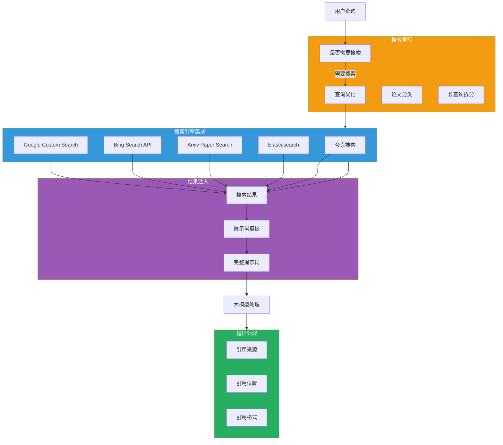
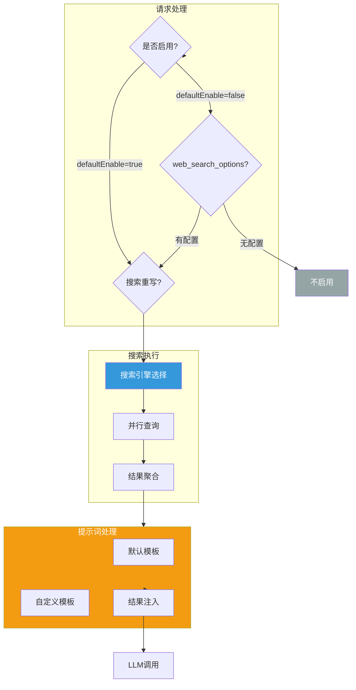

## 引言

在大模型应用中，**知识时效性**是一个关键挑战。预训练模型的知识截止日期限制了其回答时效性问题的能力，而 **搜索增强（Search-Augmented Generation, RAG）** 是解决这一问题的有效方案。

**AI 搜索增强插件**（ai-search）提供了：
- **多搜索引擎集成**：支持 Google、Bing、Arxiv、Elasticsearch、夸克等
- **智能搜索重写**：使用 LLM 优化查询，自动识别是否需要搜索
- **提示词注入**：将搜索结果自动注入到提示词模板
- **引用来源**：可选择在回答中添加引用来源

本文从源码层面深入剖析该插件的设计思想与实现细节。

---

## 插件定位与核心价值

### 核心价值



### 解决的问题

| 问题 | 传统 RAG 方案 | 插件方案 |
|------|--------------|----------|
| **搜索引擎限制** | 单一搜索引擎，覆盖有限 | 多引擎并行，覆盖全面 |
| **查询质量** | 用户直接输入，效果不稳定 | LLM 智能重写，优化查询 |
| **论文搜索** | 难以精准匹配论文类别 | 自动识别 Arxiv 类别 |
| **私有知识库** | 需要单独的向量检索 | 集成 Elasticsearch 混合搜索 |
| **引用展示** | 需要手动添加引用 | 自动注入引用，可配置格式 |

---

## 插件架构设计

### 整体架构



### 配置结构

```go
type AISearchConfig struct {
    // 基础配置
    DefaultEnable      bool
    NeedReference     bool
    ReferenceFormat   string
    ReferenceLocation string
    DefaultLang       string
    PromptTemplate    string

    // 搜索引擎配置
    SearchFrom []SearchEngineConfig

    // 搜索重写配置
    SearchRewrite *SearchRewriteConfig
}

type SearchEngineConfig struct {
    Type     string  // google, bing, arxiv, elasticsearch, quark
    ApiKey    string
    ServiceName string
    ServicePort int
    Count     int
    Start     int
    TimeoutMillisecond int
    OptionArgs map[string]string

    // 特定引擎配置
    Cx                string  // Google: 自定义搜索引擎 ID
    ArxivCategory     string  // Arxiv: 论文类别
    Index             string  // Elasticsearch: 索引名称
    ContentField      string  // Elasticsearch: 内容字段
    SemanticTextField string  // Elasticsearch: 向量字段
    LinkField         string  // Elasticsearch: 链接字段
    TitleField        string  // Elasticsearch: 标题字段
    Username          string  // Elasticsearch: 用户名
    Password          string  // Elasticsearch: 密码
    ContentMode       string  // Quark: summary/full
}

type SearchRewriteConfig struct {
    LlmServiceName     string
    LlmServicePort     int
    LlmApiKey          string
    LlmUrl             string
    LlmModelName       string
    TimeoutMillisecond int
    MaxCount           int
}
```

---

## 核心功能实现

### 1. 搜索引擎抽象

```go
// 搜索引擎接口
type SearchEngine interface {
    Search(ctx HttpContext, query string, config SearchEngineConfig) ([]SearchResult, error)
}

// 搜索结果结构
type SearchResult struct {
    Title   string
    Link    string
    Snippet string
    Source  string
}
```

### 2. Google 搜索引擎

```go
type GoogleSearchEngine struct{}

func (e *GoogleSearchEngine) Search(ctx HttpContext, query string, config SearchEngineConfig) ([]SearchResult, error) {
    // 构建 Google Custom Search API 请求
    apiKey := config.ApiKey
    cx := config.Cx
    count := config.Count
    start := config.Start

    url := fmt.Sprintf(
        "https://www.googleapis.com/customsearch/v1?key=%s&cx=%s&q=%s&num=%d&start=%d",
        apiKey, cx, url.QueryEscape(query), count, start,
    )

    // 发送 HTTP 请求
    resp, err := httpGet(url, config.TimeoutMillisecond)
    if err != nil {
        return nil, err
    }

    // 解析响应
    var result GoogleSearchResponse
    if err := json.Unmarshal(resp, &result); err != nil {
        return nil, err
    }

    // 转换为统一格式
    results := make([]SearchResult, len(result.Items))
    for i, item := range result.Items {
        results[i] = SearchResult{
            Title:   item.Title,
            Link:    item.Link,
            Snippet: item.Snippet,
            Source:  "google",
        }
    }

    return results, nil
}
```

### 3. Arxiv 搜索引擎

```go
type ArxivSearchEngine struct{}

func (e *ArxivSearchEngine) Search(ctx HttpContext, query string, config SearchEngineConfig) ([]SearchResult, error) {
    // 构建 Arxiv API 请求
    count := config.Count
    start := config.Start
    category := config.ArxivCategory

    url := fmt.Sprintf(
        "http://export.arxiv.org/api/query?search_query=all:%s&start=%d&max_results=%d",
        url.QueryEscape(query), start, count,
    )

    if category != "" {
        url += fmt.Sprintf("&cat:%s", category)
    }

    // 发送请求
    resp, err := httpGet(url, config.TimeoutMillisecond)
    if err != nil {
        return nil, err
    }

    // 解析 Atom 格式响应
    return parseArxivResponse(resp)
}
```

### 4. Elasticsearch 搜索引擎

```go
type ElasticsearchSearchEngine struct{}

func (e *ElasticsearchSearchEngine) Search(ctx HttpContext, query string, config SearchEngineConfig) ([]SearchResult, error) {
    // 构建 Elasticsearch 查询
    index := config.Index
    contentField := config.ContentField
    semanticTextField := config.SemanticTextField

    // 混合搜索：BM25 + 向量搜索
    queryBody := map[string]interface{}{
        "size": config.Count,
        "query": map[string]interface{}{
            "match": map[string]interface{}{
                contentField: query,
            },
        },
        "rank": map[string]interface{}{
            "rrf": map[string]interface{}{
                "query": map[string]interface{}{
                    "match": map[string]interface{}{
                        contentField: query,
                    },
                },
                "knn": map[string]interface{}{
                    "field": semanticTextField,
                    "query_vector": []float32{},  // 需要调用 Embedding 服务
                    "k": 10,
                    "num_candidates": 50,
                },
            },
        },
    }

    // 发送查询
    url := fmt.Sprintf("http://%s:%d/%s/_search",
        config.ServiceName, config.ServicePort, index)

    resp, err := httpPost(url, queryBody, config.TimeoutMillisecond, config.Username, config.Password)
    if err != nil {
        return nil, err
    }

    // 解析响应
    return parseElasticsearchResponse(resp, config)
}
```

### 5. 搜索重写

```go
type SearchRewriter struct {
    config *SearchRewriteConfig
}

func (r *SearchRewriter) RewriteQuery(ctx HttpContext, originalQuery string) ([]string, error) {
    // 调用 LLM 进行搜索重写
    prompt := fmt.Sprintf(
        `分析以下用户问题，判断是否需要查询搜索引擎来获得最新信息。

用户问题：%s

请：
1. 判断是否需要搜索引擎（是/否）
2. 如果需要，生成 %d 个优化的搜索查询

返回格式（JSON）：
{
    "need_search": true/false,
    "queries": ["query1", "query2", ...]
}`,
        originalQuery, r.config.MaxCount,
    )

    // 调用 LLM API
    llmResp, err := r.callLLM(prompt)
    if err != nil {
        return nil, err
    }

    // 解析响应
    var result RewriteResult
    if err := json.Unmarshal(llmResp, &result); err != nil {
        return nil, err
    }

    if !result.NeedSearch {
        return nil, nil  // 不需要搜索
    }

    return result.Queries, nil
}

type RewriteResult struct {
    NeedSearch bool     `json:"need_search"`
    Queries    []string `json:"queries"`
}
```

### 6. 提示词模板

**默认模板**：

```
# Search Results:
{search_results}

# Please answer this question:
{question}

Based on the search results above, provide a comprehensive answer.
Cite your sources using [1], [2] etc.
```

**自定义模板示例**：

```yaml
promptTemplate: |
  参考以下搜索结果回答用户问题：

  {search_results}

  用户问题：{question}

  当前日期：{cur_date}

  要求：
  1. 基于搜索结果提供准确答案
  2. 标注信息来源
  3. 如果搜索结果不足，说明需要更多信息
```

---

## 配置详解

### 基础配置

```yaml
defaultEnable: true
needReference: true
referenceFormat: "**数据来源:**\n%s"
referenceLocation: "tail"
defaultLang: "zh-CN"
promptTemplate: |
  # 搜索结果
  {search_results}

  # 问题
  {question}

searchFrom:
  - type: google
    apiKey: "your-google-api-key"
    cx: "your-search-engine-id"
    serviceName: google-svc.dns
    servicePort: 443
    count: 5
```

### 搜索重写配置

```yaml
searchRewrite:
  llmServiceName: llm-svc.dns
  llmServicePort: 443
  llmApiKey: "your-llm-api-key"
  llmUrl: "https://api.example.com/v1/chat/completions"
  llmModelName: "gpt-3.5-turbo"
  timeoutMillisecond: 15000
  maxCount: 3
```

### Elasticsearch 配置

```yaml
searchFrom:
  - type: elasticsearch
    serviceName: es-svc.static
    servicePort: 9200
    index: knowledge_base
    contentField: content
    semanticTextField: semantic_text
    linkField: url
    titleField: title
```

### 按需启用配置

```yaml
defaultEnable: false  # 仅在请求中包含 web_search_options 时启用

searchFrom:
  - type: google
    apiKey: "your-google-api-key"
    cx: "your-search-engine-id"
    serviceName: google-svc.dns
    servicePort: 443
```

**请求示例**：

```json
{
  "model": "gpt-4",
  "messages": [
    {"role": "user", "content": "2024年美国总统大选结果如何？"}
  ],
  "web_search_options": {
    "search_context_size": "high"
  }
}
```

---

## 生产部署最佳实践

### 1. 搜索引擎选择策略

| 场景 | 推荐引擎 | 配置建议 |
|------|----------|----------|
| **通用搜索** | Google + Bing | 双引擎并行，提高覆盖率 |
| **论文搜索** | Arxiv | 指定相关 category（如 cs.AI） |
| **私有知识库** | Elasticsearch | 配置混合搜索（BM25 + 向量） |
| **中文搜索** | 夸克 | 使用 summary 模式 |

### 2. 性能优化

| 优化项 | 说明 | 建议 |
|--------|------|------|
| **并发查询** | 多个搜索引擎并行查询 | 使用 goroutine 并发 |
| **超时控制** | 避免等待慢速引擎 | 设置合理的 timeoutMillisecond |
| **结果数量** | 控制单次查询返回结果数 | count 设置为 5-10 |
| **缓存策略** | 相同查询复用结果 | 可配合 ai-cache 插件 |

### 3. 搜索重写优化

```yaml
searchRewrite:
  # 根据场景调整 maxCount
  maxCount: 3  # 简单问题使用较少查询
  timeoutMillisecond: 10000  # 控制重写超时

  # 选择合适的模型
  llmModelName: "gpt-3.5-turbo"  # 成本优化
  # llmModelName: "gpt-4"         # 质量优化
```

### 4. 引擎 API 密钥管理

| 引擎 | API 密钥获取 | 成本考虑 |
|------|------------|----------|
| **Google** | [Google Custom Search API](https://programmablesearchengine.google.com/) | 每天 100 次免费 |
| **Bing** | [Bing Search API](https://www.microsoft.com/en-us/bing/apis/search-api) | 每 1000 次查询 $X |
| **Arxiv** | 无需密钥 | 免费 |
| **夸克** | 需要申请 | 按使用量计费 |

### 5. 监控指标

```promql
# 搜索调用次数
rate(ai_search_requests_total[5m])

# 搜索重写次数
rate(ai_search_rewrite_requests_total[5m])

# 搜索引擎延迟
histogram_quantile(ai_search_engine_duration_seconds{engine="google"}, 0.95)

# 搜索结果数量
histogram_quantile(ai_search_result_count, 0.95)
```

---

## 技术亮点总结

### 1. 多搜索引擎并行

- **并行查询**：同时查询多个搜索引擎，提高覆盖率
- **结果聚合**：统一不同引擎的响应格式
- **容错机制**：单个引擎故障不影响其他引擎

### 2. LLM 智能重写

- **需求判断**：自动识别是否需要搜索
- **查询优化**：将自然语言转换为搜索关键词
- **论文分类**：Arxiv 搜索时自动识别论文类别

### 3. 灵活的提示词模板

- **占位符**：支持 `{search_results}`、`{question}`、`{cur_date}`
- **自定义格式**：用户可自定义模板结构和要求
- **引用控制**：可配置是否添加引用及引用格式

### 4. 私有知识库集成

- **Elasticsearch 集成**：支持 ES 作为私有知识库
- **混合搜索**：BM25 + 向量搜索的 RRF 算法
- **字段映射**：灵活配置内容、向量、链接、标题字段

---

## 结语

AI 搜索增强插件通过 **多搜索引擎集成**和 **LLM 智能重写**，为大模型应用提供了实时知识增强能力：

1. **多源覆盖**：集成 Google、Bing、Arxiv、Elasticsearch 等主流搜索引擎
2. **智能重写**：使用 LLM 优化查询质量，自动识别搜索需求
3. **灵活注入**：自动将搜索结果注入提示词模板
4. **引用支持**：可选择在回答中添加引用来源

该插件是实现 RAG 应用的核心组件，能够显著提升大模型回答的时效性和准确性。
