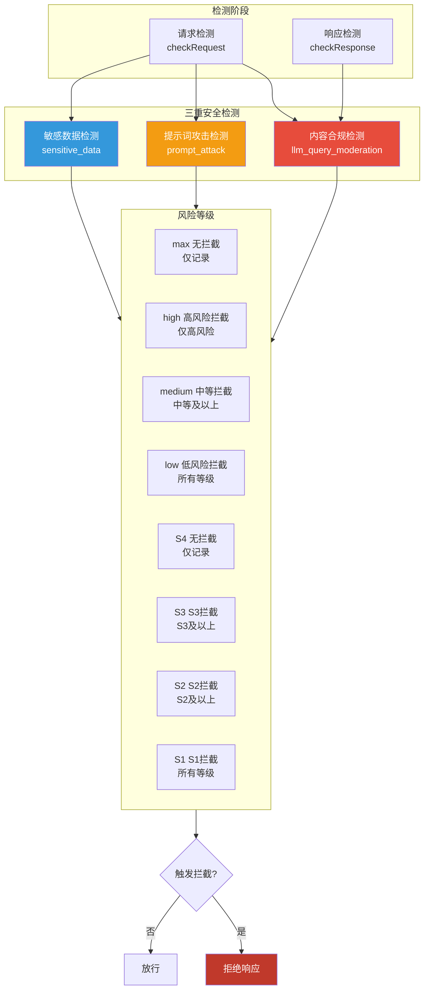
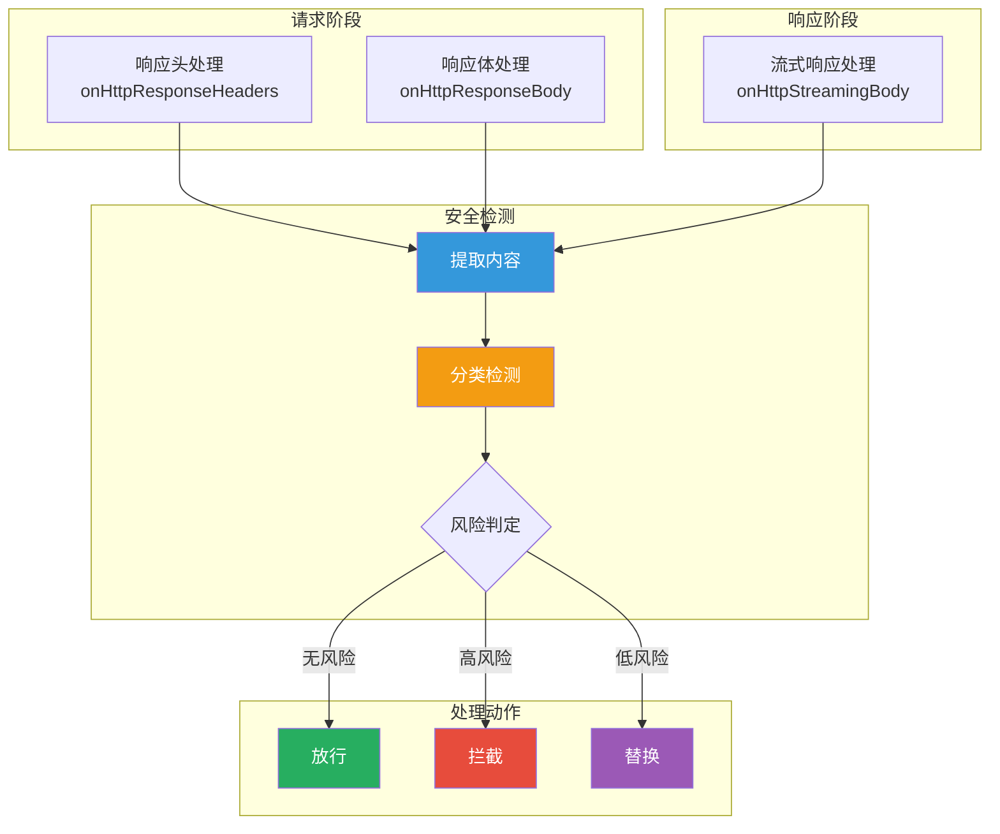

## 引言

在企业级 AI 应用中，**内容安全与合规**是不可忽视的关键问题。用户输入可能包含违规内容，AI 生成的内容也可能存在安全风险。

**AI 安全防护插件**（ai-security-guard）提供了：
- **内容合规检测**：检测色情、暴力、政治等违规内容
- **提示词攻击检测**：识别对抗性提示词和越狱尝试
- **敏感数据检测**：识别个人信息等敏感数据
- **多协议支持**：支持 OpenAI、Claude、Gemini 等协议

本文从源码层面深入剖析该插件的设计思想与实现细节。

---

## 插件定位与核心价值

### 核心价值



### 解决的问题

| 问题 | 传统方案 | 插件方案 |
|------|----------|----------|
| **合规检测** | 依赖 LLM 自我约束 | 网关层主动拦截 |
| **提示词攻击** | 无法识别对抗性输入 | 专门的提示词攻击检测 |
| **敏感数据** | 容易泄露个人信息 | 自动识别并拦截 |
| **协议差异** | 需针对每种协议适配 | 统一抽象，多协议支持 |

---

## 插件架构设计

### 整体架构



### 配置结构

```go
type AISecurityGuardConfig struct {
    // 服务配置
    ServiceName  string
    ServicePort  int
    ServiceHost   string
    AccessKey     string
    SecretKey     string
    SecurityToken string
    Action        string

    // 检测配置
    CheckRequest  bool
    CheckResponse bool
    RequestCheckService  string
    ResponseCheckService string

    // 内容提取配置
    RequestContentJsonPath       string
    ResponseContentJsonPath      string
    ResponseStreamContentJsonPath string

    // 拦截配置
    DenyCode       int
    DenyMessage   string
    Protocol       string

    // 风险等级配置
    ContentModerationLevelBar string  // max/high/medium/low
    PromptAttackLevelBar     string  // max/high/medium/low
    SensitiveDataLevelBar     string  // S4/S3/S2/S1

    // 超时和限制
    Timeout      int
    BufferLimit  int

    // 消费者特定配置
    ConsumerSpecificRequestCheckService  map[string]string
    ConsumerSpecificResponseCheckService map[string]string
}
```

---

## 核心功能实现

### 1. 内容提取

```go
// 从请求体中提取待检测内容
func extractRequestContent(body []byte, config AISecurityGuardConfig) string {
    jsonPath := config.RequestContentJsonPath
    if jsonPath == "" {
        jsonPath = "messages.@reverse.0.content"  // 默认 OpenAI 格式
    }

    result := gjson.GetBytes(body, jsonPath)
    if result.Exists() {
        return result.String()
    }
    return ""
}

// 从响应体中提取待检测内容
func extractResponseContent(body []byte, config AISecurityGuardConfig) string {
    jsonPath := config.ResponseContentJsonPath
    if jsonPath == "" {
        jsonPath = "choices.0.message.content"  // 默认 OpenAI 格式
    }

    result := gjson.GetBytes(body, jsonPath)
    if result.Exists() {
        return result.String()
    }
    return ""
}

// 从流式响应中提取内容
func extractStreamingContent(chunk []byte, config AISecurityGuardConfig) string {
    jsonPath := config.ResponseStreamContentJsonPath
    if jsonPath == "" {
        jsonPath = "choices.0.delta.content"  // 默认 OpenAI 格式
    }

    result := gjson.GetBytes(chunk, jsonPath)
    if result.Exists() {
        return result.String()
    }
    return ""
}
```

### 2. 阿里云内容安全 API 调用

```go
type AliyunContentSecurityClient struct {
    serviceName  string
    servicePort  int
    serviceHost   string
    accessKey     string
    secretKey     string
    securityToken string
    action        string
    timeout       int
}

func (c *AliyunContentSecurityClient) Check(content string, service string) (*SecurityCheckResult, error) {
    // 构建请求体
    requestBody := map[string]interface{}{
        "Service": service,
        "Content": content,
    }

    // 序列化请求
    jsonData, _ := json.Marshal(requestBody)

    // 构建 HTTP 请求
    url := fmt.Sprintf("https://%s:%d/", c.serviceHost, c.servicePort)
    url = c.action + "/" + c.service

    // 发送请求
    resp, err := httpPost(url, jsonData, c.timeout, c.accessKey, c.secretKey)
    if err != nil {
        return nil, err
    }

    // 解析响应
    var result SecurityCheckResponse
    if err := json.Unmarshal(resp, &result); err != nil {
        return nil, err
    }

    return &result.Data, nil
}

type SecurityCheckResult struct {
    RiskLevel      string `json:"riskLevel"`      // max/high/medium/low
    RiskLabels     []string `json:"riskLabels"`     // 风险标签
    SuggestionText string `json:"suggestionText"` // 建议回答
}
```

### 3. 风险判定逻辑

```go
type RiskLevel int

const (
    RiskLevelMax RiskLevel = iota
    RiskLevelHigh
    RiskLevelMedium
    RiskLevelLow
)

func shouldBlock(result *SecurityCheckResult, config AISecurityGuardConfig) bool {
    riskLevel := parseRiskLevel(result.RiskLevel)
    bar := parseLevelBar(config.ContentModerationLevelBar)

    // max 级别不拦截
    if bar == RiskLevelMax {
        return false
    }

    // 根据阈值判定
    switch riskLevel {
    case RiskLevelHigh:
        return bar >= RiskLevelHigh
    case RiskLevelMedium:
        return bar >= RiskLevelMedium
    case RiskLevelLow:
        return bar >= RiskLevelLow
    }

    return false
}

func parseRiskLevel(level string) RiskLevel {
    switch level {
    case "high":
        return RiskLevelHigh
    case "medium":
        return RiskLevelMedium
    case "low":
        return RiskLevelLow
    default:
        return RiskLevelMax
    }
}

func parseLevelBar(bar string) RiskLevel {
    switch bar {
    case "high":
        return RiskLevelHigh
    case "medium":
        return RiskLevelMedium
    case "low":
        return RiskLevelLow
    default:
        return RiskLevelMax
    }
}
```

### 4. 请求检测

```go
func onHttpRequestBody(ctx wrapper.HttpContext, config AISecurityGuardConfig, body []byte) types.Action {
    if !config.CheckRequest {
        return types.ActionContinue
    }

    // 提取检测内容
    content := extractRequestContent(body, config)
    if content == "" {
        return types.ActionContinue
    }

    // 检查内容长度
    if len(content) > config.BufferLimit {
        // 分段检测
        return checkLongContent(ctx, config, content, RequestPhase)
    }

    // 执行检测
    result, err := config.SecurityClient.Check(content, config.RequestCheckService)
    if err != nil {
        log.Errorf("security check failed: %v", err)
        return types.ActionContinue
    }

    // 判定是否拦截
    if shouldBlock(result, config) {
        return denyRequest(ctx, config, result)
    }

    return types.ActionContinue
}
```

### 5. 响应检测

```go
func onHttpResponseBody(ctx wrapper.HttpContext, config AISecurityGuardConfig, body []byte) types.Action {
    if !config.CheckResponse {
        return types.ActionContinue
    }

    // 提取检测内容
    content := extractResponseContent(body, config)
    if content == "" {
        return types.ActionContinue
    }

    // 执行检测
    result, err := config.SecurityClient.Check(content, config.ResponseCheckService)
    if err != nil {
        log.Errorf("security check failed: %v", err)
        return types.ActionContinue
    }

    // 判定是否拦截
    if shouldBlock(result, config) {
        return denyResponse(ctx, config, result)
    }

    return types.ActionContinue
}
```

### 6. 流式响应检测

```go
func onHttpStreamingBody(ctx wrapper.HttpContext, config AISecurityGuardConfig, chunk []byte, endOfStream bool) []byte {
    if !config.CheckResponse {
        return chunk
    }

    // 提取流式内容
    content := extractStreamingContent(chunk, config)
    if content == "" {
        return chunk
    }

    // 缓冲流式内容
    bufferKey := "security_buffer"
    existingBuffer := ctx.GetStringContext(bufferKey, "")
    newBuffer := existingBuffer + content
    ctx.SetContext(bufferKey, newBuffer)

    // 仅在流结束时检测
    if !endOfStream {
        return chunk
    }

    // 执行检测
    result, err := config.SecurityClient.Check(newBuffer, config.ResponseCheckService)
    if err != nil {
        log.Errorf("security check failed: %v", err)
        return chunk
    }

    // 判定是否拦截
    if shouldBlock(result, config) {
        // 返回拦截响应
        denyResponse := generateDenyResponse(config, result)
        return []byte(denyResponse)
    }

    return chunk
}
```

### 7. 拦截响应生成

```go
func generateDenyResponse(config AISecurityGuardConfig, result *SecurityCheckResult) string {
    // 优先使用配置的自定义消息
    if config.DenyMessage != "" {
        return config.DenyMessage
    }

    // 使用阿里云返回的建议回答
    if result.SuggestionText != "" {
        return generateOpenAIResponse(result.SuggestionText)
    }

    // 使用内置兜底回答
    return generateOpenAIResponse("很抱歉，我无法回答您的问题")
}

func generateOpenAIResponse(content string) string {
    response := map[string]interface{}{
        "id":      "chatcmpl-" + generateUUID(),
        "object":  "chat.completion",
        "created": time.Now().Unix(),
        "model":   "gpt-3.5-turbo",
        "choices": []map[string]interface{}{
            {
                "index": 0,
                "message": map[string]interface{}{
                    "role":    "assistant",
                    "content": content,
                },
                "finish_reason": "stop",
            },
        },
    }

    jsonData, _ := json.Marshal(response)
    return string(jsonData)
}
```

---

## 配置详解

### 基础配置

```yaml
serviceName: safecheck.dns
servicePort: 443
serviceHost: "green-cip.cn-shanghai.aliyuncs.com"
accessKey: "YOUR_ACCESS_KEY"
secretKey: "YOUR_SECRET_KEY"
action: "llm_query_moderation"

# 检测配置
checkRequest: true
checkResponse: false

# 拦截配置
denyCode: 200
denyMessage: "很抱歉，我无法回答您的问题"

# 内容提取路径（默认 OpenAI 格式）
requestContentJsonPath: "messages.@reverse.0.content"
responseContentJsonPath: "choices.0.message.content"
responseStreamContentJsonPath: "choices.0.delta.content"
```

### 风险等级配置

```yaml
# 内容合规检测等级
contentModerationLevelBar: high  # max/high/medium/low

# 提示词攻击检测等级
promptAttackLevelBar: medium  # max/high/medium/low

# 敏感数据检测等级
sensitiveDataLevelBar: S3  # S4/S3/S2/S1
```

**等级说明**：

| 等级 | 内容合规/提示词攻击 | 敏感数据 | 说明 |
|------|------------------|----------|------|
| **max** | 不拦截 | 不拦截 | 仅记录，不拦截 |
| **high** | 仅 high 拦截 | - | 拦截高风险内容 |
| **medium** | medium 及以上拦截 | - | 拦截中高风险内容 |
| **low** | low 及以上拦截 | - | 拦截所有风险内容 |
| **S4** | - | 不拦截 | 仅记录，不拦截 |
| **S3** | - | S3 拦截 | 拦截 S3 敏感数据 |
| **S2** | - | S2 及以上拦截 | 拦截 S2/S1 敏感数据 |
| **S1** | - | 全部拦截 | 拦截所有敏感数据 |

### 消费者特定配置

```yaml
# 为不同消费者指定不同的检测服务
consumerSpecificRequestCheckService:
  consumerA: llm_query_moderation_strict
  consumerB: llm_query_moderation_relaxed

consumerSpecificResponseCheckService:
  consumerA: llm_response_moderation_strict
  consumerB: llm_response_moderation_relaxed
```

### 非标准协议配置

```yaml
protocol: original

# 自定义内容提取路径（如百炼协议）
requestContentJsonPath: "input.prompt"
responseContentJsonPath: "output.text"
```

---

## 生产部署最佳实践

### 1. 内容安全服务选择

| 服务类型 | 说明 | 使用场景 |
|----------|------|----------|
| **llm_query_moderation** | 输入内容合规检测 | 检测用户输入 |
| **llm_response_moderation** | 输出内容合规检测 | 检测模型输出 |
| **自定义服务** | 自定义规则 | 特定业务需求 |

### 2. 性能优化

| 优化项 | 说明 | 建议 |
|--------|------|------|
| **超时设置** | 避免阻塞请求 | timeout 设置为 2000ms |
| **分段检测** | 处理超长内容 | bufferLimit 设置为 1000 |
| **异步检测** | 非阻塞方式检测 | 配合后台队列 |

### 3. 监控告警

```promql
# 内容安全检测次数
rate(ai_security_guard_request_check_total[5m])

# 内容安全拦截次数
rate(ai_security_guard_request_deny_total[5m])

# 检测失败告警
rate(ai_security_guard_check_error_total[5m]) > 0.01
```

### 4. 告警消息优化

```yaml
# 提供友好的拦截消息
denyMessage: |
  您的提问包含了不适当的内容，无法为您提供回答。请修改后重试。

  如有疑问，请联系客服。
```

### 5. 分级检测策略

```yaml
# 对不同用户使用不同的检测策略
consumerSpecificRequestCheckService:
  # VIP 用户：宽松检测
  vip_user: llm_query_moderation_relaxed
  # 普通用户：严格检测
  normal_user: llm_query_moderation_strict
  # 测试用户：仅记录不拦截
  test_user: llm_query_moderation_monitor_only
```

---

## 技术亮点总结

### 1. 三重安全检测

- **内容合规**：检测色情、暴力、政治等违规内容
- **提示词攻击**：识别对抗性提示词和越狱尝试
- **敏感数据**：识别个人信息等敏感数据

### 2. 灵活的风险等级

| 风险类型 | 等级 | 拦截策略 |
|----------|------|----------|
| **内容合规** | max/high/medium/low | 可配置拦截阈值 |
| **提示词攻击** | max/high/medium/low | 可配置拦截阈值 |
| **敏感数据** | S4/S3/S2/S1 | 可配置拦截阈值 |

### 3. 多协议支持

- **OpenAI 协议**：默认支持 OpenAI 格式
- **Claude 协议**：支持 Anthropic Claude 格式
- **Gemini 协议**：支持 Google Gemini 格式
- **原始协议**：支持自定义 JSONPath 提取

### 4. 消费者差异化

- **服务配置映射**：不同 consumer 使用不同检测服务
- **精细化控制**：VIP 用户可用宽松策略，普通用户使用严格策略
- **A/B 测试**：可配置不同的检测服务进行对比

---

## 结语

AI 安全防护插件通过 **三重安全检测机制**和 **灵活的风险等级配置**，为企业级 AI 应用提供了完善的内容安全保障：

1. **内容合规**：检测并拦截色情、暴力、政治等违规内容
2. **提示词攻击**：识别并阻止对抗性提示词和越狱尝试
3. **敏感数据**：识别并保护个人信息等敏感数据
4. **多协议支持**：统一抽象，支持 OpenAI、Claude、Gemini 等协议

该插件是实现 AI 应用合规运营的必备组件，能够有效降低内容安全风险。
