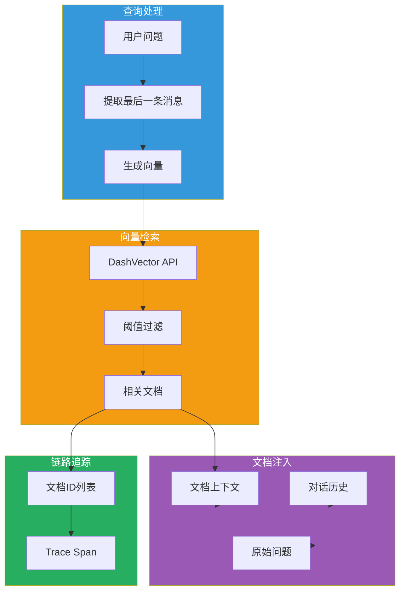
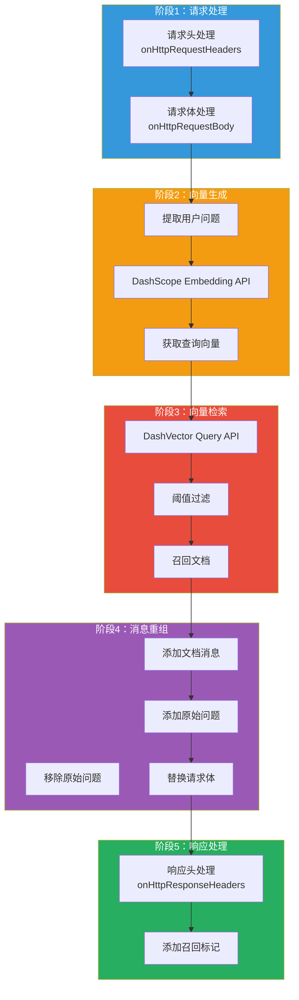

## 引言

在大模型应用中，**知识增强（Retrieval Augmented Generation, RAG）** 是提升模型回答质量的关键技术。通过检索相关文档并将其注入到提示词中，可以显著改善模型对专业领域和时效性问题的回答能力。

**AI RAG 插件**（ai-rag）提供了：
- **向量检索集成**：对接阿里云 DashVector 向量检索服务
- **语义搜索**：使用 DashScope Embedding API 生成查询向量
- **文档注入**：自动将检索到的文档注入到对话历史
- **链路追踪**：支持在 trace span 中记录检索到的文档 ID

本文从源码层面深入剖析该插件的设计思想与实现细节。

---

## 插件定位与核心价值

### 核心价值



### 解决的问题

| 问题 | 传统方案 | 插件方案 |
|------|----------|----------|
| **向量检索** | 需要单独的检索服务 | 网关层集成 DashVector |
| **文档注入** | 手动拼接上下文 | 自动注入到对话历史 |
| **阈值过滤** | 后处理过滤 | 检索时自动过滤 |
| **可观测性** | 难以追踪检索来源 | 自动记录文档 ID 到 trace |

---

## 插件架构设计

### 整体架构



### 配置结构

```go
type AIRagConfig struct {
    // DashScope 配置（用于向量生成）
    DashScopeClient      wrapper.HttpClient
    DashScopeAPIKey      string

    // DashVector 配置（用于向量检索）
    DashVectorClient     wrapper.HttpClient
    DashVectorAPIKey     string
    DashVectorCollection string  // Collection 名称
    DashVectorTopK       int32   // 召回数量
    DashVectorThreshold  float64 // 距离阈值
    DashVectorField      string  // 文档字段名
}

type Request struct {
    Model            string
    Messages         []Message
    FrequencyPenalty float64
    PresencePenalty  float64
    Stream           bool
    Temperature      float64
    Topp             int32
}

type Message struct {
    Role    string
    Content string
}
```

---

## 核心功能实现

### 1. 配置解析与验证

```go
func parseConfig(json gjson.Result, config *AIRagConfig, log log.Log) error {
    // 必填字段检查列表
    checkList := []string{
        "dashscope.apiKey",
        "dashscope.serviceFQDN",
        "dashscope.servicePort",
        "dashscope.serviceHost",
        "dashvector.apiKey",
        "dashvector.collection",
        "dashvector.serviceFQDN",
        "dashvector.servicePort",
        "dashvector.serviceHost",
        "dashvector.topk",
        "dashvector.threshold",
        "dashvector.field",
    }

    // 验证所有必填字段
    for _, checkEntry := range checkList {
        if !json.Get(checkEntry).Exists() {
            return fmt.Errorf("%s not found in plugin config!", checkEntry)
        }
    }

    // 初始化 DashScope 客户端（向量生成）
    config.DashScopeAPIKey = json.Get("dashscope.apiKey").String()
    config.DashScopeClient = wrapper.NewClusterClient(wrapper.FQDNCluster{
        FQDN: json.Get("dashscope.serviceFQDN").String(),
        Port: json.Get("dashscope.servicePort").Int(),
        Host: json.Get("dashscope.serviceHost").String(),
    })

    // 初始化 DashVector 客户端（向量检索）
    config.DashVectorAPIKey = json.Get("dashvector.apiKey").String()
    config.DashVectorCollection = json.Get("dashvector.collection").String()
    config.DashVectorClient = wrapper.NewClusterClient(wrapper.FQDNCluster{
        FQDN: json.Get("dashvector.serviceFQDN").String(),
        Port: json.Get("dashvector.servicePort").Int(),
        Host: json.Get("dashvector.serviceHost").String(),
    })

    // 检索参数
    config.DashVectorTopK = int32(json.Get("dashvector.topk").Int())
    config.DashVectorThreshold = json.Get("dashvector.threshold").Float()
    config.DashVectorField = json.Get("dashvector.field").String()

    return nil
}
```

### 2. 请求头处理

```go
func onHttpRequestHeaders(ctx wrapper.HttpContext, config AIRagConfig, log log.Log) types.Action {
    // 禁用路由重写
    ctx.DisableReroute()

    // 移除 content-length 头（因为请求体会被修改）
    proxywasm.RemoveHttpRequestHeader("content-length")

    return types.ActionContinue
}
```

### 3. 向量生成与检索

```go
func onHttpRequestBody(ctx wrapper.HttpContext, config AIRagConfig, body []byte, log log.Log) types.Action {
    // 解析请求
    var rawRequest Request
    _ = json.Unmarshal(body, &rawRequest)

    messageLength := len(rawRequest.Messages)
    if messageLength == 0 {
        return types.ActionContinue
    }

    // 提取最后一条用户消息
    rawContent := rawRequest.Messages[messageLength-1].Content

    // 构建向量生成请求
    requestEmbedding := dashscope.Request{
        Model: "text-embedding-v2",
        Input: dashscope.Input{
            Texts: []string{rawContent},
        },
        Parameter: dashscope.Parameter{
            TextType: "query",  // 标记为查询类型
        },
    }

    headers := [][2]string{
        {"Content-Type", "application/json"},
        {"Authorization", "Bearer " + config.DashScopeAPIKey},
    }

    reqEmbeddingSerialized, _ := json.Marshal(requestEmbedding)

    // 调用 DashScope Embedding API
    config.DashScopeClient.Post(
        "/api/v1/services/embeddings/text-embedding/text-embedding",
        headers,
        reqEmbeddingSerialized,
        func(statusCode int, responseHeaders http.Header, responseBody []byte) {
            // 解析向量响应
            var responseEmbedding dashscope.Response
            _ = json.Unmarshal(responseBody, &responseEmbedding)

            // 构建 DashVector 查询请求
            requestQuery := dashvector.Request{
                TopK:         config.DashVectorTopK,
                OutputFileds: []string{config.DashVectorField},
                Vector:       responseEmbedding.Output.Embeddings[0].Embedding,
            }

            requestQuerySerialized, _ := json.Marshal(requestQuery)

            // 调用 DashVector Query API
            config.DashVectorClient.Post(
                fmt.Sprintf("/v1/collections/%s/query", config.DashVectorCollection),
                [][2]string{
                    {"Content-Type", "application/json"},
                    {"dashvector-auth-token", config.DashVectorAPIKey},
                },
                requestQuerySerialized,
                func(statusCode int, responseHeaders http.Header, responseBody []byte) {
                    handleVectorResponse(ctx, config, rawRequest, rawContent, responseBody, messageLength, log)
                },
            )
        },
        50000,  // 50秒超时
    )

    return types.ActionPause  // 暂停请求，等待异步回调
}
```

### 4. 向量检索结果处理

```go
func handleVectorResponse(ctx wrapper.HttpContext, config AIRagConfig, rawRequest Request, rawContent string, responseBody []byte, messageLength int, log log.Log) {
    var response dashvector.Response
    _ = json.Unmarshal(responseBody, &response)

    recallDocIds := []string{}
    recallDocs := []string{}

    // 过滤低于阈值的文档
    for _, output := range response.Output {
        log.Debugf("Score: %f, Doc: %s", output.Score, output.Fields.Raw)
        if output.Score <= float32(config.DashVectorThreshold) {
            recallDocs = append(recallDocs, output.Fields.Raw)
            recallDocIds = append(recallDocIds, output.ID)
        }
    }

    // 如果有召回文档，重组请求
    if len(recallDocs) > 0 {
        // 移除原始问题
        rawRequest.Messages = rawRequest.Messages[:messageLength-1]

        // 记录文档 ID 到链路追踪
        traceStr := strings.Join(recallDocIds, ", ")
        proxywasm.SetProperty([]string{"trace_span_tag.rag_docs"}, []byte(traceStr))

        // 添加文档消息
        for _, doc := range recallDocs {
            rawRequest.Messages = append(rawRequest.Messages, Message{"user", doc})
        }

        // 添加原始问题
        rawRequest.Messages = append(rawRequest.Messages, Message{
            "user",
            fmt.Sprintf("现在，请回答以下问题：\n%s", rawContent),
        })

        // 替换请求体
        newBody, _ := json.Marshal(rawRequest)
        proxywasm.ReplaceHttpRequestBody(newBody)

        // 标记已召回
        ctx.SetContext("x-envoy-rag-recall", true)
    }

    // 恢复请求处理
    proxywasm.ResumeHttpRequest()
}
```

### 5. 响应头处理

```go
func onHttpResponseHeaders(ctx wrapper.HttpContext, config AIRagConfig, log log.Log) types.Action {
    // 检查是否进行了 RAG 召回
    recall, ok := ctx.GetContext("x-envoy-rag-recall").(bool)
    if ok && recall {
        proxywasm.AddHttpResponseHeader("x-envoy-rag-recall", "true")
    } else {
        proxywasm.AddHttpResponseHeader("x-envoy-rag-recall", "false")
    }
    return types.ActionContinue
}
```

---

## 配置详解

### 基础配置

```yaml
# DashScope 配置（向量生成服务）
dashscope:
  apiKey: "YOUR_DASHSCOPE_API_KEY"
  serviceFQDN: dashscope
  servicePort: 443
  serviceHost: dashscope.aliyuncs.com

# DashVector 配置（向量检索服务）
dashvector:
  apiKey: "YOUR_DASHVECTOR_API_KEY"
  serviceFQDN: dashvector
  servicePort: 443
  serviceHost: vrs-cn-xxxxxxxxxxxxxxx.dashvector.cn-hangzhou.aliyuncs.com
  collection: "my_collection"      # Collection 名称
  topk: 3                          # 召回文档数量
  threshold: 0.4                   # 距离阈值（越小越严格）
  field: raw                       # 文档字段名
```

### DashVector Collection 准备

```bash
# 1. 创建 Collection
curl -X POST "https://vrs-cn-xxx.dashvector.aliyuncs.com/v1/collections" \
  -H "Content-Type: application/json" \
  -H "Authorization: Bearer YOUR_API_KEY" \
  -d '{
    "name": "my_collection",
    "dimension": 1536,
    "metric": "dotproduct",
    "fields": {
      "raw": "string"
    }
  }'

# 2. 插入文档（需要先使用 DashScope Embedding API 生成向量）
curl -X POST "https://vrs-cn-xxx.dashvector.aliyuncs.com/v1/collections/my_collection" \
  -H "Content-Type: application/json" \
  -H "Authorization: Bearer YOUR_API_KEY" \
  -d '{
    "ids": ["doc1", "doc2"],
    "vectors": [[0.1, 0.2, ...], [0.3, 0.4, ...]],
    "fields": {
      "raw": ["文档1内容", "文档2内容"]
    }
  }'
```

---

## 生产部署最佳实践

### 1. 向量生成策略

| 策略 | 说明 | 使用场景 |
|------|------|----------|
| **query** | 查询类型向量 | 用户问题 |
| **document** | 文档类型向量 | 知识库文档 |

```go
// 查询向量
Parameter: dashscope.Parameter{TextType: "query"}

// 文档向量
Parameter: dashscope.Parameter{TextType: "document"}
```

### 2. 阈值调优

| 阈值 | 召回率 | 精度 | 推荐场景 |
|------|--------|------|----------|
| **0.2** | 低 | 高 | 专业领域问答 |
| **0.4** | 中 | 中 | 通用知识问答 |
| **0.6** | 高 | 低 | 宽泛话题 |

### 3. TopK 设置

| TopK | 说明 | 建议 |
|------|------|------|
| **1-3** | 精准回答 | 专业问答 |
| **3-5** | 平衡回答 | 通用场景 |
| **5-10** | 丰富上下文 | 复杂推理 |

### 4. 链路追踪

```promql
# RAG 召回率
sum(rate(http_resp_duration_seconds_count{x_envoy_rag_recall="true"}[5m])) /
sum(rate(http_resp_duration_seconds_count[5m]))

# 平均召回文档数（需自定义指标）
histogram_quantile(0.95, rag_docs_count_bucket)
```

### 5. 文档分块策略

```python
# 文档分块建议
CHUNK_SIZE = 500      # 分块大小（字符数）
CHUNK_OVERLAP = 50    # 重叠大小（字符数）

# 分块示例
def chunk_text(text, size=CHUNK_SIZE, overlap=CHUNK_OVERLAP):
    chunks = []
    start = 0
    while start < len(text):
        end = start + size
        chunks.append(text[start:end])
        start = end - overlap
    return chunks
```

---

## 技术亮点总结

### 1. 网关层 RAG 实现

- **无需后端改动**：在网关层完成 RAG，后端服务无需修改
- **统一处理**：所有 AI 请求自动增强
- **灵活配置**：可通过配置开关控制

### 2. 异步调用链

```go
// 三层异步调用
DashScope Embedding (向量生成)
    ↓
DashVector Query (向量检索)
    ↓
Resume Request (恢复请求)
```

### 3. 阈值过滤

```go
// 在检索阶段进行过滤
if output.Score <= float32(config.DashVectorThreshold) {
    recallDocs = append(recallDocs, output.Fields.Raw)
}
```

### 4. 链路追踪集成

```go
// 记录检索到的文档 ID
traceStr := strings.Join(recallDocIds, ", ")
proxywasm.SetProperty([]string{"trace_span_tag.rag_docs"}, []byte(traceStr))
```

---

## 结语

AI RAG 插件通过 **DashScope Embedding API** 和 **DashVector 向量检索服务** 的集成，在网关层实现了完整的 RAG 能力：

1. **语义搜索**：使用向量表示理解查询意图
2. **自动注入**：将检索到的文档自动注入对话历史
3. **阈值过滤**：在检索阶段进行相关性过滤
4. **可观测性**：通过链路追踪记录检索来源

该插件是实现 AI 应用知识增强的轻量级方案，无需修改后端服务即可实现 RAG 功能。
