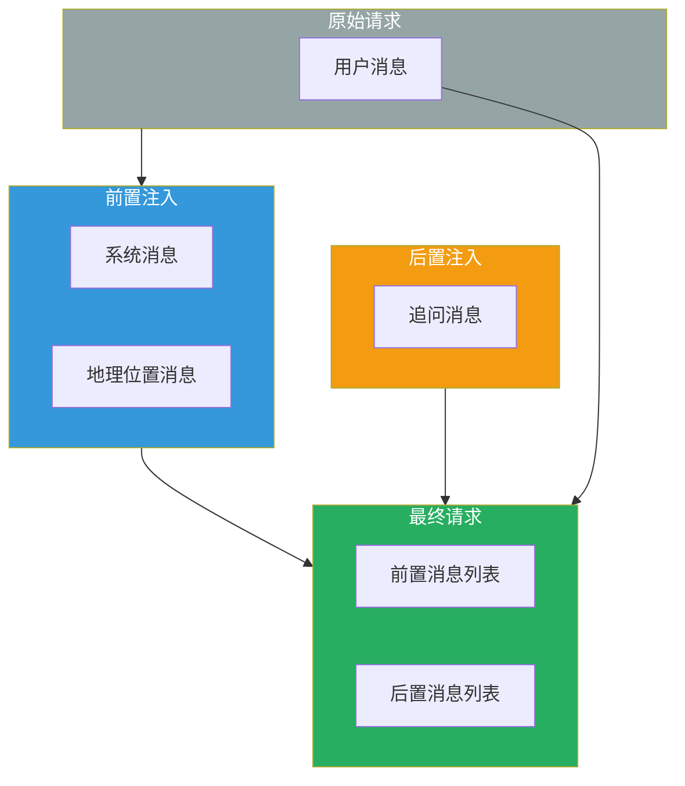
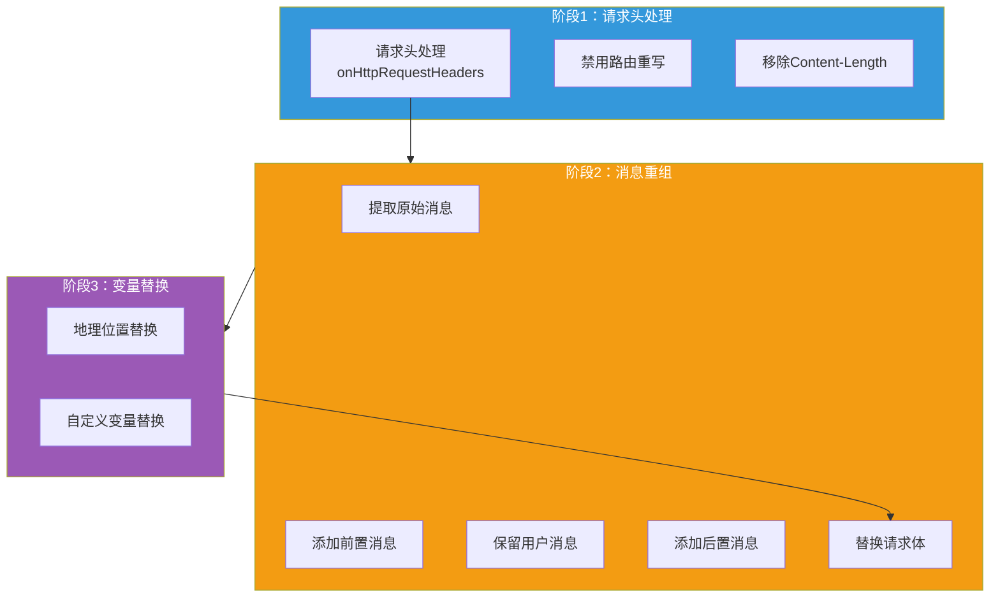

## 引言

在大模型应用中，**提示词工程（Prompt Engineering）** 是影响模型输出质量的关键因素。通过在用户输入前后添加系统提示词，可以引导模型按照预期的方式回答问题。

**AI 提示词装饰器插件**（ai-prompt-decorator）提供了：
- **前置注入**：在用户消息之前添加系统提示词
- **后置注入**：在用户消息之后添加提示词
- **变量替换**：支持动态变量（如地理位置信息）的替换
- **多消息插入**：支持批量插入多条消息

本文从源码层面深入剖析该插件的设计思想与实现细节。

---

## 插件定位与核心价值

### 核心价值



### 解决的问题

| 问题 | 传统方案 | 插件方案 |
|------|----------|----------|
| **角色设定** | 每次请求手动添加 | 配置后自动注入 |
| **回答格式** | 在用户提示词中说明 | 通过后置消息引导 |
| **地理位置** | 后端解析 IP 注入 | 网关层自动替换 |
| **多语言** | 用户主动说明 | 通过前置消息设定 |

---

## 插件架构设计

### 整体架构



### 配置结构

```go
type Message struct {
    Role    string `json:"role"`     // system/user/assistant
    Content string `json:"content"`
}

type AIPromptDecoratorConfig struct {
    Prepend []Message `json:"prepend"`  // 前置消息列表
    Append  []Message `json:"append"`   // 后置消息列表
}
```

---

## 核心功能实现

### 1. 配置解析

```go
func parseConfig(jsonConfig gjson.Result, config *AIPromptDecoratorConfig) error {
    return json.Unmarshal([]byte(jsonConfig.Raw), config)
}
```

### 2. 请求头处理

```go
func onHttpRequestHeaders(ctx wrapper.HttpContext, config AIPromptDecoratorConfig) types.Action {
    // 禁用路由重写（因为请求体会被修改）
    ctx.DisableReroute()

    // 移除 content-length 头
    proxywasm.RemoveHttpRequestHeader("content-length")

    return types.ActionContinue
}
```

### 3. 变量替换机制

```go
// 替换单个变量
func replaceVariable(variable string, entry *Message) (*Message, error) {
    key := fmt.Sprintf("${%s}", variable)

    // 检查内容是否包含该变量
    if strings.Contains(entry.Content, key) {
        // 从请求属性中获取变量值
        value, err := proxywasm.GetProperty([]string{variable})
        if err != nil {
            return nil, err
        }
        // 替换变量
        entry.Content = strings.ReplaceAll(entry.Content, key, string(value))
    }

    return entry, nil
}

// 替换地理位置变量
func decorateGeographicPrompt(entry *Message) (*Message, error) {
    // 支持的地理位置变量
    geoArr := []string{"geo-country", "geo-province", "geo-city", "geo-isp"}

    var err error
    for _, geo := range geoArr {
        entry, err = replaceVariable(geo, entry)
        if err != nil {
            return nil, err
        }
    }

    return entry, nil
}
```

### 4. 请求体处理

```go
func onHttpRequestBody(ctx wrapper.HttpContext, config AIPromptDecoratorConfig, body []byte) types.Action {
    // 创建空的消息列表
    messageJson := `{"messages":[]}`

    // 1. 添加前置消息
    for _, entry := range config.Prepend {
        // 替换地理位置变量
        entry, err := decorateGeographicPrompt(&entry)
        if err != nil {
            log.Errorf("Failed to decorate geographic prompt in prepend, error: %v", err)
            return types.ActionContinue
        }

        // 序列化消息
        msg, err := json.Marshal(entry)
        if err != nil {
            log.Errorf("Failed to add prepend message, error: %v", err)
            return types.ActionContinue
        }

        // 添加到消息列表
        messageJson, _ = sjson.SetRaw(messageJson, "messages.-1", string(msg))
    }

    // 2. 添加原始用户消息
    rawMessage := gjson.GetBytes(body, "messages")
    if !rawMessage.Exists() {
        log.Errorf("Cannot find messages field in request body")
        return types.ActionContinue
    }

    for _, entry := range rawMessage.Array() {
        messageJson, _ = sjson.SetRaw(messageJson, "messages.-1", entry.Raw)
    }

    // 3. 添加后置消息
    for _, entry := range config.Append {
        // 替换地理位置变量
        entry, err := decorateGeographicPrompt(&entry)
        if err != nil {
            log.Errorf("Failed to decorate geographic prompt in append, error: %v", err)
            return types.ActionContinue
        }

        // 序列化消息
        msg, err := json.Marshal(entry)
        if err != nil {
            log.Errorf("Failed to add append message, error: %v", err)
            return types.ActionContinue
        }

        // 添加到消息列表
        messageJson, _ = sjson.SetRaw(messageJson, "messages.-1", string(msg))
    }

    // 4. 替换请求体
    newbody, err := sjson.SetRaw(string(body), "messages", gjson.Get(messageJson, "messages").Raw)
    if err != nil {
        log.Error("modify body failed")
    }

    if err = proxywasm.ReplaceHttpRequestBody([]byte(newbody)); err != nil {
        log.Error("rewrite body failed")
    }

    return types.ActionContinue
}
```

---

## 配置详解

### 基础配置

```yaml
# 前置消息
prepend:
  - role: system
    content: "你是一个专业的技术顾问，请使用专业术语回答问题。"
  - role: user
    content: "在回答前，请先分析问题的背景。"

# 后置消息
append:
  - role: user
    content: "每次回答完问题，尝试进行反问以了解用户更多需求。"
```

### 与 Geo-IP 插件联动

**Geo-IP 插件配置**（优先级需高于 ai-prompt-decorator）：

```yaml
# geo-ip 插件配置
ipProtocal: "ipv4"
priority: 100  # 高于 ai-prompt-decorator
```

**ai-prompt-decorator 插件配置**：

```yaml
prepend:
  - role: system
    content: "提问用户当前的地理位置信息是，国家：${geo-country}，省份：${geo-province}, 城市：${geo-city}"
append:
  - role: user
    content: "每次回答完问题，尝试进行反问"
```

**请求示例**：

```bash
curl http://localhost/test \
  -H "content-type: application/json" \
  -H "x-forwarded-for: 87.254.207.100,4.5.6.7" \
  -d '{
    "model": "gpt-3.5-turbo",
    "messages": [
      {
        "role": "user",
        "content": "今天天气怎么样？"
      }
    ]
  }'
```

**处理后的请求**：

```json
{
  "model": "gpt-3.5-turbo",
  "messages": [
    {
      "role": "system",
      "content": "提问用户当前的地理位置信息是，国家：中国，省份：北京, 城市：北京"
    },
    {
      "role": "user",
      "content": "今天天气怎么样？"
    },
    {
      "role": "user",
      "content": "每次回答完问题，尝试进行反问"
    }
  ]
}
```

---

## 生产部署最佳实践

### 1. 消息顺序设计

| 场景 | 前置消息 | 用户消息 | 后置消息 |
|------|----------|----------|----------|
| **角色设定** | system: 你是一名... | 用户问题 | - |
| **格式要求** | system: 回答格式：... | 用户问题 | user: 请按格式回答 |
| **追问引导** | system: 你是... | 用户问题 | user: 请反问 |

### 2. 常见提示词模板

**技术问答场景**：

```yaml
prepend:
  - role: system
    content: |
      你是一名资深技术专家，具备以下能力：
      1. 深入理解计算机原理
      2. 熟悉多种编程语言
      3. 能够提供清晰的代码示例

      请遵循以下原则：
      - 使用专业术语
      - 提供可运行的代码示例
      - 解释技术决策的原因
```

**多语言支持**：

```yaml
prepend:
  - role: system
    content: "请使用 ${user-language} 回答所有问题"
```

**安全合规**：

```yaml
prepend:
  - role: system
    content: |
      在回答问题时，请注意：
      - 不提供违法行为指导
      - 不泄露敏感信息
      - 建议用户咨询专业人士
```

### 3. 变量替换扩展

虽然插件内置了地理位置变量替换，但可以通过扩展支持更多变量：

```go
// 扩展变量替换
func replaceCustomVariable(entry *Message, customVars map[string]string) (*Message, error) {
    for key, value := range customVars {
        placeholder := fmt.Sprintf("${%s}", key)
        if strings.Contains(entry.Content, placeholder) {
            entry.Content = strings.ReplaceAll(entry.Content, placeholder, value)
        }
    }
    return entry, nil
}
```

### 4. 插件优先级配置

```yaml
# 确保变量注入插件先执行
apiVersion: extensions.higress.io/v1alpha1
kind: WasmPlugin
metadata:
  name: geo-ip
spec:
  priority: 100  # 高优先级
  ...
---
apiVersion: extensions.higress.io/v1alpha1
kind: WasmPlugin
metadata:
  name: ai-prompt-decorator
spec:
  priority: 450  # 较低优先级
  ...
```

---

## 技术亮点总结

### 1. 灵活的消息注入

- **前置注入**：设定角色、规则、上下文
- **后置注入**：引导追问、格式要求
- **批量插入**：支持多条消息一次性注入

### 2. 动态变量替换

```go
// 通过 proxywasm.GetProperty 获取变量值
value, err := proxywasm.GetProperty([]string{variable})
entry.Content = strings.ReplaceAll(entry.Content, key, string(value))
```

### 3. 与 Geo-IP 联动

```yaml
# geo-ip 插件设置属性
proxywasm.SetProperty([]string{"geo-country"}, []byte("中国"))

# ai-prompt-decorator 插件读取属性
${geo-country}  # 替换为 "中国"
```

### 4. 请求体无损修改

```go
// 使用 sjson 保持原始请求结构
messageJson, _ = sjson.SetRaw(messageJson, "messages.-1", string(msg))
```

---

## 结语

AI 提示词装饰器插件通过 **前置/后置消息注入** 和 **动态变量替换**，为 AI 应用提供了灵活的提示词管理能力：

1. **角色设定**：通过 system 消息设定 AI 的角色和行为准则
2. **格式引导**：通过后置消息引导 AI 按照特定格式回答
3. **上下文增强**：与 Geo-IP 等插件联动，自动注入用户上下文
4. **无侵入设计**：在网关层处理，后端服务无需感知

该插件是实现 AI 应用提示词工程的基础组件，能够显著提升模型输出的可控性和一致性。
