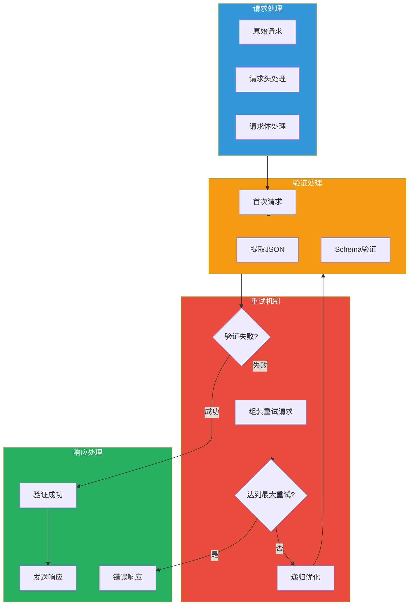
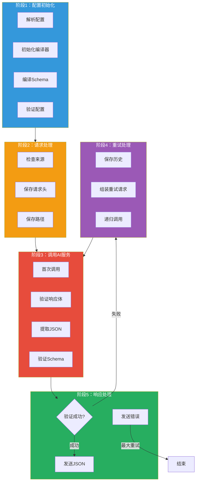

## 引言

在大模型应用中，**结构化输出**是一个关键需求。许多场景需要 LLM 返回符合特定格式的 JSON 数据，而非自然语言文本。

**AI JSON 格式化插件**（ai-json-resp）提供了：
- **JSON Schema 验证**：根据定义的 Schema 验证响应格式
- **自动重试**：当响应不符合要求时自动重试
- **递归优化**：通过历史对话逐步优化输出
- **错误处理**：完善的错误码和错误信息

本文从源码层面深入剖析该插件的设计思想与实现细节。

---

## 插件定位与核心价值

### 核心价值



### 解决的问题

| 问题 | 传统方案 | 插件方案 |
|------|----------|----------|
| **格式验证** | 后端代码验证 | 网关层自动验证 |
| **重试处理** | 需要手动实现 | 自动重试机制 |
| **Schema 定义** | 分散在各处 | 统一配置管理 |
| **错误处理** | 不统一的错误码 | 标准化错误码 |

---

## 插件架构设计

### 整体架构



### 配置结构

```go
type PluginConfig struct {
    // 服务配置
    serviceName    string
    serviceDomain  string
    serviceUrl     string
    servicePort    int
    servicePath    string
    serviceTimeout int
    apiKey         string
    maxRetry       int

    // 验证配置
    contentPath    string           // JSON 提取路径
    jsonSchema     map[string]interface{}  // JSON Schema
    enableSwagger  bool             // 启用 Swagger
    enableOas3     bool             // 启用 OAS3
    enableContentDisposition bool  // 启用 Content-Disposition

    // 编译器
    draft                          *jsonschema.Draft
    compiler                       *jsonschema.Compiler
    compile                        *jsonschema.Schema
    jsonSchemaMaxDepth             int
    enableJsonSchemaValidation     bool
}

type RequestContext struct {
    Path            string
    ReqHeaders      [][2]string
    ReqBody         []byte
    RespHeader      [][2]string
    RespBody        []byte
    HistoryMessages []chatMessage
}
```

---

## 核心功能实现

### 1. 配置解析与验证

```go
func parseConfig(result gjson.Result, config *PluginConfig, log log.Log) error {
    // 基础配置
    config.serviceName = result.Get("serviceName").String()
    config.serviceUrl = result.Get("serviceUrl").String()
    config.serviceDomain = result.Get("serviceDomain").String()
    config.servicePath = result.Get("servicePath").String()
    config.servicePort = int(result.Get("servicePort").Int())

    // 默认值
    if config.servicePort == 0 {
        config.servicePort = 443
    }
    if config.serviceTimeout == 0 {
        config.serviceTimeout = 50000  // 50秒
    }
    if config.maxRetry == 0 {
        config.maxRetry = 3
    }
    if config.contentPath == "" {
        config.contentPath = "choices.0.message.content"
    }

    // 解析 URL
    if config.serviceUrl != "" {
        domain, url := parseUrl(config.serviceUrl)
        if config.serviceDomain == "" {
            config.serviceDomain = domain
        }
        if config.servicePath == "" {
            config.servicePath = url
        }
    }

    // 验证服务域名
    if config.serviceDomain == "" {
        config.rejectStruct = RejectStruct{SERVICE_CONFIG_INVALID_CODE, "service domain is empty"}
        return errors.New("service domain is empty")
    }

    // 初始化服务客户端
    config.serviceClient = wrapper.NewClusterClient(wrapper.DnsCluster{
        ServiceName: config.serviceName,
        Port:        int64(config.servicePort),
        Domain:      config.serviceDomain,
    })

    // 设置 Schema 版本
    enableSwagger := result.Get("enableSwagger").Bool()
    enableOas3 := result.Get("enableOas3").Bool()

    if enableSwagger {
        config.draft = jsonschema.Draft4
    } else if enableOas3 {
        config.draft = jsonschema.Draft7
    } else {
        config.draft = jsonschema.Draft7  // 默认
    }

    // 创建编译器
    compiler := jsonschema.NewCompiler()
    compiler.Draft = config.draft
    config.compiler = compiler

    // 设置最大深度（性能考虑）
    config.jsonSchemaMaxDepth = 6

    // 解析 JSON Schema
    if jsonSchemaValue := result.Get("jsonSchema"); jsonSchemaValue.Exists() {
        if schemaValue, ok := jsonSchemaValue.Value().(map[string]interface{}); ok {
            config.jsonSchema = schemaValue
        } else {
            config.rejectStruct = RejectStruct{JSON_SCHEMA_INVALID_CODE, "Json Schema is not valid"}
            return errors.New("Json Schema is not valid")
        }
    }

    // 检查 Schema 深度
    jsonSchemaBytes, err := json.Marshal(config.jsonSchema)
    if err != nil {
        config.rejectStruct = RejectStruct{JSON_SCHEMA_INVALID_CODE, "Json Schema marshal failed"}
        return err
    }

    maxDepth := GetMaxDepth(config.jsonSchema)
    if maxDepth > config.jsonSchemaMaxDepth {
        config.enableJsonSchemaValidation = false
        log.Infof("Json Schema depth exceeded: %d from %d, validation disabled", maxDepth, config.jsonSchemaMaxDepth)
    }

    // 编译 Schema
    if config.enableJsonSchemaValidation {
        jsonSchemaStr := string(jsonSchemaBytes)
        config.compiler.AddResource(DEFAULT_SCHEMA, strings.NewReader(jsonSchemaStr))

        compile, err := config.compiler.Compile(DEFAULT_SCHEMA)
        if err != nil {
            log.Infof("Json Schema compile failed: %v", err)
            config.rejectStruct = RejectStruct{JSON_SCHEMA_COMPILE_FAILED_CODE, "Json Schema compile failed: " + err.Error()}
            config.compile = nil
        } else {
            config.compile = compile
        }
    }

    // Content-Disposition 配置
    enableContentDispositionValue := result.Get("enableContentDisposition")
    if !enableContentDispositionValue.Exists() {
        config.enableContentDisposition = true
    } else {
        config.enableContentDisposition = enableContentDispositionValue.Bool()
    }

    return nil
}
```

### 2. 请求头处理

```go
func onHttpRequestHeaders(ctx wrapper.HttpContext, config PluginConfig, log log.Log) types.Action {
    ctx.DisableReroute()

    // 检查配置错误
    if config.rejectStruct.RejectCode != HTTP_STATUS_OK {
        sendResponse(ctx, config, log, nil)
        return types.ActionPause
    }

    // 检查是否来自本插件
    extendHeaderValue, err := proxywasm.GetHttpRequestHeader(EXTEND_HEADER_KEY)
    if err == nil {
        fromThisPlugin, convErr := strconv.ParseBool(extendHeaderValue)
        if convErr != nil {
            ctx.SetContext(FROM_THIS_PLUGIN_KEY, false)
        }
        if fromThisPlugin {
            ctx.SetContext(FROM_THIS_PLUGIN_KEY, true)
            return types.ActionContinue
        }
    } else {
        ctx.SetContext(FROM_THIS_PLUGIN_KEY, false)
    }

    // 保存路径
    path, err := proxywasm.GetHttpRequestHeader(":path")
    if err != nil {
        path = ""
    }
    ctx.SetContext("path", path)

    // 保存请求头
    headers, err := proxywasm.GetHttpRequestHeaders()
    if err != nil {
        log.Infof("get request header failed: %v", err)
    }

    // 处理 API Key
    apiKey, err := proxywasm.GetHttpRequestHeader("Authorization")
    if err != nil {
        apiKey = ""
    }
    if apiKey != "" {
        // 移除原始 Authorization
        proxywasm.RemoveHttpRequestHeader("Authorization")
        for i, header := range headers {
            if header[0] == "Authorization" {
                headers = append(headers[:i], headers[i+1:]...)
                break
            }
        }
    }
    if config.apiKey != "" {
        headers = append(headers, [2]string{"Authorization", "Bearer " + config.apiKey})
    }
    ctx.SetContext("headers", headers)

    return types.ActionContinue
}
```

### 3. JSON 提取与验证

```go
func (c *PluginConfig) ValidateJson(body []byte, log log.Log) (string, error) {
    // 提取内容
    content := gjson.ParseBytes(body).Get(c.contentPath).String()

    if content == "" {
        c.rejectStruct = RejectStruct{CONTENT_IS_EMPTY_CODE, "response body does not contain the content"}
        return "", errors.New(c.rejectStruct.RejectMsg)
    }

    // 提取 JSON
    jsonStr, err := c.ExtractJson(content)
    if err != nil {
        c.rejectStruct = RejectStruct{CANNOT_FIND_JSON_IN_RESPONSE_CODE, "response body does not contain valid json: " + err.Error()}
        return "", errors.New(c.rejectStruct.RejectMsg)
    }

    // Schema 验证
    if c.jsonSchema != nil && c.enableJsonSchemaValidation {
        compile, err := c.compiler.Compile(DEFAULT_SCHEMA)
        if err != nil {
            c.rejectStruct = RejectStruct{JSON_SCHEMA_COMPILE_FAILED_CODE, "Json Schema compile failed: " + err.Error()}
            return "", errors.New(c.rejectStruct.RejectMsg)
        }

        err = compile.Validate(strings.NewReader(jsonStr))
        if err != nil {
            c.rejectStruct = RejectStruct{JSON_MISMATCH_SCHEMA_CODE, "response body does not match Json Schema: " + err.Error()}
            return "", errors.New(c.rejectStruct.RejectMsg)
        }
    }

    c.rejectStruct = RejectStruct{HTTP_STATUS_OK, ""}
    return jsonStr, nil
}

func (c *PluginConfig) ExtractJson(bodyStr string) (string, error) {
    // 简单提取 JSON
    startIndex := strings.Index(bodyStr, "{")
    endIndex := strings.LastIndex(bodyStr, "}") + 1

    if startIndex == -1 || endIndex == -1 || startIndex >= endIndex {
        return "", errors.New("cannot find json in the response body")
    }

    jsonStr := bodyStr[startIndex:endIndex]

    // 验证 JSON 格式
    var result map[string]interface{}
    err := json.Unmarshal([]byte(jsonStr), &result)
    if err != nil {
        return "", err
    }

    return jsonStr, nil
}
```

### 4. 递归重试机制

```go
func recursiveRefineJson(ctx wrapper.HttpContext, config PluginConfig, log log.Log, retryCount int, requestContext *RequestContext) {
    // 检查重试次数
    if retryCount >= config.maxRetry {
        config.rejectStruct = RejectStruct{REACH_MAX_RETRY_COUNT_CODE, "retry count exceeds max retry count: " + config.rejectStruct.RejectMsg}
        sendResponse(ctx, config, log, nil)
        return
    }

    // 调用 AI 服务
    config.serviceClient.Post(
        requestContext.Path,
        requestContext.ReqHeaders,
        requestContext.assembleReqBody(config),
        func(statusCode int, responseHeaders http.Header, responseBody []byte) {
            // 验证响应体
            err := config.ValidateBody(responseBody)
            if err != nil {
                sendResponse(ctx, config, log, nil)
                return
            }

            retryCount++
            requestContext.SaveBodyToHistMsg(log, requestContext.assembleReqBody(config), responseBody)

            // 验证 JSON
            validateJson, err := config.ValidateJson(responseBody, log)
            if err == nil {
                // 验证成功，发送响应
                sendResponse(ctx, config, log, []byte(validateJson))
            } else {
                // 验证失败，保存错误信息并递归重试
                requestContext.SaveStrToHistMsg(log, err.Error())
                recursiveRefineJson(ctx, config, log, retryCount, requestContext)
            }
        },
        uint32(config.serviceTimeout),
    )
}
```

### 5. 组装重试请求

```go
func (r *RequestContext) assembleReqBody(config PluginConfig) []byte {
    var reqBodystrut chatCompletionRequest
    json.Unmarshal(r.ReqBody, &reqBodystrut)

    // 获取上一次响应内容
    content := gjson.ParseBytes(r.RespBody).Get(config.contentPath).String()

    // 构建 JSON Schema
    jsonSchemaBytes, _ := json.Marshal(config.jsonSchema)
    jsonSchemaStr := string(jsonSchemaBytes)

    // 构建重试提示词
    askQuestion := "Given the Json Schema: " + jsonSchemaStr + ", please help me convert the following content to a pure json: " + content
    askQuestion += "\n Do not respond other content except the pure json!!!!"

    // 组装消息
    reqBodystrut.Messages = append(r.HistoryMessages, []chatMessage{
        {
            Role:    "user",
            Content: askQuestion,
        },
    }...)

    reqBody, _ := json.Marshal(reqBodystrut)
    return reqBody
}
```

### 6. 响应发送

```go
func sendResponse(ctx wrapper.HttpContext, config PluginConfig, log log.Log, body []byte) {
    log.Infof("Final send: Code %d, Message %s, Body: %s", config.rejectStruct.RejectCode, config.rejectStruct.RejectMsg, string(body))

    header := [][2]string{{"Content-Type", "application/json"}}

    // 添加 Content-Disposition
    if body != nil && config.enableContentDisposition {
        header = append(header, [2]string{"Content-Disposition", "attachment; filename=\"response.json\""})
    }

    // 发送响应
    if config.rejectStruct.RejectCode != HTTP_STATUS_OK {
        proxywasm.SendHttpResponseWithDetail(
            HTTP_STATUS_INTERNAL_SERVER_ERROR,
            config.rejectStruct.GetShortMsg(),
            nil,
            config.rejectStruct.GetBytes(),
            -1,
        )
    } else {
        proxywasm.SendHttpResponse(HTTP_STATUS_OK, header, body, -1)
    }
}
```

---

## 配置详解

### 基础配置

```yaml
serviceName: qwen
serviceDomain: dashscope.aliyuncs.com
servicePort: 443
apiKey: "YOUR_API_KEY"
servicePath: /compatible-mode/v1/chat/completions
serviceTimeout: 50000
maxRetry: 3
contentPath: choices.0.message.content

# JSON Schema 定义
jsonSchema:
  title: ReasoningSchema
  type: object
  properties:
    reasoning_steps:
      type: array
      items:
        type: string
      description: The reasoning steps leading to the final conclusion.
    answer:
      type: string
      description: The final answer, taking into account the reasoning steps.
  required:
    - reasoning_steps
    - answer
  additionalProperties: false

enableSwagger: false
enableOas3: true
enableContentDisposition: true
```

### 错误码说明

| 错误码 | 说明 | 处理建议 |
|--------|------|----------|
| 1001 | Json Schema 不是合法 JSON 格式 | 检查 jsonSchema 配置 |
| 1002 | Json Schema 编译失败 | 检查 Schema 格式和深度 |
| 1003 | 无法在响应中提取合法 JSON | 检查 contentPath 配置 |
| 1004 | 响应为空字符串 | 检查上游服务 |
| 1005 | 响应不符合 Json Schema | 调整 Schema 或提示词 |
| 1006 | 重试次数超过最大限制 | 增加 maxRetry 或优化提示词 |
| 1007 | 无法获取响应内容 | 检查上游服务配置 |
| 1008 | serviceDomain 为空 | 配置 serviceDomain 或 serviceUrl |

---

## 生产部署最佳实践

### 1. Schema 设计原则

| 原则 | 说明 | 示例 |
|------|------|------|
| **最小深度** | 控制嵌套深度不超过 6 层 | 扁平化结构 |
| **必需字段** | 明确标识必填字段 | required: ["id", "name"] |
| **类型约束** | 严格定义字段类型 | type: string, format: email |
| **禁止额外字段** | 防止无效数据 | additionalProperties: false |

### 2. 重试策略

| 场景 | maxRetry | serviceTimeout |
|------|----------|----------------|
| **简单输出** | 1-2 | 10000 |
| **复杂结构** | 3-5 | 30000 |
| **超大模型** | 2-3 | 60000 |

### 3. 提示词优化

```yaml
# 在请求中包含格式说明
messages:
  - role: system
    content: |
      请严格按照以下 JSON Schema 返回响应：
      {
        "type": "object",
        "properties": {
          "name": {"type": "string"},
          "age": {"type": "integer"}
        },
        "required": ["name", "age"]
      }

      只返回 JSON，不要包含其他内容。
```

### 4. 性能优化

```go
// 禁用 Schema 验证（仅验证 JSON 格式）
jsonSchema: {}

// 减少最大深度限制
jsonSchemaMaxDepth: 3

// 启用 Content-Disposition（提示下载）
enableContentDisposition: true
```

---

## 技术亮点总结

### 1. 递归重试机制

```go
// 通过历史对话逐步优化输出
requestContext.SaveBodyToHistMsg(log, body, responseBody)
recursiveRefineJson(ctx, config, log, retryCount, requestContext)
```

### 2. 动态 Schema 验证

```go
// 运行时编译和验证 Schema
compiler := jsonschema.NewCompiler()
compiler.Draft = config.draft
compile := compiler.Compile(DEFAULT_SCHEMA)
compile.Validate(strings.NewReader(jsonStr))
```

### 3. 深度限制

```go
// 性能优化：限制 Schema 深度
maxDepth := GetMaxDepth(config.jsonSchema)
if maxDepth > config.jsonSchemaMaxDepth {
    config.enableJsonSchemaValidation = false
}
```

### 4. 标准化错误处理

```go
type RejectStruct struct {
    RejectCode uint32 `json:"Code"`
    RejectMsg  string `json:"Msg"`
}
```

---

## 结语

AI JSON 格式化插件通过 **JSON Schema 验证** 和 **递归重试机制**，为 AI 应用提供了可靠的结构化输出能力：

1. **Schema 验证**：确保输出符合预期的 JSON 结构
2. **自动重试**：当验证失败时自动重试并优化提示词
3. **历史管理**：通过对话历史逐步改进输出
4. **错误处理**：完善的错误码和错误信息

该插件是实现 AI 应用结构化输出的必备组件，特别适用于需要机器可解析输出的场景。
