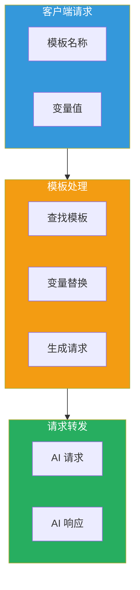
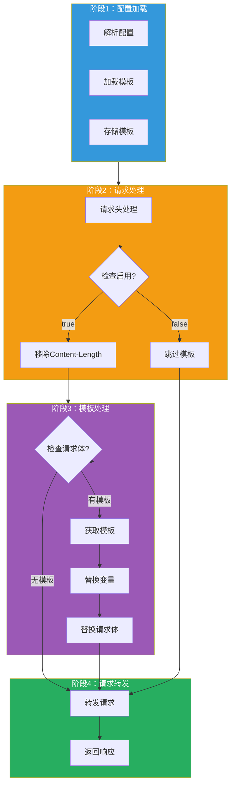

## 引言

在大模型应用中，**提示词模板（Prompt Template）** 是提高开发效率和保持输出一致性的重要工具。通过预定义的模板，可以快速构建符合特定格式和要求的 AI 请求。

**AI 提示词模板插件**（ai-prompt-template）提供了：
- **模板定义**：支持预定义多个提示词模板
- **变量替换**：支持动态变量值的注入
- **请求转发**：自动将模板请求转发给 AI 服务
- **灵活控制**：支持通过请求头控制模板启用

本文从源码层面深入剖析该插件的设计思想与实现细节。

---

## 插件定位与核心价值

### 核心价值



### 解决的问题

| 问题 | 传统方案 | 插件方案 |
|------|----------|----------|
| **代码重复** | 每次请求手动构建 | 模板复用 |
| **格式不一致** | 手动拼接容易出错 | 模板统一格式 |
| **维护困难** | 修改需改多处代码 | 集中管理模板 |
| **灵活性差** | 硬编码提示词 | 动态变量注入 |

---

## 插件架构设计

### 整体架构



### 配置结构

```go
type AIPromptTemplateConfig struct {
    templates map[string]string  // 模板名称 -> 模板内容
}

// 模板结构
type Template struct {
    Name     string              `json:"name"`
    Template TemplateContent      `json:"template"`
}

type TemplateContent struct {
    Model    string    `json:"model"`
    Messages []Message `json:"messages"`
}

type Message struct {
    Role    string `json:"role"`
    Content string `json:"content"`
}
```

---

## 核心功能实现

### 1. 配置解析

```go
func parseConfig(json gjson.Result, config *AIPromptTemplateConfig, log log.Log) error {
    // 初始化模板映射
    config.templates = make(map[string]string)

    // 遍历模板列表
    for _, v := range json.Get("templates").Array() {
        name := v.Get("name").String()
        template := v.Get("template").Raw

        // 存储模板
        config.templates[name] = template
        log.Info("Loaded template: %s", name)
    }

    return nil
}
```

### 2. 请求头处理

```go
func onHttpRequestHeaders(ctx wrapper.HttpContext, config AIPromptTemplateConfig, log log.Log) types.Action {
    // 禁用路由重写
    ctx.DisableReroute()

    // 检查是否启用模板
    templateEnable, _ := proxywasm.GetHttpRequestHeader("template-enable")
    if templateEnable == "false" {
        // 不启用模板，跳过请求体处理
        ctx.DontReadRequestBody()
        return types.ActionContinue
    }

    // 移除 content-length（因为请求体会被修改）
    proxywasm.RemoveHttpRequestHeader("content-length")

    return types.ActionContinue
}
```

### 3. 请求体处理

```go
func onHttpRequestBody(ctx wrapper.HttpContext, config AIPromptTemplateConfig, body []byte, log log.Log) types.Action {
    // 检查请求体是否包含 template 和 properties 字段
    if gjson.GetBytes(body, "template").Exists() && gjson.GetBytes(body, "properties").Exists() {
        // 获取模板名称
        name := gjson.GetBytes(body, "template").String()

        // 获取模板
        template, exists := config.templates[name]
        if !exists {
            log.Errorf("Template not found: %s", name)
            return types.ActionContinue
        }

        // 获取变量映射
        properties := gjson.GetBytes(body, "properties").Map()

        // 替换模板变量
        for key, value := range properties {
            placeholder := fmt.Sprintf("{{%s}}", key)
            template = strings.ReplaceAll(template, placeholder, value.String())
            log.Debugf("Replaced %s with %s", placeholder, value.String())
        }

        // 替换请求体
        proxywasm.ReplaceHttpRequestBody([]byte(template))

        log.Debugf("Applied template: %s", name)
    }

    return types.ActionContinue
}
```

---

## 配置详解

### 基础配置

```yaml
templates:
  - name: "developer-chat"
    template:
      model: gpt-3.5-turbo
      messages:
        - role: system
          content: "You are a {{program}} expert, in {{language}} programming language."
        - role: user
          content: "Write me a {{program}} program."

  - name: "translator"
    template:
      model: gpt-4
      messages:
        - role: system
          content: "You are a professional translator."
        - role: user
          content: "Translate the following text from {{source_lang}} to {{target_lang}}: {{text}}"
```

### 请求示例

**使用 developer-chat 模板**：

```json
{
  "template": "developer-chat",
  "properties": {
    "program": "quick sort",
    "language": "python"
  }
}
```

**处理后的请求**：

```json
{
  "model": "gpt-3.5-turbo",
  "messages": [
    {
      "role": "system",
      "content": "You are a quick sort expert, in python programming language."
    },
    {
      "role": "user",
      "content": "Write me a quick sort program."
    }
  ]
}
```

**使用 translator 模板**：

```json
{
  "template": "translator",
  "properties": {
    "source_lang": "English",
    "target_lang": "Chinese",
    "text": "Hello, how are you?"
  }
}
```

### 禁用模板

```bash
curl http://localhost/test \
  -H "template-enable: false" \
  -H "content-type: application/json" \
  -d '{
    "model": "gpt-3.5-turbo",
    "messages": [
      {"role": "user", "content": "Hello"}
    ]
  }'
```

---

## 生产部署最佳实践

### 1. 模板设计原则

| 原则 | 说明 | 示例 |
|------|------|------|
| **单一职责** | 一个模板只做一件事 | translator 只做翻译 |
| **变量命名** | 使用清晰的变量名 | `{{source_lang}}` 而非 `{{sl}}` |
| **默认值** | 提供合理的默认值 | language: python |
| **文档化** | 为模板添加说明 | 注释模板用途 |

### 2. 模板分层

```yaml
templates:
  # 基础模板
  - name: "base-assistant"
    template:
      model: gpt-3.5-turbo
      messages:
        - role: system
          content: "You are a helpful assistant."

  # 继承基础模板
  - name: "code-assistant"
    template:
      model: gpt-3.5-turbo
      messages:
        - role: system
          content: "You are a {{language}} expert."
        - role: user
          content: "{{question}}"
```

### 3. 变量验证

```go
// 在替换前验证变量
func validateProperties(template string, properties map[string]string) error {
    // 提取模板中的变量
    re := regexp.MustCompile(`\{\{(\w+)\}\}`)
    matches := re.FindAllStringSubmatch(template, -1)

    // 检查是否所有变量都有值
    for _, match := range matches {
        varName := match[1]
        if _, exists := properties[varName]; !exists {
            return fmt.Errorf("missing variable: %s", varName)
        }
    }

    return nil
}
```

### 4. 模板版本管理

```yaml
templates:
  - name: "translator-v1"
    template:
      model: gpt-3.5-turbo
      messages:
        - role: user
          content: "Translate: {{text}} from {{source}} to {{target}}"

  - name: "translator-v2"
    template:
      model: gpt-4
      messages:
        - role: system
          content: "You are a professional translator."
        - role: user
          content: "Translate from {{source}} to {{target}}: {{text}}"
```

---

## 技术亮点总结

### 1. 简洁的变量替换

```go
// 使用 strings.ReplaceAll 进行变量替换
for key, value := range properties {
    placeholder := fmt.Sprintf("{{%s}}", key)
    template = strings.ReplaceAll(template, placeholder, value.String())
}
```

### 2. 灵活的开关控制

```go
// 通过请求头控制模板启用
templateEnable, _ := proxywasm.GetHttpRequestHeader("template-enable")
if templateEnable == "false" {
    ctx.DontReadRequestBody()
    return types.ActionContinue
}
```

### 3. 模板映射存储

```go
// 使用 map 存储模板，支持快速查找
config.templates = make(map[string]string)
config.templates[name] = template
```

### 4. 无侵入式设计

```go
// 只处理包含 template 和 properties 的请求
if gjson.GetBytes(body, "template").Exists() && gjson.GetBytes(body, "properties").Exists() {
    // 应用模板
} else {
    // 直接转发
}
```

---

## 常见应用场景

### 1. 代码生成

```yaml
templates:
  - name: "code-generator"
    template:
      model: gpt-4
      messages:
        - role: system
          content: |
            You are a code generator. Generate {{language}} code for:
            {{description}}

            Requirements:
            - Follow {{language}} best practices
            - Include error handling
            - Add comments
        - role: user
          content: "Generate the code."
```

### 2. 文档生成

```yaml
templates:
  - name: "api-doc-generator"
    template:
      model: gpt-3.5-turbo
      messages:
        - role: system
          content: |
            Generate API documentation for:
            Endpoint: {{endpoint}}
            Method: {{method}}
            Description: {{description}}

            Include:
            - Request parameters
            - Response format
            - Error codes
            - Examples
```

### 3. 数据处理

```yaml
templates:
  - name: "data-transformer"
    template:
      model: gpt-3.5-turbo
      messages:
        - role: system
          content: |
            Transform the following data from {{input_format}} to {{output_format}}:

            Data: {{data}}

            Rules:
            - Preserve all fields
            - Convert data types
            - Maintain relationships
```

---

## 结语

AI 提示词模板插件通过 **模板定义** 和 **变量替换**，为 AI 应用提供了高效的请求构建能力：

1. **模板复用**：预定义常用请求模板，减少重复代码
2. **动态注入**：支持运行时变量值注入
3. **灵活控制**：通过请求头控制模板启用
4. **简洁设计**：实现简单，易于维护

该插件是实现 AI 应用请求标准化的基础组件，特别适用于需要大量相似请求的场景。
