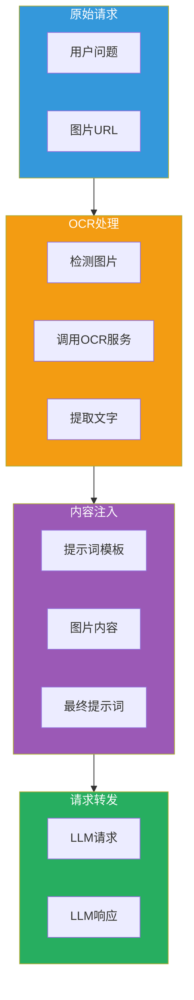
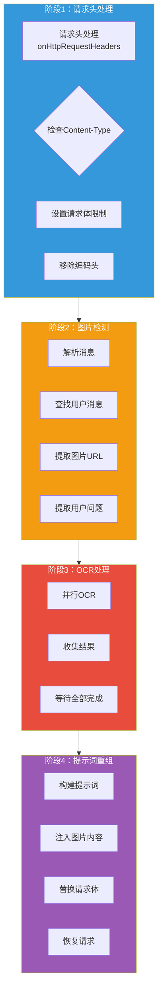

## 引言

在大模型应用中，**视觉理解能力**是提升用户体验的关键。许多场景需要 LLM 理解图片内容并基于图片信息回答问题。

**AI 图片阅读器插件**（ai-image-reader）提供了：
- **OCR 服务集成**：对接阿里云 DashScope qwen-vl-ocr 模型
- **图片内容提取**：自动提取图片中的文字信息
- **提示词注入**：将图片内容注入到用户提示词中
- **多图片支持**：支持批量处理多张图片

本文从源码层面深入剖析该插件的设计思想与实现细节。

---

## 插件定位与核心价值

### 核心价值



### 解决的问题

| 问题 | 传统方案 | 插件方案 |
|------|----------|----------|
| **图片理解** | LLM 无法直接理解图片 | 自动提取图片文字 |
| **OCR 调用** | 后端集成 OCR 服务 | 网关层统一处理 |
| **提示词拼接** | 手动拼接图片内容 | 自动注入到提示词 |
| **多图片处理** | 需要多次调用 | 批量并行处理 |

---

## 插件架构设计

### 整体架构



### 配置结构

```go
type Config struct {
    promptTemplate    string             // 提示词模板
    ocrProvider       Provider           // OCR 提供者
    ocrProviderConfig *ProviderConfig    // OCR 配置
}

const DefaultMaxBodyBytes uint32 = 100 * 1024 * 1024  // 100MB
```

---

## 核心功能实现

### 1. 配置解析

```go
func parseConfig(json gjson.Result, config *Config) error {
    // 默认提示词模板
    config.promptTemplate = `# 用户发送的图片解析得到的文字内容如下:
{image_content}
在回答时，请注意以下几点：
- 请你回答问题时结合用户图片的文字内容回答。
- 除非用户要求，否则你回答的语言需要和用户提问的语言保持一致。

# 用户消息为：
{question}`

    // 解析 OCR 提供者配置
    config.ocrProviderConfig = &ProviderConfig{}
    config.ocrProviderConfig.FromJson(json)

    // 验证配置
    if err := config.ocrProviderConfig.Validate(); err != nil {
        return err
    }

    // 创建 OCR 提供者
    var err error
    config.ocrProvider, err = CreateProvider(*config.ocrProviderConfig)
    if err != nil {
        return errors.New("create ocr provider failed")
    }

    return nil
}
```

### 2. 请求头处理

```go
func onHttpRequestHeaders(ctx wrapper.HttpContext, config Config) types.Action {
    // 禁用路由重写
    ctx.DisableReroute()

    // 检查 Content-Type
    contentType, _ := proxywasm.GetHttpRequestHeader("content-type")
    if contentType == "" {
        return types.ActionContinue
    }

    // 只处理 JSON 请求
    if !strings.Contains(contentType, "application/json") {
        log.Warnf("content is not json, can't process: %s", contentType)
        ctx.DontReadRequestBody()
        return types.ActionContinue
    }

    // 设置请求体限制（100MB）
    ctx.SetRequestBodyBufferLimit(DefaultMaxBodyBytes)

    // 移除 Accept-Encoding（避免响应被压缩）
    _ = proxywasm.RemoveHttpRequestHeader("Accept-Encoding")

    return types.ActionContinue
}
```

### 3. 图片检测与提取

```go
func onHttpRequestBody(ctx wrapper.HttpContext, config Config, body []byte) types.Action {
    var queryIndex int
    var query string

    // 解析消息
    messages := gjson.GetBytes(body, "messages").Array()
    var imageUrls []string

    // 从后往前查找用户消息
    for i := len(messages) - 1; i >= 0; i-- {
        if messages[i].Get("role").String() == "user" {
            queryIndex = i
            content := messages[i].Get("content").Array()

            // 提取图片 URL 和文本
            for j := len(content) - 1; j >= 0; j-- {
                contentType := content[j].Get("type").String()
                if contentType == "image_url" {
                    imageUrls = append(imageUrls, content[j].Get("image_url.url").String())
                } else if contentType == "text" {
                    query = content[j].Get("text").String()
                }
            }
            break
        }
    }

    // 如果没有图片，直接放行
    if len(imageUrls) == 0 {
        return types.ActionContinue
    }

    // 执行 OCR
    return executeReadImage(imageUrls, config, query, queryIndex, body)
}
```

### 4. OCR 执行

```go
func executeReadImage(imageUrls []string, config Config, query string, queryIndex int, body []byte) types.Action {
    var imageContents []string
    var totalImages int
    var finished int

    // 并行处理所有图片
    for _, imageUrl := range imageUrls {
        err := config.ocrProvider.DoOCR(imageUrl, func(imageContent string, err error) {
            defer func() {
                finished++

                // 所有图片处理完成后重组请求
                if totalImages == finished {
                    // 构建图片内容摘要
                    var processedContents []string
                    for idx := len(imageContents) - 1; idx >= 0; idx-- {
                        processedContents = append(processedContents,
                            fmt.Sprintf("第%d张图片内容为 %s", totalImages-idx, imageContents[idx]))
                    }

                    imageSummary := fmt.Sprintf("总共有 %d 张图片。\n", totalImages)
                    prompt := strings.Replace(config.promptTemplate, "{image_content}",
                        imageSummary+strings.Join(processedContents, "\n"), 1)
                    prompt = strings.Replace(prompt, "{question}", query, 1)

                    // 替换请求体
                    modifiedBody, err := sjson.SetBytes(body,
                        fmt.Sprintf("messages.%d.content", queryIndex), prompt)
                    if err != nil {
                        log.Errorf("modify request message content failed, err:%v", err)
                    } else {
                        log.Debugf("modified body:%s", modifiedBody)
                        proxywasm.ReplaceHttpRequestBody(modifiedBody)
                    }

                    // 恢复请求处理
                    proxywasm.ResumeHttpRequest()
                }
            }()

            if err != nil {
                log.Errorf("do ocr failed, err:%v", err)
                return
            }

            imageContents = append(imageContents, imageContent)
        })

        if err != nil {
            log.Errorf("ocr call failed, err:%v", err)
            continue
        }

        totalImages++
    }

    // 如果有图片需要处理，暂停请求
    if totalImages > 0 {
        return types.ActionPause
    }

    return types.ActionContinue
}
```

### 5. DashScope OCR 提供者

```go
type DashScopeProvider struct {
    config     ProviderConfig
    httpClient wrapper.HttpClient
}

func (p *DashScopeProvider) DoOCR(imageUrl string, callback OCRCallback) error {
    // 构建 OCR 请求
    requestBody := map[string]interface{}{
        "model": p.config.Model,
        "input": map[string]interface{}{
            "messages": []map[string]interface{}{
                {
                    "role": "user",
                    "content": []map[string]interface{}{
                        {
                            "image": imageUrl,
                        },
                        {
                            "text": "请识别这张图片中的所有文字内容，并按原文输出。只输出文字内容，不要添加任何解释。",
                        },
                    },
                },
            },
        },
    }

    jsonData, _ := json.Marshal(requestBody)

    // 调用 DashScope API
    err := p.httpClient.Post(
        "/compatible-mode/v1/chat/completions",
        [][2]string{
            {"Content-Type", "application/json"},
            {"Authorization", "Bearer " + p.config.APIKey},
        },
        jsonData,
        func(statusCode int, responseHeaders http.Header, responseBody []byte) {
            var response DashScopeOCRResponse
            if err := json.Unmarshal(responseBody, &response); err != nil {
                callback("", err)
                return
            }

            // 提取 OCR 结果
            if len(response.Output.Choices) > 0 {
                content := response.Output.Choices[0].Message.Content
                callback(content, nil)
            } else {
                callback("", errors.New("no OCR result"))
            }
        },
        uint32(p.config.Timeout),
    )

    return err
}
```

---

## 配置详解

### 基础配置

```yaml
# OCR 服务配置
apiKey: "YOUR_DASHSCOPE_API_KEY"
type: dashscope
model: qwen-vl-ocr
timeout: 10000
serviceHost: dashscope.aliyuncs.com
serviceName: dashscope
servicePort: 443
```

### 请求格式

**URL 传递图片**：

```json
{
  "model": "gpt-4-vision-preview",
  "messages": [
    {
      "role": "user",
      "content": [
        {
          "type": "text",
          "text": "图片内容是什么？"
        },
        {
          "type": "image_url",
          "image_url": {
            "url": "https://example.com/image.jpg"
          }
        }
      ]
    }
  ]
}
```

**Base64 传递图片**：

```json
{
  "model": "gpt-4-vision-preview",
  "messages": [
    {
      "role": "user",
      "content": [
        {
          "type": "text",
          "text": "这张图片有什么内容？"
        },
        {
          "type": "image_url",
          "image_url": {
            "url": "data:image/jpeg;base64,/9j/4AAQSkZJRg..."
          }
        }
      ]
    }
  ]
}
```

### 处理流程

**原始请求**：

```json
{
  "model": "gpt-4",
  "messages": [
    {
      "role": "user",
      "content": [
        {"type": "text", "text": "图片内容是什么？"},
        {
          "type": "image_url",
          "image_url": {"url": "https://example.com/book.jpg"}
        }
      ]
    }
  ]
}
```

**OCR 处理后**：

```json
{
  "model": "gpt-4",
  "messages": [
    {
      "role": "user",
      "content": "# 用户发送的图片解析得到的文字内容如下:\n总共有 1 张图片。\n第1张图片内容为 Linux Shell Scripting Cookbook\n第2张图片内容为 Chapter 1: Shell Basics\n在回答时，请注意以下几点：\n- 请你回答问题时结合用户图片的文字内容回答。\n- 除非用户要求，否则你回答的语言需要和用户提问的语言保持一致。\n\n# 用户消息为：\n图片内容是什么？"
    }
  ]
}
```

---

## 生产部署最佳实践

### 1. 图片格式支持

| 格式 | 说明 | 配置建议 |
|------|------|----------|
| **HTTP URL** | 公网可访问的图片 URL | 使用 CDN 加速 |
| **Base64** | 内联编码的图片 | 限制大小（<10MB） |
| **本地路径** | 网关可访问的本地路径 | 使用内网服务 |

### 2. OCR 模型选择

| 模型 | 特点 | 使用场景 |
|------|------|----------|
| **qwen-vl-ocr** | 专注文字识别 | 文档、书籍、表格 |
| **qwen-vl-max** | 通用视觉理解 | 场景理解、图文问答 |
| **qwen-vl-plus** | 平衡性能与成本 | 一般场景 |

### 3. 性能优化

| 优化项 | 说明 | 配置建议 |
|------|------|----------|
| **并行处理** | 多张图片并行 OCR | 默认已启用 |
| **超时设置** | 单次 OCR 超时时间 | timeout: 10000 |
| **请求体限制** | 最大请求体大小 | 100MB |
| **图片大小** | 单张图片大小限制 | <10MB |

### 4. 错误处理

```go
// 添加重试机制
func DoOCRWithRetry(imageUrl string, maxRetries int) (string, error) {
    var lastErr error
    for i := 0; i < maxRetries; i++ {
        content, err := doOCR(imageUrl)
        if err == nil {
            return content, nil
        }
        lastErr = err
        time.Sleep(time.Second * time.Duration(i+1))
    }
    return "", lastErr
}
```

---

## 技术亮点总结

### 1. 并行 OCR 处理

```go
// 多张图片并行处理
for _, imageUrl := range imageUrls {
    go config.ocrProvider.DoOCR(imageUrl, callback)
}
```

### 2. 异步回调机制

```go
// 通过回调函数处理结果
func DoOCR(imageUrl string, callback func(string, error)) error {
    // ... OCR 调用
    callback(content, nil)
}
```

### 3. 等待全部完成

```go
// 计数器模式
defer func() {
    finished++
    if totalImages == finished {
        // 所有图片处理完成
        proxywasm.ResumeHttpRequest()
    }
}()
```

### 4. 灵活的提示词模板

```go
// 支持自定义提示词模板
config.promptTemplate = `...{image_content}...{question}`
prompt := strings.Replace(config.promptTemplate, "{image_content}", imageSummary, 1)
prompt = strings.Replace(prompt, "{question}", query, 1)
```

---

## 结语

AI 图片阅读器插件通过 **OCR 服务集成** 和 **提示词注入**，为 AI 应用提供了视觉理解能力：

1. **自动 OCR**：检测图片并自动调用 OCR 服务
2. **并行处理**：支持多张图片并行识别
3. **内容注入**：将识别结果注入到用户提示词
4. **灵活配置**：支持自定义 OCR 提供者和提示词模板

该插件是实现 AI 应用视觉能力的轻量级方案，无需后端改动即可支持图片理解。
