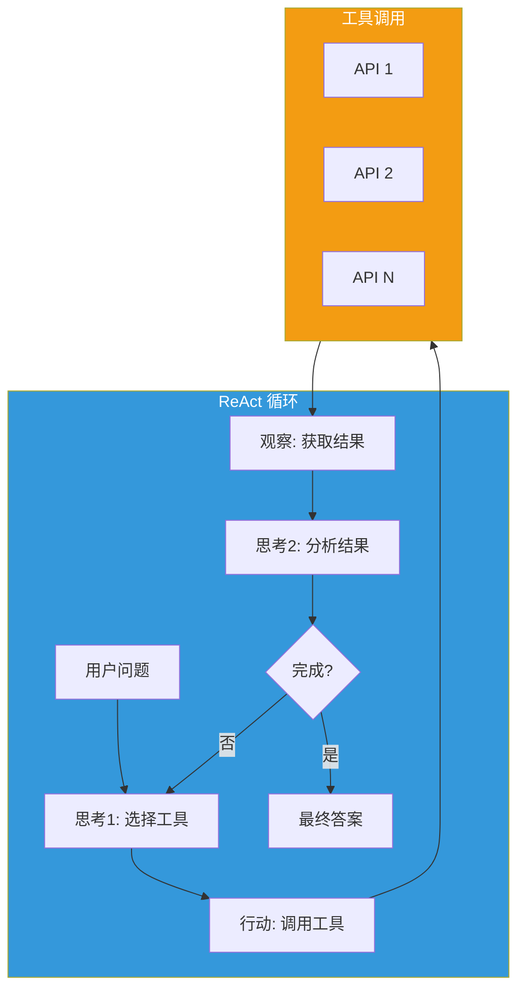
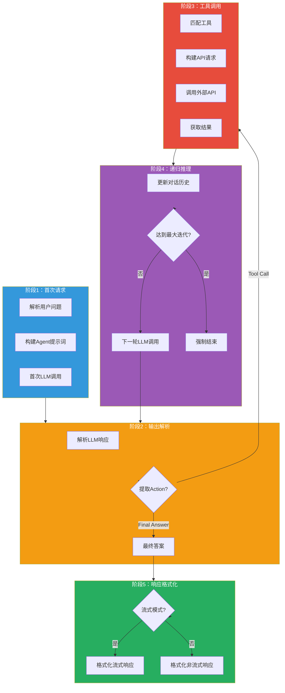

## 引言

在大模型应用中，**AI 智能体（AI Agent）** 是实现复杂任务自动化的关键技术。通过让 LLM 自主调用外部工具，可以完成超出模型能力范围的任务。

**AI 智能体插件**（ai-agent）提供了：
- **ReAct 框架**：Reasoning + Acting 推理行动循环
- **工具调用**：支持调用外部 REST API
- **OpenAPI 集成**：基于 OpenAPI 规范定义工具
- **递归推理**：支持多步推理和工具链调用

本文从源码层面深入剖析该插件的设计思想与实现细节。

---

## 插件定位与核心价值

### 核心价值



### 解决的问题

| 问题 | 传统方案 | 插件方案 |
|------|----------|----------|
| **工具调用** | 后端硬编码 API 调用 | LLM 自主选择工具 |
| **多步推理** | 需要手动设计流程 | ReAct 自动推理循环 |
| **API 集成** | 每个接口单独开发 | OpenAPI 统一描述 |
| **可扩展性** | 新功能需修改代码 | 配置即可添加工具 |

---

## 插件架构设计

### 整体架构



### 配置结构

```go
type PluginConfig struct {
    // LLM 配置
    LLMClient  wrapper.HttpClient
    LLMInfo    LLMInfo

    // API 配置
    APIsParam  []APIsParam
    APIClient  []wrapper.HttpClient

    // 提示词模板
    PromptTemplate PromptTemplateConfig

    // JSON 响应配置
    JsonResp JsonResp
}

type LLMInfo struct {
    Model          string
    Path           string
    APIKey         string
    MaxTokens      int64
    MaxIterations  int64
    MaxExecutionTime int64
}

type APIsParam struct {
    URL            string
    APIKey         APIKeyConfig
    MaxExecutionTime int64
    ToolsParam     []ToolParam
}

type ToolParam struct {
    ToolName    string
    Description string
    Method      string
    Path        string
    ParamName   []string
}
```

---

## 核心功能实现

### 1. 首次请求处理

```go
func onHttpRequestBody(ctx wrapper.HttpContext, config PluginConfig, body []byte, log log.Log) types.Action {
    // 解析请求
    var rawRequest Request
    err := json.Unmarshal(body, &rawRequest)
    if err != nil {
        return types.ActionContinue
    }

    // 提取用户问题
    var query string
    var history string
    messageLength := len(rawRequest.Messages)

    if messageLength > 0 {
        query = rawRequest.Messages[messageLength-1].Content
        // 构建历史对话
        if messageLength >= 3 {
            for i := 0; i < messageLength-1; i += 2 {
                history += "human: " + rawRequest.Messages[i].Content + "\nAI: " + rawRequest.Messages[i+1].Content
            }
        }
    }

    // 构建工具描述
    tool_desc := make([]string, 0)
    tool_names := make([]string, 0)
    for _, apisParam := range config.APIsParam {
        for _, tool_param := range apisParam.ToolsParam {
            tool_desc = append(tool_desc, fmt.Sprintf(
                prompttpl.TOOL_DESC,
                tool_param.ToolName,
                tool_param.Description,
                tool_param.Description,
                tool_param.Description,
                tool_param.Parameter,
            ), "\n")
            tool_names = append(tool_names, tool_param.ToolName)
        }
    }

    // 构建 Agent 提示词
    var prompt string
    if config.PromptTemplate.Language == "CH" {
        prompt = fmt.Sprintf(prompttpl.CH_Template,
            tool_desc,
            tool_names,
            config.PromptTemplate.CHTemplate.Question,
            config.PromptTemplate.CHTemplate.Thought1,
            config.PromptTemplate.CHTemplate.Observation,
            config.PromptTemplate.CHTemplate.Thought2,
            history,
            query,
        )
    } else {
        prompt = fmt.Sprintf(prompttpl.EN_Template,
            tool_desc,
            tool_names,
            config.PromptTemplate.ENTemplate.Question,
            config.PromptTemplate.ENTemplate.Thought1,
            config.PromptTemplate.ENTemplate.Observation,
            config.PromptTemplate.ENTemplate.Thought2,
            history,
            query)
    }

    // 初始化工具调用计数
    ctx.SetContext(ToolCallsCount, 0)

    // 清空并初始化对话历史
    dashscope.MessageStore.Clear()
    dashscope.MessageStore.AddForUser(prompt)

    // 发送首次请求
    ret := firstReq(ctx, config, prompt, rawRequest, log)
    return ret
}

func firstReq(ctx wrapper.HttpContext, config PluginConfig, prompt string, rawRequest Request, log log.Log) types.Action {
    var userMessage Message
    userMessage.Role = "user"
    userMessage.Content = prompt

    newMessages := []Message{userMessage}
    rawRequest.Messages = newMessages

    // 处理流式模式
    if rawRequest.Stream {
        ctx.SetContext(StreamContextKey, struct{}{})
        rawRequest.Stream = false
    }

    // 替换请求体
    newbody, err := json.Marshal(rawRequest)
    if err != nil {
        return types.ActionContinue
    }

    err = proxywasm.ReplaceHttpRequestBody(newbody)
    if err != nil {
        log.Debugf("failed replace err: %s", err.Error())
        proxywasm.SendHttpResponse(200,
            [][2]string{{"content-type", "application/json; charset=utf-8"}},
            []byte(fmt.Sprintf(config.ReturnResponseTemplate, "替换失败"+err.Error())), -1)
    }

    return types.ActionContinue
}
```

### 2. 响应解析

```go
func onHttpResponseBody(ctx wrapper.HttpContext, config PluginConfig, body []byte, log log.Log) types.Action {
    // 解析响应
    var rawResponse Response
    err := json.Unmarshal(body, &rawResponse)
    if err != nil {
        return types.ActionContinue
    }

    // 检查响应内容
    if rawResponse.Choices[0].Message.Content != "" {
        // 进入工具调用循环
        retType, _ := toolsCall(ctx, config.LLMClient, config.LLMInfo,
            config.JsonResp, config.APIsParam, config.APIClient,
            rawResponse.Choices[0].Message.Content, rawResponse, log)
        return retType
    } else {
        return types.ActionContinue
    }
}
```

### 3. 工具调用

```go
func toolsCall(ctx wrapper.HttpContext, llmClient wrapper.HttpClient, llmInfo LLMInfo,
    jsonResp JsonResp, aPIsParam []APIsParam, aPIClient []wrapper.HttpClient,
    content string, rawResponse Response, log log.Log) (types.Action, string) {

    // 保存 LLM 响应到历史
    dashscope.MessageStore.AddForAssistant(content)

    // 解析 Action 和 Action Input
    action, actionInput := outputParser(content, log)

    // 检查是否是最终答案
    if action == "Final Answer" {
        return types.ActionContinue, actionInput
    }

    // 检查迭代次数
    count := ctx.GetContext(ToolCallsCount).(int)
    count++
    if int64(count) > llmInfo.MaxIterations {
        ctx.SetContext(ToolCallsCount, 0)
        return types.ActionContinue, ""
    } else {
        ctx.SetContext(ToolCallsCount, count)
    }

    // 匹配工具并调用 API
    var urlStr string
    var headers [][2]string
    var apiClient wrapper.HttpClient
    var method string
    var reqBody []byte
    var maxExecutionTime int64

    for i, apisParam := range aPIsParam {
        maxExecutionTime = apisParam.MaxExecutionTime
        for _, tools_param := range apisParam.ToolsParam {
            if action == tools_param.ToolName {
                // 解析 Action Input
                var data map[string]interface{}
                if err := json.Unmarshal([]byte(actionInput), &data); err != nil {
                    return types.ActionContinue, ""
                }

                method = tools_param.Method
                urlStr = apisParam.URL + tools_param.Path

                // 处理路径参数
                urlParts := strings.Split(urlStr, "/")
                for i, part := range urlParts {
                    if strings.Contains(part, "{") && strings.Contains(part, "}") {
                        for _, param := range tools_param.ParamName {
                            paramNameInPath := part[1 : len(part)-1]
                            if paramNameInPath == param {
                                if value, ok := data[param]; ok {
                                    delete(data, param)
                                    urlParts[i] = url.QueryEscape(value.(string))
                                }
                            }
                        }
                    }
                }
                urlStr = strings.Join(urlParts, "/")

                // 构建 Query 参数或请求体
                queryParams := make([][2]string, 0)
                if method == "GET" {
                    for _, param := range tools_param.ParamName {
                        if value, ok := data[param]; ok {
                            queryParams = append(queryParams, [2]string{param, fmt.Sprintf("%v", value)})
                        }
                    }
                } else if method == "POST" {
                    reqBody, _ = json.Marshal(data)
                }

                // 构建请求头
                headers = [][2]string{{"Content-Type", "application/json"}}
                if apisParam.APIKey.Name != "" {
                    if apisParam.APIKey.In == "query" {
                        queryParams = append(queryParams,
                            [2]string{apisParam.APIKey.Name, apisParam.APIKey.Value})
                    } else if apisParam.APIKey.In == "header" {
                        headers = append(headers,
                            [2]string{"Authorization", apisParam.APIKey.Name + " " + apisParam.APIKey.Value})
                    }
                }

                // 添加 Query 参数
                if len(queryParams) > 0 {
                    urlStr += "?"
                    for i, param := range queryParams {
                        if i != 0 {
                            urlStr += "&"
                        }
                        urlStr += url.QueryEscape(param[0]) + "=" + url.QueryEscape(param[1])
                    }
                }

                apiClient = aPIClient[i]
                break
            }
        }
    }

    // 调用外部 API
    if apiClient != nil {
        err := apiClient.Call(
            method,
            urlStr,
            headers,
            reqBody,
            func(statusCode int, responseHeaders http.Header, responseBody []byte) {
                toolsCallResult(ctx, llmClient, llmInfo, jsonResp,
                    aPIsParam, aPIClient, content, rawResponse, log,
                    statusCode, responseBody)
            }, uint32(maxExecutionTime))
        if err != nil {
            log.Debugf("tool calls error: %s", err.Error())
            proxywasm.ResumeHttpRequest()
        }
    } else {
        return types.ActionContinue, ""
    }

    return types.ActionPause, ""
}
```

### 4. 工具调用结果处理

```go
func toolsCallResult(ctx wrapper.HttpContext, llmClient wrapper.HttpClient, llmInfo LLMInfo,
    jsonResp JsonResp, aPIsParam []APIsParam, aPIClient []wrapper.HttpClient,
    content string, rawResponse Response, log log.Log, statusCode int, responseBody []byte) {

    if statusCode != http.StatusOK {
        log.Debugf("statusCode: %d", statusCode)
    }

    // 构建观察结果
    observation := "Observation: " + string(responseBody)
    dashscope.MessageStore.AddForUser(observation)

    // 构建下一轮请求
    completion := dashscope.Completion{
        Model:     llmInfo.Model,
        Messages:  dashscope.MessageStore,
        MaxTokens: llmInfo.MaxTokens,
    }

    headers := [][2]string{
        {"Content-Type", "application/json"},
        {"Authorization", "Bearer " + llmInfo.APIKey},
    }

    completionSerialized, _ := json.Marshal(completion)

    // 调用 LLM 进行下一轮推理
    err := llmClient.Post(
        llmInfo.Path,
        headers,
        completionSerialized,
        func(statusCode int, responseHeaders http.Header, responseBody []byte) {
            var responseCompletion dashscope.CompletionResponse
            _ = json.Unmarshal(responseBody, &responseCompletion)

            if responseCompletion.Choices[0].Message.Content != "" {
                retType, actionInput := toolsCall(ctx, llmClient, llmInfo, jsonResp,
                    aPIsParam, aPIClient, responseCompletion.Choices[0].Message.Content,
                    rawResponse, log)

                if retType == types.ActionContinue {
                    // 得到最终答案
                    var assistantMessage Message
                    var streamMode bool
                    if ctx.GetContext(StreamContextKey) == nil {
                        streamMode = false
                        if jsonResp.Enable {
                            jsonFormat(llmClient, llmInfo, jsonResp.JsonSchema,
                                assistantMessage, actionInput, headers, streamMode, rawResponse, log)
                        } else {
                            noneStream(assistantMessage, actionInput, rawResponse, log)
                        }
                    } else {
                        streamMode = true
                        if jsonResp.Enable {
                            jsonFormat(llmClient, llmInfo, jsonResp.JsonSchema,
                                assistantMessage, actionInput, headers, streamMode, rawResponse, log)
                        } else {
                            stream(actionInput, rawResponse, log)
                        }
                    }
                }
            } else {
                proxywasm.ResumeHttpRequest()
            }
        }, uint32(llmInfo.MaxExecutionTime))

    if err != nil {
        log.Debugf("completion err: %s", err.Error())
        proxywasm.ResumeHttpRequest()
    }
}
```

### 5. 输出解析

```go
func outputParser(response string, log log.Log) (string, string) {
    log.Debugf("Raw response:%s", response)

    // 提取 JSON 块
    start := strings.Index(response, "```")
    end := strings.LastIndex(response, "```")

    var jsonStr string
    if start != -1 && end != -1 {
        jsonStr = strings.TrimSpace(response[start+3 : end])
    } else {
        jsonStr = response
    }

    // 解析 JSON
    var action map[string]interface{}
    err := json.Unmarshal([]byte(jsonStr), &action)
    if err == nil {
        var actionName, actionInput string
        for key, value := range action {
            if strings.Contains(strings.ToLower(key), "input") {
                actionInput = fmt.Sprintf("%v", value)
            } else {
                actionName = fmt.Sprintf("%v", value)
            }
        }
        if actionName != "" && actionInput != "" {
            return actionName, actionInput
        }
    }

    // 回退到正则表达式解析
    pattern := `\{\s*"action":\s*"([^"]+)",\s*"action_input":\s*((?:\{[^}]+\})|"[^"]+")\s*\}`
    re := regexp.MustCompile(pattern)
    match := re.FindStringSubmatch(jsonStr)

    if len(match) == 3 {
        action := match[1]
        actionInput := match[2]
        return action, actionInput
    }

    return "", ""
}
```

---

## 配置详解

### 基础配置

```yaml
# LLM 配置
llm:
  serviceName: qwen
  domain: dashscope.aliyuncs.com
  apiKey: "YOUR_API_KEY"
  path: /compatible-mode/v1/chat/completions
  model: qwen-max
  maxTokens: 2000
  maxIterations: 5
  maxExecutionTime: 60000

# 工具配置
apis:
  - url: https://api.example.com
    apiKey:
      name: Bearer
      value: "YOUR_API_TOKEN"
      in: header
    maxExecutionTime: 10000
    tools:
      - toolName: "search_weather"
        description: "Search for weather information"
        method: GET
        path: /weather
        parameter: '{"type":"object","properties":{"city":{"type":"string"}}}'
      - toolName: "get_location"
        description: "Get location coordinates"
        method: GET
        path: /geocode
        parameter: '{"type":"object","properties":{"address":{"type":"string"}}}'

# 提示词模板
promptTemplate:
  language: CH

# JSON 响应配置
jsonResp:
  enable: false
```

### 示例：天气查询 Agent

```yaml
llm:
  serviceName: qwen
  domain: dashscope.aliyuncs.com
  apiKey: "YOUR_API_KEY"
  path: /compatible-mode/v1/chat/completions
  model: qwen-max
  maxIterations: 5

apis:
  - url: https://weather.api.com
    tools:
      - toolName: "get_weather"
        description: "Get current weather for a city"
        method: GET
        path: /current
        parameter: '{"type":"object","properties":{"city":{"type":"string"}}}'
```

**请求示例**：

```json
{
  "model": "qwen-max",
  "messages": [
    {"role": "user", "content": "北京今天天气怎么样？"}
  ]
}
```

---

## 生产部署最佳实践

### 1. 工具设计原则

| 原则 | 说明 | 示例 |
|------|------|------|
| **单一职责** | 一个工具只做一件事 | get_weather 只查询天气 |
| **清晰命名** | 工具名要能描述功能 | search_user 而非 api_v1 |
| **完整描述** | 描述工具的用途和限制 | "Get weather, supports major cities" |
| **参数验证** | 明确参数类型和格式 | city: string, required |

### 2. 迭代次数控制

| 场景 | maxIterations | 说明 |
|------|---------------|------|
| **简单任务** | 3 | 1-2 步即可完成 |
| **复杂任务** | 5-10 | 需要多步推理 |
| **探索任务** | 15+ | 可能需要多次尝试 |

### 3. 超时配置

| 操作 | 超时时间 | 说明 |
|------|----------|------|
| **LLM 调用** | 60000ms | 大模型推理较慢 |
| **API 调用** | 10000ms | 外部 API 响应时间 |
| **总执行时间** | 300000ms | 整个 Agent 流程 |

### 4. 错误处理

```go
// 添加重试机制
func CallAPIWithRetry(client wrapper.HttpClient, method, url string,
    headers [][2]string, body []byte, maxRetries int, callback func(int, http.Header, []byte)) error {

    for i := 0; i < maxRetries; i++ {
        err := client.Call(method, url, headers, body, callback, 10000)
        if err == nil {
            return nil
        }
        time.Sleep(time.Second * time.Duration(i+1))
    }
    return fmt.Errorf("max retries exceeded")
}
```

---

## 技术亮点总结

### 1. ReAct 推理循环

```go
// Question -> Thought -> Action -> Observation -> Thought -> ...
Question -> Thought1 -> Action -> Observation -> Thought2 -> Decision
```

### 2. OpenAPI 集成

```go
// 基于 OpenAPI 规范定义工具
parameter: `{"type":"object","properties":{"city":{"type":"string"}}}`
```

### 3. 递归工具调用

```go
// 通过递归实现多步推理
func toolsCall(...) {
    // 调用 API
    apiClient.Call(...)
    // 处理结果
    toolsCallResult(...)
    // 下一轮
    toolsCall(...)
}
```

### 4. 对话历史管理

```go
// 使用全局存储管理对话历史
dashscope.MessageStore.AddForUser(prompt)
dashscope.MessageStore.AddForAssistant(content)
```

---

## 结语

AI 智能体插件通过 **ReAct 框架** 和 **工具调用**，为 AI 应用提供了自主执行复杂任务的能力：

1. **推理循环**：Thought → Action → Observation 的自动化循环
2. **工具集成**：基于 OpenAPI 规范快速集成外部 API
3. **多步推理**：支持多轮迭代完成复杂任务
4. **流式支持**：支持流式和非流式两种响应模式

该插件是实现 AI Agent 的轻量级方案，无需后端改动即可实现智能体能力。
