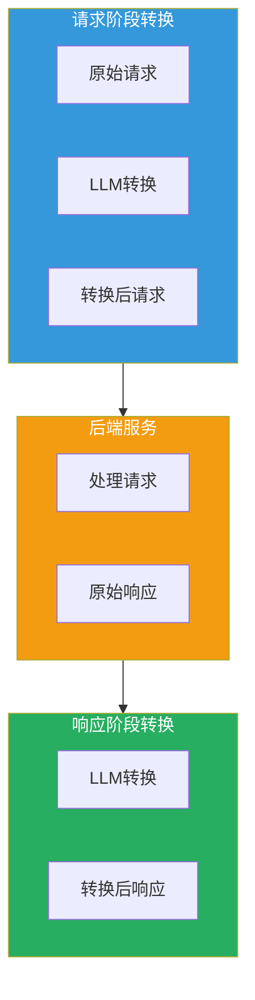
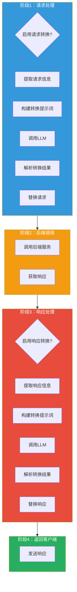

## 引言

在 API 网关场景中，**协议转换和内容转换**是常见需求。传统的硬编码转换方式难以应对复杂的转换场景，且维护成本高。

**AI 请求响应转换器插件**（ai-transformer）提供了：
- **LLM 驱动转换**：使用大模型智能转换请求/响应
- **请求阶段转换**：在请求阶段修改请求头和请求体
- **响应阶段转换**：在响应阶段修改响应头和响应体
- **灵活配置**：通过自然语言描述转换需求

本文从源码层面深入剖析该插件的设计思想与实现细节。

---

## 插件定位与核心价值

### 核心价值



### 解决的问题

| 问题 | 传统方案 | 插件方案 |
|------|----------|----------|
| **协议适配** | 硬编码适配逻辑 | LLM 智能适配 |
| **格式转换** | 使用转换库 | 自然语言描述转换 |
| **内容修改** | 正则表达式 | LLM 理解并修改 |
| **维护成本** | 需要修改代码 | 修改配置即可 |

---

## 插件架构设计

### 整体架构



### 配置结构

```go
type Config struct {
    // 请求转换配置
    Request RequestConfig `json:"request"`

    // 响应转换配置
    Response ResponseConfig `json:"response"`

    // LLM 提供者配置
    Provider ProviderConfig `json:"provider"`
}

type RequestConfig struct {
    Enable bool   `json:"enable"`
    Prompt string `json:"prompt"`
}

type ResponseConfig struct {
    Enable bool   `json:"enable"`
    Prompt string `json:"prompt"`
}

type ProviderConfig struct {
    ServiceName string `json:"serviceName"`
    Domain      string `json:"domain"`
    APIKey      string `json:"apiKey"`
}
```

---

## 核心功能实现

### 1. 配置解析

```go
func parseConfig(json gjson.Result, config *Config, log log.Log) error {
    // 解析请求配置
    config.Request.Enable = json.Get("request.enable").Bool()
    config.Request.Prompt = json.Get("request.prompt").String()

    // 解析响应配置
    config.Response.Enable = json.Get("response.enable").Bool()
    config.Response.Prompt = json.Get("response.prompt").String()

    // 解析 LLM 提供者配置
    config.Provider.ServiceName = json.Get("provider.serviceName").String()
    config.Provider.Domain = json.Get("provider.domain").String()
    config.Provider.APIKey = json.Get("provider.apiKey").String()

    // 初始化 LLM 客户端
    config.Provider.Client = wrapper.NewClusterClient(wrapper.DnsCluster{
        ServiceName: config.Provider.ServiceName,
        Port:        443,
        Domain:      config.Provider.Domain,
    })

    return nil
}
```

### 2. 请求转换

```go
func onHttpRequestHeaders(ctx wrapper.HttpContext, config Config) types.Action {
    // 检查是否启用请求转换
    if !config.Request.Enable {
        return types.ActionContinue
    }

    ctx.SetContext("transform_phase", "request")
    ctx.SetRequestBodyBufferLimit(DefaultMaxBodyBytes)

    // 移除 Accept-Encoding（避免响应被压缩）
    proxywasm.RemoveHttpRequestHeader("Accept-Encoding")

    return types.ActionContinue
}

func onHttpRequestBody(ctx wrapper.HttpContext, config Config, body []byte) types.Action {
    // 检查是否启用请求转换
    if !config.Request.Enable {
        return types.ActionContinue
    }

    // 提取请求信息
    path, _ := proxywasm.GetHttpRequestHeader(":path")
    method, _ := proxywasm.GetHttpRequestHeader(":method")
    headers, _ := proxywasm.GetHttpRequestHeaders()

    // 构建请求信息描述
    requestInfo := buildRequestInfo(path, method, headers, body)

    // 构建转换提示词
    prompt := fmt.Sprintf(`%s

原始请求信息：
%s

请根据上述要求转换请求，返回完整的 JSON 格式请求。`,
        config.Request.Prompt,
        requestInfo)

    // 调用 LLM 进行转换
    return callLLMForTransform(ctx, config, prompt, "request", body)
}
```

### 3. 响应转换

```go
func onHttpResponseHeaders(ctx wrapper.HttpContext, config Config) types.Action {
    // 检查是否启用响应转换
    if !config.Response.Enable {
        return types.ActionContinue
    }

    ctx.SetContext("transform_phase", "response")
    ctx.SetResponseBodyBufferLimit(DefaultMaxBodyBytes)

    return types.ActionContinue
}

func onHttpResponseBody(ctx wrapper.HttpContext, config Config, body []byte) types.Action {
    // 检查是否启用响应转换
    if !config.Response.Enable {
        return types.ActionContinue
    }

    // 提取响应信息
    statusCode := proxywasm.GetHttpResponseHeader(":status")
    headers, _ := proxywasm.GetHttpResponseHeaders()

    // 构建响应信息描述
    responseInfo := buildResponseInfo(statusCode, headers, body)

    // 构建转换提示词
    prompt := fmt.Sprintf(`%s

原始响应信息：
%s

请根据上述要求转换响应，返回完整的 JSON 格式响应。`,
        config.Response.Prompt,
        responseInfo)

    // 调用 LLM 进行转换
    return callLLMForTransform(ctx, config, prompt, "response", body)
}
```

### 4. LLM 调用

```go
func callLLMForTransform(ctx wrapper.HttpContext, config Config, prompt string, phase string, originalBody []byte) types.Action {
    // 构建 LLM 请求
    llmRequest := map[string]interface{}{
        "model": "qwen-max",
        "messages": []map[string]string{
            {
                "role":    "user",
                "content": prompt,
            },
        },
    }

    requestBody, _ := json.Marshal(llmRequest)

    headers := [][2]string{
        {"Content-Type", "application/json"},
        {"Authorization", "Bearer " + config.Provider.APIKey},
    }

    // 调用 LLM
    err := config.Provider.Client.Post(
        "/compatible-mode/v1/chat/completions",
        headers,
        requestBody,
        func(statusCode int, responseHeaders http.Header, responseBody []byte) {
            // 解析 LLM 响应
            var llmResponse struct {
                Choices []struct {
                    Message struct {
                        Content string `json:"content"`
                    } `json:"message"`
                } `json:"choices"`
            }

            if err := json.Unmarshal(responseBody, &llmResponse); err != nil {
                log.Errorf("Failed to parse LLM response: %v", err)
                resumeWithOriginal(ctx, phase, originalBody)
                return
            }

            if len(llmResponse.Choices) == 0 {
                log.Errorf("Empty LLM response")
                resumeWithOriginal(ctx, phase, originalBody)
                return
            }

            // 提取转换结果
            transformedContent := llmResponse.Choices[0].Message.Content

            // 解析转换结果
            if phase == "request" {
                applyRequestTransform(ctx, transformedContent)
            } else {
                applyResponseTransform(ctx, transformedContent)
            }
        },
        30000, // 30秒超时
    )

    if err != nil {
        log.Errorf("Failed to call LLM: %v", err)
        resumeWithOriginal(ctx, phase, originalBody)
        return types.ActionPause
    }

    return types.ActionPause
}

func resumeWithOriginal(ctx wrapper.HttpContext, phase string, body []byte) {
    if phase == "request" {
        proxywasm.ResumeHttpRequest()
    } else {
        proxywasm.ReplaceHttpResponseBody(body)
        proxywasm.ResumeHttpResponse()
    }
}
```

### 5. 应用转换结果

```go
func applyRequestTransform(ctx wrapper.HttpContext, content string) {
    // 提取 JSON
    jsonStr, err := extractJSON(content)
    if err != nil {
        log.Errorf("Failed to extract JSON: %v", err)
        proxywasm.ResumeHttpRequest()
        return
    }

    // 解析转换后的请求
    var transformedRequest struct {
        Path    string                 `json:"path"`
        Method  string                 `json:"method"`
        Headers map[string]string      `json:"headers"`
        Body    map[string]interface{} `json:"body"`
    }

    if err := json.Unmarshal([]byte(jsonStr), &transformedRequest); err != nil {
        log.Errorf("Failed to parse transformed request: %v", err)
        proxywasm.ResumeHttpRequest()
        return
    }

    // 应用转换
    if transformedRequest.Path != "" {
        proxywasm.ReplaceHttpRequestHeader(":path", transformedRequest.Path)
    }

    if transformedRequest.Method != "" {
        proxywasm.ReplaceHttpRequestHeader(":method", transformedRequest.Method)
    }

    for key, value := range transformedRequest.Headers {
        proxywasm.ReplaceHttpRequestHeader(key, value)
    }

    if transformedRequest.Body != nil {
        body, _ := json.Marshal(transformedRequest.Body)
        proxywasm.ReplaceHttpRequestBody(body)
    }

    proxywasm.ResumeHttpRequest()
}

func applyResponseTransform(ctx wrapper.HttpContext, content string) {
    // 提取 JSON
    jsonStr, err := extractJSON(content)
    if err != nil {
        log.Errorf("Failed to extract JSON: %v", err)
        proxywasm.ResumeHttpResponse()
        return
    }

    // 解析转换后的响应
    var transformedResponse struct {
        StatusCode int                    `json:"statusCode"`
        Headers    map[string]string      `json:"headers"`
        Body       map[string]interface{} `json:"body"`
    }

    if err := json.Unmarshal([]byte(jsonStr), &transformedResponse); err != nil {
        log.Errorf("Failed to parse transformed response: %v", err)
        proxywasm.ResumeHttpResponse()
        return
    }

    // 应用转换
    if transformedResponse.StatusCode != 0 {
        proxywasm.ReplaceHttpResponseHeader(":status", fmt.Sprintf("%d", transformedResponse.StatusCode))
    }

    for key, value := range transformedResponse.Headers {
        proxywasm.ReplaceHttpResponseHeader(key, value)
    }

    if transformedResponse.Body != nil {
        body, _ := json.Marshal(transformedResponse.Body)
        proxywasm.ReplaceHttpResponseBody(body)
    }

    proxywasm.ResumeHttpResponse()
}

func extractJSON(content string) (string, error) {
    // 提取 JSON 代码块
    start := strings.Index(content, "```")
    end := strings.LastIndex(content, "```")

    var jsonStr string
    if start != -1 && end != -1 {
        jsonStr = strings.TrimSpace(content[start+3 : end])
        // 移除语言标识
        if strings.HasPrefix(jsonStr, "json") {
            jsonStr = strings.TrimSpace(jsonStr[4:])
        }
    } else {
        jsonStr = content
    }

    // 验证 JSON
    var result interface{}
    if err := json.Unmarshal([]byte(jsonStr), &result); err != nil {
        return "", err
    }

    return jsonStr, nil
}
```

---

## 配置详解

### 基础配置

```yaml
request:
  enable: true
  prompt: |
    如果请求 path 是以 /httpbin 开头的，帮我去掉 /httpbin 前缀，其他的不要改。

    要求：
    1. 只返回修改后的请求信息
    2. 使用 JSON 格式
    3. 包含 path、method、headers、body 字段

response:
  enable: true
  prompt: |
    帮我修改以下 HTTP 应答信息，要求：
    1. content-type 修改为 application/json
    2. body 由 xml 转化为 json
    3. 移除 content-length

    要求：
    1. 只返回修改后的响应信息
    2. 使用 JSON 格式
    3. 包含 statusCode、headers、body 字段

provider:
  serviceName: qwen
  domain: dashscope.aliyuncs.com
  apiKey: "YOUR_API_KEY"
```

### 示例：XML 转 JSON

**原始响应（httpbin/xml）**：

```xml
<?xml version='1.0' encoding='us-ascii'?>
<slideshow title="Sample Slide Show" date="Date of publication" author="Yours Truly">
    <slide type="all">
      <title>Wake up to WonderWidgets!</title>
    </slide>
    <slide type="all">
        <title>Overview</title>
        <item>Why <em>WonderWidgets</em> are great</item>
    </slide>
</slideshow>
```

**转换后响应**：

```json
{
  "slideshow": {
    "title": "Sample Slide Show",
    "date": "Date of publication",
    "author": "Yours Truly",
    "slides": [
      {
        "type": "all",
        "title": "Wake up to WonderWidgets!"
      },
      {
        "type": "all",
        "title": "Overview",
        "items": ["Why <em>WonderWidgets</em> are great"]
      }
    ]
  }
}
```

---

## 生产部署最佳实践

### 1. 提示词设计

| 原则 | 说明 | 示例 |
|------|------|------|
| **明确要求** | 清晰描述转换需求 | "将 XML 转换为 JSON" |
| **约束条件** | 说明不能修改的内容 | "其他的不要改" |
| **输出格式** | 指定输出格式 | "使用 JSON 格式" |
| **字段要求** | 列出必需字段 | "包含 path、method、headers" |

### 2. 性能优化

| 优化项 | 说明 | 配置 |
|------|------|------|
| **LLM 模型** | 选择合适的模型 | qwen-turbo（快）vs qwen-max（准）|
| **超时设置** | 控制转换超时时间 | 30000ms |
| **请求体限制** | 限制处理大小 | 10MB |
| **缓存策略** | 相同请求复用结果 | 可配合 ai-cache |

### 3. 错误处理

```go
// 添加降级策略
func callLLMWithFallback(ctx wrapper.HttpContext, config Config, prompt string, phase string, originalBody []byte) {
    err := callLLMForTransform(ctx, config, prompt, phase, originalBody)
    if err != nil {
        log.Warnf("LLM transform failed, using original: %v", err)
        resumeWithOriginal(ctx, phase, originalBody)
    }
}
```

### 4. 监控指标

```promql
# 转换成功率
rate(ai_transform_success_total[5m]) / rate(ai_transform_requests_total[5m])

# 平均转换延迟
histogram_quantile(0.95, ai_transform_duration_seconds)

# LLM 调用失败率
rate(ai_transform_llm_error_total[5m]) / rate(ai_transform_requests_total[5m])
```

---

## 技术亮点总结

### 1. LLM 驱动转换

```go
// 使用自然语言描述转换需求
prompt := "帮我修改以下 HTTP 应答信息，要求：1. content-type 修改为 application/json"
```

### 2. 阶段分离处理

```go
// 请求阶段和响应阶段独立配置
request.enable: true
response.enable: true
```

### 3. JSON 提取

```go
// 从 LLM 输出中提取 JSON
func extractJSON(content string) (string, error) {
    // 处理代码块格式
    start := strings.Index(content, "```")
    end := strings.LastIndex(content, "```")
    // ...
}
```

### 4. 降级策略

```go
// LLM 失败时使用原始内容
func resumeWithOriginal(ctx wrapper.HttpContext, phase string, body []byte) {
    // 恢复原始请求/响应
}
```

---

## 常见应用场景

### 1. 协议适配

```yaml
request:
  enable: true
  prompt: |
    将以下 REST API 请求转换为 GraphQL 请求：
    1. 提取查询参数
    2. 构建 GraphQL query
    3. 设置 Content-Type 为 application/json
```

### 2. 内容格式转换

```yaml
response:
  enable: true
  prompt: |
    将以下响应内容进行转换：
    1. XML 转换为 JSON
    2. 字段名从下划线转为驼峰
    3. 日期格式转为 ISO8601
```

### 3. 路径重写

```yaml
request:
  enable: true
  prompt: |
    重写请求路径：
    1. /api/v1/* 转换为 /v1/*
    2. /old/* 转换为 /new/*
    3. 其他路径保持不变
```

### 4. 响应过滤

```yaml
response:
  enable: true
  prompt: |
    过滤响应内容：
    1. 移除敏感字段：password、token
    2. 只保留必需字段：id、name、status
    3. 添加响应时间戳
```

---

## 结语

AI 请求响应转换器插件通过 **LLM 驱动的智能转换**，为 API 网关提供了灵活的内容转换能力：

1. **自然语言配置**：通过自然语言描述转换需求，无需编码
2. **阶段分离**：请求阶段和响应阶段独立配置
3. **智能理解**：LLM 理解上下文并进行合理转换
4. **降级保障**：转换失败时使用原始内容

该插件是实现 API 网关智能转换的创新方案，特别适用于复杂的协议适配和内容转换场景。
