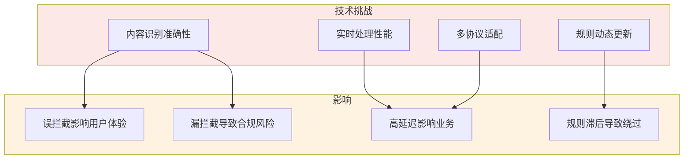
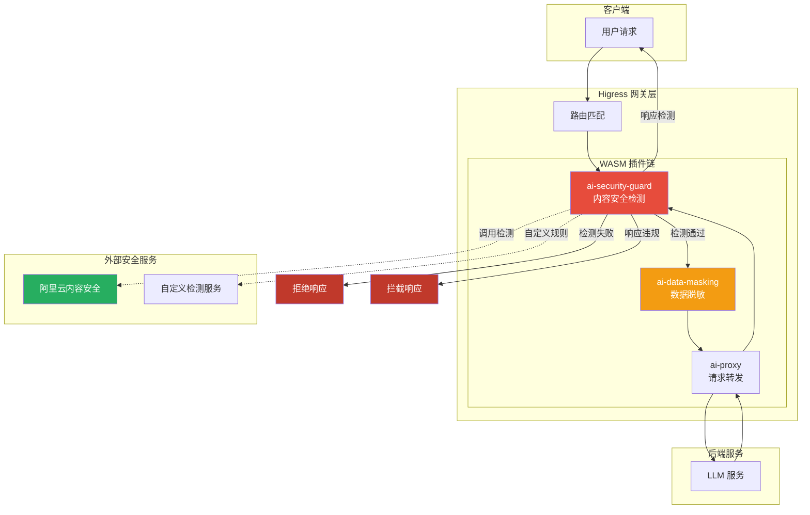
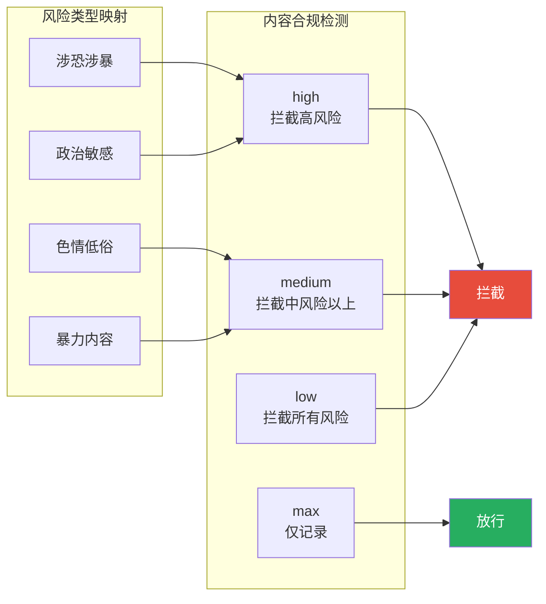
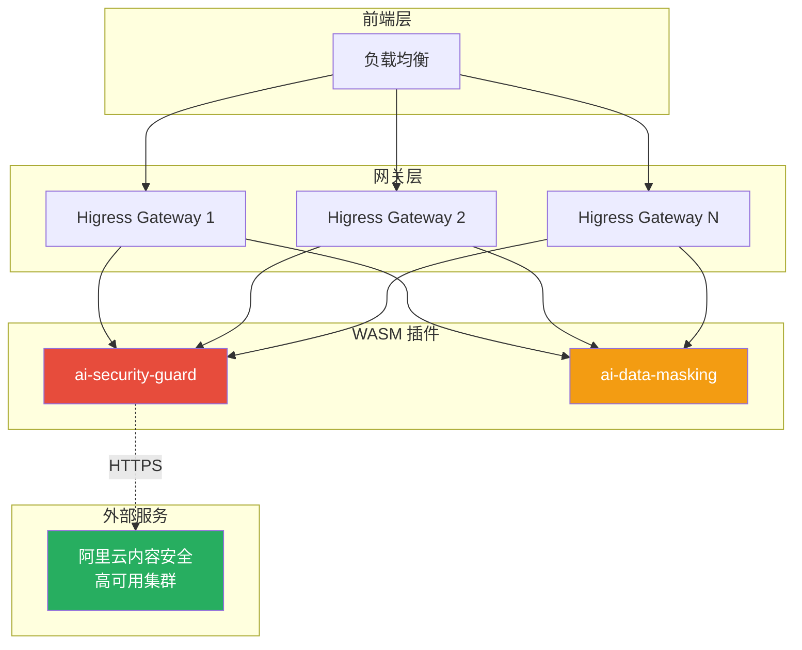
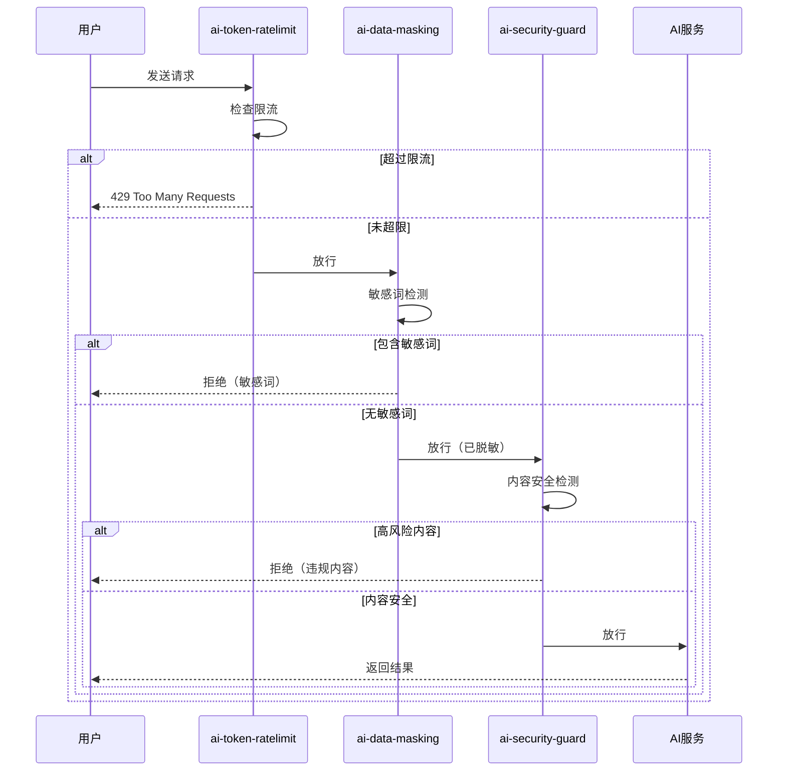

## 引言

随着 AI 技术的广泛应用，**内容安全与合规**成为企业面临的重大挑战。特别是 **涉恐、涉暴、涉黄、政治敏感**等违规内容的传播，不仅违反法律法规，更可能给企业带来严重的声誉损害和经济损失。

传统的安全防护方案存在诸多痛点：
- **依赖 LLM 自我约束**：无法保证 100% 可靠
- **应用层检测**：性能开销大，难以统一管理
- **规则分散**：不同业务各自为战，缺乏统一标准

**Higress AI 插件体系**提供了**网关层统一安全防护**方案，通过 **WASM 插件**实现高性能、可配置、可扩展的内容安全检测机制。

---

## 一、安全合规面临的挑战

### 1.1 监管要求

中国《网络安全法》《数据安全法》《个人信息保护法》等法律法规对网络内容提出了明确要求：

| 内容类型 | 监管要求 | 违规后果 |
|----------|----------|----------|
| **涉恐涉暴** | 严格禁止，立即阻断 | 平台关停、刑事责任 |
| **色情低俗** | 严格禁止 | 罚款、整改、下架 |
| **政治敏感** | 严格管控 | 内容删除、账号封禁 |
| **个人信息** | 需脱敏处理 | 行政处罚、民事赔偿 |

### 1.2 技术挑战



---

## 二、Higress 网关层安全防护架构

### 2.1 整体架构



### 2.2 核心插件组合

| 插件 | 职责 | 检测内容 |
|------|------|----------|
| **ai-security-guard** | 内容安全检测 | 涉恐、涉暴、色情、政治敏感 |
| **ai-data-masking** | 数据脱敏 | 个人信息、敏感数据 |
| **ai-statistics** | 安全审计 | 检测日志、风险统计 |

---

## 三、涉恐涉暴内容检测实现

### 3.1 AI 安全防护插件配置

#### 基础配置

```yaml
apiVersion: extensions.higress.io/v1alpha1
kind: WasmPlugin
metadata:
  name: ai-security-guard
  namespace: higress-ai
spec:
  url: file:///opt/plugins/ai-security-guard.wasm
  phase: AUTHN
  priority: 100
  config:
    # 阿里云内容安全服务配置
    serviceName: safecheck.dns
    servicePort: 443
    serviceHost: "green-cip.cn-shanghai.aliyuncs.com"
    accessKey: "${ALIYUN_ACCESS_KEY}"
    secretKey: "${ALIYUN_SECRET_KEY}"
    action: "llm_query_moderation"

    # 检测配置
    checkRequest: true   # 检测用户输入
    checkResponse: true  # 检测模型输出

    # 请求检测服务
    requestCheckService: "llm_query_moderation"
    # 响应检测服务
    responseCheckService: "llm_response_moderation"

    # 风险等级配置
    contentModerationLevelBar: "high"    # 涉恐涉暴高风险拦截
    promptAttackLevelBar: "medium"       # 提示词攻击中等拦截
    sensitiveDataLevelBar: "S2"          # 敏感数据 S2 及以上拦截

    # 拦截配置
    denyCode: 200
    denyMessage: "很抱歉，您的提问包含不当内容，无法为您提供回答"

    # 超时配置
    timeout: 2000
    bufferLimit: 1000
```

#### 风险等级说明



### 3.2 检测服务详解

#### 阿里云内容安全服务类型

| 服务 | 说明 | 检测内容 |
|------|------|----------|
| **llm_query_moderation** | LLM 输入内容检测 | 涉恐、涉暴、色情、政治、广告等 |
| **llm_response_moderation** | LLM 输出内容检测 | 同上，针对模型生成内容 |
| **prompt_attack** | 提示词攻击检测 | 对抗性提示词、越狱尝试 |
| **sensitive_data** | 敏感数据检测 | 个人信息、银行卡、证件号等 |

#### 风险等级与标签

```json
{
  "data": {
    "riskLevel": "high",
    "riskLabels": ["terrorism", "violence"],
    "suggestionText": "很抱歉，我无法回答这个问题"
  }
}
```

**风险标签分类**：

| 类别 | 标签 | 说明 |
|------|------|------|
| **涉恐** | terrorism | 恐怖主义相关内容 |
| **涉暴** | violence | 暴力、血腥内容 |
| **色情** | porn | 色情、低俗内容 |
| **政治** | politics | 政治敏感内容 |
| **广告** | ad | 垃圾广告、推广 |

### 3.3 分级拦截策略

#### 生产环境推荐配置

```yaml
# 严格模式（涉恐涉暴必须使用）
contentModerationLevelBar: "high"  # 拦截高风险内容

# 宽松模式（测试环境）
contentModerationLevelBar: "medium"  # 仅拦截中高风险

# 仅记录模式（开发调试）
contentModerationLevelBar: "max"  # 不拦截，仅记录日志
```

#### 消费者差异化策略

```yaml
# 为不同用户类型配置不同的检测策略
consumerSpecificRequestCheckService:
  # 普通用户：严格检测
  normal_user: "llm_query_moderation_strict"
  # VIP 用户：标准检测
  vip_user: "llm_query_moderation_standard"
  # 内部用户：宽松检测
  internal_user: "llm_query_moderation_relaxed"
  # 测试用户：仅记录
  test_user: "llm_query_moderation_monitor_only"
```

---

## 四、数据脱敏与敏感信息保护

### 4.1 AI 数据脱敏插件配置

```yaml
apiVersion: extensions.higress.io/v1alpha1
kind: WasmPlugin
metadata:
  name: ai-data-masking
  namespace: higress-ai
spec:
  url: file:///opt/plugins/ai-data-masking.wasm
  phase: AUTHN
  priority: 95
  config:
    # 协议拦截
    deny_openai: true

    # 系统内置敏感词库
    system_deny: true

    # 自定义敏感词
    deny_words:
      # 涉恐涉暴关键词
      - "炸.*[药楼馆站]"
      - "恐怖.*[主义分子组织]"
      - "暴力.*[革命袭击]"
      - "血腥.*[暴力场面]"

      # 色情关键词
      - "色情"
      - "淫秽"
      - "性服务"

    # 拦截响应
    deny_code: 200
    deny_message: '{"error":{"message":"提问包含敏感词，已被屏蔽","type":"sensitive_word"}}'

    # 数据替换规则
    replace_roles:
      # 身份证号脱敏
      - regex: "[1-9]\\d{5}(18|19|20)\\d{2}(0[1-9]|1[0-2])(0[1-9]|[12]\\d|3[01])\\d{3}[0-9Xx]"
        type: "replace"
        value: "******************"

      # 手机号脱敏
      - regex: "1[3-9]\\d{9}"
        type: "hash"
        restore: true

      # 银行卡号脱敏
      - regex: "\\d{16,19}"
        type: "replace"
        value: "****-****-****-****"
```

### 4.2 Grok 模式支持

#### 内置敏感信息模式

```yaml
replace_roles:
  # 邮箱地址
  - regex: "%{EMAIL:email}"
    type: "replace"
    value: "***@***.***"

  # IP 地址
  - regex: "%{IP:ip}"
    type: "hash"
    restore: true

  # 电话号码
  - regex: "%{PHONE:phone}"
    type: "replace"
    value: "***********"

  # 信用卡号
  - regex: "%{CREDIT_CARD:cc}"
    type: "replace"
    value: "****-****-****-****"
```

---

## 五、多协议支持与内容提取

### 5.1 OpenAI 协议

```yaml
# 默认内容提取路径（OpenAI 协议）
requestContentJsonPath: "messages.@reverse.0.content"
responseContentJsonPath: "choices.0.message.content"
responseStreamContentJsonPath: "choices.0.delta.content"
```

**请求示例**：
```json
{
  "messages": [
    {"role": "user", "content": "如何制作爆炸物？"}
  ]
}
```

### 5.2 Claude 协议

```yaml
protocol: "claude"

# Claude 协议内容提取路径
requestContentJsonPath: "messages.@reverse.0.content"
responseContentJsonPath: "content.0.text"
```

### 5.3 自定义协议

```yaml
protocol: "original"

# 自定义 JSONPath 提取规则
requestContentJsonPath: "$.input.prompt"
responseContentJsonPath: "$.output.text"
```

---

## 六、监控与审计

### 6.1 关键监控指标

```yaml
# Prometheus 监控指标
metrics:
  - name: ai_security_guard_request_check_total
    type: counter
    description: 内容安全检测总次数

  - name: ai_security_guard_request_deny_total
    type: counter
    description: 内容安全拦截总次数

  - name: ai_security_guard_risk_level_distribution
    type: histogram
    description: 风险等级分布

  - name: ai_security_guard_check_latency_ms
    type: histogram
    description: 检测耗时分布
```

### 6.2 告警规则

```promql
# 高风险内容告警
rate(ai_security_guard_request_deny_total{risk_level="high"}[5m]) > 10

# 检测失败告警
rate(ai_security_guard_check_error_total[5m]) > 0.05

# 检测延迟告警
histogram_quantile(0.99, ai_security_guard_check_latency_ms) > 500
```

### 6.3 审计日志

```json
{
  "timestamp": "2026-02-05T10:30:00Z",
  "user_id": "user_12345",
  "request_id": "req_abc123",
  "client_ip": "1.2.3.4",
  "check_result": {
    "service": "llm_query_moderation",
    "riskLevel": "high",
    "riskLabels": ["terrorism", "violence"],
    "action": "deny"
  },
  "content_preview": "如何制造..."
}
```

---

## 七、生产部署最佳实践

### 7.1 部署架构



### 7.2 配置清单

| 检查项 | 说明 | 推荐值 |
|--------|------|--------|
| **风险等级** | 拦截阈值 | high（涉恐涉暴） |
| **超时时间** | 检测超时 | 2000ms |
| **缓冲区大小** | 内容长度限制 | 1000 字符 |
| **降级策略** | 检测失败处理 | 放行但记录 |
| **重试策略** | 失败重试 | 3 次 |

### 7.3 容灾降级

```yaml
# 降级配置
failOpen: true  # 检测失败时放行
timeout: 2000
retry: 3

# 本地缓存（降级时使用）
localDenyWords:
  - "紧急敏感词1"
  - "紧急敏感词2"
```

### 7.4 合规报告

定期生成合规报告，内容包括：

| 报告项 | 说明 |
|--------|------|
| **检测总量** | 统计周期内检测次数 |
| **拦截统计** | 按风险等级、标签分类 |
| **误报分析** | 误拦截案例与优化建议 |
| **漏报分析** | 漏拦截案例与改进措施 |
| **性能指标** | 检测延迟、可用性 |

---

## 八、常见问题与解决方案

### 8.1 误拦截问题

**问题**：正常内容被误判为违规

**解决方案**：

1. **调整风险等级**：从 `low` 调整到 `high`
2. **添加白名单**：为特定用户/内容添加豁免
3. **反馈优化**：向阿里云反馈误判案例

```yaml
# 白名单配置
whitelist:
  users: ["vip_user_1", "internal_user_2"]
  contents: ["医疗健康咨询", "法律咨询"]
```

### 8.2 检测延迟

**问题**：安全检测导致响应延迟增加

**解决方案**：

1. **优化超时配置**：合理设置 timeout
2. **异步检测**：响应采用异步检测+事后处理
3. **缓存结果**：相同内容缓存检测结果

```yaml
# 缓存配置
cache:
  enabled: true
  ttl: 3600  # 1小时
  maxSize: 10000
```

### 8.3 规则更新

**问题**：敏感词库需要及时更新

**解决方案**：

1. **动态配置**：支持热更新敏感词库
2. **外部服务**：接入专业内容安全服务
3. **定期审核**：定期审查和更新规则

---

## 九、现有插件利用与组合方案

### 9.1 安全合规可用插件矩阵

Higress 生态中已有多个插件可直接用于构建安全合规体系：

| 插件名称 | 核心功能 | 安全合规价值 |
|----------|----------|--------------|
| **ai-security-guard** | 内容安全检测 | 涉恐涉暴、色情政治内容检测 |
| **ai-data-masking** | 数据脱敏 | 个人信息、敏感数据保护 |
| **ai-statistics** | 可观测性 | 安全事件统计、审计日志 |
| **ai-quota** | 配额管理 | 成本控制、滥用防护 |
| **ai-token-ratelimit** | Token 限流 | 防止恶意请求、资源耗尽攻击 |
| **ai-history** | 对话历史管理 | 内容溯源、问题定位 |
| **ai-cache** | 语义缓存 | 减少重复检测、降低延迟 |
| **ai-intent** | 意图识别 | 识别恶意意图、提前拦截 |

### 9.2 插件组合架构

```mermaid
flowchart LR
    subgraph Request["请求处理流程"]
        direction TB
        R1["1. ai-token-ratelimit<br/>限流防护<br/>priority: 200"]
        R2["2. ai-data-masking<br/>敏感词拦截+脱敏<br/>priority: 95"]
        R3["3. ai-security-guard<br/>内容安全检测<br/>priority: 100"]
        R4["4. ai-intent<br/>恶意意图识别<br/>priority: 80"]
        R5["5. ai-quota<br/>配额检查<br/>priority: 70"]
        R6["6. ai-cache<br/>缓存检查<br/>priority: 60"]
    end

    subgraph Response["响应处理流程"]
        direction TB
        RS1["1. ai-security-guard<br/>输出内容检测<br/>priority: 100"]
        RS2["2. ai-data-masking<br/>数据恢复<br/>priority: 95"]
        RS3["3. ai-statistics<br/>日志记录<br/>priority: 50"]
    end

    User["用户请求"] --> R1
    R1 -->|通过| R2
    R2 -->|通过| R3
    R3 -->|通过| R4
    R4 -->|通过| R5
    R5 -->|通过| R6
    R6 --> LLM["LLM 服务"]

    LLM --> RS1
    RS1 -->|通过| RS2
    RS2 -->|通过| RS3
    RS3 --> User

    style R1 fill:#3498db,color:#fff
    style R2 fill:#f39c12,color:#fff
    style R3 fill:#e74c3c,color:#fff
    style R4 fill:#9b59b6,color:#fff
    style R5 fill:#e67e22,color:#fff
    style R6 fill:#2ecc71,color:#fff
```



### 9.3 推荐插件组合方案

#### 方案一：基础防护组合

适用于一般 AI 应用的基础安全防护：

```yaml
# 组合插件配置
plugins:
  - name: ai-token-ratelimit
    phase: AUTHN
    priority: 200
    config:
      # 限流保护，防止恶意请求
      limit: 1000
      window: 60

  - name: ai-data-masking
    phase: AUTHN
    priority: 95
    config:
      # 敏感词拦截
      system_deny: true
      # 基础脱敏
      replace_roles:
        - regex: "%{PHONE:phone}"
          type: "replace"
          value: "***********"

  - name: ai-security-guard
    phase: AUTHN
    priority: 100
    config:
      # 内容安全检测
      contentModerationLevelBar: "high"
      checkRequest: true
      checkResponse: true

  - name: ai-statistics
    phase: AUTHN
    priority: 50
    config:
      # 记录安全事件
      enableSecurityLog: true
```

#### 方案二：企业级合规组合

适用于对合规要求严格的企业场景：

```yaml
plugins:
  - name: ai-token-ratelimit
    phase: AUTHN
    priority: 200
    config:
      # 多维度限流
      rules:
        - by_user: 100/60s
        - by_ip: 500/60s
        - by_api_key: 1000/60s

  - name: ai-quota
    phase: AUTHN
    priority: 90
    config:
      # Token 配额管理
      defaultQuota: 100000
      quotaPeriod: daily
      enableHardLimit: true

  - name: ai-data-masking
    phase: AUTHN
    priority: 95
    config:
      # 完整脱敏规则
      system_deny: true
      deny_words:
        - "涉恐涉暴关键词"
        - "色情低俗关键词"
      replace_roles:
        - regex: "%{IDCARD:idcard}"
          type: "replace"
          value: "******************"
        - regex: "%{EMAIL:email}"
          type: "hash"
          restore: true

  - name: ai-security-guard
    phase: AUTHN
    priority: 100
    config:
      # 严格检测
      contentModerationLevelBar: "high"
      promptAttackLevelBar: "medium"
      sensitiveDataLevelBar: "S2"
      # 双向检测
      checkRequest: true
      checkResponse: true

  - name: ai-intent
    phase: AUTHN
    priority: 80
    config:
      # 恶意意图识别
      blockMaliciousIntent: true
      customIntents:
        - name: "illegal_inquiry"
          examples: ["如何制造", "炸药配方"]
          action: "deny"

  - name: ai-history
    phase: AUTHN
    priority: 75
    config:
      # 对话历史记录，用于审计
      enableStorage: true
      retentionDays: 90

  - name: ai-statistics
    phase: AUTHN
    priority: 50
    config:
      # 完整的可观测性
      metrics:
        - security_events
        - deny_count
        - risk_distribution
      logs:
        - audit_trail
        - detection_details
```

#### 方案三：性能优化组合

适用于高并发、对性能敏感的场景：

```yaml
plugins:
  - name: ai-cache
    phase: AUTHN
    priority: 200
    config:
      # 语义缓存，减少重复检测
      enabled: true
      ttl: 3600
      maxTokens: 10000

  - name: ai-token-ratelimit
    phase: AUTHN
    priority: 190
    config:
      # 轻量级限流
      limit: 10000
      window: 60

  - name: ai-security-guard
    phase: AUTHN
    priority: 100
    config:
      # 缓存检测结果
      enableCache: true
      cacheTTL: 1800
      # 异步检测响应
      asyncResponseCheck: true
      contentModerationLevelBar: "high"

  - name: ai-data-masking
    phase: AUTHN
    priority: 95
    config:
      # 快速脱敏
      enableCompiledRegex: true
      skipEmptyContent: true
```

### 9.4 插件执行阶段与优先级

#### Phase 执行阶段

| Phase | 说明 | 适用插件 |
|-------|------|----------|
| **AUTHN** | 认证阶段，最早执行 | 限流、脱敏、安全检测 |
| **AUTHZ** | 授权阶段 | 配额检查、意图识别 |
| **DEFAULT** | 默认阶段 | 缓存、历史记录 |

#### Priority 优先级规则

```yaml
# 优先级数值越大，执行越早
# 建议优先级分配：

200-199: # 防护层 - 最早拦截
  - ai-token-ratelimit      # 限流防护
  - ai-ip-blacklist         # IP 黑名单

100-150: # 安全层 - 内容检测
  - ai-security-guard       # 内容安全检测（100）
  - ai-data-masking         # 数据脱敏（95）
  - ai-intent               # 意图识别（80）

70-90:   # 控制层 - 资源控制
  - ai-quota                # 配额管理（90）
  - ai-token-ratelimit      # Token 限流（85）

50-69:   # 功能层 - 增强功能
  - ai-history              # 对话历史（75）
  - ai-cache                # 语义缓存（60）

0-49:    # 观测层 - 监控统计
  - ai-statistics           # 统计监控（50）
```

### 9.5 插件间协作示例

#### 示例 1：多层安全防护



#### 示例 2：缓存与检测协同

```yaml
# ai-cache 配置
- name: ai-cache
  priority: 200
  config:
    # 缓存检测结果
    cacheSecurityCheck: true
    securityCacheTTL: 1800

# ai-security-guard 配置
- name: ai-security-guard
  priority: 100
  config:
    # 从缓存读取检测结果
    useCachedResult: true
    # 更新缓存
    updateCache: true
```

**协作流程**：
1. `ai-cache` 优先检查是否有缓存的检测结果
2. 如有缓存，直接返回，跳过 `ai-security-guard` 检测
3. 如无缓存，执行 `ai-security-guard` 检测
4. 检测结果写入 `ai-cache`，供后续请求复用

### 9.6 组合部署建议

| 场景 | 推荐组合 | 核心插件 |
|------|----------|----------|
| **基础防护** | 轻量级组合 | ratelimit + data-masking + security-guard |
| **企业合规** | 完整组合 | ratelimit + quota + masking + security-guard + intent + history + statistics |
| **高性能** | 缓存优化组合 | cache + ratelimit + security-guard |
| **高安全** | 多层防护组合 | ratelimit + masking + security-guard + intent + quota |

---

## 十、总结

Higress AI 插件体系为企业级 AI 应用提供了**网关层统一安全防护**方案，有效解决涉恐涉暴等违规内容的检测与拦截问题：

### 核心优势

1. **网关层统一防护**：避免业务分散处理
2. **高性能**：WASM 近原生性能，影响小
3. **可配置**：灵活的风险等级和规则配置
4. **可扩展**：支持多协议、自定义规则
5. **可观测**：完善的监控和审计能力

### 实施要点

| 要点 | 说明 |
|------|------|
| **风险等级** | 涉恐涉暴使用 high 级别 |
| **检测范围** | 请求+响应双向检测 |
| **降级策略** | 检测失败时放行但记录 |
| **监控告警** | 实时监控拦截率和延迟 |
| **定期审计** | 定期生成合规报告 |

通过合理配置和部署 Higress AI 安全插件，企业可以构建**合规、高效、可靠**的 AI 应用内容安全防护体系。
