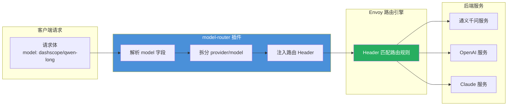
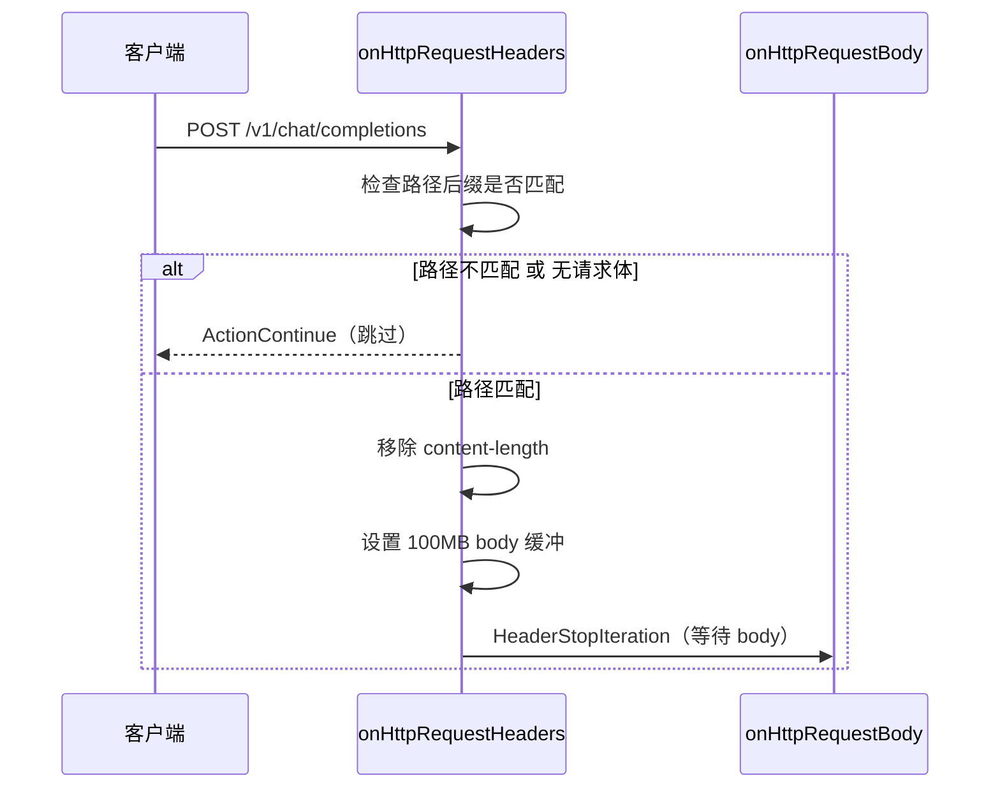
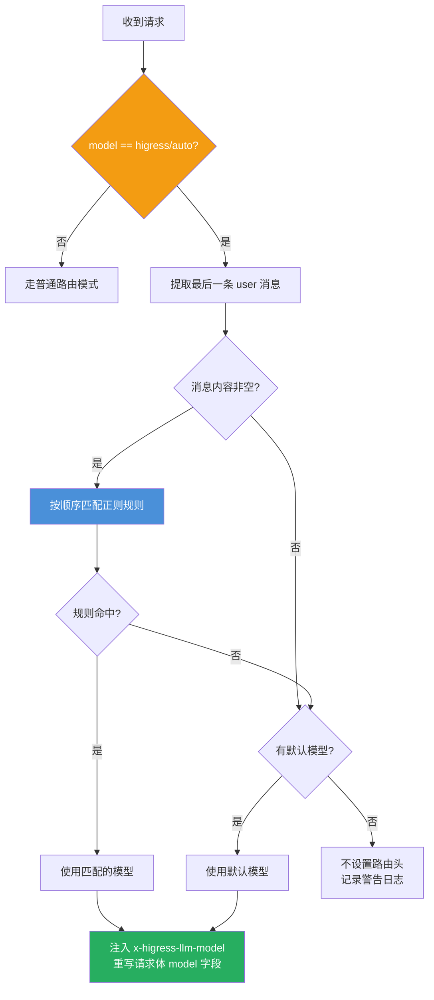
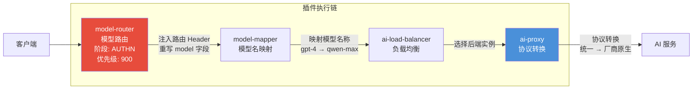

## 引言

在多模型、多 Provider 的 AI 网关场景中，如何根据请求内容将流量精准路由到正确的后端服务，是一个核心问题。传统的基于 URL 路径或 Header 的路由规则无法满足 LLM 场景的需求——因为 **模型信息藏在请求体的 JSON 字段里**，而非 URL 中。

Higress 的 `model-router` 插件正是为解决这一问题而生。它在 WASM 层拦截请求体，提取 `model` 字段，将其转化为 HTTP Header，从而让 Envoy 的路由引擎能够基于模型名称进行路由决策。更进一步，它还支持**基于用户消息内容的正则自动路由**，实现"用户说什么就用什么模型"的智能分发。

本文从源码层面深入剖析该插件的三种路由模式、请求处理流水线以及 multipart 兼容设计。

---

## 插件定位与核心价值

### 解决的核心问题

LLM API 的模型选择信息位于请求体中，而 Envoy 的路由匹配只能基于 Header/Path/Query 参数。`model-router` 充当了**请求体到路由 Header 的桥梁**：



### 三种路由模式对比

| 模式 | 触发条件 | 路由依据 | 典型场景 |
|------|----------|----------|----------|
| **模型头注入** | 配置 `modelToHeader` | model 字段原值 | 单 Provider 多模型路由 |
| **Provider 拆分** | 配置 `addProviderHeader` | model 中 `/` 前的 provider 名 | 多 Provider 统一入口 |
| **正则自动路由** | model 值为 `higress/auto` | 用户消息内容匹配正则 | 智能模型选择 |

---

## 源码架构分析

### 文件结构

```
model-router/
├── main.go          # 核心逻辑（373行）
├── main_test.go     # 单元测试与集成测试
├── go.mod           # 依赖管理
├── Makefile         # 构建脚本
├── README.md        # 中文文档
└── README_EN.md     # 英文文档
```

整个插件仅一个 Go 源文件，体现了 WASM 插件"小而精"的设计哲学。

### 插件注册与生命周期

```go
// main.go:29-38
func init() {
    wrapper.SetCtx(
        "model-router",
        wrapper.ParseConfig(parseConfig),
        wrapper.ProcessRequestHeaders(onHttpRequestHeaders),
        wrapper.ProcessRequestBody(onHttpRequestBody),
        wrapper.WithRebuildAfterRequests[ModelRouterConfig](1000),
        wrapper.WithRebuildMaxMemBytes[ModelRouterConfig](200*1024*1024),
    )
}
```

关键设计点：

- **仅处理请求阶段**：不涉及响应处理，职责单一
- **内存保护**：`WithRebuildMaxMemBytes` 限制 200MB，防止 WASM 实例内存泄漏
- **周期性重建**：每 1000 个请求后重建实例，避免长期运行的状态累积

### 配置数据结构

```go
// main.go:41-55
type AutoRoutingRule struct {
    Pattern *regexp.Regexp
    Model   string
}

type ModelRouterConfig struct {
    modelKey           string            // 请求体中模型字段的 JSON 路径
    addProviderHeader  string            // Provider 头名称
    modelToHeader      string            // 模型头名称
    enableOnPathSuffix []string          // 生效的路径后缀列表
    enableAutoRouting  bool              // 是否启用自动路由
    autoRoutingRules   []AutoRoutingRule // 正则路由规则
    defaultModel       string            // 自动路由的默认模型
}
```

配置解析中有一个值得注意的防御性设计——**正则编译失败不会阻断插件启动**：

```go
// main.go:100-111
compiled, err := regexp.Compile(patternStr)
if err != nil {
    log.Warnf("failed to compile regex pattern '%s': %v", patternStr, err)
    continue  // 跳过无效规则，不影响其他规则
}
```

这意味着即使运维人员配置了错误的正则表达式，插件仍能正常工作，只是该条规则被静默跳过。

---

## 请求处理流水线

### 阶段一：Header 预处理



源码实现：

```go
// main.go:119-149
func onHttpRequestHeaders(ctx wrapper.HttpContext, config ModelRouterConfig) types.Action {
    path, err := proxywasm.GetHttpRequestHeader(":path")
    if err != nil {
        return types.ActionContinue
    }

    // 去除查询参数后检查路径后缀
    if idx := strings.Index(path, "?"); idx != -1 {
        path = path[:idx]
    }

    enable := false
    for _, suffix := range config.enableOnPathSuffix {
        if suffix == "*" || strings.HasSuffix(path, suffix) {
            enable = true
            break
        }
    }

    if !enable || !ctx.HasRequestBody() {
        ctx.DontReadRequestBody()
        return types.ActionContinue
    }

    proxywasm.RemoveHttpRequestHeader("content-length")
    ctx.SetRequestBodyBufferLimit(DefaultMaxBodyBytes) // 100MB
    return types.HeaderStopIteration
}
```

**为什么要移除 `content-length`？** 因为插件可能修改请求体（重写 model 字段），修改后的 body 长度会变化。移除后，Envoy 会自动重新计算并设置正确的 `Content-Length`。

**默认生效路径**覆盖了主流 LLM API 端点：

```go
config.enableOnPathSuffix = []string{
    "/completions",          // OpenAI Chat/Completions
    "/embeddings",           // 向量化
    "/images/generations",   // 图片生成
    "/audio/speech",         // 语音合成
    "/fine_tuning/jobs",     // 微调任务
    "/moderations",          // 内容审核
    "/image-synthesis",      // 通义万相
    "/video-synthesis",      // 视频生成
    "/rerank",               // 重排序
    "/messages",             // Anthropic Claude
    "/responses",            // OpenAI Responses API
}
```

### 阶段二：Body 路由分发

```go
// main.go:151-164
func onHttpRequestBody(ctx wrapper.HttpContext, config ModelRouterConfig, body []byte) types.Action {
    contentType, err := proxywasm.GetHttpRequestHeader("content-type")
    if err != nil {
        return types.ActionContinue
    }

    if strings.Contains(contentType, "application/json") {
        return handleJsonBody(ctx, config, body)
    } else if strings.Contains(contentType, "multipart/form-data") {
        return handleMultipartBody(ctx, config, body, contentType)
    }

    return types.ActionContinue
}
```

插件同时支持 JSON 和 multipart/form-data 两种内容类型，后者主要用于 OpenAI 的图片编辑、语音转写等需要上传文件的 API。

---

## 三种路由模式详解

### 模式一：模型头注入

最简单的模式，将 model 字段值直接写入指定 Header：

```yaml
modelToHeader: x-higress-llm-model
```

```go
// main.go:247-248
if config.modelToHeader != "" {
    _ = proxywasm.ReplaceHttpRequestHeader(config.modelToHeader, modelValue)
}
```

请求 `{"model": "qwen-long"}` → Header `x-higress-llm-model: qwen-long`

Envoy 路由规则即可基于此 Header 匹配：

```yaml
routes:
  - match:
      headers:
        - name: x-higress-llm-model
          exact_match: "qwen-long"
    route:
      cluster: qwen-service
```

### 模式二：Provider 拆分路由

当客户端使用 `provider/model` 格式时，插件自动拆分：

```yaml
addProviderHeader: x-higress-llm-provider
```

```go
// main.go:250-267
if config.addProviderHeader != "" {
    parts := strings.SplitN(modelValue, "/", 2)
    if len(parts) == 2 {
        provider := parts[0]
        model := parts[1]
        // 注入 provider header
        _ = proxywasm.ReplaceHttpRequestHeader(config.addProviderHeader, provider)
        // 重写请求体中的 model 字段为纯模型名
        newBody, err := sjson.SetBytes(body, config.modelKey, model)
        if err != nil {
            log.Errorf("failed to update model in json body: %v", err)
            return types.ActionContinue
        }
        _ = proxywasm.ReplaceHttpRequestBody(newBody)
    }
}
```

处理流程：

```
请求: {"model": "dashscope/qwen-long"}
  ↓
拆分: provider = "dashscope", model = "qwen-long"
  ↓
注入 Header: x-higress-llm-provider: dashscope
重写 Body:   {"model": "qwen-long"}
```

这种设计让客户端可以通过统一入口访问多个 Provider，网关根据 provider 名称路由到不同的后端集群。**请求体中的 model 被重写为纯模型名**，确保后端 Provider 能正确识别。

### 模式三：正则自动路由

这是最智能的模式。当 model 值为魔术字符串 `higress/auto` 时，插件分析用户消息内容，自动选择最合适的模型：

```go
const AutoModelPrefix = "higress/auto"
```

#### 用户消息提取

```go
// main.go:167-190
func extractLastUserMessage(body []byte) string {
    messages := gjson.GetBytes(body, "messages")
    if !messages.Exists() || !messages.IsArray() {
        return ""
    }

    var lastUserContent string
    for _, msg := range messages.Array() {
        if msg.Get("role").String() == "user" {
            content := msg.Get("content")
            if content.IsArray() {
                // 多模态消息：提取最后一个 text 类型的内容
                for _, item := range content.Array() {
                    if item.Get("type").String() == "text" {
                        lastUserContent = item.Get("text").String()
                    }
                }
            } else {
                lastUserContent = content.String()
            }
        }
    }
    return lastUserContent
}
```

设计要点：

- **取最后一条 user 消息**：遍历所有 messages，持续覆盖 `lastUserContent`，最终保留最后一条
- **多模态兼容**：支持 `content` 为字符串（纯文本）和数组（含图片等多模态内容）两种格式
- **使用 gjson 零拷贝解析**：不反序列化整个 JSON，直接通过路径提取字段，性能优异

#### 正则规则匹配

```go
// main.go:193-201
func matchAutoRoutingRule(config ModelRouterConfig, userMessage string) (string, bool) {
    for _, rule := range config.autoRoutingRules {
        if rule.Pattern.MatchString(userMessage) {
            return rule.Model, true
        }
    }
    return "", false
}
```

**首匹配优先**：规则按配置顺序依次匹配，第一个命中的规则生效。这意味着规则的排列顺序很重要——应将更具体的规则放在前面。

#### 完整自动路由流程

```go
// main.go:213-244
if config.enableAutoRouting && modelValue == AutoModelPrefix {
    userMessage := extractLastUserMessage(body)
    var targetModel string
    if userMessage != "" {
        if matchedModel, found := matchAutoRoutingRule(config, userMessage); found {
            targetModel = matchedModel
        }
    }
    // 无规则匹配时使用默认模型
    if targetModel == "" && config.defaultModel != "" {
        targetModel = config.defaultModel
    }

    if targetModel != "" {
        // 设置路由 Header
        _ = proxywasm.ReplaceHttpRequestHeader("x-higress-llm-model", targetModel)
        // 更新请求体中的 model 字段
        newBody, err := sjson.SetBytes(body, config.modelKey, targetModel)
        if err != nil {
            return types.ActionContinue
        }
        _ = proxywasm.ReplaceHttpRequestBody(newBody)
    }
    return types.ActionContinue
}
```



自动路由的一个关键细节：**它同时修改了 Header 和 Body**。Header 用于 Envoy 路由匹配，Body 中的 model 字段则确保下游的 `ai-proxy` 插件能正确识别目标模型。

---

## Multipart 表单处理

对于文件上传类 API（如 OpenAI 的图片编辑），请求体是 multipart/form-data 格式。插件需要解析 multipart 边界，找到 model 字段并修改：

```go
// main.go:272-372
func handleMultipartBody(ctx wrapper.HttpContext, config ModelRouterConfig,
    body []byte, contentType string) types.Action {

    _, params, err := mime.ParseMediaType(contentType)
    boundary := params["boundary"]

    reader := multipart.NewReader(bytes.NewReader(body), boundary)
    var newBody bytes.Buffer
    writer := multipart.NewWriter(&newBody)
    writer.SetBoundary(boundary) // 保持原始 boundary

    modified := false

    for {
        part, err := reader.NextPart()
        if err == io.EOF {
            break
        }

        partContent, _ := io.ReadAll(part)
        formName := part.FormName()

        if formName == config.modelKey {
            modelValue := string(partContent)

            // 注入 Header（与 JSON 模式相同的逻辑）
            if config.modelToHeader != "" {
                _ = proxywasm.ReplaceHttpRequestHeader(config.modelToHeader, modelValue)
            }

            if config.addProviderHeader != "" {
                parts := strings.SplitN(modelValue, "/", 2)
                if len(parts) == 2 {
                    provider := parts[0]
                    model := parts[1]
                    _ = proxywasm.ReplaceHttpRequestHeader(config.addProviderHeader, provider)
                    // 写入修改后的 model part
                    pw, _ := writer.CreatePart(textproto.MIMEHeader(part.Header))
                    pw.Write([]byte(model))
                    modified = true
                    continue
                }
            }
        }

        // 原样写回未修改的 part
        pw, _ := writer.CreatePart(textproto.MIMEHeader(part.Header))
        pw.Write(partContent)
    }

    writer.Close()

    if modified {
        _ = proxywasm.ReplaceHttpRequestBody(newBody.Bytes())
    }

    return types.ActionContinue
}
```

设计亮点：

- **保持原始 boundary**：`writer.SetBoundary(boundary)` 确保重建的 multipart 体与原始格式一致
- **最小化修改**：只有 model 字段被修改时才替换 body，其他 part（如文件数据）原样保留
- **Header 复制**：通过 `textproto.MIMEHeader(part.Header)` 保留每个 part 的原始 MIME 头

---

## 与 Higress AI 插件链的协作

`model-router` 不是孤立工作的，它是 Higress AI 插件链中的关键一环：



| 插件 | 职责 | 与 model-router 的关系 |
|------|------|----------------------|
| **model-router** | 从请求体提取 model，注入路由 Header | 自身 |
| **model-mapper** | 模型名称映射（精确/前缀/通配） | 消费 model-router 重写后的 model 字段 |
| **ai-load-balancer** | 智能负载均衡 | 在路由确定后选择具体实例 |
| **ai-proxy** | 协议转换与 Provider 适配 | 使用最终的 model 名称调用后端 |

---

## 配置实战

### 场景一：多 Provider 统一入口

```yaml
# 客户端通过 provider/model 格式指定目标
addProviderHeader: x-higress-llm-provider
modelToHeader: x-higress-llm-model
```

客户端请求：
```json
{"model": "openai/gpt-4o", "messages": [...]}
```

效果：
- Header `x-higress-llm-provider: openai` → 路由到 OpenAI 集群
- Header `x-higress-llm-model: gpt-4o`
- Body 重写为 `{"model": "gpt-4o", ...}`

### 场景二：基于内容的智能模型选择

```yaml
modelToHeader: x-higress-llm-model
autoRouting:
  enable: true
  defaultModel: "qwen-turbo"
  rules:
    - pattern: "(?i)(画|绘|生成图|图片|image|draw|paint)"
      model: "qwen-vl-max"
    - pattern: "(?i)(代码|编程|code|program|function|debug)"
      model: "qwen-coder"
    - pattern: "(?i)(翻译|translate|translation)"
      model: "qwen-turbo"
    - pattern: "(?i)(数学|计算|math|calculate)"
      model: "qwen-math"
```

客户端只需发送：
```json
{"model": "higress/auto", "messages": [{"role": "user", "content": "帮我写一段快速排序的代码"}]}
```

插件自动匹配到"代码"关键词，路由到 `qwen-coder`。

### 场景三：全路径匹配

```yaml
enableOnPathSuffix:
  - "*"
modelToHeader: x-higress-llm-model
```

对所有路径生效，适用于自定义 API 路径的场景。

---

## 性能设计考量

### 零反序列化的 JSON 处理

插件使用 `gjson` 读取和 `sjson` 修改 JSON，避免了完整的 `json.Unmarshal/Marshal` 循环：

```go
// 读取：gjson 直接从字节流中提取字段
modelValue := gjson.GetBytes(body, config.modelKey).String()

// 写入：sjson 只修改目标字段，保留其余内容
newBody, err := sjson.SetBytes(body, config.modelKey, model)
```

这种方式的优势：
- **零内存分配**：不创建中间 Go 结构体
- **保留原始格式**：不会因序列化/反序列化丢失字段顺序或精度
- **O(n) 单次扫描**：gjson 只扫描到目标字段即停止

### 100MB Body 缓冲限制

```go
const DefaultMaxBodyBytes = 100 * 1024 * 1024 // 100MB
```

这个限制考虑了 multipart 请求可能携带大文件（如图片、音频），同时防止恶意请求耗尽 WASM 实例内存。

### 正则预编译

所有正则表达式在配置解析阶段一次性编译为 `*regexp.Regexp`，请求处理时直接调用 `MatchString`，避免了每次请求重新编译的开销。

---

## 测试覆盖分析

插件的测试文件 `main_test.go`（693 行）覆盖了以下场景：

| 测试类别 | 覆盖场景 |
|----------|----------|
| **配置解析** | 默认值、自定义路径后缀、自动路由规则、无效正则跳过、空字段跳过 |
| **Header 预处理** | 路径不匹配跳过、路径匹配缓冲 body、不支持的 content-type |
| **JSON 路由** | provider/model 拆分、无 model 字段、model 头注入 |
| **Multipart 路由** | 表单字段解析、model 重写、其他字段保留 |
| **消息提取** | 字符串 content、数组 content（多模态）、多条 user 消息、无 user 消息 |
| **规则匹配** | 中文关键词、英文关键词、大小写不敏感、首匹配优先、无匹配 |
| **集成测试** | 自动路由命中规则、回退默认模型、无默认模型、非 auto 模型、多模态内容 |

测试使用了 Higress 提供的 `test.NewTestHost` 框架，模拟完整的 WASM 宿主环境，验证 Header 注入和 Body 重写的端到端行为。

---

## 源码路径速查

| 文件 | 路径 | 说明 |
|------|------|------|
| 核心逻辑 | `plugins/wasm-go/extensions/model-router/main.go` | 373 行，包含全部路由逻辑 |
| 单元测试 | `plugins/wasm-go/extensions/model-router/main_test.go` | 693 行，覆盖三种路由模式 |
| 依赖管理 | `plugins/wasm-go/extensions/model-router/go.mod` | Go 1.24，依赖 proxy-wasm-go-sdk |
| 中文文档 | `plugins/wasm-go/extensions/model-router/README.md` | 配置字段与使用示例 |

---

## 总结

`model-router` 是 Higress AI 网关插件链中的**第一道关卡**，它解决了一个看似简单却至关重要的问题：**将请求体中的模型信息提升为路由可见的 Header**。

其设计体现了几个值得借鉴的工程原则：

1. **职责单一**：373 行代码，只做一件事——模型路由，不涉及协议转换、负载均衡等其他关注点
2. **渐进式能力**：从简单的头注入，到 Provider 拆分，再到正则自动路由，三种模式可独立使用也可组合
3. **防御性编程**：无效正则不阻断启动、无 model 字段静默跳过、multipart 只在必要时重写 body
4. **性能优先**：gjson/sjson 零拷贝 JSON 处理、正则预编译、最小化 body 修改

在多模型、多 Provider 的 AI 网关架构中，`model-router` 是实现统一入口、智能分发的基础设施级组件。
