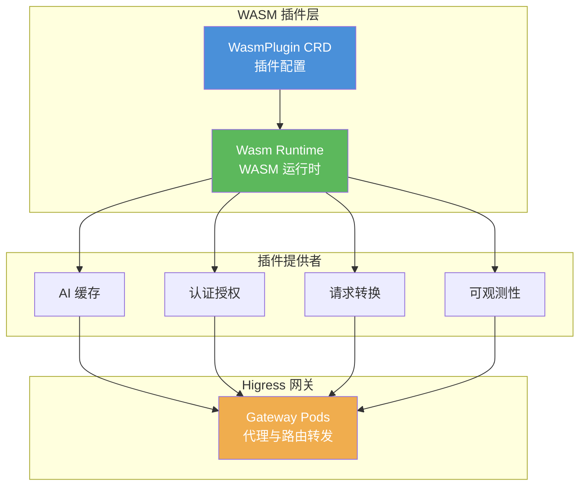

## 核心特性

- **Proxy-WASM 标准**：基于 WebAssembly 的可移植插件标准
- **热更新**：支持运行时动态加载和卸载插件
- **多语言支持**：支持 Go、Rust、C++、AssemblyScript 等语言开发
- **高性能**：近原生执行性能，内存安全隔离
- **生态丰富**：官方提供多种开箱即用的插件

## 技术架构

## 文档目录

### AI 相关插件

#### 核心插件

| 文档 | 描述 |
|------|------|
| [AI 缓存插件深度解析](./79731130-ai-cache-plugin-deep-dive.md) | 基于 WASM 的智能语义缓存实现原理，双层缓存架构、向量数据库集成 |
| [AI 负载均衡插件深度解析](./79731132-higress-ai-load-balancer-deep-dive.md) | 三种智能调度策略（Least Busy、Global Least Request、Prefix Cache）实现原理 |
| [AI 对话历史插件深度解析](./79731133-higress-ai-history-deep-dive.md) | 多轮对话上下文管理、自动填充历史、查询 API 实现 |
| [AI 数据脱敏插件深度解析](./79731134-higress-ai-data-masking-deep-dive.md) | 基于 Rust 的敏感词拦截、数据脱敏、Grok 模式支持 |
| [AI 意图识别插件深度解析](./79731135-higress-ai-intent-deep-dive.md) | 基于 LLM 的智能意图识别、属性设置、路由决策机制 |
| [AI 统计插件深度解析](./79731136-higress-ai-statistics-deep-dive.md) | 可观测性的三驾马车：Metrics、Logs、Traces 全链路监控与多协议支持 |

#### 管理控制插件

| 文档 | 描述 |
|------|------|
| [AI 配额管理插件深度解析](./79731137-higress-ai-quota-deep-dive.md) | Redis 分布式配额管理，Token 级成本控制，动态配额调整 |
| [AI Token 限流插件深度解析](./79731138-higress-ai-token-ratelimit-deep-dive.md) | 基于 Redis 的分布式 Token 限流，固定窗口算法，灵活匹配规则 |

#### 功能增强插件

| 文档 | 描述 |
|------|------|
| [AI 搜索增强插件深度解析](./79731139-higress-ai-search-deep-dive.md) | 多搜索引擎集成（Google、Bing、Arxiv、ES），LLM 智能重写，RAG 实时增强 |
| [AI 安全防护插件深度解析](./79731140-higress-ai-security-guard-deep-dive.md) | 阿里云内容安全集成，三重安全检测（合规、攻击、敏感数据） |
| [AI RAG 插件深度解析](./79731141-higress-ai-rag-deep-dive.md) | DashVector 向量检索集成，语义搜索，文档注入，链路追踪 |

#### 提示词与格式化插件

| 文档 | 描述 |
|------|------|
| [AI 提示词装饰器插件深度解析](./79731142-higress-ai-prompt-decorator-deep-dive.md) | 前后置消息注入，动态变量替换，Geo-IP 联动 |
| [AI JSON 格式化插件深度解析](./79731143-higress-ai-json-resp-deep-dive.md) | JSON Schema 验证，自动重试机制，递归优化输出 |
| [AI 提示词模板插件深度解析](./79731144-higress-ai-prompt-template-deep-dive.md) | 模板定义与复用，变量替换，请求转发 |

#### 高级特性插件

| 文档 | 描述 |
|------|------|
| [AI 图片阅读器插件深度解析](./79731145-higress-ai-image-reader-deep-dive.md) | DashScope OCR 集成，图片内容提取，提示词注入 |
| [AI 智能体插件深度解析](./79731146-higress-ai-agent-deep-dive.md) | ReAct 推理框架，工具调用，OpenAPI 集成，递归推理 |
| [AI 请求响应转换器插件深度解析](./79731147-higress-ai-transformer-deep-dive.md) | LLM 驱动的智能转换，协议适配，内容格式转换 |

### 插件开发指南

| 文档 | 描述 |
|------|------|
| [自定义插件部署](../higress/higress-custom-plugin-deployment-guide.md) | 自定义插件部署指南 |
| [插件服务器](../higress/higress-plugin-server-guide.md) | 插件服务器配置与使用 |

## 官方资源

- [Higress WASM 插件开发文档](https://higress.io/docs/latest/user/wasm-go/)
- [Proxy-WASM Go SDK](https://github.com/higress-group/proxy-wasm-go-sdk)
- [WasmPlugin CRD 参考](https://higress.io/docs/latest/references/wasmplugin/)
