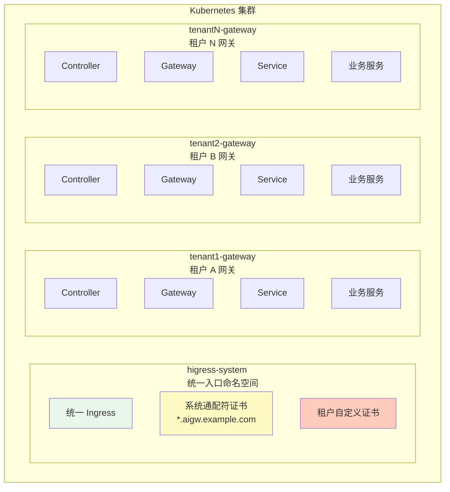
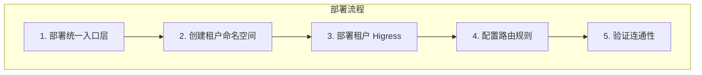
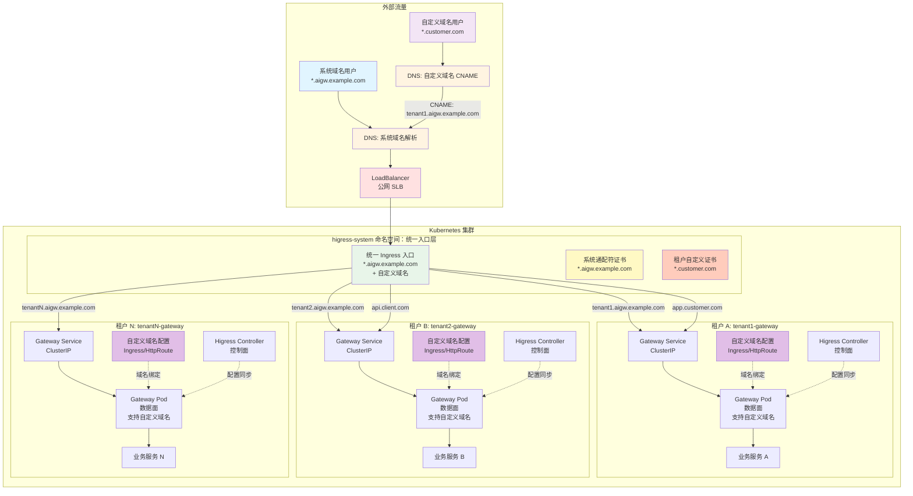
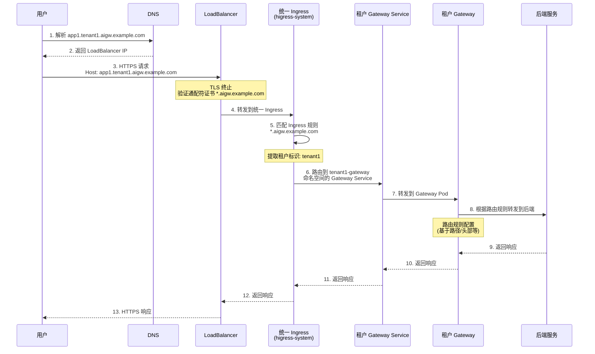
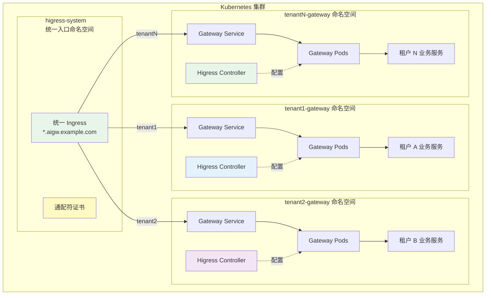
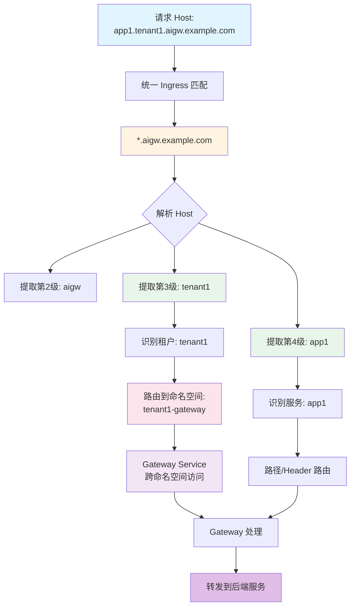
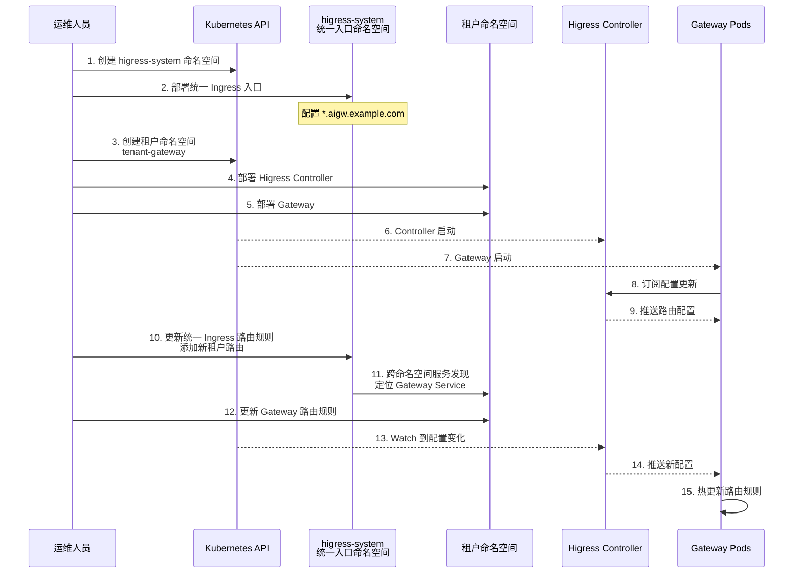
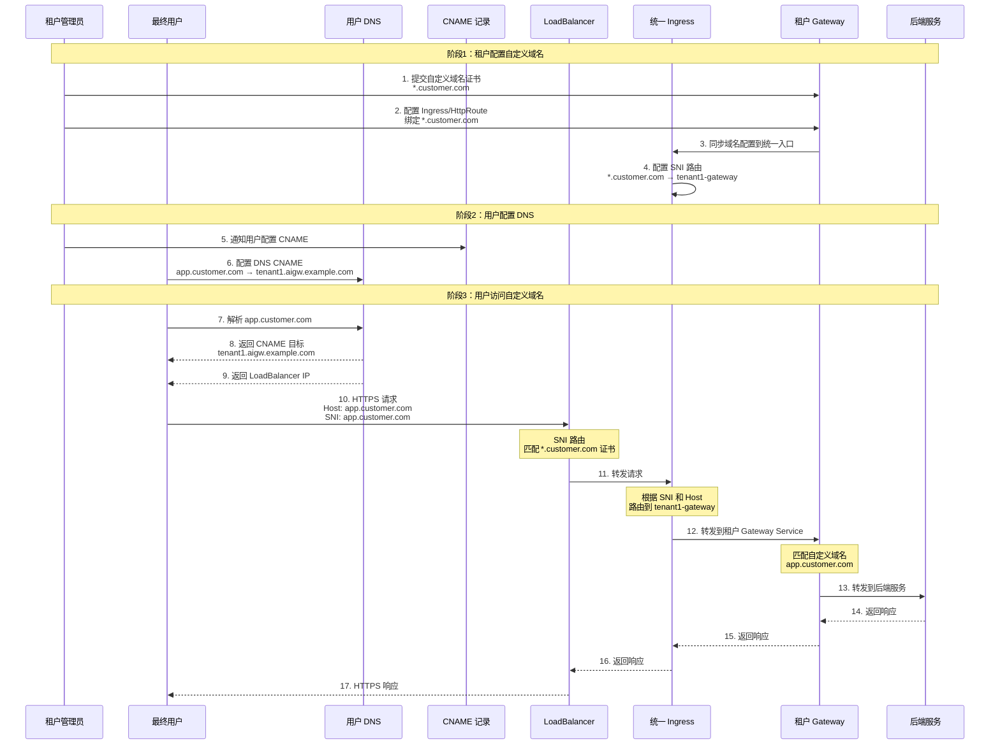
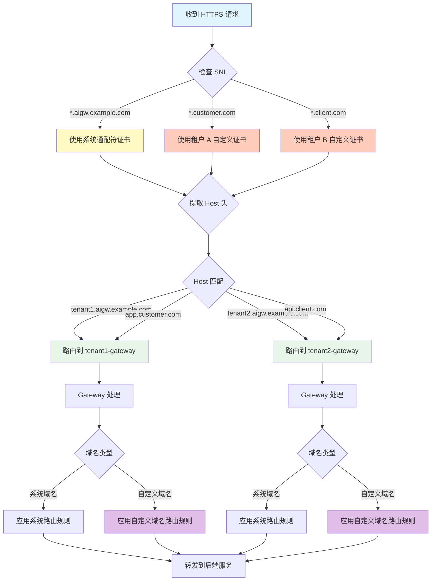

本文档详细说明如何在单个 Kubernetes 集群中部署多套 Higress 实例，实现多租户网关架构。该方案通过统一入口层和命名空间隔离，为每个租户提供独立的网关实例，同时支持系统域名和自定义域名。

## 1. 概述

### 1.1 背景

在云原生场景下，多租户架构是一种常见的需求。当需要为多个租户（团队、部门或外部客户）提供独立的 API 网关服务时，面临以下挑战：

- **资源隔离**：每个租户需要独立的资源配额和使用限额
- **配置隔离**：租户之间的网关配置互不影响
- **域名管理**：支持平台统一管理的系统域名和租户自定义域名
- **运维成本**：避免为每个租户维护独立的 Kubernetes 集群

### 1.2 设计目标

本方案旨在实现以下目标：

- **单集群多实例**：在单个 Kubernetes 集群中部署多套独立的 Higress 实例
- **命名空间隔离**：每个租户使用独立的命名空间，实现资源和配置隔离
- **统一入口**：通过统一的 Ingress 入口处理所有租户流量
- **多域名支持**：同时支持系统泛域名和租户自定义域名
- **弹性扩展**：支持动态添加新租户，无需修改现有配置

### 1.3 适用场景

- **企业内部多团队**：为不同团队提供独立的 API 网关
- **SaaS 平台**：为不同客户提供专属的网关实例
- **多环境部署**：在同一集群中隔离开发、测试、生产环境
- **资源隔离需求**：需要严格控制各租户资源使用的场景

## 2. 架构设计

### 2.1 整体架构

本方案采用双层架构设计：

1. **统一入口层**（higress-system 命名空间）
   - 部署统一的 Ingress Controller
   - 托管系统通配符证书和租户自定义证书
   - 根据 Host 头路由到对应租户的 Gateway

2. **租户网关层**（tenant-gateway 命名空间）
   - 每个租户拥有独立的命名空间
   - 部署完整的 Higress 实例（Controller + Gateway）
   - 独立的配置和路由规则

### 2.2 核心组件

| 组件 | 命名空间 | 数量 | 职责 |
|------|----------|------|------|
| **统一 Ingress** | higress-system | 1 | 接收所有外部流量，按 Host 路由 |
| **系统证书** | higress-system | 1 | 服务系统泛域名 *.aigw.example.com |
| **Higress Controller** | tenant-gateway | N 租户数 | 管理租户网关配置 |
| **Higress Gateway** | tenant-gateway | N 租户数 | 处理租户流量，执行路由规则 |
| **租户证书** | higress-system | N 租户数 | 服务租户自定义域名 |

### 2.3 命名空间规划



## 3. 流量路由机制

### 3.1 4 级泛域名路由

采用 4 级域名结构实现租户和服务识别：

```
[服务名].[租户ID].aigw.example.com
```

**示例**：
- `app1.tenant1.aigw.example.com` → tenant1 租户的 app1 服务
- `api.tenant2.aigw.example.com` → tenant2 租户的 api 服务
- `*.tenant1.aigw.example.com` → tenant1 租户的所有服务

### 3.2 流量路径

```
用户请求 → DNS 解析 → LoadBalancer → 统一 Ingress
    → 租户识别 → 租户 Gateway Service → Gateway Pod
    → 路由规则匹配 → 后端服务
```

### 3.3 Ingress 配置

统一入口层的 Ingress 配置示例：

```yaml
apiVersion: networking.k8s.io/v1
kind: Ingress
metadata:
  name: unified-ingress
  namespace: higress-system
  annotations:
    nginx.ingress.kubernetes.io/ssl-redirect: "true"
spec:
  ingressClassName: nginx
  tls:
  - hosts:
    - "*.aigw.example.com"
    secretName: system-wildcard-cert
  - hosts:
    - "*.customer.com"
    secretName: tenant1-custom-cert
  rules:
  # 租户 A - 系统域名
  - host: "*.tenant1.aigw.example.com"
    http:
      paths:
      - path: /
        pathType: Prefix
        backend:
          service:
            name: tenant1-gateway
            namespace: tenant1-gateway
            port:
              number: 80
  # 租户 A - 自定义域名
  - host: "*.customer.com"
    http:
      paths:
      - path: /
        pathType: Prefix
        backend:
          service:
            name: tenant1-gateway
            namespace: tenant1-gateway
            port:
              number: 80
  # 租户 B - 系统域名
  - host: "*.tenant2.aigw.example.com"
    http:
      paths:
      - path: /
        pathType: Prefix
        backend:
          service:
            name: tenant2-gateway
            namespace: tenant2-gateway
            port:
              number: 80
```

## 4. 部署方案

### 4.1 部署架构



### 4.2 部署步骤

**步骤 1：部署统一入口命名空间**

```bash
# 创建命名空间
kubectl create namespace higress-system

# 部署 Ingress Controller (以 Nginx Ingress 为例)
helm upgrade --install ingress-nginx ingress-nginx \
  --repo https://kubernetes.github.io/ingress-nginx \
  --namespace higress-system \
  --set controller.service.type=LoadBalancer
```

**步骤 2：创建租户命名空间**

```bash
# 为租户创建独立命名空间
kubectl create namespace tenant1-gateway
kubectl create namespace tenant2-gateway
```

**步骤 3：部署租户 Higress 实例**

```bash
# 租户 1
helm upgrade --install tenant1-gateway higress/higress \
  --namespace tenant1-gateway \
  --set global.enableHigressIstio=false \
  --set gateway.replicas=2

# 租户 2
helm upgrade --install tenant2-gateway higress/higress \
  --namespace tenant2-gateway \
  --set global.enableHigressIstio=false \
  --set gateway.replicas=2
```

**步骤 4：配置跨命名空间服务发现**

```yaml
# 在 higress-system 创建 ExternalName Service 指向租户 Gateway
apiVersion: v1
kind: Service
metadata:
  name: tenant1-gateway
  namespace: higress-system
spec:
  type: ExternalName
  externalName: tenant1-gateway.tenant1-gateway.svc.cluster.local
  ports:
  - port: 80
```

### 4.3 资源规划

| 资源类型 | 单租户配置 | 10 租户总计 |
|----------|------------|-------------|
| Gateway Pod | 2 核 × 2 Pod | 40 核 |
| Controller Pod | 1 核 × 1 Pod | 10 核 |
| 内存 | 4GB × 租户数 | 40GB |
| 存储 | 10GB × 租户数 | 100GB |

## 5. 配置示例

### 5.1 租户网关配置

使用 Higress Gateway API 配置租户网关：

```yaml
apiVersion: networking.higress.io/v1
kind: McpBridge
metadata:
  name: mcpbridge
  namespace: tenant1-gateway
spec:
  registries:
  - type: nacos
    domain: "192.168.1.100:8848"
    namespace: "tenant1"
    name: "nacos-1"
    nacosGroups:
    - "DEFAULT_GROUP"
```

### 5.2 Ingress 路由配置

```yaml
apiVersion: networking.k8s.io/v1
kind: Ingress
metadata:
  name: tenant1-api-ingress
  namespace: tenant1-gateway
  annotations:
    higress.io/destination: "tenant1-service.default.svc.cluster.local:8080"
spec:
  ingressClassName: higress
  rules:
  - host: "api.tenant1.aigw.example.com"
    http:
      paths:
      - path: /v1
        pathType: Prefix
        backend:
          service:
            name: tenant1-gateway
            port:
              number: 80
```

### 5.3 证书配置

**系统通配符证书**：

```bash
# 创建 TLS Secret
kubectl create secret tls system-wildcard-cert \
  --cert=star_aigw.example.com.crt \
  --key=star_aigw.example.com.key \
  --namespace=higress-system
```

**租户自定义证书**：

```bash
kubectl create secret tls tenant1-custom-cert \
  --cert=star_customer.com.crt \
  --key=star_customer.com.key \
  --namespace=higress-system
```

## 6. 架构图

### 6.1 整体架构图



**架构说明：**
- **系统域名**：`*.aigw.example.com` 由平台统一管理，使用通配符证书
- **自定义域名**：租户可绑定自己的域名（如 `*.customer.com`），通过 CNAME 指向租户的系统域名
- **统一入口**：所有流量（系统域名 + 自定义域名）统一进入 `higress-system` 命名空间的 Ingress
- **多证书支持**：统一入口层同时托管系统通配符证书和租户自定义证书
- **多租户隔离**：每个租户拥有独立的命名空间（`tenant-gateway`）
- **独立部署**：每个租户部署完整的 Higress（Controller + Gateway）
- **域名绑定**：每个租户的 Gateway 可配置多个自定义域名，通过 Ingress 或 HttpRoute 绑定
- **流量路由**：统一 Ingress 根据请求的 Host 头路由到对应租户命名空间的 Gateway Service

### 6.2 流量路由流程图



**流程说明：**
1. **DNS 解析**：所有 `*.aigw.example.com` 解析到同一个 LoadBalancer IP
2. **TLS 终止**：在统一 Ingress 层使用通配符证书 `*.aigw.example.com` 终止 HTTPS
3. **统一入口**：LoadBalancer 将所有流量转发到 `higress-system` 命名空间的统一 Ingress
4. **租户识别**：Ingress 从请求 Host 中提取租户标识（如 `tenant1`）
5. **Service 路由**：Ingress 根据租户标识路由到对应命名空间的 Gateway Service（跨命名空间服务发现）
6. **后端路由**：Gateway 根据配置的路由规则转发到具体的后端服务

### 6.3 命名空间隔离视图



**隔离特性：**
- **命名空间隔离**：每个租户使用独立的 Kubernetes 命名空间（`tenant-gateway`）
- **统一入口**：`higress-system` 命名空间承载统一 Ingress 入口
- **资源隔离**：每个命名空间可以设置独立的 Resource Quota
- **网络隔离**：可以通过 Network Policy 实现命名空间级别的网络隔离
- **配置隔离**：每个租户有独立的 Controller 和配置，互不影响
- **权限隔离**：可以通过 RBAC 为不同租户设置独立的访问权限
- **跨命名空间路由**：统一 Ingress 通过 ExternalName 或 Service 实现跨命名空间服务发现

### 6.4 域名匹配逻辑图



**域名结构说明：**
- **4 级泛域名格式**：`[服务名].[租户ID].aigw.example.com`
- **通配符匹配**：统一 Ingress 配置 `*.aigw.example.com` 匹配所有子域名
- **租户识别**：从 Host 第3级域名提取租户标识（如 `tenant1`）
- **服务路由**：从第4级域名识别服务名（如 `app1`），或通过路径/Header 路由
- **跨命名空间访问**：统一 Ingress 通过 ExternalName Service 或 Service mesh 实现跨命名空间的 Gateway Service 发现

### 6.5 组件交互时序图



**组件交互说明：**
- **初始化部署**：先部署 `higress-system` 统一入口命名空间和 Ingress，再创建租户命名空间和 Higress 实例
- **跨命名空间路由**：统一 Ingress 通过 ExternalName Service 或跨命名空间 Service 发现定位租户的 Gateway Service
- **配置同步**：每个租户的 Gateway 通过 xDS 协议从自己的 Controller 订阅配置更新
- **动态扩展**：添加新租户时，只需创建新命名空间、部署 Higress，并在统一 Ingress 中添加路由规则
- **热更新**：Gateway 支持路由规则的热更新，不影响现有连接

### 6.6 自定义域名工作流程图



**自定义域名工作流程说明：**

**配置阶段：**
1. **证书提交**：租户向平台提交自己的域名证书（如 `*.customer.com`）
2. **域名绑定**：租户在自己的 Gateway 配置 Ingress 或 HttpRoute，绑定自定义域名
3. **配置同步**：Gateway 将自定义域名配置同步到统一入口 Ingress
4. **SNI 路由**：统一入口配置 SNI（Server Name Indication）路由规则，将自定义域名流量指向对应租户

**DNS 配置阶段：**
5. **CNAME 配置**：用户在自己的 DNS 服务商处配置 CNAME 记录，将自定义域名指向租户的系统域名
6. **域名解析**：`app.customer.com` CNAME → `tenant1.aigw.example.com`

**访问阶段：**
7. **DNS 解析**：用户访问 `app.customer.com`，DNS 返回 CNAME 链和最终 LoadBalancer IP
8. **HTTPS 握手**：用户发起 HTTPS 请求，SNI 包含 `app.customer.com`
9. **证书选择**：LoadBalancer/统一入口根据 SNI 选择对应的租户证书
10. **路由匹配**：统一入口根据 Host 头路由到对应租户的 Gateway
11. **后端处理**：Gateway 匹配自定义域名配置，转发到后端服务

**关键特性：**
- **证书隔离**：每个租户使用自己的域名证书，互不影响
- **SNI 路由**：通过 SNI 实现基于域名的证书选择和路由
- **CNAME 集中**：所有自定义域名通过 CNAME 指向系统域名，DNS 管理简单
- **灵活绑定**：租户可随时添加、删除自定义域名配置
- **流量隔离**：自定义域名流量直接路由到对应租户，安全性高

### 6.7 自定义域名路由决策图



**路由决策说明：**
1. **SNI 证书选择**：根据 TLS SNI 选择对应的证书（系统证书或租户自定义证书）
2. **Host 路由**：根据请求的 Host 头路由到对应租户（支持系统域名和自定义域名）
3. **域名类型识别**：Gateway 识别域名类型（系统域名 vs 自定义域名）
4. **规则应用**：根据域名类型应用对应路由规则（自定义域名可配置独立路由规则）

## 7. 总结

本方案通过在单个 Kubernetes 集群中部署多套 Higress 实例，实现了多租户网关架构。核心设计要点包括：

### 7.1 方案优势

- **资源高效**：单集群多实例，避免为每个租户维护独立集群
- **强隔离性**：命名空间级别的资源和配置隔离
- **灵活扩展**：支持动态添加新租户，无需修改现有配置
- **域名友好**：同时支持系统域名和租户自定义域名
- **运维简化**：统一入口层管理所有流量路由

### 7.2 适用场景

- 企业内部多团队 API 网关
- SaaS 平台多租户网关服务
- 多环境部署（开发/测试/生产隔离）
- 需要资源严格控制的多租户场景

### 7.3 后续优化方向

- 监控告警：为每个租户配置独立的监控大盘
- 安全加固：通过 Network Policy 加强租户间网络隔离
- 性能调优：根据租户流量特点调整资源配置
- 自动化运维：实现租户自助服务和自动化扩缩容

---

## 参考资料

- [Higress 官方文档](https://higress.io/docs)
- [Kubernetes 多租户最佳实践](https://kubernetes.io/docs/concepts/security/multi-tenancy/)
- [Ingress Nginx 多域名配置](https://kubernetes.github.io/ingress-nginx/user-guide/multiple-ingress/)
