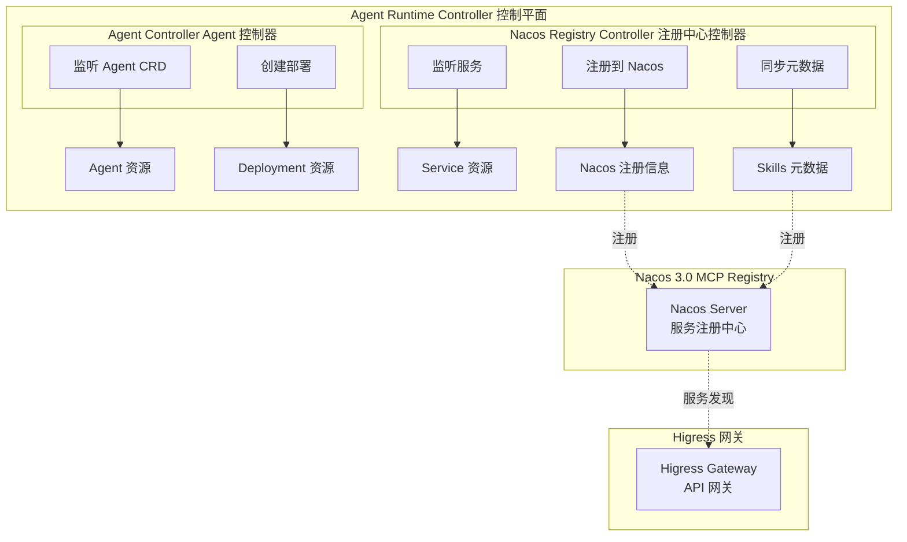
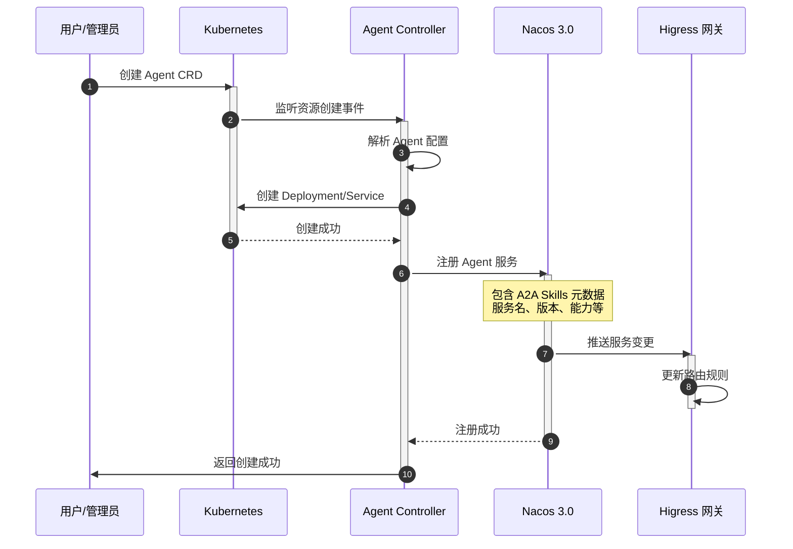
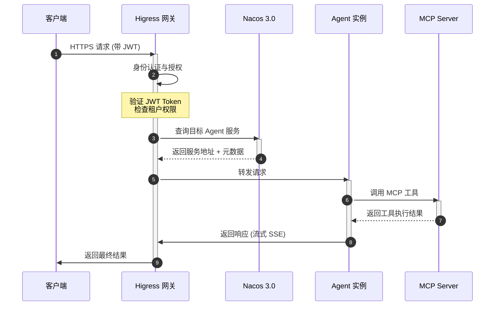
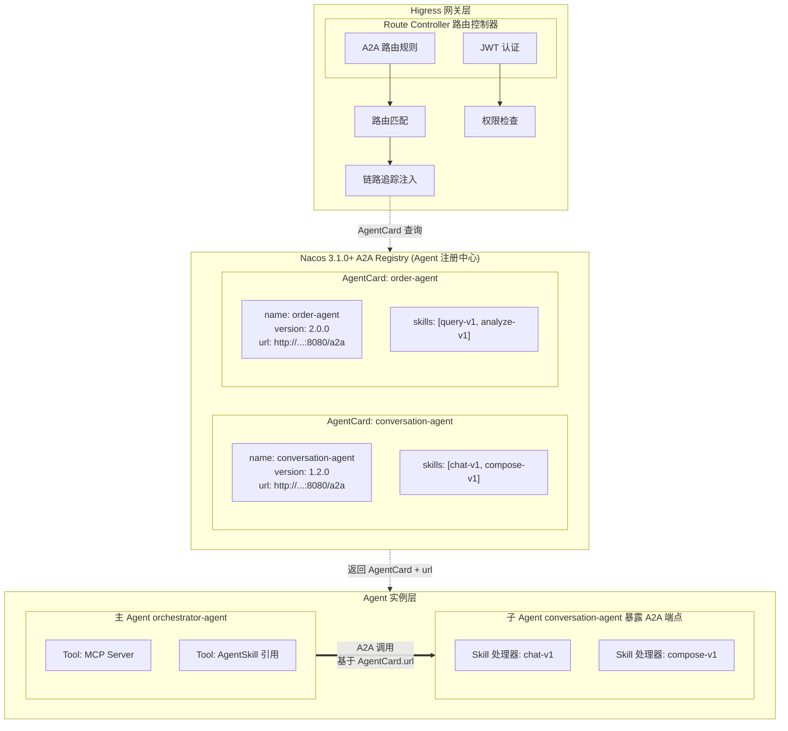
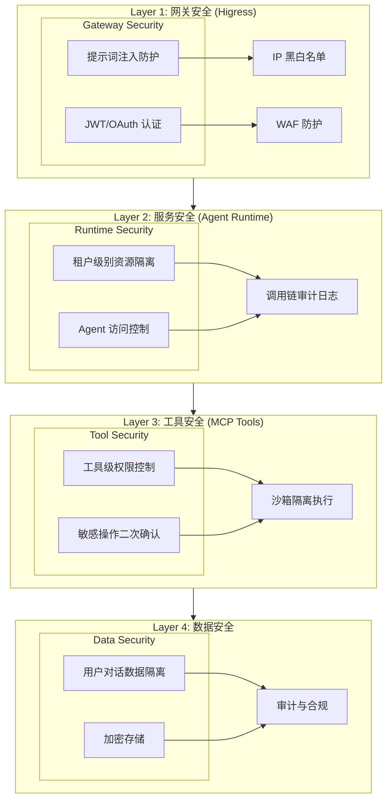
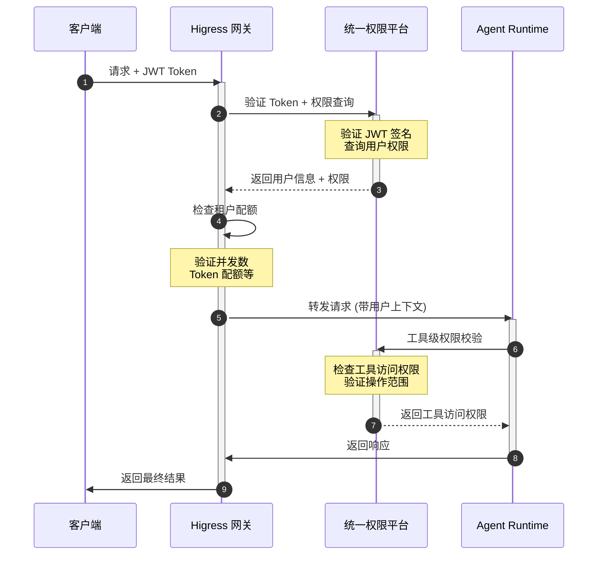
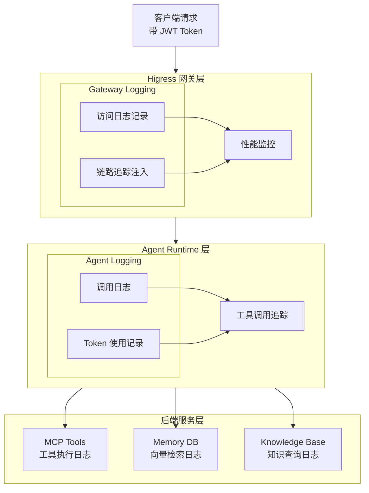
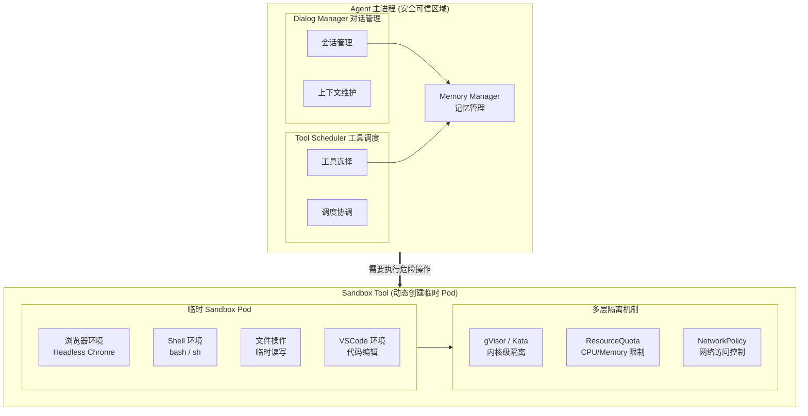

## 引言

随着大语言模型（LLM）技术的迅猛发展，AI Agent 已成为企业智能化转型的核心载体。Agent Runtime 旨在构建一个支持多租户的 AI Agent 运行时平台，为开发者和企业提供稳定、可扩展、安全的执行平台。

本架构设计文档描述如何利用 **Nacos 3.0** 的 MCP Registry 能力和 **Higress** 网关的服务发现机制，实现 Agent Runtime 的服务注册、发现和统一流量管理。

### 核心目标

| 目标 | 说明 |
|------|------|
| 低代码开箱即用 | 通过声明式配置创建 Agent，无需编写代码 |
| Agent 服务自动注册 | Agent 实例自动注册到 Nacos 3.0 MCP Registry |
| 统一流量入口 | 通过 Higress 网关实现流量的安全、可观测管理 |
| 多租户资源隔离 | 租户级别的资源配额、权限控制和数据隔离 |
| 弹性扩缩容 | 支持按需启动、Scale 0 能力 |

---

## 整体架构

### 架构分层

### 核心组件说明

#### Higress 网关层

Higress 是基于 Envoy + Istio 的云原生 API 网关，实现了"三网合一"：

| 能力 | 说明 |
|------|------|
| 流量网关 | 负载均衡、熔断降级、限流 |
| 微服务网关 | 基于 Nacos 的服务发现、动态路由 |
| 安全网关 | 认证授权、提示词注入防护 |

通过 McpBridge 配置 Nacos 3.0 MCP Registry，实现服务注册与发现的集成。

#### Nacos 3.0 MCP Registry 与 A2A 能力

Nacos 3.0 新增的 **MCP Registry** 能力是本架构的核心。更重要的是，Nacos 从 **3.1.0 版本**开始正式支持 **A2A (Agent-to-Agent) Registry**，这是由 Google 开发并捐赠给 Linux 基金会的开放标准，旨在实现 AI Agent 之间的无缝通信与协作。

**Nacos 3.1.0 提供的 A2A Registry 核心能力：**

| 能力类别 | 具体能力 | 说明 |
|---------|---------|------|
| **Agent 注册** | AgentCard 注册 | 符合 A2A 协议的 AgentCard 标准定义 |
| | 命名空间隔离 | 通过 namespaceId 实现环境/租户级隔离 |
| | 名称管理 | 同一命名空间内 Agent name 唯一性保证 |
| | 版本管理 | 支持 Agent 的多版本管理与共存 |
| **Agent 发现** | 服务查询 | 通过 Nacos Client 查询订阅 Agent |
| | 多维筛选 | 按标签、能力、版本等维度检索 |
| | 订阅机制 | 实时接收 Agent 变更通知 |
| **A2A 协议支持** | AgentCard 标准 | 完全兼容 A2A 协议的 AgentCard 定义 |
| | 官方 Registry Protocol | 支持 A2A 官方 Registry Protocol (RoadMap) |
| | 多语言客户端 | Python/Go/Rust 等多语言支持 (RoadMap) |

**Nacos A2A Registry 与传统服务注册的对比：**

| 维度 | 传统服务注册 | A2A Registry (Nacos 3.1.0+) |
|------|-------------|----------------------------|
| 注册实体 | 微服务实例 | AI Agent (AgentCard) |
| 发现内容 | 服务地址 + 端口 | Agent 能力 + Skills 元数据 |
| 通信协议 | HTTP/gRPC | A2A 协议 + JSONRPC |
| 能力描述 | 简单服务名 | 结构化 AgentCard + Input/Output Schema |
| 版本管理 | 服务版本 | Agent 版本 + Skill 版本 |
| 调用方式 | 负载均衡路由 | 意图匹配 + Skill 路由 |

---

## 服务注册与发现流程

### Agent 服务注册流程

### 服务发现与调用流程

---

## A2A (Agent-to-Agent) 调用

### A2A 能力概述

**A2A (Agent-to-Agent)** 是 Agent Runtime 的核心能力之一，允许 Agent 之间相互调用，形成协作式的智能体网络。

基于 Nacos 3.1.0+ 的 A2A Registry，系统实现以下能力：

| 特性 | 说明 |
|------|------|
| **AgentCard 发现** | 通过 Nacos 3.1.0+ A2A Registry 查询 AgentCard，获取 Agent 的完整信息 |
| **Skill 发现** | 从 AgentCard.skills 字段获取 Agent 暴露的所有 Skills |
| **声明式引用** | 在 Agent 配置中直接引用其他 Agent 的 Skill |
| **A2A 协议调用** | 基于 A2A 协议标准调用目标 Agent 的 Skill |
| **安全调用** | 基于内部 JWT 的 Agent 间认证授权 |
| **流式响应** | 支持子 Agent 的流式输出传递给主 Agent |
| **链路追踪** | 完整的调用链路可观测性 |

### A2A 架构设计

### A2A 调用 API 规范

A2A 调用使用标准的 HTTP POST 请求格式：

**请求格式：**
- 路径：`POST /internal/a2a/{target-agent}/{skill-id}`
- 请求头：Authorization（内部 JWT）、X-A2A-Trace-ID、X-A2A-Parent-Agent、X-A2A-Parent-Request-ID
- 请求体：包含 input（输入数据）、context（会话上下文）、options（流式、超时等选项）

**响应格式（流式 SSE）：**
- 响应头：Content-Type: text/event-stream、X-A2A-Trace-ID、X-A2A-Agent-Name、X-A2A-Skill-ID
- 响应体：SSE 事件流，包含 start、chunk、done 等事件类型

### A2A 安全与认证

A2A 调用的安全机制包括：

1. **内部 JWT 认证**：使用专用的内部 JWT 进行 Agent 间认证
2. **权限策略**：默认策略、跨租户调用、敏感 Agent 保护、Skill 级别权限
3. **限流配置**：根据 Agent 的 tier 设置不同的调用频率限制

### A2A 可观测性

A2A 调用的可观测性配置包括：

1. **链路追踪**：采样率配置、追踪数据上报、Span 属性提取
2. **监控指标**：a2a_calls_total、a2a_call_duration_ms、a2a_calls_failed_total

### A2A 高级特性

1. **Skill 版本管理**：支持调用特定版本的 Skill，并可配置回退版本
2. **Skill 组合调用**：通过工作流配置协调多个 Agent 的 Skills
3. **A2A 缓存**：确定性缓存、语义缓存、可配置 TTL

### A2A 故障处理

1. **重试与超时**：默认重试策略、Skill 级别策略、熔断配置
2. **降级策略**：替代 Skill、缓存响应

---

## 安全架构

### 端到端安全链路

### 认证授权流程

---

## 可观测性

### 监控指标

| 层级 | 监控指标 |
|------|----------|
| 网关层 | QPS、延迟、错误率、并发连接数 |
| Agent 层 | 调用量、Token 消耗、响应时间、成功率 |
| 工具层 | MCP 调用次数、执行耗时、失败率 |
| 资源层 | CPU、内存、GPU 使用率 |

### 日志与链路追踪

---

## 部署架构

### Kubernetes 部署

部署架构包括：
- Namespace：agent-runtime、higress-system
- Nacos 3.0：使用 StatefulSet 部署 3 副本集群，支持认证
- Higress 网关：生产环境配置 3 副本，资源配置 CPU 2000m、内存 4Gi

### 服务资源配置

Agent 服务资源配置包含：

1. **资源限制**：CPU 和内存的 requests/limits，可选 GPU 支持
2. **自动扩缩容**：最小/最大副本数、CPU/内存利用率目标、Scale to Zero 支持、冷却时间

---

## API 规范

### Agent 调用 API

**请求格式：**
- 路径：`POST /api/v1/agents/{agent-name}/chat`
- 请求头：Authorization (JWT Token)、Content-Type
- 请求体：message、sessionId、stream、parameters（temperature、maxTokens）

**响应（流式 SSE）：**
- message 事件：流式返回内容片段
- done 事件：结束标记，包含 Token 使用量

### A2A 调用 API

**请求格式：**
- 路径：`POST /api/v1/internal/a2a/{agent-name}/{skill-id}`
- 请求头：Authorization (内部 JWT)、Content-Type
- 请求体：input（A2A 调用输入）、context（调用上下文）

---

## 配置管理

### ModelConfig 配置

模型配置包含：
- Provider：模型提供商（如 Anthropic）
- Model：模型名称
- API Key Secret：密钥引用
- 模型参数：temperature、maxTokens、topP、timeout
- 请求头配置

### Memory 配置

记忆配置包含：
- Provider：向量数据库提供商（如 Pinecone）
- API Key Secret：密钥引用
- 索引配置：indexHost、namespace、topK、scoreThreshold

### RemoteMCPServer 配置

远程 MCP 服务器配置包含：
- URL：MCP 服务器地址
- Protocol：通信协议（如 SSE）
- Timeout：超时时间
- 认证配置：从 Secret 获取认证 Token

---

## 沙箱隔离

### Sandbox 架构

### Sandbox 配置

沙箱配置包含：
- 镜像：沙箱容器镜像
- 运行时：gVisor 或 kata-containers
- 资源限制：CPU、内存、临时存储
- 网络策略：允许的外部访问地址
- 生命周期：TTL（自动销毁时间）

---

## 灰度发布与版本管理

### 灰度发布策略

灰度发布配置包含：
- 版本配置：多个版本及其流量权重
- 灰度规则：基于用户属性（用户组、地区等）的路由规则
- 版本回滚：通过调整流量权重实现快速回滚

---

## 参考资源

### 开源项目
- [kagent](https://github.com/kagent-dev/kagent) - Agent 参考实现
- [agent-sandbox](https://github.com/kubernetes-sigs/agent-sandbox) - Kubernetes 沙箱规范

### 技术栈
- **Higress**: https://higress.cn/
- **Nacos**: https://nacos.io/
- **MCP Protocol**: Model Context Protocol

---

## 附录：核心名词表

| 名词 | 说明 |
|------|------|
| System Prompt | Agent 的系统提示词，定义角色身份、能力边界、行为规范 |
| Skills | 可复用的专业能力模块，Agent 可按需加载 |
| Memory | Agent 的记忆系统，支持长短期记忆和跨会话上下文 |
| Knowledge | Agent 的知识库，访问特定领域文档 |
| MCP | Model Context Protocol，Agent 能力扩展协议 |
| A2A | Agent-to-Agent，Agent 之间的调用机制 |
| BYO | Bring Your Own Agent，用户自编写的 Agent |
| Declarative | 声明式 Agent，通过 YAML 配置定义 |
