## 目录

- [概述](#概述)
- [1. 两地三中心架构设计](#1-两地三中心架构设计)
- [2. 同地域双活架构](#2-同地域双活架构)
- [3. 就近路由策略](#3-就近路由策略)
- [4. Helm Chart 部署配置](#4-helm-chart-部署配置)
- [5. 跨区域网络配置](#5-跨区域网络配置)
- [6. 服务治理配置](#6-服务治理配置)
- [7. 监控与告警](#7-监控与告警)
- [8. 验证测试](#8-验证测试)
- [9. 最佳实践](#9-最佳实践)
- [10. 故障处理](#10-故障处理)

---

## 概述

### 什么是两地三中心

两地三中心是一种高可用容灾架构模式，旨在通过地理分布式部署保障业务连续性：

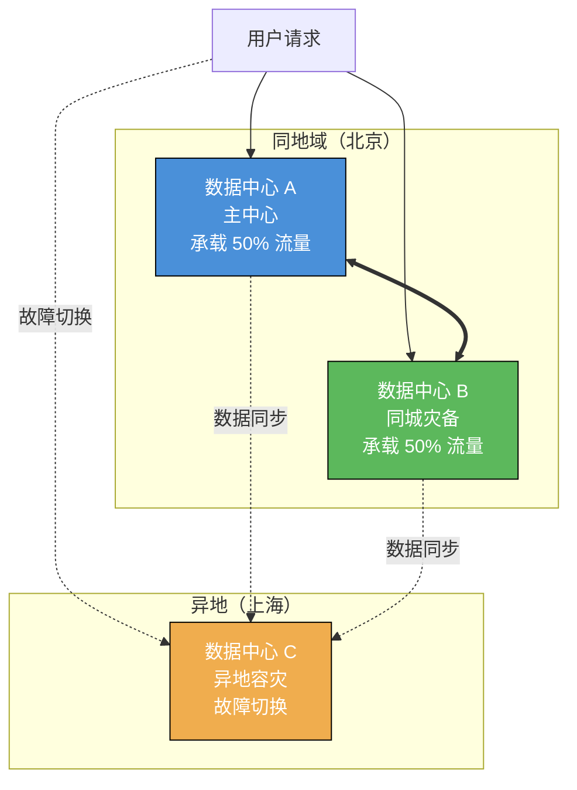

**架构特点**：

| 特性 | 说明 |
|------|------|
| **同地域双活** | 北京两个数据中心同时提供服务，各承载 50% 流量 |
| **就近路由** | 请求优先路由到同地域数据中心，降低延迟 |
| **异地容灾** | 上海数据中心作为异地容灾中心，数据最终一致 |
| **故障切换** | 同地域两中心全部故障时切换到异地中心 |

### AI 网关在架构中的角色

AI 网关（基于 Higress）在整个架构中承担关键职责：

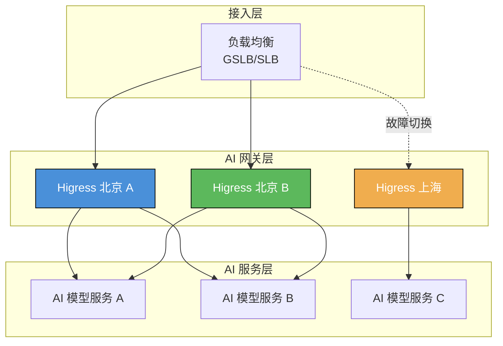

| 职责 | 说明 |
|------|------|
| **统一接入** | 作为 AI 服务的统一入口，简化客户端调用 |
| **流量治理** | 实现负载均衡、熔断降级、限流保护 |
| **就近路由** | 基于请求来源智能路由到最近的数据中心 |
| **安全防护** | 提供 API 认证、授权、内容安全检查 |
| **可观测性** | 统一收集 AI 服务调用的监控和日志 |

---

## 1. 两地三中心架构设计

### 1.1 整体架构拓扑

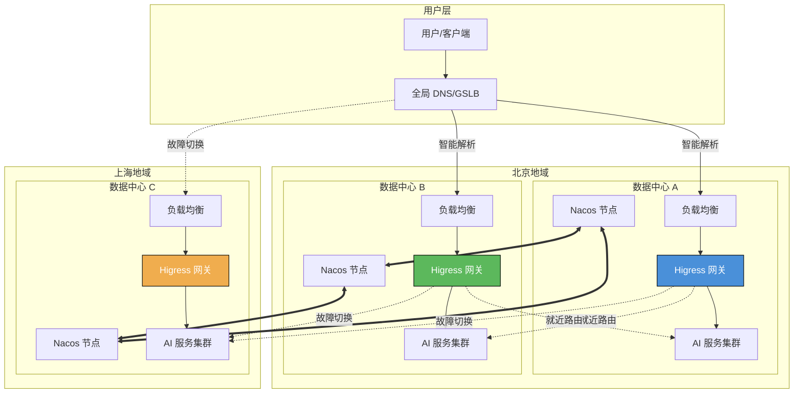

### 1.2 架构层级说明

| 架构层级 | 部署位置 | 角色定位 | 流量策略 |
|---------|---------|---------|---------|
| **同城主中心** | 北京数据中心 A | 生产流量承载中心 | 承载 50% 流量，优先就近 |
| **同城灾备中心** | 北京数据中心 B | 双活数据中心 | 承载 50% 流量，优先就近 |
| **异地灾备中心** | 上海数据中心 C | 异地容灾中心 | 数据最终一致，故障切换 |

### 1.3 核心设计原则

**双活优先原则**

北京两个数据中心同时提供服务，避免资源浪费：

```yaml
# 服务注册配置
spring:
  cloud:
    nacos:
      discovery:
        metadata:
          region: beijing      # 地域标识
          zone: zone-a         # 可用区标识
          datacenter: primary  # 数据中心标识
```

**就近路由原则**

请求优先路由到同地域的数据中心：

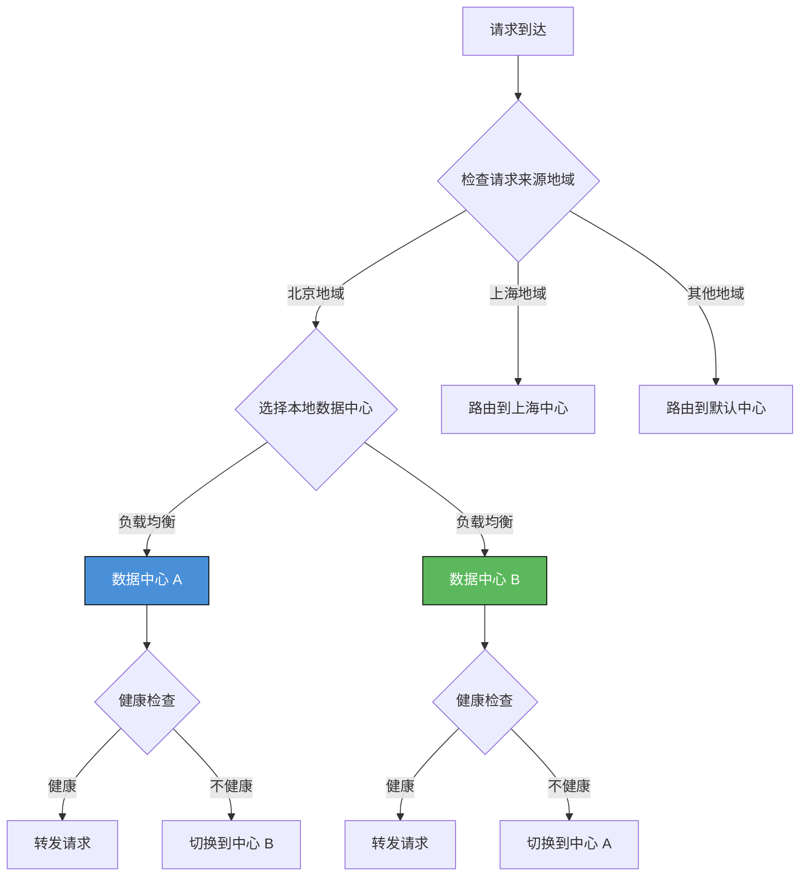

**故障切换原则**

同地域两中心全部故障时切换到异地中心：

| 故障场景 | 切换策略 | 切换时间 |
|---------|---------|---------|
| 北京单中心故障 | 流量切换到北京另一中心 | < 30 秒 |
| 北京双中心故障 | 流量切换到上海中心 | < 60 秒 |
| 全地域故障 | 启用降级策略 | 人工介入 |

---

## 2. 同地域双活架构

### 2.1 双活流量分配

北京两个数据中心采用 50/50 流量分配：

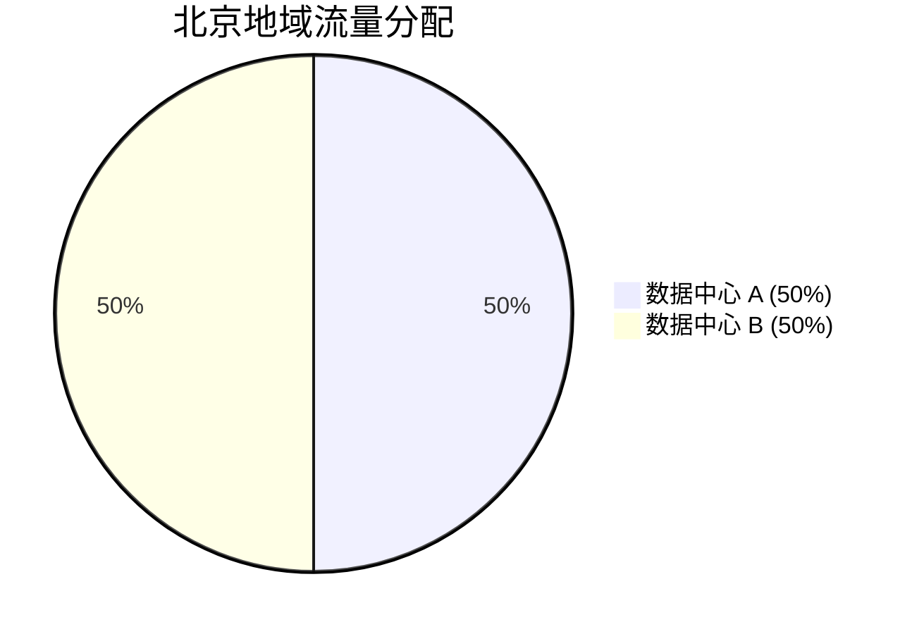

**HTTPRoute 配置示例**：

```yaml
apiVersion: gateway.networking.k8s.io/v1
kind: HTTPRoute
metadata:
  name: ai-service-dual-active-route
  namespace: ai-system
spec:
  parentRefs:
    - name: higress-gateway
      namespace: higress-system
  hostnames:
    - "ai.example.com"
  rules:
    - matches:
        - path:
            type: PathPrefix
            value: /api
      backendRefs:
        # 数据中心 A 的 AI 服务
        - name: ai-service-zone-a.DEFAULT-GROUP.public.nacos
          group: networking.higress.io
          port: 8080
          weight: 50
        # 数据中心 B 的 AI 服务
        - name: ai-service-zone-b.DEFAULT-GROUP.public.nacos
          group: networking.higress.io
          port: 8080
          weight: 50
```

### 2.2 双活特性要求

| 特性 | 要求 | 实现方式 |
|------|------|---------|
| **流量分配** | 主中心与灾备中心各承载 50% 流量 | HTTPRoute 权重配置 |
| **服务状态** | 两中心同时提供服务，无冷备 | Nacos 双向服务注册 |
| **数据同步** | 实时或准实时同步 | Nacos 集群间同步 |
| **切换时间** | 故障自动切换，秒级完成 | 健康检查 + 自动摘除 |
| **客户端感知** | 透明切换，用户无感知 | DNS GSLB + 负载均衡 |

### 2.3 服务发现标签设计

AI 服务在注册到 Nacos 时需要携带地域和机房标签：

```yaml
# 数据中心 A 的 AI 服务注册
spring:
  application:
    name: ai-service
  cloud:
    nacos:
      discovery:
        server-addr: nacos-zone-a.higress-system.svc.cluster.local:8848
        namespace: public
        group: DEFAULT_GROUP
        metadata:
          region: beijing          # 地域：beijing/shanghai
          zone: zone-a             # 机房：zone-a/zone-b
          datacenter: primary      # 数据中心：primary/standby/remote
          version: 1.0.0           # 服务版本
          weight: 50               # 流量权重
```

```yaml
# 数据中心 B 的 AI 服务注册
spring:
  application:
    name: ai-service
  cloud:
    nacos:
      discovery:
        server-addr: nacos-zone-b.higress-system.svc.cluster.local:8848
        namespace: public
        group: DEFAULT_GROUP
        metadata:
          region: beijing
          zone: zone-b
          datacenter: standby
          version: 1.0.0
          weight: 50
```

### 2.4 双活部署架构

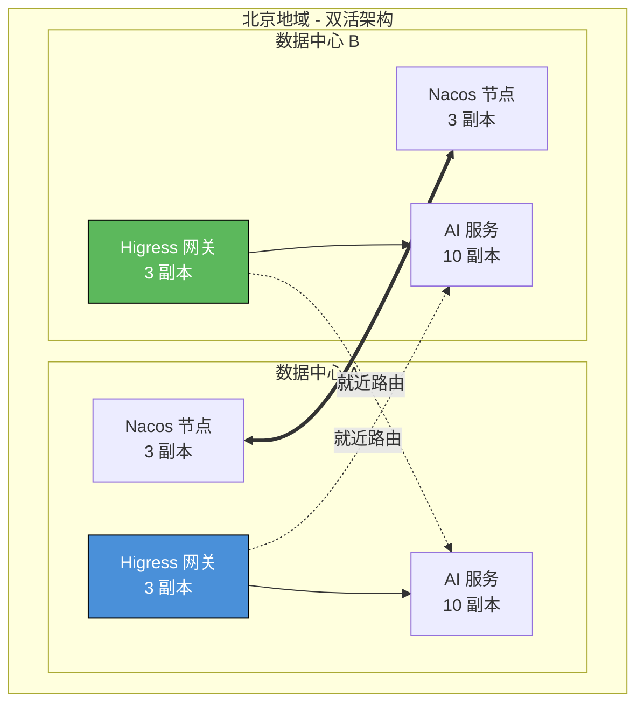

---

## 3. 就近路由策略

### 3.1 就近路由决策流程

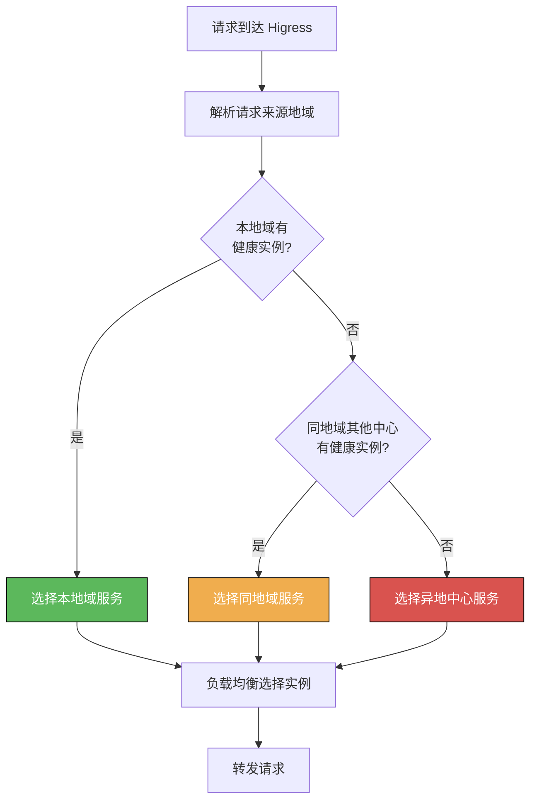

### 3.2 就近路由场景

| 路由场景 | 路由策略 | 配置方式 |
|---------|---------|---------|
| **同地域访问** | 优先路由到同地域两中心（负载均衡） | HTTPRoute 权重配置 |
| **跨地域访问** | 路由到目标地域的本地中心 | 基于请求 Header 路由 |
| **故障场景** | 本地域健康实例不足时路由到异地中心 | 健康检查 + 自动切换 |

### 3.3 基于请求头路由

通过识别请求来源实现就近路由：

```yaml
apiVersion: gateway.networking.k8s.io/v1
kind: HTTPRoute
metadata:
  name: proximity-route-by-header
  namespace: ai-system
spec:
  parentRefs:
    - name: higress-gateway
      namespace: higress-system
  hostnames:
    - "ai.example.com"
  rules:
    # 北京地域请求路由到北京中心
    - matches:
        - headers:
            - name: X-Client-Region
              value: beijing
      backendRefs:
        - name: ai-service-zone-a.DEFAULT-GROUP.public.nacos
          group: networking.higress.io
          port: 8080
          weight: 50
        - name: ai-service-zone-b.DEFAULT-GROUP.public.nacos
          group: networking.higress.io
          port: 8080
          weight: 50
    # 上海地域请求路由到上海中心
    - matches:
        - headers:
            - name: X-Client-Region
              value: shanghai
      backendRefs:
        - name: ai-service-shanghai.DEFAULT-GROUP.public.nacos
          group: networking.higress.io
          port: 8080
    # 默认路由到北京中心
    - matches:
        - path:
            type: PathPrefix
            value: /
      backendRefs:
        - name: ai-service-zone-a.DEFAULT-GROUP.public.nacos
          group: networking.higress.io
          port: 8080
          weight: 50
        - name: ai-service-zone-b.DEFAULT-GROUP.public.nacos
          group: networking.higress.io
          port: 8080
          weight: 50
```

### 3.4 跨地域容灾路由

本地域两中心全部故障时切换到异地中心：

```yaml
apiVersion: gateway.networking.k8s.io/v1
kind: HTTPRoute
metadata:
  name: cross-region-failover-route
  namespace: ai-system
spec:
  parentRefs:
    - name: higress-gateway
      namespace: higress-system
  hostnames:
    - "ai.example.com"
  rules:
    - matches:
        - path:
            type: PathPrefix
            value: /
      backendRefs:
        # 本地域数据中心 A（主）
        - name: ai-service-zone-a.DEFAULT-GROUP.public.nacos
          group: networking.higress.io
          port: 8080
          weight: 50
        # 本地域数据中心 B（主）
        - name: ai-service-zone-b.DEFAULT-GROUP.public.nacos
          group: networking.higress.io
          port: 8080
          weight: 50
        # 异地数据中心 C（容灾）
        - name: ai-service-shanghai.DEFAULT-GROUP.public.nacos
          group: networking.higress.io
          port: 8080
          weight: 0
```

**故障切换机制**：

| 健康实例数量 | 路由策略 |
|-------------|---------|
| 本地域 ≥ 2 个中心 | 仅路由到本地域中心 |
| 本地域 = 1 个中心 | 路由到健康中心 + 异地中心（20% 流量） |
| 本地域 = 0 个中心 | 全部路由到异地中心 |

---

## 4. Helm Chart 部署配置

### 4.1 部署架构概述

```mermaid
graph TB
    subgraph "数据中心 A (北京)"
        subgraph "Kubernetes 集群"
            HelmChart[Helm Chart<br/>mcn-higress]
            Gateway[Higress Gateway<br/>Ingress 模式]
            Pilot[Pilot Discovery]
            Console[Console 可选]
        end
    end

    subgraph "数据中心 B (北京)"
        subgraph "Kubernetes 集群"
            HelmChart2[Helm Chart<br/>mcn-higress]
            Gateway2[Higress Gateway<br/>Ingress 模式]
            Pilot2[Pilot Discovery]
            Console2[Console 可选]
        end
    end

    subgraph "数据中心 C (上海)"
        subgraph "Kubernetes 集群"
            HelmChart3[Helm Chart<br/>mcn-higress]
            Gateway3[Higress Gateway<br/>Ingress 模式]
            Pilot3[Pilot Discovery]
            Console3[Console 可选]
        end
    end

    style Gateway fill:#4a90d9,stroke:#000000,color:#FFFFFF
    style Gateway2 fill:#5cb85c,stroke:#000000,color:#FFFFFF
    style Gateway3 fill:#f0ad4e,stroke:#000000,color:#FFFFFF
```

### 4.2 Helm Chart 基础配置

**Chart 位置**：`/Users/caisd1/midea_code/mcn/mcn-gateway-chart/mcn-higress`

**部署前准备**：

```bash
# 添加 Higress Helm 仓库
helm repo add higress https://higress.io/helm-charts
helm repo update

# 拉取 Chart 到本地
helm pull higress/higress --version 2.1.9
tar -xzf higress-2.1.9.tgz

# 或使用自定义 Chart
cd /Users/caisd1/midea_code/mcn/mcn-gateway-chart/mcn-higress
```

### 4.3 数据中心 A 配置

**values-zone-a.yaml**：

```yaml
# 全局配置
global:
  # 启用 Gateway API
  enableGatewayAPI: true
  # 本地集群标识
  localClusterName: zone-a
  # 部署模式
  mode: data

# Gateway 配置
gateway:
  # 副本数量（生产环境建议 3+）
  replicaCount: 3
  # 资源配置
  resources:
    requests:
      cpu: 2000m
      memory: 4Gi
    limits:
      cpu: 4000m
      memory: 8Gi
  # Ingress Class
  ingressClass: higress
  # 监听端口
  service:
    type: LoadBalancer
    ports:
      - name: http
        port: 80
        targetPort: 80
        protocol: TCP
      - name: https
        port: 443
        targetPort: 443
        protocol: TCP
  # 自动扩缩容
  autoscaling:
    enabled: true
    minReplicas: 3
    maxReplicas: 10
    targetCPUUtilizationPercentage: 70
    targetMemoryUtilizationPercentage: 80

# Pilot 配置
pilot:
  replicaCount: 2
  resources:
    requests:
      cpu: 500m
      memory: 1Gi
    limits:
      cpu: 1000m
      memory: 2Gi

# Nacos 配置
nacos:
  enabled: true
  mode: cluster
  replicaCount: 3
  image:
    repository: nacos/nacos-server
    tag: 2.3.0
  resources:
    requests:
      cpu: 500m
      memory: 1Gi
    limits:
      cpu: 1000m
      memory: 2Gi
  # 数据存储
  storage:
    enabled: true
    class: nfs-sc
    size: 10Gi
  # 集群配置
  config:
    service:
      port: 8848
    # 多数据中心配置
    metadata:
      region: beijing
      zone: zone-a
      datacenter: primary

# Console 配置（可选）
console:
  enabled: true
  replicaCount: 1
  service:
    type: ClusterIP
    port: 8080

# 监控配置
monitoring:
  enabled: true
  # Prometheus ServiceMonitor
  serviceMonitor:
    enabled: true
    namespace: monitoring
    interval: 30s
    scrapeTimeout: 10s

# 日志配置
logging:
  level: info
  format: json
```

### 4.4 数据中心 B 配置

**values-zone-b.yaml**：

```yaml
# 全局配置
global:
  enableGatewayAPI: true
  localClusterName: zone-b
  mode: data

# Gateway 配置（与 A 中心相同）
gateway:
  replicaCount: 3
  resources:
    requests:
      cpu: 2000m
      memory: 4Gi
    limits:
      cpu: 4000m
      memory: 8Gi
  ingressClass: higress
  service:
    type: LoadBalancer
    ports:
      - name: http
        port: 80
        targetPort: 80
      - name: https
        port: 443
        targetPort: 443
  autoscaling:
    enabled: true
    minReplicas: 3
    maxReplicas: 10
    targetCPUUtilizationPercentage: 70
    targetMemoryUtilizationPercentage: 80

# Pilot 配置
pilot:
  replicaCount: 2
  resources:
    requests:
      cpu: 500m
      memory: 1Gi
    limits:
      cpu: 1000m
      memory: 2Gi

# Nacos 配置
nacos:
  enabled: true
  mode: cluster
  replicaCount: 3
  image:
    repository: nacos/nacos-server
    tag: 2.3.0
  resources:
    requests:
      cpu: 500m
      memory: 1Gi
    limits:
      cpu: 1000m
      memory: 2Gi
  storage:
    enabled: true
    class: nfs-sc
    size: 10Gi
  config:
    service:
      port: 8848
    # 数据中心 B 特定配置
    metadata:
      region: beijing
      zone: zone-b
      datacenter: standby

console:
  enabled: true
  replicaCount: 1

monitoring:
  enabled: true
  serviceMonitor:
    enabled: true
    namespace: monitoring
```

### 4.5 数据中心 C 配置

**values-shanghai.yaml**：

```yaml
# 全局配置
global:
  enableGatewayAPI: true
  localClusterName: shanghai
  mode: data

# Gateway 配置
gateway:
  replicaCount: 2  # 异地中心可以适当减少副本
  resources:
    requests:
      cpu: 1000m
      memory: 2Gi
    limits:
      cpu: 2000m
      memory: 4Gi
  ingressClass: higress
  service:
    type: LoadBalancer
    ports:
      - name: http
        port: 80
        targetPort: 80
      - name: https
        port: 443
        targetPort: 443
  autoscaling:
    enabled: true
    minReplicas: 2
    maxReplicas: 6
    targetCPUUtilizationPercentage: 70
    targetMemoryUtilizationPercentage: 80

# Pilot 配置
pilot:
  replicaCount: 1
  resources:
    requests:
      cpu: 500m
      memory: 1Gi
    limits:
      cpu: 1000m
      memory: 2Gi

# Nacos 配置
nacos:
  enabled: true
  mode: cluster
  replicaCount: 3
  image:
    repository: nacos/nacos-server
    tag: 2.3.0
  resources:
    requests:
      cpu: 500m
      memory: 1Gi
    limits:
      cpu: 1000m
      memory: 2Gi
  storage:
    enabled: true
    class: nfs-sc
    size: 10Gi
  config:
    service:
      port: 8848
    # 异地中心配置
    metadata:
      region: shanghai
      zone: zone-c
      datacenter: remote

console:
  enabled: false  # 异地中心可以不部署 Console

monitoring:
  enabled: true
```

### 4.6 部署命令

```bash
# 在数据中心 A 部署
helm install higress-zone-a ./higress \
  -n higress-system \
  --create-namespace \
  -f values-zone-a.yaml \
  --wait \
  --timeout 10m

# 在数据中心 B 部署
helm install higress-zone-b ./higress \
  -n higress-system \
  --create-namespace \
  -f values-zone-b.yaml \
  --wait \
  --timeout 10m

# 在数据中心 C 部署
helm install higress-shanghai ./higress \
  -n higress-system \
  --create-namespace \
  -f values-shanghai.yaml \
  --wait \
  --timeout 10m

# 验证部署
kubectl get pods -n higress-system
kubectl get svc -n higress-system
kubectl get gateway -n higress-system
```

### 4.7 部署验证

```bash
# 检查 Pod 状态
kubectl get pods -n higress-system -l app=higress-gateway

# 检查服务状态
kubectl get svc -n higress-system

# 检查 Gateway 状态
kubectl get gateway -n higress-system

# 检查 Nacos 状态
kubectl get pods -n higress-system -l app=nacos

# 检查 McpBridge 配置
kubectl get mcpbridge -n higress-system -o yaml

# 测试服务连通性
kubectl exec -it -n higress-system <higress-pod> -- \
  curl http://ai-service:8080/health
```

---

## 5. 跨区域网络配置

### 5.1 网络拓扑

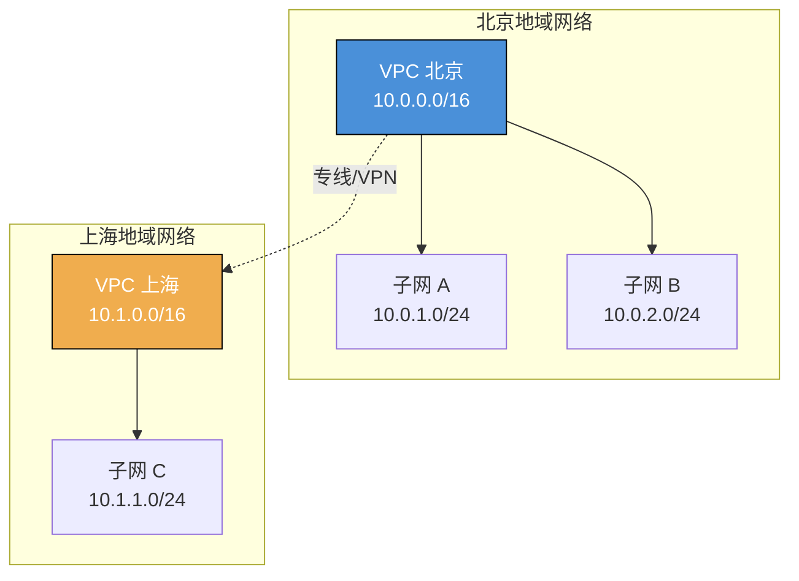

### 5.2 网络连通方案

| 方案 | 适用场景 | 带宽 | 延迟 | 成本 |
|------|---------|------|------|------|
| **VPC 对等连接** | 同一云厂商多 VPC | 高 | 低 | 低 |
| **专线接入** | 跨地域混合云 | 高 | 中 | 高 |
| **VPN 连接** | 低成本跨地域 | 中 | 高 | 低 |
| **云企业网** | 跨地域多 VPC | 高 | 中 | 中 |

### 5.3 防火墙与安全组规则

**数据中心 A 安全组规则**：

```yaml
# 入站规则
InboundRules:
  - Port: 80
    Protocol: TCP
    Source: 0.0.0.0/0
    Description: "HTTP from Internet"

  - Port: 443
    Protocol: TCP
    Source: 0.0.0.0/0
    Description: "HTTPS from Internet"

  - Port: 8848
    Protocol: TCP
    Source:
      - 10.0.2.0/24    # 数据中心 B
      - 10.1.0.0/16    # 数据中心 C
    Description: "Nacos from other datacenters"

  - Port: 8080
    Protocol: TCP
    Source:
      - 10.0.0.0/16    # 本地域
      - 10.1.0.0/16    # 异地域
    Description: "AI Service from Higress"

# 出站规则
OutboundRules:
  - Port: 8080
    Protocol: TCP
    Destination:
      - 10.0.2.0/24
      - 10.1.0.0/16
    Description: "Access AI Services in other datacenters"
```

### 5.4 Ingress 域名与证书配置

**TLS 证书配置**：

```bash
# 创建 TLS Secret
kubectl create secret tls ai-gateway-tls \
  --cert=/path/to/tls.crt \
  --key=/path/to/tls.key \
  -n higress-system
```

**Gateway TLS 配置**：

```yaml
apiVersion: gateway.networking.k8s.io/v1
kind: Gateway
metadata:
  name: higress-gateway
  namespace: higress-system
spec:
  gatewayClassName: higress-gateway-class
  listeners:
    - name: http
      protocol: HTTP
      port: 80
      hostname: "*.example.com"
    - name: https
      protocol: HTTPS
      port: 443
      hostname: "*.example.com"
      tls:
        mode: Terminate
        certificateRefs:
          - name: ai-gateway-tls
```

### 5.5 DNS 配置

**全局 DNS 配置**：

| 记录类型 | 名称 | 值 | TTL | 说明 |
|---------|------|-----|-----|------|
| A | ai.example.com | 1.2.3.4, 5.6.7.8 | 60 | 北京中心 IP |
| A | ai.example.com | 9.10.11.12 | 60 | 上海中心 IP |
| CNAME | beijing.ai.example.com | ai-zone-a.example.com | 300 | 北京中心域名 |
| CNAME | shanghai.ai.example.com | ai-shanghai.example.com | 300 | 上海中心域名 |

**GSLB 配置**：

```yaml
# GSLB 智能解析策略
GeoDNS:
  - Region: beijing
    Targets:
      - ip: 1.2.3.4
        weight: 50
      - ip: 5.6.7.8
        weight: 50
    HealthCheck:
      protocol: TCP
      port: 443
      interval: 10s
      timeout: 3s

  - Region: shanghai
    Targets:
      - ip: 9.10.11.12
        weight: 100
    HealthCheck:
      protocol: TCP
      port: 443
      interval: 10s
      timeout: 3s
```

---

## 6. 服务治理配置

### 6.1 服务发现与注册

**McpBridge 配置**：

```yaml
apiVersion: networking.higress.io/v1
kind: McpBridge
metadata:
  name: ai-service-registry
  namespace: higress-system
spec:
  registries:
    # 本地 Nacos（数据中心 A）
    - name: nacos-zone-a
      type: nacos2
      domain: nacos-zone-a.higress-system.svc.cluster.local
      port: 8848
      nacosNamespaceId: public
      nacosGroups:
        - DEFAULT_GROUP
      nacosServiceNameMap: |
        ai-service: ai-service-zone-a

    # 同地域 Nacos（数据中心 B）
    - name: nacos-zone-b
      type: nacos2
      domain: nacos-zone-b.higress-system.svc.cluster.local
      port: 8848
      nacosNamespaceId: public
      nacosGroups:
        - DEFAULT_GROUP
      nacosServiceNameMap: |
        ai-service: ai-service-zone-b

    # 异地 Nacos（数据中心 C）
    - name: nacos-shanghai
      type: nacos2
      domain: nacos-shanghai.higress-system.svc.cluster.local
      port: 8848
      nacosNamespaceId: public
      nacosGroups:
        - DEFAULT_GROUP
      nacosServiceNameMap: |
        ai-service: ai-service-shanghai
```

### 6.2 双活流量调度

**同地域 50/50 流量分配**：

```yaml
apiVersion: gateway.networking.k8s.io/v1
kind: HTTPRoute
metadata:
  name: ai-service-dual-active
  namespace: ai-system
spec:
  parentRefs:
    - name: higress-gateway
      namespace: higress-system
  hostnames:
    - "ai.example.com"
  rules:
    - matches:
        - path:
            type: PathPrefix
            value: /v1/chat
      backendRefs:
        - name: ai-service-zone-a.DEFAULT-GROUP.public.nacos
          group: networking.higress.io
          port: 8080
          weight: 50
        - name: ai-service-zone-b.DEFAULT-GROUP.public.nacos
          group: networking.higress.io
          port: 8080
          weight: 50
      # 超时配置
      timeouts:
        backendRequest: 60s
      # 重试策略
      filters:
        - type: ExtensionRef
          extensionRef:
            group: networking.higress.io
            kind: Retry
            name: ai-service-retry
```

**重试策略**：

```yaml
apiVersion: networking.higress.io/v1
kind: Retry
metadata:
  name: ai-service-retry
  namespace: ai-system
spec:
  retryOn:
    - 5xx
    - reset
    - connect-failure
    - retriable-status-codes
  numRetries: 3
  perTryTimeout: 20s
  retryRemoteLocalities: true
```

### 6.3 健康检查与自动摘除

**健康检查配置**：

```yaml
apiVersion: networking.higress.io/v1
kind: McpBridge
metadata:
  name: ai-service-health-check
  namespace: higress-system
spec:
  registries:
    - name: nacos-zone-a
      type: nacos2
      domain: nacos-zone-a.higress-system.svc.cluster.local
      port: 8848
      # 健康检查配置
      healthCheck:
        enabled: true
        protocol: HTTP
        path: /health
        interval: 5s
        timeout: 3s
        unhealthyThreshold: 3
        healthyThreshold: 2
```

**健康检查流程**：

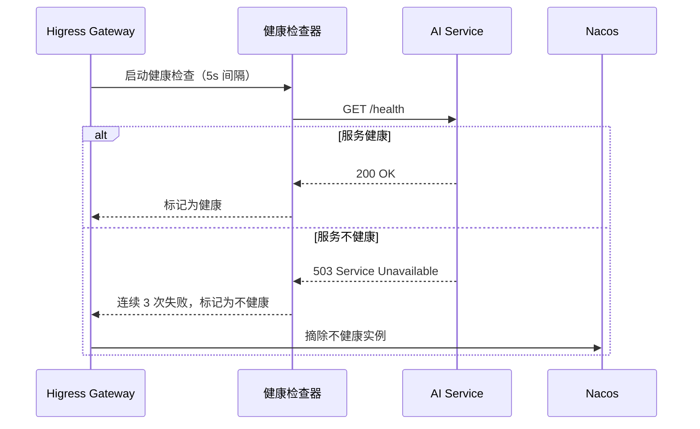

### 6.4 数据同步方案

**Nacos 集群间同步**：

```yaml
# Nacos 配置
nacos:
  config:
    # 集群间通信
    cluster:
      name: beijing-cluster
      nodes:
        - host: nacos-zone-a.higress-system.svc.cluster.local
          port: 8848
        - host: nacos-zone-b.higress-system.svc.cluster.local
          port: 8848
    # 多数据中心配置
    metadata:
      region: beijing
      zone: zone-a
      datacenter: primary
    # 数据同步
    sync:
      enabled: true
      remote:
        - name: shanghai-cluster
          servers:
            - nacos-shanghai.higress-system.svc.cluster.local:8848
          syncInterval: 30s
          syncMode: async
```

---

## 7. 监控与告警

### 7.1 监控指标

| 指标类别 | 关键指标 | 说明 | 告警阈值 |
|---------|---------|------|---------|
| **流量指标** | 总 QPS | 网关总请求量 | > 10000 |
| | 响应时间 P99 | 99 分位延迟 | > 500ms |
| | 错误率 | 请求错误比例 | > 1% |
| **双活指标** | 中心 A 流量占比 | 中心 A 流量比例 | < 40% 或 > 60% |
| | 中心 B 流量占比 | 中心 B 流量比例 | < 40% 或 > 60% |
| | 跨中心流量 | 跨数据中心流量 | > 10% |
| **健康指标** | 中心 A 健康实例数 | 中心 A 健康实例 | < 3 |
| | 中心 B 健康实例数 | 中心 B 健康实例 | < 3 |
| | 故障切换次数 | 自动故障切换 | > 1/小时 |

### 7.2 Prometheus 配置

```yaml
apiVersion: v1
kind: ConfigMap
metadata:
  name: prometheus-config
  namespace: monitoring
data:
  prometheus.yml: |
    global:
      scrape_interval: 30s
      evaluation_interval: 30s

    scrape_configs:
      # Higress Gateway 监控
      - job_name: 'higress-gateway'
        kubernetes_sd_configs:
          - role: pod
            namespaces:
              names:
                - higress-system
        relabel_configs:
          - source_labels: [__meta_kubernetes_pod_label_app]
            action: keep
            regex: higress-gateway

      # Nacos 监控
      - job_name: 'nacos'
        kubernetes_sd_configs:
          - role: pod
            namespaces:
              names:
                - higress-system
        relabel_configs:
          - source_labels: [__meta_kubernetes_pod_label_app]
            action: keep
            regex: nacos
```

### 7.3 Grafana 监控面板

**关键面板配置**：

```yaml
# 流量监控面板
panels:
  - title: "总 QPS"
    type: graph
    targets:
      - expr: sum(rate(higress_request_total{job="higress-gateway"}[5m]))

  - title: "响应时间 P99"
    type: graph
    targets:
      - expr: histogram_quantile(0.99, sum(rate(higress_request_duration_bucket[5m])) by (le))

  - title: "错误率"
    type: graph
    targets:
      - expr: sum(rate(higress_request_total{status=~"5.."}[5m])) / sum(rate(higress_request_total[5m]))

  - title: "中心流量分布"
    type: piechart
    targets:
      - expr: sum(rate(higress_request_total{datacenter="zone-a"}[5m]))
      - expr: sum(rate(higress_request_total{datacenter="zone-b"}[5m]))
      - expr: sum(rate(higress_request_total{datacenter="shanghai"}[5m]))
```

### 7.4 告警规则

```yaml
apiVersion: monitoring.coreos.com/v1
kind: PrometheusRule
metadata:
  name: higress-alerts
  namespace: monitoring
spec:
  groups:
    - name: higress
      rules:
        # 高错误率告警
        - alert: HighErrorRate
          expr: |
            sum(rate(higress_request_total{status=~"5.."}[5m])) /
            sum(rate(higress_request_total[5m])) > 0.01
          for: 5m
          labels:
            severity: critical
          annotations:
            summary: "网关错误率过高"
            description: "错误率超过 1%，当前值：{{ $value }}"

        # 双活流量不均衡告警
        - alert: ImbalancedTraffic
          expr: |
            abs(
              sum(rate(higress_request_total{datacenter="zone-a"}[5m])) -
              sum(rate(higress_request_total{datacenter="zone-b"}[5m]))
            ) / sum(rate(higress_request_total{datacenter=~"zone-a|zone-b"}[5m])) > 0.1
          for: 10m
          labels:
            severity: warning
          annotations:
            summary: "双活流量不均衡"
            description: "两个中心流量差异超过 10%"

        # 故障切换告警
        - alert: FailoverTriggered
          expr: increase(higress_failover_total[1h]) > 0
          labels:
            severity: critical
          annotations:
            summary: "触发故障切换"
            description: "在过去 1 小时内触发了故障切换"
```

---

## 8. 验证测试

### 8.1 基础功能测试

**测试清单**：

| 测试项 | 测试命令 | 预期结果 |
|--------|---------|---------|
| 服务注册 | `curl http://nacos:8848/nacos/v1/ns/instance/list?serviceName=ai-service` | 返回两个中心的服务实例 |
| 流量分配 | `for i in {1..100}; do curl http://ai.example.com/api/health; done` | 两个中心各约 50% 流量 |
| 就近路由 | `curl -H "X-Client-Region: beijing" http://ai.example.com/api/health` | 路由到北京中心 |
| 故障切换 | 停止一个中心的服务，发送请求 | 自动切换到另一个中心 |

### 8.2 双活流量验证

```bash
#!/bin/bash
# 双活流量分配测试脚本

TOTAL=100
ZONE_A_COUNT=0
ZONE_B_COUNT=0

for i in $(seq 1 $TOTAL); do
  RESPONSE=$(curl -s http://ai.example.com/api/health)
  ZONE=$(echo $RESPONSE | jq -r '.zone')

  if [ "$ZONE" == "zone-a" ]; then
    ZONE_A_COUNT=$((ZONE_A_COUNT + 1))
  elif [ "$ZONE" == "zone-b" ]; then
    ZONE_B_COUNT=$((ZONE_B_COUNT + 1))
  fi
done

echo "Zone A: $ZONE_A_COUNT ($(($ZONE_A_COUNT * 100 / $TOTAL))%)"
echo "Zone B: $ZONE_B_COUNT ($(($ZONE_B_COUNT * 100 / $TOTAL))%)"

# 验证流量分配是否均衡
if [ $(($(echo "$ZONE_A_COUNT - $ZONE_B_COUNT" | bc -l | awk '{print ($1 < 0 ? -$1 : $1)}'))) -lt 10 ]; then
  echo "✅ 流量分配均衡"
else
  echo "❌ 流量分配不均衡"
fi
```

### 8.3 故障切换演练

**演练场景**：

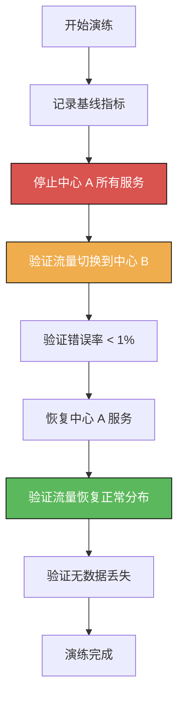

**演练脚本**：

```bash
#!/bin/bash
# 故障切换演练脚本

echo "=== 开始故障切换演练 ==="

# 1. 记录基线指标
echo "1. 记录基线指标..."
BASELINE_QPS=$(curl -s http://prometheus:9090/api/v1/query?query=sum(rate(higress_request_total[5m])) | jq -r '.data.result[0].value[1]')
BASELINE_ERROR_RATE=$(curl -s http://prometheus:9090/api/v1/query?query='sum(rate(higress_request_total{status=~"5.."}[5m]))/sum(rate(higress_request_total[5m]))' | jq -r '.data.result[0].value[1]')

echo "基线 QPS: $BASELINE_QPS"
echo "基线错误率: $BASELINE_ERROR_RATE"

# 2. 停止中心 A 服务
echo "2. 停止中心 A 服务..."
kubectl scale deployment ai-service-zone-a --replicas=0 -n ai-system
sleep 30

# 3. 验证流量切换
echo "3. 验证流量切换到中心 B..."
ZONE_B_QPS=$(curl -s http://prometheus:9090/api/v1/query?query='sum(rate(higress_request_total{datacenter="zone-b"}[5m]))' | jq -r '.data.result[0].value[1]')
echo "中心 B QPS: $ZONE_B_QPS"

# 4. 验证错误率
echo "4. 验证错误率..."
FAILOVER_ERROR_RATE=$(curl -s http://prometheus:9090/api/v1/query?query='sum(rate(higress_request_total{status=~"5.."}[5m]))/sum(rate(higress_request_total[5m]))' | jq -r '.data.result[0].value[1]')
echo "切换后错误率: $FAILOVER_ERROR_RATE"

# 5. 恢复中心 A 服务
echo "5. 恢复中心 A 服务..."
kubectl scale deployment ai-service-zone-a --replicas=10 -n ai-system
sleep 60

# 6. 验证流量恢复
echo "6. 验证流量恢复正常分布..."
CURRENT_QPS=$(curl -s http://prometheus:9090/api/v1/query?query=sum(rate(higress_request_total[5m])) | jq -r '.data.result[0].value[1]')
echo "当前总 QPS: $CURRENT_QPS"

echo "=== 演练完成 ==="
```

### 8.4 性能压测

```bash
# 使用 hey 进行压测
hey -n 100000 -c 100 -m GET \
  -H "X-Client-Region: beijing" \
  http://ai.example.com/api/chat

# 使用 wrk 进行压测
wrk -t12 -c400 -d30s \
  -H "X-Client-Region: beijing" \
  http://ai.example.com/api/chat
```

**性能基准**：

| 指标 | 目标值 | 说明 |
|------|--------|------|
| QPS | > 10000 | 单网关实例 |
| P99 延迟 | < 100ms | 本地域访问 |
| P99 延迟 | < 200ms | 跨地域访问 |
| 错误率 | < 0.1% | 正常负载下 |
| 并发连接 | > 10000 | 单网关实例 |

---

## 9. 最佳实践

### 9.1 生产环境部署建议

| 建议 | 说明 |
|------|------|
| **多副本部署** | Gateway 副本数 ≥ 3，Nacos 副本数 ≥ 3 |
| **资源预留** | 为 Pod 设置合理的 requests 和 limits |
| **自动扩缩容** | 配置 HPA，根据 CPU/内存自动扩缩容 |
| **反亲和性** | 确保副本分布在不同节点/可用区 |
| **优雅关闭** | 配置 preStop 钩子和 terminationGracePeriodSeconds |

**反亲和性配置**：

```yaml
# Gateway Pod 反亲和性
podAntiAffinity:
  preferredDuringSchedulingIgnoredDuringExecution:
    - weight: 100
      podAffinityTerm:
        labelSelector:
          matchExpressions:
            - key: app
              operator: In
              values:
                - higress-gateway
        topologyKey: kubernetes.io/hostname
  requiredDuringSchedulingIgnoredDuringExecution:
    - labelSelector:
        matchExpressions:
          - key: app
            operator: In
            values:
              - higress-gateway
      topologyKey: topology.kubernetes.io/zone
```

### 9.2 性能优化配置

| 优化项 | 配置 | 说明 |
|--------|------|------|
| **连接池** | `upstreamConnectionPool.size: 100` | 增加上游连接池大小 |
| **并发** | `concurrency: 10000` | 提高并发处理能力 |
| **缓存** | 启用 AI 响应缓存 | 减少重复请求 |
| **压缩** | 启用响应压缩 | 减少传输数据量 |
| **Keep-Alive** | 启用 HTTP Keep-Alive | 复用连接 |

**优化配置示例**：

```yaml
apiVersion: networking.higress.io/v1
kind: UpstreamConfig
metadata:
  name: ai-service-upstream
spec:
  # 连接池配置
  connectionPool:
    http:
      # 最大连接数
      maxConnections: 100
      # 空闲连接超时
      idleTimeout: 60s
      # 连接超时
      connectTimeout: 5s
  # 负载均衡策略
  loadBalancer:
    type: least_request
    healthyPanicThreshold: 50
  # 健康检查
  healthCheck:
    active:
      http:
        path: /health
        port: 8080
      interval: 5s
      timeout: 3s
      unhealthyThreshold: 3
      healthyThreshold: 2
```

### 9.3 安全加固

| 安全措施 | 配置 |
|---------|------|
| **网络隔离** | 使用 NetworkPolicy 限制访问 |
| **API 认证** | 启用 JWT/OAuth2 认证 |
| **内容安全** | 集成内容审核插件 |
| **访问控制** | 配置 IP 白名单 |
| **审计日志** | 启用访问日志记录 |

**NetworkPolicy 示例**：

```yaml
apiVersion: networking.k8s.io/v1
kind: NetworkPolicy
metadata:
  name: higress-network-policy
  namespace: higress-system
spec:
  podSelector:
    matchLabels:
      app: higress-gateway
  policyTypes:
    - Ingress
    - Egress
  ingress:
    - from:
        - namespaceSelector:
            matchLabels:
              type: public
      ports:
        - protocol: TCP
          port: 80
        - protocol: TCP
          port: 443
  egress:
    - to:
        - namespaceSelector:
            matchLabels:
              type: ai-services
      ports:
        - protocol: TCP
          port: 8080
```

---

## 10. 故障处理

### 10.1 常见问题

| 问题 | 现象 | 原因 | 解决方案 |
|------|------|------|---------|
| 服务无法访问 | 502/503 错误 | 后端服务不可用 | 检查服务健康状态，重启 Pod |
| 流量分配不均 | 两中心流量差异大 | 负载均衡权重配置错误 | 检查 HTTPRoute weight 配置 |
| 就近路由失效 | 请求未路由到本地域 | 服务地域标签缺失 | 检查服务注册 metadata |
| 故障切换失败 | 故障后流量未切换 | 健康检查配置错误 | 检查健康检查配置 |

### 10.2 故障排查流程

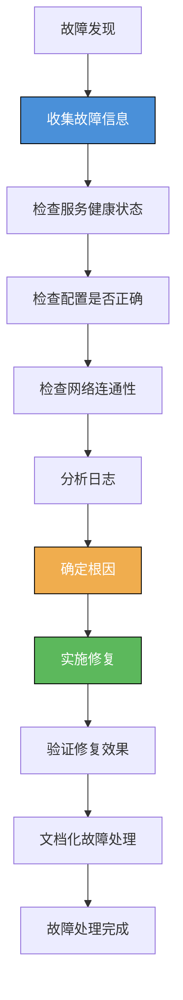

### 10.3 应急预案

**场景一：单中心故障**

```bash
#!/bin/bash
# 中心 A 故障应急预案

# 1. 确认故障
echo "1. 确认中心 A 故障..."
kubectl get pods -n ai-system -l datacenter=zone-a

# 2. 检查流量是否已切换
echo "2. 检查流量分布..."
curl -s http://prometheus:9090/api/v1/query?query='sum(rate(higress_request_total{datacenter="zone-a"}[5m]))'
curl -s http://prometheus:9090/api/v1/query?query='sum(rate(higress_request_total{datacenter="zone-b"}[5m]))'

# 3. 如果流量未自动切换，手动调整路由权重
echo "3. 手动调整路由权重..."
kubectl patch httproute ai-service-dual-active -n ai-system --type='json' \
  -p='[
    {"op": "replace", "path": "/spec/rules/0/backendRefs/0/weight", "value": 0},
    {"op": "replace", "path": "/spec/rules/0/backendRefs/1/weight", "value": 100}
  ]'

# 4. 通知运维团队
echo "4. 发送告警通知..."
```

**场景二：双地域故障**

```bash
#!/bin/bash
# 北京双地域故障应急预案

# 1. 确认故障范围
echo "1. 确认北京地域故障..."
kubectl get pods -n ai-system -l region=beijing

# 2. 切换到异地中心
echo "2. 切换到上海中心..."
kubectl patch httproute ai-service-dual-active -n ai-system --type='json' \
  -p='[
    {"op": "replace", "path": "/spec/rules/0/backendRefs/0/weight", "value": 0},
    {"op": "replace", "path": "/spec/rules/0/backendRefs/1/weight", "value": 0},
    {"op": "add", "path": "/spec/rules/0/backendRefs/2", "value": {"name": "ai-service-shanghai.DEFAULT-GROUP.public.nacos", "group": "networking.higress.io", "port": 8080, "weight": 100}}
  ]'

# 3. 启用降级策略
echo "3. 启用服务降级..."
kubectl apply -f ai-service-degradation.yaml

# 4. 升级故障等级
echo "4. 升级为 P0 故障..."
```

---

## 总结

本文详细介绍了基于 Higress 构建两地三中心 AI 网关高可用架构的完整方案，包括：

1. **架构设计**：两地三中心拓扑、同地域双活、就近路由
2. **部署配置**：Helm Chart 部署、网络配置、证书配置
3. **服务治理**：服务发现、流量调度、健康检查、数据同步
4. **运维保障**：监控告警、验证测试、最佳实践、故障处理

通过这套架构，可以实现：
- **高可用**：双活部署，故障自动切换
- **低延迟**：就近路由，优化用户体验
- **可扩展**：支持弹性扩容，应对流量增长
- **易运维**：统一管理，降低运维复杂度

## 参考资料

- [Higress 官方文档](https://higress.io/docs/)
- [Helm Chart 使用指南](https://helm.sh/docs/)
- [Kubernetes Gateway API](https://gateway-api.sigs.k8s.io/)
- [Nacos 多数据中心部署](https://nacos.io/zh-cn/docs/cluster-mode-quick-start.html)
