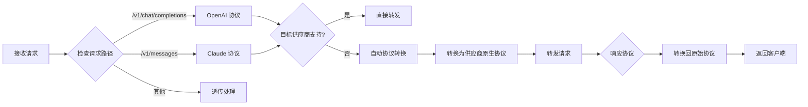
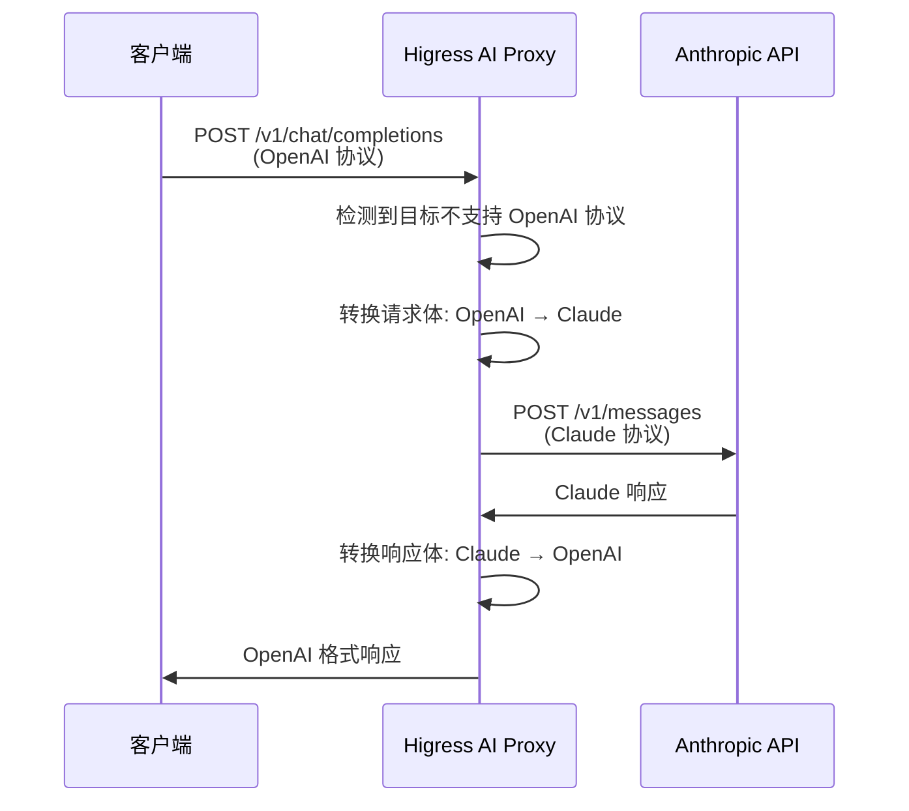
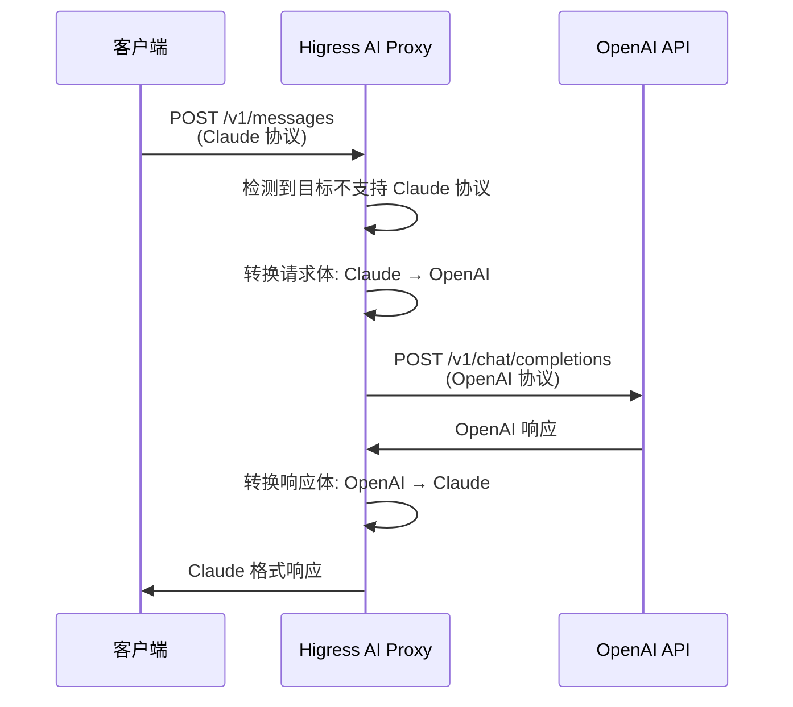

## Higress AI Proxy 插件使用指南

## 一、插件概述

**AI Proxy** 是 Higress 的 WASM 插件，实现了基于 OpenAI API 契约的 AI 代理功能。该插件支持 40+ 种 AI 服务提供商，并提供了强大的**自动协议兼容**能力。

### 核心特性

| 特性 | 说明 |
|------|------|
| 多供应商支持 | OpenAI、Azure OpenAI、Claude、通义千问、DeepSeek、月之暗面、百川智能、零一万物、智谱 AI、Groq、Grok、OpenRouter、Fireworks AI、文心一言、360 智脑、GitHub 模型、Mistral、MiniMax、Anthropic Claude、Ollama、混元、阶跃星辰、Cloudflare Workers AI、星火、Gemini、DeepL、Cohere、Together-AI、Dify、Google Vertex AI、AWS Bedrock、NVIDIA Triton 等 |
| 自动协议兼容 | 无需配置即可同时兼容 OpenAI 和 Claude 两种协议格式 |
| 协议转换 | 自动检测请求协议，如目标供应商不支持则自动进行协议转换 |
| 模型映射 | 支持请求模型名称到目标供应商模型名称的映射 |
| 故障切换 | 支持 API Token 故障切换和请求重试 |

### 运行属性

| 属性 | 值 |
|------|-----|
| 执行阶段 | 默认阶段 |
| 执行优先级 | 100 |

## 二、自动协议兼容机制

### 2.1 功能说明

**自动协议兼容 (Auto Protocol Compatibility)** 是 AI Proxy 插件的核心特性：

- **自动协议检测**：插件通过请求路径后缀自动识别协议类型
- **OpenAI 协议**：`/v1/chat/completions`
- **Claude 协议**：`/v1/messages`
- **智能转换**：当目标供应商不支持客户端使用的协议时，自动进行协议转换
- **零配置**：无需额外配置 `protocol` 字段即可使用

### 2.2 协议支持说明

| 请求路径 | API 类型 | 协议格式 |
|----------|----------|----------|
| `/v1/chat/completions` | 文生文 | OpenAI Messages API |
| `/v1/messages` | 文生文 | Anthropic Claude Messages API |
| `/v1/embeddings` | 文本向量 | OpenAI Embeddings API |

### 2.3 协议检测流程



## 三、配置字段说明

### 3.1 基本配置

| 名称 | 数据类型 | 填写要求 | 默认值 | 描述 |
|------|----------|----------|--------|------|
| `provider` | object | 必填 | - | 配置目标 AI 服务提供商的信息 |
| `provider.type` | string | 必填 | - | AI 服务提供商名称 |
| `provider.apiTokens` | array of string | 非必填 | - | 用于在访问 AI 服务时进行认证的令牌。如果配置了多个 token，插件会在请求时随机进行选择 |
| `provider.timeout` | number | 非必填 | 120000 | 访问 AI 服务的超时时间（毫秒），默认 2 分钟 |
| `provider.modelMapping` | map of string | 非必填 | - | 模型名称映射，支持通配符 `*`、前缀匹配和正则表达式 `~` |
| `provider.protocol` | string | 非必填 | openai | 插件对外提供的 API 接口契约：`openai`（OpenAI 接口契约）、`original`（原始接口契约） |
| `provider.context` | object | 非必填 | - | 配置 AI 对话上下文信息 |
| `provider.customSettings` | array of customSetting | 非必填 | - | 为 AI 请求指定覆盖或者填充参数 |
| `provider.failover` | object | 非必填 | - | 配置 apiToken 的 failover 策略 |
| `provider.retryOnFailure` | object | 非必填 | - | 当请求失败时立即进行重试 |
| `provider.reasoningContentMode` | string | 非必填 | passthrough | 如何处理大模型服务返回的推理内容：`passthrough`（正常输出）、`ignore`（不输出）、`concat`（拼接在常规输出前） |
| `provider.capabilities` | map of string | 非必填 | - | 指定厂商原生兼容 OpenAI 的能力，直接转发无需重写 |

### 3.2 配置示例

#### 基本配置结构

```yaml
global:
  providers:
    - id: "provider-1"              # 供应商标识（必填）
      type: "openai"                # 供应商类型（必填）
      apiTokens:                    # API Token 列表
        - "sk-xxx..."
      timeout: 120000               # 请求超时（毫秒）
```

#### 模型映射配置

```yaml
providers:
  - id: "provider-1"
    type: "openai"
    apiTokens: ["sk-xxx..."]
    modelMapping:                   # 模型名称映射
      "*": "gpt-4o-mini"            # 通配符：所有请求映射到此模型
      "gpt-4": "gpt-4o"             # 精确映射
      "gpt-*": "gpt-4o-mini"        # 前缀匹配
      "~claude-.*": "claude-3-5-sonnet-20241022"  # 正则匹配
```

#### 故障切换配置

```yaml
providers:
  - id: "provider-1"
    type: "openai"
    apiTokens:
      - "sk-token-1"
      - "sk-token-2"
    failover:
      enabled: true                 # 启用故障切换
      unhealthyThreshold: 5         # 连续失败阈值
      healthyThreshold: 2           # 恢复阈值
      checkInterval: 30000          # 健康检查间隔（毫秒）
```

#### 重试配置

```yaml
providers:
  - id: "provider-1"
    type: "openai"
    retryOnFailure:
      enabled: true                 # 启用失败重试
      maxRetries: 3                 # 最大重试次数
```

## 四、提供商特有配置

### 4.1 OpenAI

```yaml
providers:
  - id: "openai-provider"
    type: "openai"
    apiTokens: ["sk-xxx..."]
```

### 4.2 Azure OpenAI

```yaml
providers:
  - id: "azure-openai"
    type: "azure-openai"
    apiTokens: ["your-api-key"]
    # 需要通过 customSettings 设置 endpoint 和 deployment
    customSettings:
      - name: endpoint
        value: "https://your-resource.openai.azure.com"
      - name: api-version
        value: "2024-02-15-preview"
```

### 4.3 Anthropic Claude

```yaml
providers:
  - id: "claude-provider"
    type: "claude"
    apiTokens: ["sk-ant-xxx..."]
```

### 4.4 通义千问（Qwen）

```yaml
providers:
  - id: "qwen-provider"
    type: "qwen"
    apiTokens: ["sk-xxx..."]
```

### 4.5 DeepSeek

```yaml
providers:
  - id: "deepseek-provider"
    type: "deepseek"
    apiTokens: ["sk-xxx..."]
```

### 4.6 其他提供商

支持的提供商类型包括：
- `moonshot`（月之暗面）
- `baichuan`（百川智能）
- `yi`（零一万物）
- `zhipu`（智谱 AI）
- `groq`
- `grok`
- `openrouter`
- `fireworks-ai`
- `baidu`（文心一言）
- `360`（360 智脑）
- `github`
- `mistral`
- `minimax`
- `ollama`
- `hunyuan`（混元）
- `stepfun`（阶跃星辰）
- `cloudflare-workers-ai`
- `spark`（星火）
- `gemini`
- `deepl`
- `cohere`
- `together-ai`
- `dify`
- `google-vertex`
- `aws-bedrock`
- `nvidia-triton`

## 五、用法示例

### 5.1 使用 OpenAI 协议代理 Azure OpenAI 服务

```yaml
global:
  providers:
    - id: "azure-openai"
      type: "azure-openai"
      apiTokens: ["your-api-key"]
      customSettings:
        - name: endpoint
          value: "https://your-resource.openai.azure.com"
        - name: api-version
          value: "2024-02-15-preview"
```

**客户端请求：**
```bash
curl -X POST http://higress.example/v1/chat/completions \
  -H "Content-Type: application/json" \
  -H "Authorization: Bearer any-key" \
  -d '{
    "model": "gpt-4",
    "messages": [{"role": "user", "content": "Hello!"}]
  }'
```

### 5.2 使用 OpenAI 协议代理通义千问服务

```yaml
global:
  providers:
    - id: "qwen-provider"
      type: "qwen"
      apiTokens: ["sk-xxx..."]
      modelMapping:
        "*": "qwen-turbo"
```

**客户端请求：**
```bash
curl -X POST http://higress.example/v1/chat/completions \
  -H "Content-Type: application/json" \
  -H "Authorization: Bearer any-key" \
  -d '{
    "model": "gpt-3.5-turbo",
    "messages": [{"role": "user", "content": "你好！"}]
  }'
```

### 5.3 使用自动协议兼容功能

**场景**：客户端使用 OpenAI 协议，后端使用 Claude

```yaml
global:
  providers:
    - id: "claude-provider"
      type: "claude"
      apiTokens: ["sk-ant-xxx..."]
```

**客户端发送 OpenAI 格式请求：**
```bash
curl -X POST http://higress.example/v1/chat/completions \
  -H "Content-Type: application/json" \
  -H "Authorization: Bearer any-key" \
  -d '{
    "model": "gpt-4",
    "messages": [{"role": "user", "content": "Hello!"}]
  }'
```

**插件自动处理流程：**
1. 检测到 `/v1/chat/completions` 请求（OpenAI 协议）
2. 检测到目标供应商是 `claude`，不原生支持 OpenAI 协议
3. 自动转换请求体：OpenAI → Claude
4. 转发到 `api.anthropic.com/v1/messages`
5. 接收 Claude 响应
6. 自动转换响应体：Claude → OpenAI
7. 返回 OpenAI 格式响应给客户端

### 5.4 使用智能协议转换（反向）

**场景**：客户端使用 Claude 协议，后端使用 OpenAI

```yaml
global:
  providers:
    - id: "openai-provider"
      type: "openai"
      apiTokens: ["sk-xxx..."]
```

**客户端发送 Claude 格式请求：**
```bash
curl -X POST http://higress.example/v1/messages \
  -H "Content-Type: application/json" \
  -H "x-api-key: any-key" \
  -d '{
    "model": "claude-3-5-sonnet-20241022",
    "max_tokens": 1024,
    "messages": [{"role": "user", "content": "Hello!"}]
  }'
```

**插件自动处理流程：**
1. 检测到 `/v1/messages` 请求（Claude 协议）
2. 检测到目标供应商是 `openai`，不原生支持 Claude 协议
3. 自动转换请求体：Claude → OpenAI
4. 转发到 `api.openai.com/v1/chat/completions`
5. 接收 OpenAI 响应
6. 自动转换响应体：OpenAI → Claude
7. 返回 Claude 格式响应给客户端

### 5.5 多供应商配置

```yaml
global:
  activeProviderId: "default"  # 默认供应商
  providers:
    # 默认使用 OpenAI
    - id: "default"
      type: "openai"
      apiTokens: ["sk-openai-xxx..."]
      modelMapping:
        "*": "gpt-4o-mini"

    # Claude 作为备用
    - id: "claude-backup"
      type: "claude"
      apiTokens: ["sk-ant-xxx..."]
      modelMapping:
        "*": "claude-3-5-sonnet-20241022"

# 路由级配置覆盖
routes:
  - route:
      match:
        headers:
          x-model-variant:
            exact: pro
    global:
      activeProviderId: "claude-backup"
```

### 5.6 带故障切换的完整配置

```yaml
global:
  providers:
    - id: "primary-llm"
      type: "claude"
      apiTokens:
        - "sk-ant-primary-xxx..."
      timeout: 120000
      failover:
        enabled: true
        unhealthyThreshold: 3
        healthyThreshold: 2
        checkInterval: 60000
      retryOnFailure:
        enabled: true
        maxRetries: 2
      modelMapping:
        "*": "claude-3-5-sonnet-20241022"

    - id: "backup-llm"
      type: "openai"
      apiTokens: ["sk-openai-backup-xxx..."]
      timeout: 120000
      modelMapping:
        "*": "gpt-4o-mini"
```

## 六、协议转换详解

### 6.1 OpenAI → Claude 转换



### 6.2 请求体转换映射

| OpenAI 字段 | Claude 字段 | 转换说明 |
|-------------|-------------|----------|
| `model` | `model` | 直接映射 |
| `messages` | `messages` | 消息数组转换 |
| `system` (在 messages 中) | `system` | 提取为独立字段 |
| `temperature` | `temperature` | 直接映射 |
| `max_tokens` | `max_tokens` | 直接映射 |
| `top_p` | `top_p` | 直接映射 |
| `stop` | `stop_sequences` | 字段名转换 |
| `stream` | `stream` | 直接映射 |
| `tools` | `tools` | 工具定义转换 |
| `tool_choice` | `tool_choice` | 工具选择转换 |
| `reasoning_effort` | `thinking` | 推理配置转换 |

### 6.3 Claude → OpenAI 转换



### 6.4 反向请求体转换映射

| Claude 字段 | OpenAI 字段 | 转换说明 |
|-------------|-------------|----------|
| `model` | `model` | 直接映射 |
| `system` | `messages[0]` (role: system) | 系统提示词转为消息 |
| `messages` | `messages` | 消息数组拼接 |
| `max_tokens` | `max_tokens` | 直接映射 |
| `stop_sequences` | `stop` | 字段名转换 |
| `temperature` | `temperature` | 直接映射 |
| `top_p` | `top_p` | 直接映射 |
| `stream` | `stream` | 直接映射 |
| `tools` | `tools` | 工具定义转换 |
| `tool_choice` | `tool_choice` | 工具选择转换 |
| `thinking.budget_tokens` | `reasoning_max_tokens` | 推理配置转换 |

## 七、完整配置示例

### 7.1 Kubernetes 示例

```yaml
apiVersion: extensions.higress.io/v1alpha1
kind: WasmPlugin
metadata:
  name: ai-proxy-plugin
  namespace: higress-system
spec:
  defaultConfig:
    global:
      providers:
        - id: "primary-llm"
          type: "claude"
          apiTokens: ["sk-ant-xxx..."]
          modelMapping:
            "*": "claude-3-5-sonnet-20241022"
        - id: "backup-llm"
          type: "openai"
          apiTokens: ["sk-xxx..."]
          modelMapping:
            "*": "gpt-4o-mini"
  matchRules:
    - config:
        global:
          activeProviderId: "primary-llm"
  url: file:///opt/plugins/ai-proxy.wasm
```

### 7.2 Docker-Compose 示例

```yaml
version: '3.8'
services:
  higress:
    image: higress-registry.cn-hangzhou.cr.aliyuncs.com/higress/higress:latest
    ports:
      - "8000:8000"
      - "8080:8080"
    volumes:
      - ./ai-proxy-config.yaml:/etc/higress/ai-proxy-config.yaml
```

**ai-proxy-config.yaml 配置文件：**

```yaml
global:
  providers:
    - id: "openai-provider"
      type: "openai"
      apiTokens: ["sk-xxx..."]
      modelMapping:
        "*": "gpt-4o-mini"
```

## 八、注意事项

### 8.1 API Key 处理

- **OpenAI 供应商**：使用 `Authorization: Bearer <token>` 头
- **Claude 供应商**：使用 `x-api-key: <token>` 头
- **协议转换时**：插件自动处理认证头的转换

### 8.2 模型名称

- 使用 `modelMapping` 配置确保模型名称正确映射
- 未映射的模型名称会直接传递给供应商

### 8.3 流式响应

- 流式响应的转换是逐事件进行的
- 客户端会收到与请求协议格式匹配的流式事件

### 8.4 限制

- 不支持供应商的所有高级参数
- 部分供应商特定功能可能无法完全转换
- 建议在生产环境充分测试

## 九、调试与监控

### 9.1 启用调试日志

```yaml
# 在 Higress 配置中启用 WASM 插件调试
wasm:
  plugins:
    - name: ai-proxy
      logLevel: debug
```

### 9.2 查看转换日志

插件在转换过程中会输出详细的调试日志：

```
[Auto Protocol] Claude request detected, provider doesn't support natively
[Claude->OpenAI] Original Claude request body: {...}
[Claude->OpenAI] Converted OpenAI request body: {...}
[OpenAI->Claude] Original OpenAI response body: {...}
[OpenAI->Claude] Converted Claude response body: {...}
```

---

## 参考资料

- [Higress 官方文档](https://higress.cn/docs/latest/user/plugins/ai/api-provider/ai-proxy/)
- [AI Proxy 插件源码](https://github.com/alibaba/higress/tree/main/plugins/wasm-go/extensions/ai-proxy)
- [OpenAI API 文档](https://platform.openai.com/docs/api-reference)
- [Anthropic Claude API 文档](https://docs.anthropic.com/claude/reference/messages)
