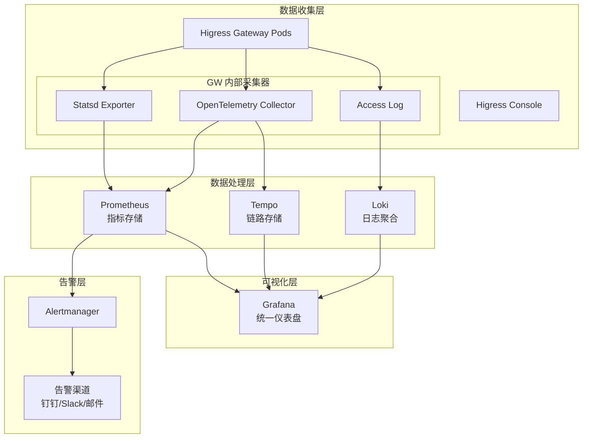
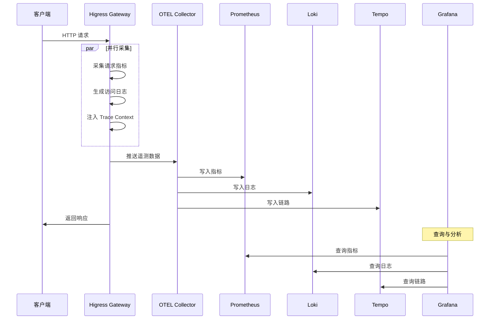
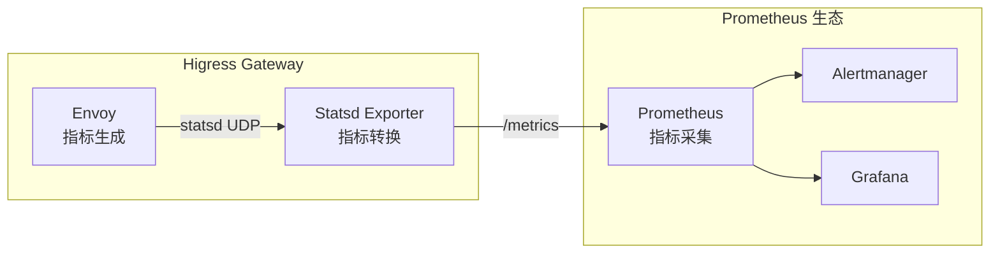
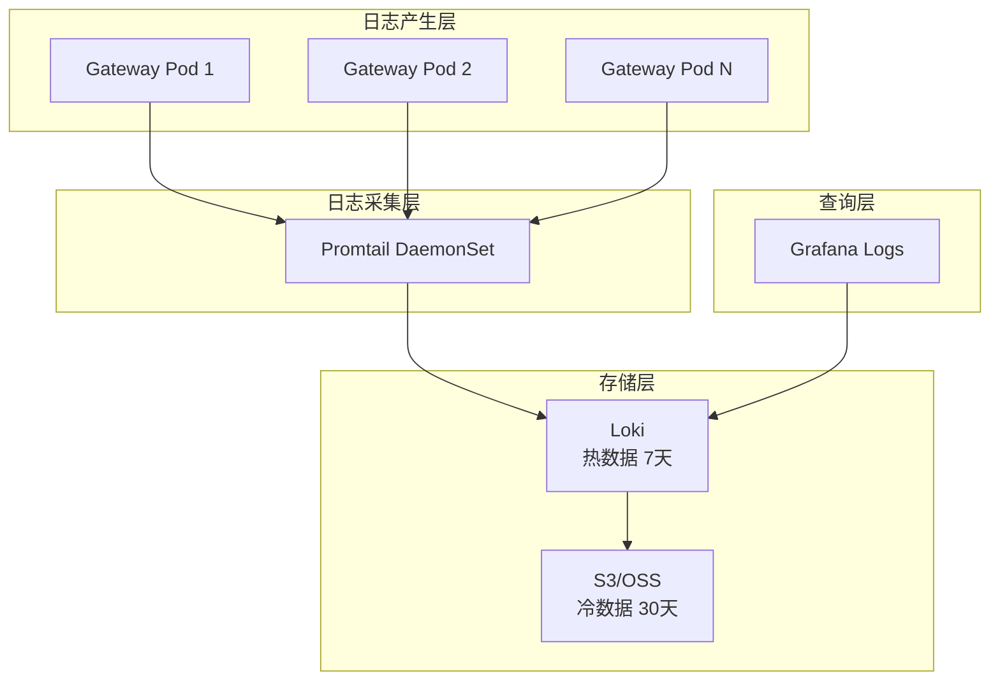
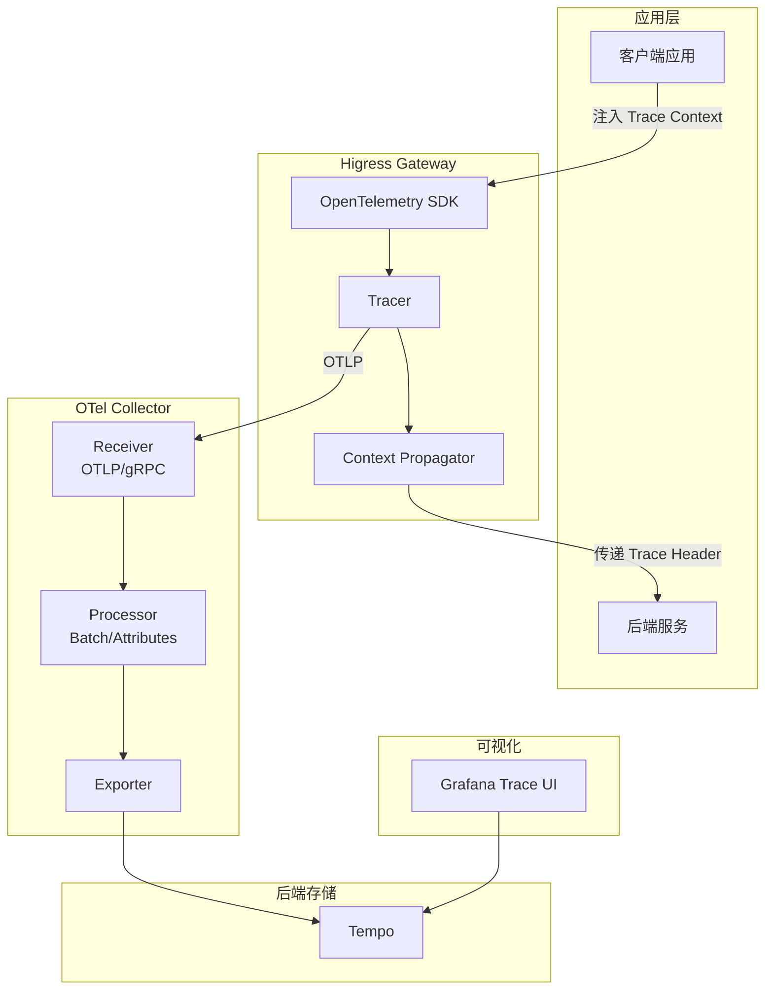
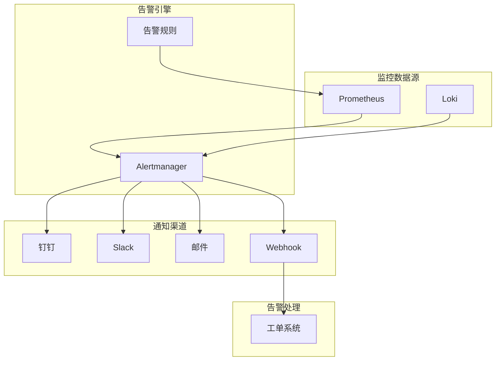
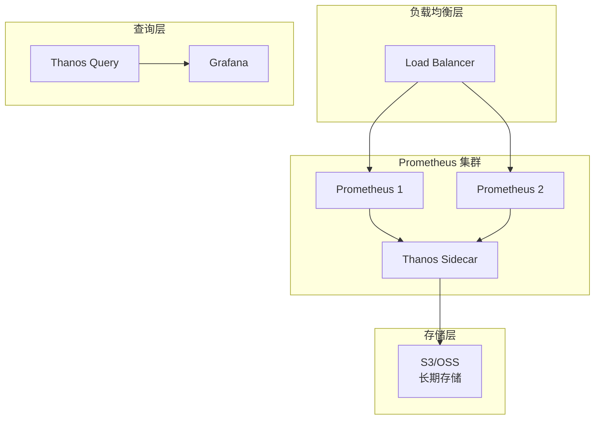
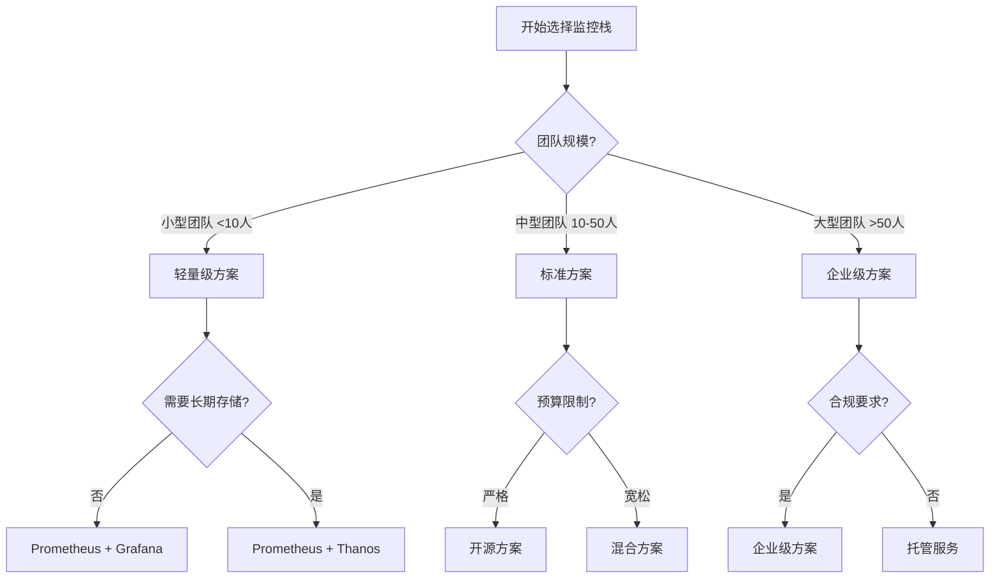

# Higress 可观察性架构完整指南

本文档提供 Higress 网关的生产级可观察性（Observability）架构设计与实施方案，涵盖指标监控、日志收集、链路追踪、告警通知与可视化的完整技术栈。

---

## 文档导航

**快速入口：**
- [5分钟快速开始](#快速开始) - 快速搭建可观察性栈
- [核心指标说明](#24-关键指标定义) - 了解关键监控指标
- [告警配置](#5-告警与通知) - 配置告警规则
- [常见问题 FAQ](#常见问题-faq) - 故障排查指南
- [性能基准与成本估算](#性能基准与成本估算) - 容量规划参考

**完整目录：**
1. [可观察性架构概述](#1-可观察性架构概述)
2. [Metrics 指标监控](#2-metrics-指标监控)
3. [Logging 日志收集](#3-logging-日志收集)
4. [Tracing 链路追踪](#4-tracing-链路追踪)
5. [告警与通知](#5-告警与通知)
6. [可视化仪表盘](#6-可视化仪表盘)
7. [部署实施指南](#7-部署实施指南)
8. [运维最佳实践](#8-运维最佳实践)
9. [常见问题 FAQ](#常见问题-faq)
10. [性能基准与成本估算](#性能基准与成本估算)
11. [技术选型决策指南](#技术选型决策指南)

---

## 快速开始

本章节帮助您在5分钟内快速搭建 Higress 可观察性监控栈。

### 前置条件

| 要求 | 版本 | 说明 |
|------|------|------|
| Kubernetes | v1.20+ | 已配置 kubectl |
| Helm | 3.x | 包管理器 |
| 可用内存 | ≥4GB | 监控栈最低要求 |

### 一键部署

```bash
#!/bin/bash
# Higress 可观察性栈快速部署脚本

# 1. 创建命名空间
kubectl create namespace monitoring --dry-run=client -o yaml | kubectl apply -f -

# 2. 部署 Prometheus Operator（包含 Grafana）
helm repo add prometheus-community https://prometheus-community.github.io/helm-charts
helm repo update
helm install prometheus prometheus-community/kube-prometheus-stack \
  --namespace monitoring \
  --set prometheus.prometheusSpec.retention=7d \
  --set prometheus.prometheusSpec.serviceMonitorSelectorNilUsesHelmValues=false \
  --set grafana.adminPassword=admin \
  --set grafana.persistence.enabled=true

# 3. 部署 Loki（日志收集）
helm repo add grafana https://grafana.github.io/helm-charts
helm install loki grafana/loki-stack \
  --namespace monitoring \
  --set promtail.enabled=true

# 4. 部署 Tempo（链路追踪）
helm install tempo grafana/tempo --namespace monitoring

# 5. 配置 Higress 监控
kubectl apply -f - <<EOF
apiVersion: monitoring.coreos.com/v1
kind: ServiceMonitor
metadata:
  name: higress-gateway
  namespace: higress-system
  labels:
    release: prometheus
spec:
  selector:
    matchLabels:
      app: higress-gateway
  endpoints:
    - port: http-monitoring
      interval: 30s
      path: /stats/prometheus
EOF

echo "✅ 部署完成！"
```

### 验证部署

```bash
# 检查所有组件状态
kubectl get pods -n monitoring

# 访问 Grafana（用户名: admin, 密码: admin）
kubectl port-forward -n monitoring svc/prometheus-grafana 3000:80
# 访问 http://localhost:3000

# 验证 Prometheus 抓取
kubectl port-forward -n monitoring svc/prometheus-operated 9090:9090
# 访问 http://localhost:9090/targets 确认 higress-gateway 状态为 UP
```

### 部署验证清单

- [ ] Prometheus 成功抓取 Higress 指标
- [ ] Loki 正常收集日志
- [ ] Tempo 正常接收追踪数据
- [ ] Grafana 数据源配置正确
- [ ] 告警规则生效

---

## 1. 可观察性架构概述

### 1.1 整体架构

Higress 的可观察性架构基于云原生的三大支柱（Metrics、Logs、Traces），并结合告警与可视化能力：



### 1.2 三大支柱设计原则

| 支柱 | 目标 | 关键技术 | 保留时间 | 典型用途 |
|------|------|---------|---------|---------|
| **Metrics（指标）** | 发现问题和趋势 | Prometheus + Statsd | 15天（热）+ 90天（冷） | 趋势分析、容量规划 |
| **Logs（日志）** | 定位根因 | Loki + Kafka | 7天（热）+ 30天（冷） | 故障排查、审计 |
| **Traces（追踪）** | 分析调用链路 | OpenTelemetry + Tempo | 7天 | 性能分析、依赖分析 |

### 1.3 数据流设计



---

## 2. Metrics 指标监控

### 快速概要

| 组件 | 用途 | 关键配置 | 检查命令 |
|------|------|---------|---------|
| Statsd Exporter | 指标格式转换 | 映射规则 | `curl localhost:9102/metrics` |
| ServiceMonitor | 自动发现 | 抓取间隔 | `kubectl get servicemonitor` |
| Prometheus | 指标存储 | 保留时间 | 访问 `/targets` 页面 |

### 2.1 Prometheus 集成架构

Higress 基于 Envoy 构建，原生支持 Prometheus 指标采集。指标通过 Statsd 协议暴露，并由 Statsd Exporter 转换为 Prometheus 格式。



### 2.2 部署 Statsd Exporter

#### 核心配置：指标映射规则

```yaml
apiVersion: v1
kind: ConfigMap
metadata:
  name: higress-statsd-mapper
  namespace: higress-system
data:
  mapper.conf: |
    mappings:
      # 请求指标映射
      - match: ingress.*.request.*
        name: "higress_request_total"
        labels:
          destination_service: "$2"
          response_code: "$3"

      # 延迟指标映射
      - match: ingress.*.duration.*
        name: "higress_request_duration_milliseconds"
        labels:
          destination_service: "$2"
          quantile: "$3"

      # 连接指标映射
      - match: ingress.*.cx.*
        name: "higress_connection_count"
        labels:
          destination_service: "$2"
          state: "$3"
```

#### Deployment 配置

```yaml
apiVersion: apps/v1
kind: Deployment
metadata:
  name: higress-statsd-exporter
  namespace: higress-system
spec:
  replicas: 2
  selector:
    matchLabels:
      app: higress-statsd-exporter
  template:
    spec:
      containers:
        - name: statsd-exporter
          image: prom/statsd-exporter:latest
          args:
            - --statsd.mapping-config=/etc/statsd/mapper.conf
            - --statsd.listen-udp=:9125
            - --web.listen-address=:9102
          ports:
            - containerPort: 9125
              protocol: UDP
              name: statsd
            - containerPort: 9102
              protocol: TCP
              name: metrics
          volumeMounts:
            - name: config
              mountPath: /etc/statsd
      volumes:
        - name: config
          configMap:
            name: higress-statsd-mapper
```

### 2.3 Prometheus 抓取配置

#### ServiceMonitor 配置（推荐）

```yaml
apiVersion: monitoring.coreos.com/v1
kind: ServiceMonitor
metadata:
  name: higress-gateway
  namespace: higress-system
  labels:
    release: prometheus  # 确保与 Prometheus 选择器匹配
spec:
  selector:
    matchLabels:
      app: higress-gateway
  endpoints:
    - port: http-monitoring
      interval: 30s
      path: /stats/prometheus
```

> **注意：** 确保 ServiceMonitor 的 labels 与 Prometheus 的 serviceMonitorSelector 匹配。

### 2.4 关键指标定义

#### RED 指标（Rate, Errors, Duration）

```promql
# 请求率（Rate）
higress_request_total{destination_service="backend-service",response_code="200"}

# 错误率（Errors）
rate(higress_request_total{response_code=~"5.."}[5m])

# 延迟（Duration）- P95
histogram_quantile(0.95, sum(rate(higress_request_duration_milliseconds_bucket[5m])) by (le, destination_service))
```

#### USE 指标（Utilization, Saturation, Errors）

```promql
# CPU 使用率
rate(process_cpu_seconds_total{pod=~"higress-gateway.*"}[5m])

# 内存使用
container_memory_usage_bytes{container="higress-gateway"}

# 连接数（饱和度）
higress_connection_count{state="active"}

# 网络流量
rate(container_network_receive_bytes_total{container="higress-gateway"}[5m])
rate(container_network_transmit_bytes_total{container="higress-gateway"}[5m])
```

#### 业务指标

```promql
# 按域名统计的请求量
sum(rate(higress_request_total[5m])) by (authority)

# 按服务统计的 P95 延迟
histogram_quantile(0.95, sum(rate(higress_request_duration_milliseconds_bucket[5m])) by (le, destination_service))

# 按状态码统计的请求比例
sum(rate(higress_request_total[5m])) by (response_code) / sum(rate(higress_request_total[5m]))
```

### 2.5 自定义业务指标

#### 通过 Wasm 插件上报自定义指标

```go
// Wasm 插件示例：自定义业务指标
package main

import (
    "github.com/tetratelabs/proxy-wasm-go-sdk/proxywasm"
    "github.com/tetratelabs/proxy-wasm-go-sdk/proxywasm/types"
)

func main() {
    proxywasm.SetVMContext(&vmContext{})
}

type vmContext struct {
    types.DefaultVMContext
}

func (*vmContext) NewPluginContext(contextID uint32) types.PluginContext {
    return &pluginContext{}
}

type pluginContext struct {
    types.DefaultPluginContext
}

func (p *pluginContext) OnHttpHeaders(numHeaders int, endOfStream bool) types.Action {
    // 自定义指标：API 调用量统计
    apiName, _ := proxywasm.GetHttpRequestHeader("x-api-name")
    if apiName != "" {
        proxywasm.SetProperty([]string{"metric", "api_call_count"}, []byte(apiName))
    }

    return types.ActionContinue
}
```

### 2.6 AI 插件指标配置

Higress 提供了多个 AI 相关插件，这些插件内置了 Prometheus 指标上报能力。

#### AI Statistics 插件

```yaml
apiVersion: higress.io/v1
kind: WasmPlugin
metadata:
  name: ai-statistics
  namespace: higress-system
spec:
  url: file:///etc/wasm-plugins/ai-statistics.wasm
  phase: AUTHN
  priority: 100
  config:
    enableMetrics: true
    metricPrefix: "higress_ai_stats"
    metrics:
      requestCount:
        enabled: true
        name: "request_total"
        type: "counter"
        labels: [route_name, upstream_host, model_name, status_code]
      requestDuration:
        enabled: true
        name: "request_duration_seconds"
        type: "histogram"
        buckets: [0.001, 0.005, 0.01, 0.025, 0.05, 0.1, 0.25, 0.5, 1, 2.5, 5, 10]
      tokenCount:
        enabled: true
        name: "token_total"
        type: "counter"
        labels: [model_name, token_type, user_id]
```

**查询示例：**

```promql
# 请求速率（按路由分组）
rate(higress_ai_stats_request_total[5m])

# P95 延迟（按模型分组）
histogram_quantile(0.95, sum(rate(higress_ai_stats_request_duration_seconds_bucket[5m])) by (le, model_name))

# Token 消耗速率（按用户分组）
rate(higress_ai_stats_token_total[5m]) by (user_id, token_type)
```

### 2.7 指标保留策略

```yaml
# Prometheus 配置
global:
  scrape_interval: 30s
  evaluation_interval: 30s

storage:
  tsdb:
    retention.time: 15d
    retention.size: 50GB

# 远程存储配置（长期保留）
remote_write:
  - url: "http://thanos-receiver:19291/api/v1/receive"
    queue_config:
      capacity: 10000
      max_shards: 200
```

---

## 3. Logging 日志收集

### 快速概要

| 组件 | 用途 | 关键配置 | 检查命令 |
|------|------|---------|---------|
| 访问日志 | 请求记录 | JSON 格式 | `kubectl logs -l app=higress-gateway` |
| Promtail | 日志采集 | 标签提取 | `kubectl logs -l app=promtail` |
| Loki | 日志存储 | 保留策略 | `logcli labels namespace` |

### 3.1 日志架构设计



### 3.2 访问日志配置

#### JSON 格式访问日志

```yaml
# Helm values 配置
gateway:
  enableAccessLog: true
  accessLogFormat: |
    {
      "time": "$time_iso8601",
      "authority": "$authority",
      "method": "$request_method",
      "path": "$request_uri",
      "protocol": "$protocol",
      "status": "$status",
      "request_time": "$request_time",
      "upstream_response_time": "$upstream_response_time",
      "upstream_addr": "$upstream_addr",
      "upstream_status": "$upstream_status",
      "request_length": "$request_length",
      "bytes_sent": "$bytes_sent",
      "user_agent": "$http_user_agent",
      "x_forwarded_for": "$http_x_forwarded_for",
      "request_id": "$request_id",
      "trace_id": "$opentelemetry_trace_id",
      "span_id": "$opentelemetry_span_id",
      "route_name": "$route_name",
      "upstream_service": "$upstream_service"
    }
```

### 3.3 Promtail 配置（日志采集）

```yaml
apiVersion: v1
kind: ConfigMap
metadata:
  name: promtail-config
  namespace: logging
data:
  promtail.yaml: |
    server:
      http_listen_port: 9080

    positions:
      filename: /tmp/positions.yaml

    clients:
      - url: http://loki:3100/loki/api/v1/push

    scrape_configs:
      # Higress Gateway 日志
      - job_name: higress-gateway
        kubernetes_sd_configs:
          - role: pod
            namespaces:
              names:
                - higress-system
        relabel_configs:
          - source_labels: [__meta_kubernetes_pod_label_app]
            regex: higress-gateway
            action: keep
        pipeline_stages:
          - json:
              expressions:
                time: time
                authority: authority
                method: method
                path: path
                status: status
                request_time: request_time
                trace_id: trace_id
          - labels:
              status:
              method:
              authority:
```

### 3.4 Loki 日志聚合配置

```yaml
apiVersion: v1
kind: ConfigMap
metadata:
  name: loki-config
  namespace: logging
data:
  loki-config.yaml: |
    auth_enabled: false
    server:
      http_listen_port: 3100

    common:
      path_prefix: /loki
      storage:
        filesystem:
          chunks_directory: /loki/chunks
      replication_factor: 1

    schema_config:
      configs:
        - from: 2024-01-01
          store: boltdb-shipper
          object_store: filesystem
          schema: v11
          index:
            prefix: index_
            period: 24h

    # 保留策略
    limits_config:
      retention_period: 168h  # 7 天
      ingestion_rate_mb: 20
      per_stream_rate_limit: 10MB

    # 日志压缩
    compactor:
      working_directory: /loki/compactor
      shared_store: filesystem
      retention_enabled: true
```

### 3.5 日志查询示例

#### LogQL 查询语法

```logql
# 查询 5xx 错误日志
{namespace="higress-system", app="higress-gateway"} |= `status:"5"`

# 查询特定服务的慢请求（>1s）
{namespace="higress-system"} | json | request_time > 1

# 按状态码统计
sum(count_over_time({namespace="higress-system", app="higress-gateway"} | json | status != "" [5m])) by (status)

# 查询包含特定 trace_id 的所有日志
{namespace="higress-system"} |= `trace_id:"abc123"`

# 慢请求 Top 10
topk(10, sum({namespace="higress-system"} | json | unwrap request_time [1h]))
```

---

## 4. Tracing 链路追踪

### 快速概要

| 组件 | 用途 | 关键配置 | 检查命令 |
|------|------|---------|---------|
| OTEL Collector | 数据收集 | Pipeline 配置 | `kubectl logs -l app=otel-collector` |
| Tempo | 链路存储 | 采样率、保留 | Tempo API 查询 |
| Trace Context | 上下文传播 | Header 格式 | 检查请求头 |

### 4.1 OpenTelemetry 集成架构



### 4.2 OTEL Collector 配置

```yaml
apiVersion: v1
kind: ConfigMap
metadata:
  name: otel-collector-config
  namespace: higress-system
data:
  otel-collector.yaml: |
    receivers:
      otlp:
        protocols:
          grpc:
            endpoint: 0.0.0.0:4317
          http:
            endpoint: 0.0.0.0:4318

    processors:
      batch:
        timeout: 5s
        send_batch_size: 10000

      attributes:
        actions:
          - key: environment
            value: production
            action: insert

      memory_limiter:
        limit_mib: 512

    exporters:
      otlp/tempo:
        endpoint: tempo:4317
        tls:
          insecure: true

    service:
      pipelines:
        traces:
          receivers: [otlp]
          processors: [memory_limiter, batch, attributes]
          exporters: [otlp/tempo]
```

### 4.3 Higress Gateway 追踪配置

```yaml
# Helm Values 配置
gateway:
  enableTracing: true
  tracingSampling: 10.0  # 10% 采样率

  telemetry:
    v2:
      enabled: true
      prometheus:
        config:
          latency: latencies
      accessLog:
        - name: otel
          typedConfig:
            "@type": type.googleapis.com/envoy.extensions.access_loggers.open_telemetry.v3.OpenTelemetryAccessLogConfig
            common_config:
              grpc_service:
                envoy_grpc:
                  cluster_name: otel-collector
```

> **警告：** 生产环境建议采样率设置为 10-30%，避免 100% 采样导致性能问题。

### 4.4 Tempo 部署配置

```yaml
apiVersion: v1
kind: ConfigMap
metadata:
  name: tempo-config
  namespace: logging
data:
  tempo.yaml: |
    server:
      http_listen_port: 3100

    distributor:
      receivers:
        otlp:
          protocols:
            grpc:
              endpoint: 0.0.0.0:4317

    storage:
      trace:
        backend: local
        local:
          path: /var/tempo/traces

    compactor:
      compaction:
        block_retention: 168h  # 7 天
```

### 4.5 Trace Context 传播

Higress 自动传播以下 Trace Headers：

```yaml
# W3C Trace Context（推荐）
traceparent: 00-0af7651916cd43dd8448eb211c80319c-b7ad6b7169203331-01
tracestate: congo=t61rcWkgMzE

# B3 多 Header 格式
X-B3-TraceId: 0af7651916cd43dd8448eb211c80319c
X-B3-SpanId: b7ad6b7169203331
X-B3-Sampled: 1

# Jaeger 格式
uber-trace-id: 0af7651916cd43dd8448eb211c80319c:0af7651916cd43dd8448eb211c80319c:0af7651916cd43dd8448eb211c80319c:1
```

### 4.6 后端服务集成示例

```go
// Go 服务集成 OpenTelemetry
package main

import (
    "context"
    "net/http"

    "go.opentelemetry.io/contrib/instrumentation/net/http/otelhttp"
    "go.opentelemetry.io/otel"
    "go.opentelemetry.io/otel/exporters/otlp/otlptrace/otlptracegrpc"
    tracesdk "go.opentelemetry.io/otel/sdk/trace"
)

func initTracer(serviceName string) error {
    ctx := context.Background()

    exporter, err := otlptracegrpc.New(ctx,
        otlptracegrpc.WithEndpoint("otel-collector.higress-system.svc.cluster.local:4317"),
        otlptracegrpc.WithInsecure(),
    )
    if err != nil {
        return err
    }

    tp := tracesdk.NewTracerProvider(
        tracesdk.WithBatcher(exporter),
        tracesdk.WithSampler(tracesdk.TraceIDRatioBased(0.1)), // 10% 采样
    )

    otel.SetTracerProvider(tp)
    return nil
}

func main() {
    initTracer("backend-service")

    handler := http.HandlerFunc(func(w http.ResponseWriter, r *http.Request) {
        w.Write([]byte("Hello, World!"))
    })

    // 包装 handler 以自动追踪
    wrappedHandler := otelhttp.NewHandler(handler, "backend-service")
    http.ListenAndServe(":8080", wrappedHandler)
}
```

---

## 5. 告警与通知

### 快速概要

| 组件 | 用途 | 关键配置 | 检查命令 |
|------|------|---------|---------|
| PrometheusRule | 告警规则 | 表达式、阈值 | 访问 `/alerts` 页面 |
| Alertmanager | 告警路由 | 接收器、分组 | `amtool alert` |
| 钉钉 Webhook | 通知渠道 | Token、模板 | 检查钉钉群消息 |

### 5.1 告警架构



### 5.2 核心告警规则

```yaml
apiVersion: monitoring.coreos.com/v1
kind: PrometheusRule
metadata:
  name: higress-alerts
  namespace: monitoring
spec:
  groups:
    # ========== 可用性告警 ==========
    - name: higress-availability
      interval: 30s
      rules:
        # Gateway Pod 宕机
        - alert: HigressGatewayPodDown
          expr: up{job="higress-gateway"} == 0
          for: 1m
          labels:
            severity: critical
          annotations:
            summary: "Higress Gateway Pod 宕机"
            description: "{{ $labels.pod }} 已宕机超过 1 分钟"

        # 高错误率
        - alert: HigressHighErrorRate
          expr: |
            (sum(rate(higress_request_total{response_code=~"5.."}[5m])) by (destination_service)
            / sum(rate(higress_request_total[5m])) by (destination_service)) > 0.05
          for: 5m
          labels:
            severity: warning
          annotations:
            summary: "服务错误率过高"
            description: "{{ $labels.destination_service }} 错误率 {{ $value | humanizePercentage }}"

    # ========== 性能告警 ==========
    - name: higress-performance
      interval: 30s
      rules:
        # 高延迟
        - alert: HigressHighLatency
          expr: |
            histogram_quantile(0.95, sum(rate(higress_request_duration_milliseconds_bucket[5m])) by (le, destination_service)) > 1000
          for: 5m
          labels:
            severity: warning
          annotations:
            summary: "服务延迟过高"
            description: "{{ $labels.destination_service }} P95 延迟 {{ $value }}ms"

    # ========== 资源告警 ==========
    - name: higress-resources
      interval: 30s
      rules:
        # CPU 使用率过高
        - alert: HigressHighCPU
          expr: sum(rate(process_cpu_seconds_total{pod=~"higress-gateway.*"}[5m])) by (pod) > 0.8
          for: 10m
          labels:
            severity: warning
          annotations:
            summary: "Gateway CPU 使用率过高"
            description: "{{ $labels.pod }} CPU 使用率 {{ $value | humanizePercentage }}"

        # 内存使用率过高
        - alert: HigressHighMemory
          expr: |
            container_memory_usage_bytes{container="higress-gateway"}
            / container_spec_memory_limit_bytes{container="higress-gateway"} > 0.85
          for: 10m
          labels:
            severity: warning
          annotations:
            summary: "Gateway 内存使用率过高"
            description: "{{ $labels.pod }} 内存使用率 {{ $value | humanizePercentage }}"
```

### 5.3 Alertmanager 配置

```yaml
apiVersion: v1
kind: ConfigMap
metadata:
  name: alertmanager-config
  namespace: monitoring
data:
  alertmanager.yaml: |
    global:
      resolve_timeout: 5m

    # 告警路由树
    route:
      group_by: ['alertname', 'cluster', 'service']
      group_wait: 30s
      group_interval: 5m
      repeat_interval: 12h
      receiver: 'default'

      routes:
        # Critical 级别告警
        - match:
            severity: critical
          receiver: 'critical-alerts'

        # Warning 级别告警
        - match:
            severity: warning
          receiver: 'warning-alerts'

    # 告警接收器
    receivers:
      - name: 'default'
        slack_configs:
          - channel: '#alerts'

      - name: 'critical-alerts'
        webhook_configs:
          - url: 'http://dingtalk-webhook:8060/alert'
            send_resolved: true
        slack_configs:
          - channel: '#critical-alerts'

      - name: 'warning-alerts'
        webhook_configs:
          - url: 'http://dingtalk-webhook:8060/warning'
            send_resolved: true

    # 告警抑制规则
    inhibit_rules:
      - source_match:
          alertname: 'HigressGatewayPodDown'
        target_match_re:
          alertname: '(HigressHighErrorRate|HigressHighLatency)'
        equal: ['pod', 'namespace']
```

### 5.4 告警分级响应

| 级别 | 名称 | 响应时间 | 升级策略 | 典型场景 |
|------|------|---------|---------|---------|
| P0 | 严重告警 | 15分钟 | 立即升级到值班经理 | 服务完全不可用、数据丢失 |
| P1 | 重要告警 | 1小时 | 升级到团队负责人 | 高错误率(>5%)、高延迟(>2s) |
| P2 | 次要告警 | 4小时 | 团队内部处理 | 中等错误率(1-5%) |
| P3 | 信息告警 | 下个工作日 | 记录与复盘 | 低错误率(<1%) |

---

## 6. 可视化仪表盘

### 快速概要

| 仪表盘 | 用途 | 关键面板 | 数据源 |
|--------|------|---------|--------|
| 总览仪表盘 | 全局状态 | QPS、错误率、延迟 | Prometheus |
| 性能仪表盘 | 深度分析 | 延迟分布、热力图 | Prometheus |
| 故障排查仪表盘 | 问题定位 | 错误日志、追踪 | Loki + Tempo |

### 6.1 Grafana 数据源配置

```yaml
apiVersion: v1
kind: ConfigMap
metadata:
  name: grafana-datasources
  namespace: monitoring
data:
  datasources.yaml: |
    apiVersion: 1
    datasources:
      # Prometheus 数据源
      - name: Prometheus
        type: prometheus
        access: proxy
        url: http://prometheus:9090
        isDefault: true

      # Loki 数据源
      - name: Loki
        type: loki
        access: proxy
        url: http://loki:3100
        jsonData:
          derivedFields:
            - datasourceUid: tempo
              matcherRegex: "trace_id\": \"([0-9a-f]+)"
              name: TraceID

      # Tempo 数据源
      - name: Tempo
        type: tempo
        access: proxy
        url: http://tempo:3100
        jsonData:
          tracesToLogs:
            datasourceUid: loki
            filterByTraceID: true
```

### 6.2 核心仪表盘配置

#### 总览仪表盘

```json
{
  "title": "Higress Gateway Overview",
  "panels": [
    {
      "title": "当前请求量",
      "type": "stat",
      "targets": [
        { "expr": "sum(rate(higress_request_total[1m]))", "legendFormat": "QPS" }
      ],
      "fieldConfig": {
        "defaults": {
          "unit": "reqps",
          "thresholds": {
            "steps": [
              {"color": "green", "value": null},
              {"color": "yellow", "value": 5000},
              {"color": "red", "value": 10000}
            ]
          }
        }
      }
    },
    {
      "title": "错误率",
      "type": "gauge",
      "targets": [
        { "expr": "sum(rate(higress_request_total{response_code=~\"5..\"}[5m])) / sum(rate(higress_request_total[5m]))" }
      ],
      "fieldConfig": {
        "defaults": {
          "unit": "percentunit",
          "min": 0,
          "max": 1,
          "thresholds": {
            "steps": [
              {"color": "green", "value": 0},
              {"color": "yellow", "value": 0.01},
              {"color": "red", "value": 0.05}
            ]
          }
        }
      }
    },
    {
      "title": "P95 延迟",
      "type": "gauge",
      "targets": [
        { "expr": "histogram_quantile(0.95, sum(rate(higress_request_duration_milliseconds_bucket[5m])) by (le))" }
      ],
      "fieldConfig": {
        "defaults": {
          "unit": "ms",
          "thresholds": {
            "steps": [
              {"color": "green", "value": null},
              {"color": "yellow", "value": 500},
              {"color": "red", "value": 1000}
            ]
          }
        }
      }
    }
  ]
}
```

### 6.3 仪表盘最佳实践

#### 变量模板

```json
{
  "templating": {
    "list": [
      {
        "name": "namespace",
        "type": "query",
        "query": "label_values(up, namespace)",
        "includeAll": true
      },
      {
        "name": "service",
        "type": "query",
        "query": "label_values(higress_request_total{namespace=\"$namespace\"}, destination_service)",
        "multi": true,
        "includeAll": true
      }
    ]
  }
}
```

> **提示：** 使用变量可以创建动态仪表盘，减少重复配置。

---

## 7. 部署实施指南

### 7.1 快速部署方案

详见 [快速开始](#快速开始) 章节。

### 7.2 生产环境部署架构



### 7.3 Thanos 高可用配置

```yaml
apiVersion: apps/v1
kind: Deployment
metadata:
  name: thanos-query
  namespace: monitoring
spec:
  replicas: 2
  selector:
    matchLabels:
      app: thanos-query
  template:
    spec:
      containers:
        - name: thanos
          image: quay.io/thanos/thanos:latest
          args:
            - query
            - --query.replica-label=replica
            - --store=dnssrv+_grpc._tcp.prometheus-operated.monitoring.svc.cluster.local
          ports:
            - containerPort: 10902
              name: http
```

### 7.4 数据保留策略

| 数据类型 | 热数据 | 温数据 | 冷数据 | 存储后端 |
|---------|--------|--------|--------|---------|
| Metrics | 15天 | 90天 | 1年 | Prometheus + Thanos |
| Logs | 7天 | 30天 | - | Loki + S3 |
| Traces | 7天 | - | - | Tempo + S3 |

---

## 8. 运维最佳实践

### 8.1 性能优化

#### Prometheus 优化

```yaml
# 查询优化
query:
  max-concurrency: 20
  timeout: 2m

# 存储优化
storage:
  tsdb:
    out_of_order_time_window: 30m
```

#### Loki 优化

```yaml
limits_config:
  ingestion_rate_mb: 20
  per_stream_rate_limit: 10MB
  max_query_parallelism: 32

querier:
  max_concurrent_queries: 32
```

### 8.2 故障排查脚本

```bash
#!/bin/bash
# Higress 可观察性故障排查脚本

echo "=== 1. 检查 Prometheus 抓取状态 ==="
kubectl get servicemonitor -n monitoring

echo "=== 2. 检查 Loki 日志采集 ==="
kubectl logs -n monitoring -l app=loki --tail=50

echo "=== 3. 检查 Tempo 链路追踪 ==="
kubectl logs -n monitoring -l app=tempo --tail=50

echo "=== 4. 查看目标抓取状态 ==="
kubectl exec -n monitoring deployment/prometheus -- \
  wget -qO- http://localhost:9090/api/v1/targets | jq '.data.activeTargets[] | select(.health != "up")'

echo "=== 5. 检查存储使用情况 ==="
kubectl exec -n monitoring prometheus-prometheus-0 -- df -h /prometheus
```

### 8.3 容量规划

| 规模 | Prometheus | Loki | Tempo | 存储(30天) |
|------|-----------|------|-------|----------|
| 小型 (<100 pods) | 2 vCPU, 4GB | 1 vCPU, 2GB | 1 vCPU, 2GB | 100GB |
| 中型 (100-500 pods) | 4 vCPU, 8GB | 2 vCPU, 4GB | 2 vCPU, 4GB | 500GB |
| 大型 (>500 pods) | 8 vCPU, 16GB | 4 vCPU, 8GB | 4 vCPU, 8GB | 1TB+ |

---

## 9. 常见问题 FAQ

### Q1: Prometheus 指标抓取失败，显示 "Connection refused"

**问题现象：**
```
Get http://10.0.0.1:15090/stats/prometheus: dial tcp 10.0.0.1:15090: connect: connection refused
```

**解决方案：**
1. 检查 Higress Gateway Pod 是否正常运行
2. 验证端口是否正确暴露
3. 检查网络策略是否阻止连接

```bash
# 检查 Pod 状态
kubectl get pods -n higress-system -l app=higress-gateway

# 验证端口
kubectl get svc -n higress-system -o wide
```

### Q2: Loki 日志查询返回空结果

**排查步骤：**
1. 确认 Promtail 是否正常运行
2. 检查日志标签是否正确
3. 验证日志格式是否为 JSON

```bash
# 检查 Promtail 状态
kubectl logs -n monitoring -l app=promtail

# 检查标签
kubectl exec -n monitoring deployment/loki -- logcli labels namespace
```

### Q3: Grafana 仪表盘无法显示数据

**可能原因：**
1. 数据源配置错误
2. 查询时间范围不正确
3. 指标名称不匹配

**解决方案：**
```bash
# 测试数据源连接
# 在 Grafana UI -> Configuration -> Data Sources -> Test

# 验证指标是否存在
curl http://prometheus:9090/api/v1/label/__name__/values | grep higress
```

### Q4: Tempo 链路追踪数据缺失

**排查步骤：**
1. 确认 OTEL Collector 配置正确
2. 检查采样率配置
3. 验证 Trace Context 传播

```bash
# 检查 OTEL Collector 配置
kubectl get configmap -n higress-system otel-collector-config -o yaml

# 检查采样率
kubectl get deployment -n higress-system higress-gateway -o yaml | grep -A5 tracing
```

### Q5: 告警规则不生效

**排查步骤：**
1. 检查 PrometheusRule 是否创建
2. 验证告警规则语法
3. 查看告警状态

```bash
# 检查 PrometheusRule
kubectl get prometheusrule -n monitoring

# 验证规则语法
kubectl exec -n monitoring prometheus-prometheus-0 -- \
  promtool check rules /etc/prometheus/rules/*.yaml
```

### Q6: 磁盘空间不足

**解决方案：**
```bash
# 检查磁盘使用情况
kubectl exec -n monitoring prometheus-prometheus-0 -- df -h /prometheus

# 调整保留时间
kubectl patch prometheus -n monitoring prometheus --type=merge -p '
spec:
  retention: 7d
'

# 扩容 PVC
kubectl patch pvc -n monitoring prometheus-prometheus-prometheus-0 \
  -p '{"spec":{"resources":{"requests":{"storage":"100Gi"}}}}'
```

### Q7: 性能问题 - 查询缓慢

**优化建议：**

1. **Prometheus 优化：** 增加查询并发、启用查询缓存
2. **Loki 优化：** 增加查询并行度、启用查询分割
3. **Grafana 优化：** 减少面板数量、使用变量、启用缓存

---

## 10. 性能基准与成本估算

### 10.1 性能基准测试

#### Prometheus 性能

| 指标数量 | 抓取间隔 | 写入性能 | 查询延迟(P95) | 内存使用 |
|---------|---------|---------|--------------|---------|
| 10K series | 30s | 333 samples/s | <10ms | 500MB |
| 100K series | 30s | 3.3K samples/s | <50ms | 2GB |
| 1M series | 30s | 33K samples/s | <200ms | 8GB |

#### Loki 性能

| 日志量 | 入库速率 | 查询延迟(P95) | 压缩比 | 存储需求(7天) |
|--------|---------|--------------|--------|-------------|
| 1K logs/s | 1MB/s | <100ms | 10x | 60GB |
| 10K logs/s | 10MB/s | <500ms | 10x | 600GB |
| 100K logs/s | 100MB/s | <2s | 10x | 6TB |

### 10.2 成本估算

#### 小型部署 (100 pods)

| 组件 | 资源 | 月成本 (AWS) |
|------|------|-------------|
| Prometheus | 2 vCPU, 4GB | ~$70 |
| Loki | 1 vCPU, 2GB | ~$40 |
| Tempo | 1 vCPU, 2GB | ~$40 |
| 存储 | 200GB SSD | ~$50 |
| **总计** | - | **~$200/月** |

#### 中型部署 (500 pods)

| 组件 | 资源 | 月成本 (AWS) |
|------|------|-------------|
| Prometheus | 4 vCPU, 8GB | ~$140 |
| Loki | 2 vCPU, 4GB | ~$70 |
| Tempo | 2 vCPU, 4GB | ~$70 |
| 存储 | 1TB SSD | ~$200 |
| **总计** | - | **~$480/月** |

### 10.3 成本优化建议

1. **使用 S3 对象存储** - 成本降低 60-70%
2. **调整数据保留策略** - 根据实际需求调整
3. **启用数据下采样** - 存储减少 80%
4. **使用 Spot 实例** - 非关键组件成本降低 70%

---

## 11. 技术选型决策指南

### 11.1 监控栈选择决策树



### 11.2 方案对比

#### 日志方案对比

| 方案 | 优势 | 劣势 | 适用场景 | 成本 |
|------|------|------|---------|------|
| **Loki** | 轻量级，与 Grafana 集成好 | 查询功能较弱 | K8s 原生环境 | 低 |
| **Elasticsearch** | 功能强大，生态完善 | 资源消耗大 | 复杂查询需求 | 高 |
| **Fluentd + S3** | 成本低，可扩展 | 查询不便 | 归档存储 | 极低 |

#### 链路追踪方案对比

| 方案 | 优势 | 劣势 | 适用场景 | 成本 |
|------|------|------|---------|------|
| **Tempo** | 成本低，与 Loki 集成 | 功能相对简单 | 中小规模 | 低 |
| **Jaeger** | 功能完整，CNCF 项目 | 存储成本高 | 大规模分布式 | 中 |
| **Zipkin** | 轻量级，易上手 | 功能有限 | 简单场景 | 低 |

### 11.3 推荐配置模板

#### 小型团队 (<100 pods)

```yaml
推荐方案:
  指标: Prometheus (单副本)
  日志: Loki (单副本)
  追踪: Tempo (单副本)
  可视化: Grafana

预估成本: $200-400/月
运维复杂度: 低
```

#### 中型团队 (100-500 pods)

```yaml
推荐方案:
  指标: Prometheus (HA) + Thanos
  日志: Loki (集群)
  追踪: Tempo (集群)
  可视化: Grafana

预估成本: $500-1000/月
运维复杂度: 中
```

#### 大型团队 (>500 pods)

```yaml
推荐方案:
  指标: Prometheus (联邦) + Thanos/Cortex
  日志: Loki (集群) + S3
  追踪: Tempo (集群) + S3
  可视化: Grafana (HA)
  告警: PagerDuty/OpsGenie

预估成本: $1000-3000/月
运维复杂度: 高
```

---

## 12. 参考资料

### 12.1 官方文档

- [Higress 官方文档](https://higress.cn/docs)
- [Prometheus 官方文档](https://prometheus.io/docs/)
- [Grafana 官方文档](https://grafana.com/docs/)
- [Loki 官方文档](https://grafana.com/docs/loki/latest/)
- [Tempo 官方文档](https://grafana.com/docs/tempo/latest/)
- [OpenTelemetry 官方文档](https://opentelemetry.io/docs/)

### 12.2 社区资源

- [CNCF 可观察性白皮书](https://www.cncf.io/wp-content/uploads/2022/04/CNCF-Observability-Whitepaper-v1.0.pdf)
- [Google SRE 手册](https://sre.google/sre-book/table-of-contents/)
- [Prometheus 最佳实践](https://prometheus.io/docs/practices/)
- [Grafana 仪表盘库](https://grafana.com/grafana/dashboards/)

### 12.3 相关文档

- [Higress 部署架构](./higress-two-site-three-center-ai-gateway-deployment.md)
- [Higress AI 插件](./higress-ai-proxy-plugin-guide.md)
- [Higress WASM 插件开发](../higress-wasm/index.md)
