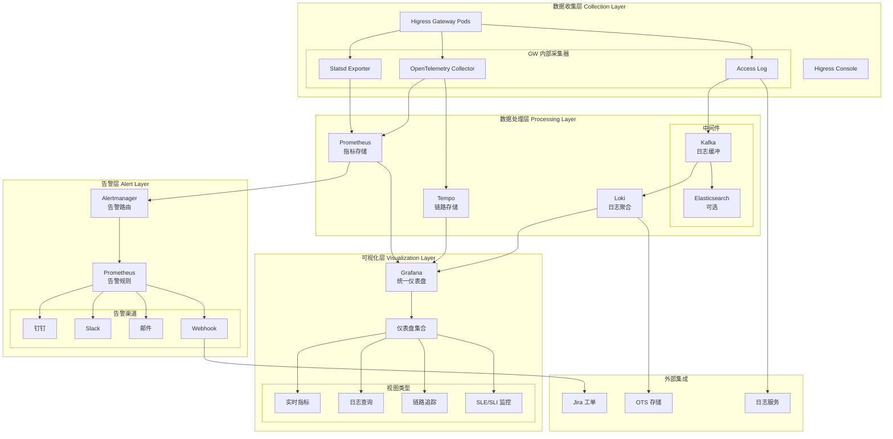
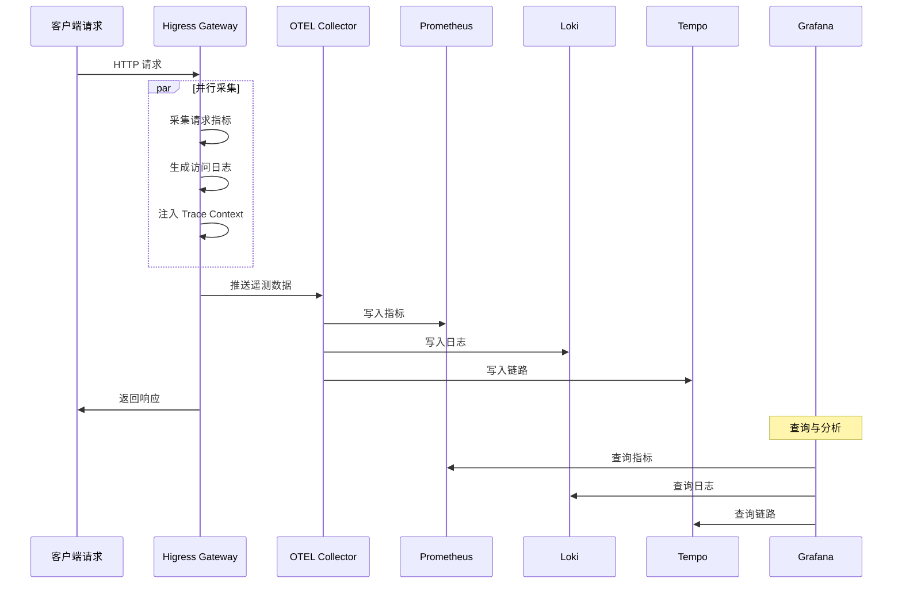
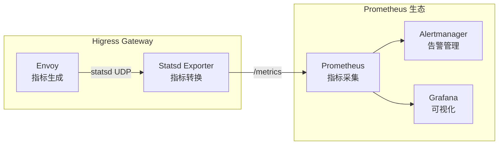
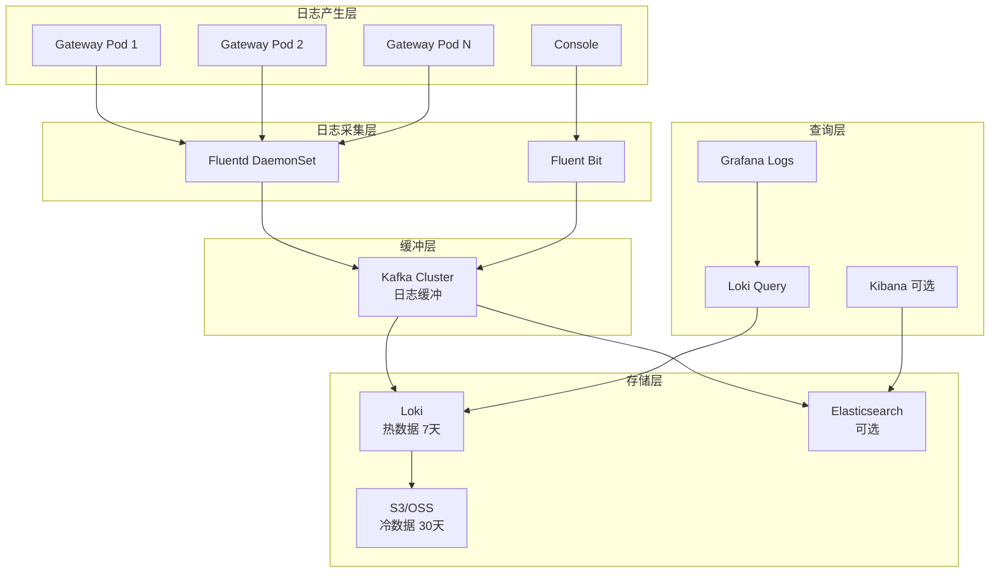
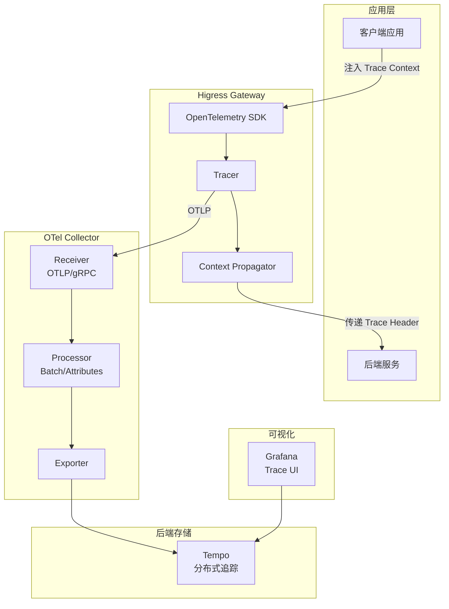
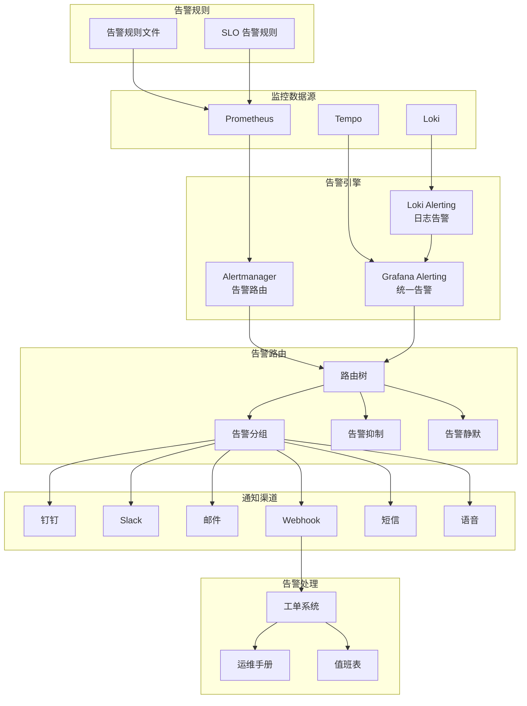
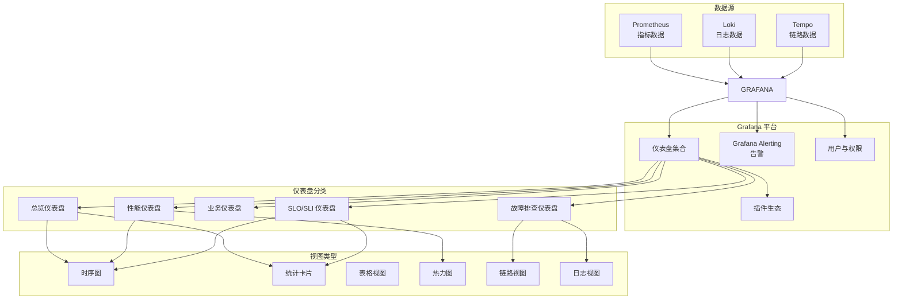
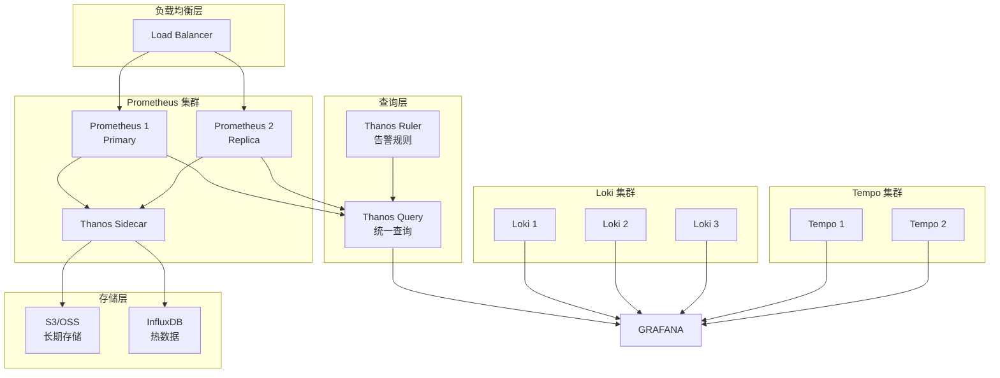

# Higress 可观察性架构完整指南

本文档提供 Higress 网关的生产级可观察性（Observability）架构设计与实施方案，涵盖指标监控、日志收集、链路追踪、告警通知与可视化的完整技术栈。

---

## 1. 可观察性架构概述

### 1.1 整体架构

Higress 的可观察性架构基于云原生的三大支柱（Metrics、Logs、Traces），并结合告警与可视化能力，构建完整的监控体系：



### 1.2 三大支柱设计原则

| 支柱 | 目标 | 关键技术 | 保留时间 |
|------|------|---------|---------|
| **Metrics（指标）** | 发现问题和趋势 | Prometheus + Statsd | 15天（短期）+ 下采样（长期） |
| **Logs（日志）** | 定位根因 | Loki + Kafka | 7天（热数据）+ 30天（冷数据） |
| **Traces（追踪）** | 分析调用链路 | OpenTelemetry + Tempo | 7天 |

### 1.3 数据流设计



---

## 2. Metrics 指标监控

### 2.1 Prometheus 集成架构

Higress 基于 Envoy 构建，原生支持 Prometheus 指标采集。指标通过 Statsd 协议暴露，并由 Statsd Exporter 转换为 Prometheus 格式。



### 2.2 部署 Statsd Exporter

#### 2.2.1 ConfigMap 配置

```yaml
apiVersion: v1
kind: ConfigMap
metadata:
  name: higress-statsd-mapper
  namespace: higress-system
data:
  mapper.conf: |
    mappings:
      # 请求指标映射
      - match: ingress.*.request.*
        name: "higress_request_total"
        labels:
          destination_service: "$2"
          response_code: "$3"
      
      # 延迟指标映射
      - match: ingress.*.duration.*
        name: "higress_request_duration_milliseconds"
        labels:
          destination_service: "$2"
          quantile: "$3"
      
      # 连接指标映射
      - match: ingress.*.cx.*
        name: "higress_connection_count"
        labels:
          destination_service: "$2"
          state: "$3"
```

#### 2.2.2 Deployment 配置

```yaml
apiVersion: apps/v1
kind: Deployment
metadata:
  name: higress-statsd-exporter
  namespace: higress-system
spec:
  replicas: 2
  selector:
    matchLabels:
      app: higress-statsd-exporter
  template:
    metadata:
      labels:
        app: higress-statsd-exporter
    spec:
      containers:
        - name: statsd-exporter
          image: prom/statsd-exporter:latest
          args:
            - --statsd.mapping-config=/etc/statsd/mapper.conf
            - --statsd.listen-udp=:9125
            - --web.listen-address=:9102
          ports:
            - containerPort: 9125
              protocol: UDP
              name: statsd
            - containerPort: 9102
              protocol: TCP
              name: metrics
          volumeMounts:
            - name: config
              mountPath: /etc/statsd
      volumes:
        - name: config
          configMap:
            name: higress-statsd-mapper
```

#### 2.2.3 Service 配置

```yaml
apiVersion: v1
kind: Service
metadata:
  name: higress-statsd-exporter
  namespace: higress-system
  labels:
    app: higress-statsd-exporter
spec:
  ports:
    - name: statsd
      port: 9125
      targetPort: 9125
      protocol: UDP
    - name: metrics
      port: 9102
      targetPort: 9102
      protocol: TCP
  selector:
    app: higress-statsd-exporter
```

### 2.3 Prometheus 配置

#### 2.3.1 ServiceMonitor 配置（推荐）

```yaml
apiVersion: monitoring.coreos.com/v1
kind: ServiceMonitor
metadata:
  name: higress-gateway
  namespace: higress-system
  labels:
    app: higress-gateway
spec:
  selector:
    matchLabels:
      app: higress-gateway
  endpoints:
    - port: http-monitoring
      interval: 30s
      path: /stats/prometheus
      scheme: http
---
apiVersion: monitoring.coreos.com/v1
kind: ServiceMonitor
metadata:
  name: higress-statsd-exporter
  namespace: higress-system
spec:
  selector:
    matchLabels:
      app: higress-statsd-exporter
  endpoints:
    - port: metrics
      interval: 30s
      path: /metrics
```

#### 2.3.2 Prometheus 抓取配置

```yaml
apiVersion: v1
kind: ConfigMap
metadata:
  name: prometheus-config
  namespace: monitoring
data:
  prometheus.yml: |
    global:
      scrape_interval: 30s
      evaluation_interval: 30s
      external_labels:
        cluster: 'production'
        datacenter: 'dc1'

    scrape_configs:
      # Higress Gateway 指标
      - job_name: 'higress-gateway'
        kubernetes_sd_configs:
          - role: pod
            namespaces:
              names:
                - higress-system
        relabel_configs:
          - source_labels: [__meta_kubernetes_pod_label_app]
            regex: higress-gateway
            action: keep
          - source_labels: [__meta_kubernetes_pod_ip]
            target_label: __address__
            replacement: $1:15090
          - source_labels: [__meta_kubernetes_pod_name]
            target_label: pod
          - source_labels: [__meta_kubernetes_namespace]
            target_label: namespace

      # Statsd Exporter 指标
      - job_name: 'higress-statsd-exporter'
        kubernetes_sd_configs:
          - role: pod
            namespaces:
              names:
                - higress-system
        relabel_configs:
          - source_labels: [__meta_kubernetes_pod_label_app]
            regex: higress-statsd-exporter
            action: keep
          - source_labels: [__meta_kubernetes_pod_ip]
            target_label: __address__
            replacement: $1:9102
```

### 2.4 关键指标定义

#### 2.4.1 RED 指标（Rate, Errors, Duration）

```yaml
# 请求率（Rate）
higress_request_total{destination_service="backend-service",response_code="200"}

# 错误率（Errors）
rate(higress_request_total{response_code=~"5.."}[5m])

# 延迟（Duration）
histogram_quantile(0.95, sum(rate(higress_request_duration_milliseconds_bucket[5m])) by (le, destination_service))
```

#### 2.4.2 USE 指标（Utilization, Saturation, Errors）

```yaml
# CPU 使用率
rate(process_cpu_seconds_total{pod=~"higress-gateway.*"}[5m])

# 内存使用
container_memory_usage_bytes{container="higress-gateway"}

# 连接数（饱和度）
higress_connection_count{state="active"}

# 网络流量
rate(container_network_receive_bytes_total{container="higress-gateway"}[5m])
rate(container_network_transmit_bytes_total{container="higress-gateway"}[5m])
```

#### 2.4.3 业务指标

```yaml
# 按域名统计的请求量
sum(rate(higress_request_total[5m])) by (authority)

# 按服务统计的 P95 延迟
histogram_quantile(0.95, 
  sum(rate(higress_request_duration_milliseconds_bucket[5m])) by (le, destination_service)
)

# 按状态码统计的请求比例
sum(rate(higress_request_total[5m])) by (response_code) / 
sum(rate(higress_request_total[5m]))

# Wasm 插件执行时间
rate(wasm_plugin_duration_milliseconds_sum[5m]) by (plugin_name)
```

### 2.5 自定义业务指标

#### 2.5.1 通过 Wasm 插件上报自定义指标

```go
// Wasm 插件示例：自定义业务指标
package main

import (
    "github.com/tetratelabs/proxy-wasm-go-sdk/proxywasm"
    "github.com/tetratelabs/proxy-wasm-go-sdk/proxywasm/types"
)

func main() {
    proxywasm.SetVMContext(&vmContext{})
}

type vmContext struct {
    types.DefaultVMContext
}

func (*vmContext) NewPluginContext(contextID uint32) types.PluginContext {
    return &pluginContext{}
}

type pluginContext struct {
    types.DefaultPluginContext
}

func (p *pluginContext) OnHttpHeaders(numHeaders int, endOfStream bool) types.Action {
    // 自定义指标：API 调用量统计
    apiName, _ := proxywasm.GetHttpRequestHeader("x-api-name")
    if apiName != "" {
        proxywasm.SetProperty([]string{"metric", "api_call_count"}, []byte(apiName))
    }
    
    // 自定义指标：用户类型统计
    userType, _ := proxywasm.GetHttpRequestHeader("x-user-type")
    if userType != "" {
        proxywasm.SetProperty([]string{"metric", "user_type"}, []byte(userType))
    }
    
    return types.ActionContinue
}
```

#### 2.5.2 自定义指标映射配置

```yaml
apiVersion: v1
kind: ConfigMap
metadata:
  name: higress-custom-metrics
  namespace: higress-system
data:
  custom-metrics.yaml: |
    # API 调用量统计
    - match: api.call.count.*
      name: "higress_api_call_count_total"
      labels:
        api_name: "$1"
        environment: "production"
      
    # 用户类型统计
    - match: user.type.*
      name: "higress_user_type_total"
      labels:
        user_type: "$1"
      
    # 业务错误统计
    - match: business.error.*
      name: "higress_business_error_total"
      labels:
        error_code: "$1"
        error_type: "$2"
```

#### 2.5.3 基于 AI 插件的指标配置

Higress 提供了多个 AI 相关插件，这些插件内置了 Prometheus 指标上报能力，可以直接用于可观察性。

##### AI Statistics 插件配置

**AI Statistics** 插件提供请求统计、延迟分析、错误追踪等核心指标：

```yaml
apiVersion: higress.io/v1
kind: WasmPlugin
metadata:
  name: ai-statistics
  namespace: higress-system
spec:
  url: file:///etc/wasm-plugins/ai-statistics.wasm
  phase: AUTHN
  priority: 100
  config:
    # 启用 Prometheus 指标导出
    enableMetrics: true

    # 指标前缀（默认：higress_ai_stats）
    metricPrefix: "higress_ai_stats"

    # 指标配置
    metrics:
      # 请求计数器
      requestCount:
        enabled: true
        name: "request_total"
        type: "counter"
        help: "Total number of AI requests"
        labels:
          - route_name      # 路由名称
          - upstream_host   # 上游服务
          - model_name      # 模型名称
          - status_code     # HTTP 状态码
          - user_id         # 用户 ID

      # 请求延迟直方图
      requestDuration:
        enabled: true
        name: "request_duration_seconds"
        type: "histogram"
        help: "Request latency in seconds"
        buckets: [0.001, 0.005, 0.01, 0.025, 0.05, 0.1, 0.25, 0.5, 1, 2.5, 5, 10]
        labels:
          - route_name
          - upstream_host
          - model_name

      # Token 计数器
      tokenCount:
        enabled: true
        name: "token_total"
        type: "counter"
        help: "Total tokens consumed"
        labels:
          - model_name
          - token_type     # prompt | completion
          - user_id

      # 错误计数器
      errorCount:
        enabled: true
        name: "error_total"
        type: "counter"
        help: "Total errors"
        labels:
          - route_name
          - error_type     # timeout | rate_limit | upstream_error
          - status_code

    # 采样配置（高流量环境建议启用采样）
    sampling:
      enabled: false
      rate: 100           # 100 = 100% 采样，10 = 10% 采样
```

**生成的 Prometheus 指标示例：**

```promql
# 请求速率（按路由分组）
rate(higress_ai_stats_request_total[5m])

# P95 延迟（按模型分组）
histogram_quantile(0.95, sum(rate(higress_ai_stats_request_duration_seconds_bucket[5m])) by (le, model_name))

# Token 消耗速率（按用户分组）
rate(higress_ai_stats_token_total[5m]) by (user_id, token_type)

# 错误率（按错误类型分组）
sum(rate(higress_ai_stats_error_total[5m])) by (error_type)
```

##### AI Token Ratelimit 插件配置

**AI Token Ratelimit** 插件提供 Token 配额监控与告警指标：

```yaml
apiVersion: higress.io/v1
kind: WasmPlugin
metadata:
  name: ai-token-ratelimit
  namespace: higress-system
spec:
  url: file:///etc/wasm-plugins/ai-token-ratelimit.wasm
  phase: AUTHN
  priority: 99
  config:
    # 全局限流配置
    globalLimit:
      capacity: 1000000        # 总配额
      refillRate: 1000         # 每秒补充

    # 用户级限流配置
    userLimit:
      capacity: 10000
      refillRate: 100

    # 指标配置
    metrics:
      enabled: true
      prefix: "higress_ai_rl"

      # 配额使用率
      quotaUsage:
        name: "quota_usage_ratio"
        type: "gauge"
        help: "Current quota usage ratio"
        labels:
          - scope             # global | user | route
          - scope_id          # 用户 ID 或路由名称

      # 限流命中次数
      rateLimitHits:
        name: "rate_limit_hits_total"
        type: "counter"
        help: "Total rate limit hits"
        labels:
          - scope
          - scope_id
          - limit_type        # token | request

      # Token 消耗速率
      tokenConsumption:
        name: "token_consumption_rate"
        type: "gauge"
        help: "Token consumption rate (tokens/sec)"
        labels:
          - scope
          - scope_id

    # 告警阈值
    alerts:
      - name: "global_quota_high"
        metric: "quota_usage_ratio"
        operator: ">"
        threshold: 0.8
        scope: "global"
        message: "Global token quota usage above 80%"

      - name: "user_quota_critical"
        metric: "quota_usage_ratio"
        operator: ">"
        threshold: 0.95
        scope: "user"
        message: "User token quota usage above 95%"
```

**生成的 Prometheus 指标示例：**

```promql
# 全局配额使用率
higress_ai_rl_quota_usage_ratio{scope="global"}

# 用户配额使用率 Top 10
topk(10, higress_ai_rl_quota_usage_ratio{scope="user"})

# 限流命中速率
rate(higress_ai_rl_rate_limit_hits_total[5m])

# Token 消耗速率（按用户排序）
sort_desc(sum(higress_ai_rl_token_consumption_rate) by (scope_id))
```

##### AI Quota 插件配置

**AI Quota** 插件提供调用次数配额监控：

```yaml
apiVersion: higress.io/v1
kind: WasmPlugin
metadata:
  name: ai-quota
  namespace: higress-system
spec:
  url: file:///etc/wasm-plugins/ai-quota.wasm
  phase: AUTHN
  priority: 98
  config:
    # 配额规则
    rules:
      - name: "global_daily"
        limit:
          capacity: 1000000
          window: 86400       # 24 小时

      - name: "user_hourly"
        limit:
          capacity: 1000
          window: 3600        # 1 小时

      - name: "route_minute"
        limit:
          capacity: 100
          window: 60          # 1 分钟

    # 指标配置
    metrics:
      enabled: true
      prefix: "higress_ai_quota"

      # 配额剩余量
      quotaRemaining:
        name: "quota_remaining"
        type: "gauge"
        help: "Remaining quota count"
        labels:
          - rule_name
          - scope

      # 配额消耗量
      quotaConsumed:
        name: "quota_consumed_total"
        type: "counter"
        help: "Total quota consumed"
        labels:
          - rule_name
          - scope

      # 配额重置时间
      quotaResetTime:
        name: "quota_reset_time"
        type: "gauge"
        help: "Unix timestamp when quota resets"
        labels:
          - rule_name
          - scope
```

##### 完整的 Prometheus 查询示例

**创建告警规则：**

```yaml
apiVersion: monitoring.coreos.com/v1
kind: PrometheusRule
metadata:
  name: higress-ai-alerts
  namespace: higress-system
spec:
  groups:
    - name: ai_quota_alerts
      rules:
        # 全局配额告警
        - alert: HigressAIGlobalQuotaHigh
          expr: |
            higress_ai_rl_quota_usage_ratio{scope="global"} > 0.8
          for: 5m
          labels:
            severity: warning
          annotations:
            summary: "Global AI token quota usage above 80%"
            description: "Current usage: {{ $value | humanizePercentage }}"

        - alert: HigressAIGlobalQuotaCritical
          expr: |
            higress_ai_rl_quota_usage_ratio{scope="global"} > 0.95
          for: 1m
          labels:
            severity: critical
          annotations:
            summary: "Global AI token quota critical"
            description: "Usage: {{ $value | humanizePercentage }}, immediate action required"

        # 用户配额告警
        - alert: HigressAIUserQuotaExhausted
          expr: |
            higress_ai_quota_quota_remaining{scope="user"} < 10
          for: 10m
          labels:
            severity: warning
          annotations:
            summary: "User {{ $labels.scope_id }} quota almost exhausted"
            description: "Remaining: {{ $value }} calls"

        # 错误率告警
        - alert: HigressAIHighErrorRate
          expr: |
            sum(rate(higress_ai_stats_error_total[5m])) by (error_type)
            / sum(rate(higress_ai_stats_request_total[5m])) > 0.05
          for: 5m
          labels:
            severity: warning
          annotations:
            summary: "AI gateway error rate above 5%"
            description: "Error type: {{ $labels.error_type }}, Rate: {{ $value | humanizePercentage }}"

        # 延迟告警
        - alert: HigressAIHighLatency
          expr: |
            histogram_quantile(0.95,
              sum(rate(higress_ai_stats_request_duration_seconds_bucket[5m])) by (le, model_name)
            ) > 5
          for: 10m
          labels:
            severity: warning
          annotations:
            summary: "AI model {{ $labels.model_name }} P95 latency above 5s"
            description: "Current P95: {{ $value }}s"
```

**Grafana 仪表盘查询：**

```json
{
  "title": "Higress AI 插件监控",
  "panels": [
    {
      "title": "请求总量趋势",
      "targets": [
        {
          "expr": "sum(rate(higress_ai_stats_request_total[5m])) by (route_name)",
          "legendFormat": "{{route_name}}"
        }
      ]
    },
    {
      "title": "P95 延迟分布",
      "targets": [
        {
          "expr": "histogram_quantile(0.95, sum(rate(higress_ai_stats_request_duration_seconds_bucket[5m])) by (le, model_name))",
          "legendFormat": "{{model_name}}"
        }
      ]
    },
    {
      "title": "Token 消耗速率",
      "targets": [
        {
          "expr": "sum(rate(higress_ai_stats_token_total{token_type=\"prompt\"}[5m])) by (user_id)",
          "legendFormat": "Prompt - {{user_id}}"
        },
        {
          "expr": "sum(rate(higress_ai_stats_token_total{token_type=\"completion\"}[5m])) by (user_id)",
          "legendFormat": "Completion - {{user_id}}"
        }
      ]
    },
    {
      "title": "配额使用率",
      "targets": [
        {
          "expr": "higress_ai_rl_quota_usage_ratio{scope=\"global\"}",
          "legendFormat": "Global Quota"
        },
        {
          "expr": "avg(higress_ai_rl_quota_usage_ratio{scope=\"user\"})",
          "legendFormat": "Avg User Quota"
        }
      ]
    },
    {
      "title": "错误率分布",
      "targets": [
        {
          "expr": "sum(rate(higress_ai_stats_error_total[5m])) by (error_type) / sum(rate(higress_ai_stats_request_total[5m]))",
          "legendFormat": "{{error_type}}"
        }
      ]
    },
    {
      "title": "限流命中统计",
      "targets": [
        {
          "expr": "sum(rate(higress_ai_rl_rate_limit_hits_total[5m])) by (limit_type)",
          "legendFormat": "{{limit_type}}"
        }
      ]
    }
  ]
}
```

### 2.6 指标保留策略

```yaml
# Prometheus 配置
global:
  scrape_interval: 30s
  evaluation_interval: 30s

# 数据保留配置
storage:
  tsdb:
    retention.time: 15d
    retention.size: 50GB

# 远程存储配置（长期保留）
remote_write:
  - url: "http://thanos-receiver:19291/api/v1/receive"
    queue_config:
      capacity: 10000
      max_shards: 200
      min_shards: 1
      max_samples_per_send: 5000
      batch_send_deadline: 5s
      min_backoff: 30ms
      max_backoff: 100ms

# 数据下采样规则
rule_files:
  - "/etc/prometheus/recording-rules.yml"

recording_rules.yml: |
  groups:
    - name: aggregation
      interval: 30s
      rules:
        # 5 分钟聚合
        - record: job:request_rate:5m
          expr: sum(rate(higress_request_total[5m])) by (job)
        
        # 1 小时聚合
        - record: job:request_rate:1h
          expr: sum(rate(higress_request_total[1h])) by (job)
        
        # 1 天聚合
        - record: job:request_rate:1d
          expr: sum(rate(higress_request_total[1d])) by (job)
```

---

## 3. Logging 日志收集

### 3.1 日志架构设计

Higress 日志收集采用分层架构，结合 Kafka 缓冲和 Loki 聚合：



### 3.2 访问日志配置

#### 3.2.1 JSON 格式访问日志

Helm values 配置：

```yaml
gateway:
  enableAccessLog: true
  accessLogFormat: |
    {
      "time": "$time_iso8601",
      "authority": "$authority",
      "method": "$request_method",
      "path": "$request_uri",
      "protocol": "$protocol",
      "status": "$status",
      "request_time": "$request_time",
      "upstream_response_time": "$upstream_response_time",
      "upstream_addr": "$upstream_addr",
      "upstream_status": "$upstream_status",
      "upstream_response_length": "$upstream_response_length",
      "request_length": "$request_length",
      "bytes_sent": "$bytes_sent",
      "user_agent": "$http_user_agent",
      "referer": "$http_referer",
      "x_forwarded_for": "$http_x_forwarded_for",
      "x_real_ip": "$http_x_real_ip",
      "request_id": "$request_id",
      "trace_id": "$opentelemetry_trace_id",
      "span_id": "$opentelemetry_span_id",
      "wasm_plugins": "$wasm_plugins",
      "route_name": "$route_name",
      "upstream_service": "$upstream_service",
      "upstream_cluster": "$upstream_cluster",
      "upstream_host": "$upstream_host"
    }
```

#### 3.2.2 环境变量配置

```yaml
apiVersion: v1
kind: ConfigMap
metadata:
  name: higress-gateway-env
  namespace: higress-system
data:
  LOG_LEVEL: "info"
  ACCESS_LOG_FORMAT: "json"
  ACCESS_LOG_PATH: "/dev/stdout"
  ERROR_LOG_LEVEL: "warn"
```

### 3.3 Fluentd 配置

#### 3.3.1 Fluentd DaemonSet 配置

```yaml
apiVersion: apps/v1
kind: DaemonSet
metadata:
  name: fluentd
  namespace: logging
spec:
  selector:
    matchLabels:
      app: fluentd
  template:
    metadata:
      labels:
        app: fluentd
    spec:
      containers:
        - name: fluentd
          image: fluent/fluentd-kubernetes-daemonset:v1-debian-elasticsearch
          env:
            - name: FLUENT_ELASTICSEARCH_HOST
              value: "elasticsearch.logging.svc.cluster.local"
            - name: FLUENT_ELASTICSEARCH_PORT
              value: "9200"
            - name: FLUENT_ELASTICSEARCH_SCHEME
              value: "http"
            - name: FLUENTD_SYSTEMD_CONF
              value: "disable"
          resources:
            limits:
              memory: 200Mi
            requests:
              cpu: 100m
              memory: 200Mi
          volumeMounts:
            - name: varlog
              mountPath: /var/log
            - name: varlibdockercontainers
              mountPath: /var/lib/docker/containers
              readOnly: true
            - name: fluentd-config
              mountPath: /fluentd/etc
      volumes:
        - name: varlog
          hostPath:
            path: /var/log
        - name: varlibdockercontainers
          hostPath:
            path: /var/lib/docker/containers
        - name: fluentd-config
          configMap:
            name: fluentd-config
```

#### 3.3.2 Fluentd 配置文件

```yaml
apiVersion: v1
kind: ConfigMap
metadata:
  name: fluentd-config
  namespace: logging
data:
  fluent.conf: |
    # Higress Gateway 日志收集
    <source>
      @type tail
      @id higress_gateway_access
      path /var/log/containers/higress-gateway*.log
      pos_file /var/log/fluentd-higress-gateway-access.pos
      tag higress.access
      <parse>
        @type json
        time_key time
        time_format %Y-%m-%dT%H:%M:%S.%NZ
      </parse>
    </source>

    # Higress Console 日志收集
    <source>
      @type tail
      @id higress_console
      path /var/log/containers/higress-console*.log
      pos_file /var/log/fluentd-higress-console.pos
      tag higress.console
      <parse>
        @type json
        time_key time
        time_format %Y-%m-%dT%H:%M:%S.%NZ
      </parse>
    </source>

    # 过滤与增强
    <filter higress.**>
      @type record_transformer
      <record>
        cluster_name "#{ENV['CLUSTER_NAME']}"
        environment "#{ENV['ENVIRONMENT']}"
        hostname "#{Socket.gethostname}"
      </record>
    </filter>

    # 错误日志打标
    <filter higress.access>
      @type grep
      <regexp>
        key status
        pattern /^(5..)$/
      </regexp>
    </filter>

    # 输出到 Kafka
    <match higress.**>
      @type kafka2
      brokers kafka-0.kafka-headless.logging.svc.cluster.local:9092,kafka-1.kafka-headless.logging.svc.cluster.local:9092
      topic_key log_type
      default_topic higress-logs
      <buffer>
        @type file
        path /var/log/fluentd-kafka-buffer
        flush_mode interval
        flush_interval 10s
        chunk_limit_size 5m
        total_limit_size 500m
      </buffer>
      <format>
        @type json
      </format>
    </match>
```

### 3.4 Loki 日志聚合

#### 3.4.1 Loki 部署配置

```yaml
apiVersion: v1
kind: ConfigMap
metadata:
  name: loki-config
  namespace: logging
data:
  loki-config.yaml: |
    auth_enabled: false
    server:
      http_listen_port: 3100
      grpc_listen_port: 9096
    
    common:
      path_prefix: /loki
      storage:
        filesystem:
          chunks_directory: /loki/chunks
          rules_directory: /loki/rules
      replication_factor: 1
      ring:
        instance_addr: 127.0.0.1
        kvstore:
          store: inmemory
    
    schema_config:
      configs:
        - from: 2024-01-01
          store: boltdb-shipper
          object_store: filesystem
          schema: v11
          index:
            prefix: index_
            period: 24h
    
    ruler:
      alertmanager_url: http://localhost:9093
    
    # 保留策略
    limits_config:
      retention_period: 168h  # 7 天
      ingestion_rate_mb: 20
      ingestion_burst_size_mb: 30
      per_stream_rate_limit: 10MB
      max_streams_per_user: 10000
      max_query_length: 1000h
      max_query_parallelism: 32
    
    # 日志压缩
    compactor:
      working_directory: /loki/compactor
      shared_store: filesystem
      retention_enabled: true
      retention_delete_delay: 2h
      delete_delay: 2h
      delete_cancel_interval: 5m
      retention_delete_worker_count: 150

---
apiVersion: apps/v1
kind: StatefulSet
metadata:
  name: loki
  namespace: logging
spec:
  serviceName: loki
  replicas: 1
  selector:
    matchLabels:
      app: loki
  template:
    metadata:
      labels:
        app: loki
    spec:
      containers:
        - name: loki
          image: grafana/loki:latest
          args:
            - -config.file=/etc/loki/loki-config.yaml
          ports:
            - containerPort: 3100
              name: http-metrics
            - containerPort: 9096
              name: grpc
          volumeMounts:
            - name: config
              mountPath: /etc/loki
            - name: storage
              mountPath: /loki
      volumes:
        - name: config
          configMap:
            name: loki-config
  volumeClaimTemplates:
    - metadata:
        name: storage
      spec:
        accessModes: ["ReadWriteOnce"]
        resources:
          requests:
            storage: 100Gi
```

#### 3.4.2 Promtail 配置（日志采集）

```yaml
apiVersion: v1
kind: ConfigMap
metadata:
  name: promtail-config
  namespace: logging
data:
  promtail.yaml: |
    server:
      http_listen_port: 9080
      grpc_listen_port: 0
    
    positions:
      filename: /tmp/positions.yaml
    
    clients:
      - url: http://loki:3100/loki/api/v1/push
    
    scrape_configs:
      # Higress Gateway 日志
      - job_name: higress-gateway
        kubernetes_sd_configs:
          - role: pod
            namespaces:
              names:
                - higress-system
        relabel_configs:
          - source_labels: [__meta_kubernetes_pod_label_app]
            regex: higress-gateway
            action: keep
          - source_labels: [__meta_kubernetes_pod_name]
            target_label: pod
          - source_labels: [__meta_kubernetes_namespace]
            target_label: namespace
          - source_labels: [__meta_kubernetes_pod_node_name]
            target_label: node
        pipeline_stages:
          - json:
              expressions:
                time: time
                authority: authority
                method: method
                path: path
                status: status
                request_time: request_time
                upstream_response_time: upstream_response_time
                trace_id: trace_id
          - labels:
              status:
              method:
              authority:
          - output:
              source: output
      
      # Higress Console 日志
      - job_name: higress-console
        kubernetes_sd_configs:
          - role: pod
            namespaces:
              names:
                - higress-system
        relabel_configs:
          - source_labels: [__meta_kubernetes_pod_label_app]
            regex: higress-console
            action: keep
        pipeline_stages:
          - json:
              expressions:
                level: level
                msg: msg
                time: time
          - labels:
              level:
```

### 3.5 日志查询示例

#### 3.5.1 LogQL 查询语法

```logql
# 查询 5xx 错误日志
{namespace="higress-system", app="higress-gateway"} |= `status:"5"`

# 查询特定服务的慢请求
{namespace="higress-system"} |= `upstream_service:"backend-api"` |= `request_time:>1`

# 按状态码统计
sum(count_over_time({namespace="higress-system", app="higress-gateway"} | json | status != "" [5m])) by (status)

# 查询包含特定 trace_id 的所有日志
{namespace="higress-system"} |= `trace_id:"abc123"`

# 慢请求 Top 10
topk(10, sum({namespace="higress-system"} | json request_time | unwrap request_time [1h]))
```

#### 3.5.2 Grafana 日志面板

```json
{
  "targets": [
    {
      "expr": "{namespace=\"higress-system\", app=\"higress-gateway\"} |= `\"status\":\"500\"`",
      "refId": "A",
      "queryType": "range"
    },
    {
      "expr": "sum(count_over_time({namespace=\"higress-system\"} | json | unwrap status [5m])) by (status)",
      "refId": "B",
      "queryType": "instant"
    }
  ]
}
```

### 3.6 日志归档与清理

#### 3.6.1 S3/OSS 归档配置

```yaml
# Loki 配置添加 S3 存储
schema_config:
  configs:
    - from: 2024-01-01
      store: boltdb-shipper
      object_store: s3
      schema: v11
      index:
        prefix: loki-index-
        period: 24h

common:
  storage:
    s3:
      s3: https://s3.amazonaws.com
      bucketnames: loki-logs
      region: us-west-2
      access_key_id: ${AWS_ACCESS_KEY_ID}
      secret_access_key: ${AWS_SECRET_ACCESS_KEY}
```

#### 3.6.2 日志清理脚本

```bash
#!/bin/bash
# 日志清理脚本：删除超过 30 天的日志

NAMESPACE="higress-system"
RETENTION_DAYS=30

# 清理 Loki 日志
kubectl exec -n logging deployment/loki -- \
  logcli --addr=http://localhost:3100 \
  rm --start="$(date -d '-${RETENTION_DAYS} days' +%Y-%m-%d)" \
       --end="$(date +%Y-%m-%d)" \
       '{namespace="higress-system"}'

# 清理 Elasticsearch 日志（如果使用）
curl -X DELETE "elasticsearch.logging.svc.cluster.local:9200/higress-logs-$(date -d '-${RETENTION_DAYS} days' +%Y.%m.%d)"
```

---

## 4. Tracing 链路追踪

### 4.1 OpenTelemetry 集成架构

Higress 使用 OpenTelemetry (OTel) 作为统一的可观察性数据收集框架，实现分布式链路追踪：



### 4.2 OpenTelemetry 部署

#### 4.2.1 OTEL Collector 配置

```yaml
apiVersion: v1
kind: ConfigMap
metadata:
  name: otel-collector-config
  namespace: higress-system
data:
  otel-collector.yaml: |
    receivers:
      # OTLP 接收器（从 Gateway 接收）
      otlp:
        protocols:
          grpc:
            endpoint: 0.0.0.0:4317
          http:
            endpoint: 0.0.0.0:4318
    
    processors:
      # 批处理
      batch:
        timeout: 5s
        send_batch_size: 10000
        send_batch_max_size: 11000
      
      # 属性添加
      attributes:
        actions:
          - key: environment
            value: production
            action: insert
          - key: cluster
            value: production-cluster
            action: insert
      
      # 内存限制
      memory_limiter:
        limit_mib: 512
        spike_limit_mib: 128
        check_interval: 5s
    
    exporters:
      # 导出到 Tempo
      otlp/tempo:
        endpoint: tempo:4317
        tls:
          insecure: true
        sending_queue:
          enabled: true
          num_consumers: 10
          queue_size: 10000
        retry_on_failure:
          enabled: true
          initial_interval: 5s
          max_interval: 30s
          max_elapsed_time: 300s
      
      # 可选：导出到 Jaeger
      otlp/jaeger:
        endpoint: jaeger-collector:4317
        tls:
          insecure: true
    
    service:
      pipelines:
        traces:
          receivers: [otlp]
          processors: [memory_limiter, batch, attributes]
          exporters: [otlp/tempo]
```

#### 4.2.2 OTEL Collector 部署

```yaml
apiVersion: apps/v1
kind: Deployment
metadata:
  name: otel-collector
  namespace: higress-system
spec:
  replicas: 2
  selector:
    matchLabels:
      app: otel-collector
  template:
    metadata:
      labels:
        app: otel-collector
    spec:
      containers:
        - name: otel-collector
          image: otel/opentelemetry-collector-contrib:latest
          args:
            - --config=/etc/otel-collector-config.yaml
          ports:
            - containerPort: 4317
              name: otlp-grpc
            - containerPort: 4318
              name: otlp-http
            - containerPort: 8888
              name: metrics
          volumeMounts:
            - name: config
              mountPath: /etc/otel-collector-config.yaml
              subPath: otel-collector-config.yaml
          resources:
            limits:
              cpu: 500m
              memory: 512Mi
            requests:
              cpu: 100m
              memory: 128Mi
      volumes:
        - name: config
          configMap:
            name: otel-collector-config
---
apiVersion: v1
kind: Service
metadata:
  name: otel-collector
  namespace: higress-system
spec:
  ports:
    - name: otlp-grpc
      port: 4317
      targetPort: 4317
    - name: otlp-http
      port: 4318
      targetPort: 4318
  selector:
    app: otel-collector
```

### 4.3 Higress Gateway 追踪配置

#### 4.3.1 Helm Values 配置

```yaml
gateway:
  # 启用追踪
  enableTracing: true
  
  # 追踪采样率（生产环境建议 10-30%）
  tracingSampling: 10.0
  
  # 追踪配置
  telemetry:
    v2:
      # 启用 OpenTelemetry
      enabled: true
      
      # Prometheus 指标
      prometheus:
        config:
          latency: latencies
          requestDuration:
            units: milliseconds
            explicitType: true
      
      # 访问日志
      accessLog:
        - name: otel
          typedConfig:
            "@type": type.googleapis.com/envoy.extensions.access_loggers.open_telemetry.v3.OpenTelemetryAccessLogConfig
            common_config:
              grpc_service:
                envoy_grpc:
                  cluster_name: otel-collector
                timeout: 1s
            resource_semantic_conventions: ENVIRONMENT
            body:
              string_value: |
                {
                  "time": "$time_iso8601",
                  "method": "$request_method",
                  "path": "$request_uri",
                  "status": "$status",
                  "latency": "$request_time",
                  "trace_id": "$trace_id",
                  "span_id": "$span_id",
                  "user_agent": "$http_user_agent"
                }
```

#### 4.3.2 静态资源配置

```yaml
apiVersion: v1
kind: ConfigMap
metadata:
  name: higress-tracing-config
  namespace: higress-system
data:
  tracing-config.yaml: |
    static_resources:
      clusters:
        # OpenTelemetry Collector 集群
        - name: otel-collector
          type: STRICT_DNS
          load_assignment:
            cluster_name: otel-collector
            endpoints:
              - lb_endpoints:
                  - endpoint:
                      address:
                        socket_address:
                          address: otel-collector.higress-system.svc.cluster.local
                          port_value: 4317
          typed_extension_protocol_options:
            envoy.extensions.upstreams.http.v3.HttpProtocolOptions:
              "@type": type.googleapis.com/envoy.extensions.upstreams.http.v3.HttpProtocolOptions
              explicit_http_config:
                http2_protocol_options: {}
      
      # 追踪服务配置
      tracing:
        http:
          name: envoy.tracers.opentelemetry
          typed_config:
            "@type": type.googleapis.com/envoy.config.trace.v3.OpenTelemetryConfig
            grpc_service:
              envoy_grpc:
                cluster_name: otel-collector
              timeout: 1s
            service_name: higress-gateway
            resource_attributes:
              environment:
                value: production
              cluster:
                value: production-cluster
        
        # 采样配置
        sampling:
          value: 10  # 10% 采样
          randomized: true
```

### 4.4 Tempo 部署配置

#### 4.4.1 Tempo ConfigMap

```yaml
apiVersion: v1
kind: ConfigMap
metadata:
  name: tempo-config
  namespace: logging
data:
  tempo.yaml: |
    server:
      http_listen_port: 3100
      grpc_listen_port: 9096
    
    distributor:
      receivers:
        otlp:
          protocols:
            grpc:
              endpoint: 0.0.0.0:4317
            http:
              endpoint: 0.0.0.0:4318
        jaeger:
          protocols:
            grpc:
              endpoint: 0.0.0.0:14250
            thrift_binary:
              endpoint: 0.0.0.0:6832
            thrift_compact:
              endpoint: 0.0.0.0:6831
            thrift_http:
              endpoint: 0.0.0.0:14268
        zipkin:
          endpoint: 0.0.0.0:9411
    
    metrics_generator:
      registry:
        external_labels:
          cluster: production
          source: tempo
      processor:
        service_graphs:
          max_items: 10000
          wait: 10s
          workers: 5
          span_metrics:
            dimensions:
              - http.method
              - http.status_code
        span_metrics:
          dimensions:
            - http.method
            - http.status_code
            - service.name
      storage:
        path: /tmp/tempo/generator/wal
        remote_write:
          - url: http://prometheus:9090/api/v1/write
            send: true
      traces_storage:
        path: /tmp/tempo/generator/traces
    
    storage:
      trace:
        backend: s3  # 或 local、gcs、azure
        block:
          bloom_filter_false_positive: .05
          bloom_filter_size: 1000000
          index_downsample_bytes: 1000
          encoding: zstd
          v2_encoding: zstd
        wal:
          path: /var/tempo/wal
        s3:
          bucket: tempo-traces
          endpoint: s3.amazonaws.com
          region: us-west-2
          access_key: ${AWS_ACCESS_KEY_ID}
          secret_key: ${AWS_SECRET_ACCESS_KEY}
        local:
          path: /var/tempo/traces
    
    overrides:
      per_tenant_override_config: /etc/tempo/overrides.yaml
    
    compactor:
      compaction:
        block_retention: 168h  # 7 天
        retention_delete_delay: 2h
        retention_delete_worker_count: 150
        delete_cancel_interval: 5m
    
    querier:
      frontend_worker:
        frontend_address: tempo-query-frontend:9095
    
    query_frontend:
      search:
        external_endpoints:
          - tempo-query-frontend:9095
---
apiVersion: v1
kind: ConfigMap
metadata:
  name: tempo-overrides
  namespace: logging
data:
  overrides.yaml: |
    overrides:
      # 全局保留策略
      - tenant: "*"
        retention:
          tracks:
            - name: default
              days: 7
        per_endpoint_metrics:
          enabled: true
          jitter_seconds: 60
```

#### 4.4.2 Tempo StatefulSet

```yaml
apiVersion: apps/v1
kind: StatefulSet
metadata:
  name: tempo
  namespace: logging
spec:
  serviceName: tempo
  replicas: 2
  selector:
    matchLabels:
      app: tempo
  template:
    metadata:
      labels:
        app: tempo
    spec:
      containers:
        - name: tempo
          image: grafana/tempo:latest
          args:
            - --config.file=/etc/tempo/tempo.yaml
            - --config.expand-env=true
          ports:
            - containerPort: 3100
              name: http
            - containerPort: 9096
              name: grpc
            - containerPort: 4317
              name: otlp-grpc
            - containerPort: 4318
              name: otlp-http
            - containerPort: 14268
              name: jaeger-http
            - containerPort: 14250
              name: jaeger-grpc
            - containerPort: 9411
              name: zipkin
          env:
            - name: AWS_ACCESS_KEY_ID
              valueFrom:
                secretKeyRef:
                  name: s3-credentials
                  key: access-key
            - name: AWS_SECRET_ACCESS_KEY
              valueFrom:
                secretKeyRef:
                  name: s3-credentials
                  key: secret-key
          volumeMounts:
            - name: config
              mountPath: /etc/tempo
            - name: overrides
              mountPath: /etc/tempo/overrides.yaml
              subPath: overrides.yaml
            - name: storage
              mountPath: /var/tempo
      volumes:
        - name: config
          configMap:
            name: tempo-config
        - name: overrides
          configMap:
            name: tempo-overrides
  volumeClaimTemplates:
    - metadata:
        name: storage
      spec:
        accessModes: ["ReadWriteOnce"]
        resources:
          requests:
            storage: 50Gi
```

### 4.5 跨服务追踪关联

#### 4.5.1 Trace Context 传播

Higress 自动传播以下 Trace Headers：

```yaml
# W3C Trace Context（推荐）
traceparent: 00-0af7651916cd43dd8448eb211c80319c-b7ad6b7169203331-01
tracestate: congo=t61rcWkgMzE

# B3 多 Header 格式
X-B3-TraceId: 0af7651916cd43dd8448eb211c80319c
X-B3-SpanId: b7ad6b7169203331
X-B3-ParentSpanId: 0af7651916cd43dd
X-B3-Sampled: 1

# B3 单 Header 格式
b3: 0af7651916cd43dd8448eb211c80319c-b7ad6b7169203331-1

# Jaeger 格式
uber-trace-id: 0af7651916cd43dd8448eb211c80319c:0af7651916cd43dd8448eb211c80319c:0af7651916cd43dd8448eb211c80319c:1
```

#### 4.5.2 后端服务集成示例

```go
// Go 服务集成 OpenTelemetry
package main

import (
    "context"
    "net/http"
    
    "go.opentelemetry.io/contrib/instrumentation/net/http/otelhttp"
    "go.opentelemetry.io/otel"
    "go.opentelemetry.io/otel/exporters/otlp/otlptrace/otlptracegrpc"
    "go.opentelemetry.io/otel/propagation"
    "go.opentelemetry.io/otel/sdk/resource"
    tracesdk "go.opentelemetry.io/otel/sdk/trace"
    semconv "go.opentelemetry.io/otel/semconv/v1.4.0"
)

func initTracer(serviceName string) error {
    ctx := context.Background()
    
    // 创建资源
    res, err := resource.New(ctx,
        resource.WithAttributes(
            semconv.ServiceNameKey.String(serviceName),
            semconv.DeploymentEnvironmentKey.String("production"),
        ),
    )
    if err != nil {
        return err
    }
    
    // 创建 OTLP exporter
    exporter, err := otlptracegrpc.New(ctx,
        otlptracegrpc.WithEndpoint("otel-collector.higress-system.svc.cluster.local:4317"),
        otlptracegrpc.WithInsecure(),
    )
    if err != nil {
        return err
    }
    
    // 创建 TracerProvider
    tp := tracesdk.NewTracerProvider(
        tracesdk.WithBatcher(exporter),
        tracesdk.WithResource(res),
        tracesdk.WithSampler(tracesdk.TraceIDRatioBased(0.1)), // 10% 采样
    )
    
    otel.SetTracerProvider(tp)
    otel.SetTextMapPropagator(propagation.NewCompositeTextMapPropagator(
        propagation.TraceContext{},
        propagation.Baggage{},
    ))
    
    return nil
}

func main() {
    initTracer("backend-service")
    
    handler := http.HandlerFunc(func(w http.ResponseWriter, r *http.Request) {
        // 业务逻辑
        w.Write([]byte("Hello, World!"))
    })
    
    // 包装 handler
    wrappedHandler := otelhttp.NewHandler(handler, "backend-service")
    
    http.ListenAndServe(":8080", wrappedHandler)
}
```

### 4.6 追踪查询与分析

#### 4.6.1 TempoQL 查询示例

```bash
# 查询特定 Trace ID
curl -G http://tempo:3100/api/search \
  --data-urlencode 'traceID=0af7651916cd43dd8448eb211c80319c'

# 按标签查询
curl -G http://tempo:3100/api/search \
  --data-urlencode 'tags={"http.method": "GET", "http.status_code": "500"}' \
  --data-urlencode 'minDuration=1s' \
  --data-urlencode 'maxDuration=5s' \
  --data-urlencode 'start=1640000000000000' \
  --data-urlencode 'end=1640086400000000'

# 按服务名查询
curl -G http://tempo:3100/api/search \
  --data-urlencode 'tags={"service.name": "higress-gateway"}' \
  --data-urlencode 'limit=20'
```

#### 4.6.2 Grafana Trace Query

```json
{
  "queryType": "traceql",
  "query": "{ span.http.method = \"GET\" and span.http.status_code = 500 } | avg(span.duration)",
  "start": "now-1h",
  "end": "now"
}
```

---

## 5. 告警与通知

### 5.1 告警架构



### 5.2 告警规则定义

#### 5.2.1 核心告警规则

```yaml
apiVersion: v1
kind: ConfigMap
metadata:
  name: prometheus-alerts
  namespace: monitoring
data:
  higress-alerts.yaml: |
    groups:
      # ========== 可用性告警 ==========
      - name: higress-availability
        interval: 30s
        rules:
          # Gateway Pod 宕机
          - alert: HigressGatewayPodDown
            expr: |
              up{job="higress-gateway"} == 0
            for: 1m
            labels:
              severity: critical
              component: gateway
            annotations:
              summary: "Higress Gateway Pod 宕机"
              description: "{{ $labels.pod }} 已宕机超过 1 分钟"
              runbook: "https://docs.example.com/runbooks/higress/pod-down"
          
          # 高错误率
          - alert: HigressHighErrorRate
            expr: |
              (
                sum(rate(higress_request_total{response_code=~"5.."}[5m])) by (destination_service)
                /
                sum(rate(higress_request_total[5m])) by (destination_service)
              ) > 0.05
            for: 5m
            labels:
              severity: warning
              component: gateway
            annotations:
              summary: "服务错误率过高"
              description: "{{ $labels.destination_service }} 错误率 {{ $value | humanizePercentage }}（阈值 5%）"
              runbook: "https://docs.example.com/runbooks/higress/high-error-rate"
      
      # ========== 性能告警 ==========
      - name: higress-performance
        interval: 30s
        rules:
          # 高延迟
          - alert: HigressHighLatency
            expr: |
              histogram_quantile(0.95, 
                sum(rate(higress_request_duration_milliseconds_bucket[5m])) by (le, destination_service)
              ) > 1000
            for: 5m
            labels:
              severity: warning
              component: gateway
            annotations:
              summary: "服务延迟过高"
              description: "{{ $labels.destination_service }} P95 延迟 {{ $value }}ms（阈值 1000ms）"
          
          # 上游连接数过高
          - alert: HigressHighUpstreamConnections
            expr: |
              sum(higress_connection_count{state="active"}) by (destination_service) > 1000
            for: 5m
            labels:
              severity: warning
              component: gateway
            annotations:
              summary: "上游连接数过高"
              description: "{{ $labels.destination_service }} 活动连接数 {{ $value }}（阈值 1000）"
      
      # ========== 资源告警 ==========
      - name: higress-resources
        interval: 30s
        rules:
          # CPU 使用率过高
          - alert: HigressHighCPU
            expr: |
              sum(rate(process_cpu_seconds_total{pod=~"higress-gateway.*"}[5m])) by (pod) > 0.8
            for: 10m
            labels:
              severity: warning
              component: gateway
            annotations:
              summary: "Gateway CPU 使用率过高"
              description: "{{ $labels.pod }} CPU 使用率 {{ $value | humanizePercentage }}（阈值 80%）"
          
          # 内存使用率过高
          - alert: HigressHighMemory
            expr: |
              container_memory_usage_bytes{container="higress-gateway"} 
              / container_spec_memory_limit_bytes{container="higress-gateway"} > 0.85
            for: 10m
            labels:
              severity: warning
              component: gateway
            annotations:
              summary: "Gateway 内存使用率过高"
              description: "{{ $labels.pod }} 内存使用率 {{ $value | humanizePercentage }}（阈值 85%）"
          
          # 磁盘空间不足
          - alert: HigressLowDiskSpace
            expr: |
              (
                node_filesystem_avail_bytes{mountpoint="/var/lib/docker"}
                /
                node_filesystem_size_bytes{mountpoint="/var/lib/docker"}
              ) < 0.1
            for: 5m
            labels:
              severity: warning
              component: node
            annotations:
              summary: "节点磁盘空间不足"
              description: "{{ $labels.instance }} 磁盘可用空间 {{ $value | humanizePercentage }}（阈值 10%）"
      
      # ========== 业务告警 ==========
      - name: higress-business
        interval: 30s
        rules:
          # 请求量突增
          - alert: HigressTrafficSpike
            expr: |
              sum(rate(higress_request_total[5m])) > 10000
            labels:
              severity: info
              component: gateway
            annotations:
              summary: "请求量突增"
              description: "当前请求量 {{ $value }}/s（基线 5000/s）"
          
          # API 调用量下降
          - alert: HigressLowAPIVolume
            expr: |
              sum(rate(higress_api_call_count_total[5m])) by (api_name) < 10
            for: 15m
            labels:
              severity: warning
              component: business
            annotations:
              summary: "API 调用量异常下降"
              description: "API {{ $labels.api_name }} 调用量 {{ $value }}/s（基线 100/s）"
      
      # ========== 插件告警 ==========
      - name: higress-plugins
        interval: 30s
        rules:
          # Wasm 插件错误
          - alert: HigressWasmPluginError
            expr: |
              sum(rate(wasm_plugin_errors_total[5m])) by (plugin_name) > 0
            for: 5m
            labels:
              severity: warning
              component: plugin
            annotations:
              summary: "Wasm 插件错误"
              description: "插件 {{ $labels.plugin_name }} 错误率 {{ $value }}/s"
          
          # 插件执行时间过长
          - alert: HigressWasmPluginSlow
            expr: |
              histogram_quantile(0.95, 
                sum(rate(wasm_plugin_duration_milliseconds_bucket[5m])) by (le, plugin_name)
              ) > 100
            for: 10m
            labels:
              severity: warning
              component: plugin
            annotations:
              summary: "Wasm 插件执行时间过长"
              description: "插件 {{ $labels.plugin_name }} P95 执行时间 {{ $value }}ms（阈值 100ms）"
```

#### 5.2.2 SLO 告警规则

```yaml
apiVersion: v1
kind: ConfigMap
metadata:
  name: slo-alerts
  namespace: monitoring
data:
  slo-alerts.yaml: |
    groups:
      - name: slo-alerts
        interval: 30s
        rules:
          # 可用性 SLO 告警（目标 99.9%）
          - alert: HigressSLOAvailabilityBudget
            expr: |
              (
                1 - (
                  sum(rate(higress_request_total{response_code!~"5.."}[30d]))
                  /
                  sum(rate(higress_request_total[30d]))
                )
              ) < 0.999
            for: 5m
            labels:
              severity: critical
              slo: availability
            annotations:
              summary: "可用性 SLO 违反"
              description: "当前可用性 {{ $value | humanizePercentage }}（目标 99.9%）"
          
          # 延迟 SLO 告警（目标 P95 < 500ms）
          - alert: HigressSLOLatencyBudget
            expr: |
              (
                histogram_quantile(0.95, 
                  sum(rate(higress_request_duration_milliseconds_bucket[7d])) by (le)
                )
              ) > 500
            for: 10m
            labels:
              severity: warning
              slo: latency
            annotations:
              summary: "延迟 SLO 违反"
              description: "当前 P95 延迟 {{ $value }}ms（目标 500ms）"
          
          # 错误率预算告警
          - alert: HigressSLOErrorBudget
            expr: |
              (
                sum(rate(higress_request_total{response_code=~"5.."}[30d]))
                /
                sum(rate(higress_request_total[30d]))
              ) > 0.001
            for: 5m
            labels:
              severity: critical
              slo: error-budget
            annotations:
              summary: "错误预算耗尽"
              description: "当前错误率 {{ $value | humanizePercentage }}（预算 0.1%）"
```

### 5.3 Alertmanager 配置

#### 5.3.1 Alertmanager ConfigMap

```yaml
apiVersion: v1
kind: ConfigMap
metadata:
  name: alertmanager-config
  namespace: monitoring
data:
  alertmanager.yaml: |
    global:
      resolve_timeout: 5m
      # Slack 配置
      slack_api_url: 'https://hooks.slack.com/services/YOUR/SLACK/WEBHOOK'
      # 邮件配置
      smtp_smarthost: 'smtp.example.com:587'
      smtp_from: 'alertmanager@example.com'
      smtp_auth_username: 'alertmanager@example.com'
      smtp_auth_password: '${SMTP_PASSWORD}'
    
    # 告警路由树
    route:
      group_by: ['alertname', 'cluster', 'service']
      group_wait: 30s
      group_interval: 5m
      repeat_interval: 12h
      receiver: 'default'
      
      routes:
        # Critical 级别告警 -> 钉钉 + 邮件 + 短信
        - match:
            severity: critical
          receiver: 'critical-alerts'
          continue: true
        
        # Warning 级别告警 -> 钉钉
        - match:
            severity: warning
          receiver: 'warning-alerts'
        
        # SLO 告警 -> PagerDuty + 钉钉
        - match_re:
            slo: .*
          receiver: 'slo-alerts'
        
        # 业务告警 -> Slack
        - match:
            component: business
          receiver: 'business-alerts'
    
    # 告警接收器
    receivers:
      # 默认接收器
      - name: 'default'
        slack_configs:
          - channel: '#alerts'
            title: '{{ .GroupLabels.alertname }}'
            text: >-
              *Summary:* {{ .CommonAnnotations.summary }}
              *Description:* {{ .CommonAnnotations.description }}
              *Severity:* {{ .CommonLabels.severity }}
        email_configs:
          - to: 'team@example.com'
            headers:
              Subject: '[ALERT] {{ .GroupLabels.alertname }}'
      
      # Critical 告警接收器
      - name: 'critical-alerts'
        webhook_configs:
          # 钉钉
          - url: 'http://dingtalk-webhook:8060/alert'
            send_resolved: true
          # 短信
          - url: 'http://sms-service:8080/send'
            send_resolved: true
        slack_configs:
          - channel: '#critical-alerts'
            send_resolved: true
        email_configs:
          - to: 'oncall@example.com'
            send_resolved: true
        opsgenie_configs:
          - api_key: '${OPSGENIE_API_KEY}'
            priority: 'P1'
      
      # Warning 告警接收器
      - name: 'warning-alerts'
        webhook_configs:
          - url: 'http://dingtalk-webhook:8060/warning'
            send_resolved: true
        slack_configs:
          - channel: '#warnings'
      
      # SLO 告警接收器
      - name: 'slo-alerts'
        pagerduty_configs:
          - service_key: '${PAGERDUTY_SERVICE_KEY}'
            description: '{{ .GroupLabels.alertname }}: {{ .CommonAnnotations.summary }}'
        webhook_configs:
          - url: 'http://dingtalk-webhook:8060/slo'
            send_resolved: true
      
      # 业务告警接收器
      - name: 'business-alerts'
        slack_configs:
          - channel: '#business-metrics'
    
    # 告警抑制规则
    inhibit_rules:
      # 如果 Pod 宕机，抑制该 Pod 的其他告警
      - source_match:
          alertname: 'HigressGatewayPodDown'
        target_match_re:
          pod: '.*'
        equal: ['pod', 'namespace']
      
      # 如果节点资源不足，抑制该节点上 Pod 的资源告警
      - source_match:
          alertname: 'HigressLowDiskSpace'
        target_match:
          alertname: 'HigressHighMemory'
        equal: ['node']
```

#### 5.3.2 钉钉 Webhook 配置

```yaml
apiVersion: apps/v1
kind: Deployment
metadata:
  name: dingtalk-webhook
  namespace: monitoring
spec:
  replicas: 1
  selector:
    matchLabels:
      app: dingtalk-webhook
  template:
    metadata:
      labels:
        app: dingtalk-webhook
    spec:
      containers:
        - name: dingtalk-webhook
          image: timonwong/prometheus-webhook-dingtalk:latest
          args:
            - --ding.profile=alert=https://oapi.dingtalk.com/robot/send?access_token=${DINGTALK_TOKEN}
            - --ding.profile=warning=https://oapi.dingtalk.com/robot/send?access_token=${DINGTALK_WARNING_TOKEN}
            - --ding.profile=slo=https://oapi.dingtalk.com/robot/send?access_token=${DINGTALK_SLO_TOKEN}
          ports:
            - containerPort: 8060
          env:
            - name: DINGTALK_TOKEN
              valueFrom:
                secretKeyRef:
                  name: dingtalk-secrets
                  key: alert-token
            - name: DINGTALK_WARNING_TOKEN
              valueFrom:
                secretKeyRef:
                  name: dingtalk-secrets
                  key: warning-token
            - name: DINGTALK_SLO_TOKEN
              valueFrom:
                secretKeyRef:
                  name: dingtalk-secrets
                  key: slo-token
---
apiVersion: v1
kind: Service
metadata:
  name: dingtalk-webhook
  namespace: monitoring
spec:
  ports:
    - port: 8060
      targetPort: 8060
  selector:
    app: dingtalk-webhook
```

### 5.4 告警降噪与聚合

#### 5.4.1 告警分组策略

```yaml
# Alertmanager 路由配置
route:
  # 按多个标签分组
  group_by: ['alertname', 'cluster', 'service', 'severity']
  
  # 同一组告警等待时间（避免碎片化）
  group_wait: 30s
  
  # 同一组告警的发送间隔
  group_interval: 5m
  
  # 重复告警的发送间隔
  repeat_interval: 12h
  
  routes:
    # 按服务分组
    - match:
        service: backend-api
      group_by: ['alertname', 'service']
      receiver: 'backend-team'
    
    # 按集群分组
    - match:
        cluster: production
      group_by: ['alertname', 'cluster']
      receiver: 'prod-team'
```

#### 5.4.2 告警抑制规则

```yaml
inhibit_rules:
  # Pod 宕机时抑制 Pod 内的服务告警
  - source_match:
      alertname: 'HigressGatewayPodDown'
    target_match_re:
      alertname: '(HigressHighErrorRate|HigressHighLatency)'
    equal: ['pod', 'namespace']
  
  # 节点资源告警抑制 Pod 资源告警
  - source_match:
      alertname: 'HigressLowDiskSpace'
    target_match:
      alertname: 'HigressHighMemory'
    equal: ['node']
  
  # Critical 告警抑制 Warning 告警
  - source_match:
      severity: 'critical'
    target_match:
      severity: 'warning'
    equal: ['alertname', 'service']
```

#### 5.4.3 告警静默规则

```bash
# 通过 API 创建静默规则
curl -X POST http://alertmanager:9093/api/v2/silences \
  -H 'Content-Type: application/json' \
  -d '{
    "matchers": [
      {
        "name": "alertname",
        "value": "HigressHighCPU",
        "isRegex": false
      },
      {
        "name": "pod",
        "value": "higress-gateway-.*",
        "isRegex": true
      }
    ],
    "startsAt": "2024-03-10T10:00:00Z",
    "endsAt": "2024-03-10T12:00:00Z",
    "createdBy": "admin",
    "comment": "计划内维护窗口"
  }'
```

### 5.5 告警自动化响应

#### 5.5.1 Webhook 集成 Jira

```yaml
apiVersion: v1
kind: ConfigMap
metadata:
  name: alertmanager-webhook-config
  namespace: monitoring
data:
  webhook.yaml: |
   receivers:
      - name: 'jira'
        webhook_configs:
          - url: 'http://jira-webhook-bridge:8080/alert'
            send_resolved: true
---
apiVersion: apps/v1
kind: Deployment
metadata:
  name: jira-webhook-bridge
  namespace: monitoring
spec:
  replicas: 1
  selector:
    matchLabels:
      app: jira-webhook-bridge
  template:
    metadata:
      labels:
        app: jira-webhook-bridge
    spec:
      containers:
        - name: jira-webhook-bridge
          image: your-registry/jira-webhook-bridge:latest
          env:
            - name: JIRA_URL
              value: "https://jira.example.com"
            - name: JIRA_USERNAME
              valueFrom:
                secretKeyRef:
                  name: jira-credentials
                  key: username
            - name: JIRA_API_TOKEN
              valueFrom:
                secretKeyRef:
                  name: jira-credentials
                  key: api-token
            - name: JIRA_PROJECT_KEY
              value: "OPS"
            - name: JIRA_ISSUE_TYPE
              value: "Incident"
          ports:
            - containerPort: 8080
```

#### 5.5.2 自动扩缩容响应

```yaml
apiVersion: autoscaling/v2
kind: HorizontalPodAutoscaler
metadata:
  name: higress-gateway-hpa
  namespace: higress-system
spec:
  scaleTargetRef:
    apiVersion: apps/v1
    kind: Deployment
    name: higress-gateway
  minReplicas: 3
  maxReplicas: 10
  metrics:
    - type: Pods
      pods:
        metric:
          name: higress_request_per_second
        target:
          type: AverageValue
          averageValue: "1000"
    - type: Resource
      resource:
        name: cpu
        target:
          type: Utilization
          averageUtilization: 70
  behavior:
    scaleUp:
      stabilizationWindowSeconds: 60
      policies:
        - type: Percent
          value: 50
          periodSeconds: 60
    scaleDown:
      stabilizationWindowSeconds: 300
      policies:
        - type: Percent
          value: 10
          periodSeconds: 60
```

---

## 6. 可视化仪表盘

### 6.1 Grafana 仪表盘架构



### 6.2 核心仪表盘配置

#### 6.2.1 Higress 总览仪表盘

```json
{
  "dashboard": {
    "title": "Higress Gateway Overview",
    "description": "Higress 网关总体运行状态监控",
    "tags": ["higress", "overview"],
    "timezone": "browser",
    "panels": [
      {
        "id": 1,
        "title": "当前请求量",
        "type": "stat",
        "targets": [
          {
            "expr": "sum(rate(higress_request_total[1m]))",
            "legendFormat": "QPS"
          }
        ],
        "fieldConfig": {
          "defaults": {
            "unit": "reqps",
            "decimals": 2,
            "thresholds": {
              "steps": [
                {"color": "green", "value": null},
                {"color": "yellow", "value": 5000},
                {"color": "red", "value": 10000}
              ]
            }
          }
        }
      },
      {
        "id": 2,
        "title": "错误率",
        "type": "gauge",
        "targets": [
          {
            "expr": "sum(rate(higress_request_total{response_code=~\"5..\"}[5m])) / sum(rate(higress_request_total[5m]))",
            "legendFormat": "Error Rate"
          }
        ],
        "fieldConfig": {
          "defaults": {
            "unit": "percentunit",
            "min": 0,
            "max": 1,
            "thresholds": {
              "steps": [
                {"color": "green", "value": 0},
                {"color": "yellow", "value": 0.01},
                {"color": "red", "value": 0.05}
              ]
            }
          }
        }
      },
      {
        "id": 3,
        "title": "P95 延迟",
        "type": "gauge",
        "targets": [
          {
            "expr": "histogram_quantile(0.95, sum(rate(higress_request_duration_milliseconds_bucket[5m])) by (le))",
            "legendFormat": "P95"
          }
        ],
        "fieldConfig": {
          "defaults": {
            "unit": "ms",
            "thresholds": {
              "steps": [
                {"color": "green", "value": null},
                {"color": "yellow", "value": 500},
                {"color": "red", "value": 1000}
              ]
            }
          }
        }
      },
      {
        "id": 4,
        "title": "健康状态",
        "type": "stat",
        "targets": [
          {
            "expr": "up{job=\"higress-gateway\"}",
            "legendFormat": "{{pod}}"
          }
        ],
        "fieldConfig": {
          "defaults": {
            "mappings": [
              {"type": "value", "value": "1", "text": "健康"},
              {"type": "value", "value": "0", "text": "异常"}
            ],
            "thresholds": {
              "steps": [
                {"color": "red", "value": null},
                {"color": "green", "value": 1}
              ]
            }
          }
        }
      },
      {
        "id": 5,
        "title": "请求量趋势",
        "type": "timeseries",
        "targets": [
          {
            "expr": "sum(rate(higress_request_total[5m]))",
            "legendFormat": "Total QPS"
          },
          {
            "expr": "sum(rate(higress_request_total{response_code!~\"5..\"}[5m]))",
            "legendFormat": "Success QPS"
          },
          {
            "expr": "sum(rate(higress_request_total{response_code=~\"5..\"}[5m]))",
            "legendFormat": "Error QPS"
          }
        ],
        "fieldConfig": {
          "defaults": {
            "unit": "reqps"
          }
        }
      },
      {
        "id": 6,
        "title": "延迟分布",
        "type": "heatmap",
        "targets": [
          {
            "expr": "sum(rate(higress_request_duration_milliseconds_bucket[5m])) by (le)",
            "legendFormat": "{{le}}"
          }
        ],
        "fieldConfig": {
          "defaults": {
            "unit": "ms"
          }
        }
      }
    ]
  }
}
```

#### 6.2.2 性能分析仪表盘

```json
{
  "dashboard": {
    "title": "Higress Performance Analysis",
    "description": "Higress 网关性能深度分析",
    "tags": ["higress", "performance"],
    "panels": [
      {
        "id": 10,
        "title": "按服务延迟排行",
        "type": "table",
        "targets": [
          {
            "expr": "histogram_quantile(0.95, sum(rate(higress_request_duration_milliseconds_bucket[5m])) by (le, destination_service))",
            "format": "table",
            "instant": true
          }
        ],
        "transformations": [
          {
            "id": "organize",
            "options": {
              "excludeByName": {"Time": true},
              "indexByName": {"destination_service": 0, "Value": 1}
            }
          }
        ]
      },
      {
        "id": 11,
        "title": "延迟热力图",
        "type": "heatmap",
        "targets": [
          {
            "expr": "sum(rate(higress_request_duration_milliseconds_bucket[5m])) by (le, destination_service)",
            "legendFormat": "{{le}}"
          }
        ]
      },
      {
        "id": 12,
        "title": "上游连接数",
        "type": "timeseries",
        "targets": [
          {
            "expr": "sum(higress_connection_count{state=\"active\"}) by (destination_service)",
            "legendFormat": "{{destination_service}}"
          }
        ]
      },
      {
        "id": 13,
        "title": "网络流量",
        "type": "timeseries",
        "targets": [
          {
            "expr": "sum(rate(container_network_receive_bytes_total{container=\"higress-gateway\"}[5m]))",
            "legendFormat": "Inbound"
          },
          {
            "expr": "sum(rate(container_network_transmit_bytes_total{container=\"higress-gateway\"}[5m]))",
            "legendFormat": "Outbound"
          }
        ],
        "fieldConfig": {
          "defaults": {
            "unit": "Bps"
          }
        }
      }
    ]
  }
}
```

#### 6.2.3 业务指标仪表盘

```json
{
  "dashboard": {
    "title": "Higress Business Metrics",
    "description": "Higress 业务指标监控",
    "tags": ["higress", "business"],
    "panels": [
      {
        "id": 20,
        "title": "API 调用统计",
        "type": "piechart",
        "targets": [
          {
            "expr": "sum by (api_name)(higress_api_call_count_total)",
            "legendFormat": "{{api_name}}"
          }
        ]
      },
      {
        "id": 21,
        "title": "按域名流量分布",
        "type": "bargauge",
        "targets": [
          {
            "expr": "sum by (authority)(rate(higress_request_total[1h]))",
            "legendFormat": "{{authority}}"
          }
        ]
      },
      {
        "id": 22,
        "title": "用户类型分布",
        "type": "table",
        "targets": [
          {
            "expr": "sum by (user_type)(higress_user_type_total)",
            "legendFormat": "{{user_type}}"
          }
        ]
      }
    ]
  }
}
```

#### 6.2.4 故障排查仪表盘

```json
{
  "dashboard": {
    "title": "Higress Troubleshooting",
    "description": "Higress 故障排查专用仪表盘",
    "tags": ["higress", "troubleshooting"],
    "panels": [
      {
        "id": 30,
        "title": "错误日志流",
        "type": "logs",
        "targets": [
          {
            "expr": "{namespace=\"higress-system\", app=\"higress-gateway\"} |= `\"status\":\"5\"`"
          }
        ],
        "options": {
          "showLabels": ["status", "path", "upstream_service"],
          "showTime": true
        }
      },
      {
        "id": 31,
        "title": "错误追踪关联",
        "type": "trace",
        "targets": [
          {
            "query": "{ span.http.status_code = \"500\" }"
          }
        ]
      },
      {
        "id": 32,
        "title": "慢请求日志",
        "type": "logs",
        "targets": [
          {
            "expr": "{namespace=\"higress-system\"} | json | request_time > 1000"
          }
        ]
      },
      {
        "id": 33,
        "title": "插件错误统计",
        "type": "table",
        "targets": [
          {
            "expr": "sum by (plugin_name)(rate(wasm_plugin_errors_total[5m]))",
            "legendFormat": "{{plugin_name}}"
          }
        ]
      }
    ]
  }
}
```

#### 6.2.5 SLO/SLI 仪表盘

```json
{
  "dashboard": {
    "title": "Higress SLO/SLI Dashboard",
    "description": "Higress 服务等级目标与指标监控",
    "tags": ["higress", "slo"],
    "panels": [
      {
        "id": 40,
        "title": "可用性 SLO",
        "type": "stat",
        "targets": [
          {
            "expr": "1 - (sum(rate(higress_request_total{response_code=~\"5..\"}[30d])) / sum(rate(higress_request_total[30d])))",
            "legendFormat": "Availability"
          }
        ],
        "fieldConfig": {
          "defaults": {
            "unit": "percentunit",
            "decimals": 4,
            "thresholds": {
              "steps": [
                {"color": "red", "value": 0.998},
                {"color": "yellow", "value": 0.999},
                {"color": "green", "value": 0.9999}
              ]
            },
            "mappings": [
              {
                "type": "value",
                "options": {
                  "0.9999": {"text": "99.99%", "color": "green"}
                }
              }
            ]
          }
        }
      },
      {
        "id": 41,
        "title": "延迟 SLO 达成率",
        "type": "gauge",
        "targets": [
          {
            "expr": "sum(rate(higress_request_duration_milliseconds_bucket{le=\"500\"}[30d])) / sum(rate(higress_request_total[30d]))",
            "legendFormat": "Latency SLI"
          }
        ],
        "fieldConfig": {
          "defaults": {
            "unit": "percentunit",
            "min": 0,
            "max": 1,
            "thresholds": {
              "steps": [
                {"color": "red", "value": 0.9},
                {"color": "yellow", "value": 0.95},
                {"color": "green", "value": 0.99}
              ]
            }
          }
        }
      },
      {
        "id": 42,
        "title": "错误预算消耗",
        "type": "timeseries",
        "targets": [
          {
            "expr": "1 - (1 - (sum(rate(higress_request_total{response_code=~\"5..\"}[30d])) / sum(rate(higress_request_total[30d]))) / 0.999",
            "legendFormat": "Error Budget Burn Rate"
          }
        ]
      },
      {
        "id": 43,
        "title": "30 天滚动 SLO",
        "type": "gauge",
        "targets": [
          {
            "expr": "avg_over_time(higress_slo_availability[30d])",
            "legendFormat": "30d Availability"
          }
        ]
      }
    ]
  }
}
```

### 6.3 Grafana 数据源配置

```yaml
apiVersion: v1
kind: ConfigMap
metadata:
  name: grafana-datasources
  namespace: monitoring
data:
  datasources.yaml: |
    apiVersion: 1
    
    datasources:
      # Prometheus 数据源
      - name: Prometheus
        type: prometheus
        access: proxy
        url: http://prometheus:9090
        isDefault: true
        editable: true
        jsonData:
          timeInterval: 30s
          queryTimeout: 60s
          httpMethod: POST
      
      # Loki 数据源
      - name: Loki
        type: loki
        access: proxy
        url: http://loki:3100
        editable: true
        jsonData:
          maxLines: 1000
          derivedFields:
            - datasourceUid: tempo
              matcherRegex: \"trace_id\": \"([0-9a-f]+)\"
              name: TraceID
              url: $${__value.raw}
      
      # Tempo 数据源
      - name: Tempo
        type: tempo
        access: proxy
        url: http://tempo:3100
        editable: true
        jsonData:
          httpMethod: POST
          tracesToLogs:
            datasourceUid: loki
            filterByTraceID: true
            mapTagNamesEnabled: true
          serviceMap:
            datasourceUid: prometheus
      
      # Elasticsearch（可选）
      - name: Elasticsearch
        type: elasticsearch
        access: proxy
        url: http://elasticsearch:9200
        database: higress-logs-*
        jsonData:
          esVersion: 7.0.0
          maxConcurrentShardRequests: 5
          logMessageField: message
          logLevelField: level
```

### 6.4 仪表盘最佳实践

#### 6.4.1 告警与仪表盘联动

```yaml
# Prometheus 告警规则引用仪表盘
- alert: HigressHighErrorRate
  expr: |
    sum(rate(higress_request_total{response_code=~"5.."}[5m])) / 
    sum(rate(higress_request_total[5m])) > 0.05
  for: 5m
  labels:
    severity: warning
  annotations:
    summary: "服务错误率过高"
    description: "{{ $labels.destination_service }} 错误率 {{ $value | humanizePercentage }}"
    dashboard: "https://grafana.example.com/d/higress-overview"
    panelId: "2"
```

#### 6.4.2 变量模板

```json
{
  "templating": {
    "list": [
      {
        "name": "namespace",
        "type": "query",
        "query": "label_values(up, namespace)",
        "multi": false,
        "includeAll": true,
        "allValue": ".+"
      },
      {
        "name": "service",
        "type": "query",
        "query": "label_values(higress_request_total{namespace=\"$namespace\"}, destination_service)",
        "multi": true,
        "includeAll": true,
        "allValue": ".+"
      },
      {
        "name": "interval",
        "type": "interval",
        "query": "1m,5m,10m,30m,1h",
        "auto": true,
        "auto_count": 30
      }
    ]
  }
}
```

---

## 7. 部署实施指南

### 7.1 快速部署方案

#### 7.1.1 Helm 一键部署

```bash
#!/bin/bash
# Higress 可观察性栈快速部署脚本

set -e

# 配置变量
NAMESPACE="monitoring"
HIGRESS_NAMESPACE="higress-system"
REGION="us-west-2"

# 1. 创建命名空间
kubectl create namespace $NAMESPACE --dry-run=client -o yaml | kubectl apply -f -

# 2. 部署 Prometheus Operator
helm repo add prometheus-community https://prometheus-community.github.io/helm-charts
helm repo update

helm install prometheus-operator prometheus-community/kube-prometheus-stack \
  --namespace $NAMESPACE \
  --create-namespace \
  --set prometheus.prometheusSpec.serviceMonitorSelectorNilUsesHelmValues=false \
  --set prometheus.prometheusSpec.retention=15d \
  --set prometheus.prometheusSpec.storageSpec.volumeClaimTemplate.spec.storageClassName=gp2 \
  --set prometheus.prometheusSpec.storageSpec.volumeClaimTemplate.spec.resources.requests.storage=50Gi \
  --set grafana.adminPassword=admin \
  --set grafana.persistence.enabled=true \
  --set grafana.persistence.storageClassName=gp2 \
  --set grafana.persistence.size=10Gi

# 3. 部署 Loki
helm repo add grafana https://grafana.github.io/helm-charts
helm repo update

helm install loki grafana/loki-stack \
  --namespace $NAMESPACE \
  --set loki.persistence.enabled=true \
  --set loki.persistence.size=100Gi \
  --set loki.persistence.storageClassName=gp2 \
  --set promtail.enabled=true

# 4. 部署 Tempo
helm install tempo grafana/tempo \
  --namespace $NAMESPACE \
  --set tempo.storage.backend=s3 \
  --set tempo.storage.s3.bucket=tempo-traces \
  --set tempo.storage.s3.region=$REGION

# 5. 配置 Higress 监控
kubectl apply -f - <<EOF
apiVersion: v1
kind: Service
metadata:
  name: higress-gateway-metrics
  namespace: $HIGRESS_NAMESPACE
  labels:
    app: higress-gateway
spec:
  ports:
    - name: metrics
      port: 15090
      targetPort: 15090
  selector:
    app: higress-gateway
EOF

# 6. 部署 ServiceMonitor
kubectl apply -f - <<EOF
apiVersion: monitoring.coreos.com/v1
kind: ServiceMonitor
metadata:
  name: higress-gateway
  namespace: $HIGRESS_NAMESPACE
spec:
  selector:
    matchLabels:
      app: higress-gateway
  endpoints:
    - port: metrics
      interval: 30s
      path: /stats/prometheus
EOF

echo "✅ 可观察性栈部署完成！"
echo "🔗 Grafana: http://$(kubectl get svc -n $NAMESPACE prometheus-grafana -o jsonpath='{.status.loadBalancer.ingress[0].ip}')"
echo "🔗 Prometheus: http://$(kubectl get svc -n $NAMESPACE prometheus-kube-prometheus-prometheus -o jsonpath='{.status.loadBalancer.ingress[0].ip}')"
```

### 7.2 生产环境部署

#### 7.2.1 高可用部署架构



#### 7.2.2 Thanos 高可用配置

```yaml
apiVersion: v1
kind: ConfigMap
metadata:
  name: thanos-config
  namespace: monitoring
data:
  thanos.yaml: |
    type: S3
    config:
      bucket: thanos-metrics
      endpoint: s3.amazonaws.com
      region: us-west-2
      access_key: ${AWS_ACCESS_KEY_ID}
      secret_key: ${AWS_SECRET_ACCESS_KEY}
---
apiVersion: apps/v1
kind: Deployment
metadata:
  name: thanos-query
  namespace: monitoring
spec:
  replicas: 2
  selector:
    matchLabels:
      app: thanos-query
  template:
    metadata:
      labels:
        app: thanos-query
    spec:
      containers:
        - name: thanos
          image: quay.io/thanos/thanos:latest
          args:
            - query
            - --query.replica-label=replica
            - --store=dnssrv+_grpc._tcp.prometheus-operated.monitoring.svc.cluster.local
            - --store=dnssrv+_grpc._tcp.thanos-store.monitoring.svc.cluster.local
          ports:
            - containerPort: 10902
              name: http
            - containerPort: 10901
              name: grpc
```

### 7.3 数据保留策略

```yaml
# 数据保留策略配置
retention_policies:
  metrics:
    hot:
      duration: 15d
      storage: 50Gi
      backend: prometheus_local
    warm:
      duration: 90d
      storage: 200Gi
      backend: thanos_s3
    cold:
      duration: 1y
      storage: 500Gi
      backend: thanos_s3
      downsampling: 5m
  
  logs:
    hot:
      duration: 7d
      storage: 100Gi
      backend: loki_local
    warm:
      duration: 30d
      storage: 500Gi
      backend: loki_s3
  
  traces:
    duration: 7d
    storage: 100Gi
    backend: tempo_s3
```

### 7.4 安全加固

#### 7.4.1 RBAC 配置

```yaml
apiVersion: v1
kind: ServiceAccount
metadata:
  name: prometheus
  namespace: monitoring
---
apiVersion: rbac.authorization.k8s.io/v1
kind: ClusterRole
metadata:
  name: prometheus
rules:
  - apiGroups: [""]
    resources:
      - nodes
      - nodes/proxy
      - services
      - endpoints
      - pods
    verbs: ["get", "list", "watch"]
  - apiGroups: ["networking.k8s.io"]
    resources:
      - ingresses
    verbs: ["get", "list", "watch"]
---
apiVersion: rbac.authorization.k8s.io/v1
kind: ClusterRoleBinding
metadata:
  name: prometheus
roleRef:
  apiGroup: rbac.authorization.k8s.io
  kind: ClusterRole
  name: prometheus
subjects:
  - kind: ServiceAccount
    name: prometheus
    namespace: monitoring
```

#### 7.4.2 网络策略

```yaml
apiVersion: networking.k8s.io/v1
kind: NetworkPolicy
metadata:
  name: prometheus-network-policy
  namespace: monitoring
spec:
  podSelector:
    matchLabels:
      app: prometheus
  policyTypes:
    - Ingress
    - Egress
  ingress:
    - from:
        - namespaceSelector:
            matchLabels:
              name: higress-system
      ports:
        - protocol: TCP
          port: 9090
  egress:
    - to:
        - namespaceSelector: {}
      ports:
        - protocol: TCP
          port: 443  # Kubernetes API
```

---

## 8. 运维最佳实践

### 8.1 性能优化

#### 8.1.1 Prometheus 优化

```yaml
# Prometheus 配置优化
global:
  scrape_interval: 30s
  scrape_timeout: 10s
  evaluation_interval: 30s

# 查询优化
query_max_samples: 50000000
query_timeout: 3m

# 存储优化
storage:
  tsdb:
    out_of_order_time_window: 30m
    out_of_order_cap_max: 1000

# 并发优化
scrape_protocols:
  - PrometheusProto
```

#### 8.1.2 Loki 优化

```yaml
# Loki 优化配置
limits_config:
  ingestion_rate_mb: 20
  per_stream_rate_limit: 10MB
  max_streams_per_user: 10000
  max_query_length: 1000h
  max_query_parallelism: 32

# 查询优化
querier:
  max_concurrent_queries: 32
  query_timeout: 5m

# 分片优化
ingester:
  lifecycler:
    ring:
      replication_factor: 3
```

### 8.2 故障排查

#### 8.2.1 常见问题诊断

```bash
#!/bin/bash
# Higress 可观察性故障排查脚本

echo "=== 1. 检查 Prometheus 抓取状态 ==="
kubectl get prometheus -n monitoring
kubectl get servicemonitor -n monitoring

echo "=== 2. 检查 Loki 日志采集 ==="
kubectl logs -n logging deployment/loki --tail=50
kubectl logs -n logging daemonset/promtail --tail=50

echo "=== 3. 检查 Tempo 链路追踪 ==="
kubectl logs -n logging statefulset/tempo --tail=50

echo "=== 4. 检查告警状态 ==="
kubectl exec -n monitoring deployment/prometheus-kube-prometheus-prometheus -- \
  wget -qO- http://localhost:9090/api/v1/alerts | jq '.data.alerts'

echo "=== 5. 查看目标抓取状态 ==="
kubectl exec -n monitoring deployment/prometheus-kube-prometheus-prometheus -- \
  wget -qO- http://localhost:9090/api/v1/targets | jq '.data.activeTargets[] | select(.health != "up")'

echo "=== 6. 检查存储使用情况 ==="
kubectl exec -n monitoring deployment/prometheus-kube-prometheus-prometheus -- \
  df -h /prometheus
```

#### 8.2.2 日志诊断查询

```logql
# 查询 Gateway 启动错误
{namespace="higress-system", app="higress-gateway"} |= "error" | line_format "{{.level}}: {{.message}}"

# 查询配置变更日志
{namespace="higress-system"} |= "config" | regexp "(?P<config_type>\\w+) config updated"

# 查询插件加载失败
{namespace="higress-system"} |= "wasm" |= "failed"
```

### 8.3 容量规划

#### 8.3.1 资源计算公式

```yaml
# Prometheus 资源计算
prometheus_resources:
  # 内存计算（每秒样本数 * 2000 bytes）
  memory_calc: |
    (target_count * scrape_interval * series_per_target) * 2000 / (1024 * 1024) MB
    
    # 示例：100 个目标 * 30s 间隔 * 1000 个系列 * 2000 bytes = 3 GB
    (100 * (1/30) * 1000) * 2000 / (1024*1024) ≈ 3000 MB
  
  # CPU 计算（每秒样本数 * 0.001 cores）
  cpu_calc: |
    (target_count * scrape_interval * series_per_target) * 0.001 cores
    
    # 示例：100 个目标 * 30s 间隔 * 1000 个系列 * 0.001 = 3.33 cores
    (100 * (1/30) * 1000) * 0.001 ≈ 3.33 cores

  # 磁盘计算（每天样本数 * 2 bytes * 保留天数）
  disk_calc: |
    (target_count * (86400/scrape_interval) * series_per_target) * 2 * retention_days / (1024*1024*1024) GB
    
    # 示例：100 个目标 * 2880 次每天 * 1000 个系列 * 2 bytes * 15 天 ≈ 86 GB
    (100 * 2880 * 1000) * 2 * 15 / (1024*1024*1024) ≈ 86 GB

# Loki 资源计算
loki_resources:
  # 内存计算（每秒日志条数 * 平均日志大小 * 10）
  memory_calc: |
    (logs_per_second * avg_log_size_bytes) * 10 / (1024 * 1024) MB
  
  # CPU 计算（每秒日志条数 * 0.0001 cores）
  cpu_calc: |
    logs_per_second * 0.0001 cores
  
  # 磁盘计算（每天日志量 * 压缩比 * 保留天数）
  disk_calc: |
    (logs_per_second * 86400 * avg_log_size_bytes * compression_ratio * retention_days) / (1024*1024*1024) GB
    
    # 示例：1000 条/s * 86400 秒 * 1000 bytes * 0.5 压缩比 * 7 天 ≈ 30 GB
    (1000 * 86400 * 1000 * 0.5 * 7) / (1024*1024*1024) ≈ 30 GB
```

### 8.4 监控告警分级

```yaml
alert_severity_levels:
  P0:
    name: "严重告警"
    response_time: "15 分钟"
    escalation: "立即升级到值班经理 + CTO"
    examples:
      - 服务完全不可用
      - 数据丢失
      - 安全漏洞
  
  P1:
    name: "重要告警"
    response_time: "1 小时"
    escalation: "升级到团队负责人"
    examples:
      - 高错误率 (> 5%)
      - 高延迟 (> 2s P95)
      - 容量不足 (> 90%)
  
  P2:
    name: "次要告警"
    response_time: "4 小时"
    escalation: "团队内部处理"
    examples:
      - 中等错误率 (1-5%)
      - 中等延迟 (500ms-2s P95)
      - 资源使用偏高 (> 70%)
  
  P3:
    name: "信息告警"
    response_time: "下个工作日"
    escalation: "记录与复盘"
    examples:
      - 低错误率 (< 1%)
      - 轻微延迟 (< 500ms P95)
      - 配置变更通知
```

---

## 9. 总结与展望

### 9.1 架构优势

本文档设计的 Higress 可观察性架构具有以下优势：

| 特性 | 优势 | 业务价值 |
|------|------|---------|
| **云原生集成** | 与 Kubernetes 深度集成，自动发现服务 | 降低运维成本，提高部署效率 |
| **统一数据模型** | OpenTelemetry 统一 Metrics、Logs、Traces | 简化数据收集，提高数据一致性 |
| **高可用性** | 多副本部署，数据冗余存储 | 保证监控系统自身可靠性 |
| **可扩展性** | 支持水平扩展，轻松应对流量增长 | 保护投资，适应业务发展 |
| **成本优化** | 分层存储，数据下采样 | 降低长期存储成本 |
| **快速排查** | 三大支柱关联，一键跳转 | 缩短 MTTR，提高系统可用性 |

### 9.2 未来增强方向

1. **AI 辅助运维**
   - 异常检测与根因分析
   - 智能告警降噪
   - 容量预测与自动扩缩容

2. **FinOps 成本优化**
   - 监控数据成本分析
   - 动态保留策略
   - 资源使用优化建议

3. **可观测性即代码**
   - GitOps 流程集成
   - 配置版本管理
   - 自动化测试与验证

4. **多云监控**
   - 跨云环境统一监控
   - 服务网格跨集群追踪
   - 混合云性能分析

---

## 10. 参考资料

### 10.1 官方文档

- [Higress 官方文档](https://higress.cn/docs)
- [Prometheus 官方文档](https://prometheus.io/docs/)
- [Grafana 官方文档](https://grafana.com/docs/)
- [Loki 官方文档](https://grafana.com/docs/loki/latest/)
- [Tempo 官方文档](https://grafana.com/docs/tempo/latest/)
- [OpenTelemetry 官方文档](https://opentelemetry.io/docs/)

### 10.2 社区资源

- [CNCF 可观察性白皮书](https://www.cncf.io/wp-content/uploads/2022/04/CNCF-Observability-Whitepaper-v1.0.pdf)
- [Google SRE 手册](https://sre.google/sre-book/table-of-contents/)
- [Prometheus 最佳实践](https://prometheus.io/docs/practices/)
- [Grafana 仪表盘库](https://grafana.com/grafana/dashboards/)

### 10.3 相关文档

- [Higress 操作指南](./higress-operation-guide.md)
- [Higress 部署架构](./higress-two-site-three-center-ai-gateway-deployment.md)
- [Higress AI 插件](./higress-ai-proxy-plugin-guide.md)
- [Higress WASM 插件开发](../higress-wasm/index.md)
