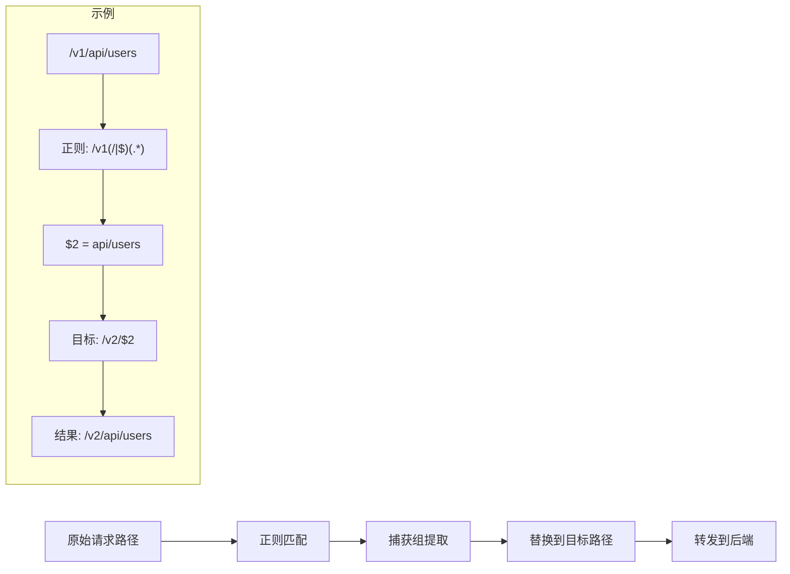
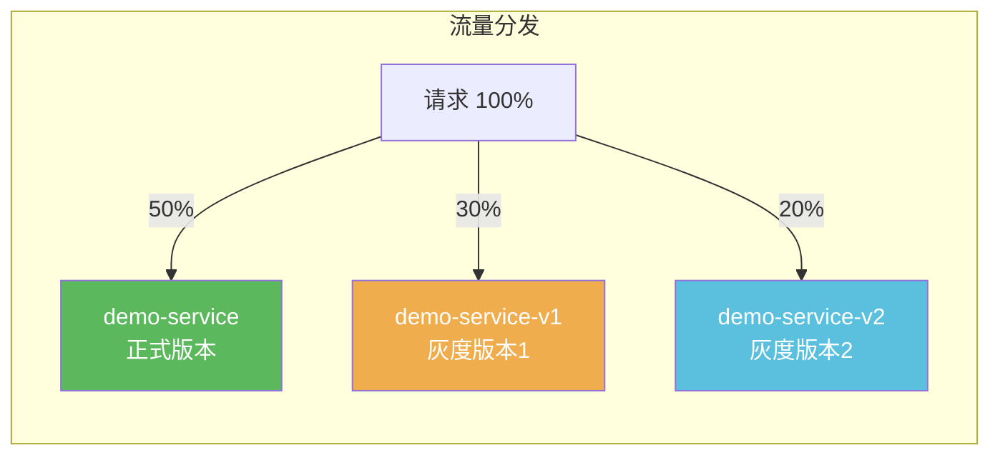
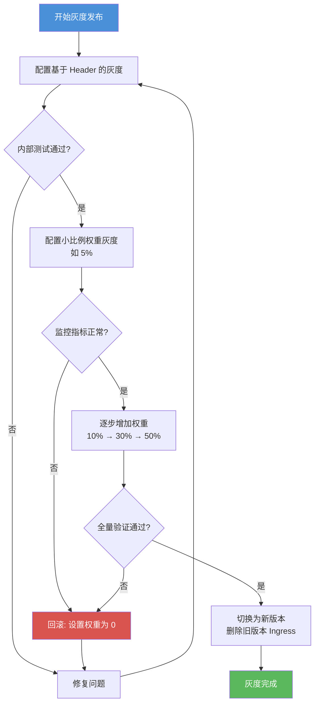

## 概述

在微服务架构中，API 网关的流量控制能力至关重要。Higress 提供了丰富的 Ingress Annotation 配置，可以精确控制请求的超时行为、转发路径和负载均衡策略。本文将详细介绍：

1. **超时配置**：如何设置请求处理的总延迟时间
2. **路径重写**：如何在请求转发到后端服务前修改请求路径
3. **负载均衡**：如何配置后端服务的负载均衡算法和权重分配

## 超时配置

### 基本说明

Higress 提供路由级别的超时设置，通过 `higress.io/timeout` 注解实现。与 Nginx Ingress 不同，Higress 没有区分连接/读写超时，而是面向接口处理总延时进行配置。

| 注解 | 作用域 | 说明 |
|------|--------|------|
| `higress.io/timeout` | Ingress | 请求的超时时间，单位为秒。默认未配置超时时间（无限等待） |

### 配置示例

#### 设置固定超时时间

以下配置将 `example.com/test` 路由的超时时间设置为 5 秒：

```yaml
apiVersion: networking.k8s.io/v1
kind: Ingress
metadata:
  annotations:
    higress.io/timeout: "5"
  name: demo-timeout
spec:
  ingressClassName: higress
  rules:
    - host: example.com
      http:
        paths:
          - backend:
              service:
                name: demo-service
                port:
                  number: 80
            path: /test
            pathType: Exact
```

**说明**：任何到达 `/test` 的请求，如果后端服务在 5 秒内未响应，Higress 将终止该请求并返回超时错误。

#### 全局超时配置

除了 Ingress 级别的超时配置，还可以通过 ConfigMap 配置全局的超时参数：

```yaml
apiVersion: v1
data:
  higress: |-
    downstream:
      idleTimeout: 180
    upstream:
      idleTimeout: 10
kind: ConfigMap
metadata:
  name: higress-config
  namespace: higress-system
```

**配置说明**：

| 字段 | 说明 | 默认值 |
|------|------|--------|
| `downstream.idleTimeout` | 下游连接空闲超时时间，单位秒 | 180 |
| `upstream.idleTimeout` | 上游连接空闲超时时间，单位秒 | 10 |

### 超时与重试的配合使用

超时配置通常与重试配置配合使用，以提升服务的容错能力：

```yaml
apiVersion: networking.k8s.io/v1
kind: Ingress
metadata:
  annotations:
    higress.io/timeout: "10"
    higress.io/proxy-next-upstream-tries: "2"
    higress.io/proxy-next-upstream-timeout: "5"
    higress.io/proxy-next-upstream: "http_502,http_503,timeout"
  name: demo-retry
spec:
  ingressClassName: higress
  rules:
    - host: example.com
      http:
        paths:
          - backend:
              service:
                name: demo-service
                port:
                  number: 80
            path: /api
            pathType: Prefix
```

**重试相关注解说明**：

| 注解 | 说明 |
|------|------|
| `higress.io/proxy-next-upstream-tries` | 请求的最大重试次数，默认 3 次 |
| `higress.io/proxy-next-upstream-timeout` | 请求重试的超时时间，单位秒 |
| `higress.io/proxy-next-upstream` | 重试条件：`error`、`timeout`、`http_xxx` 等 |

## 路径重写（Rewrite Path）

### 基本说明

Higress 通过 `higress.io/rewrite-target` 注解实现路径重写功能。在请求转发给后端服务之前，可以修改原始请求的路径。

| 注解 | 作用域 | 说明 |
|------|--------|------|
| `higress.io/rewrite-target` | Ingress | 将 Ingress 定义的原 path 重写为指定目标，支持捕获组（Capture Group） |
| `higress.io/upstream-vhost` | Ingress | 重写转发到后端服务时的 Host 头部 |

### 配置示例

#### 场景一：简单路径替换

将请求 `example.com/test` 重写为 `example.com/dev` 后转发：

```yaml
apiVersion: networking.k8s.io/v1
kind: Ingress
metadata:
  annotations:
    higress.io/rewrite-target: "/dev"
  name: demo-rewrite-simple
spec:
  ingressClassName: hieress
  rules:
    - host: example.com
      http:
        paths:
          - backend:
              service:
                name: demo-service
                port:
                  number: 80
            path: /test
            pathType: Exact
```

**效果**：
- 客户端请求：`GET http://example.com/test`
- 后端服务接收：`GET http://demo-service/dev`

#### 场景二：去除路径前缀

将请求 `example.com/v1/app` 去掉 `/v1` 前缀后转发：

```yaml
apiVersion: networking.k8s.io/v1
kind: Ingress
metadata:
  annotations:
    higress.io/rewrite-target: "/$2"
  name: demo-rewrite-strip
spec:
  ingressClassName: higress
  rules:
    - host: example.com
      http:
        paths:
          - backend:
              service:
                name: demo-service
                port:
                  number: 80
            path: /v1(/|$)(.*)
            pathType: ImplementationSpecific
```

**效果**：
- 客户端请求：`GET http://example.com/v1/app`
- 后端服务接收：`GET http://demo-service/app`

#### 场景三：替换路径前缀

将请求 `example.com/v1/app` 的 `/v1` 前缀替换为 `/v2`：

```yaml
apiVersion: networking.k8s.io/v1
kind: Ingress
metadata:
  annotations:
    higress.io/rewrite-target: "/v2/$2"
  name: demo-rewrite-replace
spec:
  ingressClassName: higress
  rules:
    - host: example.com
      http:
        paths:
          - backend:
              service:
                name: demo-service
                port:
                  number: 80
            path: /v1(/|$)(.*)
            pathType: ImplementationSpecific
```

**效果**：
- 客户端请求：`GET http://example.com/v1/app`
- 后端服务接收：`GET http://demo-service/v2/app`

#### 场景四：同时重写 Host

将请求的 Host 从 `example.com` 改为 `test.com`：

```yaml
apiVersion: networking.k8s.io/v1
kind: Ingress
metadata:
  annotations:
    higress.io/upstream-vhost: "test.com"
  name: demo-rewrite-host
spec:
  ingressClassName: higress
  rules:
    - host: example.com
      http:
        paths:
          - backend:
              service:
                name: demo-service
                port:
                  number: 80
            path: /test
            pathType: Exact
```

**效果**：
- 客户端请求：`GET http://example.com/test`
- 转发时 Host 头部：`test.com`

### 捕获组语法说明

路径重写支持正则表达式捕获组，使用 `$1`、`$2` 等引用捕获的内容：



| 原始路径 | 正则表达式 | 重写目标 | 结果路径 |
|----------|------------|----------|----------|
| `/v1/app` | `/v1(/|$)(.*)` | `/$2` | `/app` |
| `/v1/app` | `/v1(/|$)(.*)` | `/v2/$2` | `/v2/app` |
| `/api/v1/users` | `/api/(.*)` | `/internal/$1` | `/internal/v1/users` |

## 负载均衡配置

负载均衡决定了网关在转发请求至后端服务时如何选择节点。Higress 支持多种负载均衡算法，并提供了基于权重的流量切分能力。

### 基本说明

| 注解 | 作用域 | 说明 |
|------|--------|------|
| `higress.io/load-balance` | 服务 | 后端服务的普通负载均衡算法，默认 `round_robin` |
| `higress.io/upstream-hash-by` | 服务 | 基于一致性 Hash 的负载均衡算法 |

### 普通负载均衡算法

Higress 支持以下三种普通负载均衡算法：

| 算法 | 说明 | 适用场景 |
|------|------|----------|
| `round_robin` | 基于轮询的负载均衡（默认） | 后端节点性能相近 |
| `least_conn` | 基于最小请求数的负载均衡 | 请求处理时间差异较大 |
| `random` | 基于随机的负载均衡 | 简单场景，快速分发 |

#### 配置示例

```yaml
apiVersion: networking.k8s.io/v1
kind: Ingress
metadata:
  annotations:
    higress.io/load-balance: "least_conn"
  name: demo-lb
spec:
  ingressClassName: higress
  rules:
    - host: example.com
      http:
        paths:
          - backend:
              service:
                name: demo-service
                port:
                  number: 80
            path: /api
            pathType: Prefix
```

### 一致性 Hash 负载均衡

一致性 Hash 负载均衡具备请求亲和性，具有相同特征的请求会始终路由到相同的后端节点。适用于会话保持、缓存命中等场景。

#### 支持的 Hash Key 类型

| 类型 | 配置值 | 说明 |
|------|--------|------|
| 请求 URI | `$request_uri` | 请求的完整 Path（含路径参数）作为 Hash Key |
| 请求 Host | `$host` | 请求的 Host 作为 Hash Key |
| 客户端 IP | `$remote_addr` | 请求的客户端 IP 作为 Hash Key |
| 请求 Header | `$http_headerName` | 指定请求 Header 的值作为 Hash Key |
| 路径参数 | `$arg_varName` | 指定 URL 参数的值作为 Hash Key |

#### 配置示例

**场景一：基于客户端 IP 的会话保持**

```yaml
apiVersion: networking.k8s.io/v1
kind: Ingress
metadata:
  annotations:
    higress.io/upstream-hash-by: "$remote_addr"
  name: demo-hash-ip
spec:
  ingressClassName: higress
  rules:
    - host: example.com
      http:
        paths:
          - backend:
              service:
                name: demo-service
                port:
                  number: 80
            path: /api
            pathType: Prefix
```

**场景二：基于请求 Header 的路由**

```yaml
apiVersion: networking.k8s.io/v1
kind: Ingress
metadata:
  annotations:
    # 基于请求头 x-user-id 的值进行 Hash
    higress.io/upstream-hash-by: "$http_x-user-id"
  name: demo-hash-header
spec:
  ingressClassName: higress
  rules:
    - host: example.com
      http:
        paths:
          - backend:
              service:
                name: demo-service
                port:
                  number: 80
            path: /api
            pathType: Prefix
```

**场景三：基于 URL 参数的路由**

```yaml
apiVersion: networking.k8s.io/v1
kind: Ingress
metadata:
  annotations:
    # 基于路径参数 session_id 的值进行 Hash
    higress.io/upstream-hash-by: "$arg_session_id"
  name: demo-hash-param
spec:
  ingressClassName: higress
  rules:
    - host: example.com
      http:
        paths:
          - backend:
              service:
                name: demo-service
                port:
                  number: 80
            path: /api
            pathType: Prefix
```

### Cookie 亲和性（会话保持）

通过 Cookie 实现会话保持，相同 Cookie 的请求会被路由到相同的后端节点：

```yaml
apiVersion: networking.k8s.io/v1
kind: Ingress
metadata:
  annotations:
    higress.io/affinity: "cookie"
    higress.io/session-cookie-name: "SERVERID"
    higress.io/session-cookie-max-age: "3600"
  name: demo-cookie-affinity
spec:
  ingressClassName: higress
  rules:
    - host: example.com
      http:
        paths:
          - backend:
              service:
                name: demo-service
                port:
                  number: 80
            path: /api
            pathType: Prefix
```

**Cookie 亲和性相关注解**：

| 注解 | 说明 | 默认值 |
|------|------|--------|
| `higress.io/affinity` | 亲和性类型，目前只支持 `cookie` | `cookie` |
| `higress.io/session-cookie-name` | 用于 Hash 的 Cookie 名称 | `INGRESSCOOKIE` |
| `higress.io/session-cookie-path` | Cookie 的 Path 属性 | `/` |
| `higress.io/session-cookie-max-age` | Cookie 过期时间（秒） | Session 级别 |

## 灰度发布与权重配置

Higress 支持基于权重的流量切分，实现灰度发布和金丝雀部署。

### 基本说明

| 注解 | 作用域 | 说明 |
|------|--------|------|
| `higress.io/canary` | Ingress | 开启灰度发布，值为 `true` |
| `higress.io/canary-weight` | Ingress | 流量权重百分比（0-100） |
| `higress.io/canary-weight-total` | Ingress | 权重总和，默认 100 |
| `higress.io/canary-by-header` | Ingress | 基于请求 Header 的流量切分 |
| `higress.io/canary-by-header-value` | Ingress | Header 值匹配 |
| `higress.io/canary-by-cookie` | Ingress | 基于请求 Cookie 的流量切分 |

### 基于权重的灰度发布



#### 配置示例：三版本权重分配

**正式服务（50% 流量）**：

```yaml
apiVersion: networking.k8s.io/v1
kind: Ingress
metadata:
  name: demo-stable
spec:
  ingressClassName: higress
  rules:
    - http:
        paths:
          - backend:
              service:
                name: demo-service
                port:
                  number: 80
            path: /api
            pathType: Prefix
```

**灰度版本 1（30% 流量）**：

```yaml
apiVersion: networking.k8s.io/v1
kind: Ingress
metadata:
  annotations:
    higress.io/canary: "true"
    higress.io/canary-weight: "30"
  name: demo-canary-v1
spec:
  ingressClassName: higress
  rules:
    - http:
        paths:
          - backend:
              service:
                name: demo-service-v1
                port:
                  number: 80
            path: /api
            pathType: Prefix
```

**灰度版本 2（20% 流量）**：

```yaml
apiVersion: networking.k8s.io/v1
kind: Ingress
metadata:
  annotations:
    higress.io/canary: "true"
    higress.io/canary-weight: "20"
  name: demo-canary-v2
spec:
  ingressClassName: higress
  rules:
    - http:
        paths:
          - backend:
              service:
                name: demo-service-v2
                port:
                  number: 80
            path: /api
            pathType: Prefix
```

### 基于 Header 的灰度发布

通过请求 Header 精确控制流量路由：

```yaml
# 灰度服务：请求 Header x-version=v1 时路由
apiVersion: networking.k8s.io/v1
kind: Ingress
metadata:
  annotations:
    higress.io/canary: "true"
    higress.io/canary-by-header: "x-version"
    higress.io/canary-by-header-value: "v1"
  name: demo-canary-header
spec:
  ingressClassName: higress
  rules:
    - http:
        paths:
          - backend:
              service:
                name: demo-service-v1
                port:
                  number: 80
            path: /api
            pathType: Prefix
```

### 灰度发布优先级

当多种灰度方式同时配置时，优先级为：

```
基于 Header > 基于 Cookie > 基于权重
```

### 灰度发布最佳实践



1. **内部测试阶段**：使用 Header 方式，仅对内部测试人员开放
2. **小流量验证**：设置 5-10% 权重，观察监控指标
3. **逐步放量**：确认稳定后逐步提升权重
4. **全量切换**：权重达到 100% 后，替换正式服务

## 综合示例

以下是一个结合超时配置、路径重写和负载均衡的完整示例：

```yaml
apiVersion: networking.k8s.io/v1
kind: Ingress
metadata:
  annotations:
    # 超时配置
    higress.io/timeout: "30"
    # 重试配置
    higress.io/proxy-next-upstream-tries: "3"
    higress.io/proxy-next-upstream-timeout: "10"
    higress.io/proxy-next-upstream: "http_502,http_503,timeout"
    # 路径重写
    higress.io/rewrite-target: "/api/v2/$2"
    # 负载均衡
    higress.io/load-balance: "least_conn"
    # 会话保持（基于 Cookie）
    higress.io/affinity: "cookie"
    higress.io/session-cookie-name: "SERVERID"
    # 请求头控制
    higress.io/request-header-control-add: |
      X-Forwarded-By higress
      X-Request-Source gateway
  name: comprehensive-demo
spec:
  ingressClassName: higress
  rules:
    - host: api.example.com
      http:
        paths:
          - backend:
              service:
                name: backend-service
                port:
                  number: 8080
            path: /v1(/|$)(.*)
            pathType: ImplementationSpecific
```

**配置效果**：

1. **路径重写**：`/v1/users` → `/api/v2/users`
2. **超时控制**：请求最长等待 30 秒
3. **自动重试**：502/503 错误或超时时最多重试 3 次
4. **负载均衡**：使用最小连接数算法
5. **会话保持**：基于 Cookie 实现会话保持
6. **请求头添加**：自动添加 `X-Forwarded-By` 和 `X-Request-Source` 头部

### 灰度发布完整示例

```yaml
# 正式服务配置
apiVersion: networking.k8s.io/v1
kind: Ingress
metadata:
  name: demo-stable
  annotations:
    higress.io/timeout: "30"
    higress.io/load-balance: "round_robin"
spec:
  ingressClassName: higress
  rules:
    - host: api.example.com
      http:
        paths:
          - backend:
              service:
                name: backend-service
                port:
                  number: 8080
            path: /api
            pathType: Prefix
---
# 灰度服务配置（10% 流量）
apiVersion: networking.k8s.io/v1
kind: Ingress
metadata:
  name: demo-canary
  annotations:
    higress.io/canary: "true"
    higress.io/canary-weight: "10"
    higress.io/timeout: "30"
    higress.io/load-balance: "least_conn"
spec:
  ingressClassName: higress
  rules:
    - host: api.example.com
      http:
        paths:
          - backend:
              service:
                name: backend-service-v2
                port:
                  number: 8080
            path: /api
            pathType: Prefix
```

## 最佳实践

### 超时配置建议

1. **根据业务特点设置超时时间**：
   - 快速接口：5-10 秒
   - 普通接口：30 秒
   - 长时间处理接口：60-300 秒

2. **超时时间应小于客户端超时**：避免客户端提前断开连接

3. **配合重试机制**：对于非幂等请求（POST、PATCH），谨慎开启重试

### 路径重写建议

1. **使用明确的路径匹配**：`Exact` 适合精确匹配，`Prefix` 适合前缀匹配，`ImplementationSpecific` 适合正则表达式

2. **避免过度复杂的正则**：复杂的正则表达式会影响性能

3. **测试验证**：部署前充分测试重写规则，确保符合预期

### 负载均衡建议

1. **算法选择建议**：

   | 场景 | 推荐算法 | 原因 |
   |------|----------|------|
   | 后端节点性能相近 | `round_robin` | 简单高效，均匀分布 |
   | 请求处理时间差异大 | `least_conn` | 避免单节点过载 |
   | 需要会话保持 | 一致性 Hash / Cookie | 相同请求路由到相同节点 |
   | 有状态服务 | Cookie 亲和性 | 保持会话一致性 |

2. **一致性 Hash 使用场景**：
   - 缓存服务：提高缓存命中率
   - 有状态服务：保持会话一致性
   - 分片服务：相同特征请求路由到相同分片

3. **健康检查配合**：确保负载均衡与健康检查配合使用，自动剔除不健康节点

### 灰度发布建议

1. **分阶段发布**：
   - 阶段 1：Header 方式内部测试（`canary-by-header`）
   - 阶段 2：5-10% 小流量验证
   - 阶段 3：30-50% 中等流量
   - 阶段 4：100% 全量切换

2. **监控告警**：
   - 配置错误率、延迟、QPS 等关键指标监控
   - 设置自动回滚阈值

3. **快速回滚**：
   - 保留旧版本 Ingress 配置
   - 将 `canary-weight` 设置为 `0` 即可立即回滚

## 常见问题

### Q1: 超时后返回什么状态码？

Higress 在请求超时后会返回 `504 Gateway Timeout` 状态码。

### Q2: 重写路径后，后端服务如何获取原始路径？

可以通过 `X-Envoy-Original-Path` 请求头获取原始路径。如果需要在全局关闭此头部：

```yaml
# ConfigMap 配置
higress: |-
  disableXEnvoyHeaders: true
```

### Q3: 如何实现条件性路径重写？

目前 Higress 的路径重写是基于 Ingress 级别的静态配置。如需条件性重写，可以创建多个 Ingress 规则配合不同的路径匹配条件。

### Q4: 负载均衡算法如何选择？

- **round_robin**：后端节点性能相近，请求处理时间均匀
- **least_conn**：请求处理时间差异较大，避免单节点过载
- **一致性 Hash**：需要会话保持或缓存命中

### Q5: 灰度发布时，多个灰度版本的权重如何分配？

多个灰度 Ingress 的权重是相对于总权重计算的。例如：
- 正式服务：无 `canary` 注解，接收剩余流量
- 灰度 v1：`canary-weight: 30`，接收 30%
- 灰度 v2：`canary-weight: 20`，接收 20%
- 正式服务自动接收剩余 50%

### Q6: 一致性 Hash 和 Cookie 亲和性有什么区别？

| 特性 | 一致性 Hash | Cookie 亲和性 |
|------|-------------|---------------|
| 控制粒度 | 基于 Hash Key 值 | 基于 Cookie 存在与否 |
| 客户端支持 | 无需客户端支持 | 需要客户端支持 Cookie |
| 灵活性 | 可基于任意特征 | 只能基于 Cookie |
| 节点变更影响 | 部分请求重新分配 | Cookie 绑定的请求可能丢失 |

### Q7: 如何快速回滚灰度发布？

将灰度 Ingress 的 `canary-weight` 设置为 `0`，或删除灰度 Ingress 资源即可立即回滚：

```bash
# 方式一：设置权重为 0
kubectl annotate ingress demo-canary higress.io/canary-weight="0" --overwrite

# 方式二：删除灰度 Ingress
kubectl delete ingress demo-canary
```

## 相关文档

- [Higress Ingress Annotation 兼容说明](https://higress.cn/docs/latest/user/annotation/)
- [通过 Ingress Annotation 实现高阶流量治理](https://higress.cn/docs/latest/user/annotation-use-case/)
- [全局配置说明](https://higress.cn/docs/latest/user/configmap/)
