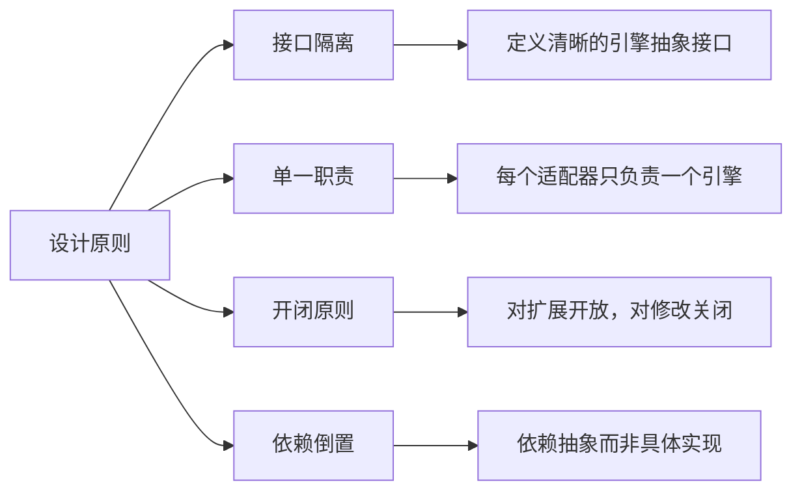
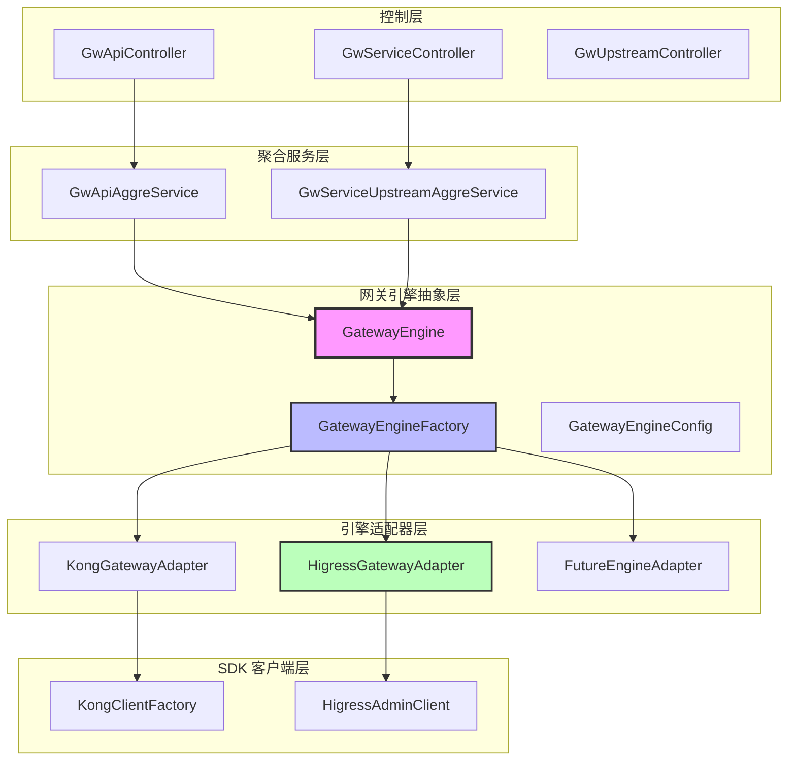
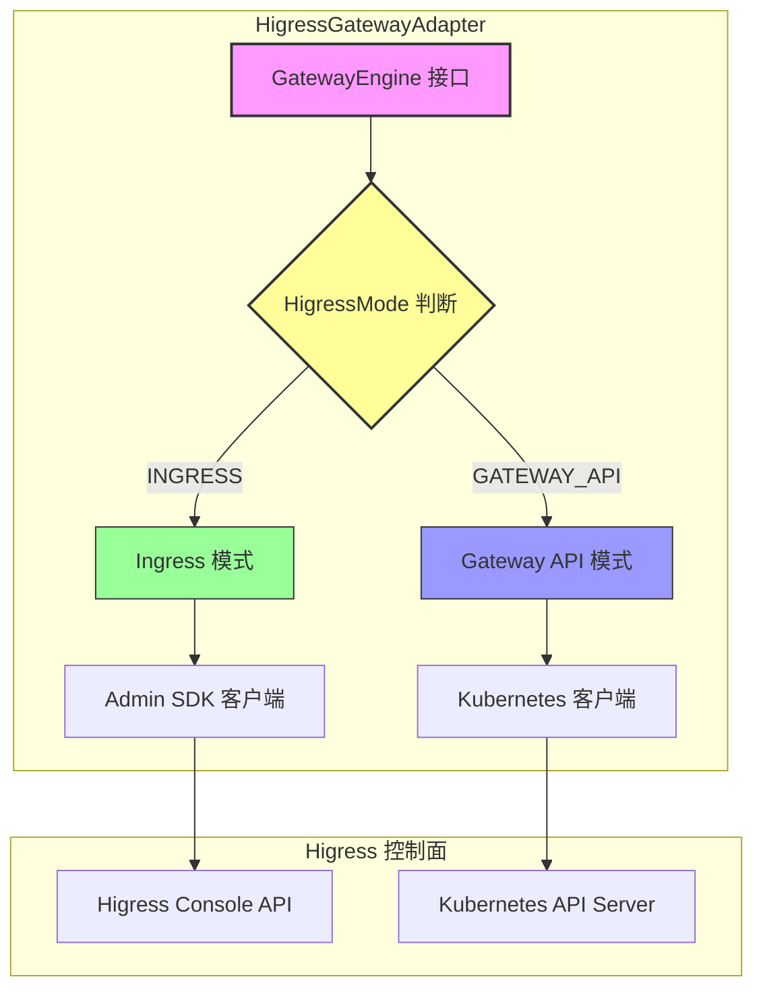
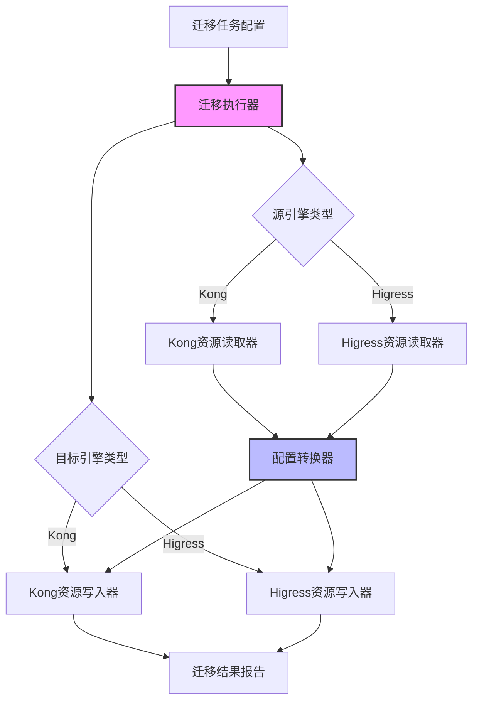

本文档详细说明如何实现 Higress 网关引擎与现有控制面的整合设计方案。通过低耦合的架构设计，我们实现了多引擎统一管理、最小化改动、运行时切换和良好的可扩展性。

## 1. 背景与设计目标

### 1.1 现有架构痛点

在当前网关控制面架构中，Kong 网关代码直接耦合在业务层，导致以下问题：

- **扩展困难**：新增网关引擎需要大量修改业务层代码
- **配置分散**：网关配置管理散落在多处，难以统一
- **工厂割裂**：客户端工厂各自独立，缺乏统一管理机制

### 1.2 设计目标

本方案旨在实现以下核心目标：

1. **多引擎统一管理**：支持 Kong 和 Higress 两种网关引擎的统一资源管理
2. **最小化改动**：保持现有 Kong 代码不变，通过适配器模式实现引擎扩展
3. **运行时切换**：支持根据配置动态选择目标网关引擎
4. **可扩展性**：为未来引入 APISIX、Envoy 等其他网关引擎预留扩展空间

### 1.3 设计原则

## 2. 核心架构设计

### 2.1 整体架构

本方案采用分层架构设计，从上到下依次为：控制层、聚合服务层、网关引擎抽象层、引擎适配器层和 SDK 客户端层。

### 2.2 分层职责

| 层级 | 职责 | 说明 |
|------|------|------|
| 控制层 | 接收 HTTP 请求，参数验证 | GwApiController 等 |
| 聚合服务层 | 业务逻辑编排，事务管理 | GwApiAggreService 等 |
| 网关引擎抽象层 | 定义统一接口，引擎管理 | GatewayEngine, GatewayEngineFactory |
| 引擎适配器层 | 实现特定引擎的适配逻辑 | KongGatewayAdapter, HigressGatewayAdapter |
| SDK 客户端层 | 封装第三方 SDK 调用 | KongClientFactory, HigressAdminClient |

## 3. 核心组件设计

### 3.1 网关引擎抽象接口

GatewayEngine 接口定义了所有网关引擎必须实现的统一操作接口，屏蔽不同引擎的实现差异。接口支持幂等性操作，确保重复调用不会产生副作用。

**核心方法分类**：

| 方法分类 | 核心方法 | 幂等性保证 |
|----------|----------|------------|
| 路由管理 | createRoute、updateRoute、deleteRoute、getRoute | 支持幂等键，重复调用不重复创建 |
| 服务管理 | createService、updateService、deleteService | 幂等操作，结果一致 |
| Upstream 管理 | createUpstream、updateUpstream、deleteUpstream | 幂等操作，结果一致 |
| 插件管理 | attachPlugin、detachPlugin、updatePlugin | 支持幂等键 |

### 3.2 网关引擎类型枚举

| 引擎类型 | 代码 | 说明 |
|----------|------|------|
| KONG | kong | Kong 网关引擎 |
| HIGRESS | higress | Higress 网关引擎 |
| APISIX | apisix | APISIX 网关引擎（预留） |
| ENVOY | envoy | Envoy 网关引擎（预留） |

### 3.3 网关引擎工厂

GatewayEngineFactory 负责根据集群配置从数据库动态创建对应的网关引擎实例，支持运行时动态切换引擎。

**缓存策略**：

- 使用 Caffeine LoadingCache 实现自动缓存管理
- 最大缓存数量：100 个集群
- 写入后过期时间：1 小时
- 写入后刷新时间：5 分钟（异步刷新，不阻塞请求）

**配置热更新机制**：

- 监听集群配置变更事件，自动刷新受影响的引擎缓存
- 提供手动刷新 API，支持运维人员主动刷新
- 支持批量刷新所有缓存

## 4. 适配器实现设计

### 4.1 Kong 网关适配器

KongGatewayAdapter 负责将 GatewayEngine 接口适配到 Kong Admin API，复用现有的 KongClientFactory 和相关 API 类。

**核心功能**：

- 实现路由、服务的增删改查操作
- 支持幂等性保证，通过标签存储幂等键
- 复用现有 Kong 客户端工厂

### 4.2 Higress 网关适配器（支持双模式）

HigressGatewayAdapter 同时支持两种 Higress 部署模式，提供灵活的配置选择。

#### 4.2.1 Higress Kubernetes 客户端池

使用 Caffeine Cache 自动管理 KubernetesClient 实例的生命周期，避免资源泄漏。

**缓存策略**：

- 最大缓存数量：100 个配置
- 访问后过期时间：30 分钟（自动清理未使用的客户端）
- 自动关闭：客户端移除时自动调用 close() 释放资源

#### 4.2.2 双模式架构

#### 4.2.3 部署模式说明

| 模式 | 使用场景 | 配置要求 |
|------|----------|----------|
| **Ingress 模式** | 传统 Higress 部署 | 配置 control plane URL 和认证 token |
| **Gateway API 模式** | Kubernetes 原生部署 | 配置 Kubernetes kubeconfig 和命名空间 |

#### 4.2.4 Gateway API 性能优化策略

**1. 本地缓存**

- 使用 Caffeine 缓存 HTTPRoute 资源，减少 K8s API 调用
- 缓存配置：最大 1000 条记录，5 分钟过期
- 写入后自动失效，确保数据一致性

**2. Watch API 监听**

- 启动 Watch 监听命名空间内的 HTTPRoute 变化
- 资源变化时自动刷新本地缓存
- 无需轮询，实时感知资源变更

**3. 批量操作优化**

- 列表查询使用 List API 而非多次 Get
- 支持按标签选择器批量获取资源

## 5. 统一数据模型设计

### 5.1 通用路由配置模型

RouteConfig 屏蔽不同网关引擎的路由配置差异，提供统一的配置接口。

| 字段 | 类型 | 说明 |
|------|------|------|
| name | String | 路由名称 |
| paths | List\<String\> | 路由路径列表（支持多路径） |
| methods | List\<String\> | HTTP 方法列表 |
| hosts | List\<String\> | 主机名/域名列表 |
| service | ServiceConfig | 关联的服务配置 |
| priority | Integer | 路由优先级（数值越大优先级越高） |
| enabled | Boolean | 是否启用 |
| tags | Map\<String, String\> | 标签（用于路由分组和筛选） |
| pathMatchType | Enum | 路径匹配类型（PREFIX/EXACT/REGEX） |

### 5.2 通用服务配置模型

ServiceConfig 定义后端服务的配置信息，包括连接地址、超时设置、重试策略等。

| 字段 | 类型 | 默认值 | 说明 |
|------|------|--------|------|
| name | String | - | 服务名称 |
| host | String | - | 后端主机名或 IP 地址 |
| port | Integer | - | 后端端口号 |
| protocol | String | http | 协议类型（http, https, tcp, tls） |
| path | String | / | 服务路径前缀 |
| connectTimeout | Long | 60000 | 连接超时时间（毫秒） |
| readTimeout | Long | 60000 | 读取超时时间（毫秒） |
| writeTimeout | Long | 60000 | 写入超时时间（毫秒） |
| retries | Integer | 5 | 重试次数 |
| enabled | Boolean | true | 是否启用 |

### 5.3 通用 Upstream 配置模型

UpstreamConfig 定义上游服务集群的配置，包括负载均衡策略、健康检查等。

**负载均衡算法**：

| 算法 | 说明 |
|------|------|
| ROUND_ROBIN | 轮询 |
| LEAST_CONNECTIONS | 最少连接 |
| IP_HASH | IP 哈希 |
| HASH | 通用哈希 |
| CONSISTENT_HASH | 一致性哈希 |

### 5.4 通用插件配置模型

PluginConfig 定义网关插件的配置信息，支持不同引擎的插件映射。

**插件作用域**：

| 作用域 | 说明 |
|--------|------|
| GLOBAL | 全局作用域 |
| ROUTE | 路由作用域 |
| SERVICE | 服务作用域 |
| CONSUMER | 消费者作用域 |

## 6. 数据库表设计

### 6.1 扩展现有集群表

复用现有 `gw_cluster_base` 表，通过扩展字段支持多引擎架构。

**数据示例**：

| cluster_code | cluster_name | gateway_engine_type | gateway_deploy_mode | cluster_cp_url | gateway_namespace | env_code |
|-------------|-------------|---------------------|---------------------|----------------|-------------------|----------|
| cluster-prod-kong-01 | 生产环境 Kong 集群01 | kong | NULL | http://kong-admin-01:8001 | NULL | prod |
| cluster-prod-higress-01 | 生产环境 Higress 集群01（Ingress模式） | higress | ingress | http://higress-control-01:8080 | default | prod |
| cluster-prod-higress-02 | 生产环境 Higress 集群02（Gateway API模式） | higress | gateway_api | NULL | default | prod |
| cluster-test-kong-01 | 测试环境 Kong 集群01 | kong | NULL | http://kong-admin-test:8001 | NULL | test |

**配置说明**：

- **Kong 集群**：只需配置 `cluster_cp_url` 和 `gateway_auth_token`
- **Higress Ingress 模式**：配置 `cluster_cp_url`、`gateway_auth_token`、`gateway_namespace`
- **Higress Gateway API 模式**：配置 `gateway_kube_config`（Kubernetes YAML 配置）和 `gateway_namespace`

### 6.2 插件映射表

表名：`gw_plugin_mapping`

**用途**：存储不同引擎间插件的映射关系

**插件映射示例**：

| 通用名称 | 显示名称 | Kong | Higress | 分类 |
|---------|---------|------|---------|------|
| rate_limiting | 速率限制 | rate-limiting | request-limit | traffic |
| ip_restriction | IP 限制 | ip-restriction | ip-restriction | security |
| cors | 跨域配置 | cors | cors | traffic |
| jwt_auth | JWT 认证 | jwt | jwt-auth | security |

## 7. 迁移工具设计

### 7.1 迁移工具架构

### 7.2 迁移执行器

GatewayMigrationExecutor 负责执行从一个网关引擎到另一个网关引擎的资源迁移任务。

**核心功能**：

- 支持批量迁移和增量迁移
- 异步执行迁移任务
- 实时查询迁移状态
- 支持取消正在执行的迁移任务

**迁移配置**：

| 配置项 | 说明 | 默认值 |
|--------|------|--------|
| sourceEngineType | 源引擎类型 | - |
| targetEngineType | 目标引擎类型 | - |
| includeRoutes | 是否包含路由 | true |
| includeServices | 是否包含服务 | true |
| includeUpstreams | 是否包含 Upstream | true |
| includePlugins | 是否包含插件 | true |
| batchSize | 批量大小 | 100 |
| concurrency | 并发度 | 5 |

## 8. 性能优化建议

### 8.1 客户端连接池优化

- 连接池大小：50
- 连接超时：5 秒
- 读取超时：30 秒
- 最大空闲连接：20
- 保活时间：5 分钟

### 8.2 缓存策略

**引擎配置缓存**：

- 最大容量：1000 条记录
- 过期时间：写入后 10 分钟自动过期
- 实时更新：配置变更时主动刷新缓存

### 8.3 批量操作优化

- 批量大小：100 条/批
- 并发度：5 个并行任务
- 使用异步 Future 等待所有任务完成

## 9. 风险与应对

### 9.1 技术风险

| 风险 | 概率 | 影响 | 应对措施 |
|------|------|------|----------|
| higress-admin-sdk 功能不完整 | 中 | 高 | 提前验证 SDK 功能，必要时直接调用 HTTP API |
| Kong 与 Higress 差异过大 | 低 | 中 | 优先实现核心功能，非核心功能按需支持 |
| 性能影响 | 低 | 中 | 进行性能测试，优化调用链路 |

### 9.2 业务风险

| 风险 | 概率 | 影响 | 应对措施 |
|------|------|------|----------|
| 现有功能回归 | 中 | 高 | 完善回归测试，灰度发布 |
| 配置迁移复杂度 | 中 | 中 | 提供配置迁移工具和文档 |

## 10. 总结

本设计方案通过适配器模式实现了 Higress 网关引擎与现有控制面的整合，具有以下优势：

1. **低耦合架构**：网关引擎抽象层与具体引擎实现解耦，便于扩展和维护
2. **灵活的模式支持**：Higress 支持 Ingress 和 Gateway API 两种部署模式，适应不同场景
3. **高效的缓存策略**：使用 Caffeine Cache 管理客户端和配置缓存，提升系统性能
4. **平滑的迁移方案**：提供完整的迁移工具，支持 Kong 到 Higress 的平滑迁移

未来可进一步扩展支持 APISIX、Envoy 等其他网关引擎，构建更加完善的多引擎网关管理平台。

## 参考资料

- [Higress Console GitHub](https://github.com/higress-group/higress-console)
- [Higress Admin SDK Demo](https://github.com/wssaidong/higress-admin-sdk-demo)
- [Higress 官方文档](https://higress.io/docs)
