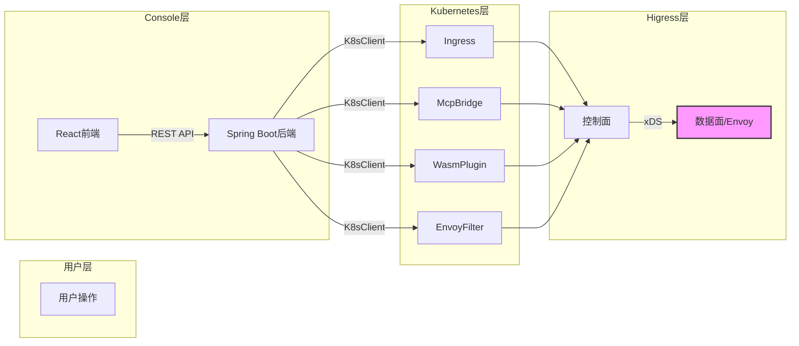
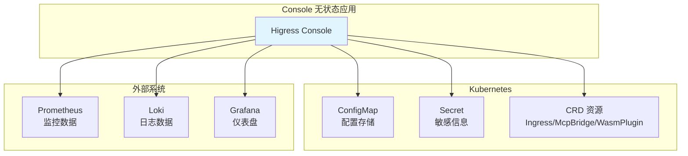
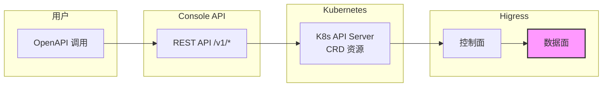
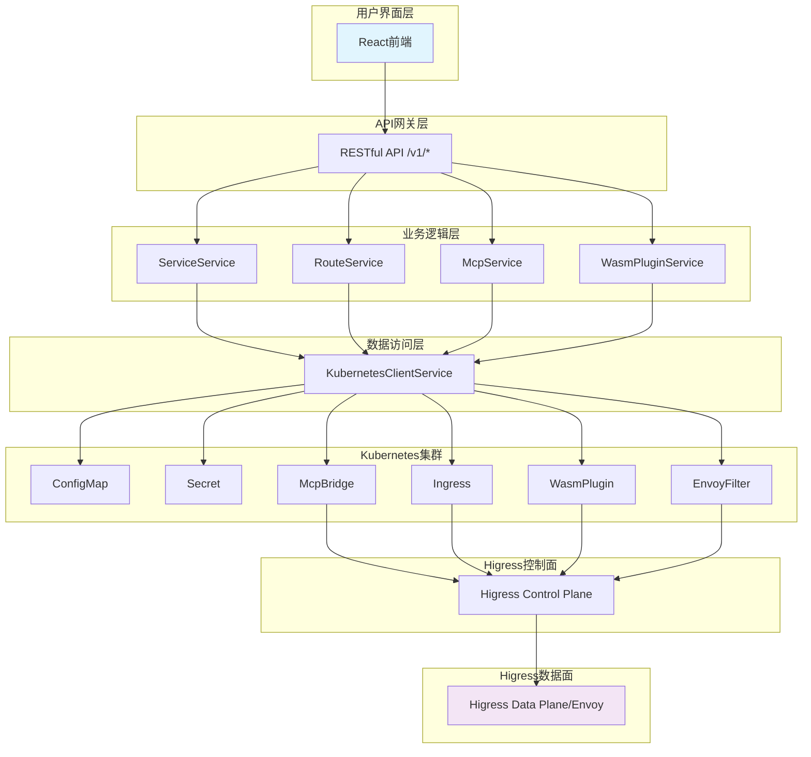

## 控制架构概述

```
用户 → Console 前端 → Console API → Kubernetes API → Higress 控制面 → 数据面
```

**核心机制**：Console 不直接控制数据面，而是通过 **Kubernetes CRDs** 作为配置中心，采用声明式配置管理。

## 控制流程



## 关键 CRD 资源

| CRD 类型 | 作用 | 代码位置 |
|---------|------|---------|
| **Ingress** | 路由规则、域名映射 | `RouteService` |
| **McpBridge** | 服务发现（Nacos/DNS等） | `McpBridgeService` |
| **WasmPlugin** | 插件实例管理 | `WasmPluginService` |
| **EnvoyFilter** | 深度定制 Envoy 行为 | `EnvoyFilterService` |

## RESTful API 结构

所有 API 都以 `/v1/` 为前缀：

- **`/v1/services`** - 服务管理
- **`/v1/routes`** - 路由管理
- **`/v1/domains`** - 域名管理
- **`/v1/consumers`** - 消费者管理
- **`/v1/wasm-plugins`** - WASM 插件管理
- **`/v1/tls-certificates`** - TLS 证书管理

## 核心服务代码位置

### KubernetesClientService
```
backend/console/service/src/main/java/io/higress/console/console/service/kubernetes/
```
- 核心 K8s 客户端，所有资源 CRUD 都通过它
- 负责集群连接和认证

### RouteService
```
backend/console/service/src/main/java/io/higress/console/console/service/route/
```
- 将 Route 模型转换为 Ingress 资源
- 处理路由规则和认证配置

### ServiceService
```
backend/console/service/src/main/java/io/higress/console/console/service/
```
- 服务发现和管理
- 从 RegistryzService 和 IstioEndpoint 获取服务信息

---

## 核心代码实现

### 1. KubernetesClientService - K8s 客户端核心

**文件位置**: `backend/sdk/src/main/java/com/alibaba/higress/sdk/service/kubernetes/KubernetesClientService.java`

**依赖包**: `io.kubernetes.client:kubernetes-client-java:17.0.0`

```xml
<!-- pom.xml -->
<k8s-client.version>17.0.0</k8s-client.version>
```

```java
// 核心 import
import io.kubernetes.client.openapi.ApiClient;
import io.kubernetes.client.openapi.ApiException;
import io.kubernetes.client.openapi.apis.CoreV1Api;
import io.kubernetes.client.openapi.apis.CustomObjectsApi;
import io.kubernetes.client.openapi.apis.NetworkingV1Api;
import io.kubernetes.client.util.ClientBuilder;
import io.kubernetes.client.util.KubeConfig;
```

#### 客户端初始化

```java
public KubernetesClientService(HigressServiceConfig config) throws IOException {
    validateConfig(config);

    // 集群内模式或 kubeconfig 模式
    if (inClusterMode) {
        client = ClientBuilder.cluster().build();
        log.info("init KubernetesClientService with InCluster mode");
    } else {
        if (Strings.isNullOrEmpty(kubeConfigContent)) {
            String kubeConfigPath = !Strings.isNullOrEmpty(kubeConfig) ? kubeConfig : KUBE_CONFIG_DEFAULT_PATH;
            try (FileReader reader = new FileReader(kubeConfigPath)) {
                client = ClientBuilder.kubeconfig(KubeConfig.loadKubeConfig(reader)).build();
            }
        } else {
            try (StringReader reader = new StringReader(kubeConfigContent)) {
                client = ClientBuilder.kubeconfig(KubeConfig.loadKubeConfig(reader)).build();
            }
        }
    }

    initializeK8sCapabilities();
}
```

#### Ingress 操作

```java
// 创建 Ingress
public V1Ingress createIngress(V1Ingress ingress) throws ApiException {
    renderDefaultMetadata(ingress);
    fillDefaultIngressClass(ingress);
    NetworkingV1Api apiInstance = new NetworkingV1Api(client);
    return apiInstance.createNamespacedIngress(controllerNamespace, ingress, null, null, null, null);
}

// 更新 Ingress
public V1Ingress replaceIngress(V1Ingress ingress) throws ApiException {
    V1ObjectMeta metadata = ingress.getMetadata();
    if (metadata == null) {
        throw new IllegalArgumentException("Ingress doesn't have a valid metadata.");
    }
    renderDefaultMetadata(ingress);
    NetworkingV1Api apiInstance = new NetworkingV1Api(client);
    return apiInstance.replaceNamespacedIngress(controllerNamespace, metadata.getName(), ingress, null);
}

// 查询所有 Ingress
public List<V1Ingress> listAllIngresses() throws ApiException {
    List<V1Ingress> ingresses = new ArrayList<>();
    NetworkingV1Api apiInstance = new NetworkingV1Api(client);

    if (StringUtils.isEmpty(controllerWatchedNamespace)) {
        V1IngressList list = apiInstance.listIngressForAllNamespaces(null, null, null, null, null, null, null, null, null, null);
        ingresses.addAll(list.getItems());
    } else {
        for (String ns : Lists.newArrayList(controllerNamespace, controllerWatchedNamespace)) {
            V1IngressList list = apiInstance.listNamespacedIngress(ns, null, null, null, null, null, null, null, null, null, null);
            if (list != null) {
                ingresses.addAll(list.getItems());
            }
        }
    }

    retainWatchedIngress(ingresses);
    return sortKubernetesObjects(ingresses);
}
```

#### McpBridge 操作

```java
public V1McpBridge createMcpBridge(V1McpBridge mcpBridge) throws ApiException {
    renderDefaultMetadata(mcpBridge);
    CustomObjectsApi customObjectsApi = new CustomObjectsApi(client);
    Object response = customObjectsApi.createNamespacedCustomObject(
        V1McpBridge.API_GROUP, V1McpBridge.VERSION,
        controllerNamespace, V1McpBridge.PLURAL, mcpBridge, null, null, null);
    return client.getJSON().deserialize(client.getJSON().serialize(response), V1McpBridge.class);
}
```

---

### 2. KubernetesModelConverter - Route 转 Ingress

**文件位置**: `backend/sdk/src/main/java/com/alibaba/higress/sdk/service/kubernetes/KubernetesModelConverter.java`

#### 核心转换方法

```java
public V1Ingress route2Ingress(Route route) {
    V1Ingress ingress = new V1Ingress();
    ingress.setMetadata(new V1ObjectMeta());
    ingress.setSpec(new V1IngressSpec());

    fillIngressMetadata(ingress, route);
    fillIngressSpec(ingress, route);
    fillIngressCors(ingress, route);
    fillIngressAnnotations(ingress, route);
    fillIngressLabels(ingress, route);

    return ingress;
}

public Route ingress2Route(V1Ingress ingress) {
    Route route = new Route();
    fillRouteMetadata(route, ingress.getMetadata());
    fillRouteInfo(route, ingress.getMetadata(), ingress.getSpec());
    fillCustomConfigs(route, ingress.getMetadata());
    fillCustomLabels(route, ingress.getMetadata());
    route.setReadonly(!kubernetesClientService.isDefinedByConsole(ingress) || !isIngressSupported(ingress));
    return route;
}
```

#### Metadata 填充逻辑

```java
private void fillIngressMetadata(V1Ingress ingress, Route route) {
    V1ObjectMeta metadata = Objects.requireNonNull(ingress.getMetadata());
    metadata.setName(route.getName());
    metadata.setResourceVersion(route.getVersion());

    // 处理域名标签
    List<String> domains = route.getDomains();
    if (CollectionUtils.isEmpty(domains)) {
        domains = Collections.singletonList(HigressConstants.DEFAULT_DOMAIN);
    }
    for (String domain : domains) {
        setDomainLabel(metadata, domain);
    }

    // 处理URL参数
    if (CollectionUtils.isNotEmpty(route.getUrlParams())) {
        for (KeyedRoutePredicate query : route.getUrlParams()) {
            setQueryAnnotation(metadata, query);
        }
    }

    // 处理Header
    if (CollectionUtils.isNotEmpty(route.getHeaders())) {
        for (KeyedRoutePredicate header : route.getHeaders()) {
            setHeaderAnnotation(metadata, header);
        }
    }
}
```

#### Ingress Spec 填充逻辑

```java
private void fillIngressSpec(V1Ingress ingress, Route route) {
    V1ObjectMeta metadata = Objects.requireNonNull(ingress.getMetadata());
    V1IngressSpec spec = Objects.requireNonNull(ingress.getSpec());

    fillIngressTls(metadata, spec, route);
    fillIngressRules(metadata, spec, route);
    fillIngressDestination(metadata, route);
}

private static void fillIngressRules(V1ObjectMeta metadata, V1IngressSpec spec, Route route) {
    List<String> domains = route.getDomains();
    if (CollectionUtils.isEmpty(domains)) {
        domains = Collections.singletonList(null);
    }

    List<V1IngressRule> rules = domains.stream().map(d -> {
        V1IngressRule rule = new V1IngressRule();
        rule.setHost(d);
        V1HTTPIngressRuleValue httpRule = new V1HTTPIngressRuleValue();
        rule.setHttp(httpRule);

        RoutePredicate pathPredicate = route.getPath();
        if (pathPredicate != null) {
            fillHttpPathRule(metadata, httpRule, pathPredicate);
        }
        return rule;
    }).collect(Collectors.toList());

    spec.setRules(rules);
}

private static void fillHttpPathRule(V1ObjectMeta metadata, V1HTTPIngressRuleValue httpRule,
    RoutePredicate pathPredicate) {
    V1HTTPIngressPath httpPath = new V1HTTPIngressPath();
    httpRule.setPaths(Collections.singletonList(httpPath));

    httpPath.setPath(pathPredicate.getMatchValue());
    String matchType = pathPredicate.getMatchType();

    // 设置路径匹配类型
    if (RoutePredicateTypeEnum.EQUAL.toString().equals(matchType)) {
        httpPath.setPathType(KubernetesConstants.IngressPathType.EXACT);
    } else if (RoutePredicateTypeEnum.PRE.toString().equals(matchType)) {
        httpPath.setPathType(KubernetesConstants.IngressPathType.PREFIX);
    } else if (RoutePredicateTypeEnum.REGULAR.toString().equals(matchType)) {
        httpPath.setPathType(KubernetesConstants.IngressPathType.PREFIX);
        KubernetesUtil.setAnnotation(metadata, KubernetesConstants.Annotation.USE_REGEX_KEY,
            KubernetesConstants.Annotation.TRUE_VALUE);
    }

    httpPath.setBackend(DEFAULT_MCP_BRIDGE_BACKEND);
}
```

---

### 3. Controller 层 - API 端点实现

**文件位置**: `backend/console/src/main/java/com/alibaba/higress/console/controller/RoutesController.java`

```java
@RestController("RoutesController")
@RequestMapping("/v1/routes")
@Validated
@Tag(name = "Route APIs")
public class RoutesController {

    @Resource
    private RouteService routeService;

    @GetMapping
    @Operation(summary = "List routes")
    public ResponseEntity<PaginatedResponse<Route>> list(@ParameterObject RoutePageQuery query) {
        return ControllerUtil.buildResponseEntity(routeService.list(query));
    }

    @PostMapping
    @Operation(summary = "Add a new route")
    public ResponseEntity<Response<Route>> add(@RequestBody Route route) {
        if (StringUtils.isEmpty(route.getName())) {
            throw new ValidationException("Route name is required.");
        }
        if (route.getName().endsWith(HigressConstants.INTERNAL_RESOURCE_NAME_SUFFIX)) {
            throw new ValidationException("Adding an internal route is not allowed.");
        }
        route.validate();
        return ControllerUtil.buildResponseEntity(routeService.add(route));
    }

    @PutMapping("/{name}")
    @Operation(summary = "Update an existed route")
    public ResponseEntity<Response<Route>> update(@PathVariable("name") @NotBlank String routeName,
        @RequestBody Route route) {
        if (StringUtils.isEmpty(route.getName())) {
            route.setName(routeName);
        } else if (!StringUtils.equals(routeName, route.getName())) {
            throw new ValidationException("Route name in the URL doesn't match the one in the body.");
        }
        if (route.getName().endsWith(HigressConstants.INTERNAL_RESOURCE_NAME_SUFFIX)) {
            throw new ValidationException("Updating an internal route is not allowed.");
        }
        route.validate();
        return ControllerUtil.buildResponseEntity(routeService.update(route));
    }

    @DeleteMapping("/{name}")
    @Operation(summary = "Delete a route")
    public ResponseEntity<Response<Route>> delete(@PathVariable("name") @NotBlank String name) {
        if (name.endsWith(HigressConstants.INTERNAL_RESOURCE_NAME_SUFFIX)) {
            throw new ValidationException("Deleting an internal route is not allowed.");
        }
        routeService.delete(name);
        return ResponseEntity.noContent().build();
    }
}
```

---

### 4. 前端调用示例

**文件位置**: `frontend/src/services/api.ts`

```typescript
import axios from 'axios';

const request = axios.create({
  timeout: 5 * 1000,
  baseURL: process.env.ICE_CORE_MODE === "development" ? "/api" : "",
});

// 获取路由列表
export const getGatewayRoutes = (): Promise<RouteResponse> => {
  return request.get<any, RouteResponse>('/v1/routes');
};

// 创建路由
export const createGatewayRoute = (route: Route): Promise<Response<Route>> => {
  return request.post<any, Response<Route>>('/v1/routes', route);
};

// 更新路由
export const updateGatewayRoute = (name: string, route: Route): Promise<Response<Route>> => {
  return request.put<any, Response<Route>>(`/v1/routes/${name}`, route);
};

// 删除路由
export const deleteGatewayRoute = (name: string): Promise<void> => {
  return request.delete(`/v1/routes/${name}`);
};
```

---

## 数据传递链路

1. **用户操作** → 前端调用 `/v1/routes` 等 API
2. **Controller** → 接收请求，调用 Service
3. **Service** → 调用 `KubernetesClientService`
4. **K8sClient** → 通过 K8s API 创建/更新 CRD 资源
5. **Higress Controller** → Watch CRD 变化，生成 xDS 配置
6. **数据面** → 通过 xDS 协议接收配置，更新 Envoy

## 配置存储

| 存储类型 | 用途 |
|---------|------|
| **ConfigMap** | 存储控制台配置 |
| **Secrets** | 存储敏感信息（TLS 证书、密钥等） |
| **CRD 资源** | 声明式配置存储 |

---

## 数据存储架构

### 无状态设计

**Higress Console 不使用传统的关系型数据库**，是一个云原生无状态应用。



### 存储方式对照

| 数据类型 | 存储方式 | 说明 |
|---------|---------|------|
| **配置数据** | Kubernetes ConfigMap | 通过 `ConfigServiceImpl` 读写 |
| **敏感信息** | Kubernetes Secret | TLS 证书、密钥等 |
| **路由/服务** | Kubernetes CRD | Ingress, McpBridge, WasmPlugin, EnvoyFilter |
| **监控数据** | Prometheus (外部) | 时序指标数据 |
| **日志数据** | Loki (外部) | 日志聚合和查询 |
| **仪表盘** | Grafana (外部) | 可视化面板 |

### ConfigServiceImpl 实现

**文件位置**: `backend/console/src/main/java/com/alibaba/higress/console/service/ConfigServiceImpl.java`

```java
// 配置存储在 ConfigMap 中
public void putConfig(String key, String value) {
    V1ConfigMap configMap = kubernetesClientService.getConfigMap(CONFIG_MAP_NAME);
    if (configMap == null) {
        configMap = new V1ConfigMap();
        V1ObjectMeta metadata = new V1ObjectMeta();
        metadata.setName(CONFIG_MAP_NAME);
        metadata.setNamespace(controllerNamespace);
        configMap.setMetadata(metadata);
        configMap.setData(new HashMap<>());
    }
    configMap.getData().put(key, value);
    kubernetesClientService.replaceConfigMap(configMap);
}

public String getConfig(String key) {
    V1ConfigMap configMap = kubernetesClientService.getConfigMap(CONFIG_MAP_NAME);
    if (configMap == null) {
        return null;
    }
    return configMap.getData().get(key);
}
```

### DashboardServiceImpl 实现

**文件位置**: `backend/console/src/main/java/com/alibaba/higress/console/service/DashboardServiceImpl.java`

```java
// 集成外部 Grafana 系统
public List<Dashboard> listDashboards() throws ApiException {
    String grafanaUrl = configService.getConfig(SystemConfigKey.DASHBOARD_DATASOURCE_PROM_URL_KEY);
    String username = configService.getConfig(SystemConfigKey.DASHBOARD_USERNAME_KEY);
    String password = configService.getConfig(SystemConfigKey.DASHBOARD_PASSWORD_KEY);

    // 调用 Grafana API 获取仪表盘列表
    // ...
}
```

### MCP 数据库支持

虽然 Console 本身不使用数据库，但 **MCP 服务器** 支持多种数据库作为后端：

**文件位置**: `backend/sdk/src/main/java/com/alibaba/higress/sdk/service/mcp/McpServerDBTypeEnum.java`

```java
public enum McpServerDBTypeEnum {
    MYSQL("mysql", "MySQL"),
    POSTGRESQL("postgresql", "PostgreSQL"),
    SQLITE("sqlite", "SQLite"),
    CLICKHOUSE("clickhouse", "ClickHouse");

    private final String typeName;
    private final String displayName;
}
```

这是 MCP 服务器的配置，用于 AI 模型路由场景，不是 Console 自身的数据库。

### 核心原因

Console 采用无状态设计的原因：

1. **云原生最佳实践**：状态管理交给 Kubernetes
2. **高可用性**：无状态应用易于水平扩展
3. **配置一致性**：通过 K8s 资源实现配置同步
4. **简化运维**：无需维护数据库连接池、事务等

---

## OpenAPI 支持

### API 文档配置

**文件位置**: `backend/console/src/main/java/com/alibaba/higress/console/config/SwaggerConfig.java`

| 项目 | 值 |
|-----|-----|
| **库** | Springdoc OpenAPI (OpenAPI 3.0) |
| **默认状态** | **禁用** |
| **API 文档地址** | `/v3/api-docs/Higress` |
| **Swagger UI** | `/swagger-ui.html` |

### 启用方式

**方式一：使用 Profile**
```bash
mvn spring-boot:run -Dspring.profiles.active=api-docs
```

**方式二：修改配置**
```properties
springdoc.api-docs.enabled=true
springdoc.swagger-ui.enabled=true
```

### API 调用链路



**重要**：OpenAPI 只暴露 Console 的 REST API，最终通过 K8s CRD 控制数据面。

---

## 关键特性

1. **多注册中心支持**：Nacos、DNS、Direct Routing
2. **AI 路由能力**：支持多种 LLM 提供商的路由配置
3. **WASM 插件生态**：支持流量治理、安全、可观测性插件
4. **服务网格集成**：与 Istio 生态兼容
5. **实时配置同步**：配置变更实时生效

## 总结

Console 的控制本质是 **Kubernetes 原生声明式配置管理**：

- 不直接操作数据面，而是操作 K8s 资源
- Higress Controller 监听资源变化，自动同步到数据面
- 利用 K8s 的版本控制、声明式部署、自动同步能力

## 完整架构图


