---

## 目录

- [概述](#概述)
- [1. 网络拓扑架构](#1-网络拓扑架构)
- [2. 就近集群访问原理](#2-就近集群访问原理)
- [3. 部署模式](#3-部署模式)
- [4. 配置指南](#4-配置指南)
- [5. 高级功能](#5-高级功能)
- [6. 最佳实践](#6-最佳实践)
- [7. 故障处理](#7-故障处理)
- [8. 参考资料](#参考资料)

---

## 概述

### 应用场景

本方案适用于以下网络拓扑场景：

| 场景 | 描述 |
|------|------|
| **中间件集群与业务集群分离** | Higress 部署在独立中间件集群，业务服务部署在业务集群 |
| **多地域容灾** | 华南、华北地域分别部署中间件集群和业务集群，实现跨地域容灾 |
| **就近访问** | 中间件集群的 Higress 优先访问本地域业务集群，降低延迟 |
| **跨域访问** | 当本地域业务集群不可用时，自动切换到远程地域业务集群 |
| **统一网关管理** | 多个 Higress 实例通过统一服务发现管理跨集群服务路由 |

### 核心能力

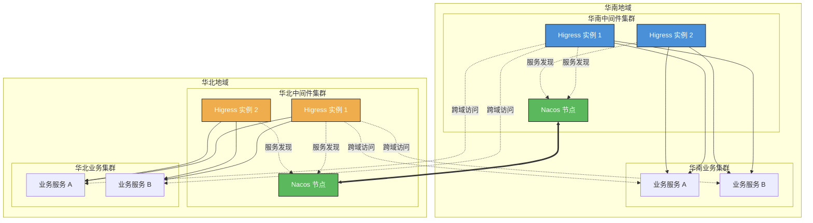

### 中间件集群与业务集群分离：为什么不能使用 K8s 原生服务发现

#### 问题背景

当采用中间件集群与业务集群分离的架构模式时，Higress 部署在独立的中间件集群中，业务服务部署在业务集群中。此时会产生一个常见问题：

**中间件集群的 Higress 无法直接通过 Kubernetes 原生服务发现访问业务集群的服务。**

#### 原因分析

Kubernetes 的服务发现机制（CoreDNS + Service）是**集群级别**的，具有以下限制：

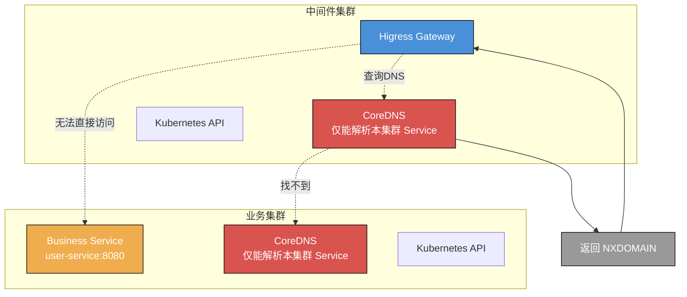

**说明**：Higress 查询业务集群 Service 的 FQDN（如 `user-service.business.svc.cluster.local`），但中间件集群的 CoreDNS 无法解析业务集群的 DNS 记录。

| 限制 | 说明 |
|------|------|
| **CoreDNS 作用域** | 每个 Kubernetes 集群有独立的 CoreDNS，只能解析本集群的 Service DNS 记录 |
| **Service 隔离** | Service 资源是集群级别的，跨集群无法直接访问 |
| **Pod 网络** | Pod CIDR 默认隔离，需要额外的网络配置才能互通 |
| **API Server 独立** | 每个集群有独立的 API Server，无法跨集群查询 Service 信息 |

#### 解决方案

针对这个问题，Higress 提供了以下解决方案：

##### 方案一：McpBridge + 外部服务发现（推荐）

使用 Higress 的 McpBridge CRD 集成外部服务注册中心（如 Nacos、Consul）：

```yaml
apiVersion: networking.higress.io/v1
kind: McpBridge
metadata:
  name: business-cluster
  namespace: higress-system
spec:
  registries:
    # 业务集群 Nacos
    - name: nacos-business-south
      type: nacos2
      domain: nacos-business-south.example.com
      port: 8848
      nacosNamespaceId: public
      nacosGroups:
        - DEFAULT_GROUP
```

**工作原理**：

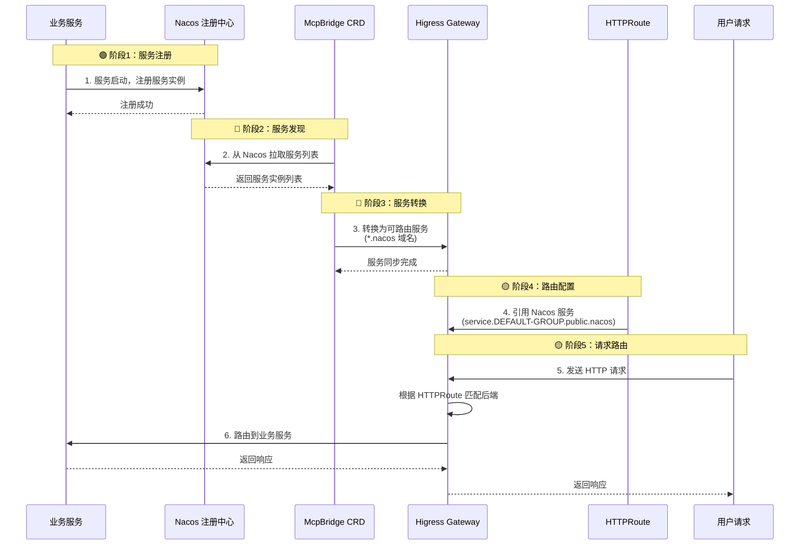

**HTTPRoute 引用示例**：

```yaml
apiVersion: gateway.networking.k8s.io/v1
kind: HTTPRoute
metadata:
  name: business-service-route
spec:
  parentRefs:
    - name: higress-gateway
  hostnames:
    - "api.example.com"
  rules:
    - matches:
        - path:
            type: PathPrefix
            value: /api
      backendRefs:
        # 引用 Nacos 注册的业务服务
        - name: user-service.DEFAULT-GROUP.public.nacos
          group: networking.higress.io
          port: 8080
```

##### 方案二：FQDN 直接访问

如果中间件集群与业务集群网络已打通（VPC 对等连接、专线、VPN），可以使用 FQDN 直接访问：

```yaml
apiVersion: gateway.networking.k8s.io/v1
kind: HTTPRoute
metadata:
  name: business-fqdn-route
spec:
  parentRefs:
    - name: higress-gateway
  hostnames:
    - "api.example.com"
  rules:
    - matches:
        - path:
            type: PathPrefix
            value: /business
      backendRefs:
        # 使用 FQDN 直接访问业务集群服务
        - name: user-service.business.svc.cluster.local
          port: 8080
```

**前提条件**：

| 条件 | 说明 |
|------|------|
| **网络连通** | 中间件集群与业务集群 Pod 网络互通 |
| **DNS 解析** | 中间件集群 CoreDNS 能够解析业务集群的 Service DNS |
| **安全策略** | NetworkPolicy 允许跨集群访问 |

##### 方案三：多集群网络插件

使用支持多集群的 CNI 插件（如 Calico Cluster Mesh、Cilium Cluster Mesh）：

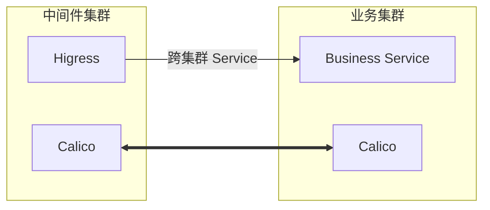

#### 方案对比

| 方案 | 服务发现方式 | 配置复杂度 | 网络要求 | 推荐度 |
|------|-------------|-----------|---------|--------|
| **McpBridge + Nacos** | 第三方注册中心 | 中 | 低（仅需业务服务可访问） | ⭐⭐⭐⭐⭐ |
| **FQDN 直接访问** | 跨集群 DNS | 高 | 高（需网络打通 + DNS 配置） | ⭐⭐⭐ |
| **多集群网络插件** | Calico/Cilium Cluster Mesh | 高 | 高（需配置 Cluster Mesh） | ⭐⭐⭐ |

#### 总结

**中间件集群与业务集群分离后，无法直接使用 Kubernetes 原生服务发现**。需要通过以下方式实现跨集群服务访问：

1. **推荐**：使用 McpBridge 集成外部服务注册中心（Nacos）
2. **备选**：配置跨集群网络打通，使用 FQDN 直接访问
3. **高级**：部署多集群网络插件（Calico/Cilium Cluster Mesh）

本方案文档主要讲解 **McpBridge + Nacos** 的实现方式。

---

## 1. 网络拓扑架构

### 1.1 架构说明

本方案采用**中间件集群与业务集群分离**的架构模式：

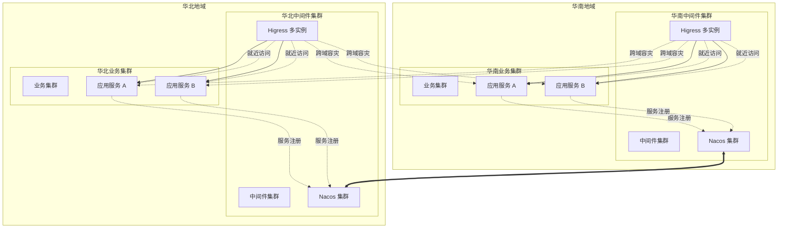

### 1.2 架构特点

| 特点 | 说明 |
|------|------|
| **集群分离** | Higress 部署在独立中间件集群，与业务集群解耦 |
| **多实例部署** | 每个中间件集群部署多个 Higress 实例，保障高可用 |
| **就近访问** | Higress 优先访问本地域业务集群服务 |
| **跨域容灾** | 本地域业务集群故障时，自动切换到远程地域 |
| **统一服务发现** | 通过 Nacos 集群间同步实现跨地域服务发现 |

### 1.3 服务发现机制

Higress 通过 Nacos 多数据中心模式实现跨集群服务发现：

| 服务发现类型 | 支持程度 | 配置复杂度 | 适用场景 |
|------------|---------|-----------|---------|
| **Nacos 多数据中心** | ✅ 原生支持 | 中 | 微服务架构 |
| **K8s 多集群 API** | ⚠️ 需要配置 | 高 | 同一云厂商多集群 |
| **Consul 多数据中心** | ✅ 原生支持 | 中 | 混合云架构 |
| **DNS + SRV 记录** | ✅ 支持 | 低 | 传统服务发现 |

---

## 2. 就近集群访问原理

### 2.1 就近访问策略

就近访问指中间件集群的 Higress 根据服务注册信息，优先将请求路由到本地域的业务集群。

#### 策略一：基于服务发现的就近路由

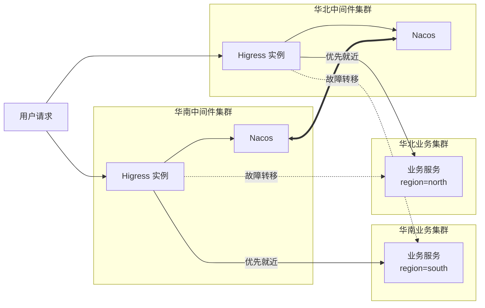

#### 策略二：基于服务标签的就近路由

业务服务在注册到 Nacos 时携带地域标签，Higress 根据标签优先选择本地域服务：

```yaml
# 服务注册时携带地域标签
# 华南业务服务注册
curl -X POST 'http://nacos-south:8848/nacos/v1/instance' \
  -d 'serviceName=user-service&ip=10.0.1.100&port=8080&region=south&healthy=true'

# 华北业务服务注册
curl -X POST 'http://nacos-north:8848/nacos/v1/instance' \
  -d 'serviceName=user-service&ip=10.0.2.100&port=8080&region=north&healthy=true'
```

#### 策略三：基于权重的就近路由

通过不同服务名称区分地域服务，配合流量权重实现就近访问：

```yaml
apiVersion: gateway.networking.k8s.io/v1
kind: HTTPRoute
metadata:
  name: proximity-route
  namespace: default
spec:
  parentRefs:
    - name: higress-gateway
  hostnames:
    - "api.example.com"
  rules:
    - matches:
        - path:
            type: PathPrefix
            value: /
      backendRefs:
        # 本地域服务（华南）80% 流量
        # 服务注册时携带 region=south 标签
        - name: user-service-south.DEFAULT-GROUP.public.nacos
          group: networking.higress.io
          port: 8080
          weight: 80
        # 远地域服务（华北）20% 流量（容灾）
        # 服务注册时携带 region=north 标签
        - name: user-service-north.DEFAULT-GROUP.public.nacos
          group: networking.higress.io
          port: 8080
          weight: 20
```

**服务注册配置：**

```yaml
# 华南业务服务注册
spring:
  cloud:
    nacos:
      discovery:
        server-addr: nacos-south:8848
        service: user-service-south  # 服务名包含地域标识
        metadata:
          region: south

# 华北业务服务注册
spring:
  cloud:
    nacos:
      discovery:
        server-addr: nacos-north:8848
        service: user-service-north  # 服务名包含地域标识
        metadata:
          region: north
```

### 2.2 流量权重与故障转移

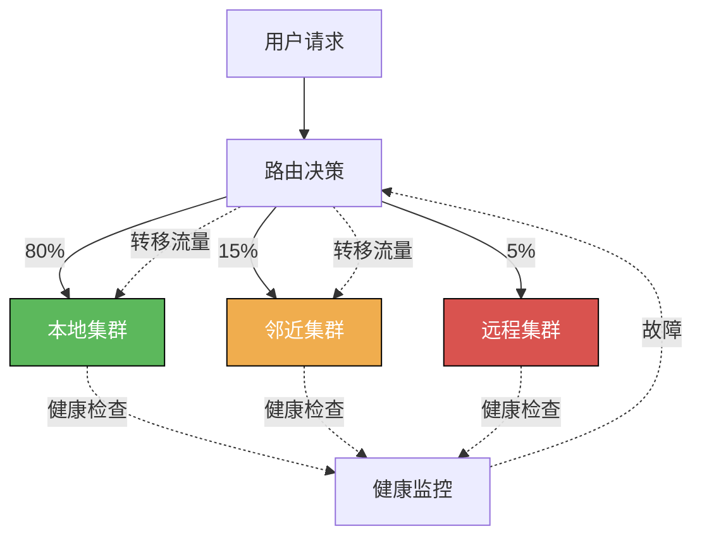

**配置示例：**

```yaml
apiVersion: gateway.networking.k8s.io/v1
kind: HTTPRoute
metadata:
  name: weighted-route
  namespace: default
spec:
  parentRefs:
    - name: higress-gateway
  hostnames:
    - "api.example.com"
  rules:
    - matches:
        - path:
            type: PathPrefix
            value: /
      backendRefs:
        # 本地集群 80% 流量
        - name: service-local
          port: 8080
          weight: 80
        # 邻近集群 15% 流量
        - name: service-nearby
          group: networking.higress.io
          port: 8080
          weight: 15
        # 远程集群 5% 流量
        - name: service-remote
          group: networking.higress.io
          port: 8080
          weight: 5
```

---

## 3. 部署模式

### 3.1 多地域中间件集群部署

#### 部署架构

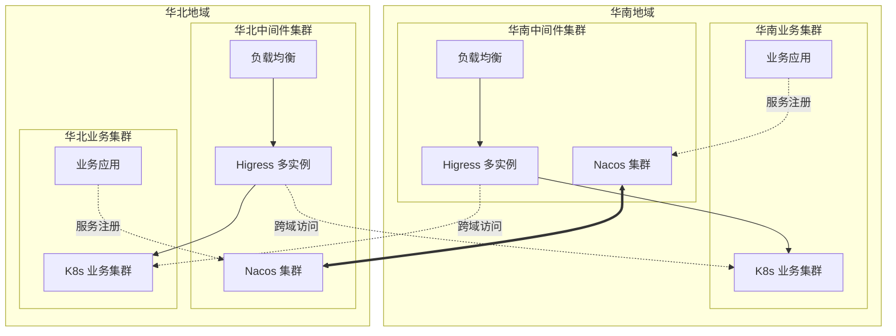

#### 部署步骤

**步骤 1：配置跨集群网络连通**

确保中间件集群与业务集群网络互通：

| 方案 | 适用场景 | 复杂度 |
|------|---------|--------|
| **VPC 对等连接** | 同一云厂商多 VPC | 低 |
| **专线/VPN** | 跨地域混合云 | 中 |
| **云企业网** | 跨地域多 VPC 互联 | 中 |

**步骤 2：部署 Nacos 集群**

在华南、华北中间件集群分别部署 Nacos 集群：

```bash
# 在华南中间件集群部署 Nacos
kubectl apply -f nacos-cluster-south.yaml

# 在华北中间件集群部署 Nacos
kubectl apply -f nacos-cluster-north.yaml

# 配置 Nacos 集群间数据同步
```

**步骤 3：在中间件集群部署 Higress**

```bash
# 华南中间件集群
helm install higress-south higress.io/higress \
  -n higress-system \
  --set global.enableGatewayAPI=true \
  --set global.localClusterName=south \
  --set gateway.replicaCount=3  # 多实例部署

# 华北中间件集群
helm install higress-north higress.io/higress \
  -n higress-system \
  --set global.enableGatewayAPI=true \
  --set global.localClusterName=north \
  --set gateway.replicaCount=3  # 多实例部署
```

**步骤 4：配置业务集群服务注册**

业务服务需要注册到本地域 Nacos：

```yaml
# 业务服务配置示例（application.yaml）
spring:
  cloud:
    nacos:
      discovery:
        server-addr: nacos-south.higress-system.svc.cluster.local:8848
        namespace: public
        group: DEFAULT_GROUP
        metadata:
          region: south  # 服务地域标签
```

**步骤 5：配置跨集群服务发现**

```yaml
apiVersion: networking.higress.io/v1
kind: McpBridge
metadata:
  name: multi-cluster
  namespace: higress-system
spec:
  registries:
    # 本地 Nacos（华南）
    - name: local-nacos
      type: nacos2
      domain: nacos.higress-system.svc.cluster.local
      port: 8848
      nacosNamespaceId: public
      nacosGroups:
        - DEFAULT_GROUP

    # 远程 Nacos（华北）
    - name: nacos-north
      type: nacos2
      domain: nacos-north.example.com
      port: 8848
      nacosNamespaceId: public
      nacosGroups:
        - DEFAULT_GROUP
```

### 3.2 中间件集群与业务集群网络打通

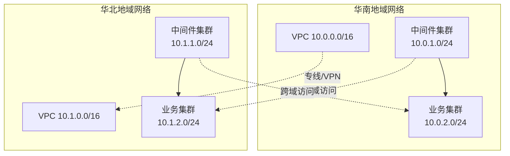

---

## 4. 配置指南

### 4.1 配置跨集群服务路由

#### 方式一：使用 McpBridge 配置业务服务发现

```yaml
# 在中间件集群配置跨业务集群服务发现
apiVersion: networking.higress.io/v1
kind: McpBridge
metadata:
  name: business-cluster
  namespace: higress-system
spec:
  registries:
    # 本地 Nacos（华南中间件集群）
    - name: local-nacos
      type: nacos2
      domain: nacos.higress-system.svc.cluster.local
      port: 8848
      nacosNamespaceId: public
      nacosGroups:
        - DEFAULT_GROUP

    # 华南业务集群 Nacos
    - name: nacos-business-south
      type: nacos2
      domain: nacos-business-south.example.com
      port: 8848
      nacosNamespaceId: public
      nacosGroups:
        - DEFAULT_GROUP

    # 华北业务集群 Nacos
    - name: nacos-business-north
      type: nacos2
      domain: nacos-business-north.example.com
      port: 8848
      nacosNamespaceId: public
      nacosGroups:
        - DEFAULT_GROUP
---
# HTTPRoute 引用业务集群服务
apiVersion: gateway.networking.k8s.io/v1
kind: HTTPRoute
metadata:
  name: business-service-route
  namespace: default
spec:
  parentRefs:
    - name: higress-gateway
      namespace: higress-system
  hostnames:
    - "api.example.com"
  rules:
    - matches:
        - path:
            type: PathPrefix
            value: /api
      backendRefs:
        # 引用业务集群中的服务
        - name: user-service.DEFAULT-GROUP.public.nacos
          group: networking.higress.io
          port: 8080
```

#### 方式二：使用 FQDN 直接访问业务服务

```yaml
apiVersion: gateway.networking.k8s.io/v1
kind: HTTPRoute
metadata:
  name: business-fqdn-route
  namespace: default
spec:
  parentRefs:
    - name: higress-gateway
      namespace: higress-system
  hostnames:
    - "api.example.com"
  rules:
    - matches:
        - path:
            type: PathPrefix
            value: /business
      backendRefs:
        # 通过 FQDN 直接访问业务集群服务
        - name: user-service.business.svc.cluster.local
          port: 8080
```

### 4.2 配置就近访问路由

#### 基于服务地域标签的就近路由

```yaml
apiVersion: gateway.networking.k8s.io/v1
kind: HTTPRoute
metadata:
  name: proximity-route
  namespace: default
spec:
  parentRefs:
    - name: higress-gateway
      namespace: higress-system
  hostnames:
    - "api.example.com"
  rules:
    - matches:
        - path:
            type: PathPrefix
            value: /api
      backendRefs:
        # 本地域业务服务（华南）70% 流量
        - name: user-service-south.DEFAULT-GROUP.public.nacos
          group: networking.higress.io
          port: 8080
          weight: 70
        # 远地域业务服务（华北）30% 流量（容灾）
        - name: user-service-north.DEFAULT-GROUP.public.nacos
          group: networking.higress.io
          port: 8080
          weight: 30
```

#### 基于健康检查的就近路由

```yaml
apiVersion: gateway.networking.k8s.io/v1
kind: HTTPRoute
metadata:
  name: health-aware-route
  namespace: default
spec:
  parentRefs:
    - name: higress-gateway
      namespace: higress-system
  hostnames:
    - "api.example.com"
  rules:
    - matches:
        - path:
            type: PathPrefix
            value: /
      backendRefs:
        # 本地域业务集群服务（主）
        - name: order-service.DEFAULT-GROUP.public.nacos
          group: networking.higress.io
          port: 8080
          weight: 80
        # 远地域业务集群服务（备）
        - name: order-service.DEFAULT-GROUP.public.nacos
          group: networking.higress.io
          port: 8080
          weight: 20
```

### 4.3 配置故障转移

```yaml
# 配置健康检查
apiVersion: networking.higress.io/v1
kind: McpBridge
metadata:
  name: health-check
  namespace: higress-system
spec:
  registries:
    - name: nacos-business-south
      type: nacos2
      domain: nacos-business-south.example.com
      port: 8848
      healthCheck:
        enabled: true
        interval: 5s
        timeout: 3s
        unhealthyThreshold: 3
        healthyThreshold: 2
    - name: nacos-business-north
      type: nacos2
      domain: nacos-business-north.example.com
      port: 8848
      healthCheck:
        enabled: true
        interval: 5s
        timeout: 3s
        unhealthyThreshold: 3
        healthyThreshold: 2
---
# 配置故障转移策略
apiVersion: gateway.networking.k8s.io/v1
kind: HTTPRoute
metadata:
  name: failover-route
  namespace: default
spec:
  parentRefs:
    - name: higress-gateway
      namespace: higress-system
  hostnames:
    - "api.example.com"
  rules:
    - matches:
        - path:
            type: PathPrefix
            value: /
      backendRefs:
        # 本地域业务集群服务（主）
        - name: payment-service.DEFAULT-GROUP.public.nacos
          group: networking.higress.io
          port: 8080
          weight: 100
        # 远地域业务集群服务（备用，故障时自动切换）
        - name: payment-service.DEFAULT-GROUP.public.nacos
          group: networking.higress.io
          port: 8080
          weight: 0
```

---

## 5. 高级功能

### 5.0 路由 Annotation 配置指南

Higress 提供了丰富的 Annotation 配置来增强路由能力，这些 Annotation 兼容 Nginx Ingress 的配置方式，同时也支持 Higress 自有的扩展 Annotation。

#### 5.0.1 Annotation Key 前缀说明

Higress 支持两种 Annotation Key 前缀，两者等价：

| 前缀 | 说明 | 兼容性 |
|------|------|--------|
| `nginx.ingress.kubernetes.io/*` | Nginx Ingress 兼容前缀 | 兼容 Nginx Ingress |
| `higress.io/*` | Higress 原生前缀 | Higress 扩展功能 |

#### 5.0.2 Annotation 作用域

| 作用域 | 说明 | 影响范围 |
|--------|------|----------|
| **Ingress** | 作用域为 Ingress 的 Annotation | 仅限当前 Ingress 上定义的路由规则 |
| **域名** | 作用域为域名的 Annotation | 所有 Ingress 上出现的相同 Host |
| **服务** | 作用域为服务的 Annotation | 所有 Ingress 上出现的相同 Service |

#### 5.0.3 流量治理 Annotation

##### 灰度发布

基于 Header 的灰度发布：

```yaml
apiVersion: networking.k8s.io/v1
kind: Ingress
metadata:
  name: canary-by-header
  namespace: default
  annotations:
    # 开启灰度发布
    nginx.ingress.kubernetes.io/canary: "true"
    # 基于 Header 切分流量（Header Key 存在即路由到灰度版本）
    nginx.ingress.kubernetes.io/canary-by-header: "X-Canary"
    # 基于 Header Value 精确匹配
    nginx.ingress.kubernetes.io/canary-by-header-value: "true"
    # 基于 Header Value 正则匹配
    nginx.ingress.kubernetes.io/canary-by-header-pattern: "^true$"
spec:
  ingressClassName: higress
  rules:
    - host: canary.example.com
      http:
        paths:
          - path: /
            pathType: Prefix
            backend:
              service:
                name: service-canary
                port:
                  number: 8080
```

**使用场景**：
- 按用户类型灰度（内部用户 vs 外部用户）
- 按地区灰度（特定地区用户）
- 按测试账号灰度

基于 Cookie 的灰度发布：

```yaml
apiVersion: networking.k8s.io/v1
kind: Ingress
metadata:
  name: canary-by-cookie
  namespace: default
  annotations:
    nginx.ingress.kubernetes.io/canary: "true"
    # 基于 Cookie 切分流量
    nginx.ingress.kubernetes.io/canary-by-cookie: "canary_user"
spec:
  ingressClassName: higress
  rules:
    - host: canary.example.com
      http:
        paths:
          - path: /
            pathType: Prefix
            backend:
              service:
                name: service-canary
                port:
                  number: 8080
```

基于权重的灰度发布：

```yaml
apiVersion: networking.k8s.io/v1
kind: Ingress
metadata:
  name: canary-by-weight
  namespace: default
  annotations:
    nginx.ingress.kubernetes.io/canary: "true"
    # 灰度流量权重 10%
    nginx.ingress.kubernetes.io/canary-weight: "10"
    # 权重总和（默认 100）
    nginx.ingress.kubernetes.io/canary-weight-total: "100"
spec:
  ingressClassName: higress
  rules:
    - host: canary.example.com
      http:
        paths:
          - path: /
            pathType: Prefix
            backend:
              service:
                name: service-canary
                port:
                  number: 8080
```

**流量权重分配示意**：

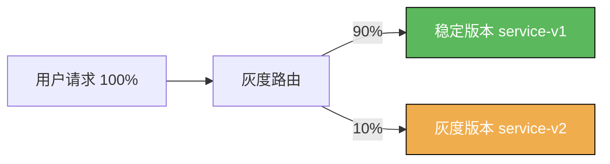

##### 路径重写

将请求路径重写后转发到后端服务：

```yaml
apiVersion: networking.k8s.io/v1
kind: Ingress
metadata:
  name: rewrite-path
  namespace: default
  annotations:
    # 路径重写：将 /api/v1/(.*) 重写为 /$1
    nginx.ingress.kubernetes.io/rewrite-target: /$2
spec:
  ingressClassName: higress
  rules:
    - host: api.example.com
      http:
        paths:
          - path: /api/v1/(.*)  # 捕获组
            pathType: ImplementationSpecific
            backend:
              service:
                name: backend-service
                port:
                  number: 8080
```

**重写效果**：
| 原始请求路径 | 重写后转发路径 |
|-------------|---------------|
| `/api/v1/users` | `/users` |
| `/api/v1/orders/123` | `/orders/123` |

修改转发 Host Header：

```yaml
apiVersion: networking.k8s.io/v1
kind: Ingress
metadata:
  name: upstream-vhost
  namespace: default
  annotations:
    # 修改转发到后端的 Host Header
    nginx.ingress.kubernetes.io/upstream-vhost: "backend.internal.com"
spec:
  ingressClassName: higress
  rules:
    - host: api.example.com
      http:
        paths:
          - path: /
            pathType: Prefix
            backend:
              service:
                name: backend-service
                port:
                  number: 8080
```

**使用场景**：
- 后端服务依赖特定的 Host Header 进行路由
- 多域名共享同一后端服务

##### 重定向

HTTP 重定向为 HTTPS：

```yaml
apiVersion: networking.k8s.io/v1
kind: Ingress
metadata:
  name: ssl-redirect
  namespace: default
  annotations:
    # HTTP 自动重定向到 HTTPS
    nginx.ingress.kubernetes.io/ssl-redirect: "true"
    # 强制 SSL 重定向（即使没有 TLS 证书）
    nginx.ingress.kubernetes.io/force-ssl-redirect: "true"
spec:
  ingressClassName: higress
  rules:
    - host: secure.example.com
      http:
        paths:
          - path: /
            pathType: Prefix
            backend:
              service:
                name: backend-service
                port:
                  number: 8080
```

永久重定向（301）：

```yaml
apiVersion: networking.k8s.io/v1
kind: Ingress
metadata:
  name: permanent-redirect
  namespace: default
  annotations:
    # 永久重定向到新域名
    nginx.ingress.kubernetes.io/permanent-redirect: "https://new.example.com"
    # 自定义重定向状态码（默认 301）
    nginx.ingress.kubernetes.io/permanent-redirect-code: "308"
spec:
  ingressClassName: higress
  rules:
    - host: old.example.com
      http:
        paths:
          - path: /
            pathType: Prefix
            backend:
              service:
                name: backend-service
                port:
                  number: 8080
```

临时重定向（302）：

```yaml
apiVersion: networking.k8s.io/v1
kind: Ingress
metadata:
  name: temporal-redirect
  namespace: default
  annotations:
    # 临时重定向
    nginx.ingress.kubernetes.io/temporal-redirect: "https://maintenance.example.com"
spec:
  ingressClassName: higress
  rules:
    - host: api.example.com
      http:
        paths:
          - path: /
            pathType: Prefix
            backend:
              service:
                name: backend-service
                port:
                  number: 8080
```

修改应用根路径：

```yaml
apiVersion: networking.k8s.io/v1
kind: Ingress
metadata:
  name: app-root
  namespace: default
  annotations:
    # 访问根路径时重定向到 /app
    nginx.ingress.kubernetes.io/app-root: "/app"
spec:
  ingressClassName: higress
  rules:
    - host: app.example.com
      http:
        paths:
          - path: /
            pathType: Prefix
            backend:
              service:
                name: app-service
                port:
                  number: 8080
```

##### 跨域配置（CORS）

```yaml
apiVersion: networking.k8s.io/v1
kind: Ingress
metadata:
  name: cors-config
  namespace: default
  annotations:
    # 开启 CORS
    nginx.ingress.kubernetes.io/enable-cors: "true"
    # 允许的源（* 表示所有域名）
    nginx.ingress.kubernetes.io/cors-allow-origin: "https://example.com,https://app.example.com"
    # 允许的请求方法
    nginx.ingress.kubernetes.io/cors-allow-methods: "GET, POST, PUT, DELETE, OPTIONS"
    # 允许的请求 Header
    nginx.ingress.kubernetes.io/cors-allow-headers: "DNT,X-CustomHeader,Keep-Alive,User-Agent,X-Requested-With,If-Modified-Since,Cache-Control,Content-Type,Authorization"
    # 暴露给浏览器的响应 Header
    nginx.ingress.kubernetes.io/cors-expose-headers: "X-Custom-Header"
    # 允许携带凭证信息（Cookie）
    nginx.ingress.kubernetes.io/cors-allow-credentials: "true"
    # 预检请求缓存时间（秒）
    nginx.ingress.kubernetes.io/cors-max-age: "3600"
spec:
  ingressClassName: higress
  rules:
    - host: api.example.com
      http:
        paths:
          - path: /
            pathType: Prefix
            backend:
              service:
                name: backend-service
                port:
                  number: 8080
```

**CORS 请求流程**：

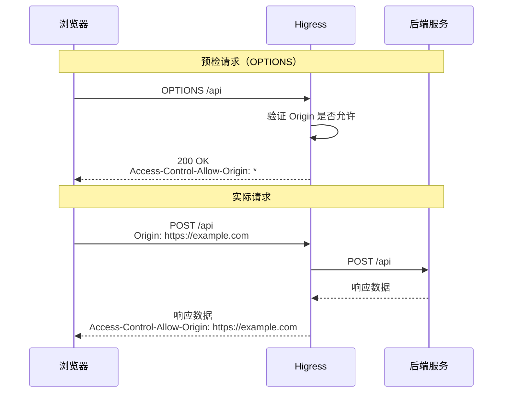

##### 超时配置

```yaml
apiVersion: networking.k8s.io/v1
kind: Ingress
metadata:
  name: timeout-config
  namespace: default
  annotations:
    # 请求超时时间（秒）
    higress.io/timeout: "30"
spec:
  ingressClassName: higress
  rules:
    - host: api.example.com
      http:
        paths:
          - path: /
            pathType: Prefix
            backend:
              service:
                name: backend-service
                port:
                  number: 8080
```

**使用场景**：
- 防止长时间请求阻塞
- 根据业务类型设置不同超时时间
- 快速失败，释放连接

##### 单机限流

```yaml
apiVersion: networking.k8s.io/v1
kind: Ingress
metadata:
  name: rate-limit
  namespace: default
  annotations:
    # 每分钟最大请求数（单机）
    higress.io/route-limit-rpm: "1000"
    # 每秒最大请求数（单机）
    higress.io/route-limit-rps: "100"
    # 瞬时最大请求倍数（默认 5）
    higress.io/route-limit-burst-multiplier: "5"
spec:
  ingressClassName: higress
  rules:
    - host: api.example.com
      http:
        paths:
          - path: /
            pathType: Prefix
            backend:
              service:
                name: backend-service
                port:
                  number: 8080
```

**限流计算**：
| 配置 | 每秒请求数 | 瞬时最大请求数 |
|------|-----------|---------------|
| `rps: 100, burst-multiplier: 5` | 100 | 500 |

**使用场景**：
- 保护后端服务免受流量冲击
- 防止恶意攻击
- 公网 API 限流

##### 重试策略

```yaml
apiVersion: networking.k8s.io/v1
kind: Ingress
metadata:
  name: retry-config
  namespace: default
  annotations:
    # 最大重试次数（默认 3）
    nginx.ingress.kubernetes.io/proxy-next-upstream-tries: "3"
    # 重试超时时间（秒）
    nginx.ingress.kubernetes.io/proxy-next-upstream-timeout: "60"
    # 重试条件
    nginx.ingress.kubernetes.io/proxy-next-upstream: "error,timeout,http_502,http_503,http_504"
spec:
  ingressClassName: higress
  rules:
    - host: api.example.com
      http:
        paths:
          - path: /
            pathType: Prefix
            backend:
              service:
                name: backend-service
                port:
                  number: 8080
```

**重试条件说明**：
| 条件 | 说明 |
|------|------|
| `error` | 连接错误 |
| `timeout` | 请求超时 |
| `http_502` | 后端返回 502 |
| `http_503` | 后端返回 503 |
| `http_504` | 后端返回 504 |
| `http_5xx` | 任意 5xx 错误 |

##### 后端服务协议

```yaml
apiVersion: networking.k8s.io/v1
kind: Ingress
metadata:
  name: backend-protocol
  namespace: default
  annotations:
    # 后端服务协议（默认 HTTP）
    # 支持：HTTP, HTTP2, HTTPS, GRPC, GRPCS
    nginx.ingress.kubernetes.io/backend-protocol: "GRPC"
spec:
  ingressClassName: higress
  rules:
    - host: grpc.example.com
      http:
        paths:
          - path: /
            pathType: Prefix
            backend:
              service:
                name: grpc-service
                port:
                  number: 9090
```

##### 负载均衡算法

普通负载均衡：

```yaml
apiVersion: networking.k8s.io/v1
kind: Ingress
metadata:
  name: load-balance
  namespace: default
  annotations:
    # 负载均衡算法：round_robin, least_conn, random
    nginx.ingress.kubernetes.io/load-balance: "least_conn"
spec:
  ingressClassName: higress
  rules:
    - host: api.example.com
      http:
        paths:
          - path: /
            pathType: Prefix
            backend:
              service:
                name: backend-service
                port:
                  number: 8080
```

**负载均衡算法对比**：
| 算法 | 说明 | 适用场景 |
|------|------|----------|
| `round_robin` | 轮询 | 后端服务性能相近 |
| `least_conn` | 最少连接 | 后端服务性能差异大 |
| `random` | 随机 | 大规模并发场景 |

一致性 Hash 负载均衡：

```yaml
apiVersion: networking.k8s.io/v1
kind: Ingress
metadata:
  name: upstream-hash-by
  namespace: default
  annotations:
    # 一致性 Hash：基于请求 URI
    nginx.ingress.kubernetes.io/upstream-hash-by: "$request_uri"
    # 一致性 Hash：基于 Host
    # nginx.ingress.kubernetes.io/upstream-hash-by: "$host"
    # 一致性 Hash：基于客户端 IP
    # nginx.ingress.kubernetes.io/upstream-hash-by: "$remote_addr"
    # 一致性 Hash：基于请求 Header
    # nginx.ingress.kubernetes.io/upstream-hash-by: "$http_user_id"
    # 一致性 Hash：基于请求参数
    # nginx.ingress.kubernetes.io/upstream-hash-by: "$arg_session_id"
spec:
  ingressClassName: higress
  rules:
    - host: api.example.com
      http:
        paths:
          - path: /
            pathType: Prefix
            backend:
              service:
                name: backend-service
                port:
                  number: 8080
```

**使用场景**：
- 需要将相同请求路由到同一后端（有状态服务）
- 缓存场景（提高缓存命中率）
- WebSocket 连接保持

##### Cookie 会话亲和性

```yaml
apiVersion: networking.k8s.io/v1
kind: Ingress
metadata:
  name: cookie-affinity
  namespace: default
  annotations:
    # 开启 Cookie 会话亲和性
    nginx.ingress.kubernetes.io/affinity: "cookie"
    # 亲和性模式：balanced（Higress 支持）
    nginx.ingress.kubernetes.io/affinity-mode: "balanced"
    # Cookie 名称
    nginx.ingress.kubernetes.io/session-cookie-name: "route"
    # Cookie 路径
    nginx.ingress.kubernetes.io/session-cookie-path: "/"
    # Cookie 过期时间（秒）
    nginx.ingress.kubernetes.io/session-cookie-max-age: "3600"
spec:
  ingressClassName: higress
  rules:
    - host: app.example.com
      http:
        paths:
          - path: /
            pathType: Prefix
            backend:
              service:
                name: backend-service
                port:
                  number: 8080
```

**会话亲和性流程**：

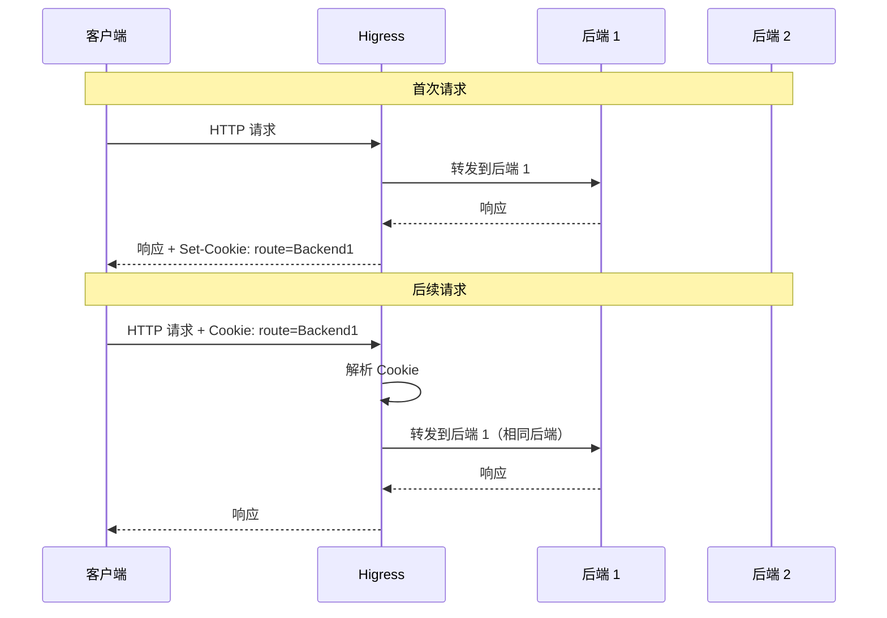

##### IP 访问控制

```yaml
apiVersion: networking.k8s.io/v1
kind: Ingress
metadata:
  name: ip-whitelist
  namespace: default
  annotations:
    # IP 白名单（逗号分隔）
    nginx.ingress.kubernetes.io/whitelist-source-range: "10.0.0.0/8,172.16.0.0/12,192.168.0.0/16"
spec:
  ingressClassName: higress
  rules:
    - host: internal.example.com
      http:
        paths:
          - path: /
            pathType: Prefix
            backend:
              service:
                name: backend-service
                port:
                  number: 8080
```

**使用场景**：
- 内部 API 仅允许内网访问
- 管理 API 仅允许办公网访问
- 阻止特定 IP 或 IP 段访问

#### 5.0.4 安全防护 Annotation

##### 客户端与网关 TLS 加密

```yaml
apiVersion: networking.k8s.io/v1
kind: Ingress
metadata:
  name: tls-config
  namespace: default
  annotations:
    # TLS 加密套件
    nginx.ingress.kubernetes.io/ssl-cipher: "ECDHE-ECDSA-AES128-GCM-SHA256:ECDHE-RSA-AES128-GCM-SHA256:ECDHE-ECDSA-AES256-GCM-SHA384:ECDHE-RSA-AES256-GCM-SHA384"
spec:
  ingressClassName: higress
  tls:
    - hosts:
        - secure.example.com
      secretName: tls-secret
  rules:
    - host: secure.example.com
      http:
        paths:
          - path: /
            pathType: Prefix
            backend:
              service:
                name: backend-service
                port:
                  number: 8080
```

##### mTLS 双向认证

```yaml
apiVersion: networking.k8s.io/v1
kind: Ingress
metadata:
  name: mtls-config
  namespace: default
  annotations:
    # CA 证书 Secret（格式：<tls-cert-secret>-cacert）
    nginx.ingress.kubernetes.io/auth-tls-secret: "default/tls-cert-cacert"
spec:
  ingressClassName: higress
  tls:
    - hosts:
        - secure.example.com
      secretName: tls-cert
  rules:
    - host: secure.example.com
      http:
        paths:
          - path: /
            pathType: Prefix
            backend:
              service:
                name: backend-service
                port:
                  number: 8080
```

**mTLS 握手流程**：

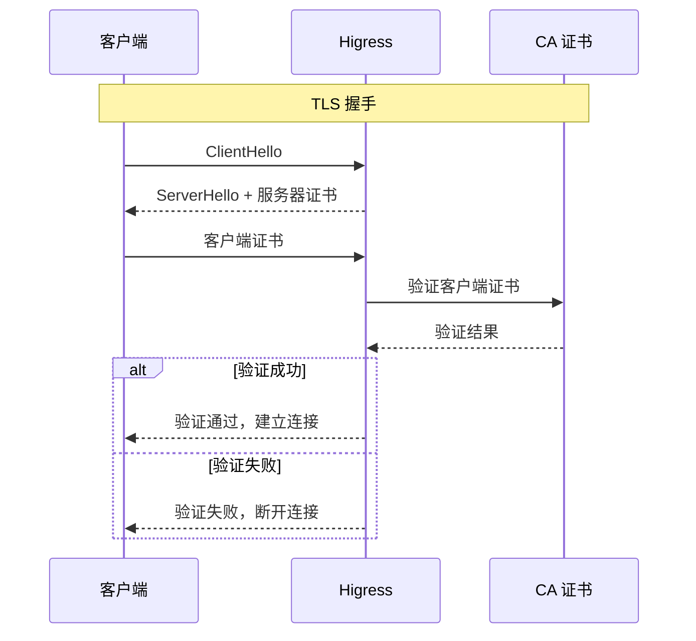

##### 网关与后端 TLS

```yaml
apiVersion: networking.k8s.io/v1
kind: Ingress
metadata:
  name: proxy-ssl
  namespace: default
  annotations:
    # 网关作为客户端的证书
    nginx.ingress.kubernetes.io/proxy-ssl-secret: "default/proxy-client-cert"
    # TLS 握手时使用的 SNI
    nginx.ingress.kubernetes.io/proxy-ssl-name: "backend.internal.com"
    # 开启 SNI
    nginx.ingress.kubernetes.io/proxy-ssl-server-name: "true"
spec:
  ingressClassName: higress
  rules:
    - host: api.example.com
      http:
        paths:
          - path: /
            pathType: Prefix
            backend:
              service:
                name: backend-service
                port:
                  number: 8443
```

##### Basic 认证

```yaml
apiVersion: networking.k8s.io/v1
kind: Ingress
metadata:
  name: basic-auth
  namespace: default
  annotations:
    # 认证类型
    nginx.ingress.kubernetes.io/auth-type: basic
    # 认证 Secret
    nginx.ingress.kubernetes.io/auth-secret: "default/basic-auth-secret"
    # Secret 内容格式：auth-file 或 auth-map
    nginx.ingress.kubernetes.io/auth-secret-type: "auth-file"
    # 保护域（相同域共享认证）
    nginx.ingress.kubernetes.io/auth-realm: "Protected Area"
spec:
  ingressClassName: higress
  rules:
    - host: protected.example.com
      http:
        paths:
          - path: /
            pathType: Prefix
            backend:
              service:
                name: backend-service
                port:
                  number: 8080
```

**创建认证 Secret**：

```bash
# 方式一：使用 htpasswd 工具
htpasswd -c auth foo
kubectl create secret generic basic-auth-secret --from-file=auth=auth -n default

# 方式二：直接创建 auth-map 格式 Secret
kubectl create secret generic basic-auth-secret \
  --from-literal=admin=admin123 \
  --from-literal=user=user456 \
  -n default
```

#### 5.0.5 Fallback 容灾配置

```yaml
apiVersion: networking.k8s.io/v1
kind: Ingress
metadata:
  name: fallback-config
  namespace: default
  annotations:
    # 容灾服务（后端不可用时自动转发）
    nginx.ingress.kubernetes.io/default-backend: "fallback-service"
    # 特定错误码时转发到容灾服务
    nginx.ingress.kubernetes.io/custom-http-errors: "404,502,503"
spec:
  ingressClassName: higress
  rules:
    - host: api.example.com
      http:
        paths:
          - path: /
            pathType: Prefix
            backend:
              service:
                name: backend-service
                port:
                  number: 8080
```

**Fallback 流程**：

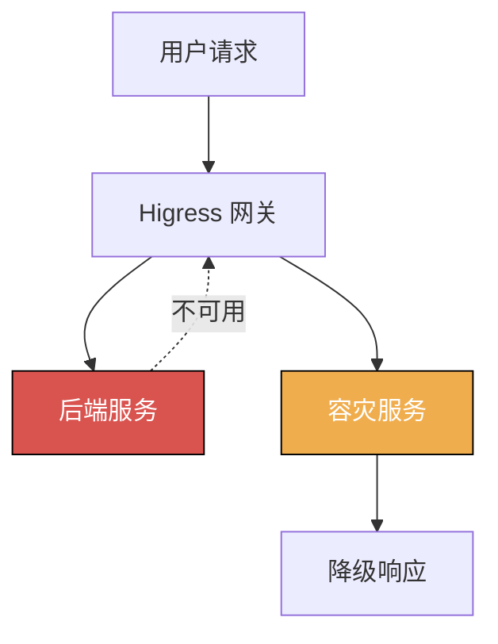

#### 5.0.6 Annotation 配置最佳实践

1. **命名规范**
   ```yaml
   # 为不同环境使用不同的 Annotation 配置
   metadata:
     annotations:
       # 生产环境：严格限流
       higress.io/route-limit-rps: "100"
       # 测试环境：宽松限流
       # higress.io/route-limit-rps: "1000"
   ```

2. **监控告警**
   - 监控限流触发情况
   - 监控重试次数
   - 监控超时情况

3. **灰度发布策略**
   - 先小流量测试（1% - 5%）
   - 逐步增加灰度流量
   - 监控错误率和性能指标
   - 全量发布

4. **安全加固**
   - 公网 API 必须配置限流
   - 管理 API 配置 IP 白名单
   - 敏感 API 配置 mTLS

### 5.1 金丝雀发布

```yaml
apiVersion: gateway.networking.k8s.io/v1
kind: HTTPRoute
metadata:
  name: canary-release
  namespace: default
spec:
  parentRefs:
    - name: higress-gateway
      namespace: higress-system
  hostnames:
    - "api.example.com"
  rules:
    - matches:
        - headers:
            - name: X-Canary
              value: "true"
      backendRefs:
        # 新版本（金丝雀）
        - name: service-v2
          port: 8080
    - matches:
        - path:
            type: PathPrefix
            value: /
      backendRefs:
        # 稳定版本 90%
        - name: service-v1
          port: 8080
          weight: 90
        # 新版本 10%
        - name: service-v2
          port: 8080
          weight: 10
```

### 5.2 蓝绿发布

```yaml
# 蓝环境
apiVersion: gateway.networking.k8s.io/v1
kind: HTTPRoute
metadata:
  name: blue-route
  namespace: default
spec:
  parentRefs:
    - name: higress-gateway
  hostnames:
    - "api.example.com"
  rules:
    - matches:
        - path:
            type: PathPrefix
            value: /
      backendRefs:
        - name: service-blue
          port: 8080
---
# 绿环境（切换时应用）
apiVersion: gateway.networking.k8s.io/v1
kind: HTTPRoute
metadata:
  name: green-route
  namespace: default
spec:
  parentRefs:
    - name: higress-gateway
  hostnames:
    - "api.example.com"
  rules:
    - matches:
        - path:
            type: PathPrefix
            value: /
      backendRefs:
        - name: service-green
          port: 8080
```

### 5.3 A/B 测试

```yaml
apiVersion: gateway.networking.k8s.io/v1
kind: HTTPRoute
metadata:
  name: ab-test-route
  namespace: default
spec:
  parentRefs:
    - name: higress-gateway
  hostnames:
    - "api.example.com"
  rules:
    # A 组用户
    - matches:
        - headers:
            - name: X-AB-Group
              value: A
      backendRefs:
        - name: service-a
          port: 8080
    # B 组用户
    - matches:
        - headers:
            - name: X-AB-Group
              value: B
      backendRefs:
        - name: service-b
          port: 8080
    # 默认路由
    - matches:
        - path:
            type: PathPrefix
            value: /
      backendRefs:
        - name: service-default
          port: 8080
```

### 5.4 流量镜像

Gateway API v1.1.0+ 支持 `MirrorFilter` 实现流量镜像。Higress 1.5+ 版本支持此特性。

```yaml
apiVersion: gateway.networking.k8s.io/v1
kind: HTTPRoute
metadata:
  name: traffic-mirror
  namespace: default
spec:
  parentRefs:
    - name: higress-gateway
  hostnames:
    - "api.example.com"
  rules:
    - matches:
        - path:
            type: PathPrefix
            value: /
      filters:
        # 流量镜像到测试服务
        - type: RequestMirror
          requestMirror:
            backendRef:
              name: service-staging
              port: 8080
      backendRefs:
        # 生产服务（主流量）
        - name: service-prod
          port: 8080
```

> **说明**：流量镜像将请求副本发送到镜像服务，镜像服务的响应会被忽略。适用于生产环境流量复制到测试环境进行验证。

---

## 6. 最佳实践

### 6.1 命名规范

```yaml
# 中间件集群命名规范
metadata:
  name: middleware-{region}-{env}
  # 示例: middleware-south-prod, middleware-north-prod

# 业务服务命名规范
metadata:
  name: {service-name}-{region}
  # 示例: user-service-south, order-service-north

# Nacos 服务注册命名
service: {service-name}-DEFAULT-GROUP.public.nacos
# 示例: user-service-south.DEFAULT-GROUP.public.nacos

# 路由命名规范
metadata:
  name: {app}-{function}-route
  # 示例: user-api-route, order-web-route
```

### 6.2 监控指标

| 指标类别 | 关键指标 | 说明 |
|---------|---------|------|
| **流量指标** | 中间件→业务集群流量 | 监控跨集群流量占比 |
| | 就近访问命中率 | 就近路由的成功率 |
| **延迟指标** | 本地域访问延迟 | Higress→本地业务集群延迟 |
| | 跨地域访问延迟 | Higress→远程业务集群延迟 |
| **可用性** | 业务集群健康度 | 各业务集群的健康状态 |
| | 故障转移次数 | 自动故障转移的触发次数 |
| **容量** | 中间件集群 QPS | Higress 的请求处理能力 |
| | 业务集群连接数 | 业务服务的连接数统计 |

### 6.3 安全建议

1. **网络隔离**
   - 中间件集群与业务集群网络隔离
   - 使用 NetworkPolicy 限制 Higress 访问业务服务

2. **认证授权**
   - 中间件集群访问业务服务启用 mTLS
   - 使用 JWT 进行服务间认证

3. **数据加密**
   - 跨集群通信启用 TLS
   - 敏感数据加密存储

```yaml
# NetworkPolicy 示例：仅允许中间件集群访问业务服务
apiVersion: networking.k8s.io/v1
kind: NetworkPolicy
metadata:
  name: allow-middleware-access
  namespace: business
spec:
  podSelector:
    matchLabels:
      app: business-service
  policyTypes:
    - Ingress
  ingress:
    - from:
        # 仅允许中间件集群的流量
        - namespaceSelector:
            matchLabels:
              type: middleware-cluster
      ports:
        - protocol: TCP
          port: 8080
```

### 6.4 成本优化

| 优化方向 | 具体措施 |
|---------|---------|
| **流量成本** | Higress 优先路由到本地域业务集群，减少跨域流量 |
| **资源成本** | 根据流量模式动态调整中间件集群 Higress 实例数量 |
| **存储成本** | Nacos 集群间共享配置，避免重复存储 |
| **监控成本** | 合理设置监控采样率，控制数据量 |

---

## 7. 故障处理

### 7.1 常见问题

| 问题 | 原因 | 解决方案 |
|------|------|---------|
| **业务服务无法访问** | 中间件→业务网络不通 | 检查 VPC 对等连接、专线状态 |
| **服务发现失败** | Nacos 连接异常 | 检查业务集群 Nacos 地址配置 |
| **就近路由不生效** | 服务地域标签配置错误 | 检查服务注册的 region 标签 |
| **跨域访问失败** | 跨域网络策略限制 | 检查 NetworkPolicy 配置 |

### 7.2 故障排查

```bash
# 1. 检查中间件集群 Higress 状态
kubectl get pods -n higress-system

# 2. 检查 McpBridge 配置
kubectl get mcpbridge -n higress-system -o yaml

# 3. 检查业务服务注册状态
# 进入 Nacos 控制台查看服务列表和地域标签

# 4. 检查路由配置
kubectl get httproute -A
kubectl describe httproute <route-name> -n <namespace>

# 5. 测试中间件到业务集群连通性
kubectl exec -it -n higress-system <higress-pod> -- \
  curl http://<business-service>:8080/health

# 6. 查看 Higress 日志
kubectl logs -n higress-system -l app=higress --tail=100
```

### 7.3 应急预案

#### 场景一：业务集群故障

1. 监控检测到业务集群不可用
2. Higress 自动摘除故障业务集群服务
3. 流量自动切换到健康地域业务集群
4. 通知运维人员处理

#### 场景二：中间件集群故障

1. 监控检测到 Higress 不可用
2. 负载均衡自动摘除故障 Higress 实例
3. 流量自动切换到健康 Higress 实例
4. 通知运维人员处理

#### 场景三：网络分区

1. 中间件与业务集群网络中断
2. 本地域服务继续正常工作
3. 跨域请求超时重试
4. 启用降级策略

#### 场景四：服务雪崩

1. 业务服务过载
2. 熔断器触发，快速失败
3. 限流保护上游业务服务
4. 启用备用业务服务

---

## 8. 参考资料

### 官方文档

- [Higress 官方文档](https://higress.io/docs/)
- [Kubernetes 多集群管理](https://kubernetes.io/docs/concepts/architecture/multi-cluster/)
- [Nacos 多数据中心部署](https://nacos.io/zh-cn/docs/cluster-mode-quick-start.html)

### 相关技术

- [Service Mesh 多集群实践](https://istio.io/latest/docs/setup/install/multicluster/)
- [Kubernetes Federation v2](https://github.com/kubernetes-sigs/kubefed)

### 最佳实践

- [云原生应用多集群部署实践](https://www.alibabacloud.com/help/zh/ack)
- [微服务跨地域容灾架构](https://help.aliyun.com/document_detail/165123.html)

---

## 附录

### A. 配置检查清单

部署跨集群路由前，请确认以下配置：

- [ ] 各集群网络连通
- [ ] Nacos 集群配置完成
- [ ] Higress 网关部署完成
- [ ] McpBridge 配置正确
- [ ] 服务正常注册到 Nacos
- [ ] 路由规则配置完成
- [ ] 健康检查正常工作
- [ ] 监控告警配置完成
- [ ] 故障转移策略配置
- [ ] 应急预案准备完毕

### B. 性能基准参考

| 场景 | 本地集群访问 | 跨集群访问 | 说明 |
|------|------------|-----------|------|
| **同地域跨集群** | +5-10ms | +10-20ms | 同一地域不同集群 |
| **跨地域访问** | +30-50ms | +50-100ms | 不同地域访问 |
| **跨云访问** | +50-100ms | +100-200ms | 不同云厂商 |

### C. 版本兼容性

| Higress 版本 | Gateway API | McpBridge | 多集群支持 |
|-------------|-------------|-----------|-----------|
| 1.3.x | v1.0.0 | v1alpha1 | 基础支持 |
| 1.4.x | v1.0.0 | v1alpha1 | 增强支持 |
| 1.5.x+ | v1.1.0+ | v1beta1 | 完整支持 |