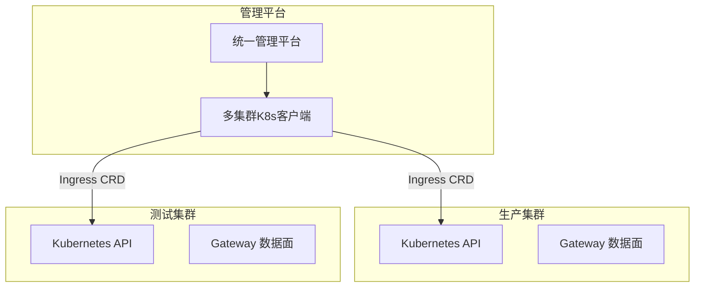

本文档提供多集群 Higress 管理的快速入门指南。

---

## 1. 前置条件

- 多个 Kubernetes 集群（开发、测试、生产等）
- 每个集群已部署 Higress
- 具有各集群的 kubeconfig 文件

---

## 2. 架构概览



---

## 3. 快速开始

### 3.1 安装依赖

```bash
# Go 项目
go get k8s.io/client-go@latest

# Python 项目
pip install kubernetes
```

### 3.2 初始化多集群管理

```yaml
# 集群配置示例 clusters.yaml
clusters:
  - name: prod
    kubeconfig: /path/to/prod-kubeconfig.yaml
  - name: test
    kubeconfig: /path/to/test-kubeconfig.yaml
  - name: dev
    kubeconfig: /path/to/dev-kubeconfig.yaml
```

```bash
# 使用 kubecm 管理多集群配置
kubecm merge --config clusters.yaml
```

### 3.3 创建并同步 Ingress

```yaml
# ingress-template.yaml
apiVersion: networking.k8s.io/v1
kind: Ingress
metadata:
  name: api-gateway
  namespace: default
spec:
  ingressClassName: higress
  rules:
    - host: api.example.com
      http:
        paths:
          - path: /
            pathType: Prefix
            backend:
              service:
                name: api-service
                port:
                  number: 8080
```

```bash
# 同步到所有集群
for ctx in $(kubectl config get-contexts -o name); do
  kubectl apply --context $ctx -f ingress-template.yaml
done
```

### 3.4 配置 AI Proxy 插件

```yaml
# ai-proxy-plugin.yaml
apiVersion: extensions.higress.io/v1alpha1
kind: WasmPlugin
metadata:
  name: ai-proxy
  namespace: higress-system
spec:
  url: oci://ghcr.io/higress-group/wasm-go/ai-proxy:latest
  phase: DEFAULT
  priority: 300
  matchRules:
    - config:
        services:
          - provider: openai
            api_tokens: ["sk-your-api-key"]
            endpoint: https://api.openai.com/v1
```

```bash
# 同步到所有集群
for ctx in $(kubectl config get-contexts -o name); do
  kubectl apply --context $ctx -f ai-proxy-plugin.yaml
done
```

---

## 4. 程序化管理

完整的 Go/Python 多集群管理代码实现，请参考：
- [HTTP API 指南 - 多数据面管理](./higress-http-api-guide.md#5-多数据面管理方案-多集群)

### 核心概念

| 功能 | 说明 |
|------|------|
| **MultiClusterManager** | 管理多个 K8s 集群的客户端 |
| **SyncIngressToAllClusters** | 将 Ingress 同步到所有集群 |
| **SyncStrategyCanary** | 金丝雀发布策略（dev -> test -> prod） |
| **VersionManager** | 配置版本管理与回滚 |

---

## 5. 常用操作

### 5.1 查询集群状态

```bash
# 列出所有集群
kubectl config get-contexts

# 查询特定集群的 Ingress
kubectl --context prod get ingress -A
kubectl --context prod get wasmplugin -A
```

### 5.2 配置同步策略

```bash
# 使用 kubectl-kustomize 管理多环境
kubectl apply -k overlays/prod
kubectl apply -k overlays/test
kubectl apply -k overlays/dev
```

### 5.3 配置回滚

```bash
# 回滚 Ingress 配置
kubectl --context prod rollout undo ingress/api-gateway

# 查看历史版本
kubectl --context prod get ingress api-gateway -o yaml
```

---

## 6. 安全配置

### 6.1 加密 Kubeconfig

```bash
# 使用 sops 加密敏感配置
sops --encrypt --kms "arn:aws:kms:..." kubeconfig.yaml > kubeconfig.enc.yaml
```

### 6.2 RBAC 权限

```yaml
# rbac.yaml
apiVersion: v1
kind: ServiceAccount
metadata:
  name: higress-manager
  namespace: higress-system
---
apiVersion: rbac.authorization.k8s.io/v1
kind: Role
metadata:
  name: higress-manager
  namespace: higress-system
rules:
  - apiGroups: ["networking.k8s.io", "extensions.higress.io"]
    resources: ["ingresses", "wasmplugins"]
    verbs: ["get", "list", "create", "update", "delete"]
```

---

## 7. 最佳实践

1. **环境隔离**: 使用不同的 namespace 或 ingressClass 隔离环境
2. **版本管理**: 每次变更都保存版本，便于回滚
3. **金丝雀发布**: 重要变更先在测试环境验证
4. **安全加密**: 生产环境的 kubeconfig 必须加密存储
5. **监控告警**: 配置同步失败时及时告警

---

## 8. 参考资料

- [HTTP API 使用指南 - 多数据面管理](./higress-http-api-guide.md#5-多数据面管理方案-多集群)
- [Higress 操作指南](./higress-operation-guide.md)
- [Higress 官方文档](https://higress.cn/docs)
