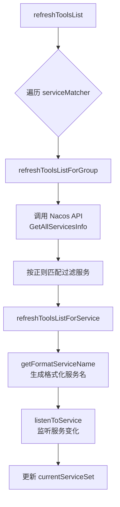
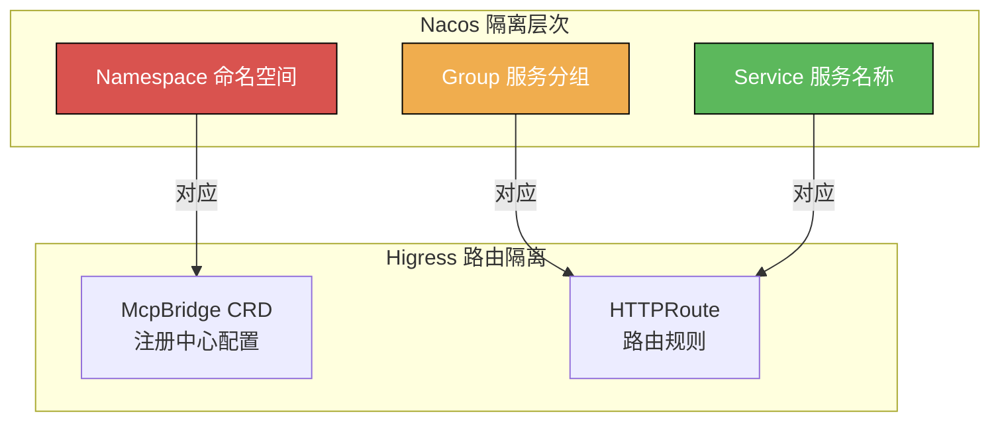
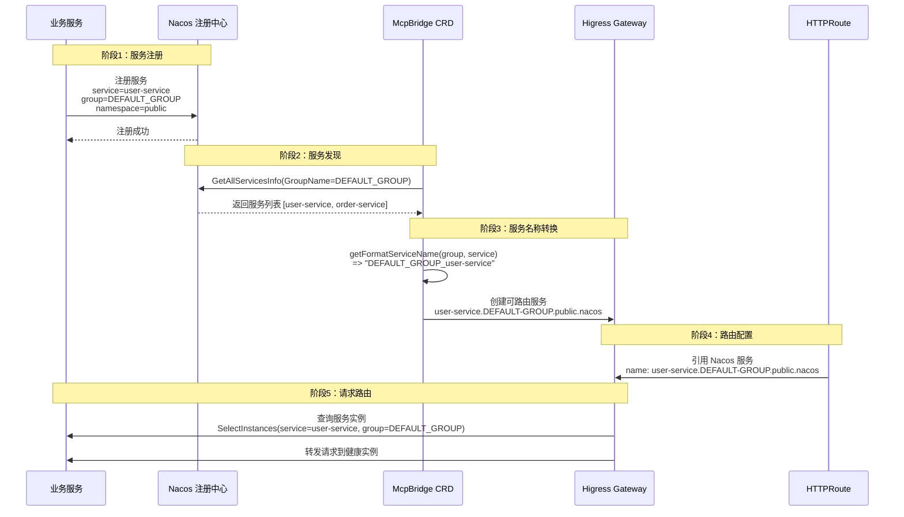
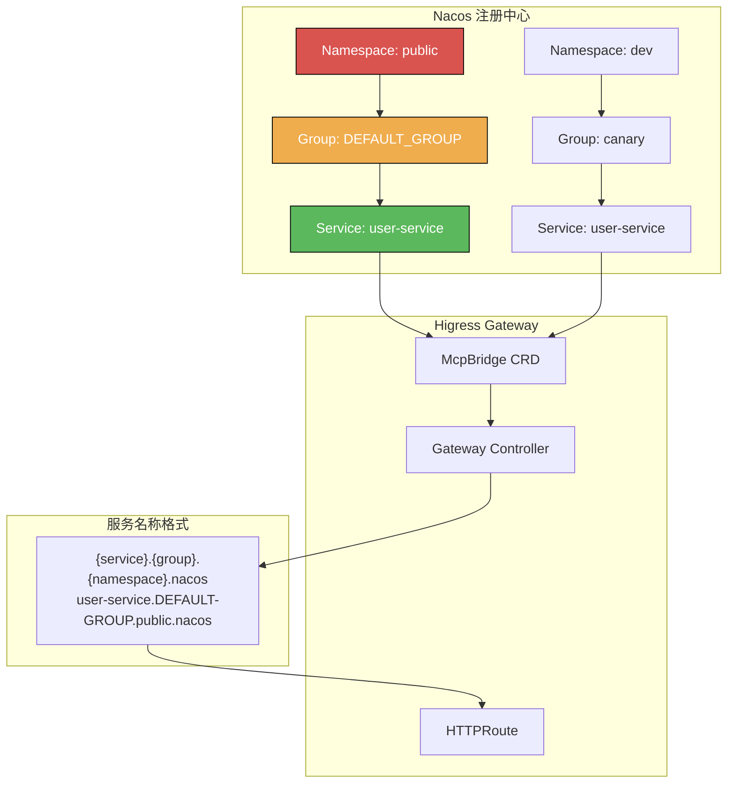

---

## 目录

- [1. 服务名称格式解析](#1-服务名称格式解析)
- [2. 核心源码分析](#2-核心源码分析)
- [3. 服务发现隔离机制](#3-服务发现隔离机制)
- [4. 服务名称转换流程](#4-服务名称转换流程)
- [5. 多租户与多环境隔离](#5-多租户与多环境隔离)
- [6. 配置示例](#6-配置示例)
- [7. 最佳实践](#7-最佳实践)

---

## 1. 服务名称格式解析

### 1.1 标准格式

Higress 中 Nacos 服务的标准名称格式为：

```
{service-name}.{group}.{namespace-id}.nacos
```

**示例**：
```
user-service.DEFAULT-GROUP.public.nacos
order-service.DEFAULT-GROUP.d8ac64f3-xxxx-xxxx-xxxx-47a814ecf358.nacos
```

### 1.2 格式各部分含义

| 部分 | 说明 | 示例值 | 备注 |
|------|------|--------|------|
| **service-name** | Nacos 中注册的服务名称 | `user-service` | 原始服务名，支持地域标识如 `user-service-south` |
| **group** | Nacos 服务分组 | `DEFAULT-GROUP` | Nacos 概念，用于服务分组隔离 |
| **namespace-id** | Nacos 命名空间 ID | `public` 或 UUID | Nacos 多租户隔离的核心 |
| **nacos** | 固定后缀 | `nacos` | Higress 识别 Nacos 服务的标识 |

### 1.3 特殊说明

#### Group 命名转换规则

根据源码和文档，Nacos Group 中的**下划线会被转换为横杠**：

```go
// 源码位置: mcp-server/registry/nacos/nacos.go:134-136
func getFormatServiceName(group string, service string) string {
    return fmt.Sprintf("%s_%s", group, service)
}
```

但根据文档说明，在 HTTPRoute 中引用时，Group 中的下划线需要转换为横杠：

```yaml
# 服务注册时 Group 为 DEFAULT_GROUP（下划线）
# HTTPRoute 引用时需要转换为 DEFAULT-GROUP（横杠）
backendRefs:
  - name: user-service.DEFAULT-GROUP.public.nacos
```

#### Namespace ID 类型

| 类型 | 说明 | 示例 |
|------|------|------|
| **public** | Nacos 默认命名空间 | `public` |
| **自定义命名空间** | UUID 格式 | `d8ac64f3-xxxx-xxxx-xxxx-47a814ecf358` |
| **环境命名空间** | 环境标识 | `dev`, `test`, `prod` |

---

## 2. 核心源码分析

### 2.1 关键源码文件

| 文件路径 | 功能 |
|---------|------|
| `mcp-server/registry/nacos/nacos.go` | Nacos 注册表实现，服务名称转换 |
| `mcp-server/registry/nacos/server.go` | Nacos MCP 服务器配置 |
| `mcp-server/registry/registry.go` | 注册表接口定义 |
| `mcp-server/registry/remote.go` | 远程调用处理 |

### 2.2 服务名称格式化逻辑

#### 源码位置

**文件**：`/Users/caisd1/go/pkg/mod/github.com/alibaba/higress/plugins/golang-filter@v0.0.0-20251023035326-7ea739292dea/mcp-server/registry/nacos/nacos.go`

**关键代码**：

```go
// 第 134-136 行：服务名称格式化
func getFormatServiceName(group string, service string) string {
    return fmt.Sprintf("%s_%s", group, service)
}

// 第 300-302 行：工具名称格式化
func makeToolName(group string, service string, toolName string) string {
    return fmt.Sprintf("%s_%s_%s", group, service, toolName)
}

// 第 304-306 行：工具配置 ID 生成
func makeToolsConfigId(service string) string {
    return service + MCP_TOOL_SUBFIX  // MCP_TOOL_SUBFIX = "-mcp-tools.json"
}
```

### 2.3 服务发现流程

#### 2.3.1 服务列表刷新

```go
// 第 56-64 行：服务列表刷新
func (n *NacosMcpRegistry) refreshToolsList() bool {
    changed := false
    for group, serviceMatcher := range n.serviceMatcher {
        if n.refreshToolsListForGroup(group, serviceMatcher) {
            changed = true
        }
    }
    return changed
}
```

**流程图**：



#### 2.3.2 服务发现核心逻辑

```go
// 第 66-132 行：按 Group 刷新服务列表
func (n *NacosMcpRegistry) refreshToolsListForGroup(group string, serviceMatcher string) bool {
    // 1. 从 Nacos 获取指定 Group 的所有服务
    services, err := n.namingClient.GetAllServicesInfo(vo.GetAllServiceInfoParam{
        GroupName: group,  // 关键：使用 Group 过滤
        PageNo:    1,
        PageSize:  DEFAULT_SERVICE_LIST_MAX_PGSIZXE,
    })

    // 2. 正则匹配服务名
    pattern, _ := regexp.Compile(serviceMatcher)
    for _, service := range serviceList {
        if !pattern.MatchString(service) {
            continue
        }

        // 3. 生成格式化服务名：{group}_{service}
        formatServiceName := getFormatServiceName(group, service)

        // 4. 刷新服务实例列表
        n.refreshToolsListForService(group, service)
        n.listenToService(group, service)
    }

    // 5. 清理已下线的服务
    // ... 删除逻辑
}
```

#### 2.3.3 服务实例查询

```go
// 第 170-181 行：查询服务健康实例
instancesFromNacos, err := n.namingClient.SelectInstances(vo.SelectInstancesParam{
    ServiceName: service,     // 服务名
    GroupName:   group,       // 服务分组
    HealthyOnly: true,        // 仅返回健康实例
})
```

### 2.4 配置监听机制

```go
// 第 269-298 行：监听服务变化
func (n *NacosMcpRegistry) listenToService(group string, service string) {
    // 1. 监听配置变更（工具描述）
    err := n.configClient.ListenConfig(vo.ConfigParam{
        DataId: makeToolsConfigId(service),  // {service}-mcp-tools.json
        Group:  group,
        OnChange: func(namespace, group, dataId, data string) {
            n.refreshToolsListForServiceWithContent(group, service, &data, nil)
            // 通知事件监听器
            for _, listener := range n.toolChangeEventListeners {
                listener.OnToolChanged(n)
            }
        },
    })

    // 2. 监听实例列表变更
    err = n.namingClient.Subscribe(&vo.SubscribeParam{
        ServiceName: service,
        GroupName:   group,
        SubscribeCallback: func(services []model.Instance, err error) {
            n.refreshToolsListForServiceWithContent(group, service, nil, &services)
            // 通知事件监听器
            for _, listener := range n.toolChangeEventListeners {
                listener.OnToolChanged(n)
            }
        },
    })
}
```

---

## 3. 服务发现隔离机制

### 3.1 隔离维度

Higress 通过 **Nacos 的三层隔离机制** 实现多租户/多环境隔离：



### 3.2 Namespace 隔离（命名空间级别）

| 隔离级别 | 作用域 | 配置位置 | 示例 |
|---------|--------|---------|------|
| **Namespace** | 最高级别，完全隔离 | McpBridge CRD 中的 `nacosNamespaceId` | `public`, `dev`, `prod` |
| **Group** | Namespace 内部分组 | Nacos 客户端配置 | `DEFAULT_GROUP`, `canary` |
| **Service** | 具体服务实例 | 服务注册时的名称 | `user-service`, `order-service` |

**McpBridge 配置示例**：

```yaml
apiVersion: networking.higress.io/v1
kind: McpBridge
metadata:
  name: multi-namespace
  namespace: higress-system
spec:
  registries:
    # 开发环境命名空间
    - name: nacos-dev
      type: nacos2
      domain: nacos-dev.example.com
      port: 8848
      nacosNamespaceId: dev  # 开发环境
      nacosGroups:
        - DEFAULT_GROUP

    # 生产环境命名空间
    - name: nacos-prod
      type: nacos2
      domain: nacos-prod.example.com
      port: 8848
      nacosNamespaceId: prod  # 生产环境
      nacosGroups:
        - DEFAULT_GROUP
```

**HTTPRoute 引用**：

```yaml
apiVersion: gateway.networking.k8s.io/v1
kind: HTTPRoute
metadata:
  name: multi-env-route
spec:
  parentRefs:
    - name: higress-gateway
  hostnames:
    - "api.example.com"
  rules:
    - matches:
        - headers:
            - name: X-Env
              value: dev
      backendRefs:
        # 开发环境服务
        - name: user-service.DEFAULT-GROUP.dev.nacos
          group: networking.higress.io
          port: 8080
    - matches:
        - path:
            type: PathPrefix
            value: /
      backendRefs:
        # 生产环境服务
        - name: user-service.DEFAULT-GROUP.prod.nacos
          group: networking.higress.io
          port: 8080
```

### 3.3 Group 隔离（分组级别）

**应用场景**：

| 场景 | Group 配置 | 服务名示例 |
|------|-----------|-----------|
| **默认分组** | `DEFAULT_GROUP` | `user-service.DEFAULT-GROUP.public.nacos` |
| **灰度分组** | `canary` | `user-service.canary.public.nacos` |
| **测试分组** | `test` | `user-service.test.public.nacos` |

**McpBridge 配置**：

```yaml
apiVersion: networking.higress.io/v1
kind: McpBridge
metadata:
  name: multi-group
spec:
  registries:
    - name: nacos-multi-group
      type: nacos2
      domain: nacos.example.com
      port: 8848
      nacosNamespaceId: public
      nacosGroups:  # 配置多个 Group
        - DEFAULT_GROUP
        - canary
        - test
```

### 3.4 Service 隔离（服务级别）

#### 地域标识隔离

```yaml
# 华南地域服务
service: user-service-south
metadata:
  region: south

# 华北地域服务
service: user-service-north
metadata:
  region: north
```

**HTTPRoute 就近路由**：

```yaml
apiVersion: gateway.networking.k8s.io/v1
kind: HTTPRoute
metadata:
  name: region-route
spec:
  rules:
    - backendRefs:
        # 华南服务 70% 流量
        - name: user-service-south.DEFAULT-GROUP.public.nacos
          group: networking.higress.io
          port: 8080
          weight: 70
        # 华北服务 30% 流量（容灾）
        - name: user-service-north.DEFAULT-GROUP.public.nacos
          group: networking.higress.io
          port: 8080
          weight: 30
```

---

## 4. 服务名称转换流程

### 4.1 完整转换流程



### 4.2 源码中的转换逻辑

#### Nacos 服务注册

```java
// Spring Cloud Alibaba Nacos 服务注册示例
spring:
  cloud:
    nacos:
      discovery:
        server-addr: nacos.example.com:8848
        service: user-service           # 服务名
        group: DEFAULT_GROUP            # 服务分组
        namespace: public               # 命名空间
        metadata:
          region: south                 # 自定义元数据
```

#### Higress 服务转换

```go
// Higress 内部转换逻辑（简化）
func convertNacosServiceToRoute(serviceName, group, namespace string) string {
    // 1. Group 中的下划线转换为横杠
    formattedGroup := strings.ReplaceAll(group, "_", "-")

    // 2. 拼接完整服务名
    return fmt.Sprintf("%s.%s.%s.nacos", serviceName, formattedGroup, namespace)
}

// 示例：
// input:  serviceName="user-service", group="DEFAULT_GROUP", namespace="public"
// output: "user-service.DEFAULT-GROUP.public.nacos"
```

---

## 5. 多租户与多环境隔离

### 5.1 隔离方案对比

| 方案 | 隔离维度 | 配置复杂度 | 灵活性 | 推荐度 |
|------|---------|-----------|--------|--------|
| **Namespace 隔离** | Nacos Namespace | 中 | 高 | ⭐⭐⭐⭐⭐ |
| **Group 隔离** | Nacos Group | 低 | 中 | ⭐⭐⭐⭐ |
| **Service 隔离** | 服务名称后缀 | 低 | 中 | ⭐⭐⭐ |
| **McpBridge 多实例** | 注册中心配置 | 高 | 高 | ⭐⭐⭐⭐⭐ |

### 5.2 多环境隔离方案

#### 方案一：基于 Namespace 隔离（推荐）

```yaml
# McpBridge 配置多个 Namespace
apiVersion: networking.higress.io/v1
kind: McpBridge
metadata:
  name: multi-env
  namespace: higress-system
spec:
  registries:
    # 开发环境
    - name: nacos-dev
      type: nacos2
      domain: nacos-dev.example.com
      nacosNamespaceId: dev  # 开发命名空间
      nacosGroups:
        - DEFAULT_GROUP

    # 测试环境
    - name: nacos-test
      type: nacos2
      domain: nacos-test.example.com
      nacosNamespaceId: test  # 测试命名空间
      nacosGroups:
        - DEFAULT_GROUP

    # 生产环境
    - name: nacos-prod
      type: nacos2
      domain: nacos-prod.example.com
      nacosNamespaceId: prod  # 生产命名空间
      nacosGroups:
        - DEFAULT_GROUP
```

**优点**：
- 完全隔离，各环境服务互不影响
- 支持独立的 ACL 权限控制
- 配置隔离，避免误操作

**缺点**：
- 需要多个 Nacos 命名空间
- 配置相对复杂

#### 方案二：基于 Group 隔离

```yaml
# McpBridge 配置多个 Group
apiVersion: networking.higress.io/v1
kind: McpBridge
metadata:
  name: multi-group
spec:
  registries:
    - name: nacos-single-namespace
      type: nacos2
      domain: nacos.example.com
      nacosNamespaceId: public  # 共享命名空间
      nacosGroups:  # 使用不同的 Group 隔离环境
        - dev
        - test
        - prod
```

**服务注册配置**：

```yaml
# 开发环境服务注册
spring:
  cloud:
    nacos:
      discovery:
        group: dev

# 测试环境服务注册
spring:
  cloud:
    nacos:
      discovery:
        group: test

# 生产环境服务注册
spring:
  cloud:
    nacos:
      discovery:
        group: prod
```

**HTTPRoute 引用**：

```yaml
apiVersion: gateway.networking.k8s.io/v1
kind: HTTPRoute
metadata:
  name: multi-env-route
spec:
  rules:
    - matches:
        - headers:
            - name: X-Env
              value: dev
      backendRefs:
        - name: user-service.dev.public.nacos
          group: networking.higress.io
          port: 8080
    - matches:
        - path:
            type: PathPrefix
            value: /
      backendRefs:
        - name: user-service.prod.public.nacos
          group: networking.higress.io
          port: 8080
```

**优点**：
- 配置简单，仅需一个 Nacos 命名空间
- 管理方便

**缺点**：
- 隔离性较弱，服务名可能冲突
- ACL 配置相对复杂

### 5.3 多租户隔离方案

#### 方案一：基于 Namespace 租户隔离

```yaml
# 租户 A
apiVersion: networking.higress.io/v1
kind: McpBridge
metadata:
  name: tenant-a
  namespace: tenant-a
spec:
  registries:
    - name: nacos-tenant-a
      type: nacos2
      domain: nacos-tenant-a.example.com
      nacosNamespaceId: tenant-a  # 租户 A 专用命名空间
      nacosGroups:
        - DEFAULT_GROUP
```

```yaml
# 租户 B
apiVersion: networking.higress.io/v1
kind: McpBridge
metadata:
  name: tenant-b
  namespace: tenant-b
spec:
  registries:
    - name: nacos-tenant-b
      type: nacos2
      domain: nacos-tenant-b.example.com
      nacosNamespaceId: tenant-b  # 租户 B 专用命名空间
      nacosGroups:
        - DEFAULT_GROUP
```

#### 方案二：基于 Service 名称前缀隔离

```yaml
# 租户 A 服务
service: tenant-a-user-service
# Higress 路由
- name: tenant-a-user-service.DEFAULT-GROUP.public.nacos

# 租户 B 服务
service: tenant-b-user-service
# Higress 路由
- name: tenant-b-user-service.DEFAULT-GROUP.public.nacos
```

---

## 6. 配置示例

### 6.1 McpBridge 基础配置

```yaml
apiVersion: networking.higress.io/v1
kind: McpBridge
metadata:
  name: nacos-registry
  namespace: higress-system
spec:
  registries:
    - name: nacos-default
      type: nacos2                    # 注册中心类型
      domain: nacos.example.com       # Nacos 地址
      port: 8848                      # Nacos 端口
      nacosNamespaceId: public        # 命名空间 ID
      nacosGroups:                    # 服务分组列表
        - DEFAULT_GROUP
        - canary
      nacosUsername: nacos            # 认证用户名（可选）
      nacosPassword: nacos            # 认证密码（可选）
```

### 6.2 多注册中心配置

```yaml
apiVersion: networking.higress.io/v1
kind: McpBridge
metadata:
  name: multi-registry
  namespace: higress-system
spec:
  registries:
    # 主 Nacos 注册中心
    - name: nacos-primary
      type: nacos2
      domain: nacos-primary.example.com
      port: 8848
      nacosNamespaceId: public
      nacosGroups:
        - DEFAULT_GROUP

    # 备 Nacos 注册中心
    - name: nacos-secondary
      type: nacos2
      domain: nacos-secondary.example.com
      port: 8848
      nacosNamespaceId: public
      nacosGroups:
        - DEFAULT_GROUP

    # Consul 注册中心
    - name: consul
      type: consul
      domain: consul.example.com
      port: 8500
      datacenter: dc1
```

### 6.3 HTTPRoute 引用 Nacos 服务

#### 简单路由

```yaml
apiVersion: gateway.networking.k8s.io/v1
kind: HTTPRoute
metadata:
  name: user-service-route
  namespace: default
spec:
  parentRefs:
    - name: higress-gateway
      namespace: higress-system
  hostnames:
    - "api.example.com"
  rules:
    - matches:
        - path:
            type: PathPrefix
            value: /api
      backendRefs:
        # 引用 Nacos 注册的服务
        - name: user-service.DEFAULT-GROUP.public.nacos
          group: networking.higress.io
          port: 8080
```

#### 灰度发布路由

```yaml
apiVersion: gateway.networking.k8s.io/v1
kind: HTTPRoute
metadata:
  name: canary-route
spec:
  parentRefs:
    - name: higress-gateway
  hostnames:
    - "api.example.com"
  rules:
    - matches:
        - headers:
            - name: X-Canary
              value: "true"
      backendRefs:
        # 灰度版本（canary 分组）
        - name: user-service.canary.public.nacos
          group: networking.higress.io
          port: 8080
    - matches:
        - path:
            type: PathPrefix
            value: /
      backendRefs:
        # 稳定版本（DEFAULT_GROUP 分组）
        - name: user-service.DEFAULT-GROUP.public.nacos
          group: networking.higress.io
          port: 8080
```

#### 多地域容灾路由

```yaml
apiVersion: gateway.networking.k8s.io/v1
kind: HTTPRoute
metadata:
  name: multi-region-route
spec:
  parentRefs:
    - name: higress-gateway
  hostnames:
    - "api.example.com"
  rules:
    - matches:
        - path:
            type: PathPrefix
            value: /
      backendRefs:
        # 华南地域（主）
        - name: user-service-south.DEFAULT-GROUP.public.nacos
          group: networking.higress.io
          port: 8080
          weight: 80
        # 华北地域（备）
        - name: user-service-north.DEFAULT-GROUP.public.nacos
          group: networking.higress.io
          port: 8080
          weight: 20
```

---

## 7. 最佳实践

### 7.1 服务命名规范

| 层级 | 命名规范 | 示例 | 说明 |
|------|---------|------|------|
| **Namespace** | 环境标识 | `dev`, `test`, `prod` | 使用环境名作为命名空间 ID |
| **Group** | 版本/用途 | `DEFAULT_GROUP`, `canary`, `test` | 用于灰度、测试场景 |
| **Service** | 业务名-地域 | `user-service-south`, `order-service-north` | 包含地域标识时支持就近路由 |

### 7.2 隔离策略选择

| 场景 | 推荐方案 | 理由 |
|------|---------|------|
| **多环境隔离** | Namespace 隔离 | 完全隔离，避免服务名冲突 |
| **灰度发布** | Group 隔离 | 灵活切换，配置简单 |
| **多地域部署** | Service 地域后缀 | 支持就近路由 |
| **多租户 SaaS** | Namespace + Service 前缀 | 双重隔离，安全性高 |

### 7.3 高可用配置

#### 多 Nacos 集群容灾

```yaml
apiVersion: networking.higress.io/v1
kind: McpBridge
metadata:
  name: high-availability
spec:
  registries:
    # 主 Nacos 集群
    - name: nacos-primary
      type: nacos2
      domain: nacos-primary.example.com
      port: 8848
      nacosNamespaceId: public
      nacosGroups:
        - DEFAULT_GROUP

    # 备 Nacos 集群（不同地域）
    - name: nacos-backup
      type: nacos2
      domain: nacos-backup.example.com
      port: 8848
      nacosNamespaceId: public
      nacosGroups:
        - DEFAULT_GROUP
```

#### 健康检查配置

```yaml
apiVersion: networking.higress.io/v1
kind: McpBridge
metadata:
  name: health-check
spec:
  registries:
    - name: nacos-with-health-check
      type: nacos2
      domain: nacos.example.com
      port: 8848
      healthCheck:
        enabled: true
        interval: 5s          # 健康检查间隔
        timeout: 3s           # 健康检查超时
        unhealthyThreshold: 3 # 不健康阈值
        healthyThreshold: 2   # 健康阈值
```

### 7.4 监控告警

| 监控指标 | 说明 | 告警阈值 |
|---------|------|---------|
| **服务发现延迟** | Higress 从 Nacos 拉取服务列表的延迟 | > 1s |
| **服务实例数量** | 每个 Nacos 服务的实例数 | < 1 |
| **健康实例占比** | 健康实例占总实例的比例 | < 50% |
| **注册中心连接状态** | Higress 与 Nacos 的连接状态 | 连接失败 |

### 7.5 常见问题排查

#### 问题1：服务无法路由

**现象**：HTTPRoute 配置正确，但请求返回 503

**排查步骤**：

```bash
# 1. 检查 McpBridge 配置
kubectl get mcpbridge -n higress-system -o yaml

# 2. 检查 Higress 日志
kubectl logs -n higress-system -l app=higress --tail=100 | grep -i nacos

# 3. 验证 Nacos 服务注册
curl http://nacos.example.com:8848/nacos/v1/ns/instance/list?serviceName=user-service&groupName=DEFAULT_GROUP&namespaceId=public

# 4. 检查服务名称格式
# 确保 Group 中的下划线已转换为横杠
# 正确: user-service.DEFAULT-GROUP.public.nacos
# 错误: user-service.DEFAULT_GROUP.public.nacos
```

#### 问题2：服务发现延迟高

**现象**：服务上线后，Higress 长时间无法路由到新实例

**原因**：
- Nacos 服务列表刷新间隔过长
- 网络延迟导致查询超时

**解决方案**：

```yaml
# 调整 McpBridge 刷新间隔
apiVersion: networking.higress.io/v1
kind: McpBridge
metadata:
  name: low-latency
spec:
  registries:
    - name: nacos-low-latency
      type: nacos2
      domain: nacos.example.com
      port: 8848
      # 缩短刷新间隔（源码中默认为 3 秒）
      refreshInterval: 1s  # 根据实际需求调整
```

---

## 8. 总结

### 8.1 核心要点

1. **服务名称格式**：`{service}.{group}.{namespace}.nacos`
   - Group 中的下划线需转换为横杠（`DEFAULT_GROUP` → `DEFAULT-GROUP`）

2. **隔离维度**：
   - **Namespace**：最高隔离级别，用于多环境/多租户
   - **Group**：中等隔离级别，用于灰度/测试
   - **Service**：最低隔离级别，用于业务区分

3. **核心源码**：
   - `mcp-server/registry/nacos/nacos.go`：服务名称转换逻辑
   - `getFormatServiceName()`：生成格式化服务名
   - `refreshToolsListForGroup()`：按 Group 刷新服务列表

4. **服务发现流程**：
   - Nacos 服务注册 → McpBridge 发现 → 服务名称转换 → HTTPRoute 引用 → 请求路由

### 8.2 架构图



---

## 参考资料

- [Higress 官方文档](https://higress.io/docs/)
- [Nacos 官方文档](https://nacos.io/zh-cn/docs/what-is-nacos.html)
- [Kubernetes Gateway API](https://gateway-api.sigs.k8s.io/)
- [Spring Cloud Alibaba Nacos](https://github.com/alibaba/spring-cloud-alibaba/wiki/Nacos-discovery)

