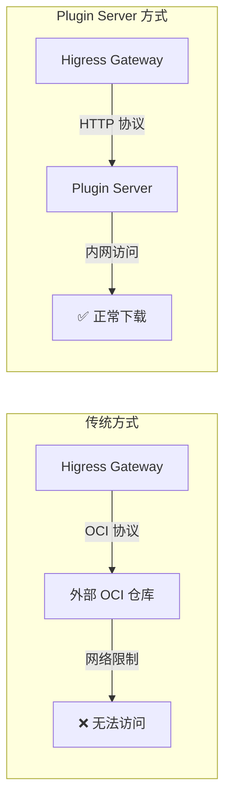
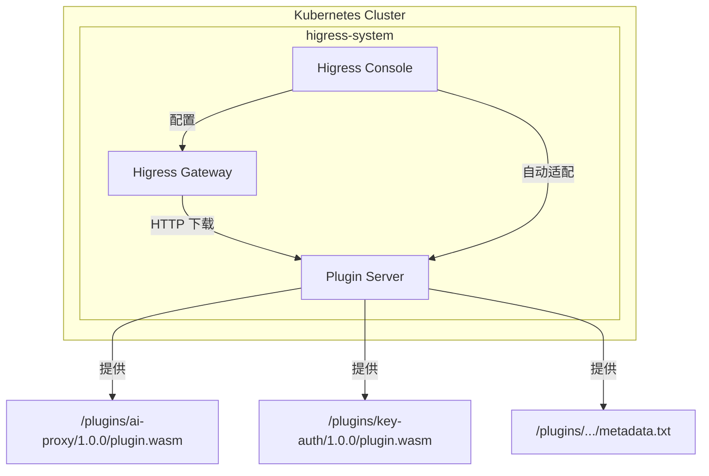
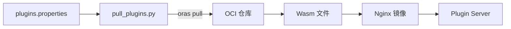

本文档详细介绍 Higress Plugin Server 的概念、架构、部署和使用方法，帮助用户在私有化环境中简化 Wasm 插件的分发与管理。

---

## 目录

1. [概述](#1-概述)
2. [背景与痛点](#2-背景与痛点)
3. [架构设计](#3-架构设计)
4. [部署指南](#4-部署指南)
5. [使用方法](#5-使用方法)
6. [高级配置](#6-高级配置)
7. [常见问题](#7-常见问题)
8. [参考资料](#8-参考资料)

---

## 1. 概述

### 1.1 什么是 Plugin Server

Higress Plugin Server 是 Higress 团队开发的一个轻量级 HTTP 文件服务器，专门用于分发 Wasm 插件。它解决了用户在私有化部署 Higress 网关时拉取插件的痛点，优化了插件的下载与管理效率。

> **参考来源**: [Higress Plugin Server：简化 Wasm 插件私有化部署难题](https://www.cnkirito.moe/higress-plugin-server/)

### 1.2 核心功能

| 功能 | 说明 |
|------|------|
| **HTTP 文件服务** | 提供基于 HTTP 协议的插件下载服务 |
| **版本管理** | 支持插件版本的组织和管理 |
| **元数据支持** | 提供插件的 MD5、大小等元数据信息 |
| **高可用部署** | 支持 K8s 多副本部署，保障服务 SLA |
| **开箱即用** | 与 Higress Console 自动集成 |

### 1.3 适用场景

- 🔒 **私有化部署环境**：无法访问外部公共 OCI 仓库
- 🏢 **企业内网环境**：对外部网络有严格限制
- 🚀 **快速部署场景**：不想搭建和维护 OCI 仓库
- 🔄 **插件迁移场景**：需要在不同环境间迁移插件

---

## 2. 背景与痛点

### 2.1 传统 OCI 机制的挑战

Higress Wasm 插件传统上依赖 OCI（Open Container Initiative）仓库进行分发，这在私有化部署场景中带来了以下问题：



| 痛点 | 描述 |
|------|------|
| **技术门槛高** | 需要熟悉 OCI 标准、oras 工具等 |
| **网络限制** | 私有化环境无法访问 Docker Hub 等公共仓库 |
| **额外基础设施** | 需要单独部署和维护内部 OCI 仓库 |
| **插件迁移困难** | 不同环境间迁移需要手动处理 |

> **参考来源**: [Higress Plugin Server：简化 Wasm 插件私有化部署难题](https://www.cnkirito.moe/higress-plugin-server/)

### 2.2 Plugin Server 的解决方案

Plugin Server 采用简单的 HTTP 协议替代复杂的 OCI 机制：

- ✅ 无需 OCI 仓库，降低部署复杂度
- ✅ 基于 HTTP 协议，易于集成和调试
- ✅ 内置所有官方插件，开箱即用
- ✅ 与 Higress Console 自动集成

---

## 3. 架构设计

### 3.1 整体架构



### 3.2 组件说明

| 组件 | 说明 |
|------|------|
| **Plugin Server** | 基于 Nginx 的静态文件服务器，提供插件下载 |
| **Higress Gateway** | 通过 HTTP 协议从 Plugin Server 拉取插件 |
| **Higress Console** | 自动检测 Plugin Server 并配置下载 URL |

### 3.3 插件目录结构

Plugin Server 内部的插件按照以下结构组织：

```
/usr/share/nginx/html/plugins/
├── ai-proxy/
│   └── 1.0.0/
│       ├── plugin.wasm      # 插件二进制文件
│       └── metadata.txt     # 插件元数据
├── key-auth/
│   └── 1.0.0/
│       ├── plugin.wasm
│       └── metadata.txt
├── jwt-auth/
│   └── 1.0.0/
│       ├── plugin.wasm
│       └── metadata.txt
└── ...
```

### 3.4 构建流程

Plugin Server 镜像的构建采用多阶段构建：



> **参考来源**: [GitHub - higress-group/plugin-server](https://github.com/higress-group/plugin-server)

---

## 4. 部署指南

### 4.1 一键部署（推荐）

从 Higress v2.1.5 开始，只需在安装时添加一个参数即可同时部署 Plugin Server：

```bash
# 添加 Helm 仓库
helm repo add higress.io https://higress.cn/helm-charts

# 安装 Higress 并启用 Plugin Server
helm install higress -n higress-system higress.io/higress \
  --create-namespace \
  --set global.enablePluginServer=true \
  --render-subchart-notes
```

### 4.2 验证部署

```bash
# 查看 Plugin Server Pod 状态
kubectl get pods -n higress-system -l app=higress-plugin-server

# 预期输出
NAME                                     READY   STATUS    RESTARTS   AGE
higress-plugin-server-xxxxxxxxxx-xxxxx   1/1     Running   0          1m
higress-plugin-server-xxxxxxxxxx-yyyyy   1/1     Running   0          1m
```

### 4.3 存量版本部署

对于已部署的 Higress 版本，可以单独部署 Plugin Server：

**步骤 1：创建 Deployment**

```yaml
# plugin-server-deployment.yaml
apiVersion: apps/v1
kind: Deployment
metadata:
  name: higress-plugin-server
  namespace: higress-system
spec:
  replicas: 2
  selector:
    matchLabels:
      app: higress-plugin-server
  template:
    metadata:
      labels:
        app: higress-plugin-server
    spec:
      containers:
      - name: plugin-server
        image: higress-registry.cn-hangzhou.cr.aliyuncs.com/higress/plugin-server:1.0.0
        ports:
        - containerPort: 8080
        resources:
          requests:
            cpu: 100m
            memory: 128Mi
          limits:
            cpu: 500m
            memory: 256Mi
```

**步骤 2：创建 Service**

```yaml
# plugin-server-service.yaml
apiVersion: v1
kind: Service
metadata:
  name: higress-plugin-server
  namespace: higress-system
spec:
  selector:
    app: higress-plugin-server
  ports:
  - port: 80
    targetPort: 8080
    protocol: TCP
```

**步骤 3：应用配置**

```bash
kubectl apply -f plugin-server-deployment.yaml
kubectl apply -f plugin-server-service.yaml
```

**步骤 4：配置 Console 环境变量**

修改 Higress Console 的 Deployment，添加环境变量：

```bash
kubectl set env deployment/higress-console -n higress-system \
  HIGRESS_ADMIN_WASM_PLUGIN_CUSTOM_IMAGE_URL_PATTERN="http://higress-plugin-server.higress-system.svc/plugins/\${name}/\${version}/plugin.wasm"
```

> **参考来源**: [GitHub - alibaba/higress - helm/core/templates](https://github.com/alibaba/higress/blob/main/helm/core/templates/plugin-server-deployment.yaml)

---

## 5. 使用方法

### 5.1 自动适配

启用 Plugin Server 后，Higress Console 会自动将插件下载 URL 配置为：

```
http://higress-plugin-server.higress-system.svc/plugins/${name}/${version}/plugin.wasm
```

无需任何额外配置，即可在 Console 的插件管理页面使用内置插件。

### 5.2 验证插件下载

进入 Higress Gateway Pod 内部验证：

```bash
# 获取 Gateway Pod 名称
GATEWAY_POD=$(kubectl get pods -n higress-system -l app=higress-gateway -o jsonpath='{.items[0].metadata.name}')

# 验证插件元数据
kubectl exec -it $GATEWAY_POD -n higress-system -- \
  curl http://higress-plugin-server.higress-system.svc/plugins/key-auth/1.0.0/metadata.txt

# 预期输出示例
# name: key-auth
# version: 1.0.0
# size: 1234567
# md5: abc123def456...
# created: 2024-01-01T00:00:00Z
```

### 5.3 查看可用插件列表

```bash
# 查看插件目录
kubectl exec -it $GATEWAY_POD -n higress-system -- \
  curl http://higress-plugin-server.higress-system.svc/plugins/
```

### 5.4 下载特定插件

```bash
# 下载 ai-proxy 插件
curl -O http://higress-plugin-server.higress-system.svc/plugins/ai-proxy/1.0.0/plugin.wasm
```

---

## 6. 高级配置

### 6.1 自定义插件镜像

如果需要添加自定义 Wasm 插件，可以构建自己的 Plugin Server 镜像：

**步骤 1：克隆仓库**

```bash
git clone https://github.com/higress-group/plugin-server.git
cd plugin-server
```

**步骤 2：修改插件列表**

编辑 `plugins.properties` 文件，添加自定义插件：

```properties
# 官方插件
ai-proxy=oci://higress-registry.cn-hangzhou.cr.aliyuncs.com/plugins/ai-proxy:1.0.0
key-auth=oci://higress-registry.cn-hangzhou.cr.aliyuncs.com/plugins/key-auth:1.0.0

# 自定义插件
my-custom-plugin=oci://your-registry.com/plugins/my-custom-plugin:1.0.0
```

**步骤 3：构建并推送镜像**

```bash
# 构建镜像
docker build -t your-registry.com/higress/plugin-server:custom .

# 推送镜像
docker push your-registry.com/higress/plugin-server:custom
```

**步骤 4：使用自定义镜像部署**

```bash
helm install higress -n higress-system higress.io/higress \
  --create-namespace \
  --set global.enablePluginServer=true \
  --set pluginServer.hub=your-registry.com/higress \
  --set pluginServer.tag=custom \
  --render-subchart-notes
```

### 6.2 将自己开发的插件放入 Plugin Server

本节详细介绍如何将自己开发的 Wasm 插件集成到 Plugin Server 中。

#### 6.2.1 方式一：通过 OCI 仓库集成（推荐）

这是最标准的方式，适合已有私有 OCI 仓库的场景。

**前提条件**：
- 已完成自定义插件的开发和编译（参考 [Higress 自定义插件部署指南](./higress-custom-plugin-deployment-guide.md)）
- 已将插件推送到私有 OCI 仓库

**步骤 1：将插件推送到 OCI 仓库**

```bash
# 编译插件
cd my-custom-plugin
go mod tidy
GOOS=wasip1 GOARCH=wasm go build -buildmode=c-shared -o main.wasm ./

# 创建 Dockerfile
cat > Dockerfile << 'EOF'
FROM scratch
COPY main.wasm plugin.wasm
EOF

# 构建并推送插件镜像
docker build -t your-registry.com/plugins/my-custom-plugin:1.0.0 .
docker push your-registry.com/plugins/my-custom-plugin:1.0.0
```

**步骤 2：修改 Plugin Server 的 plugins.properties**

```bash
# 克隆 Plugin Server 仓库
git clone https://github.com/higress-group/plugin-server.git
cd plugin-server

# 编辑 plugins.properties，添加自定义插件
cat >> plugins.properties << 'EOF'

# 自定义插件
my-custom-plugin=oci://your-registry.com/plugins/my-custom-plugin:1.0.0
my-auth-plugin=oci://your-registry.com/plugins/my-auth-plugin:1.0.0
EOF
```

**步骤 3：构建自定义 Plugin Server 镜像**

```bash
# 构建镜像（需要能访问 OCI 仓库）
docker build -t your-registry.com/higress/plugin-server:custom .

# 推送镜像
docker push your-registry.com/higress/plugin-server:custom
```

#### 6.2.2 方式二：直接将 Wasm 文件打包到镜像（离线场景）

适合完全离线或不想使用 OCI 仓库的场景。

**步骤 1：准备插件文件**

```bash
# 创建工作目录
mkdir -p custom-plugin-server/plugins

# 复制官方 Plugin Server 的基础文件
git clone https://github.com/higress-group/plugin-server.git
cp plugin-server/nginx.conf custom-plugin-server/

# 创建自定义插件目录结构
mkdir -p custom-plugin-server/plugins/my-custom-plugin/1.0.0

# 复制编译好的 wasm 文件
cp /path/to/my-custom-plugin/main.wasm \
   custom-plugin-server/plugins/my-custom-plugin/1.0.0/plugin.wasm
```

**步骤 2：生成插件元数据**

```bash
# 进入插件目录
cd custom-plugin-server/plugins/my-custom-plugin/1.0.0

# 生成 metadata.txt
cat > metadata.txt << EOF
name: my-custom-plugin
version: 1.0.0
size: $(stat -f%z plugin.wasm 2>/dev/null || stat -c%s plugin.wasm)
md5: $(md5sum plugin.wasm | awk '{print $1}')
created: $(date -u +"%Y-%m-%dT%H:%M:%SZ")
description: 我的自定义插件
EOF
```

**步骤 3：创建自定义 Dockerfile**

```dockerfile
# custom-plugin-server/Dockerfile
FROM docker.io/nginx:alpine

# 复制自定义插件
COPY plugins /usr/share/nginx/html/plugins

# 复制 Nginx 配置
COPY nginx.conf /etc/nginx/nginx.conf

EXPOSE 8080
CMD ["nginx", "-g", "daemon off;"]
```

**步骤 4：构建并部署**

```bash
cd custom-plugin-server

# 构建镜像
docker build -t your-registry.com/higress/plugin-server:custom .

# 推送镜像
docker push your-registry.com/higress/plugin-server:custom

# 部署
helm upgrade higress -n higress-system higress.io/higress \
  --set global.enablePluginServer=true \
  --set pluginServer.hub=your-registry.com/higress \
  --set pluginServer.tag=custom
```

#### 6.2.3 方式三：混合模式（官方插件 + 自定义插件）

将官方插件和自定义插件合并到同一个 Plugin Server 镜像中。

**步骤 1：基于官方镜像扩展**

```dockerfile
# Dockerfile
FROM higress-registry.cn-hangzhou.cr.aliyuncs.com/higress/plugin-server:1.0.0

# 添加自定义插件
COPY my-custom-plugin/1.0.0 /usr/share/nginx/html/plugins/my-custom-plugin/1.0.0
COPY my-auth-plugin/1.0.0 /usr/share/nginx/html/plugins/my-auth-plugin/1.0.0
```

**步骤 2：准备插件文件**

```bash
# 创建目录结构
mkdir -p my-custom-plugin/1.0.0
mkdir -p my-auth-plugin/1.0.0

# 复制 wasm 文件并重命名为 plugin.wasm
cp /path/to/my-custom-plugin.wasm my-custom-plugin/1.0.0/plugin.wasm
cp /path/to/my-auth-plugin.wasm my-auth-plugin/1.0.0/plugin.wasm

# 生成元数据
for plugin in my-custom-plugin my-auth-plugin; do
  cd $plugin/1.0.0
  cat > metadata.txt << EOF
name: $plugin
version: 1.0.0
size: $(stat -f%z plugin.wasm 2>/dev/null || stat -c%s plugin.wasm)
md5: $(md5sum plugin.wasm | awk '{print $1}')
created: $(date -u +"%Y-%m-%dT%H:%M:%SZ")
EOF
  cd ../..
done
```

**步骤 3：构建并部署**

```bash
docker build -t your-registry.com/higress/plugin-server:custom .
docker push your-registry.com/higress/plugin-server:custom
```

#### 6.2.4 在 Console 中使用自定义插件

部署完成后，在 Higress Console 中配置自定义插件：

**方式 A：通过 Console UI**

1. 登录 Higress Console
2. 进入 **插件市场** → 点击 **创建** 按钮
3. 填写插件信息：
   - **插件名称**: my-custom-plugin
   - **镜像地址**: `http://higress-plugin-server.higress-system.svc/plugins/my-custom-plugin/1.0.0/plugin.wasm`
4. 点击 **确定** 创建插件

**方式 B：通过 WasmPlugin CRD**

```yaml
apiVersion: extensions.higress.io/v1alpha1
kind: WasmPlugin
metadata:
  name: my-custom-plugin
  namespace: higress-system
spec:
  defaultConfig:
    # 插件配置
    key: value
  # 使用 HTTP URL 而非 OCI URL
  url: http://higress-plugin-server.higress-system.svc/plugins/my-custom-plugin/1.0.0/plugin.wasm
  phase: UNSPECIFIED_PHASE
  priority: 100
```

```bash
kubectl apply -f my-custom-plugin.yaml
```

#### 6.2.5 自动化构建流程（CI/CD）

推荐使用 GitHub Actions 自动化构建 Plugin Server 镜像：

```yaml
# .github/workflows/build-plugin-server.yaml
name: Build Custom Plugin Server

on:
  push:
    paths:
      - 'plugins/**'
      - 'Dockerfile'

jobs:
  build:
    runs-on: ubuntu-latest
    steps:
      - uses: actions/checkout@v4

      - name: Set up Go
        uses: actions/setup-go@v5
        with:
          go-version: '1.24'

      - name: Build Wasm plugins
        run: |
          for plugin in plugins/*/; do
            cd "$plugin"
            go mod tidy
            GOOS=wasip1 GOARCH=wasm go build -buildmode=c-shared -o plugin.wasm ./
            cd -
          done

      - name: Generate metadata
        run: |
          for plugin in plugins/*/; do
            name=$(basename "$plugin")
            cd "$plugin"
            cat > metadata.txt << EOF
          name: $name
          version: 1.0.0
          size: $(stat -c%s plugin.wasm)
          md5: $(md5sum plugin.wasm | awk '{print $1}')
          created: $(date -u +"%Y-%m-%dT%H:%M:%SZ")
          EOF
            cd -
          done

      - name: Build and push Docker image
        uses: docker/build-push-action@v5
        with:
          context: .
          push: true
          tags: your-registry.com/higress/plugin-server:${{ github.sha }}
```

> **参考来源**:
> - [Higress 自定义插件部署指南](./higress-custom-plugin-deployment-guide.md)
> - [GitHub - higress-group/plugin-server](https://github.com/higress-group/plugin-server)

### 6.3 配置副本数

```bash
# 设置 Plugin Server 副本数为 3
helm upgrade higress -n higress-system higress.io/higress \
  --set global.enablePluginServer=true \
  --set pluginServer.replicas=3
```

### 6.4 资源限制配置

```yaml
# values.yaml
pluginServer:
  resources:
    requests:
      cpu: 200m
      memory: 256Mi
    limits:
      cpu: 1000m
      memory: 512Mi
```

### 6.5 手动指定插件 URL

如果不使用 Plugin Server，仍可通过环境变量手动配置插件 URL：

```bash
kubectl set env deployment/higress-console -n higress-system \
  HIGRESS_ADMIN_WASM_PLUGIN_CUSTOM_IMAGE_URL_PATTERN="https://your-cdn.com/plugins/\${name}/\${version}/plugin.wasm"
```

> **注意**: 手动配置的 URL 优先级高于 Plugin Server 自动配置。

---

## 7. 常见问题

### Q1: Plugin Server 与 OCI 方式可以共存吗？

**A**: 可以。Plugin Server 与 OCI 方式互不干扰。用户可以：
- 使用 Plugin Server 分发官方插件
- 使用 OCI 仓库分发自定义插件

### Q2: 如何更新 Plugin Server 中的插件？

**A**: 更新 Plugin Server 镜像版本即可。当 Higress 发布新版本时，会同步更新 Plugin Server 镜像中的插件。

```bash
helm upgrade higress -n higress-system higress.io/higress \
  --set global.enablePluginServer=true \
  --set pluginServer.tag=1.0.1
```

### Q3: Plugin Server 支持哪些插件？

**A**: Plugin Server 内置了 Higress 官方的所有 Wasm 插件，包括：

| 类别 | 插件 |
|------|------|
| **AI 插件** | ai-proxy, ai-cache, ai-prompt, ai-statistics 等 |
| **认证插件** | key-auth, jwt-auth, basic-auth, hmac-auth 等 |
| **流量插件** | request-block, key-rate-limit, cluster-key-rate-limit 等 |
| **安全插件** | waf, bot-detect, ip-restriction 等 |
| **转换插件** | transformer, de-graphql, frontend-gray 等 |

### Q4: 如何查看 Plugin Server 日志？

```bash
kubectl logs -n higress-system -l app=higress-plugin-server -f
```

### Q5: Plugin Server 的 imagePullPolicy 策略如何工作？

**A**: 当前版本中，如果设置为 `Always` 策略，网关会每次请求 `plugin.wasm` 文件。未来版本会利用 `metadata.txt` 中的 MD5 信息实现智能缓存，避免不必要的重复下载。

### Q6: 如何在离线环境中使用 Plugin Server？

**A**:
1. 在有网络的环境中拉取 Plugin Server 镜像
2. 将镜像导出并传输到离线环境
3. 在离线环境的私有仓库中导入镜像
4. 部署时指定私有仓库地址

```bash
# 导出镜像
docker save higress-registry.cn-hangzhou.cr.aliyuncs.com/higress/plugin-server:1.0.0 -o plugin-server.tar

# 导入镜像（离线环境）
docker load -i plugin-server.tar
docker tag higress-registry.cn-hangzhou.cr.aliyuncs.com/higress/plugin-server:1.0.0 \
  your-private-registry.com/higress/plugin-server:1.0.0
docker push your-private-registry.com/higress/plugin-server:1.0.0
```

---

## 8. 参考资料

| 资源 | 链接 |
|------|------|
| Higress Plugin Server 博客 | https://www.cnkirito.moe/higress-plugin-server/ |
| Plugin Server GitHub 仓库 | https://github.com/higress-group/plugin-server |
| Higress 官方文档 | https://higress.cn/docs/latest/ |
| 自定义插件文档 | https://higress.cn/docs/latest/plugins/custom/ |
| Higress Helm Chart | https://github.com/alibaba/higress/tree/main/helm |
| MCP 网关实战 | https://nacos.io/en/blog/nacos-gvr7dx_awbbpb_ahggmtqmxwndm22k/ |

---

## 附录：Plugin Server 配置参数

### Helm Values 参数

| 参数 | 默认值 | 说明 |
|------|--------|------|
| `global.enablePluginServer` | `false` | 是否启用 Plugin Server |
| `pluginServer.name` | `higress-plugin-server` | 服务名称 |
| `pluginServer.replicas` | `2` | 副本数 |
| `pluginServer.hub` | `higress-registry.cn-hangzhou.cr.aliyuncs.com/higress` | 镜像仓库 |
| `pluginServer.image` | `plugin-server` | 镜像名称 |
| `pluginServer.tag` | `1.0.0` | 镜像版本 |
| `pluginServer.urlPattern` | `http://higress-plugin-server.higress-system.svc/plugins/${name}/${version}/plugin.wasm` | 插件 URL 模式 |

### 环境变量

| 环境变量 | 说明 |
|----------|------|
| `HIGRESS_ADMIN_WASM_PLUGIN_CUSTOM_IMAGE_URL_PATTERN` | 自定义插件 URL 模式，优先级高于 Plugin Server 自动配置 |

---
