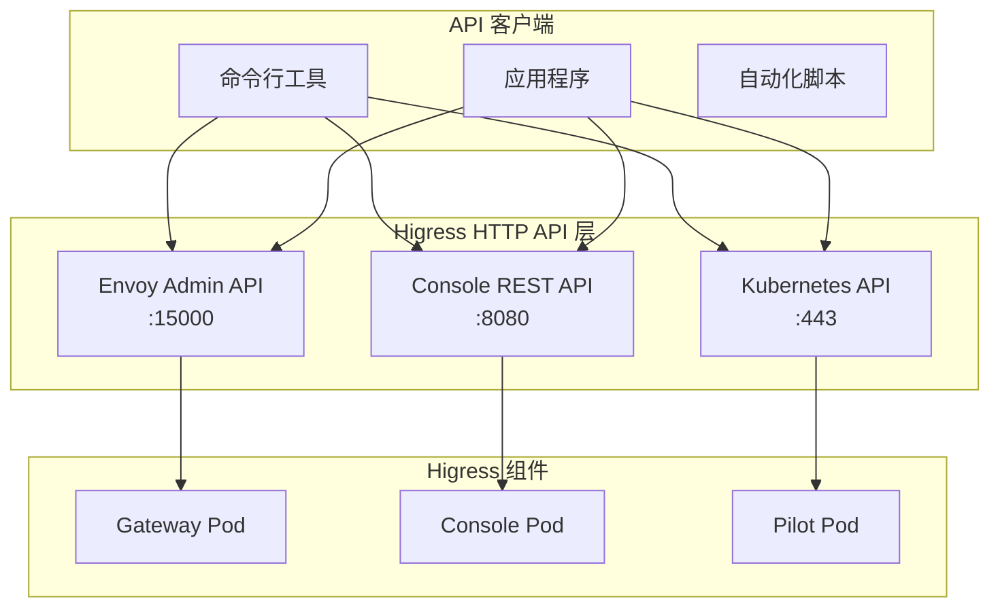
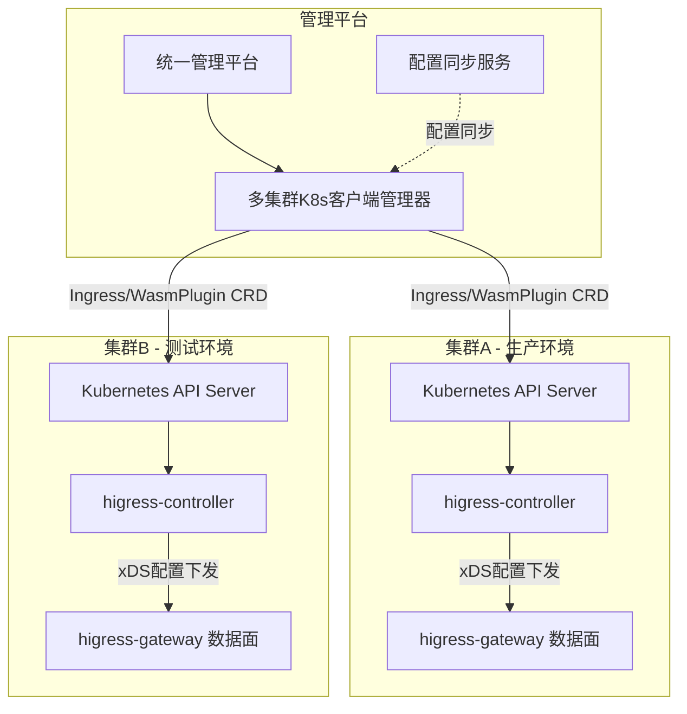

本文档说明 Higress 提供的各种 REST API 及其使用方式。

> **说明**：本文档介绍的是 Higress 的 REST API 编程接口（命令式调用）。如需了解 Kubernetes Gateway API 声明式配置，请参考 [Higress Gateway API 使用指南](./higress-gateway-crd-guide.md)。

---

## 1. API 架构概览



### API 类型对比

| API 类型 | 端口 | 协议 | 用途 | 权限要求 |
|---------|------|------|------|---------|
| **Envoy Admin API** | 15000 | HTTP | 实时查看配置、统计、调试 | Pod 访问权限 |
| **Console REST API** | 8080 | HTTP/HTTPS | 网关配置管理、插件管理 | Console 登录凭证 |
| **Kubernetes API** | 443 | HTTPS | CRD 资源操作（Ingress/WasmPlugin） | RBAC 权限 |

---

## 2. Envoy Admin API

Gateway Pod 提供的本地管理接口，用于实时查看和调试网关状态。

### 2.1 访问方式

```bash
# 通过 kubectl exec 访问
GATEWAY_POD=$(kubectl get pods -n higress-system -l app=higress-gateway -o jsonpath='{.items[0].metadata.name}')
kubectl exec -n higress-system $GATEWAY_POD -- curl -s localhost:15000/help

# 通过 Port Forward 访问
kubectl port-forward -n higress-system deployment/higress-gateway 15000:15000
curl http://localhost:15000/help
```

### 2.2 核心 API 端点

| 端点 | 方法 | 描述 |
|------|------|------|
| `/help` | GET | 列出所有可用端点 |
| `/config_dump` | GET | 完整配置转储（JSON） |
| `/listeners` | GET | 监听器配置 |
| `/clusters` | GET | 集群配置 |
| `/routes` | GET | 路由配置 |
| `/endpoints` | GET | 端点配置 |
| `/stats` | GET | 统计指标 |
| `/stats/prometheus` | GET | Prometheus 格式指标 |
| `/healthchecks` | GET | 健康检查状态 |
| `/ready` | GET | 就绪状态 |
| `/logging` | GET/POST | 获取/设置日志级别 |

### 2.3 常用操作示例

```bash
# 获取完整配置
kubectl exec -n higress-system deployment/higress-gateway -- \
    curl -s localhost:15000/config_dump | jq '.configs'

# 获取集群状态
kubectl exec -n higress-system deployment/higress-gateway -- \
    curl -s localhost:15000/clusters | jq '.clusters[]'

# 获取 Prometheus 格式指标
kubectl exec -n higress-system deployment/higress-gateway -- \
    curl -s localhost:15000/stats/prometheus

# 设置日志级别
kubectl exec -n higress-system deployment/higress-gateway -- \
    curl -X POST "http://localhost:15000/logging?level=debug"
```

### 2.4 Go 语言客户端

```go
package main

import (
    "encoding/json"
    "io"
    "net/http"
    "time"
)

type EnvoyAdminClient struct {
    baseURL    string
    httpClient *http.Client
}

func NewEnvoyAdminClient(address string) *EnvoyAdminClient {
    return &EnvoyAdminClient{
        baseURL: "http://" + address + ":15000",
        httpClient: &http.Client{Timeout: 10 * time.Second},
    }
}

func (c *EnvoyAdminClient) GetConfigDump() (map[string]interface{}, error) {
    resp, err := c.httpClient.Get(c.baseURL + "/config_dump")
    if err != nil {
        return nil, err
    }
    defer resp.Body.Close()

    body, _ := io.ReadAll(resp.Body)
    var config map[string]interface{}
    json.Unmarshal(body, &config)
    return config, nil
}
```

---

## 3. Console REST API

Higress Console 提供了完整的 REST API 用于管理网关配置。

### 3.1 API 认证

```bash
# 登录获取 Token
curl -X POST http://console:8080/api/v1/user/login \
  -H "Content-Type: application/json" \
  -d '{"username": "admin", "password": "password"}'

# 响应: {"code": 200, "data": {"token": "...", "expire": 7200}}

# 使用 Token 访问
curl http://console:8080/api/v1/routes \
  -H "Authorization: Bearer <token>"
```

### 3.2 核心 API 端点

#### 路由管理

```bash
# 创建路由
curl -X POST http://console:8080/api/v1/routes \
  -H "Authorization: Bearer <token>" \
  -H "Content-Type: application/json" \
  -d '{
    "name": "example-route",
    "domain": ["example.com"],
    "paths": ["/api/*"],
    "serviceName": "example-service",
    "servicePort": 8080
  }'

# 获取路由列表
curl http://console:8080/api/v1/routes \
  -H "Authorization: Bearer <token>"

# 更新路由
curl -X PUT http://console:8080/api/v1/routes/example-route \
  -H "Authorization: Bearer <token>" \
  -H "Content-Type: application/json" \
  -d '{"domain": ["new-example.com"]}'

# 删除路由
curl -X DELETE http://console:8080/api/v1/routes/example-route \
  -H "Authorization: Bearer <token>"
```

#### 插件管理

```bash
# 创建插件
curl -X POST http://console:8080/api/v1/plugins \
  -H "Authorization: Bearer <token>" \
  -H "Content-Type: application/json" \
  -d '{
    "name": "ai-proxy",
    "type": "WasmPlugin",
    "phase": "DEFAULT",
    "priority": 300,
    "config": {
      "services": [{
        "provider": "openai",
        "api_tokens": ["sk-xxx"],
        "endpoint": "https://api.openai.com/v1"
      }]
    }
  }'

# 启用/禁用插件
curl -X POST http://console:8080/api/v1/plugins/ai-proxy/enable \
  -H "Authorization: Bearer <token>"

curl -X POST http://console:8080/api/v1/plugins/ai-proxy/disable \
  -H "Authorization: Bearer <token>"
```

#### 服务发现管理

```bash
# 创建 Nacos 服务发现
curl -X POST http://console:8080/api/v1/mcp-bridges \
  -H "Authorization: Bearer <token>" \
  -H "Content-Type: application/json" \
  -d '{
    "name": "nacos-bridge",
    "nacos": [{
      "name": "nacos-prod",
      "address": "nacos-prod.example.com:8848",
      "namespaceId": "prod"
    }]
  }'
```

### 3.3 Go 语言客户端

```go
package main

import (
    "bytes"
    "encoding/json"
    "io"
    "net/http"
    "time"
)

type ConsoleClient struct {
    baseURL    string
    token      string
    httpClient *http.Client
}

func NewConsoleClient(baseURL, username, password string) (*ConsoleClient, error) {
    client := &ConsoleClient{
        baseURL: baseURL,
        httpClient: &http.Client{Timeout: 30 * time.Second},
    }
    client.Login(username, password)
    return client, nil
}

func (c *ConsoleClient) Login(username, password string) error {
    payload := map[string]string{"username": username, "password": password}
    body, _ := json.Marshal(payload)

    resp, _ := c.httpClient.Post(c.baseURL+"/api/v1/user/login", "application/json", bytes.NewBuffer(body))
    defer resp.Body.Close()

    var result struct {
        Code int `json:"code"`
        Data struct {
            Token string `json:"token"`
        } `json:"data"`
    }
    json.NewDecoder(resp.Body).Decode(&result)
    c.token = result.Data.Token
    return nil
}

func (c *ConsoleClient) CreateRoute(route RouteConfig) error {
    return c.doRequest("POST", "/api/v1/routes", route)
}

func (c *ConsoleClient) doRequest(method, path string, body interface{}) error {
    var reqBody io.Reader
    if body != nil {
        jsonBody, _ := json.Marshal(body)
        reqBody = bytes.NewBuffer(jsonBody)
    }

    req, _ := http.NewRequest(method, c.baseURL+path, reqBody)
    req.Header.Set("Content-Type", "application/json")
    req.Header.Set("Authorization", "Bearer "+c.token)

    resp, err := c.httpClient.Do(req)
    if err != nil {
        return err
    }
    defer resp.Body.Close()
    return nil
}
```

---

## 4. Kubernetes API (推荐用于平台管理)

通过 Kubernetes API 操作 CRD 资源（Ingress、WasmPlugin、McpBridge），这是平台管理多个 Higress 数据面的推荐方式。

### 4.1 Go 语言客户端

```go
package main

import (
    "context"
    networkingv1 "k8s.io/api/networking/v1"
    metav1 "k8s.io/apimachinery/pkg/apis/meta/v1"
    "k8s.io/client-go/kubernetes"
    "k8s.io/client-go/tools/clientcmd"
)

type HigressClient struct {
    clientSet *kubernetes.Clientset
}

func NewHigressClient(kubeconfig string) (*HigressClient, error) {
    config, err := clientcmd.BuildConfigFromFlags("", kubeconfig)
    if err != nil {
        return nil, err
    }
    clientSet, err := kubernetes.NewForConfig(config)
    return &HigressClient{clientSet: clientSet}, err
}

func (c *HigressClient) CreateIngress(namespace, name, host, serviceName string, servicePort int32) error {
    pathTypePrefix := networkingv1.PathTypePrefix
    ingressClassName := "higress"

    ingress := &networkingv1.Ingress{
        ObjectMeta: metav1.ObjectMeta{
            Name:      name,
            Namespace: namespace,
        },
        Spec: networkingv1.IngressSpec{
            IngressClassName: &ingressClassName,
            Rules: []networkingv1.IngressRule{
                {
                    Host: host,
                    IngressRuleValue: networkingv1.IngressRuleValue{
                        HTTP: &networkingv1.HTTPIngressRuleValue{
                            Paths: []networkingv1.HTTPIngressPath{
                                {
                                    Path:     "/",
                                    PathType: &pathTypePrefix,
                                    Backend: networkingv1.IngressBackend{
                                        Service: &networkingv1.IngressServiceBackend{
                                            Name: serviceName,
                                            Port: networkingv1.ServiceBackendPort{Number: servicePort},
                                        },
                                    },
                                },
                            },
                        },
                    },
                },
            },
        },
    }

    _, err := c.clientSet.NetworkingV1().Ingresses(namespace).Create(context.TODO(), ingress, metav1.CreateOptions{})
    return err
}
```

### 4.2 Python 语言客户端

```python
from kubernetes import client, config

class HigressController:
    def __init__(self, kubeconfig_path=None):
        if kubeconfig_path:
            config.load_kube_config(config_file=kubeconfig_path)
        else:
            config.load_incluster_config()
        self.networking_v1 = client.NetworkingV1Api()
        self.custom_api = client.CustomObjectsApi()

    def create_ingress(self, namespace, name, host, service_name, service_port):
        ingress = {
            "apiVersion": "networking.k8s.io/v1",
            "kind": "Ingress",
            "metadata": {"name": name, "namespace": namespace},
            "spec": {
                "ingressClassName": "higress",
                "rules": [{
                    "host": host,
                    "http": {
                        "paths": [{
                            "path": "/",
                            "pathType": "Prefix",
                            "backend": {
                                "service": {
                                    "name": service_name,
                                    "port": {"number": service_port}
                                }
                            }
                        }]
                    }
                }]
            }
        }
        return self.networking_v1.create_namespaced_ingress(namespace=namespace, body=ingress)
```

---

## 5. 多数据面管理方案 (多集群)

对于需要**平台统一管理多个 Higress 数据面**的场景，推荐使用 Kubernetes API 方案。

### 5.1 多数据面管理架构



### 5.2 方案选型对比

| 方案 | 适用场景 | 优点 | 缺点 | 推荐度 |
|------|---------|------|------|--------|
| **Kubernetes API** | 平台管理多个数据面 | 官方标准、配置持久化、支持 GitOps | 需要管理多个 kubeconfig | ⭐⭐⭐⭐⭐ |
| **Console REST API** | 单集群管理 | HTTP 接口简单 | 需每个集群部署 Console | ⭐⭐⭐ |
| **Envoy Admin API** | 调试和监控 | 实时查看配置 | 只读为主 | ⭐⭐ |

### 5.3 多集群客户端管理 (Go)

```go
package main

import (
    "context"
    "sync"
    networkingv1 "k8s.io/api/networking/v1"
    metav1 "k8s.io/apimachinery/pkg/apis/meta/v1"
    "k8s.io/client-go/kubernetes"
    "k8s.io/client-go/tools/clientcmd"
)

type ClusterConfig struct {
    Name       string
    KubeConfig string
}

type MultiClusterManager struct {
    clusters map[string]*kubernetes.Clientset
    mu       sync.RWMutex
}

func NewMultiClusterManager() *MultiClusterManager {
    return &MultiClusterManager{
        clusters: make(map[string]*kubernetes.Clientset),
    }
}

func (m *MultiClusterManager) AddCluster(cfg ClusterConfig) error {
    m.mu.Lock()
    defer m.mu.Unlock()

    config, err := clientcmd.BuildConfigFromFlags("", cfg.KubeConfig)
    if err != nil {
        return err
    }

    clientset, err := kubernetes.NewForConfig(config)
    if err != nil {
        return err
    }

    m.clusters[cfg.Name] = clientset
    return nil
}

func (m *MultiClusterManager) SyncIngressToAllClusters(
    namespace string,
    ingress *networkingv1.Ingress,
) map[string]error {
    results := make(map[string]error)
    var wg sync.WaitGroup

    for _, clusterName := range m.ListClusters() {
        wg.Add(1)
        go func(cluster string) {
            defer wg.Done()
            client := m.clusters[cluster]
            _, err := client.NetworkingV1().Ingresses(namespace).Create(
                context.Background(), ingress, metav1.CreateOptions{},
            )
            results[cluster] = err
        }(clusterName)
    }

    wg.Wait()
    return results
}

func (m *MultiClusterManager) ListClusters() []string {
    m.mu.RLock()
    defer m.mu.RUnlock()
    clusters := make([]string, 0, len(m.clusters))
    for name := range m.clusters {
        clusters = append(clusters, name)
    }
    return clusters
}
```

### 5.4 配置同步策略

```go
// 同步策略类型
type SyncStrategy string

const (
    SyncStrategyAll        SyncStrategy = "all"         // 同步到所有集群
    SyncStrategySelective  SyncStrategy = "selective"   // 选择性同步
    SyncStrategyCanary     SyncStrategy = "canary"      // 金丝雀发布
)

type SyncConfig struct {
    Strategy       SyncStrategy
    TargetClusters []string
    CanaryOrder    []string
    WaitTime       time.Duration
}

// 金丝雀发布示例: dev -> test -> prod
syncManager.SyncIngressWithStrategy("default", ingress, SyncConfig{
    Strategy:    SyncStrategyCanary,
    CanaryOrder: []string{"dev", "test", "prod"},
    WaitTime:    5 * time.Minute,
})
```

---

## 6. API 错误处理

### 常见错误码

| 错误码 | 描述 | 处理方法 |
|-------|------|---------|
| 401 | 未认证 | 检查 token 是否有效 |
| 403 | 权限不足 | 检查 RBAC 配置 |
| 404 | 资源不存在 | 确认资源名称 |
| 409 | 资源冲突 | 资源已存在，先删除再创建 |
| 500 | 内部错误 | 查看 Gateway 日志 |

---

## 7. 参考资料

- [Envoy Admin API 文档](https://www.envoyproxy.io/docs/envoy/latest/operations/admin)
- [Higress 官方文档](https://higress.cn/docs)
- [Higress GitHub](https://github.com/alibaba/higress)
- [Kubernetes API 文档](https://kubernetes.io/docs/reference/kubernetes-api/)
- [Kubernetes Client-go 文档](https://github.com/kubernetes/client-go)
- [多数据面快速入门](./higress-multi-dataplane-quickstart.md)
