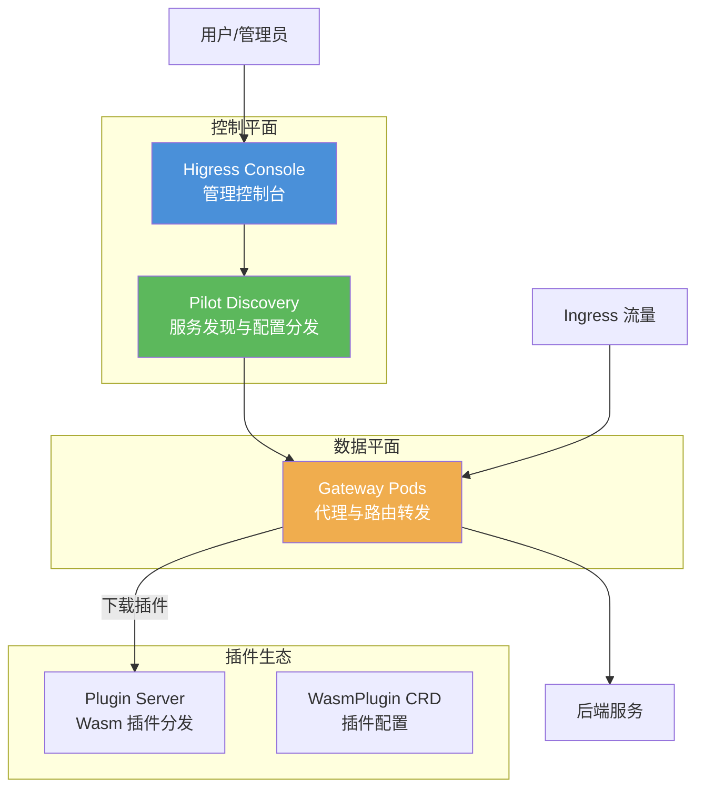

## 核心特性

- **Gateway API 标准**：完整支持 Kubernetes Gateway API v1.0.0
- **多集群路由**：支持跨集群服务发现和就近访问
- **Wasm 插件**：支持热更新和动态加载的 Wasm 插件生态
- **高性能**：基于 Envoy，提供卓越的代理性能
- **REST API**：提供完整的 REST API 用于配置管理

## 技术架构

## 文档目录

### 部署与快速入门

| 文档 | 描述 |
|------|------|
| [部署运维指南](./higress-operation-guide.md) | Higress 部署、配置和运维操作指南 |
| [配置参数参考](./higress-values-reference.md) | Helm Chart 配置参数完整参考 |
| [多实例部署](./higress-multi-instance-deployment.md) | Higress 多实例部署方案 |
| [多数据面入门](./higress-multi-dataplane-quickstart.md) | 多数据面快速入门指南 |

### 架构与原理

| 文档 | 描述 |
|------|------|
| [Pilot 原理](./higress-pilot-working-principle.md) | Pilot 组件工作原理详解 |
| [数据面控制机制](./console-数据面控制机制分析.md) | Console 与数据面控制机制分析 |
| [资源存储机制](./higress-k8s-resource-storage.md) | K8s 资源存储机制详解 |

### API 使用指南

| 文档 | 描述 |
|------|------|
| [Gateway API 指南](./higress-gateway-crd-guide.md) | Kubernetes Gateway API (CRD) 使用指南 |
| [REST API 指南](./higress-rest-api-guide.md) | Higress REST API 编程接口指南 |
| [Admin SDK 指南](./higress-admin-sdk-guide.md) | Java Admin SDK 使用指南 |

### 插件开发

| 文档 | 描述 |
|------|------|
| [插件服务器](./higress-plugin-server-guide.md) | 插件服务器配置与使用 |
| [自定义插件部署](./higress-custom-plugin-deployment-guide.md) | 自定义插件部署指南 |

> 💡 **WASM 插件专题**：查看 [Higress WASM 插件](../higress-wasm/) 了解更多 WASM 插件技术细节，包括 [AI 缓存插件深度解析](../higress-wasm/79731130-ai-cache-plugin-deep-dive.md) 等专题文章。

### 多集群与跨集群路由

| 文档 | 描述 |
|------|------|
| [多集群路由](./higress-multi-cluster-routing.md) | 跨集群路由和就近集群访问方案 |

## 官方资源

- [Higress 官方文档](https://higress.io/docs/)
- [Higress GitHub](https://github.com/alibaba/higress)
- [Kubernetes Gateway API](https://gateway-api.sigs.k8s.io/)
