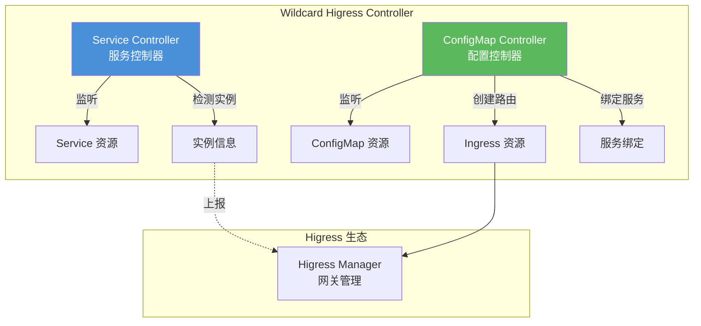
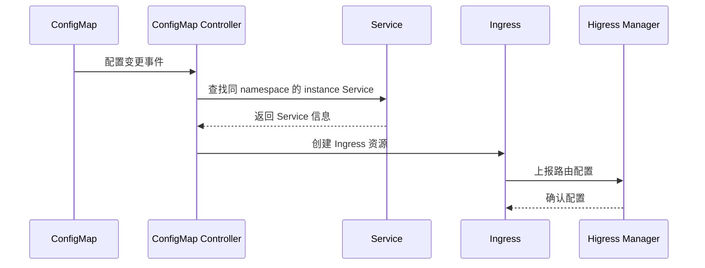
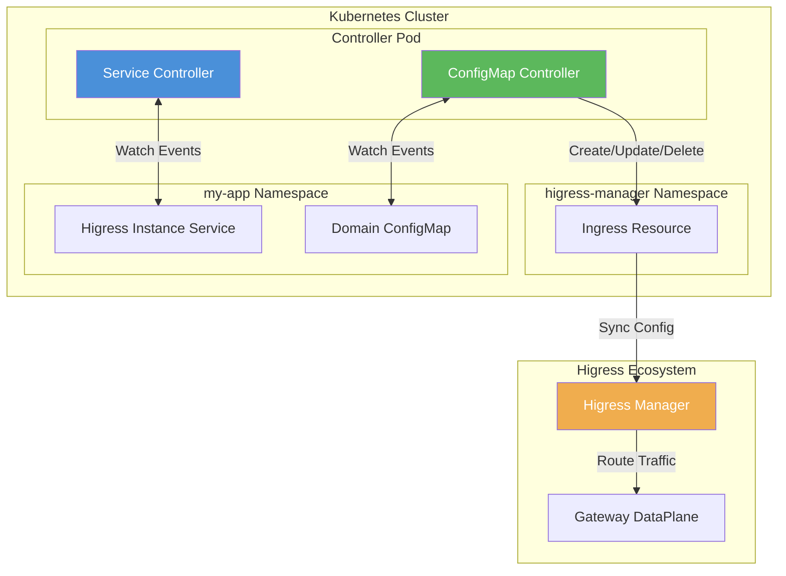

## 背景与痛点

在微服务架构中，API 网关是不可或缺的核心组件。Higress 作为阿里云开源的云原生 API 网关，凭借其高性能 Wasm 插件机制和完整的 Ingress 能力，已经成为众多企业的首选。然而，在多租户或多环境场景下，泛域名路由的管理往往面临以下挑战：

1. **手动配置繁琐**：每个新域名都需要手动创建 Ingress 资源
2. **运维成本高**：Service 与 Ingress 的绑定关系需要人工维护
3. **缺乏一致性**：不同命名空间的域名配置风格难以统一

`wildcard-higress` 正是为解决这些痛点而生的 Kubernetes Controller，它通过声明式配置的方式，实现了 Higress 泛域名路由的自动化管理。

## 核心功能

`wildcard-higress` 提供了两个核心 Controller，分别负责不同的资源管理职责：



### Service Controller

Service Controller 负责监听 Kubernetes Service 的所有生命周期事件，其核心职责包括：

| 功能 | 说明 |
|------|------|
| 生命周期监听 | 自动响应 Service 的创建、更新、删除事件 |
| 实例识别 | 通过 `higress/type: instance` 注解识别 Higress 实例 |
| 信息展示 | 自动打印关联的 Service 和 Pod 信息 |

### ConfigMap Controller

ConfigMap Controller 则专注于域名配置的管理：

| 功能 | 说明 |
|------|------|
| 域名配置 | 监听带有 `higress.io/config-map-type: domain` 标签的 ConfigMap |
| 自动路由创建 | 根据域名配置自动生成对应的 Ingress 资源 |
| 服务绑定 | 自动将 Ingress 绑定到同命名空间下的 instance Service |
| 资源清理 | ConfigMap 删除时自动清理关联的 Ingress 资源 |

## 快速开始

### 前置要求

- Kubernetes 1.19+
- Helm 3.0+（可选）
- Go 1.21+（仅开发需要）

### 部署方式

#### 方式一：Helm 部署（推荐）

```bash
# 1. 创建 namespace
kubectl create namespace higress-manager

# 2. 安装 chart
helm install wildcard-higress ./charts/wildcard-higress \
  --namespace higress-manager \
  --set image.repository=wildcard-higress \
  --set image.tag=latest

# 3. 验证部署
kubectl get pods -n higress-manager
```

#### 方式二：Kustomize 部署

```bash
# 1. 应用配置
kubectl apply -k config/

# 2. 验证部署
kubectl get pods -n higress-manager
```

## 使用示例

### 创建 Higress 实例 Service

首先，创建一个带有特殊注解的 Service，标记为 Higress 实例：

```yaml
apiVersion: v1
kind: Service
metadata:
  name: my-higress-instance
  namespace: my-namespace
  annotations:
    higress/type: instance
spec:
  type: ClusterIP
  selector:
    app: my-app
  ports:
    - name: http
      port: 80
      targetPort: 8080
      protocol: TCP
```

Controller 会自动检测该 Service 并打印关联信息。

### 创建域名配置 ConfigMap

然后，通过 ConfigMap 声明域名配置：

```yaml
apiVersion: v1
kind: ConfigMap
metadata:
  name: domain-config
  namespace: my-namespace
  labels:
    higress.io/config-map-type: domain
data:
  domain: example.com
```

Controller 会自动完成以下操作：



1. 查找同命名空间下带有 `higress/type: instance` 注解的 Service
2. 在 `higress-manager` 命名空间创建对应的 Ingress
3. 设置 Ingress 的 `higress.io/destination` 指向目标 Service
4. 设置 Ingress 的 `higress.io/exact-match-header-Host` 为指定域名

## 完整部署示例

以下是一个完整的部署清单，展示了多资源协同工作的场景：

```yaml
---
# 1. 创建业务命名空间
apiVersion: v1
kind: Namespace
metadata:
  name: my-app

---
# 2. 创建 Higress 实例 Service
apiVersion: v1
kind: Service
metadata:
  name: higress-instance
  namespace: my-app
  annotations:
    higress/type: instance
spec:
  type: ClusterIP
  selector:
    app: my-app
  ports:
    - name: http
      port: 80
      targetPort: 8080

---
# 3. 创建域名配置
apiVersion: v1
kind: ConfigMap
metadata:
  name: app-domain
  namespace: my-app
  labels:
    higress.io/config-map-type: domain
data:
  domain: app.example.com
```

## 架构设计

### 整体架构



### 数据流设计

Controller 的核心数据流遵循以下原则：

1. **事件驱动**：基于 Kubernetes Informer 机制，实现高效的增量同步
2. **最终一致性**：通过 Finalizer 机制确保资源正确清理
3. **声明式配置**：用户只需声明期望状态，Controller 自动完成调谐

### 命令行参数

| 参数 | 默认值 | 描述 |
|------|--------|------|
| `--metrics-addr` | `:8080` | Prometheus 指标端点地址 |
| `--health-probe-bind-address` | `:8081` | 健康检查端点地址 |
| `--leader-elect` | `false` | 是否启用 Leader 选举 |
| `--leader-election-id` | `wildcard-higress-controller-lock` | Leader 选举锁 ID |
| `--higress-manager-namespace` | `higress-manager` | Higress Manager 命名空间 |

## 开发指南

### 本地开发环境

```bash
# 1. 克隆仓库
git clone https://github.com/wssaidong/wildcard-higress.git
cd wildcard-higress

# 2. 安装依赖
go mod download

# 3. 本地运行（需要 kubeconfig）
go run main.go
```

### 项目结构

```
wildcard-higress/
├── main.go                           # 程序入口
├── controllers/                      # Kubernetes Controllers
│   ├── higressinstance_controller.go # Service Controller
│   ├── configmap_controller.go       # ConfigMap Controller
│   └── *_test.go                     # 单元测试
├── charts/                           # Helm Charts
│   └── wildcard-higress/
│       ├── Chart.yaml
│       ├── values.yaml
│       └── templates/
├── config/                           # Kustomize 配置
│   ├── kustomization.yaml
│   └── rbac/
└── Makefile                          # 构建脚本
```

## 最佳实践

### 多副本部署

在生产环境中，建议启用 Leader 选举以确保 Controller 的高可用：

```yaml
# values.yaml
replicaCount: 2

leaderElection:
  enabled: true
  leaderElectionId: wildcard-higress-controller-lock
```

### 资源限制

根据实际负载配置合适的资源限制：

```yaml
resources:
  limits:
    cpu: 500m
    memory: 128Mi
  requests:
    cpu: 10m
    memory: 64Mi
```

## 总结

`wildcard-higress` 通过声明式的配置方式，极大地简化了 Higress 泛域名路由的管理流程。其核心优势包括：

1. **自动化**：Service 与 Ingress 的绑定关系自动维护
2. **声明式**：通过 ConfigMap 声明域名配置，简化运维
3. **可靠性**：Finalizer 机制确保资源正确清理
4. **可观测**：自动打印 Service 和 Pod 信息，便于监控

对于需要管理大量泛域名的 Higress 用户来说，`wildcard-higress` 是一个值得尝试的解决方案。

## 参考资源

- **项目地址**：[wildcard-higress](https://github.com/wssaidong/wildcard-higress)
- **Higress 官网**：[higress.io](https://higress.io)
- **Kubebuilder 文档**：[book.kubebuilder.io](https://book.kubebuilder.io)
