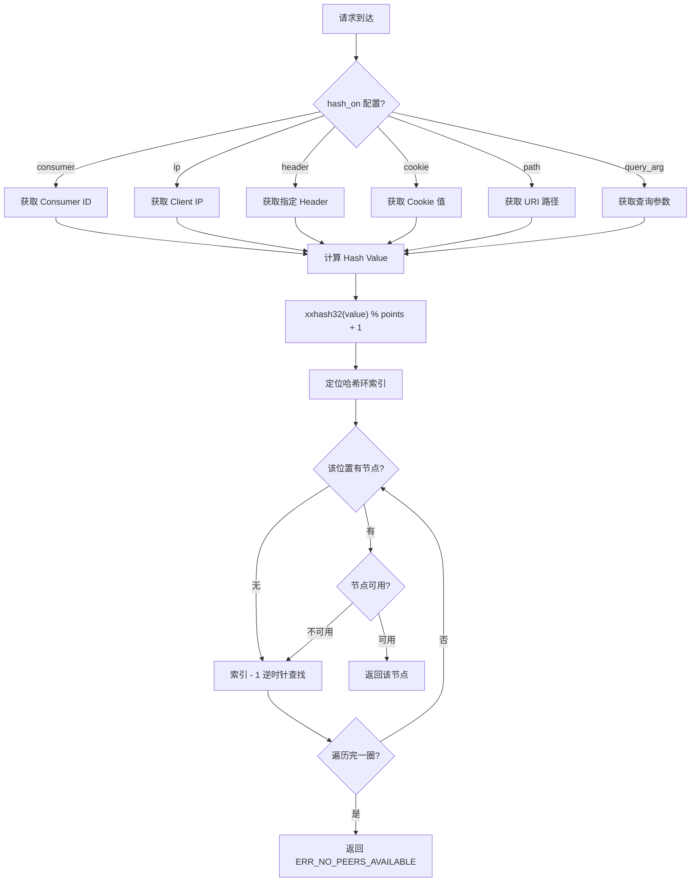
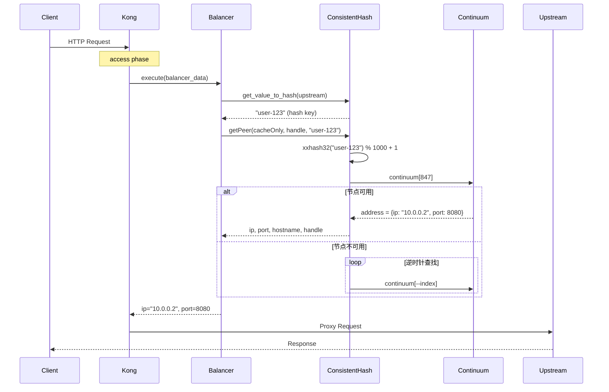

## 概述

Consistent-Hashing（一致性哈希）是 Kong 网关提供的三种负载均衡算法之一，特别适用于需要会话亲和性（Session Affinity）的场景。

## 核心源码结构

一致性哈希实现主要涉及以下文件：

```
kong/runloop/balancer/
├── consistent_hashing.lua  # 一致性哈希算法核心实现
├── balancers.lua           # Balancer 管理和接口定义
├── targets.lua             # 目标节点的 DNS 解析和状态管理
└── init.lua                # 负载均衡入口，hash value 计算
```

## 算法核心原理

### 1. 基于 Ketama 算法的哈希环

Kong 的一致性哈希基于经典的 **Ketama 算法**，核心数据结构是一个称为 **continuum（连续统/哈希环）** 的数组。

```lua
-- kong/runloop/balancer/consistent_hashing.lua

local DEFAULT_CONTINUUM_SIZE = 1000  -- 默认环大小
local MAX_CONTINUUM_SIZE = 2^32      -- 最大环大小
local SERVER_POINTS = 160            -- 每个节点的基准点数

local consistent_hashing = {}
consistent_hashing.__index = consistent_hashing
```

### 2. 哈希函数：xxHash32

Kong 使用 **xxHash32** 作为哈希函数，这是一个极其快速的哈希算法：

```lua
local xxhash32 = require "luaxxhash"

-- 计算值在哈希环上的索引
local function get_continuum_index(value, points)
  return ((xxhash32(tostring(value)) % points) + 1)
end
```

**为什么选择 xxHash32？**
- 极高的计算速度（接近内存带宽限制）
- 良好的分布均匀性
- 32 位输出适合映射到固定大小的环

## 哈希环构建过程

### 1. 节点排序（确定性保证）

为确保哈希环的可重现性，所有节点必须按固定顺序添加：

```lua
-- kong/runloop/balancer/consistent_hashing.lua:44-66

local function sort_hosts_and_addresses(balancer)
  -- 按 name:port 词法排序 targets
  table_sort(balancer.targets, function(a, b)
    local ta = tostring(a.name)
    local tb = tostring(b.name)
    return ta < tb or (ta == tb and tonumber(a.port) < tonumber(b.port))
  end)

  -- 每个 target 内的 addresses 也按 "ip:port" 排序
  for _, target in ipairs(balancer.targets) do
    table_sort(target.addresses, function(a, b)
      return (tostring(a.ip) .. ":" .. tostring(a.port)) <
             (tostring(b.ip) .. ":" .. tostring(b.port))
    end)
  end
end
```

### 2. 权重分布计算

每个地址在环上占有的点数与其权重成正比：

```lua
-- kong/runloop/balancer/consistent_hashing.lua:74-121

function consistent_hashing:afterHostUpdate()
  local points = self.points              -- 环的总大小
  local total_weight = balancer.totalWeight
  local targets_count = #balancer.targets

  for _, target in ipairs(balancer.targets) do
    for _, address in ipairs(target.addresses) do
      local weight = address.weight
      -- 计算该地址应占的点数
      local addr_prop = weight / total_weight
      local entries = floor(addr_prop * targets_count * SERVER_POINTS)

      -- 权重 > 0 但计算结果为 0 时，至少分配 1 个点
      if weight > 0 and entries == 0 then
        entries = 1
      end

      -- 为每个点生成哈希索引
      local port = address.port and ":" .. tostring(address.port) or ""
      local i = 1
      while i <= entries do
        -- 生成唯一标识符：ip:port:index
        local name = tostring(address.ip) .. ":" .. port .. " " .. tostring(i)
        local index = get_continuum_index(name, points)

        -- 处理哈希冲突
        if new_continuum[index] == nil then
          new_continuum[index] = address
        else
          entries = entries + 1  -- 冲突则增加尝试次数
          total_collision = total_collision + 1
        end
        i = i + 1
      end
    end
  end

  self.continuum = new_continuum
end
```

**权重计算公式**：
```
entries = floor(weight / total_weight * targets_count * SERVER_POINTS)
```

其中 `SERVER_POINTS = 160`，这是 Ketama 算法的经典配置。

### 3. 哈希环结构示意

```
Continuum (size = 1000)
┌─────────────────────────────────────────────────────────────┐
│ [0]   │ [1]   │ [2]   │ ... │ [998] │ [999] │ [1000]       │
│ nil   │ addr1 │ nil   │     │ addr2 │ nil   │ addr3        │
└─────────────────────────────────────────────────────────────┘
          ↑                              ↑
    hash("10.0.0.1:8080 1")        hash("10.0.0.2:8080 42")
```

## 为什么一致性哈希能保证均衡？

### 通俗理解：用"撒豆子"来解释

想象一个**圆形的盘子**（哈希环），盘子上标有 0 到 999 共 1000 个刻度。

#### 第一步：把服务器"打散"撒在盘子上

假设你有 3 台服务器：A、B、C，权重都是 1。

**普通哈希的做法**：每台服务器只占 1 个固定位置。比如 A 在位置 333，B 在 666，C 在 999。
- 问题：如果请求都落在 400-500 之间，全都会打到 B 上，很不均匀！

**一致性哈希的做法**：把每台服务器"打散"成**很多个小点**（虚拟节点），均匀撒在盘子上。
- 服务器 A 变成：A₁, A₂, A₃, ... A₁₆₀（160 个点）
- 服务器 B 变成：B₁, B₂, B₃, ... B₁₆₀
- 服务器 C 变成：C₁, C₂, C₃, ... C₁₆₀

这 480 个点通过哈希函数"随机"分布在盘子的各个位置。虽然看起来是乱序的，但因为哈希函数的特性，它们会**均匀地覆盖整个盘子**。

```
盘子（哈希环）示意：

        0
   C₇₃    A₁₂
  A₈₉        B₁₅₆
250              750
  B₄₂        C₉₈
   A₂₃₁    B₈₇
        500
```

#### 第二步：把请求也"撒"在盘子上

每个请求（用户 ID、IP、Header 等）经过同样的哈希函数，也会落在盘子的某个位置。

**关键点**：好的哈希函数（如 xxHash32）就像**公平的撒豆子机器**——不管你给它什么输入，输出的位置都是"随机且均匀"的。

- 请求 1（user-123）→ 落在位置 427
- 请求 2（user-456）→ 落在位置 83
- 请求 3（user-789）→ 落在位置 691
- ...成千上万个请求会均匀覆盖整个盘子

#### 第三步：就近匹配

请求落在哪个位置，就**顺时针/逆时针找最近的服务器点**：

- 请求落在 427 → 顺时针找到 439（B₈₉）→ 打到服务器 B
- 请求落在 83 → 顺时针找到 98（C₉₈）→ 打到服务器 C
- 请求落在 691 → 顺时针找到 712（A₁₂）→ 打到服务器 A

### 为什么这样就能均衡？

#### 原因 1：哈希函数的"公平性"

哈希函数有一个关键特性：**输入随机，输出也随机且均匀**。

想象一个公平的掷骰子：
- 你给它 "user-1"，它可能掷出 427
- 你给它 "user-2"，它可能掷出 83
- 你给它 "user-999999"，它可能掷出 691

当有**大量不同的请求**时，哈希值会**均匀地覆盖整个哈希空间**（0 到 2³²-1）。这就像往盘子上随机撒一把豆子，豆子越多，分布越均匀——这是概率论中**大数定律**的体现。

#### 原因 2：虚拟节点解决"扎堆"问题

如果每台服务器只有 1 个点：
- 万一 A 的点都在 0-200，B 的点都在 500-700，C 的点都在 800-999
- 那落在 200-400 的请求全都会打到 B，极不均匀

**虚拟节点**的妙处：
- 每台服务器有 160 个点（甚至更多）
- 这些点"随机"分布在整个环上
- 根据概率，每个服务器会在**环的每个区域都有代表**

```
没有虚拟节点（不均匀）：
[AAA..........BBB..........CCC..........]

有虚拟节点（均匀）：
[A.B.C.A.C.B.A.B.C.C.A.B.A.C.B.C.A.B.C.]
```

#### 原因 3：权重可以调整"点的数量"

如果服务器 A 性能是 B 的 2 倍，可以让 A 有 320 个点，B 只有 160 个点。
- A 的点更多，在环上覆盖的范围更大
- 自然会有更多请求落在 A 的"领地"里

这就像在盘子上，A 撒了 2 把豆子，B 只撒了 1 把——A 接收到请求的概率就是 B 的 2 倍。

### 一句话总结

> **一致性哈希之所以均衡，是因为：哈希函数把请求均匀"撒"在整个环上，而虚拟节点让每台服务器在环的各个位置都有"代表"，所以均匀分布的请求会被均匀地分配给各台服务器。**

### 类比：分蛋糕

- **普通哈希**：把蛋糕切成 N 块，第 1 块给 A，第 2 块给 B... 问题：每块蛋糕大小可能差很多
- **一致性哈希**：把蛋糕切成 1000 小块，随机标记每小块属于谁。切得越细，每个人分到的总量越接近平均

### 数学保证

从数学角度，当虚拟节点数足够多时（Kong 默认每节点 160 个），一致性哈希的分布趋近于**理想均匀分布**：

```
实际分配 ≈ 权重比例

例如：3 台服务器权重 1:1:1
期望：每台承担 33.3% 流量
实际：32.8% : 33.5% : 33.7%（误差 < 1%）
```

---

## Hash Key 的来源

Kong 支持多种 hash key 来源，定义在 `init.lua` 中：

```lua
-- kong/runloop/balancer/init.lua:99-185

local function get_value_to_hash(upstream, ctx)
  local hash_on = upstream.hash_on

  if hash_on == "consumer" then
    -- 基于 Consumer ID（回退到 Credential ID）
    identifier = (ctx.authenticated_consumer or EMPTY_T).id or
                 (ctx.authenticated_credential or EMPTY_T).id

  elseif hash_on == "ip" then
    -- 基于客户端 IP
    identifier = var.remote_addr

  elseif hash_on == "header" then
    -- 基于指定 Header
    identifier = ngx.req.get_headers()[upstream.hash_on_header]

  elseif hash_on == "cookie" then
    -- 基于 Cookie（不存在则自动生成 UUID）
    identifier = var["cookie_" .. upstream.hash_on_cookie]
    if not identifier then
      identifier = utils.uuid()  -- 生成新 cookie
      ctx.balancer_data.hash_cookie = {
        key = upstream.hash_on_cookie,
        value = identifier,
        path = upstream.hash_on_cookie_path
      }
    end

  elseif hash_on == "path" then
    -- 基于请求路径
    identifier = var.uri

  elseif hash_on == "query_arg" then
    -- 基于查询参数
    identifier = get_query_arg(upstream.hash_on_query_arg)

  elseif hash_on == "uri_capture" then
    -- 基于 URI 捕获组
    identifier = ctx.router_matches.uri_captures[upstream.hash_on_uri_capture]
  end

  -- 支持回退机制
  if not identifier then
    hash_on = upstream.hash_fallback
    -- ... 重新尝试获取 identifier
  end

  return identifier
end
```

## 节点查找算法

### getPeer 方法

当请求到来时，通过 `getPeer` 方法查找目标节点：

```lua
-- kong/runloop/balancer/consistent_hashing.lua:135-193

function consistent_hashing:getPeer(cacheOnly, handle, valueToHash)
  -- 初始化或复用 handle（用于重试）
  if handle then
    handle.retryCount = handle.retryCount + 1
  else
    handle = { retryCount = 0 }
  end

  -- 计算请求的哈希索引（只计算一次）
  if not handle.hashValue then
    handle.hashValue = get_continuum_index(valueToHash, self.points)
  end

  local index = handle.hashValue

  -- 逆时针遍历哈希环，查找可用节点
  while (index - 1) ~= handle.hashValue do
    if index == 0 then
      index = self.points  -- 环回
    end

    local address = self.continuum[index]

    -- 检查节点是否可用
    if address ~= nil and address.available and not address.disabled then
      local ip, port, hostname = balancers.getAddressPeer(address, cacheOnly)
      if ip then
        handle.address = address
        return ip, port, hostname, handle
      end
    end

    index = index - 1  -- 逆时针移动
  end

  return nil, balancers.errors.ERR_NO_PEERS_AVAILABLE
end
```

### 查找流程图



## 数据模型配置

### Upstream Schema

```lua
-- kong/db/schema/entities/upstreams.lua

{
  algorithm = {
    type = "string",
    default = "round-robin",
    one_of = { "consistent-hashing", "least-connections", "round-robin" },
  },
  hash_on = {
    type = "string",
    default = "none",
    one_of = { "none", "consumer", "ip", "header", "cookie",
               "path", "query_arg", "uri_capture" }
  },
  hash_fallback = { ... },  -- 回退 hash_on 配置
  slots = {
    type = "integer",
    default = 10000,
    between = { 10, 2^16 },
  },
}
```

### 配置示例

```json
{
  "name": "my-upstream",
  "algorithm": "consistent-hashing",
  "hash_on": "header",
  "hash_on_header": "X-User-ID",
  "hash_fallback": "ip",
  "slots": 10000
}
```

## 关键设计决策

### 1. 确定性排序

> 为什么需要排序？

一致性哈希的核心要求是：**相同的节点集合必须产生相同的哈希环**。如果不排序，节点添加顺序不同会导致完全不同的哈希分布，这在分布式环境中是不可接受的。

### 2. 哈希冲突处理

```lua
if new_continuum[index] == nil then
  new_continuum[index] = address
else
  entries = entries + 1  -- 冲突则跳过，尝试下一个索引
  total_collision = total_collision + 1
end
```

当两个不同的节点标识符哈希到同一索引时，Kong 选择保留先到的节点，让后到的节点尝试下一个索引。这保证了环的稳定性。

### 3. 权重最小值保护

```lua
if weight > 0 and entries == 0 then
  entries = 1
end
```

即使权重很小导致计算出的 entries 为 0，只要权重 > 0，该节点也会在环上至少占据一个位置。

### 4. 逆时针查找

Kong 采用 **逆时针（递减索引）** 查找可用节点。当首选位置没有节点或节点不可用时，向索引减小的方向查找。这与传统的 Ketama 顺时针查找略有不同，但效果等价。

## 与其他算法的对比

| 特性 | Consistent-Hashing | Round-Robin | Least-Connections |
|------|-------------------|-------------|-------------------|
| 会话亲和性 | ✅ 支持 | ❌ 不支持 | ❌ 不支持 |
| 节点增减影响 | 最小化影响 | 重新分布 | 重新分布 |
| 权重支持 | ✅ 支持 | ✅ 支持 | ✅ 支持 |
| 健康检查集成 | ✅ 支持 | ✅ 支持 | ✅ 支持 |
| 计算复杂度 | O(n) 最坏 | O(1) | O(n) |

## 性能考量

### 环大小选择

```lua
-- 默认值
local DEFAULT_CONTINUUM_SIZE = 1000
local MIN_CONTINUUM_SIZE = 1000
local MAX_CONTINUUM_SIZE = 2^32
```

- **较小的环**（1000）：内存占用小，但分布可能不够均匀
- **较大的环**（10000+）：分布更均匀，但查找时间略增
- **推荐**：节点数 * 100 作为最小环大小

### 碰撞率

```
collision_rate ≈ entries / points
```

当碰撞率过高时（如 > 10%），应考虑增大 `slots` 配置。

## 完整请求流程



## 总结

Kong 的 consistent-hashing 实现是一个经过精心设计的生产级方案：

1. **基于 Ketama 算法**：经典的虚拟节点方案，确保均匀分布
2. **xxHash32 哈希函数**：高性能、高质量哈希
3. **确定性构建**：排序保证环的可重现性
4. **灵活的 hash key 来源**：支持 consumer、ip、header、cookie、path 等
5. **完善的回退机制**：主 hash key 失败时可回退到备用策略
6. **健康检查集成**：自动跳过不可用节点

这种实现特别适合需要会话粘性的场景，如：
- 有状态服务（WebSocket、Session Store）
- 缓存命中优化（同一用户请求路由到同一缓存节点）
- 分片数据库访问（按用户 ID 路由到对应分片）

## 参考资料

- [Kong 源码](https://github.com/Kong/kong)
- [Ketama 算法论文](https://www.last.fm/user/RJ/journal/2007/04/10/rz_libketama_-_a_consistent_hashing_algo)
- [xxHash 算法](https://github.com/Cyan4973/xxHash)
