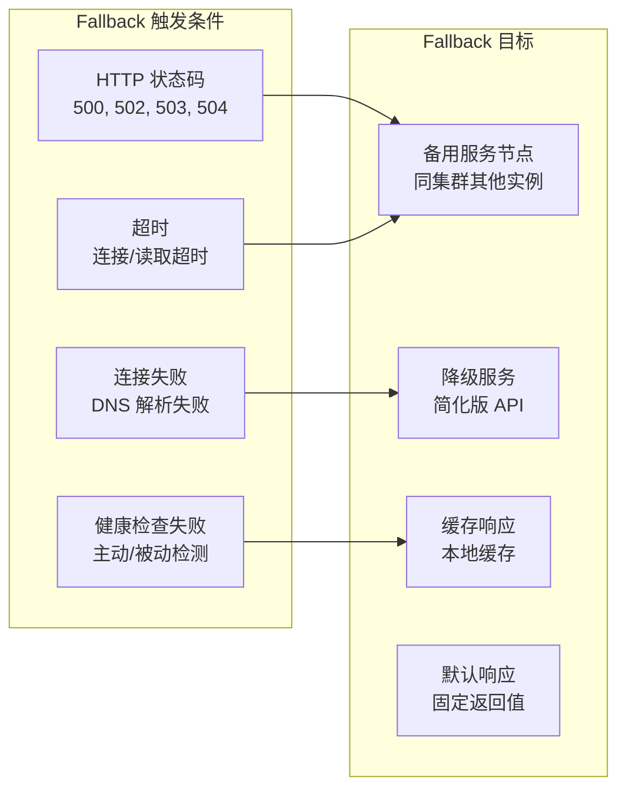
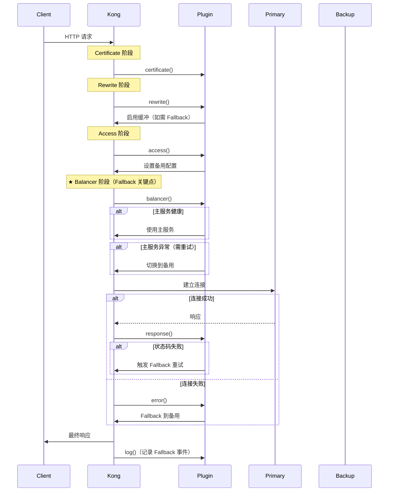
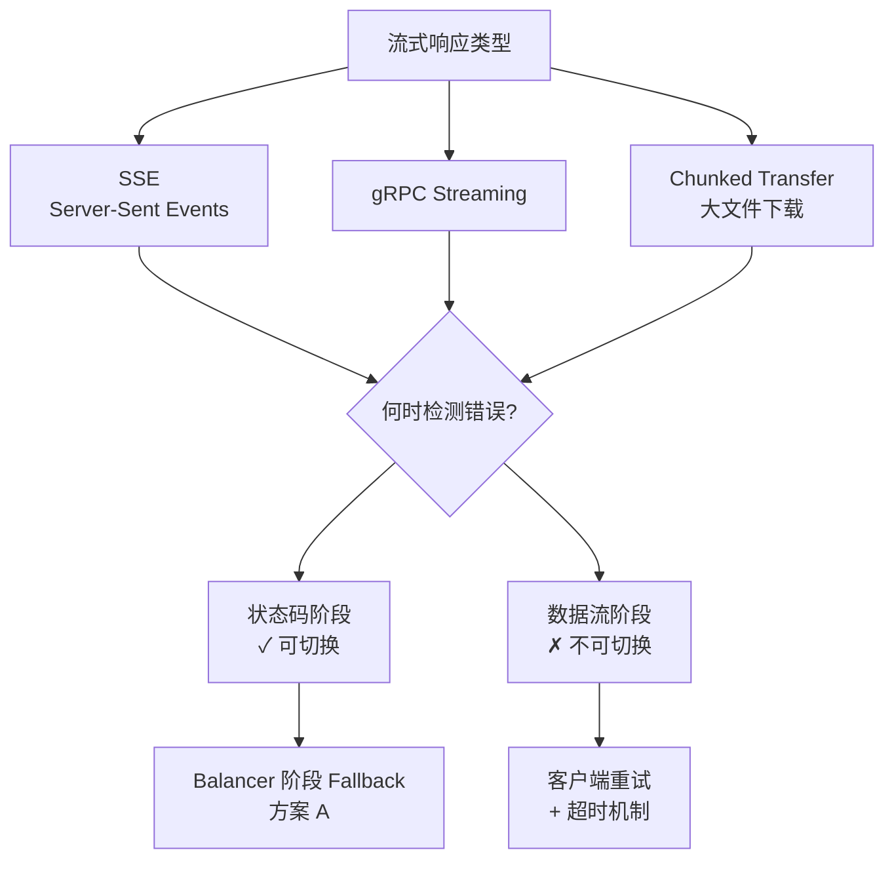

# Kong 故障转移（Fallback）机制深度解析

## 目录

1. [Kong Fallback 机制概述](#kong-fallback-机制概述)
2. [Kong 核心架构](#kong-核心架构)
3. [请求处理流程与 Fallback 点](#请求处理流程与-fallback-点)
4. [插件系统与 Fallback 实现](#插件系统与-fallback-实现)
5. [基于状态码的 Fallback 实现](#基于状态码的-fallback-实现)
6. [流式调用 Fallback 兼容性](#流式调用-fallback-兼容性)
7. [生产环境最佳实践](#生产环境最佳实践)

---

## Kong Fallback 机制概述

### 什么是 Fallback

Fallback（故障转移）是指当主服务失败时，自动切换到备用服务的机制。在 API 网关场景中，这通常基于以下触发条件：



### Kong 的 Fallback 能力

Kong 提供了多层 Fallback 机制：

| 层级 | 机制 | 触发条件 | 配置方式 |
|------|------|---------|---------|
| **Nginx 层** | proxy_next_upstream | 网络错误、超时、特定状态码 | nginx 配置 |
| **Upstream 层** | 健康检查 + 主动剔除 | 被动/主动健康检查失败 | Admin API |
| **Plugin 层** | 自定义 Fallback 逻辑 | 任意条件（状态码、响应内容等） | 自定义插件 |

### 为什么需要自定义 Plugin Fallback

虽然 Kong 内置了基础的 Fallback 能力，但自定义插件可以：

1. **更灵活的触发条件**：基于响应体内容、业务状态码等
2. **备用服务路径转换**：动态修改请求路径适配降级 API
3. **请求上下文保留**：在切换前保存请求状态
4. **监控和日志**：记录 Fallback 事件用于分析
5. **流式响应兼容**：针对不同响应类型优化处理

---

## Kong 核心架构

### 源码目录结构

```
kong/
├── init.lua              # Kong 初始化入口
├── global.lua            # 全局 PDK 对象
├── constants.lua         # 常量定义
│
├── runloop/              # 请求处理循环核心
│   ├── handler.lua        # 主处理器，管理各阶段
│   ├── plugins_iterator.lua # 插件迭代器（优先级排序）
│   └── balancer/          # 负载均衡器
│       ├── init.lua        # Balancer 阶段处理
│       └── healthcheckers.lua
│
├── pdk/                  # Plugin Development Kit
│   ├── private/phases.lua  # 阶段定义（包含 balancer）
│   ├── request/           # 请求 API
│   ├── response/          # 响应 API
│   └── service/           # 上游服务 API
│
└── plugins/              # 插件目录
    ├── pre-function/      # 最早执行（PRIORITY: 1000000）
    └── post-function/     # 最晚执行（PRIORITY: -1000）
```

### Kong 3.0 插件生命周期阶段

从源码 `kong/pdk/private/phases.lua` 可以确认 Kong 3.0 支持 **balancer 阶段**：

```lua
PHASES = {
  init_worker       = 0x00000001,  -- Worker 初始化
  certificate       = 0x00000002,  -- SSL 证书处理
  rewrite           = 0x00000010,  -- 请求重写（路由匹配前）
  access            = 0x00000020,  -- 访问控制（路由匹配后）
  balancer          = 0x00000040,  -- 负载均衡（建立连接前）★
  response          = 0x00000080,  -- 响应处理（收到响应后）
  header_filter     = 0x00000200,  -- 响应头过滤
  body_filter       = 0x00000400,  -- 响应体过滤
  log               = 0x00002000,  -- 日志记录
  error             = 0x01000000,  -- 错误处理
}
```

**★ Balancer 阶段是 Fallback 的关键位置**，此时尚未建立上游连接，可以安全切换目标。

---

## 请求处理流程与 Fallback 点

### 完整请求流程



### Fallback 可行性分析

| 阶段 | Fallback 可行性 | 说明 |
|------|---------------|------|
| **certificate** | ❌ 不适用 | SSL 握手阶段，尚未路由 |
| **rewrite** | ⚠️ 预设置 | 可存储备用配置，但不知道主服务状态 |
| **access** | ⚠️ 预设置 | 可配置备用目标，但未建立连接 |
| **balancer** | ✅ **最佳位置** | 尚未连接，可安全切换，支持重试 |
| **response** | ⚠️ 受限 | 响应头可能已发送，流式场景困难 |
| **header_filter** | ❌ 太晚 | 响应头已发送 |
| **error** | ✅ 异常处理 | 处理连接错误，但无法处理超响应错误 |

---

## 插件系统与 Fallback 实现

### 插件执行顺序

插件按 `PRIORITY` 值降序执行（值越大越早）：

```lua
local FallbackPlugin = {
  VERSION = "1.0.0",
  PRIORITY = 1000,  -- 在大多数插件之前执行
}
```

**常用插件优先级参考**：

```
pre-function (1000000)
     ↓
prometheus (20101)  ← 监控指标收集
     ↓
rate-limiting (1001)
     ↓
custom-fallback (1000) ← 推荐位置
     ↓
jwt (1005)
key-auth (1000)
acl (950)
     ↓
...其他插件...
     ↓
post-function (-1000)
```

### 上下文共享机制

Kong 提供多种上下文存储方式用于 Fallback 状态传递：

```lua
-- 1. 请求级别（推荐用于 Fallback 状态）
function FallbackPlugin:access(conf)
  ngx.ctx.fallback_config = {
    backup_host = conf.backup_host,
    backup_port = conf.backup_port,
    retry_count = 0,
  }
end

function FallbackPlugin:balancer(conf)
  local config = ngx.ctx.fallback_config
  if config and config.retry_count > 0 then
    -- 切换到备用
  end
end

-- 2. 跨插件共享
function FallbackPlugin:access(conf)
  kong.ctx.shared.fallback_triggered = false
end

-- 3. 共享内存（跨请求、跨 Worker）
local cache = ngx.shared.kong_cache
cache:set("fallback:stats:" .. route_id, data, 300)
```

---

## 基于状态码的 Fallback 实现

### 方案对比

| 方案 | 实现阶段 | 优点 | 缺点 | 适用场景 |
|------|---------|------|------|---------|
| **方案 A** | Balancer + Response | 性能好，支持流式 | 实现复杂 | **生产推荐** |
| **方案 B** | Response | 实现简单 | 流式受限，响应头已发送 | 简单场景 |

### 方案 A: Balancer 阶段 Fallback（推荐）

这是 **Kong 3.0 最佳实践**，利用 balancer 阶段实现无缝切换。

#### handler.lua

```lua
-- 严格模式
local kong = kong
local ngx = ngx

local StatusBasedFallback = {
  VERSION = "1.0.0",
  PRIORITY = 999,  -- 在默认插件之前执行
}

-- ============================================
-- Access 阶段：初始化 Fallback 配置
-- ============================================
function StatusBasedFallback:access(conf)
  kong.ctx.shared.fallback = {
    -- 备用服务配置
    backup = {
      host = conf.backup_host,
      port = conf.backup_port,
      path = conf.backup_path,
      scheme = conf.backup_scheme or "http",
    },
    -- 触发条件
    triggers = {
      status_codes = conf.fail_status_codes or { 500, 502, 503, 504 },
      timeout = conf.primary_timeout,
    },
    -- 状态追踪
    state = {
      retry_count = 0,
      max_retries = conf.max_retries or 1,
      is_primary = true,
      last_error = nil,
    },
    -- 请求快照（用于重试）
    request_snapshot = {
      method = kong.request.get_method(),
      path = kong.request.get_path(),
      query = kong.request.get_query(),
      headers = kong.request.get_headers(),
    },
  }

  -- 如果需要处理响应体，启用缓冲
  if conf.process_response_body then
    kong.service.request.enable_buffering()
  end

  kong.ctx.shared.request_start = ngx.now()
end

-- ============================================
-- Balancer 阶段：执行目标切换
-- ============================================
function StatusBasedFallback:balancer(conf)
  local ctx = kong.ctx.shared.fallback
  if not ctx or not ctx.state.is_primary then
    return  -- 已切换或无配置
  end

  local state = ctx.state
  local balancer_data = ngx.ctx.balancer_data

  kong.log.info("Fallback: switching to backup ",
                ctx.backup.host, ":", ctx.backup.port,
                " (retry ", state.retry_count, ")")

  -- 切换到备用目标
  balancer_data.host = ctx.backup.host
  balancer_data.port = ctx.backup.port

  -- 修改请求路径（如配置了）
  if ctx.backup.path then
    kong.service.request.set_path(ctx.backup.path)
  end

  -- 修改协议（如需要）
  if ctx.backup.scheme then
    kong.service.request.set_scheme(ctx.backup.scheme)
  end

  -- 更新状态
  state.retry_count = state.retry_count + 1
  state.is_primary = false

  -- 设置重试次数
  local remaining = state.max_retries - state.retry_count
  if remaining > 0 then
    local ok, err = ngx.balancer.set_more_tries(remaining)
    if not ok then
      kong.log.err("Failed to set retry count: ", err)
    end
  end
end

-- ============================================
-- Response 阶段：检测并触发 Fallback
-- ============================================
function StatusBasedFallback:response(conf)
  local ctx = kong.ctx.shared.fallback
  if not ctx then
    return
  end

  local state = ctx.state

  -- 已经切换过，不再处理
  if not state.is_primary then
    return
  end

  -- 检查是否达到重试上限
  if state.retry_count >= state.max_retries then
    kong.log.warn("Fallback: max retries reached")
    return
  end

  -- 检查状态码
  local status = kong.response.get_status()
  local should_fallback = false

  for _, fail_code in ipairs(ctx.triggers.status_codes) do
    if status == fail_code then
      should_fallback = true
      state.last_error = "status_" .. status
      break
    end
  end

  if should_fallback then
    kong.log.warn("Fallback: primary failed with status ", status,
                 ", triggering retry to backup")

    kong.ctx.shared.fallback_triggered = true

    -- 触发重试
    local ok, err = ngx.balancer.set_more_tries(1)
    if not ok then
      kong.log.err("Fallback: failed to trigger retry: ", err)
    end
  end
end

-- ============================================
-- Log 阶段：记录 Fallback 事件
-- ============================================
function StatusBasedFallback:log(conf)
  local ctx = kong.ctx.shared.fallback
  if not ctx or not kong.ctx.shared.fallback_triggered then
    return
  end

  local elapsed = ngx.now() - (kong.ctx.shared.request_start or ngx.now())
  local status = kong.response.get_status()

  -- 结构化日志
  local log_entry = {
    event = "fallback_executed",
    trigger_reason = ctx.state.last_error or "unknown",
    retry_count = ctx.state.retry_count,
    final_status = status,
    elapsed_ms = math.floor(elapsed * 1000),
    backup_target = ctx.backup.host .. ":" .. ctx.backup.port,
    route = kong.router.get_route() and kong.router.get_route().name,
    service = kong.router.get_service() and kong.router.get_service().name,
  }

  kong.log.notice("Fallback: ", require("cjson").encode(log_entry))

  -- 发送监控指标
  kong.metrics.increment("fallback.total", 1, {
    route = log_entry.route,
    trigger = ctx.state.last_error,
    status = tostring(status),
  })
end

return StatusBasedFallback
```

#### schema.lua

```lua
local typedefs = require "kong.db.schema.typedefs"

return {
  name = "status-based-fallback",
  fields = {
    { consumer = typedefs.no_consumer },
    { protocols = typedefs.protocols_http },
    { config = {
        type = "record",
        fields = {
          -- ========== 触发条件 ==========
          { fail_status_codes = {
              type = "array",
              elements = { type = "integer", between = { 400, 599 } },
              default = { 500, 502, 503, 504 },
              description = "触发 Fallback 的 HTTP 状态码列表"
          }},

          { primary_timeout = {
              type = "integer",
              between = { 1, 300000 },
              default = 30000,
              description = "主服务超时时间（毫秒）"
          }},

          -- ========== 备用服务配置 ==========
          { backup_host = {
              type = "string",
              required = true,
              description = "备用服务主机名或 IP"
          }},

          { backup_port = {
              type = "integer",
              between = { 1, 65535 },
              required = true,
              description = "备用服务端口"
          }},

          { backup_path = {
              type = "string",
              description = "备用服务路径（不填则使用原路径）"
          }},

          { backup_scheme = {
              type = "string",
              one_of = { "http", "https" },
              default = "http",
              description = "备用服务协议"
          }},

          { backup_ssl_verify = {
              type = "boolean",
              default = true,
              description = "是否验证备用服务 SSL 证书"
          }},

          { backup_sni = {
              type = "string",
              description = "备用服务 SSL SNI"
          }},

          -- ========== 重试配置 ==========
          { max_retries = {
              type = "integer",
              between = { 0, 5 },
              default = 1,
              description = "最大重试次数（包括主服务）"
          }},

          { retry_on_backup = {
              type = "boolean",
              default = false,
              description = "备用服务失败后是否继续重试"
          }},

          -- ========== 响应处理 ==========
          { process_response_body = {
              type = "boolean",
              default = false,
              description = "是否处理响应体（需要启用缓冲）"
          }},

          { preserve_original_headers = {
              type = "boolean",
              default = true,
              description = "是否保留原始请求头转发到备用"
          }},

          { add_fallback_headers = {
              type = "boolean",
              default = true,
              description = "是否添加 Fallback 标识头"
          }},
        },
    }, },
  },
}
```

### 方案 B: Response 阶段 Fallback（简单场景）

#### handler.lua

```lua
local kong = kong
local ngx = ngx
local http = require "resty.http"

local SimpleFallback = {
  VERSION = "1.0.0",
  PRIORITY = 800,
}

function SimpleFallback:access(conf)
  -- 启用缓冲以获取完整响应
  kong.service.request.enable_buffering()
  kong.ctx.shared.buffering_enabled = true
end

function SimpleFallback:response(conf)
  local status = kong.response.get_status()

  -- 检查是否需要 Fallback
  local should_fallback = false
  for _, fail_code in ipairs(conf.fail_status_codes) do
    if status == fail_code then
      should_fallback = true
      break
    end
  end

  if not should_fallback then
    return
  end

  kong.log.info("Simple Fallback: status=", status,
               ", calling backup ", conf.backup_host)

  -- 构建备用请求
  local backup_path = conf.backup_path or kong.request.get_path()
  local method = kong.request.get_method()
  local headers = kong.request.get_headers()

  -- 发起子请求
  local httpc = http.new()
  httpc:set_timeout(conf.backup_timeout or 10000)

  local ok, err = httpc:connect(conf.backup_host, conf.backup_port)
  if not ok then
    kong.log.err("Backup connection failed: ", err)
    return kong.response.exit(502, {
      message = "Primary and backup services unavailable",
      original_status = status,
    })
  end

  -- SSL
  if conf.backup_ssl then
    httpc:ssl_handshake(nil, conf.backup_sni or conf.backup_host,
                        conf.backup_ssl_verify ~= false)
  end

  -- 获取请求体
  local body
  if kong.ctx.shared.buffering_enabled then
    body = kong.request.get_raw_body()
  end

  -- 发送请求
  local res, err = httpc:request({
    path = backup_path,
    method = method,
    headers = headers,
    body = body,
  })

  if not res then
    kong.log.err("Backup request failed: ", err)
    return kong.response.exit(502, {
      message = "Backup service unavailable",
      original_status = status,
    })
  end

  -- 读取响应
  local backup_body = res:read_body()

  -- 设置新响应
  kong.response.set_status(res.status)

  for name, value in pairs(res.headers) do
    if type(value) == "table" then
      for _, v in ipairs(value) do
        kong.response.add_header(name, v)
      end
    else
      kong.response.set_header(name, value)
    end
  end

  if conf.add_fallback_headers then
    kong.response.set_header("X-Fallback", "backup")
    kong.response.set_header("X-Original-Status", status)
  end

  kong.response.set_raw_body(backup_body)
  httpc:close()
end

return SimpleFallback
```

---

## 流式调用 Fallback 兼容性

### 流式响应的挑战



### 流式场景 Fallback 策略

#### 策略 1: 早期检测（推荐）

在 Balancer 阶段检测并切换，响应头发送前：

```lua
function StreamFallback:balancer(conf)
  -- 使用健康检查预判断
  local health = kong.client.get_upstream_health()
  if health and health.status == "unhealthy" then
    -- 提前切换到备用
    ngx.ctx.balancer_data.host = conf.backup_host
    ngx.ctx.balancer_data.port = conf.backup_port
  end
end
```

#### 策略 2: 超时 + 状态码组合

```lua
function StreamFallback:access(conf)
  kong.ctx.shared.deadline = ngx.now() + (conf.primary_timeout / 1000)
end

function StreamFallback:response(conf)
  local elapsed = ngx.now() - kong.ctx.shared.request_start

  -- 超时 + 错误状态码 = Fallback
  local status = kong.response.get_status()
  if elapsed > kong.ctx.shared.deadline and status >= 500 then
    -- 对于流式响应，只能记录和通知客户端
    kong.response.set_header("X-Retry-After", "60")
    kong.response.set_header("X-Backup-Host", conf.backup_host)
  end
end
```

#### 策略 3: 客户端感知（最可靠）

让客户端参与 Fallback：

```lua
-- Kong 插件：添加降级信息
function StreamFallback:header_filter(conf)
  local status = ngx.status

  if status >= 500 and conf.enable_client_fallback then
    -- 告知客户端可重试
    ngx.header["X-Retryable"] = "true"
    ngx.header["X-Backup-Host"] = conf.backup_host
    ngx.header["X-Backup-Port"] = conf.backup_port
    ngx.header["Retry-After"] = "5"
  end
end
```

```javascript
// 客户端实现
class FallbackClient {
  async fetchWithFallback(url, options = {}) {
    const response = await fetch(url, options);

    if (!response.ok && response.headers.get('X-Retryable') === 'true') {
      const backupHost = response.headers.get('X-Backup-Host');
      const backupPort = response.headers.get('X-Backup-Port');

      const backupUrl = new URL(url);
      backupUrl.hostname = backupHost;
      backupUrl.port = backupPort;

      return fetch(backupUrl.toString(), options);
    }

    return response;
  }
}

// 使用
const client = new FallbackClient();
const response = await client.fetchWithFallback('https://api.example.com/stream');
```

### 流式场景最佳实践

| 场景 | 推荐策略 | 配置要点 |
|------|---------|---------|
| **SSE/API 流** | Balancer 阶段 Fallback + 健康检查 | 设置较短超时，启用被动健康检查 |
| **gRPC Streaming** | 客户端重试 + 服务端负载均衡 | 使用 gRPC 内置重试机制 |
| **大文件下载** | Balancer 阶段 + CDN 回源 | 配置多个 CDN 源 |
| **WebSocket** | 连接建立前 Fallback | 在 access 阶段检查服务健康度 |

---

## 生产环境最佳实践

### 1. 配置验证

```lua
-- schema.lua 添加验证
{ backup_host = {
    type = "string",
    required = true,
    custom_validator = function(value)
      -- 格式验证
      if not value:match("^[%w%.%-]+$") then
        return false, "Invalid hostname format"
      end

      -- DNS 解析验证
      local resolver = require "resty.dns.client"
      local ips, err = resolver:query(value, { qtype = resolver.TYPE_A })
      if not ips or #ips == 0 then
        return false, "Cannot resolve hostname: " .. tostring(err)
      end

      return true
    end
}}
```

### 2. 断路器模式

```lua
-- 在插件中添加断路器
local circuit_breaker = {
  state = "closed",  -- closed, open, half-open
  failures = 0,
  last_failure = 0,
  threshold = 5,
  timeout = 30,
}

function should_allow_request()
  if circuit_breaker.state == "open" then
    if ngx.time() - circuit_breaker.last_failure > circuit_breaker.timeout then
      circuit_breaker.state = "half-open"
      kong.log.info("Circuit breaker: half-open state")
    else
      return false, "Circuit breaker is open"
    end
  end
  return true
end

function record_success()
  circuit_breaker.failures = 0
  if circuit_breaker.state == "half-open" then
    circuit_breaker.state = "closed"
    kong.log.info("Circuit breaker: recovered to closed")
  end
end

function record_failure()
  circuit_breaker.failures = circuit_breaker.failures + 1
  circuit_breaker.last_failure = ngx.time()

  if circuit_breaker.failures >= circuit_breaker.threshold then
    circuit_breaker.state = "open"
    kong.log.warn("Circuit breaker: opened after ",
                 circuit_breaker.failures, " failures")
  end
end
```

### 3. 监控指标

```lua
function FallbackPlugin:log(conf)
  if kong.ctx.shared.fallback_triggered then
    local metrics = {
      status = kong.response.get_status(),
      retry_count = kong.ctx.shared.fallback.state.retry_count,
      elapsed = ngx.now() - kong.ctx.shared.request_start,
    }

    -- Prometheus 格式指标
    kong.metrics.increment("fallback_requests_total", 1, {
      route = kong.router.get_route() and kong.router.get_route().name,
      status = tostring(metrics.status),
    })

    kong.metrics.histogram("fallback_duration_ms", metrics.elapsed * 1000, {
      route = kong.router.get_route() and kong.router.get_route().name,
    })
  end
end
```

### 4. 降级策略

```lua
-- 多级降级配置
local fallback_chain = {
  {
    name = "backup_primary",
    host = "backup1.internal",
    port = 8080,
    weight = 100,
  },
  {
    name = "backup_secondary",
    host = "backup2.internal",
    port = 8080,
    weight = 50,
  },
  {
    name = "cache_fallback",
    type = "cache",
    ttl = 300,
  },
  {
    name = "default_response",
    type = "static",
    status = 200,
    body = '{"status":"ok","cached":true}',
  }
}

function get_next_fallback(current_index)
  local next_index = current_index + 1
  if next_index <= #fallback_chain then
    return fallback_chain[next_index], next_index
  end
  return nil, nil
end
```

### 5. 部署配置示例

```yaml
# kong.yml 配置示例
plugins:
- name: status-based-fallback
  route: critical-api
  config:
    fail_status_codes:
      - 500
      - 502
      - 503
      - 504
    backup_host: fallback.internal
    backup_port: 8080
    backup_path: /api/v1/degraded
    backup_scheme: https
    backup_ssl_verify: true
    max_retries: 2
    process_response_body: false
    add_fallback_headers: true
```

---

## 参考资料

- [Kong 官方文档 - Plugins](https://docs.konghq.com/gateway/latest/plugin-development/)
- [Kong PDK 参考](https://docs.konghq.com/gateway/latest/plugin-development/pdk/)
- [OpenResty Balancer 指令](https://openresty-reference.googlecode.com/svn/trunk/nginx_html_en/http/ngx_http_upstream_module.html#balancer_by_lua_block)
- [Kong 源码](https://github.com/Kong/kong)
