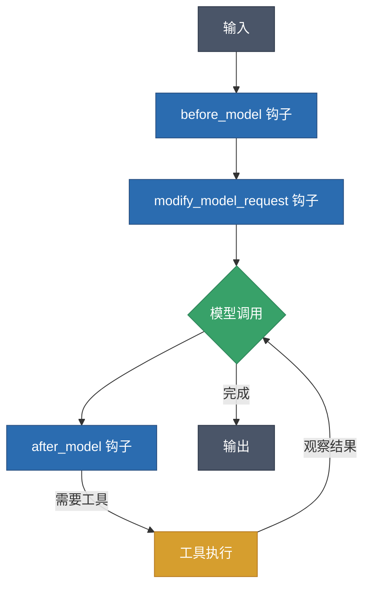

## 概述

LangGraph 的中间件系统是 LangChain v1.0 引入的革命性特性,它从根本上改变了开发者与 Agent 行为交互和控制的方式。这个架构转变提供了前所未有的灵活性和控制机制,使得开发者能够在保持快速原型开发简洁性的同时,构建生产级的复杂应用。

## 中间件架构原理

### 核心概念

中间件系统通过在 Agent 执行循环的关键节点提供拦截点来工作。传统的 Agent 架构包含模型节点和工具节点,而中间件引入了三个关键钩子(hooks),允许开发者在执行过程中的精确时刻拦截和修改 Agent 行为。

### 执行流程



执行模式遵循类似于 Web 服务器中间件的顺序处理模型:

- **入站处理**: 多个中间件按顺序执行 `before_model` 和 `modify_model_request` 钩子
- **出站处理**: `after_model` 钩子按相反顺序执行,形成对称的处理管道

## 三大核心钩子

### 1. before_model 钩子

`before_model` 在模型调用之前执行,是功能最强大的钩子。

**核心能力:**

- 更新永久状态
- 使用 `jump_to` 重定向执行流程(可跳转到 "tools" 或 "__end__")
- 实现复杂的决策逻辑
- 状态验证和预处理

**使用示例:**

```python
from typing import Any
from langchain.agents.middleware import AgentState, AgentMiddleware

class CustomRoutingMiddleware(AgentMiddleware):
    def before_model(self, state: AgentState) -> dict[str, Any] | None:
        # 检查消息数量,决定是否需要总结
        if len(state["messages"]) > 50:
            return {"messages": self.summarize_messages(state["messages"])}

        # 检查是否应该提前结束
        if self.should_terminate(state):
            return {"jump_to": "__end__"}

        return None  # 继续正常流程
```

**注意事项:**
- 禁止从 `before_model` 内部跳转到 "model",以维护执行顺序保证
- 可以修改状态并影响后续执行

### 2. modify_model_request 钩子

`modify_model_request` 在模型调用前立即执行,专门用于修改模型请求参数。

**可修改内容:**

- 工具列表
- 系统提示词
- 消息列表
- 模型参数
- 模型实例
- 输出格式
- 工具选择策略

**使用示例:**

```python
from typing import Any
from pydantic import BaseModel
from langchain.agents.middleware import ModelRequest, AgentState, AgentMiddleware
from langchain_openai import ChatOpenAI

class Answer(BaseModel):
    answer: str
    confidence: float

class DynamicModelMiddleware(AgentMiddleware):
    def modify_model_request(
        self,
        request: ModelRequest,
        state: AgentState
    ) -> ModelRequest:
        # 动态模型选择
        if self.is_complex_query(state):
            request.model = ChatOpenAI(model="gpt-4o")
        else:
            request.model = ChatOpenAI(model="gpt-4o-mini")

        # 动态修改系统提示词
        request.system_prompt = self.generate_contextual_prompt(state)

        # 控制工具可用性
        if self.should_restrict_tools(state):
            request.tools = [
                t for t in request.tools
                if self.is_tool_allowed(t, state)
            ]

        # 结构化输出(必须使用 Pydantic 模型或 JSON Schema)
        if self.needs_structured_output(state):
            request.response_format = Answer

        return request
```

**重要限制:**
- 不能修改永久状态
- 不能跳转到其他节点
- `request.model` 必须是 `BaseChatModel` 实例,不能是字符串

### 3. after_model 钩子

`after_model` 在模型调用完成后、工具执行前运行。

**核心能力:**

- 后处理模型输出
- 结果验证
- 状态修改
- 流程控制(使用 `jump_to`)

**使用示例:**

```python
from typing import Any
from langchain.agents.middleware import AgentState, AgentMiddleware

class ValidationMiddleware(AgentMiddleware):
    def after_model(self, state: AgentState) -> dict[str, Any] | None:
        last_message = state["messages"][-1]

        # 验证模型输出
        if self.contains_sensitive_info(last_message):
            cleaned_message = self.redact_sensitive(last_message)
            return {"messages": state["messages"][:-1] + [cleaned_message]}

        # 添加元数据或注释
        if self.should_annotate(last_message):
            annotated = self.add_annotations(last_message)
            return {"messages": state["messages"][:-1] + [annotated]}

        # 控制流程
        if self.requires_immediate_tools(last_message):
            return {"jump_to": "tools"}

        return None
```

## 使用场景

### 1. 动态模型路由

根据查询复杂度、成本预算或用户权限动态选择不同的模型。

```python
class CostOptimizedMiddleware(AgentMiddleware):
    def modify_model_request(
        self,
        request: ModelRequest,
        state: AgentState
    ) -> ModelRequest:
        complexity_score = self.analyze_complexity(state["messages"])

        if complexity_score > 0.8:
            request.model = ChatOpenAI(model="gpt-4o")
        elif complexity_score > 0.5:
            request.model = ChatOpenAI(model="gpt-4o-mini")
        else:
            request.model = ChatOpenAI(model="gpt-3.5-turbo")

        return request
```

### 2. 上下文管理与消息总结

自动管理对话历史,防止上下文窗口溢出。

```python
from langchain.agents.middleware import SummarizationMiddleware

summarization = SummarizationMiddleware(
    model="openai:gpt-4o-mini",
    max_tokens_before_summary=4000,
    messages_to_keep=20,
    summary_prompt="简洁地总结之前的对话上下文。"
)
```

### 3. 人机协同(Human-in-the-Loop)

在关键操作前请求人工审批。

```python
from langchain.agents.middleware import HumanInTheLoopMiddleware
from langgraph.checkpoint.memory import InMemorySaver

hitl = HumanInTheLoopMiddleware(
    tool_configs={
        "delete_database": {
            "require_approval": True,
            "description": "危险操作"
        },
        "send_email": {"require_approval": True}
    },
    message_prefix="需要审批:"
)

agent = create_agent(
    model="openai:gpt-4o",
    tools=[...],
    middleware=[hitl],
    checkpointer=InMemorySaver()  # HITL 需要 checkpointer
)
```

### 4. 安全与合规

实现内容过滤、敏感信息脱敏、访问控制等安全机制。

```python
class SecurityMiddleware(AgentMiddleware):
    def after_model(self, state: AgentState) -> dict[str, Any] | None:
        last_message = state["messages"][-1]

        # 检测并脱敏敏感信息
        if self.contains_pii(last_message):
            sanitized = self.remove_pii(last_message)
            return {"messages": state["messages"][:-1] + [sanitized]}

        return None

    def modify_model_request(
        self,
        request: ModelRequest,
        state: AgentState
    ) -> ModelRequest:
        # 基于用户角色的工具访问控制
        user_role = state.get("user_role", "guest")
        request.tools = [
            t for t in request.tools
            if self.is_authorized(t, user_role)
        ]
        return request
```

### 5. 可观测性与监控

添加日志、指标收集、性能追踪等。

```python
import time
from typing import Any

class ObservabilityMiddleware(AgentMiddleware):
    def before_model(self, state: AgentState) -> dict[str, Any] | None:
        state["_start_time"] = time.time()
        self.log_request(state)
        return None

    def after_model(self, state: AgentState) -> dict[str, Any] | None:
        duration = time.time() - state.get("_start_time", 0)
        self.log_response(state, duration)
        self.emit_metrics({
            "model_latency": duration,
            "message_count": len(state["messages"])
        })
        return None
```

### 6. 提示词缓存优化

使用 Anthropic 的提示词缓存功能降低成本。

```python
from langchain_anthropic import ChatAnthropic
from langchain.agents.middleware.prompt_caching import AnthropicPromptCachingMiddleware
from langgraph.checkpoint.memory import InMemorySaver

caching = AnthropicPromptCachingMiddleware(ttl="5m")

agent = create_agent(
    model=ChatAnthropic(model="claude-sonnet-4-latest"),
    prompt=LONG_SYSTEM_PROMPT,
    middleware=[caching],
    checkpointer=InMemorySaver()
)
```

## 集成与使用方式

### 基本集成

```python
from langchain.agents import create_agent
from langchain_openai import ChatOpenAI
from langgraph.checkpoint.memory import InMemorySaver

# 创建自定义中间件实例
routing_middleware = CustomRoutingMiddleware()
model_middleware = DynamicModelMiddleware()
validation_middleware = ValidationMiddleware()

# 创建带中间件栈的 Agent
agent = create_agent(
    model=ChatOpenAI(model="gpt-4o"),  # 必须是 BaseChatModel 实例
    tools=[search_tool, calculator_tool],
    middleware=[
        routing_middleware,      # 入站时第一个执行
        model_middleware,        # 入站时第二个执行
        validation_middleware,   # 入站时第三个执行
        SummarizationMiddleware(
            model="openai:gpt-4o-mini",
            max_tokens_before_summary=4000,
            messages_to_keep=20
        ),
        HumanInTheLoopMiddleware(
            tool_configs={
                "send_email": {"require_approval": True}
            }
        )
    ],
    checkpointer=InMemorySaver()  # HITL 中断需要
)

# 调用 Agent
result = agent.invoke({
    "messages": [{"role": "user", "content": "帮我分析这个数据集"}]
})
```

### 中间件执行顺序

```python
# 假设有三个中间件: A, B, C
middleware=[A(), B(), C()]

# 执行顺序:
# 1. A.before_model()
# 2. B.before_model()
# 3. C.before_model()
# 4. A.modify_model_request()
# 5. B.modify_model_request()
# 6. C.modify_model_request()
# 7. [模型调用]
# 8. C.after_model()  # 反向顺序
# 9. B.after_model()
# 10. A.after_model()
```

### 状态管理

自定义状态扩展,支持更复杂的应用场景。

```python
from typing import TypedDict
from langchain.agents import AgentState

class CustomState(AgentState):
    user_preferences: dict
    session_id: str
    context_data: dict

class StateManagementMiddleware(AgentMiddleware):
    state_schema = CustomState

    def before_model(self, state: CustomState) -> dict[str, Any] | None:
        # 加载持久化状态
        session_id = state.get("session_id")
        if session_id:
            persistent_state = self.load_from_db(session_id)
            if persistent_state:
                return {"context_data": persistent_state}
        return None

    def after_model(self, state: CustomState) -> dict[str, Any] | None:
        # 保存状态更新
        session_id = state.get("session_id")
        if session_id:
            self.save_to_db(session_id, state)
        return None

agent = create_agent(
    model=ChatOpenAI(model="gpt-4o"),
    tools=[...],
    middleware=[StateManagementMiddleware()]
)

# 使用自定义状态调用
result = agent.invoke({
    "messages": [{"role": "user", "content": "我喜欢技术性的解释"}],
    "user_preferences": {"style": "technical", "verbosity": "detailed"},
    "session_id": "user-123"
})
```

## 高级模式与最佳实践

### 1. 组合式中间件设计

遵循单一职责原则,每个中间件专注于一个特定方面。

```python
# ❌ 不好的做法 - 一个中间件做太多事情
class MonolithicMiddleware(AgentMiddleware):
    def before_model(self, state):
        # 做日志、验证、路由、缓存...
        pass

# ✅ 好的做法 - 职责分离
class LoggingMiddleware(AgentMiddleware):
    """只负责日志记录"""
    pass

class ValidationMiddleware(AgentMiddleware):
    """只负责验证"""
    pass

class RoutingMiddleware(AgentMiddleware):
    """只负责路由"""
    pass

agent = create_agent(
    model=model,
    tools=tools,
    middleware=[
        LoggingMiddleware(),
        ValidationMiddleware(),
        RoutingMiddleware()
    ]
)
```

### 2. 性能优化

```python
class OptimizedMiddleware(AgentMiddleware):
    def __init__(self):
        # 预计算昂贵操作
        self.compiled_patterns = self.compile_patterns()
        self.cached_prompts = {}

    def modify_model_request(
        self,
        request: ModelRequest,
        state: AgentState
    ) -> ModelRequest:
        # 使用缓存避免重复计算
        cache_key = self.generate_cache_key(state)
        if cache_key in self.cached_prompts:
            request.system_prompt = self.cached_prompts[cache_key]
        else:
            prompt = self.generate_prompt(state)
            self.cached_prompts[cache_key] = prompt
            request.system_prompt = prompt

        return request
```

### 3. 错误处理

```python
class RobustMiddleware(AgentMiddleware):
    def before_model(self, state: AgentState) -> dict[str, Any] | None:
        try:
            # 执行可能失败的操作
            result = self.risky_operation(state)
            return {"processed_data": result}
        except Exception as e:
            # 记录错误但不中断流程
            self.log_error(e)
            return None  # 继续正常流程

    def after_model(self, state: AgentState) -> dict[str, Any] | None:
        try:
            return self.validate_output(state)
        except ValidationError as e:
            # 返回错误状态,让 Agent 重试
            return {
                "messages": state["messages"] + [
                    {"role": "system", "content": f"验证失败: {e}"}
                ]
            }
```

### 4. 测试策略

```python
import pytest
from langchain_core.messages import HumanMessage, AIMessage

class TestCustomMiddleware:
    def test_before_model_summarization(self):
        middleware = CustomRoutingMiddleware()
        state = {
            "messages": [HumanMessage(content=f"msg {i}") for i in range(60)]
        }

        result = middleware.before_model(state)

        assert result is not None
        assert len(result["messages"]) < 60

    def test_modify_model_request_tool_filtering(self):
        middleware = DynamicModelMiddleware()
        request = ModelRequest(
            model=ChatOpenAI(model="gpt-4o"),
            tools=[tool1, tool2, tool3]
        )
        state = {"user_role": "guest"}

        modified = middleware.modify_model_request(request, state)

        assert len(modified.tools) < 3  # 某些工具被过滤

    def test_after_model_validation(self):
        middleware = ValidationMiddleware()
        state = {
            "messages": [
                HumanMessage(content="test"),
                AIMessage(content="包含敏感信息: 123-45-6789")
            ]
        }

        result = middleware.after_model(state)

        assert "123-45-6789" not in result["messages"][-1].content
```

## 安装与环境要求

### Python 环境

```bash
# 安装 LangChain v1.0 (alpha)
pip install --pre -U langchain

# 安装提供商包
pip install -U langchain-openai langchain-anthropic

# 安装 LangGraph
pip install -U langgraph
```

### 版本要求

- Python 3.10 或更高版本(不再支持 Python 3.9)
- LangChain >= 1.0.0-alpha
- LangGraph >= 0.2.0

## 迁移指南

### 从旧版本迁移

```python
# ❌ 旧版本 (v0.x)
agent = create_agent(
    model="gpt-4",  # 字符串
    pre_model_hook=my_pre_hook,  # 已废弃
    post_model_hook=my_post_hook  # 已废弃
)

# ✅ 新版本 (v1.0)
class MyMiddleware(AgentMiddleware):
    def before_model(self, state):
        # 替代 pre_model_hook
        return my_pre_hook(state)

    def after_model(self, state):
        # 替代 post_model_hook
        return my_post_hook(state)

agent = create_agent(
    model=ChatOpenAI(model="gpt-4"),  # BaseChatModel 实例
    middleware=[MyMiddleware()]
)
```

### 结构化输出变更

```python
# ❌ v0.x - 不再支持
agent = create_agent(
    model=model,
    response_format="json"  # 字符串格式已废弃
)

# ✅ v1.0 - 必须使用 Schema
from pydantic import BaseModel

class Response(BaseModel):
    answer: str
    confidence: float

class StructuredOutputMiddleware(AgentMiddleware):
    def modify_model_request(self, request, state):
        request.response_format = Response  # Pydantic 模型
        return request

agent = create_agent(
    model=model,
    middleware=[StructuredOutputMiddleware()]
)
```

## 与 LangGraph Runtime 集成

中间件系统与 LangGraph 运行时深度集成,享受以下特性:

### 1. 确定性并发

基于 Pregel/BSP(Bulk Synchronous Parallel)算法,支持循环和并行处理。

### 2. 检查点与时间旅行

```python
from langgraph.checkpoint.memory import InMemorySaver

agent = create_agent(
    model=model,
    tools=tools,
    middleware=[...],
    checkpointer=InMemorySaver()
)

# 支持状态回溯和调试
config = {"configurable": {"thread_id": "conversation-1"}}
result = agent.invoke(input_data, config=config)
```

### 3. 多种流式模式

```python
# 流式输出更新
for chunk in agent.stream(
    {"messages": [{"role": "user", "content": "分析数据"}]},
    stream_mode="updates"
):
    print(chunk)

# 流式输出消息
for chunk in agent.stream(
    {"messages": [{"role": "user", "content": "分析数据"}]},
    stream_mode="messages"
):
    print(chunk)
```

## 实战案例

### 案例 1: 多租户 SaaS 应用

```python
class MultiTenantMiddleware(AgentMiddleware):
    def __init__(self, tenant_config_loader):
        self.config_loader = tenant_config_loader

    def before_model(self, state: AgentState) -> dict[str, Any] | None:
        tenant_id = state.get("tenant_id")
        if not tenant_id:
            return {"jump_to": "__end__"}

        # 加载租户配置
        config = self.config_loader.load(tenant_id)
        return {"tenant_config": config}

    def modify_model_request(
        self,
        request: ModelRequest,
        state: AgentState
    ) -> ModelRequest:
        config = state.get("tenant_config", {})

        # 根据租户配置选择模型
        model_tier = config.get("model_tier", "basic")
        if model_tier == "premium":
            request.model = ChatOpenAI(model="gpt-4o")
        else:
            request.model = ChatOpenAI(model="gpt-4o-mini")

        # 限制工具访问
        allowed_tools = config.get("allowed_tools", [])
        request.tools = [
            t for t in request.tools
            if t.name in allowed_tools
        ]

        return request
```

### 案例 2: 智能客服系统

```python
class CustomerServiceMiddleware(AgentMiddleware):
    def before_model(self, state: AgentState) -> dict[str, Any] | None:
        # 加载客户历史
        customer_id = state.get("customer_id")
        if customer_id:
            history = self.load_customer_history(customer_id)
            return {"customer_history": history}
        return None

    def modify_model_request(
        self,
        request: ModelRequest,
        state: AgentState
    ) -> ModelRequest:
        # 根据客户历史定制提示词
        history = state.get("customer_history", {})
        sentiment = history.get("sentiment", "neutral")

        if sentiment == "negative":
            request.system_prompt = (
                "你是一个富有同理心的客服代表。"
                "客户之前有过不愉快的体验,请特别耐心和友好。"
            )
        else:
            request.system_prompt = "你是一个专业的客服代表。"

        return request

    def after_model(self, state: AgentState) -> dict[str, Any] | None:
        # 记录对话质量
        last_message = state["messages"][-1]
        self.log_interaction_quality(state, last_message)
        return None
```

### 案例 3: 研究助手

```python
class ResearchAssistantMiddleware(AgentMiddleware):
    def modify_model_request(
        self,
        request: ModelRequest,
        state: AgentState
    ) -> ModelRequest:
        # 分析查询类型
        query_type = self.classify_query(state["messages"][-1])

        if query_type == "literature_review":
            # 启用文献搜索工具
            request.tools = [
                t for t in request.tools
                if t.name in ["search_papers", "summarize_paper"]
            ]
            request.system_prompt = (
                "你是一个学术研究助手。"
                "提供准确的引用和来源。"
            )
        elif query_type == "data_analysis":
            # 启用数据分析工具
            request.tools = [
                t for t in request.tools
                if t.name in ["analyze_data", "create_visualization"]
            ]
            request.system_prompt = (
                "你是一个数据分析专家。"
                "提供详细的统计分析和可视化。"
            )

        return request
```

## 总结

LangGraph 的中间件系统代表了 Agent 开发的范式转变,它提供了:

### 核心优势

1. **灵活性**: 在执行流程的关键点进行精确控制
2. **可组合性**: 通过组合多个中间件构建复杂行为
3. **可维护性**: 职责分离,代码更清晰
4. **可测试性**: 每个中间件可独立测试
5. **生产就绪**: 内置安全、监控、人机协同等企业级特性

### 适用场景

- 需要动态模型选择的应用
- 多租户 SaaS 平台
- 需要严格安全控制的系统
- 需要人工审批的关键操作
- 复杂的上下文管理需求
- 需要详细可观测性的生产环境

### 最佳实践总结

1. **单一职责**: 每个中间件专注一个功能
2. **无状态优先**: 在 `modify_model_request` 中避免副作用
3. **错误处理**: 实现健壮的错误处理机制
4. **性能优化**: 缓存昂贵操作,避免重复计算
5. **充分测试**: 为每个中间件编写单元测试
6. **文档完善**: 清晰记录中间件的行为和限制

通过合理使用中间件系统,开发者可以构建出既灵活又可控的 AI Agent 应用,满足从快速原型到生产部署的各种需求。

## 参考资源

- [LangChain 官方文档 - Middleware](https://docs.langchain.com/oss/python/langchain/middleware)
- [LangChain v1.0 发布说明](https://docs.langchain.com/oss/python/releases/langchain-v1)
- [LangGraph 运行时文档](https://langchain-ai.github.io/langgraph/)
- [LangChain GitHub 仓库](https://github.com/langchain-ai/langchain)
- [LangChain 博客](https://blog.langchain.com/)
